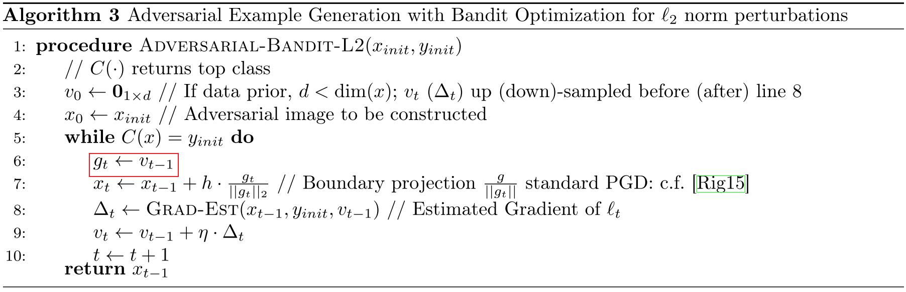

# Attack on Image Recognition

[TOC]

## Todo List

1. Kurakin, A., Goodfellow, I., and Bengio, S. Adversarial examples in the physical world. 2016. 
4. Carlini, N. and Wagner, D. Towards evaluating the robustness of neural networks. In IEEE Symposium on Security & Privacy, 2017c.
5. Evtimov, I., Eykholt, K., Fernandes, E., Kohno, T., Li, B., Prakash, A., Rahmati, A., and Song, D. Robust Physical World Attacks on Deep Learning Models. 2017.
6. Tom B Brown, Dandelion Man´e, Aurko Roy, Mart´ın Abadi, and Justin Gilmer. Adversarial patch. arXiv preprint arXiv:1712.09665, 2017.
7. Danny Karmon, Daniel Zoran, and Yoav Goldberg. Lavan: Localized and visible adversarial noise. arXiv preprint arXiv:1801.02608, 2018.
8. Zuxuan Wu, Ser-Nam Lim, Larry Davis, and Tom Goldstein. Making an invisibility cloak: Real world adversarial attacks on object detectors. arXiv preprint arXiv:1910.14667, 2019.
9. Cassidy Laidlaw and Soheil Feizi. Functional adversarial attacks, 2019
10. Mahmood Sharif, Sruti Bhagavatula, Lujo Bauer, and Michael K Reiter. Adversarial generative nets: Neural network attacks on state-of-the-art face recognition. arXiv preprint arXiv:1801.00349, 2017.
11. Anish Athalye, Nicholas Carlini, and David Wagner. Obfuscated gradients give a false sense of security: Circumventing defenses to adversarial examples. arXiv preprint arXiv:1802.00420, 2018.
12. advbox
13. paddlepaddle 对抗工具箱
14. Stealthy Porn: Understanding Real-World Adversarial Images for Illicit Online Promotion
15. Stealing Hyperparameters in Machine Learning
16. Phantom of the ADAS: Securing Advanced Driver-Assistance Systems from Split-Second Phantom Attacks
17. Text Captcha Is Dead? A Large Scale Deployment and Empirical Study
18. A Tale of Evil Twins: Adversarial Inputs versus Poisoned Models
19. Adversarial Sensor Attack on LiDAR-based Perception in Autonomous Driving
20. Privacy Risks of Securing Machine Learning Models against Adversarial Examples
21. Procedural Noise Adversarial Examples for Black-Box Attacks on Deep Convolutional Networks
22. Seeing isn’t Believing: Towards More Robust Adversarial Attack Against Real World Object Detectors
23. Model-Reuse Attacks on Learning Systems
24. A. Ilyas, L. Engstrom, A. Athalye, and J. Lin, “Black-box adversarial attacks with limited queries and information,” in ICML, 2018.
26. Yue Zhao, Hong Zhu, Ruigang Liang, Qintao Shen, Shengzhi Zhang, Kai Chen, "Seeing isn’t Believing: Towards More Robust Adversarial Attack Against Real World Object Detectors", CCS 2019
24. Adversarial examples are not bugs, they are features

## 范数

> （**向量**）范数在对抗样本、模型可解释性等方向经常遇到，主要用来限制扰动的“形状”和范围，本人经常是看一次忘一次，故将这个知识点列在最前面；

### 向量范数

#### 0-范数

向量元素修改的个数

#### 	1-范数

向量元素绝对值之和：$\lVert \mathbf{x} \rVert_1 = \sum_{i=1}^N |x_i|$；

#### 	2-范数

向量的欧几里得长度：$\lVert \mathbf{x} \rVert_2 = \sqrt{\sum_{i=1}^N x_i^2}$；

#### 	无穷范数

(1) $\infty$-范数，向量元素绝对值中的最大值：$\lVert \mathbf{x} \rVert = \max_i{|x_i|}$；

(2) $-\infty$-范数，向量元素绝对值中的最小值：$\lVert \mathbf{x} \rVert = \min_i{|x_i|}$；

#### 	p-范数

向量元素绝对值的 **$p$ 次方和**的 **$p$ 次幂**：$\lVert \mathbf{x} \rVert = (\sum_{i=1}^N |x|^p)^{\frac{1}p}$；

### * 矩阵范数

#### 	1-范数

矩阵**列向量**绝对值之和的最大值：$\lVert \boldsymbol{A} \rVert_1 = \max_j \sum_{i=1}^m |x_{i,j}|$；

#### 	2-范数

$\lVert \boldsymbol{A} \rVert_2 = \sqrt{\lambda_{max}}$，其中$\lambda_{max}$ 是 $\boldsymbol{A}^T \boldsymbol{A}$ 的最大特征值；

#### 	无穷范数

矩阵**行向量**绝对值之和的最大值：$\lVert \boldsymbol{A} \rVert_\infty = \max_i \sum_{j=1}^N |a_{i,j}|$

### 参考链接

- 知乎回答：https://www.zhihu.com/question/20473040

## Intriguing properties of neural networks

### Contribution

1. 首次提出了对抗样本（Adversarial Examples）概念；

### Notes

1. 生成对抗样本：添加一个扰动，使得原始输入的分类变成目标输入，且保证添加的扰动的 `2-范数` 最小；

   

   作者通过 梯度下降法求解损失函数最小化 来实现上述对抗样本生成：

   

2. 文章提到的几个要点：

   (1) 神经网络隐层的语义：神经网络某个隐藏层中携带的语义信息并不只在单个神经元中，而是这个隐层所表示的整个空间（线性关系）；作者通过 Word Embedding 举例说明了这个观点，词向量之间的距离代表了两个词之间的语义相似性，并且对词向量进行旋转变换后这部分语义并不会消失，但是词向量则完全发生了改变；

   (2) 对抗样本的普遍存在性；

   (3) 对抗样本的迁移性：同一个对抗样本可能在不同的模型上都可以使模型错误分类；

   (4) 对抗样本具有跨数据集的泛化能力：在 $D_1$ 数据集训练的模型 $A$ 上生成的对抗样本可能使得 $D_2$ 数据集训练的模型 $B$ 错误分类；

### Links

- 论文链接：[Szegedy C, Zaremba W, Sutskever I, et al. Intriguing properties of neural networks[J]. arXiv preprint arXiv:1312.6199, 2013.](https://arxiv.org/abs/1312.6199)

- 前人笔记：[Jun Tao 的个人博客](https://tanjuntao.github.io/2019/07/10/%E8%AE%BA%E6%96%87%E9%98%85%E8%AF%BB%E7%AC%94%E8%AE%B0%EF%BC%9AIntriguing-Properties-of-Neural-Network/)

## Explaining and Harnessing Adversarial Examples

### Contribution

1. 提出了对抗样本存在的**线性解释**；
2. 首次提出了**对抗训练**的防御方法；

### Notes

1. 线性解释：作者提出了对抗样本存在的**线性解释**。如果将神经网络泛化成如下所示的**线性**点积形式：

   

   其中 $\tilde{x}$ 为目标类的一个样本，$x$ 为原始样本，$\eta$ 为添加的对抗扰动。当输入的维度无限扩大时，很显然我们可以保证 $\lVert \eta \rVert_\infty$ 很小的情况下，而点积后的值却变化很大，使得上式两侧的值相等，即生成了一个成功的对抗扰动；

2. 对抗样本生成算法：作者提出了基于对抗样本线性解释的快速对抗样本生成算法，**Fast Gradient Sign Method（FGSM）生成对抗样本只需要计算一次梯度，然后在梯度上走一小步**：

   

3. 对抗训练：作者提出了在深度神经网络中可以通过对抗训练的方法来防御对抗攻击。下面利用 FGSM 进行对抗训练：

   

   公式的含义为，**在训练网络的过程中，不仅要保证现有样本能够被成功分类，对于那些添加了一小步的对抗样本应该同样被正确分类**；

4. 泛化原因：作者解释**对抗样本的存在位置并不是一个特定的点，而是一个区域，或称为子空间**。由于子空间的这个属性，以及深度学习模型对训练集拟合的相同效果，可能出现了**对抗样本子空间的重叠，使得对抗样本可以在不同的模型之间进行迁移**；

### Links

- 论文链接：[Goodfellow I J, Shlens J, Szegedy C. Explaining and harnessing adversarial examples[J]. arXiv preprint arXiv:1412.6572, 2014.](https://arxiv.org/abs/1412.6572)
- 论文代码：https://github.com/lisa-lab/pylearn2/tree/master/pylearn2/scripts/papers/maxout
- 前人笔记：https://zhuanlan.zhihu.com/p/32784766

## ZOO: Zeroth Order Optimization Based Black-box Attacks to Deep Neural Networks without Training Substitute Models

### Contribution

1. 提出了第一个基于梯度估计的黑盒优化攻击算法；
2. 针对梯度估计过程中需要大量访问黑盒模型的问题，提出了 3 中可行的缓解方法（<u>访问次数依然很大</u>）；

### Notes

1. 作者提出了一种**针对黑盒的优化攻击（Optimization Attack）算法**；

2. Introduction：（<u>文章比较早，故作者用较多的篇幅介绍了对抗攻击领域的工作</u>）

   (1) 白盒攻击算法：FGSM（Fast Gradient Sign Method），JSMA（Jacobian-based Saliency Map Attack），DeepFool，Carlini & Wagner (C&W) Attack；

   (2) 本文攻击场景：攻击黑盒模型，攻击者只知道输入和相应的输出；

   (3) 对抗攻击防御：Detection-based Defense，Gradient and Representation Masking，Adversarial training；

   > 企业更加看重黑盒攻击和防御，所以如果以工作为目标的同学，需要多学习、思考这方面的内容

3. ZOO 攻击算法：

   (1) 借鉴 C&W Attack，将生成对抗样本的过程转换成一个最优化问题：

   

   ​	其中 $f(x,t)$ 为损失函数；

   (2) 损失函数：

   - 有目标攻击的损失函数如下：

     

   - 无目标攻击的损失函数如下：

     

   (3) 零阶优化：

   - 一阶导数估计：

     

   - 二阶导数估计：

     

     其中 $h$ 为一个极小的固定值，文章中作者取 $0.0001$，$e_i$ 为只有第 $i$ 个值为 $1$ 的矩阵。如果输入的矩阵（图像）含有 $p$ 个像素点的话，那么通过作者的方法需要访问模型 $2p$ 次。

   (4) Stochastic Coordinate Descent：（<u>直译过来为”随机坐标下降”</u>）随机从输入中挑选一个点，使用梯度下降算法进行修改；

   - Stochastic Coordinate Descent：

     

   - ZOO-ADAM：

     

   - ZOO-Newton：

     

     作者实验中发现，ADAM 比 Newton 生成对抗样本来得更快；

   (5) 缩小迭代空间：为了减少 ZOO 的 Query 数量，从而加快算法的运行。大致的思想是进行**对抗扰动特征空间的映射**，定义一个 （更小的）扰动特征空间 $\mathbb{R}^p$ 和特征映射函数 $D(\cdot)$，那么转换（原特征空间-像素空间的）最优化问题为扰动特征空间的最优化问题：

   

   其中 $y$ 表示在扰动特征空间的对抗扰动；作者提到的特征映射方法有 Up-Sampling （升采样） 和 DCT（时频变换）；

   (6) 分层递进攻击：前一个方法可以大大减小对抗样本的搜索空间，但是由于搜索空间的受限，会导致无法生成成功的对抗样本的问题。大致的思想是定义**多个**对抗扰动特征空间的映射 $D_1(\cdot), D_2(\cdot), \dots$，攻击过程中首先使用 $D_1$ 生成对抗样本，如果在一定轮数后仍未生成成功的对抗样本，那么将最后一轮的样本转换到 $D_2$ 的特征空间（**后面使用的特征空间应保证比前面的特征空间更广**），继续生成对抗样本。

   (7) 重要像素点优先迭代：作者虽然缩小了查询的特征空间（$32*32*3 \text{ for example}$），但是在这个空间中生成对抗样本还是需要花费大量的 Query 次数，并且不一定能够生成成功的对抗样本。大致的思想是**将图像切块，分块定义像素点被随机采样的概率，概率的大小和区域中像素值的变化大小成正相关**。作者给出了大致的采样概率变化示意图：

   

   作者指出在小的扰动空间时，并不采用这种优先采样算法；

4. Evaluation 1：

   (1) 实验 1 的目标：这是第一个在黑盒模型上做的优化攻击，所以作者的目标是和已有的白盒攻击（C&W Attack）和迁移攻击（CleverHans）做对比，希望能够达到这样的效果：

   - 攻击的成功率和添加的对抗扰动大小能够和白盒攻击算法相近；
   - 攻击的成功率应该远优于迁移攻击；

   (2) 黑盒模型：

   

   (3) 样本数量：

   - 有目标攻击，生成 900 个对抗样本；（其他细节见原文）
   - 无目标攻击，生成 200 个对抗样本；

   (4) 实验结果：

   

5. Evaluation 2:

   (1) 实验 2 目标：作者尝试将这种攻击运用在更大的模型上，并且探讨文章提出的缓解方法的作用；

   (2) 黑盒模型：Inception-V3;

   (3) 实验设定：

   - 无目标攻击：

     生成150张对抗样本；保证每张对抗样本的大小都大于 $299*299$；不使用分层递进方法，只使用一个 $32*32*3$ 的对抗扰动域进行攻击；限制算法的迭代轮数为 1500 轮（$1500*128$ 次 Query）；

   - 有目标攻击：

     只选择了一张在无目标攻击中无法成功攻击的样本；扩大对抗扰动域为 $64*64*3$ 和 $128*128*3$；最大迭代轮数上升为 20000 轮（$20000*128$ 次 Query）；（<u>可以看到，黑盒下面的 Query 数量是十分惊人的</u>）

   (4) 实验结果：

   - 无目标攻击：

     

   - 有目标攻击：

     

### Links

- 论文链接：[Chen P Y, Zhang H, Sharma Y, et al. Zoo: Zeroth order optimization based black-box attacks to deep neural networks without training substitute models[C]//Proceedings of the 10th ACM Workshop on Artificial Intelligence and Security. 2017: 15-26.](https://arxiv.org/abs/1708.03999)
- 论文代码：https://github.com/IBM/ZOO-Attack
- C&W Attack 代码：https://github.com/carlini/nn_robust_attacks
- CleverHans：https://github.com/cleverhans-lab/cleverhans

## Synthesizing Robust Adversarial Examples

### Contribution

1. 提出了一种增加物理环境下对抗样本鲁棒性的一般化方法 EOT；
2. 不仅在 2D 下测试，而且在 3D 下测试；
3. **模拟物理变换**的想法十分具有借鉴意义，已被后续的对抗攻击算法广泛使用；

### Notes

1. **白盒**的、**针对物理环境**下的、**有目标**的对抗攻击算法。攻击的算法不仅在 2D 下可行，同时在 **3D** 下也可以生成成功的对抗样本；

2. 已有的对抗攻击算法，训练的目标如下：

   

   但是这样生成的对抗样本，在视角等物理环境发生改变时**无法保持对抗性**。故作者提出改进后的训练目标 **EOT (Expectation Over Transformation)**：

   

   其含义是，**在保证对抗样本经过物理变换的 “感受” 修改量在一定范围内时，使得对抗样本（经过物理变换）能够尽可能地被分类为目标类别**。这类物理变换可以是 2D/3D 的变换，包括随机旋转、平移、噪声、视角变化、光照等。作者将公式转换为 [Carlini &Wagner (2017c)](https://arxiv.org/abs/1608.04644) 的形式，并使用**二级范数**和 **PGD** (Projected Gradient Descent) 优化器进行计算：

   

   其中 *LAB* 代表指的是 [LAB 色域](https://blog.csdn.net/gdymind/article/details/82357139) 。

3. Distributions of Transformations:

   (1) **2D Case**

   

   (2) **3D Case**

   

   (3) **Physical Case**

   

4. Evaluation：

   (1) 攻击基于数据集 ImageNet 的 **Inception V3** 模型 (`Top-1 Accuracy = 78.0%`)，随机选择目标分类；

   (2) **Robust 2D adversarial examples**：在 2D 下考虑的物理变换有 **缩放 、旋转、亮度调节、高斯噪声和平移**。每个样本都在 **1000** 个随机的模拟物理变换上进行测试，结果如下：

   

   (3) **Robust 3D adversarial examples**：在 3D 下考虑**不同的相机距离、照明条件、对象的平移和旋转以及纯色背景色**。挑选了 10 个 3D 模型 —— 木桶、棒球、够、橘子、海龟、小丑鱼、沙发、泰迪熊、汽车和出租车。每个 3D 模型都挑选 20 个随机的目标分类标签；每个样本都在 100 个随机的模拟物理变换上进行测试，结果如下：

   

   (4) **Physical adversarial examples**：在 3D 的基础上，考虑**摄像机的噪声、照明的影响和颜色的失真**。作者考虑将 ”海龟“ 错误分类成 ”手枪“、 ”棒球“ 错误分类成 ”咖啡“ 两种情况，将对抗样本经过 3D 打印后，拍 100 张照片进行测试，结果如下：

   

   (5) **Perturbation budget**：在物理环境下越鲁棒，需要模拟更多的物理变换，添加的噪声也会更多；

### Links

- 论文链接：[Athalye, Anish, et al. "Synthesizing robust adversarial examples." *International conference on machine learning*. PMLR, 2018.](https://arxiv.org/abs/1707.07397)
- 开源代码：[prabhant/synthesizing-robust-adversarial-examples (github.com)](https://github.com/prabhant/synthesizing-robust-adversarial-examples)

## *Semantic Adversarial Examples

### Contribution

1. 通过修改 HSV 色域，生成对抗样本；

### Notes

1. 图像语义对抗样本（Semantic Adversarial Examples）：将问题定义如下

   

   其中，$\Omega$ 表示人的视觉系统；

2. 方法：将图像从 RGB 色域转换到 HSV 色域，通过对全图修改 H（Hue，色相） 和 S（Saturation，饱和度）的值来生成对抗样本，算法如下

   

3. 实验结果：（<u>感觉更像是不同分布导致网络的预测结果差，另外，采用的是 CIFAR-10 数据集可能也是原因之一，使用更加高清的图片集可能会没有这么好的效果</u>）

   

   

### Links

- 论文链接：[Hosseini H, Poovendran R. Semantic adversarial examples[C]//Proceedings of the IEEE Conference on Computer Vision and Pattern Recognition Workshops. 2018: 1614-1619.](https://arxiv.org/abs/1804.00499)
- 代码链接：https://github.com/HosseinHosseini/Semantic-Adversarial-Examples

## GENERATING NATURAL ADVERSARIAL EXAMPLES

### Contribution

### Notes

### Links

- 论文链接：[Zhao Z, Dua D, Singh S. Generating natural adversarial examples[J]. ICLR 2018](https://arxiv.org/abs/1710.11342)

## NES: Black-box Adversarial Attacks with Limited Queries and Information

### Contribution

1. 利用 NES 算法大大**减少黑盒攻击的访问次数**；

### Notes

1. 黑盒设定：

   - Query-limited Setting: 限制访问次数 ;
   - Partial-information Setting: 只知道 Top-K 的结果 (包括概率);
   - Label-only Setting: 只知道 Top-K 的标签 (不包括概率); (<u>这一项我觉得没必要看</u>)

2. ⭐ NES (Natural Evolutionary Strategies) 进行梯度估计: 最小化期望的损失大小, 算法伪代码如下 (<u>如何挑选这个参数?</u>)

   

3. PGD (Projected Gradient Descent) 进行梯度更新，实现**有目标的对抗攻击**:

   

   （<u>这个公式有歧义：这里明显是一个梯度下降算法，期望损失函数值变得更小，所以这里 $g_t$ 表示的是损失函数的梯度，而不是 $2$ 中梯度——表示的是目标分类概率的梯度，这一点可以在程序的代码中验证。</u>）

4. 仅知道 Top-K 的概率:

   

   - 使用目标分类的样本来初始化扰动，从而减少 query 的数量；
   - 在保证目标分类在 Top-K 中的前提下，不断缩小对抗扰动，直至生成对抗样本且满足修改量的限制；

5. Evaluation：

   (1) 参数的选择：

   

   (2) On ImageNet：这里大概的 query 数量级为上万级别的

   

### Links

- 论文链接: [Ilyas, Andrew, et al. "Black-box adversarial attacks with limited queries and information." *PRML* (2018).](https://arxiv.org/abs/1804.08598)
- 论文代码: https://github.com/labsix/limited-blackbox-attacks
- NES原理: [Lil‘Log - Evolution Strategies](https://lilianweng.github.io/lil-log/2019/09/05/evolution-strategies.html#natural-evolution-strategies)

## Generating Adversarial Examples with Adversarial Networks

#### Contribution

1. 使用 GAN 网络的方法可以**快速**生成一些逼真的对抗样本；
2. 实验中生成成功对抗样本的最大概率为 $98\%$（在白盒情况下 MNSIT 模型）；
3. <u>生成的样本不一定是一个对抗样本，如果要用来做对抗训练的话需要经过目标模型的验证</u>；
4. <u>使用 GAN 来生成对抗样本还是比较有意思的一个点，但是实际的价值可能并不大</u>；

#### Notes

1. 作者提出了一种使用 GAN 生成对抗样本的算法，可以在白盒、黑盒情况下进行有目标攻击；

2. ⭐ AdvGAN 架构：

   

   从架构中可以看出，整个网络通过判别模型保证生成的样本更像”真实“的样本，通过分类模型来保证生成的样本能够被错误分类为目标样本，再结合（图中没有画出的）扰动应该尽可能小，这三个部分一起构成了 `Generator` 的损失函数 $\mathcal{L}=\alpha\mathcal{L}_{GAN}+\mathcal{L}_{adv}^f+\beta\mathcal{L}_{hinge}$：

   - 保证样本的真实性：

     

   - 保证样本的目标分类：

     

   - 保证样本的扰动大小：

     

3. ⭐ 蒸馏模型（本质上是 **替代模型**）：如上所示，如果要训练一个 AdvGAN 网络，就需要有一个目标分类模型，但是在黑盒的情况下，我们无法得到目标模型的损失。面对这个问题，作者的想法是使用 **蒸馏(distill)模型** 的方法，即在一个数据集中，训练一个本地模型使得：

   

   其中 $f(x)$ 是本地模型的输出概率，$b(x)$ 是目标模型的输出概率，$\mathcal{H}(\cdot)$ 常用交叉熵损失函数；由于涉及到蒸馏模型和原始模型的相似程度，所以作者提出了一个动态训练蒸馏模型的方法（<u>实际上和本身训练一个 GAN 网络的方法是一样的</u>）：

   - 固定分类模型 $f_{i-1}$ ，训练判别器 $\mathcal{D}_i$ 和生成器 $\mathcal{G}_i$：$\arg\min_\mathcal{G}\max_\mathcal{D}{\alpha\mathcal{L}_{GAN}+\mathcal{L}_{adv}^{f_{i-1}}+\beta\mathcal{L}_{hinge}}$ ；
   - 固定生成器 $\mathcal{G}_i$，继续训练分类模型 $f_i$：$\arg\min_f\mathbb{E}_x\mathcal{H}(f(x), b(x)) + \mathbb{E}_x\mathcal{H}(f(x+\mathcal{G}_i(x)), b(x+\mathcal{G}_i(x)))$；

   > 👎 用蒸馏模型的方法来训练一个 替代模型 的想法，然后用于对抗样本生成是十分**耗费 Query 数量**的。我作为一个攻击者，看到这么大的代价，可能会选择使用本地语料训练模型然后生成对抗样本；

4. 实验：

   (1) 数据集：MNIST 和 CIFAR-10；

   (2) 参数设置：

   - 使用 C&W 损失函数；
   - 损失范围使用无穷范数，在 MNIST 上的大小为 $0.3$ ，在 CIFAR-10 上的大小为 $8$；

   (3) 实验结果：

   

   - 白盒攻击下的攻击成功率达到了 $95\%$；

   - 同一张原始图片针对 **不同的目标类别生成** 的对抗样本在视觉上的区别不大；（👎 <u>讲到 ”**不同的目标类别生成**“ 这一点，我们回过头来审视一下 分类目标损失函数，可以发现我们训练的模型只能生成一个目标分类，所以这种方法的一个缺点在于对于不同的目标分类需要训练不同的 GAN 网络</u>）

     

   - 动态训练蒸馏模型的效果大大优于静态训练蒸馏模型；

5. 针对对抗训练的防御方法：

   (1) 对抗训练的算法：

   - FGSM Adversarial Training (简称 **Adv.**)；
   - Ensemble Adversarial Training (简称 **Ens.**)；
   - Iterative Training (简称 **Iter.Adv.**)；

   (2) 👎 参照的对抗样本生成算法：FGSM 和 C&W Attack (文章中称为 **Opt.**)；

   > 我觉得这样进行对比，在一定程度上是不合理的。首先我们来看这些对抗训练算法，本身就是用来针对 **单次迭代和多次迭代生成算法** 进行加强训练的，故通过这样得到的模型本身对 FGSM 和 C&W Attack 是更加容易攻击的，即 AdvGAN 在这个测试上面有一些天然优势，在最后的测试结果上多几个点也（大体上）是理所当然的。转过来想，我们可能会更加希望看到这样的结果：**即使防御者知道我们用的是怎样的对抗攻击算法，但是他都无法用对抗训练的方法把我们防御住，那么这就是一个好的对抗攻击算法**。

   (3) 白盒上的结果：AdvGAN 的效果来得稍微好一些，但是不明显；（<u>另外，我认为这个结果就不是很合理，或者说作者对实验的设置交代的不够清楚。用了对抗训练以后，我们的模型就可以防御 C&W Attack 了？我觉得不是这样的吧，你用梯度下降的方法，多迭代几轮，增大一些扰动肯定是可以找到对抗样本点的。对抗训练无非是限制了模型在训练数据点处的概率分布，从而能够在整体上增加对抗算法生成样本的难度，但是并不能从根本上改变模型不同类别间存在边界这个固有的特点，通过梯度下降的方法一定是可以越过这个边界的。</u>）

   

   (4) 黑盒上的结果：

   

6. 用户调查：调查结果说明生成的样本还是很难发觉的，并且和真实的图片相似；

#### Links

- [Xiao C, Li B, Zhu J Y, et al. Generating adversarial examples with adversarial networks[J]. arXiv preprint arXiv:1801.02610, 2018.](https://arxiv.org/abs/1801.02610)

## * Prior Convictions: Black-Box Adversarial Attacks with Bandits and Priors

### Contribution

1. 在 NES 的基础上，通过**减小查询空间（图像相邻点的梯度相似）**来减少 Query 的次数；
2. 这篇文章本身再减少 Query 上面没什么亮点，但是它对于 **“梯度估计正确率与对抗样本成功率”** 和 **“先验梯度知识”** 的分析是比较有意思的地方；

### Notes

2. ⭐ 梯度估计正确率与对抗样本成功率的关系：

   - 问题：在黑盒攻击的情况下，正确估计多少比率的梯度才能保障白盒算法（PGD）成功攻击目标模型？

   - 实验结果：使用单步 PGD 生成对抗样本的情况下，只要有 **20%** 的梯度被正确赋值，就有 **60%** 的成功率；

   

3. ⭐ 先验（prior）梯度知识：

   (1) Time-dependent Priors：如下图 2 中所示，**连续两步之间的梯度之间存在高度的余弦相关性**（数据中，这个余弦相关性高达 0.9）；

   

   (2) Data-dependent Priors：如上图 3 中所示，在图像中，**相近的像素点之间存在相似的梯度**；

3. 算法：

   (1) 框架：梯度估计 + 梯度更新；

   

   (2) 梯度估计：（这部分其实就和 NES 算法一样，不一样的地方在于这个算法每轮只产生一对样本）

   

   其中第 $6$ 行写的前后矛盾，以后半个式子为准；

   (3) 梯度更新：

   - 梯度上升（Gradient Ascent）法：（<u>离谱</u>）

   

   - 指数梯度（Exponentiated Gradients）更新法：

     

   (4) 图像识别，$l_2$ 范数约束下的实例：

   

5. 使用的参数：

   
   
   为什么 $l_\infty$ 情况下的学习率会这么大？
   
5. 实验结果：

   

### Links

- 论文链接：[Ilyas A, Engstrom L, Madry A. Prior convictions: Black-box adversarial attacks with bandits and priors[J]. arXiv preprint arXiv:1807.07978, 2018.](https://arxiv.org/abs/1807.07978)
- 论文代码：
- 官方审稿意见：https://openreview.net/forum?id=BkMiWhR5K7

> 吐槽一下：这篇文章就**离谱**！
>
> 创新性上面，我觉得就是在NES上面添加了一个局部降采样，没啥突出的地方（分析的地方确实是有意思的）。
>
> 公式上面，你看这个公式里面，$g_t$ 有个啥用啊？**离谱**！再看这个公式的错误，那个第 **6** 行？**离谱**！然后你看这个有目标攻击配合上loss梯度上升法（它的程序里面是对的）？**离谱**！关键是这个错误你再和 NES 文章的那个错误（有目标攻击配合上目标概率梯度下降法）对比一下，就完全是同样的错误啊？**离谱**（我看了半天没看懂，回 NES 发现是同样的错误，就在想不会是同一个作者吧，结果一看真的是同一个作者）！审稿意见一致好评通过？**离谱**！
>
> 以上就是一时生气，因为这几个问题，我把两篇文章的源码都去看了一遍，感觉很浪费读者的时间。

## Hybrid Batch Attacks: Finding Black-box Adversarial Examples with Limited Queries

### Contribution

### Notes

1. 作者结合 迁移攻击（Transfer Attack） 和 优化攻击（Optimization Attack），并且利用种子优先级策略对模型进行黑盒攻击，目标是在保证攻击成功率的前提下，减少 Query 的数量；

2. 现有的梯度优化攻击算法：

   

   

### Links

- 论文链接：[Suya F, Chi J, Evans D, et al. Hybrid batch attacks: Finding black-box adversarial examples with limited queries[C]//29th {USENIX} Security Symposium (USENIX Security 2020). 2020: 1327-1344.](https://www.usenix.org/conference/usenixsecurity20/presentation/suya)
- 论文代码：https://github.com/suyeecav/Hybrid-Attack

## Reliable Evaluation of Adversarial Robustness with an Ensemble of Diverse Parameter-free Attacks

### Contribution

1. 提出了一种新的对抗攻击算法 APGD，且使得防御算法的测试变得更加自动化；
2. 提出了一种新的 loss 损失函数用于对抗样本的生成；

### Notes

1. 文章思想：

   (1) 目的：提出一个能够自动调参的，且由于现在使用交叉熵损失函数的 PGD 的自动测试框架；

   (2) PGD 存在的问题：

   - Fixed step size：步长是固定的；
   - Agnostic of the budget：算法经过一定轮数后，样本的 loss 就不再改变了，故无法用迭代的论述来衡量一个对抗攻击算法的强度；
   - Unaware of the trend：算法不知道迭代的过程是否让样本更优化，更无法对这个做出改变；

2. ⭐ **Auto-PGD 算法**：

   (1) 算法伪代码：

   

   (2) **对抗样本的更新**：和 PGD 不同之处是，文章算法更新的时候添加了一个 Momentum 操作，如下

   

   其中，$\alpha \in [0,1]$ 是动量系数，文章中使用的是 $0.75$；

   (3) **步长的更新**：如果对抗样本的迭代满足以下两个条件中的一个，则更新步长（文章中，初始化步长为 $\eta^{(0)}=2\epsilon$）

   - 条件一：如果迭代对抗样本使得其目标更优化的比率低于某个值，则更新步长；

     

     其中 $\rho$ 在文章中取值为 $0.75$，$w_j$ 是迭代轮数；

   - 条件二：如果上一轮步长迭代中未修改步长，而上一轮对抗样本的更新中目标没有得到任何优化，则更新步长；

     

   (4) **从最优点继续迭代**：每次更新步长后，都将对抗样本置为前面的最优结果，再进行迭代，即

   

   (5) **步长检查的迭代轮数选择**：

   

   

   其中，$p_0=0,\ p_1=0.22$ ；

   (6) 实验效果：这里使用的对比算法是带有 Momentum 的 PGD 算法；

   

3. ⭐ **DLR 损失函数**

   (1) 交叉熵损失函数存在的问题：这边的交叉熵损失函数，实际上在程序中是 Softmax-交叉熵损失函数。正是由于 softmax 函数的存在，导致对抗样本生成过程中，如果原始样本的分类十分接近0，就很难产生一个有效的梯度。作者的实验如下

   

   (2) DLR (Difference of Logits Ratio) 损失函数：作者提出了一个新的损失函数，如下

   

   其中，$\pi_1$ 和 $\pi_3$ 指的是概率降序排序后的第一、第三个概率值；

### Links

- 论文链接：[Croce F, Hein M. Reliable evaluation of adversarial robustness with an ensemble of diverse parameter-free attacks[C]//International Conference on Machine Learning. PMLR, 2020: 2206-2216.](https://arxiv.org/abs/2003.01690)
- 论文代码：https://github.com/fra31/auto-attack

## WITCHcraft: Efficient PGD attacks with random step size

### Contribution

1. 提出随机化学习率能够更好地生成对抗样本；

### Notes

1. 在 PGD 的基础上，每一步学习率都随机选取，算法如下：

   

2. 实验结果

   (1) 和 PGD 方法相比，效果更好：

   

   

   (2) 不同的学习率区间对结果的影响：

   

### Links

- 论文链接：[Chiang P Y, Geiping J, Goldblum M, et al. Witchcraft: Efficient pgd attacks with random step size[C]//ICASSP 2020-2020 IEEE International Conference on Acoustics, Speech and Signal Processing (ICASSP). IEEE, 2020: 3747-3751.](https://arxiv.org/abs/1911.07989)

## An Alternative Surrogate Loss for PGD-based Adversarial Testing

### Contribution

1. 提出了一种新的 MultiTargeted 攻击方法；

### Notes

1. 形式化 PGD 算法：

   

   这边可能影响 PGD 算法攻击性的 **因素** 有：重复执行的次数 $N_r$ ，计算梯度时使用的损失函数 $\hat{L}^{(r)}$，迭代优化器 $Opt$，噪声生成器 $SampleForm$，每轮的迭代次数 $K$，迭代的学习率 $a^{(k)}$。其中，$L$ 是用来判断对抗攻击是否成功的判别函数，对最终的结果没什么影响，可以用来控制迭代的次数，实现提早停止迭代的功能；

2. MultiTargeted Attack：主要思想是改变 restarts 过程中使用的损失函数如下：

   

   对上面伪代码的 $2\sim3$ 行进行修改：

   

   为了减小复杂性，可以把多目标限定在 $Top-K$ 中：

   

3. 实验：

   

   - 首先可以看到，MultiTargeted 方法相比于 PGD（带有 restarts）是有效的，实验中当多目标 $K=5$ 时达到了最优状态；
   - 过多的 restarts 次数对于 PGD 算法来说并不是特别有效（不过我理解的可能是每次 restart 时的随机噪声可能效果都相似，限制了 restarts 的发挥）；
   - 每一个 restart 迭代更多的次数确实能够增强 PGD 的攻击性，但是可以看到这个增加的效果并不是特别明显；

### Links

- 论文链接：[Gowal S, Uesato J, Qin C, et al. An alternative surrogate loss for pgd-based adversarial testing[J]. arXiv preprint arXiv:1910.09338, 2019.](https://arxiv.org/abs/1910.09338)

## Minimally distorted Adversarial Examples with a Fast Adaptive Boundary Attack

### Contribution

### Notes

### Links

- 论文链接：[Croce F, Hein M. Minimally distorted adversarial examples with a fast adaptive boundary attack[C]//International Conference on Machine Learning. PMLR, 2020: 2196-2205.](https://arxiv.org/abs/1907.02044)
- 论文代码：https://github.com/fra31/fab-attack

## Composite Adversarial Attacks

### Contribution

1. 像 AutoML 和 AutoAugment 一样，本文提出了一种自动搭配不同的对抗攻击基础算法和参数的 **自学习对抗攻击算法**；

### Notes

1. 文章方法：核心思想是像 AutoML 和 AutoAugment 那样让程序自动寻找更好的攻击方法和参数的搭配，以达到最优效果，搜索算法用的是 $NSGA$-Ⅱ，伪代码如下

   

   整体的流程就是首先构造一个候选集，然后在候选集中验证各种搭配的得分情况，这里得分的计算公式如下：

   

   左式用来评估算法的成功率，右式用来评估算法的复杂度；

2.  实验结果：（因为比赛的缘故，我更加关心哪种搭配能够产生最好的攻击成功率，所以 $S_{l_\infty}$ 可以参考一下）

   

### Links

- 论文链接：[Mao X, Chen Y, Wang S, et al. Composite Adversarial Attacks[J]. arXiv preprint arXiv:2012.05434, 2020.](https://arxiv.org/abs/2012.05434)
- 论文代码：https://github.com/vtddggg/CAA