# Defense on Image Recognition

[TOC]

## Todo List

- Muzammal Naseer, Salman Khan, and Fatih Porikli. Local gradients smoothing: Defense against localized adversarial attacks. In 2019 IEEE Winter Conference on Applications ofComputer Vision (WACV), pp. 1300–1307. IEEE, 2019.
- Jamie Hayes. On visible adversarial perturbations & digital watermarking. In Proceedings ofthe IEEE Conference on Computer Vision and Pattern Recognition Workshops, pp. 1597–1604, 2018.
- Anish Athalye, Nicholas Carlini, and David Wagner. Obfuscated gradients give a false sense of security: Circumventing defenses to adversarial examples. arXiv preprint arXiv:1802.00420, 2018.
- Sven Gowal, Krishnamurthy Dvijotham, Robert Stanforth, Rudy Bunel, Chongli Qin, Jonathan Uesato, Timothy Mann, and Pushmeet Kohli. On the effectiveness of interval bound propagation for training verifiably robust models. arXiv preprint arXiv:1810.12715, 2018.
- Matthew Mirman, Timon Gehr, and Martin Vechev. Differentiable abstract interpretation for provably robust neural networks. In International Conference on Machine Learning, pp. 3575–3583, 2018.
- Alexander Levine and Soheil Feizi. Robustness certificates for sparse adversarial attacks by randomized ablation. arXiv preprint arXiv:1911.09272, 2019.
- Gotta Catch’Em All: Using Honeypots to Catch Adversarial Attacks on Neural Networks
- Certified adversarial robustness via randomized smoothing

## Towards Deep Learning Models Resistant to Adversarial Attacks

> 由于时间原因，该文章的笔记借鉴自 “前人分享”（链接见下）。

### Contribution

1. Madry.
2. 建模了对抗训练过程；
3. 使用 PGD生成的对抗样本 来做**对抗训练**；

### Notes

1. ⭐ 问题建模，**从优化的角度来看模型鲁棒性问题**。深度学习中，我们经常根据下面这个目标来训练我们的网络：即我们希望我们训练得到的模型在训练样本**上**的经验损失能够达到最小。
   $$
   \min_\theta \rho(\theta), \;\; \text{where} \;\; \rho(\theta) = \mathbb{E}_{(x,y)\sim\mathcal{D}}\left[
   L(\theta, x, y)
   \right]
   $$
   但是这样的训练目标，使得模型容易受到对抗样本的攻击。故作者将对抗样本的攻击防御问题总结为以下公式，该问题原文中作者称为 **鞍点问题（saddle point problem）**，即我们希望我们训练得到的模型在训练样本**周围**的经验损失能够达到最小。
   $$
   \min_\theta \rho(\theta), \;\; \text{where} \;\; \rho(\theta) = \mathbb{E}_{(x,y)\sim\mathcal{D}}\left[\max_{\delta \in \mathcal{S}}
   L(\theta, x+\delta, y)
   \right]
   $$
   建模完问题以后，那么以前的对抗样本领域的工作就可以进行简单地分类：（<u>稍微有点绕</u>）

   - 提出一个好的对抗攻击算法，来寻找使得（内层）经验损失最大化的扰动；
   - 提出一个鲁棒性好的模型，来使得（外层）最小化（内层的最大的）经验损失；

2. 文章中作者采用投影梯度下降算法（PGD）来生成对抗样本：（<u>作者的代码中，在生成对抗样本之前，会添加均匀分布的随机噪声，然后再生成对抗样本</u>）

   

3. 实验发现：

   (1) Loss 下降趋势和对抗样本算法迭代轮数的关系：无论是原始模型还是使用对抗训练得到的模型，两者使用 PGD算法 生成对抗样本时，随着迭代轮数的上升，样本的 loss 都会上升，且到最后趋于收敛；

   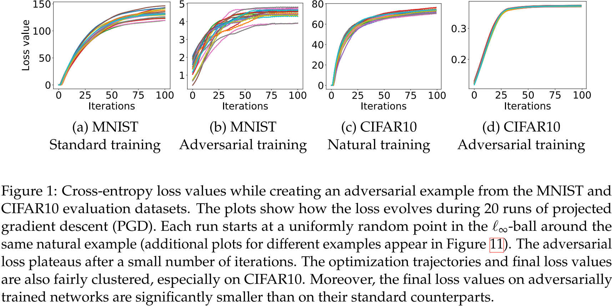

   (2) Loss 分布的差异：于原始模型相比，在对抗训练得到的模型上生成对抗样本，得到的loss更小，更集中且没有异常值；

   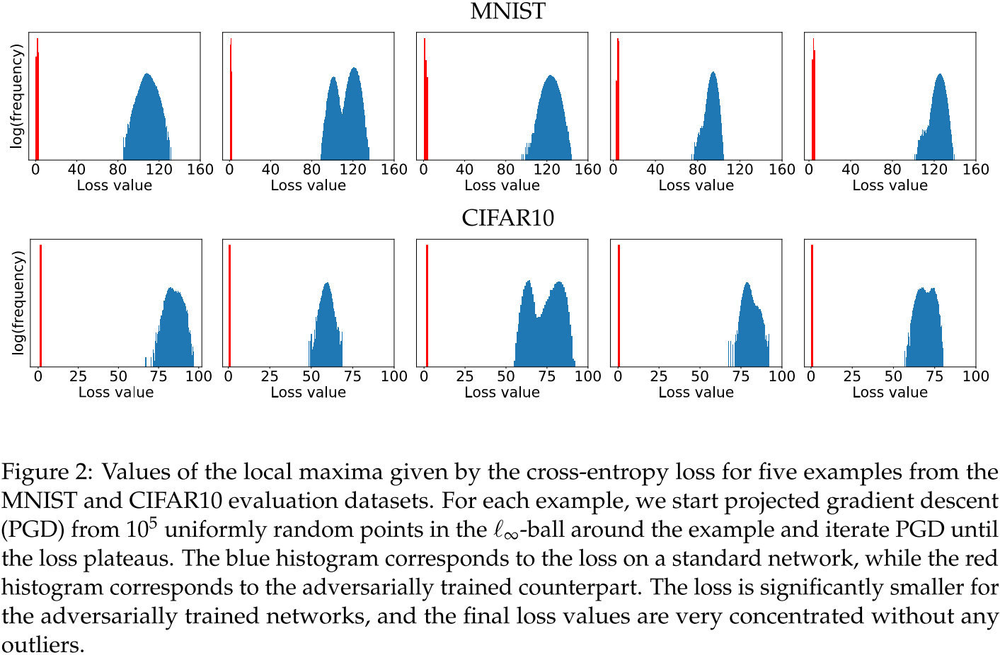

   (3) 鲁棒性与模型规模的关系：相对而言，模型越复杂，鲁棒性也越好。同时，经过对抗训练的模型，在原始任务上会有一定的损失，是因为出现了如“过拟合”的现象，使得模型在测试集上面的效果并不好；

   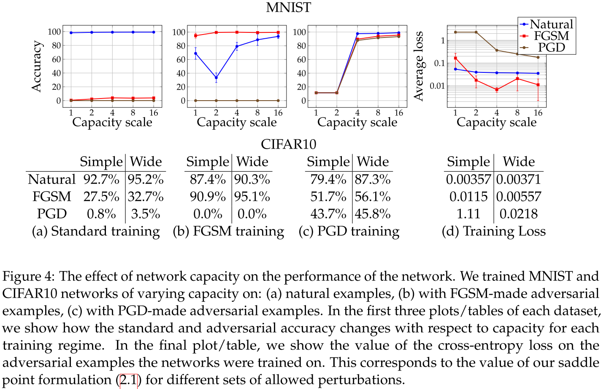

   (4) 范数限制的影响：$l_\infty$ 范数比 $l_2$ 范数成功的扰动量要小；（<u>这个对比合理吗？</u>）

   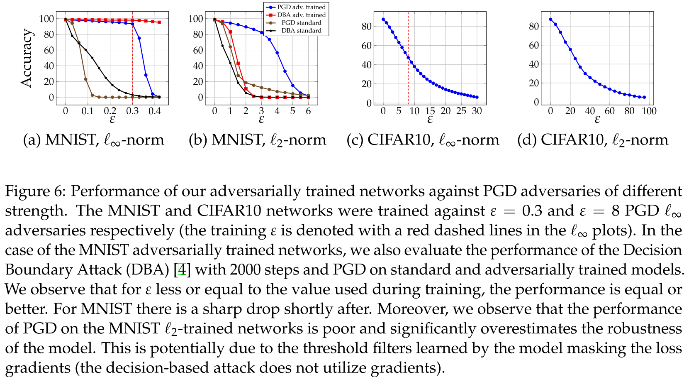

### Links

- 论文链接：[Madry A, Makelov A, Schmidt L, et al. Towards deep learning models resistant to adversarial attacks[J]. arXiv preprint arXiv:1706.06083, 2017.](https://arxiv.org/abs/1706.06083?spm=5176.12281978.0.0.5f797a4dKc7U2f&file=1706.06083)
- 论文代码 - mnist：https://github.com/MadryLab/mnist_challenge
- 论文代码 - cifar10：https://github.com/MadryLab/cifar10_challenge

> 从代码上来看，作者提供的模型的输入是 $32*32*3$ 大小的，这样经过压缩的输入维度，是否导致了对抗样本算法难以实现呢？或者说生成对抗样本的过程能否利用一下这个特点？

- 论文模型：https://github.com/MadryLab/cifar10_challenge
- 前人分享：https://zhuanlan.zhihu.com/p/45684812

# Theoretically Principled Trade-off between Robustness and Accuracy

### Contribution

1. Trades.
2. 从理论上证明了 成功率和鲁棒性 对于分类问题来说是一个权衡利弊的问题；（<u>虽然我并不太关注这个证明</u>）
3. 在理论的基础上，提出了新的对抗训练的损失函数；

### Notes

1. 文章思想：（证明部分直接忽略不看）

   (1) 文章整体的思想如下图，即为在保证模型分类准确的前提下，希望模型的边界能够离这些真实的样本远一些：

   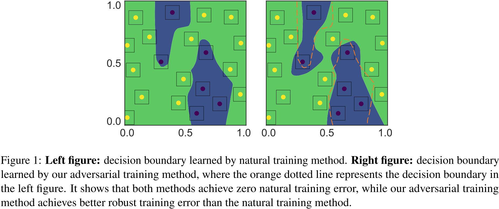

   (2) 文章中提到了 鲁棒误差（Robust Error）、自然误差（Natural Error）和 边界误差（Boundary Error）：

   - 鲁棒误差：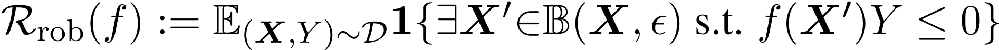

   - 自然误差：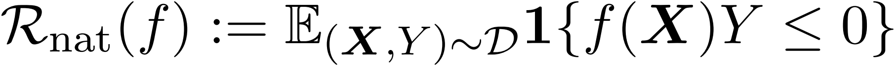

   - 边界误差：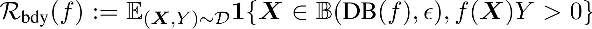

   - 三者关系：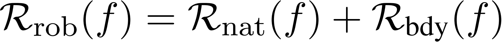

     理解起来有点困难，借鉴前人分享的图（<u>链接见下</u>）：

     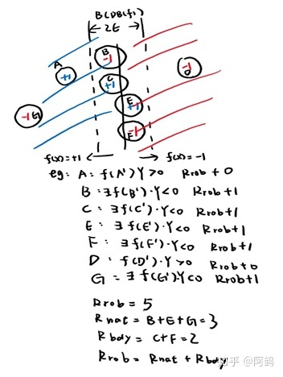

     > 画个示意图：假设中间是决策边界，A点~G点是x，外面的圈圈是给定的扰动，虚线是决策边界的边界。

2. 最优化问题：

   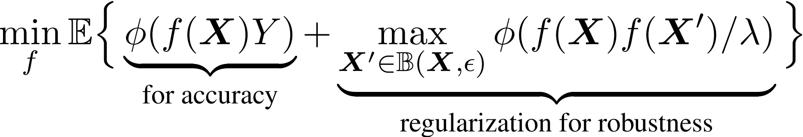

   左半部分用来保证模型的**准确性**，而右半部分则用来保证模型的**鲁棒性**；上式其实表述的是一个二分类的问题，对于多分类问题，作者修改上式为：

   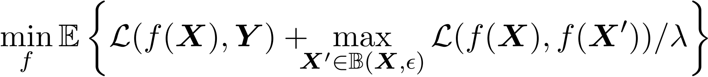

   其中 $\mathcal{L}(\cdot,\cdot)$ 为交叉熵损失函数；

3. 训练方法：

   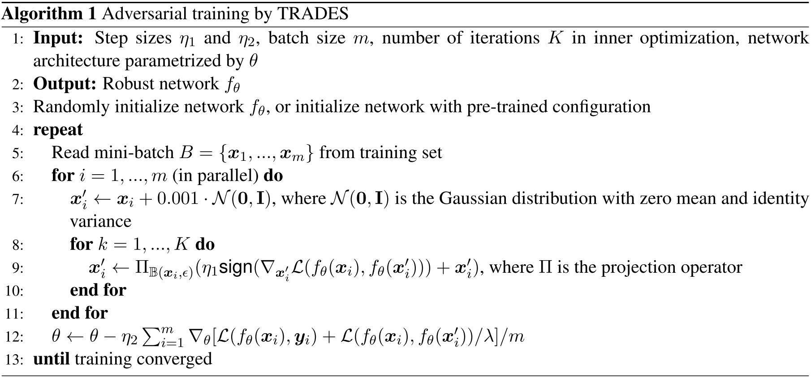

   首先在样本上面添加高斯随机噪声（[cifar10-challenge](#Towards Deep Learning Models Resistant to Adversarial Attacks) 中用的是均匀分布随机噪声），然后再利用 PGD 生成对抗样本（这里希望对抗样本的概率分布和原始概率分布能够尽可能的不同），最后微调模型。

4. 实验：

   (0) 实验评估：使用两个成功率来评估方法的好坏，为了说明实验方法即保证较高的成功率，又有很好的鲁棒性，我们应该希望实验得到的数据 $\mathcal{A}_{rob} \ and \ \mathcal{A}_{nat}$ 都比较大；
   $$
   \mathcal{A}_{rob}(f) = 1 - \mathcal{R}_{rob}(f) \\
   \mathcal{A}_{nat}(f) = 1 - \mathcal{R}_{nat}(f)
   $$
   (1) 参数 $\lambda$ 的作用：

   - 参数设置：

     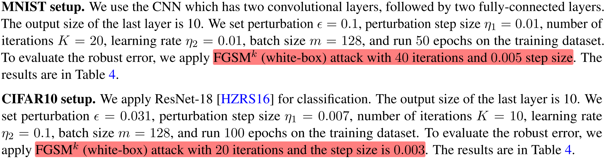

   - 实验结果：在 MNIST 上面对原始分类成功率的影响不大，但是对 CIFAR10 的影响还是比较大的。所以后面的实验中，作者分别使用 $\lambda=1\ or\ \lambda=6$，分别保证成功率和鲁棒性；

     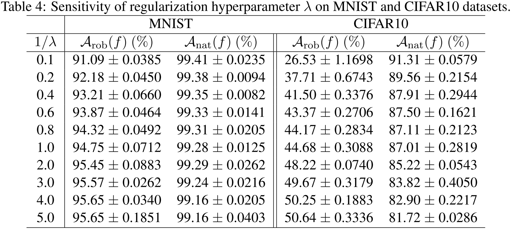

   (2) 横向对比 - 白盒攻击：

   - 参数设置：

     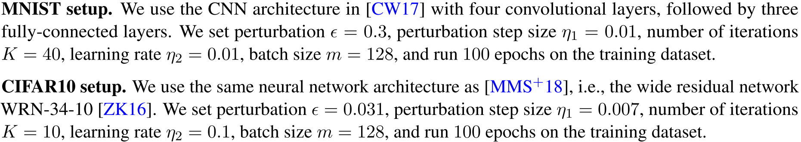

     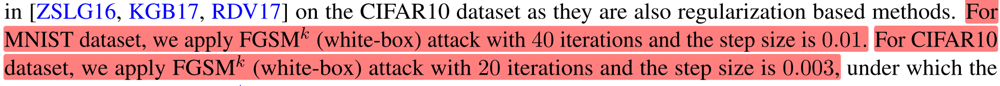

   - 实验结果：

     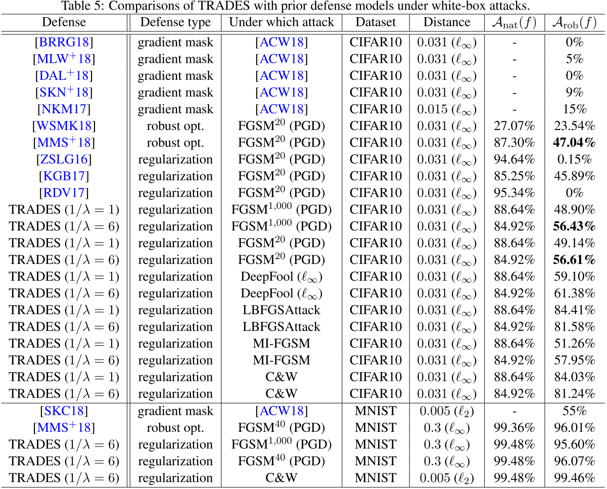

   (3) 横向对比 - 黑盒攻击：

   - 参数设置：

     

     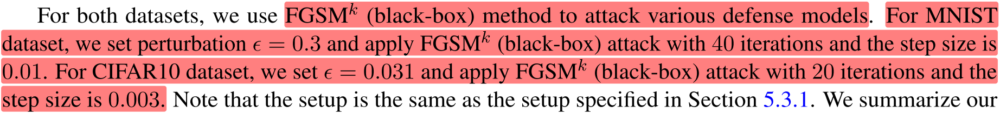

   - 实验结果：

     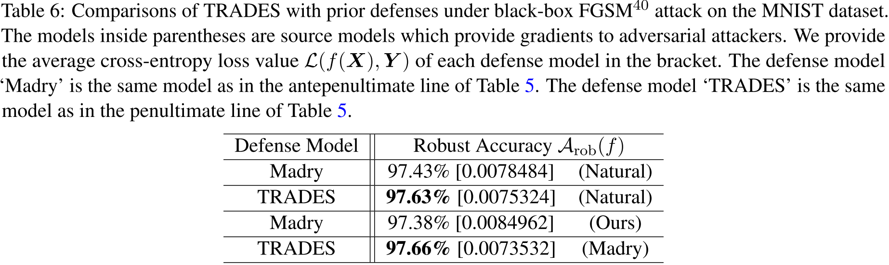

     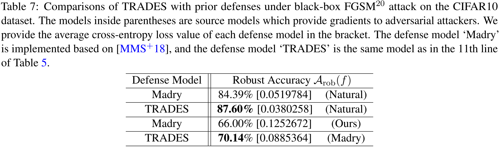

### Links

- 论文链接：[Zhang H, Yu Y, Jiao J, et al. Theoretically principled trade-off between robustness and accuracy[C]//International Conference on Machine Learning. PMLR, 2019: 7472-7482.](https://arxiv.org/abs/1901.08573?spm=5176.12281978.0.0.5f793e46VQJsFW&file=1901.08573)
- 论文代码：https://github.com/yaodongyu/TRADES
- 前人分享：https://zhuanlan.zhihu.com/p/337989683

# Unlabeled Data Improves Adversarial Robustness

### Contribution

1. RST.
2. 在 [TRADES](#Theoretically Principled Trade-off between Robustness and Accuracy) 的基础上修改了损失函数，添加了无标签数据；
3. 文章给我的感觉是，就是利用更多数据来训练网络，不过这个数据可以是无标签的数据，这样的话就不需要进行大量的认为标注；

### Notes

1. 训练方法：（证明部分直接忽略不看）

   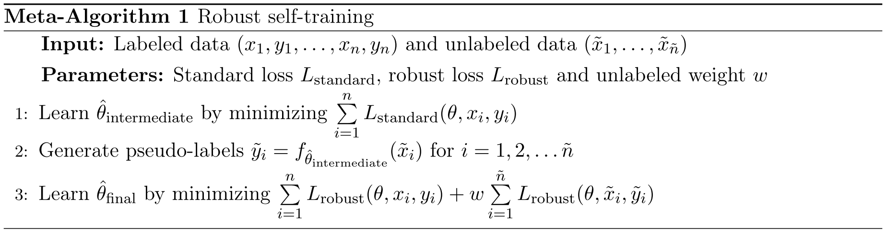

   - 首先使用有标签数据训练网络，这里使用 standard loss 为：

     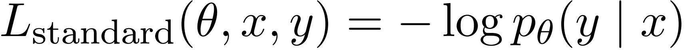

   - 使用训练好的网络，标记无标签的数据；

   - 使用有标签和“自标签”的数据继续训练网络，这里使用 robust loss 为：

     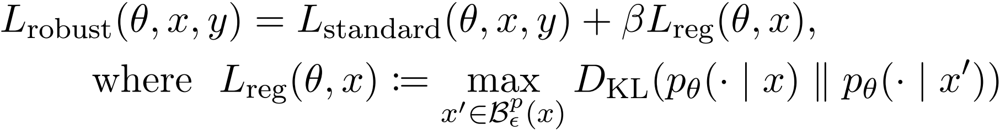

     这里又到了经典的如何拟合 $L_{reg}(\theta, x)$ 项（因为寻找邻域内的最大值太困难），作者提出了两种方法：

     - **Adversarial Training**：使用 PGD 获取邻域最大值

       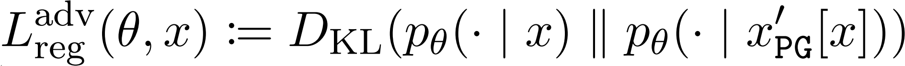

     - **Stability Training**：使用 高斯分布 采样邻域的值

       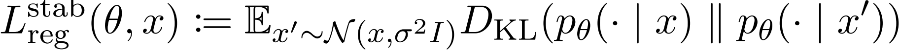

       使用 Stability Training 的网络在测试的时候也做了改变，**模型输出的是 高斯分布 采样邻域中的可能性最大的分类**

       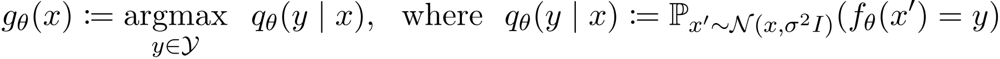

2. 实验：

   (0) 实验参数：

   - 数据集：大致意思就是从 **80M的CIFAR10-TINY** 中为每个类挑选出 50K 张图片组成一个 500K 大小的无标签数据集；

   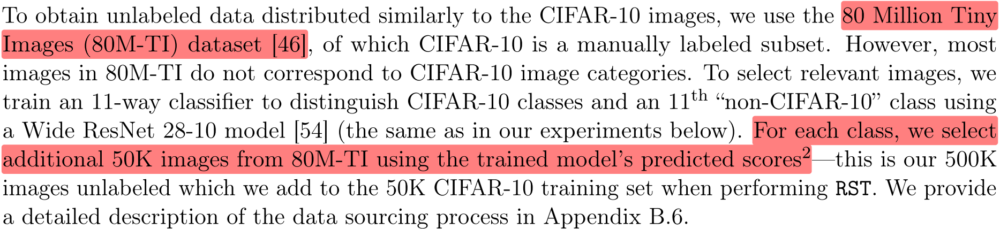

   - 模型 & 训练参数：

   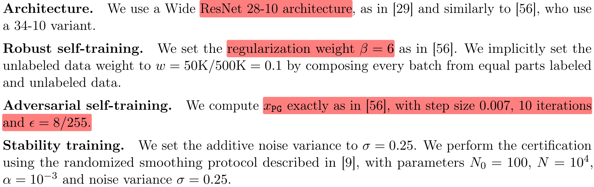

   (1) 经验性防御（heuristic defense）：主要关注 $L_\infty$ 攻击；（⭐ <u>针对作者提供的这种方法，作者还自己对 PGD 做了修改以达到最好的攻击成功率，这一点在做攻击的时候可以借鉴一下。</u>）

   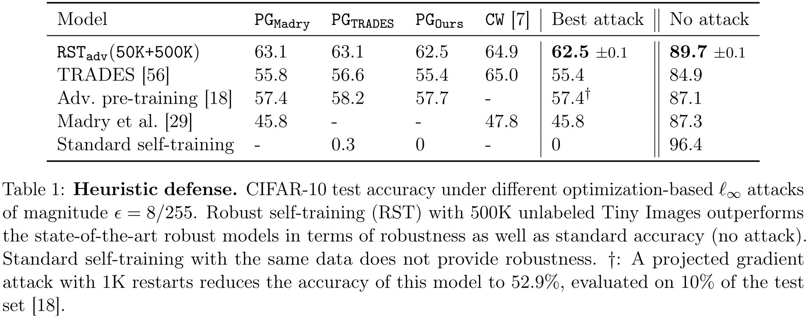

   (2) 证明性防御（certified defense）：同时关注 $L_\infty$ 和 $L_2$ 攻击；

   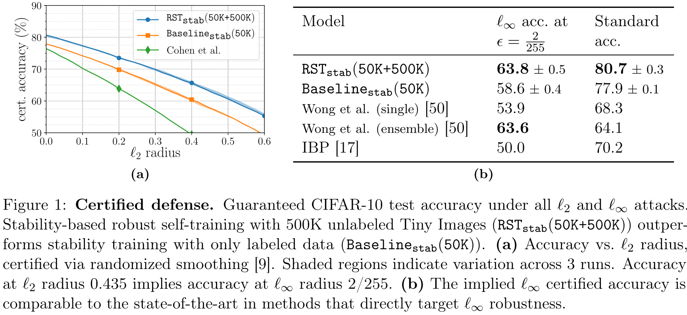

   (3) SVHN（Street View House Numbers）实验：实验的结果表明，数据的标签对于模型的鲁棒性影响并不大；（<u>我这里比较好奇的是，在 SVHN 这个任务上作者提出的方法并没有优于 $Baseline_{adv}(604K)$ 的效果</u>）

   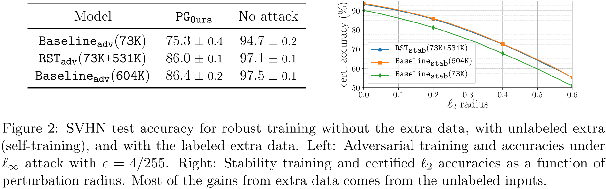

### Links

- 论文链接：[Carmon Y, Raghunathan A, Schmidt L, et al. Unlabeled data improves adversarial robustness[J]. arXiv preprint arXiv:1905.13736, 2019.](https://arxiv.org/abs/1905.13736)

- 论文代码：https://github.com/yaircarmon/semisup-adv

# Defense Against Adversarial Attacks Using Feature Scattering-based Adversarial Training

### Contribution

1. 使用  Wasserstein Distance 来生成对抗样本；

### Notes

1. Background：

   (1) Adversarial Training，可以被形式化为 $min-max$ 问题：

   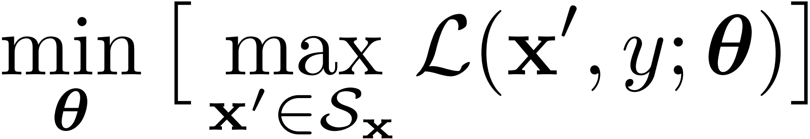

   ​	其中内层最大值经常用对抗样本生成来近似，如使用单步的 $FGSM$ 算法，或者是多步的 $PGD$ 算法（算法第一次迭代时首先会添加上一个随机噪声，然后再迭代生成对抗样本），$PGD$ 算法公式如下：

   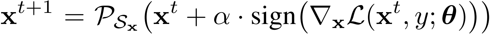

   (2) 对抗训练的问题：

   - 标签泄露（Label Leaking）：生成的对抗扰动本身和目标类别是密切相关的，导致训练好的模型看到测试集的对抗扰动便知道目标分类，而与原始的图片无关；
   - 梯度隐藏（Gradient Masking）：指的是训练后的模型学习到了尽可能生成一些无用的梯度（<u>这个和我想象中的“梯度隐藏”的概念不同，从作者的解释来看是模型学习到了这种生成无用梯度的能力，可能是我没有真正理解这个含义，因为我感觉即使是梯度隐藏也是可以起到防御对抗攻击的效果的</u>）；

2. 最优运输理论（Optimal Transport Theory）

   (1) 参考链接：

   - [【数学】Wasserstein Distance](https://zhuanlan.zhihu.com/p/58506295)
   - [机器学习工具（二）Notes of Optimal Transport](https://zhuanlan.zhihu.com/p/82424946)
   - [令人拍案叫绝的Wasserstein GAN](https://zhuanlan.zhihu.com/p/25071913)

   (2) Wasserstein Distance的优点：**Wasserstein距离相比KL散度、JS散度的优越性在于，即便两个分布没有重叠，Wasserstein距离仍然能够反映它们的远近**

3. 训练方法：

   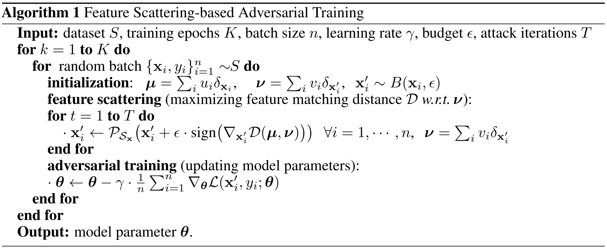

   <u>我的理解：</u>

   - 简单的来看，作者提出的方法和已有的方法的不同之处在于使用了 Wasserstein Distance 作为生成对抗样本时的损失函数；
   - 思考一下，变换了这个损失函数的作用有可能那么大么？从 Wasserstein Distance 自身的有点来看，它的优点主要是体现在两个分布没有重叠时，还能够有效地指导网络训练。所以从对抗样本的生成角度来看，Wasserstein Distance 对于较大扰动时的对抗样本生成是更加有效的，因为此时两个样本的解码概率分布可能已经差异十分大了，用 KL 散度并不能更好地指导生成对抗样本；**概括一下，能够指导生成更多样化的对抗样本，从而更好地进行对抗训练**；
   - 再思考一下，这篇文章作者一直是从 feature 这个角度来说的，其实我一直不太明白作者这样说有什么意义，但是我们揣测一下的话，因为在利用 Wasserstein Distance 生成对抗样本的时候，其实是要利用到一整个batch的样本来调整扰动的，这也是这个方法和前面方法的不同之处；**概括一下，用到了batch来生成对抗样本**；

   方法示意图：

   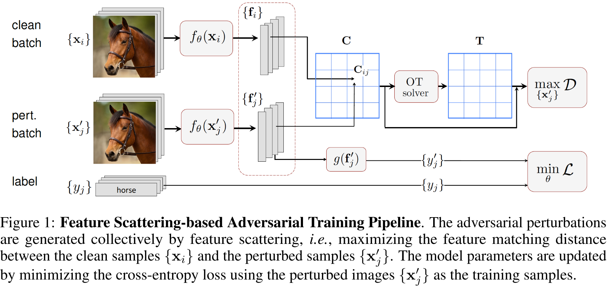

4. 实验：

   (0) 实验参数：

   - 数据集 & 基准方法：

     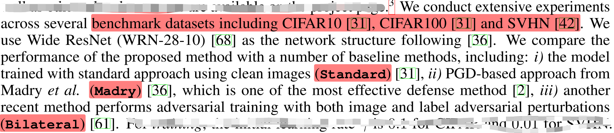

   - 测试参数：

     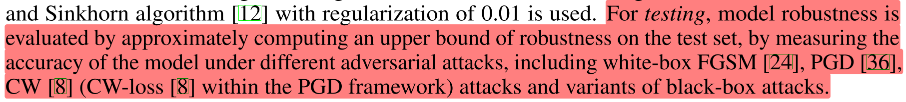

   (1) 白盒攻击结果：

   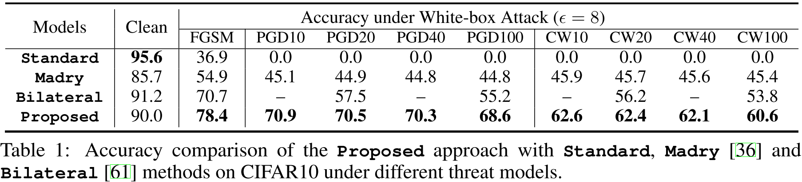

   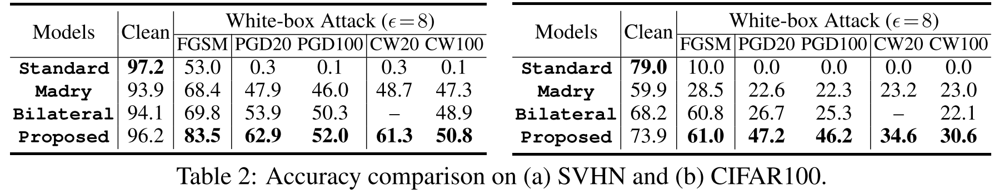

### Links

- 论文链接：[Zhang H, Wang J. Defense against adversarial attacks using feature scattering-based adversarial training[J]. arXiv preprint arXiv:1907.10764, 2019.](https://arxiv.org/abs/1907.10764?spm=5176.12281978.0.0.5f797a4dBpnylV&file=1907.10764)
- 论文代码：https://github.com/Haichao-Zhang/FeatureScatter