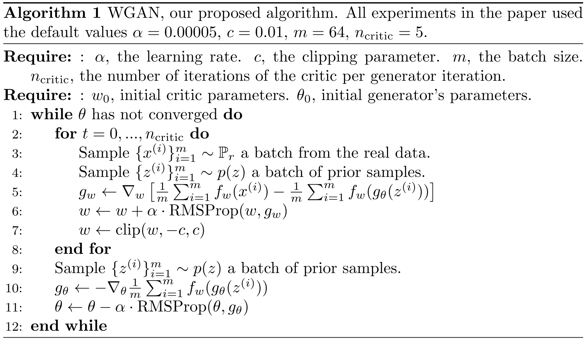
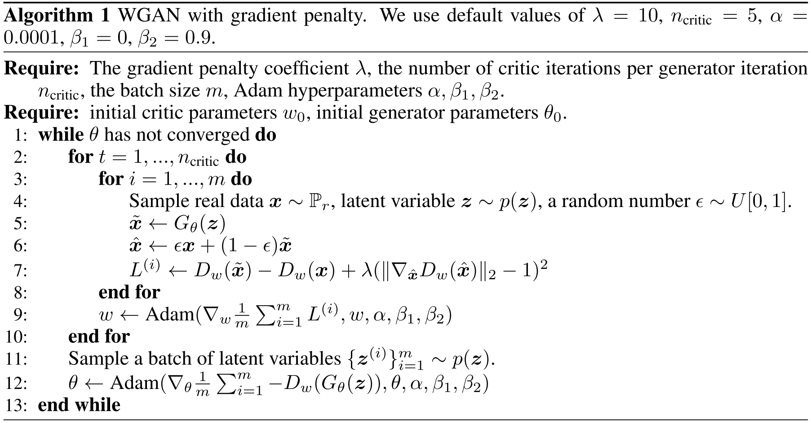

# Model in Image Domain

[TOC]

## Wasserstein GAN

> GAN 主要用在生成对抗样本上面，它对于我来说是一个工具，所以我没有做过深的研究。

> 参考：[GAN的发展系列一（CGAN、DCGAN、WGAN、WGAN-GP、LSGAN、BEGAN）](https://cloud.tencent.com/developer/article/1645877)，故不再复制粘贴相关细节。

### Contribution

1. 最大的贡献在于解决了 GAN 难以训练的难题；
2. 增加了生成的样本的多样性；

### Notes

1. 算法细节：

   

### Links

- 论文链接：[Arjovsky M, Chintala S, Bottou L. Wasserstein generative adversarial networks[C]//International conference on machine learning. PMLR, 2017: 214-223.](https://arxiv.org/abs/1701.07875)
- 论文代码（PyTorch）：https://github.com/martinarjovsky/WassersteinGAN

## Improved Training of Wasserstein GANs

> 参考：[GAN的发展系列一（CGAN、DCGAN、WGAN、WGAN-GP、LSGAN、BEGAN）](https://cloud.tencent.com/developer/article/1645877)，故不再复制粘贴相关细节。

### Contribution

1. 在 WGAN 的基础上，解决了样本质量低、训练难以收敛的问题；

### Notes

1. 算法细节：

   

### Links

- 论文链接：[Gulrajani I, Ahmed F, Arjovsky M, et al. Improved training of wasserstein gans[J]. arXiv preprint arXiv:1704.00028, 2017.](https://arxiv.org/abs/1704.00028)
- 论文代码（Tensorflow）：https://github.com/igul222/improved_wgan_training
- 论文代码（PyTorch）：https://github.com/caogang/wgan-gp

