# Attack on NLP

[TOC]

## Todo List

1. B. Liang, H. Li, M. Su, P. Bian, X. Li, and W. Shi, “Deep text classification can be fooled,” arXiv preprint arXiv:1704.08006, 2017.
2. S. Samanta and S. Mehta, “Towards crafting text adversarial samples,” arXiv preprint arXiv:1707.02812, 2017.
3. Y. Belinkov and Y. Bisk, “Synthetic and natural noise both break neural machine translation,” arXiv preprint arXiv:1711.02173, 2017.
4. J. Gao, J. Lanchantin, M. L. Soffa, and Y. Qi, “Black-box generation of adversarial text sequences to evade deep learning classifiers,” arXiv preprint arXiv:1801.04354, 2018.
5. H. Hosseini, S. Kannan, B. Zhang, and R. Poovendran, “Deceiving google’s perspective api built for detecting toxic comments,” arXiv preprint arXiv:1702.08138, 2017.
6. Z. Gong, W. Wang, B. Li, D. Song, and W.-S. Ku, “Adversarial texts with gradient methods,” arXiv preprint arXiv:1801.07175, 2018.
7. Y. Zhang and B. Wallace, “A sensitivity analysis of (and practitioners guide to) convolutional neural networks for sentence classification,” in IJCNLP, vol. 1, 2017, pp. 253–263.
8. I. J. Goodfellow, J. Shlens, and C. Szegedy, “Explaining and harnessing adversarial examples,” in ICLR, 2015, pp. 1–11.
9. Privacy Risks of General-Purpose Language Models
10. Analyzing Information Leakage of Updates to Natural Language Models
11. information leakage in embedding models
12. LEAF: A Faster Secure Search Algorithm via Localization, Extraction, and Reconstruction
13. Yet Another Text Captcha Solver: A Generative Adversarial Network Based Approach

## Black-box Generation of Adversarial Text Sequences to Evade Deep Learning Classifiers

### Notes

### Links

- [Gao J, Lanchantin J, Soffa M L, et al. Black-box generation of adversarial text sequences to evade deep learning classifiers[C]//2018 IEEE Security and Privacy Workshops (SPW). IEEE, 2018: 50-56.](https://arxiv.org/abs/1801.04354)

## TEXTBUGGER: Generating Adversarial Text Against Real-world Applications

> 文章的编写十分简洁明了，一眼看下去便能知其大概；

### Contribution

1. 提出了一种白盒/黑盒上的无目标的针对 NLP 分类任务的对抗攻击算法；
2. 作者采用的思想很简单：一是根据梯度计算词的重要程度；二是 OOV 问题；三是 Embedding 相近词替换；

### Notes

1. 一种同时支持**白盒/黑盒**的 **untargeted** 的**针对 NLP 分类任务**的对抗攻击算法；

2. 作者分析了已有的对抗攻击的一些缺点，也是这篇文章要解决的几个点：**计算复杂；白盒限制；人工干预；缺乏检验**；先看生成的对抗样本是什么样子的：

   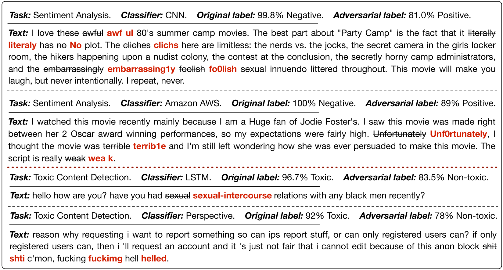

3. **白盒攻击**：

   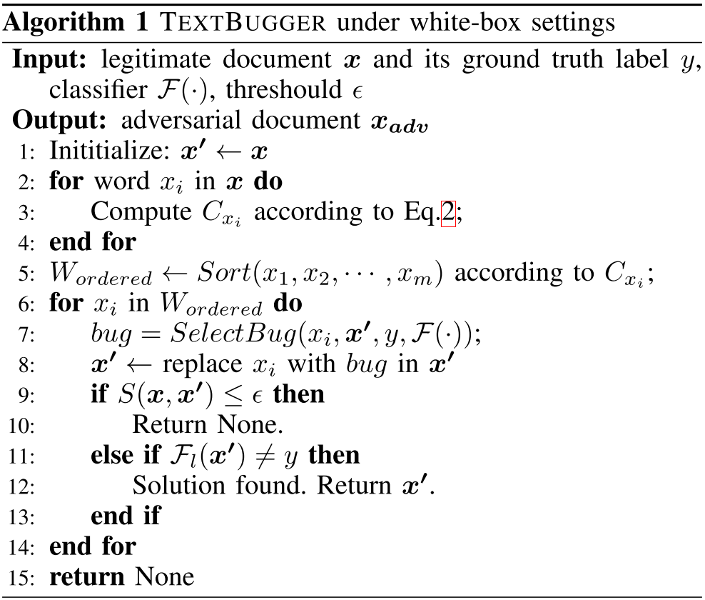

   (1) 计算每个词的重要性 $C_{x_i}$（对应代码 2-4 行），即为分类结果求偏导，计算公式如下（<u>应该是个向量？需要求均值或者求和？</u>）：

   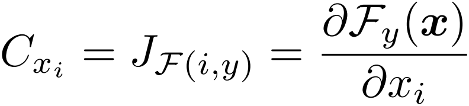

   (2) 根据重要性 $C_{x_i}$ 对词从高到低进行排序（对应代码 5 行）

   (3) 👍 选择 **字符级别的修改(character-level)** 和 **词级别的修改(word-level)**（<u>思考：还有什么级别的攻击？词组级别的攻击，句子级别的攻击？</u>）。**字符集别的修改依赖的思想是 OOV，词级别的修改依赖的是 Embedding 空间的语义相似性**。这里有一个有趣的现象，word2vec 这种 Embedding 方式会将词义完全相反的两个词 (**Better / Worst**) 分配在相近的空间中。这种修改方法在一定程度上依赖于人脑的推理能力，部分词的拼写发生了错误或者被删除了人同样能够识别整句句子的含义。五种修改方法：

   - 插入空格，欺骗英文的单词分割；
   - 删除一个字符，除了首尾字符；
   - 交换两个字符，除了首位字符；
   - 相似替换，如用 1 代替 i、用 m 替换 n；
   - 用相近 (Embedding Top-k) 的单词替换目标单词；

   算法如下，我们选择一种能**让目标分类概率值下降最多**的修改方法输出：

   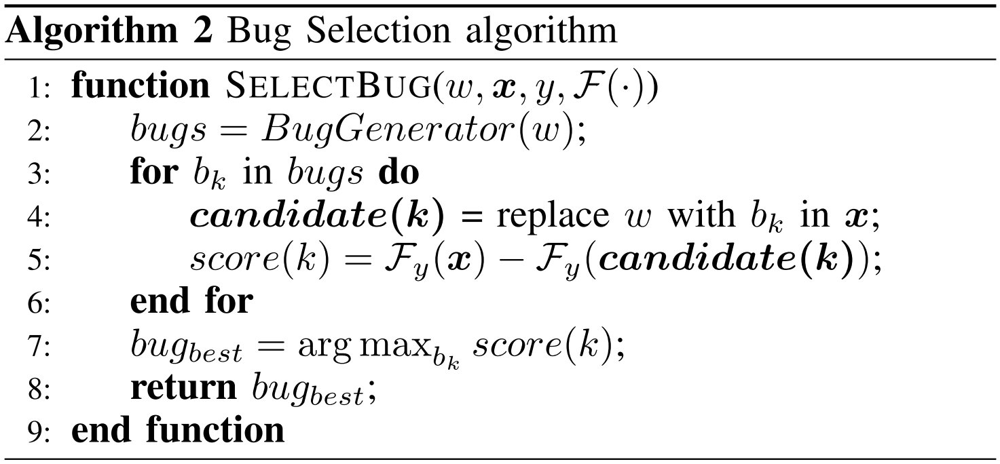

   > 思考一下：
   >
   >  - 中文环境下的攻击场景会是怎样的？
   >  - 梯度信息能否再更多地利用一下，比如说：在选择相近词地时候，结合 Embedding + Gradient？

4. **黑盒攻击**：

   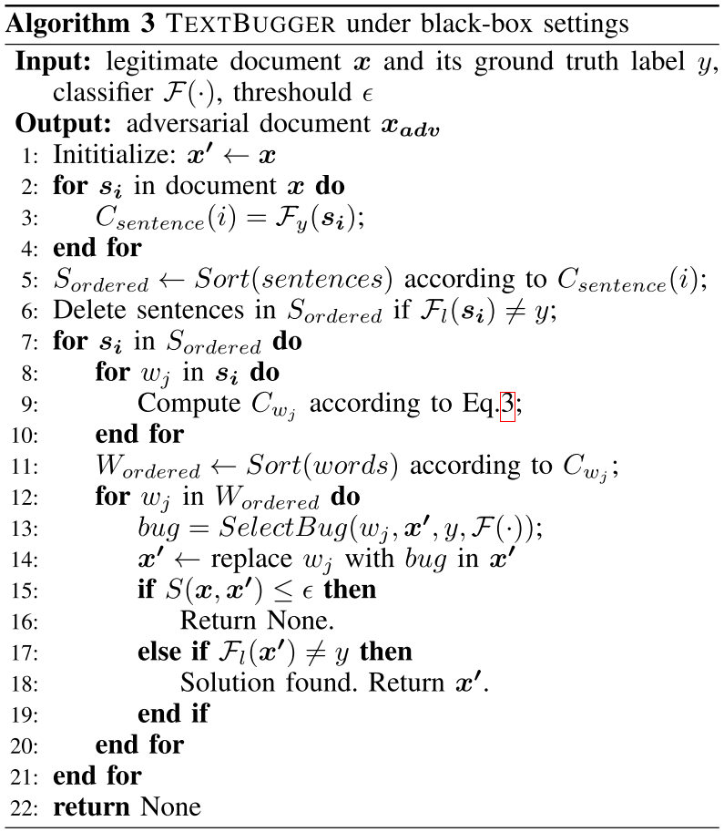

   (1) 挑选重要的句子：划分段落中的句子，过滤掉目标标签不同的句子，并根据目标标签的概率对句子进行排序（对应代码 2-6 行）；（<u>这边需要知道目标标签的概率，有些时候我们很可能是不知道的</u>）
   
   (2) 挑选重要的词：即消除一个词以后对目标标签概率的影响值 （对应代码 8-11 行）；
   
   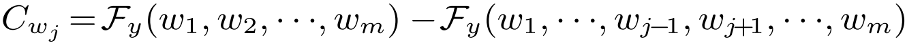
   
   (3) 和白盒攻击一样，修改上面的词；
   
5. Evaluation - Sentiment Analysis

   (1) 数据集

   - IMDB
   - Rotten Tomatoes Movie Reviews (MR)

   (2) 白盒攻击的模型:

   - LR

   - CNN
   - LSTM

   (3) 黑盒攻击的平台:

   |                   Google Cloud NLP                   | IBM Waston Natural Language Understanding (IBM Watson) |
   | :--------------------------------------------------: | :----------------------------------------------------: |
   | **Microsoft Azure Text Analytics (Microsoft Azure)** |         **Amazon AWS Comprehend (Amazon AWS)**         |
   |                **Facebook fastText**                 |                    **ParallelDots**                    |
   |                **TheySay Sentiment**                 |                  **Aylien Sentiment**                  |
   |                  **TextProcessing**                  |                 **Mashape Sentiment**                  |

   (4) 对比工作: 

   - Random: 随机挑选 10% 的词进行修改 (白盒)
   - **FGSM+Nearest Neighbor Search (NNS)** (白盒)
   - **DeepFool+NNS** (白盒)
   - **DeepWordBug** (黑盒)

   (5) 评价指标: （👎 个人观点：<u>这里罗列了 4 个指标，我觉得其中第二、三个可以不用计算，原因有两点：一是 Edit Distance和 Semantic Similarity这两个指标本身是比较直观的，可以用来分析语义的修改量和单词的修改多少；二是其他两个指标也只是用来罗列，作者没有对他们做出一些 interesting 的分析，也没有和其他人的工作进行比较，甚至还占用了大量的篇幅，放着没什么太大意义</u>）

   - Edit Distance

   - Jaccard Similarity Coefficient: 集合的相似性

     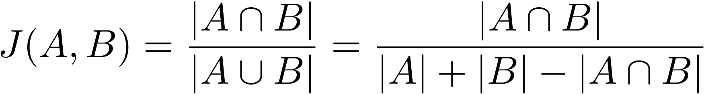

   -  Euclidean Distance: 使用词向量的距离进行度量

     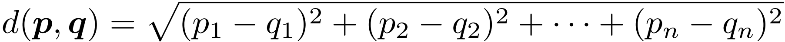

   - Semantic Similarity: 度量句子语义的相似性，使用 sentence embedding，相关的模型使用的是 Universal Sentence Encoder

     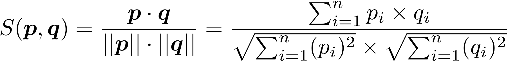

   (6) 实现上的两个小细节:

   - 对于不在词汇表中的词，直接随机化一个 embedding；
   - 设置了 semantic similarity 的阈值为 0.8；

   (7) 白盒攻击结果：

   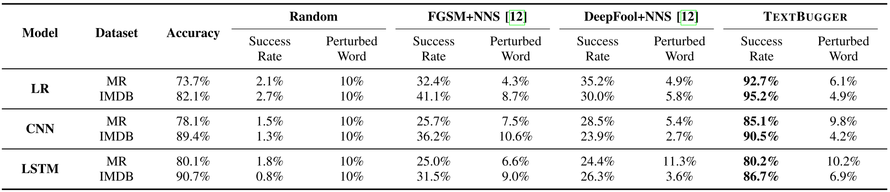

   (8) 黑盒攻击在 IMDB 上的效果：

   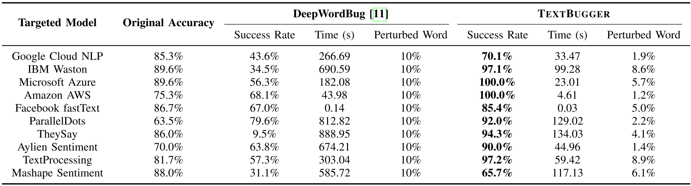

   (9) 黑盒攻击在 MR 上的效果:

   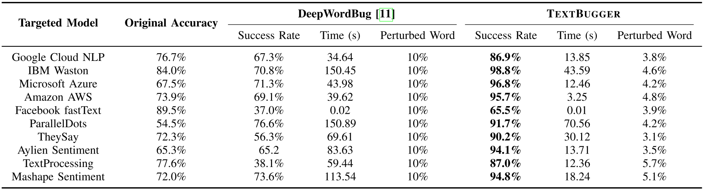

   (10) 👍 句子长度对攻击的影响：

   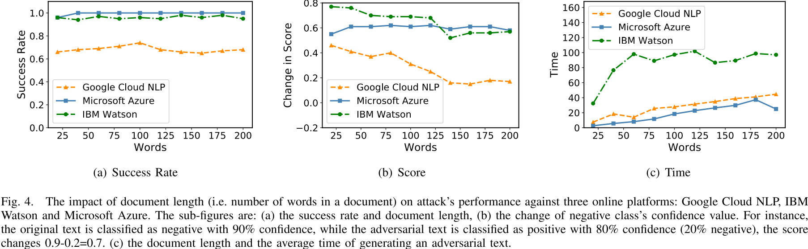

   可以看到，句子长度并不会影响攻击的成功率，但会在一定程度上让其置信度有所下降（<u>这并不会给攻击者带来太大的损失</u>），以及让生成样本的时间增加。👎 **很可惜，这里我没有找到作者介绍 query 的次数，在黑盒攻击的情况下，query 次数是十分关键的一个指标，生成快并不能代表着 query 次数减少了**。

   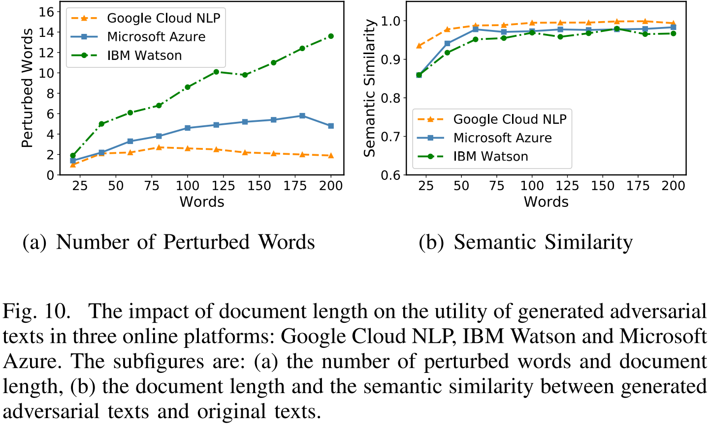

   可以看到，句子长度增加时，很正常的，每次修改词的量也需要增加，而句子的语义的变化则变得越来越小；

   (11) 修改：

   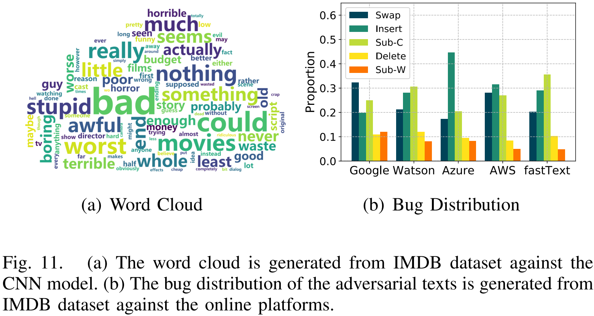

   比较有意思的一个点是，**作者列出了那些被判断为 negative 语句中的关键词**。另外，不同平台上算法选择的修改策略可能会有所不同。

6. Evaluation - Toxic Content Detection

   (1) 数据集： Kaggle Toxic Comment Classification Competition dataset；👎 **这里有一点不同的是，这个数据集中本身是有 6 分类的，但是作者将其分成了 2 大类（Toxic and Not Toxic），这虽然看起来没什么不好的地方，但是体现出了作者的这种攻击其实是一种 untargeted 攻击**。

   (2) 白盒模型：

   - LR
   - CNN
   - LSTM

   (3) 黑盒模型：

   |    **Google Perspective**     | **IBM Natural Language Classifier** |
   | :---------------------------: | :---------------------------------: |
   |     **Facebook fastText**     |         **ParallelDots AI**         |
   | **Aylien Offensive Detector** |                                     |

   (4) 白盒攻击结果：

   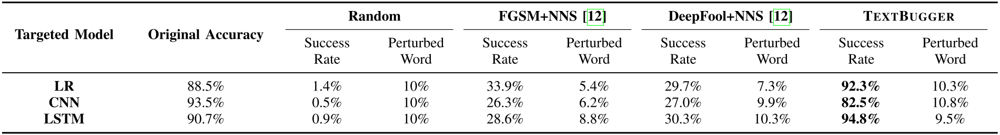

   (5) 黑盒攻击结果：

   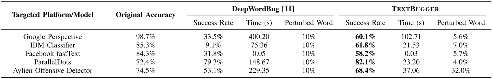

   (6) 修改：

   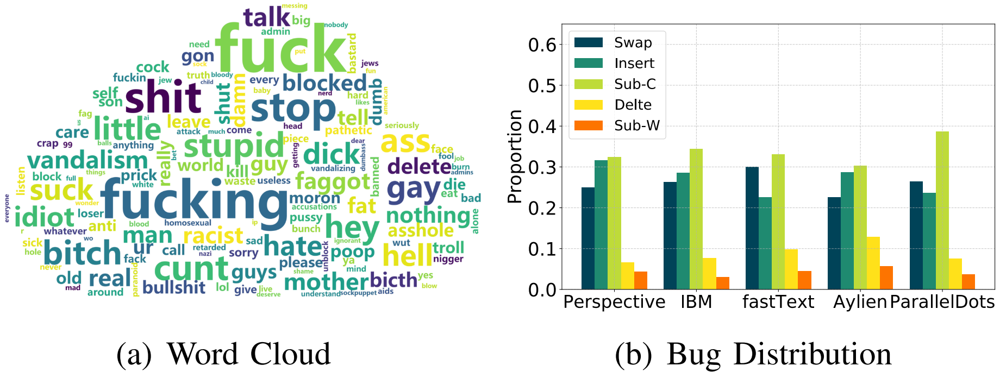

   同样，作者列出了一些影响分类结果的关键词。

7. 👍 迁移能力：

   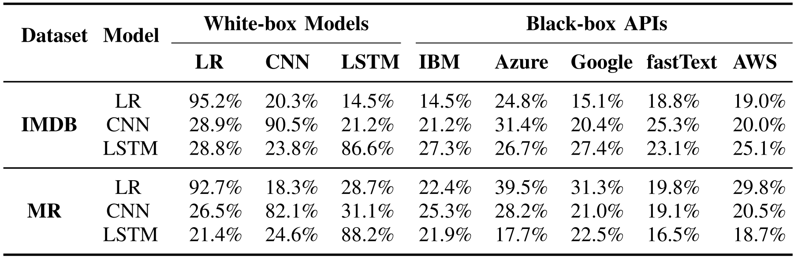

   作者探讨了迁移攻击的有效性，可以看到，大致的迁移成功率约为 20% 左右。

8. 潜在的防御方法：

   - Spelling Check
   - Adversarial Training

> 我认为，文本分类问题是对抗攻击中是图像、语音、文本三大领域中最简单的一个问题，因为它并不会受到物理信道的影响，那么它就不用考虑物理鲁棒性这一大难题。另外，我认为在文本上应用字符、词级别的修改，本身是一种比较简单的方法（不像考虑词组搭配和句式变换等可能存在的攻击方法），甚至我们能够想象出这种攻击的一套规则，因此在防御的时候只需要考虑一些规则便可以（Spelling Check 和 Adversarial Training就像是经过了一次正则匹配一样）。

### Links

- 论文链接：[Li, Jinfeng, et al. "Textbugger: Generating adversarial text against real-world applications." *NDSS* (2019).](https://arxiv.org/abs/1812.05271)

- 论文代码：[CSE544T-Project-TextBugger](https://github.com/LiKev12/CSE544T-Project-TextBugger)

- ParallelDots 情感分析：https://www.paralleldots.com/

- GloVe 词向量：[J. Pennington, R. Socher, and C. Manning, “Glove: Global vectors for word representation,” in EMNLP, 2014, pp. 1532–1543.](https://nlp.stanford.edu/pubs/glove.pdf)

- Kaggle Toxic Comment Classification Competition dataset: https://www.kaggle.com/c/jigsaw-toxic-comment-classification-challenge

  

