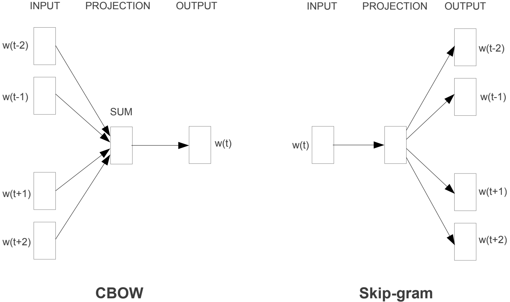

# Model on NLP

[TOC]

## Todo List

## Word2vec

### Contribution

1. Word2vec 是一种**考虑上下文，维度少，速度快的 Embedding 方法**，适用于各种 NLP 任务；
2. Word2vec 在词和向量之间是一个一对一的关系，对于**一词多义的问题**它是没有办法解决的；

### Notes

1. Word2vec 分为 **CBOW** 和 **Skip-gram** 模型。CBOW 模型为根据单词的上下文预测当前词的可能性；Skip-gram 模型恰好相反，根据当前词预测上下文的可能性。两种模型相比，Skip-gram的学校效果会好一些，它对生僻词的处理更好，但训练花费的时间也会更多一些。两种模型的结构如下所示：

   

2. 解决 Word2Vec 中 softmax 计算开销巨大的问题：

   (1) Hierarchical Softmax：使用哈夫曼树结构来代替 softmax，每一个树的非叶子节点都是一个二分类问题；

   (2) Negative Sampling: 使用负采样的方法来代替 softmax，随机采样几个不在 window 中的词，训练的目标变为期望在 window 内的词出现的概率越高越好，而负采样得到的词出现的概率越小越好；

### Links

- 论文链接：
  [Mikolov, Tomas, et al. "Efficient estimation of word representations in vector space." *arXiv preprint arXiv:1301.3781* (2013).](https://arxiv.org/abs/1301.3781)
  [Le, Quoc, and Tomas Mikolov. "Distributed representations of sentences and documents." *International conference on machine learning*. 2014.](https://arxiv.org/abs/1405.4053)
- Gensim 库：[RaRe-Technologies/gensim: Topic Modelling for Humans (github.com)](https://github.com/RaRe-Technologies/gensim)
- 大佬的 Word2Vec 讲解：[word2vec 中的数学原理详解（一）目录和前言_peghoty-CSDN博客_word2vec数学原理](https://blog.csdn.net/itplus/article/details/37969519)
- C 代码实现：[dav/word2vec (github.com)](https://github.com/dav/word2vec)

