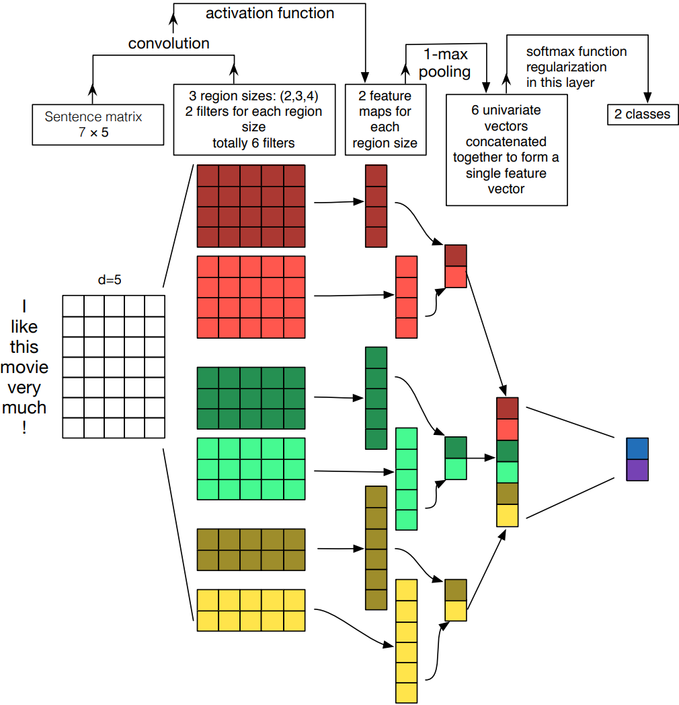
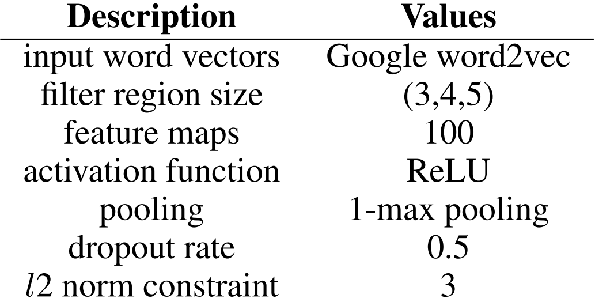

# Model on NLP

[TOC]

## Todo List

- bert

## Word2vec: Distributed representations of sentences and documents

### Contribution

1. Word2vec 是一种**考虑上下文，维度少，速度快的 Embedding 方法**，适用于各种 NLP 任务；
2. Word2vec 在词和向量之间是一个一对一的关系，对于**一词多义的问题**它是没有办法解决的；

### Notes

1. Word2vec 分为 **CBOW** 和 **Skip-gram** 模型。**CBOW 模型为根据单词的上下文预测当前词的可能性**；**Skip-gram 模型恰好相反，根据当前词预测上下文的可能性**。两种模型相比，Skip-gram的学校效果会好一些，它对生僻词的处理更好，但训练花费的时间也会更多一些。两种模型的结构如下所示：

   

2. 解决 Word2Vec 中 softmax 计算开销巨大的问题：

   (1) **Hierarchical Softmax**：使用哈夫曼树结构来代替 softmax，每一个树的非叶子节点都是一个二分类问题；

   (2) **Negative Sampling**: 使用负采样的方法来代替 softmax，随机采样几个不在 window 中的词，训练的目标变为期望在 window 内的词出现的概率越高越好，而负采样得到的词出现的概率越小越好；

### Code Implementation

1. $\sigma(x)$ 的近似计算：$sigmoid$ 函数在 $x=0$ 附近变化剧烈，往两边趋近平缓，故 $K$ 等分存储函数值，每次访问数组近似取值，以减少计算量；

2. 词典的存储：使用哈希表存储词典，地址的冲突解决使用线性探测的开放定址法；

3. 低频词的处理：对低频词在构建词表时直接进行删除，并且为了计算效率，在词表中单词超过容量的 70%时，即清理低频词 (当然，这有一定概率误删部分低频词)；

4. 高频词的处理：对高频词超过一定词频后，会以一定概率舍弃，具体公式如下
   $$
   prob(w) = 1 - \left( \sqrt{\frac{t}{f(w)}} + \frac{t}{f(w)} \right)
   $$
   其中 $f(w)$ 为词频；

### Links

- 论文链接：
  [Mikolov, Tomas, et al. "Efficient estimation of word representations in vector space." *arXiv preprint arXiv:1301.3781* (2013).](https://arxiv.org/abs/1301.3781)
  [Le, Quoc, and Tomas Mikolov. "Distributed representations of sentences and documents." *International conference on machine learning*. 2014.](https://arxiv.org/abs/1405.4053)
- Gensim 库：[RaRe-Technologies/gensim: Topic Modelling for Humans (github.com)](https://github.com/RaRe-Technologies/gensim)
- 大佬讲解：[word2vec 中的数学原理详解（一）目录和前言_peghoty-CSDN博客_word2vec数学原理](https://blog.csdn.net/itplus/article/details/37969519)
- C 代码实现：[dav/word2vec (github.com)](https://github.com/dav/word2vec)

## TextCNN: Convolutional Neural Networks for Sentence Classification

### Notes

1. 模型结构: 

   

   通过不同大小的卷积后, 池化, 全连接.

2. 模型原理: 卷积神经网络的核心思想是捕捉局部特征. 对于文本来说, **局部特征就是若干单词组成的滑动窗口, 类似 N-gram**. TextCNN 的优势**在于能够自动地对 N-gram 特征进行组合和筛选, 获得不同抽象层次的语义信息**.

3. 常用参数:

   

   - 词向量: 作者还是建议使用 word2vec 预训练的 Embedding, 并且在训练中继续训练;
   - 卷积核大小: 对于一般的模型, 作者建议首先用单卷积核大小在 1~10 范围内查找最优的值, 然后在它的周围寻找最佳的卷积核组合. 另外如果需要处理的词库特别大时, 建议使用更大的卷积核大小;
   - 卷积核数量: 100~600 之间, 越多的卷积核需要花费更多的训练时间和预测时间;
   - 激活函数: ReLU 或者 tanh 可能是不错的选择;
   - 池化: 就用最大池化, 没有其他了;
   - 正则化方法: 当使用较多的卷积核时, 会出现成功率降低的问题, 建议使用更加严格的正则化方法;

### Links

- 论文链接: [Kim, Yoon. "Convolutional neural networks for sentence classification." *arXiv preprint arXiv:1408.5882* (2014).](https://arxiv.org/abs/1408.5882)
- 论文链接: [Zhang, Ye, and Byron Wallace. "A sensitivity analysis of (and practitioners' guide to) convolutional neural networks for sentence classification." *arXiv preprint arXiv:1510.03820* (2015).](https://arxiv.org/abs/1510.03820)
- 大佬讲解: [小占同学 / 深入TextCNN（一）详述CNN及TextCNN原理](https://zhuanlan.zhihu.com/p/77634533)
- 代码实现: [ShaneTian/TextCNN](https://github.com/ShaneTian/TextCNN)

## FastText: Bag of tricks for efficient text classification

### Contribution

1. 开源, 快速, 轻量的 Embedding模型;
2. 使用 n-gram, 解决了低频词, 词形变换等问题;

### Notes

1. word2vec 等工作，是以词汇表中的独立单词作为基本单元来进行训练的，存在如下问题：

   - **低频词、罕见词组**，未能得到充分训练，甚至是与最终结果无关的；
   - **OOV** 的问题；
   - **英语中的词形变换**问题；

2. FastText 架构图：

   

   FastText 的架构和 word2vec 的 CBOW 模型十分相似，都是对输入的 Embedding 做平均后使用 Hierarchical Softmax输出。**但不同的是，CBOW 输出的是中间词的 Embedding，而 FastText 输出的则是分类，在输入端使用了 n-gram**；

### Links

- 论文链接: [Joulin, Armand, et al. "Bag of tricks for efficient text classification." *arXiv preprint arXiv:1607.01759* (2016).](https://arxiv.org/abs/1607.01759)
- C 代码实现:  [facebookresearch / fastText](https://github.com/facebookresearch/fastText)

- Facebook 主页: [facebook fasttext](https://fasttext.cc/docs/en/supervised-tutorial.html)