# Attack on Speech Recognition


[TOC]


## Todo List

1. Szegedy, C., Zaremba, W., Sutskever, I., Bruna, J., Erhan, D., Goodfellow, I., and Fergus, R. Intriguing properties of neural networks. arXiv preprint arXiv:1312.6199, 2013.
2. Biggio, B., Corona, I., Maiorca, D., Nelson, B., ˇSrndi´c, N., Laskov, P., Giacinto, G., and Roli, F. Evasion attacks against machine learning at test time. In Joint European conference on machine learning and knowledge discovery in databases, pp. 387–402. Springer, 2013.
6. A. Nguyen, J. Yosinski, and J. Clune, “Deep neural networks are easily fooled: High confidence predictions for unrecognizable images,” in Conference on Computer Vision and Pattern Recognition. IEEE, Jun. 2015, pp. 427–436.
7. N. Carlini and D. Wagner, “Towards evaluating the robustness of neural networks,” in Symposium on Security and Privacy. IEEE, May 2017, pp. 39–57.
8. I. Evtimov, K. Eykholt, E. Fernandes, T. Kohno, B. Li, A. Prakash, A. Rahmati, and D. Song, “Robust physical-world attacks on machine learning models,” CoRR, vol. abs/1707.08945, pp. 1–11, Jul. 2017.
10. Moustapha Ciss´e, Yossi Adi, Natalia Neverova, and Joseph Keshet. Houdini: Fooling deep structured visual and speech recognition models with adversarial examples. In Proceedings of the 31st Annual Conference on Neural Information Processing Systems, pages 6980–6990, 2017.
8. Dibya Mukhopadhyay, Maliheh Shirvanian, and Nitesh Saxena. 2015. All your voices are belong to us: Stealing voices to fool humans and machines. In Proceedings ofthe European Symposium on Research in Computer Security. Springer, 599–621.
8. Mel-Frequency Spectral Coefficients (MFSC)
9. Linear Predictive Coding
10. Perceptual Linear Prediction (PLP)


## Overview

1. 语音识别的流程

   todo there

2. 针对不同截断的攻击

   todo there

3. 语音识别领域对抗攻击的演变

   todo there


## * Cocaine Noodles: Exploiting the Gap between Human and Machine Speech Recognition

### Contribution

1. 这篇文章可以说是语音识别对抗攻击的开山之祖；
2. 攻击特征提取模块；

### Notes

1. 攻击 **特征提取(MFCC)** 模块的对抗攻击；

2. 👍  攻击方法的流程图如下：

   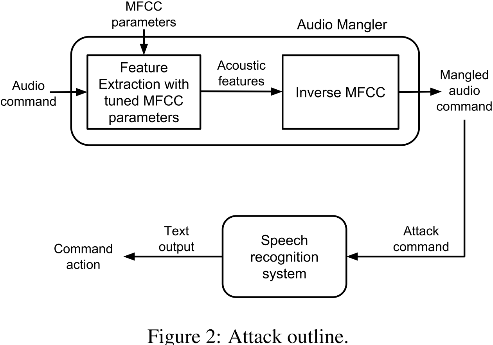

   作者的攻击思路非常简单，从语音中提取出 MFCC 特征（这个过程会 **丢失一些语音的信息**，如 MFCC 特征往往只取前 13 个参数，而高维的 MFCC 特征代表着能量变化的高频信息），然后**把 MFCC 特征逆转为语音信号**，只要该样本同时满足 “**人耳无法理解**”，“**机器可以理解**” 两个条件，那么这就是一个成功的对抗样本。

### Shortcoming

1. 需要大量的时间去生成一个对抗样本，因为要调参数使得满足 **“人耳无法理解“，”机器可以理解“** 两个条件；
2. 👎 ~~（<u>纯属吐槽</u>）文章的编写我觉得挺烂的，你想知道的你都没有知道，你不想知道的他介绍了一堆。如果你熟悉语音识别、MFCC的话，会发现整篇文章就只有两块（介绍了语音识别和做了个问卷调查），对于实际的攻击算法的实现、如何去调参生成一个对抗样本（作者的描述是：我生成了 500 个样本）并没有提及，甚至没有介绍相关的一些参数，代码也是没有开源的（计算 MFCC 的链接在下面）；~~（立马拥抱 Carlini 大佬）
3. （<u>猜测一下</u>）整个算法的流程大概是：正常计算得到MFCC特征，然后用 **逆 DCT 变换**（对应 Mel Filter Bank Energy 到 MFCC 过程）和 **逆 DFT 变换**（对应 时域信号到频谱 过程）。虽然算法特别简单，但是因为涉及到帧之间的重叠（分帧的时候一般 `step_length < frame_length`），整个调试过程应该是比较麻烦的事情；

### Links

- 论文链接：[Vaidya, Tavish, et al. "Cocaine noodles: exploiting the gap between human and machine speech recognition." *9th {USENIX} Workshop on Offensive Technologies ({WOOT} 15)*. 2015.](https://www.usenix.org/conference/woot15/workshop-program/presentation/vaidya)
- MFCC 实现：[PLP and RASTA (and MFCC, and inversion) in Matlab using melfcc.m and invmelfcc.m (columbia.edu)](https://www.ee.columbia.edu/~dpwe/resources/matlab/rastamat/)


## Hidden Voice Commands

### Contribution

1. “实验设定” 值得借鉴，让阅读者很清晰地了解实验情景，能够对攻击性有一个简单的预估；
2. 攻击特征提取模块；
3. 使用梯度下降算法攻击 GMM-HMM 模型；
4. 虽然这篇文章有挺多的不足，但语音识别的对抗攻击从这篇文章开始有了比较清晰的思路；
5. 可以看到，Carlini 等人在对抗攻击上面是非常有经验的，其实他们已经看到了全部的攻击向量：**特征提取模块能不能攻击，模型能不能攻击，环境如何影响攻击的成功率，人对对抗样本的感受是怎样的，如何防御对抗样本** 等等。

### Notes

#### Black-box Attacks

1. 整体思路：**将正常的 TTS 语音模糊化**； 

2. 这部分是对文章 [”Cocaine Noodles: Exploiting the Gap between Human and Machine Speech Recognition“](#* Cocaine Noodles: Exploiting the Gap between Human and Machine Speech Recognition) 的完善。算法流程如下：

   

   通过计算 MFCC 然后 MFCC 逆转为时域信号这个过程，算法就能够从理论上**保留语音识别算法关注的语音特征，而抹除不相关的语音特征**（上一篇论文中已经解释这个原理），而抹除的这部分特征又很可能是对人的听觉影响是很大的，导致人无法听清对抗样本；

3. 实验设定：介绍了使用的扬声器的型号，实验房间的大小、背景噪声，测试时设备的距离为 **3米** ，使用三星和苹果手机中的 Google；背景噪声使用 JBL 播放，噪声的大小约为 53dB；

4. Evaluation：

   (1) Attack Range：当攻击距离大于 **3.5米** 或者 **SNR小于5dB** 时，攻击就无法成功；、

   (2) Obfuscating  Parameter：

   

   (2) Results：简单比较人和机器在指令模糊后的识别率的变化

   

#### White-box Attacks

1. 整体思路：**梯度下降算法寻找一个样本点**；

2. Simple Approach：使用梯度下降算法，生成对抗样本；但是作者发现这样找到的样本**并没有比 Black-box Attacks 找到的样本要更好**；梯度下降算法的目标函数：
   $$
   f(x) = (MFCC(x) - y)^2 · z
   $$
   即希望计算得到的 MFCC 特征和目标的 MFCC 相近，z 是一个权重因子，作者直接取单位向量；

3. Improved Approach：

   (1) 扩展 MFCC 维度：计算 MFCC 后输出的是 13 维的 MFCC 特征，**通常在语音识别中会用它的导数将其扩展到 39 维**；<u>这边有一个不太好理解的地方，前面输出 13 维的时候是将 MFCC 特征给截断了，为什么又要把它扩展到 39 维呢？</u>因为前面截断特征舍弃的是 **一帧中** MFCC 的高维分量，这个分量指的是该帧能量谱变化较快的信息（这部分对我们语音识别是没有用的，但可能对说话人识别是有用的），保留的低维分量是能量谱变化较慢的信息（**能量谱的包络**）；而后面扩展维度作导数是将 **前后帧** MFCC 作差求导，得到的是前后帧 MFCC 的**变化信息**（语音的前后帧具有很强的相关性）。求导的方式就是前后做差，如下：

   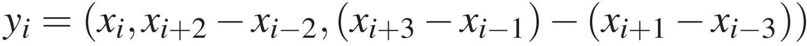

   (2) 模糊 MFCC 序列：Black-box Attacks 中 MFCC 的序列是固定的，然后去模糊输入序列。在 White-box Attacks 中 MFCC 也是“模糊”的，**其原理在于不同的人发同一个音的方式是不同的，那么他发这个音的方式只是这个音所有发音方式的其中一种**。有一个目标字符串，从中抽取去目标音素序列，一个音素对应一个 HMM 状态，一个 HMM 状态 对应一个 GMM 模型（由多个高斯分布函数组成，代表着一个音素的不同发音方式），我们从中随机挑选一个高斯分布作为我们的目标分布，即可将 MFCC 给“模糊”化了；

   (3) 缩短音素的发音时长：GMM-HMM 模型识别一个音素最短**只需要 4 帧即可**，但这么短的时间（大约为 0.5s）对人来说识别一个音素是比较困难的，因此作者通过让音素发音尽可能地短来增强指令的隐藏性；

   (4) 优化目标：（<u>作者这边的公式有问题</u>）

   假设我们确定了一个目标 GMM 序列，我们希望通过梯度下降算法让 MFCC 分类为该序列的概率最大（**Maximize the likelihood**）：
   $$
   \prod_i {
   	exp
   	\{
   		\sum_{j=1}^{39} {
   			\frac{\alpha_i^j - (y_i^j - \mu_i^j)^2}{\delta_i^j}
   		}
   	\}
   }
   $$
   其中，$y$ 为 39 维 MFCC，$\alpha$ 为 混合高斯中的权重系数，$\mu$ 为均值向量，$\delta$ 为方差向量，$i$ 为帧的序号，$j$ 为维度的序号。**Maximize the log likelihood**：
   $$
   log
   \begin{bmatrix}
   \prod_i {
   	exp
   	\{
   		\sum_{j=1}^{39} {
   			\frac{\alpha_i^j - (y_i^j - \mu_i^j)^2}{\delta_i^j}
   		}
   	\}
   }
   \end{bmatrix}
   =
   \sum_i {
   	\sum_j {
           \frac{\alpha_i^j - (y_i^j - \mu_i^j)^2}{\delta_i^j}
   	}
   }
   $$
   等同于**最小化负的 log 似然**：
   $$
   \sum_i {
   	\sum_j {
           \frac{-\alpha_i^j + (y_i^j - \mu_i^j)^2}{\delta_i^j}
   	}
   }
   $$
   这是一个非线性的 [最小二乘问题](https://blog.csdn.net/fangqingan_java/article/details/48948487)（作者在文章中称 $y=MFCC(x)$ 是线性关系，<u>但我认为 $x$ 和 $y$ 之间是非线性的，因为在求能量谱时存在平方</u>）。
   
   (5) 算法简述：（作者的描述实在是无法理解，在没有代码参考的情况下，以下算法简述含有大量的个人猜测成分，请阅读文章后再看）
   
   - 贪婪算法：算法每一次都往前走一帧，生成最优的 160 个采样点（帧移大小），使得当前的最小二乘的累和最小；（对应伪代码第 10 行开始的代码块）
   
   - 每一个 HMM 状态对应着多个高斯分布，作者期望的是逼近其中某一个高斯分布使得最小二乘最小化即可；（对应伪代码第 14 行开始的代码块）
   
   - LSTDERIV：根据前 $k-1$ 帧的 $MFCC_{13}$ ，**期望拟合**的前 $k-1$ 帧的 $MFCC_{39}$ ，和**当前期望拟合**的第 $k$ 帧的 $MFCC_{39}$ , 求解最小二乘优化问题，得到**当前帧局部最优**的 $MFCC_{13}$ 和 $MFCC_{39}$ 。<u>为什么是求解一个当前局部最优的解呢？</u>1. 采用的是贪婪算法，每看一帧便确定一个局部最优的 $MFCC$ ；2. 每一步实际并没有求得一个时序序列使得其 $MFCC$ 满足当前局部最优，看函数的参数，我们的 $f$ 是从时序序列里面求出来的 $MFCC$ 特征；3. 每一步的最小 likelihood 值受到**前后 3 帧** $MFCC$ 的影响（查看前面求导公式），同样当前帧的 $MFCC$ 会影响前 3 帧的 likelihood，见下图；（我不是很理解文章里面的 $k+6$ 怎么来的）（对应伪代码第 15 行）
   
     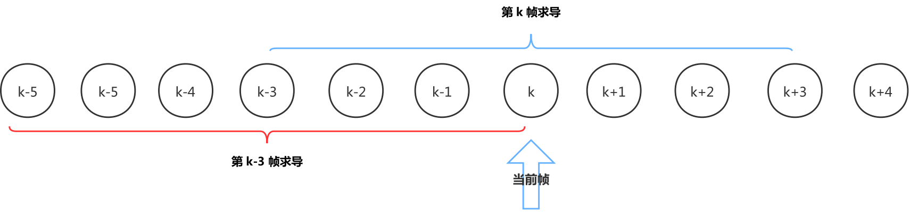
   
   - GRADDESC：使用 Conjugate Gradient 算法，生成 160 个采样点；（对应伪代码第21 行）
   
   ```
   变量定义：
   s := 语音序列
   f := 语音序列的 13维MFCC 特征
   g := 期望的 39维MFCC 特征
   h := 目标 HMM 状态序列
   
   def main()：
       init variables as empty list: s,f,g
       select HMM state sequence according to Target Command: h
       for i in range(len(h)):
           m_l_score = MAX_FLOAT  # min LST score
           t_mfcc = None  # target MFCC, 13维
           t_g = None  # target expanded MFCC, 39维
           for j in range(len(h[i].g_mean_list))  # h[i].g_mean_list is the mean value of each Gaussian for h[i]
               (l_score, tmp_mfcc, tmp_g) = LSTDERIV(f, g, h[i].g_mean_list[j]) # tmp_mfcc is the optimal MFCC(13维) to minimize l_score, and tmp_g is the expanded MFCC(39维) extracted according to the optimal MFCC(13维).
               if l_score < m_l_score:
               	m_l_score = m_score
               	t_g = tmp_g
               	t_mfcc = tmp_mfcc
           g.append(t_g)
           s = GRADDESC(s, t_mfcc)  # 使用梯度下降算法生成新的语音序列 (新增160个点)
           f = MFCC(s)
       return s
   ```
   
4. 👍 Playing over the air：

   (1) 让音频在扬声器上更易播放：在梯度下降过程中增加音频二阶导的惩罚项；

   (2) 预测音频在物理信道上的失真；

   (3) 通过实际的物理播放来调整目标 MFCC；

5. Evaluation：

   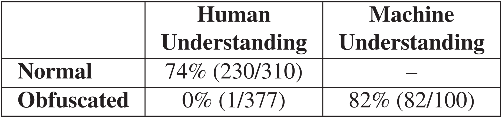

#### Defense

1. 使用**提醒用户的方式**进行防御；
2. 使用**要求用户确认的方式**进行防御；
3. 使用**低通滤波器的方式**进行防御；
4. 训练一个**对抗样本的分类器**进行防御；

### Shortcoming

1. 对于实验目标的指令选择上，不够充分，只选择了三个较短的指令进行尝试；
2. 算法的解释上面不清楚；
3. 攻击十分的耗时，文章中提到，在白盒攻击下生成一个好的对抗样本可能需要 30 个小时左右；
4. 白盒攻击中 “Playing over the air” 依赖于设备和周围环境，实际中我们并不能很好地模拟攻击场景下的噪声环境和设备；

### Links

- 论文链接：[Carlini, Nicholas, et al. "Hidden voice commands." *25th {USENIX} Security Symposium ({USENIX} Security 16)*. 2016.](https://www.usenix.org/conference/usenixsecurity16/technical-sessions/presentation/carlini)
- 论文主页：[Hidden Voice Commands](https://www.hiddenvoicecommands.com/home)
- 👍 背景噪声数据集： [Crowd Sounds — Free Sounds at SoundBible.](http://soundbible.com/tagscrowd.html)


## DolphinAttack: Inaudible voice commands

### Contribution

1. 利用麦克风非线性的特征，使得高频信号采样后出现额外的低频分量；
2. 攻击的原理：**让正常语音隐藏到高频波段中，从而让其无法被听到**；

### Notes

1. 攻击**语音前端采集模块（麦克风）**的对抗攻击（或者说，更像是一种**漏洞**）。

2. **麦克风工作原理**: 语音信号是一种波，被麦克风捕获，麦克风把波的声压转换成电信号，再通过对电信号进行采样便可获得离散时间的波形文件（引自 [李理的博客](http://fancyerii.github.io/dev287x/ssp/)）。这个过程中，LPC 模块会过滤掉超过 20kHz 的信号，ADC 模块负责采样信号：

   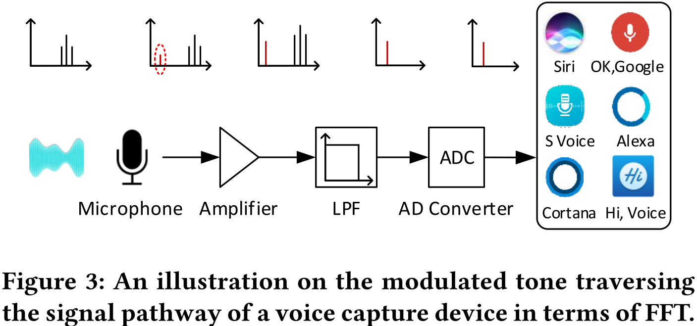

3. 👍  麦克风的非线性特征，能够使得高频的语音信号被 **downconversion** (或可以理解为**解调**) 出低频的能量分量. 

   (1) 非线性特征对**单频率语音**转录的影响, 如下图：

   

   其中第一行是**原始语音的频谱**，第二行是 **MEMS 麦克风接收后的频谱**，第三行是 **ECM 麦克风接收后的频谱**。这里采用的载波信号为 20kHz，语音信号为 2kHz。

   (2) 非线性特征对**正常说话**的影响, 如下图：

   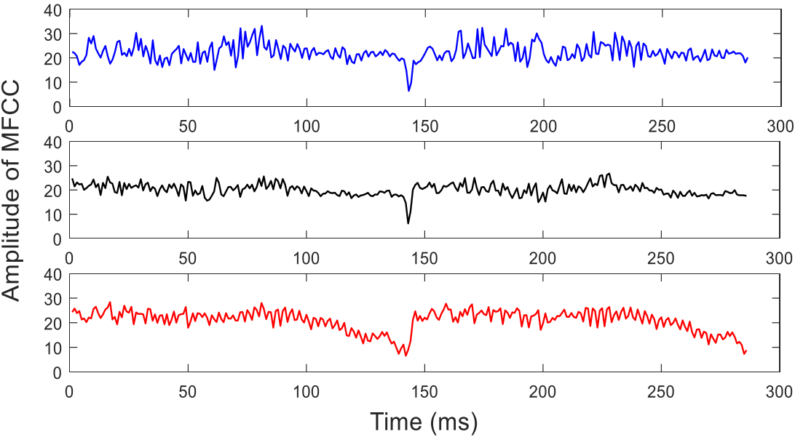

   其中第一行是原始的 TTS 语音（发音为 Hey）的 MFCC 特征，第二行是正常播放-录音后的 MFCC 特征，第三行是经过 “调制-解调”后的 MFCC 特征。计算得到他们的 MCD 距离分别为 3.1 和 7.6。（**我不是很理解 Amplitude of MFCC 是什么意思，时频的 MFCC 特征应该像热力图才对？**）

4. Voice Command Generation，生成指令用于后续调制过程：

   (1) Activation Commands Generation：使用 TTS (Text to Speech) 的方法或者是语音拼接的方法生成一个唤醒词。（可以看到在智能语音助手邻域，说话人的识别并不是很有效的，可以被说话声音相似的人激活）；

   (2) General Control Commands Generation：直接使用 TTS 生成；

5. Evaluation：这部分和信号的调制非常相关，不太易懂，直接简略地贴上结果

   

### Shortcoming:

这篇文章的攻击非常有效，因为他利用的是麦克风的 “漏洞”，所以几乎能够攻击全部平台设备。但**它的缺点是需要一台超声波发生设备**。

### Links

- 论文链接：[Roy, Nirupam, et al. "Inaudible voice commands: The long-range attack and defense." *15th {USENIX} Symposium on Networked Systems Design and Implementation ({NSDI} 18)*. 2018.](https://arxiv.org/abs/1708.09537)
- Github 主页：[USSLab/DolphinAttack: Inaudible Voice Commands (github.com)](https://github.com/USSLab/DolphinAttack)


## * Did you hear that? Adversarial Examples Against Automatic Speech Recognition

### Contribution

1. 针对关键词识别模型进行黑盒攻击；

### Notes

1. **黑盒**、**有目标**的**针对语音关键词识别**的对抗攻击算法。攻击的模型是 **Speech Commands Classification Model**，其中涉及的关键词有 `yes`、`no`、`up`、`down`、`left`、`right`、`on`、`off`、`stop` 和 `go` ；

2. 算法流程：

   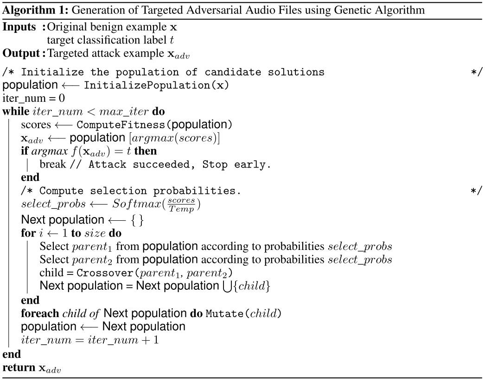

   使用**遗传算法**生成对抗样本；

### Links

- 论文链接：[Alzantot, Moustafa, Bharathan Balaji, and Mani Srivastava. "Did you hear that? adversarial examples against automatic speech recognition." *NIPS Machine Deception Workshop* (2017).](https://arxiv.org/abs/1801.00554)
- 论文主页：[Adversarial Speech Commands | adversarial_audio (nesl.github.io)](https://nesl.github.io/adversarial_audio/)
- 论文代码：[nesl / adversarial_audio (github.com)](https://github.com/nesl/adversarial_audio)


## Audio Adversarial Examples: Targeted Attacks on Speech-to-Text

### Contribution

1. 白盒、有目标的、攻击端到端 DeepSpeech 模型（CTC）的对抗攻击算法；

### Notes

1. **白盒**、**有目标**的对抗攻击算法。攻击的模型为 **DeepSpeech** 模型，攻击的指令为**任意长度**；

2. **基础**的攻击方法，loss 函数（ 后半部分为 CTC-Loss ）如下：

   

   作者提到使用 2 范数而不用无穷范数的原因是，无穷范数可能会导致不收敛的问题，难以训练。在参数的选择上，作者使用 Adam 算法，学习率为 5，迭代论述为 5000。在实验过程中，作者发现**目标指令越长**，需要添加越多的扰动来生成对抗样本；而如果**原始指令越长**，似乎更加容易生成对抗样本（这一点我的想法是，**如果原始指令越长，原始存在更多的音素和能量可以被梯度下降过程利用**）。

3. 👍  **改进**的攻击方法（<u>作者称：这种改进的攻击方法只能在 DeepSpeech 使用 Greedy-Search 的情况下有效</u>），loss 函数如下：

   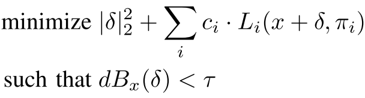

   其中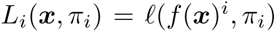 表示对于当前 alignment，第 i 帧的 loss 值。作者这样修改 loss 函数的原因大致有两个：

   (1) 如果使用 CTC-Loss，会添加不必要的修改。**如果已经解码出 ”ABCX“，目标指令为 ”ABCD“，在使用 CTC-Loss时，梯度下降算法仍然会在 ”A“ 上添加扰动使得其变得更像 ”A“**；

   (2) **不同的字符生成的难易程度是不同的**，所以把权重系数 c 移到了累加的里面。( **这一点作者称是在 [Hidden Voice Command]() 中发现的规律，但其实只是在附录中给出了不同的单词可能需要的最短音素帧的数量是不同的，并没有给出字符难易程度的结论；并且这篇文章开源的代码中也没有给出这个改进的 loss 函数，所以可以直接把这个 c 移出去作为单个参数进行调参** )；

   训练的 **trick**：首先用 CTC-Loss 生成一个对抗样本，以这个对抗样本为参照固定 alignment（在 CTC 中，可能有许多种alignment，作者通过这种方法来确定选择其中一种），然后用改进的 loss 函数来生成；（这边，我的想法是，**改进的攻击方法会使得对抗样本丧失其迁移性，因为它只是恰好将特征拟合到模型的边界而已，而没有去进一步地逼近泛化的特征上**）

4. Evaluation：

   (1) 作者在原始指令的基础上通过非常小（约为 -30dB）的扰动生成对抗样本，并且在白盒的情况下最多可以在 **1s** 的语音中插入 **50** 个字符；

   (2) **对于 Non-Speech，作者发现更难生成对抗样本**；

   (3) 作者还对比了 FGSM 和 Iterative Optimization 两种生成对抗样本的算法，发现**在语音识别领域 FGSM 只适合生成 un-targeted 样本，而不适合生成 targeted 样本（或者说生成的效率很差，几乎没有办法生成）**；

   (4) 作者发现**这种方法生成的对抗样本是对噪声不鲁棒的**；

### Links

- 论文链接：[Carlini, Nicholas, and David Wagner. "Audio adversarial examples: Targeted attacks on speech-to-text." *2018 IEEE Security and Privacy Workshops (SPW)*. IEEE, 2018.](https://arxiv.org/abs/1801.01944)
- 论文主页：[Audio Adversarial Examples (carlini.com)](https://nicholas.carlini.com/code/audio_adversarial_examples)
- 论文代码：[carlini/audio_adversarial_examples: Targeted Adversarial Examples on Speech-to-Text systems (github.com)](https://github.com/carlini/audio_adversarial_examples)


## Adversarial Attacks Against Automatic Speech Recognition Systems via Psychoacoustic Hiding

### Contribution

1. 白盒、有目标的、针对API的、针对Kaldi DNN-HMM模型的对抗攻击算法；
2. 首次提出使用声学掩蔽效应；
3. 实验部分做的很全面，值得借鉴；

### Notes

1. **白盒**、**有目标**的、**只针对API**的对抗攻击算法。攻击的模型为 Kaldi 的 **WSJ** 模型（或称为 recipe）；

2. 攻击方法整体架构如下：

   

   (1) **Forced Alignment**：时序信号经过分帧后，每一帧都有对应音素的概率分布（Kaldi 中使用 [tri-phone](https://flashgene.com/archives/105296.html)，直接说音素比较好理解）。作者根据目标指令和原始语音找到一个最好的对齐方式，目的是为了**使得修改量最小**；

   (2) **Back-propagation in Feature Extraction**：语音识别过程给网络的一般是 MFCC、Mel-log Filter Bank 等语音特征，把它简单地理解成是一张**二维热力图**，算法需要把梯度从这个特征回传到时域信号。（Kaldi 不像 tensorflow 那样直接就帮你把梯度计算好了，所以作者去推导了相关的梯度计算公式。不过，<u>这里作者只推导了对数能量谱的梯度，但是 WSJ 里面用的应该是 MFCC 才对。另外不清楚作者用的是优化器，还需要看一下 Kaldi 代码。</u>）。

   (3) 👍  **Hearing Thresholds**：**心理声学掩蔽效应**，可以计算出音频各个时间、各个频率点的**能量掩蔽值**，只要修改量不超过这个值，那么人就不会察觉。下图展示了在 1kHz 处 60dB 信号的能量掩蔽曲线（黑色），绿色的为人耳能够感受到声音的最小能量（如 20kHz 的声音，至少要达到 70dB 我们才听得到）：

   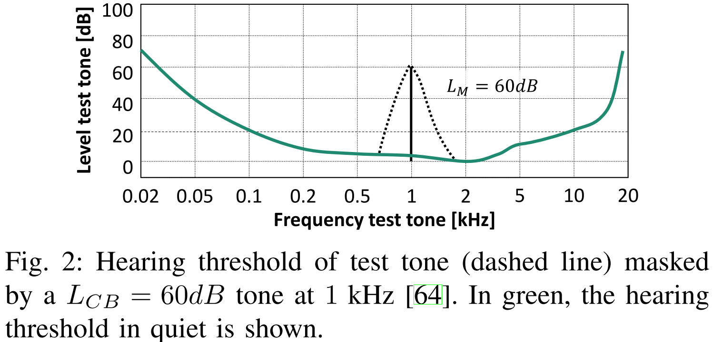

   作者计算样本的能量变化 D，并期望 D 在任何时间、频率点均小于掩蔽阈值 H，公式如下（<u>论文中的公式有个小错误，f 应该是 k</u>）：

   

   变量 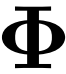 度量能量变化 D 和 掩蔽阈值 H 之间的差值。如果 D 在任何点都不能超过 H ，这样的限制条件过于苛刻，可能会导致无法生成对抗样本。故作者添加一个系数来放宽这个限制条件，公式如下：

   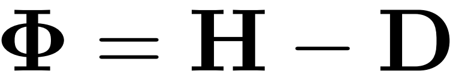

   

   将  小于 0 的值置为 0 并归一化到 0~1，公式如下：

   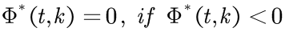

   

   只添加  到梯度回传中时，作者发现差点意思。将 H 归一化到 0~1，公式如下：

   

   最后作者将这两个系数结合到 DFT 的梯度回传上（声学特征的计算这里不做解释了，推荐 [Mel Frequency Cepstral Coefficient (MFCC) tutorial](http://practicalcryptography.com/miscellaneous/machine-learning/guide-mel-frequency-cepstral-coefficients-mfccs/)），公式如下：

   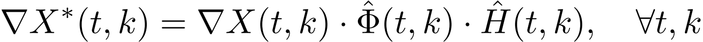

   我对这一块的理解：**整体来看，作者想要使用 ”心理声学掩蔽效应“ 来生成更具隐藏性（或者说修改量小）的对抗样本，他认为 “当前掩蔽值大” 、并且“修改量远小于掩蔽值” 的点可以添加更多的扰动，回传的梯度可以更大；而 “当前掩蔽值小”、或者是 “修改量已经接近掩蔽值“ 的点不应该再做更多的修改，回传的梯度趋近于 0 。相对而言，我更喜欢 ”Imperceptible, Robust, and Targeted Adversarial Examples for Automatic Speech Recognition“ 的工作，他们直接将 ”心理掩蔽效应“ 添加到了 loss 函数中去，让模型自己来选择梯度的变化。**

   最后思考一个问题：**这样用掩蔽阈值和 perturbation 的差值来度量真的是一种好的方法吗？可能不是，我们其实更希望的是去度量 频率掩蔽曲线 的变化有多大。举例来说，计算掩蔽阈值的时候首先得到的是 masker（可以理解为一个频率点，其能量是个极值点），我们在 masker 处增加能量来抬高 masker（完全可以做到增加的能量低于 masker 处的掩蔽值，因为这个点的掩蔽值等于 masker 的能量，这个值是很大的），这样人耳的听觉感受已经发生了改变。但是如果要这么来做，就要用可求解梯度的方法来实现 ”计算掩蔽值“ 的过程，过程实在是很复杂，这也可能是大家不这么做的原因（代价太大，做出来还不知道能不能收敛，效果好不好）。**

3. 👍  Evaluation：

   (1) 目标指令：

   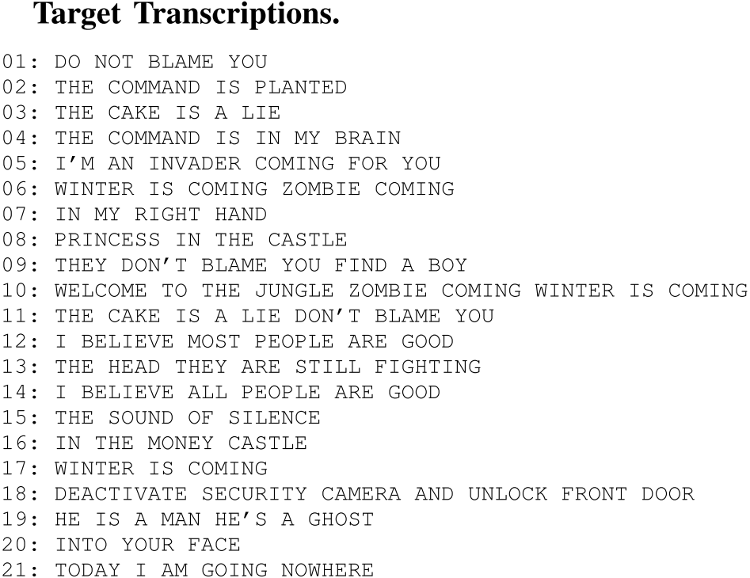

   (2) 原始音频：Speech (从 WSJ 数据集中获取) + Music

   (3) 评估指标：**WER** 和 **平均修改能量**，前者越小越好，后者越大越好；

   (4) 分析 Hearing Threshold 和 Forced Alignment 的效果，学习率 **0.05 (这个和其他的工作相差挺大，猜测可能是因为有像 librosa 那样的 normalization)**，迭代 **500** 轮：

   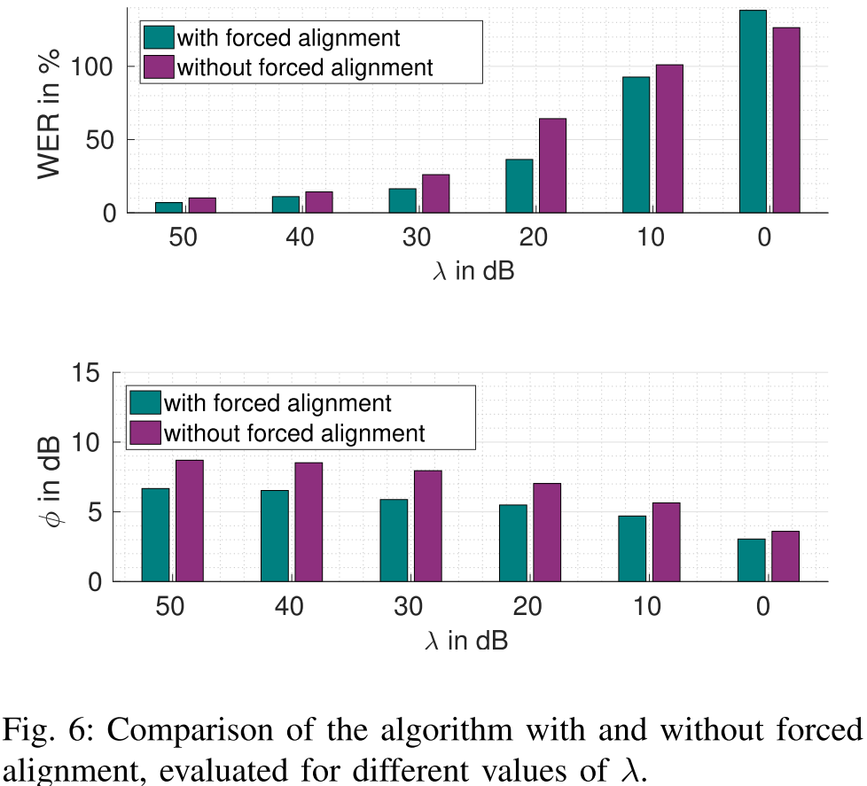

   (5) 分析单位时间嵌入词数量的影响：

   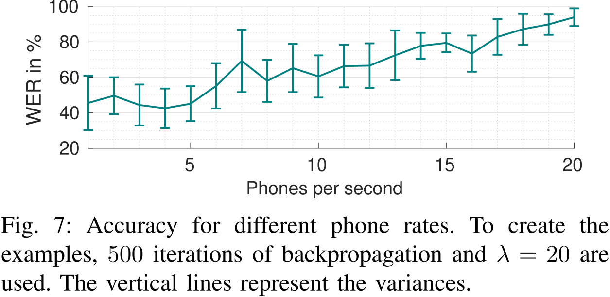

   (6) 分析迭代轮数的影响：

   

   (7) 和 CommandSong 进行对比，对比的指标为 SNR ：

   

   

### Links

- 论文链接：[Schönherr, Lea, et al. "Adversarial attacks against automatic speech recognition systems via psychoacoustic hiding." *arXiv preprint arXiv:1808.05665* (2018).](https://arxiv.org/abs/1808.05665)
- 论文主页：[Adversarial Attacks (adversarial-attacks.net)](https://adversarial-attacks.net/)
- 论文代码：[rub-ksv/adversarialattacks: Adversarial Attacks (github.com)](https://github.com/rub-ksv/adversarialattacks)


## * Targeted adversarial examples for black box audio systems

### Contribution

1. 黑盒、有目标的攻击 DeepSpeech 的对抗攻击算法；
2. 结合遗传算法和梯度下降算法 (**在语音上没人这么来做过，但是其实在图像识别上面这种黑盒攻击不是新鲜事了，所以在算法上面没有创新型，而且直接应用到语义领域，出现了 query 次数巨大的问题**)；
3. 思路是值得借鉴的，黑盒攻击一定有比白盒攻击更加 interesting 的问题，但是不能照搬图像领域的方法；

### Notes

1. **黑盒**、**有目标**的对抗攻击算法。攻击的模型为 **DeepSpeech** 模型，选择的方式是 **遗传算法和梯度下降算法的结合**；

2. 原始音频与目标指令: 从 CommonVoice 测试集中挑选出**前100个样本**作为原始音频，目标指令都是 **2** 个词的指令，比较短；

3. 攻击场景: 作者假设 DeepSpeech 模型是不可知探知的，但是知道模型最后的概率分布的输出，并且针对 Greedy Decoding 进行攻击 （我的想法：**这样的攻击场景其实是不常见的，所以这个工作可能指导意义不大，但是我们应该思考一下，如果 ASR 模型经过了 LM 模型的修饰，还能不能用黑盒探测的方法来生成对抗样本？如果能，代价又有多大？**）；

4. 算法流程：

   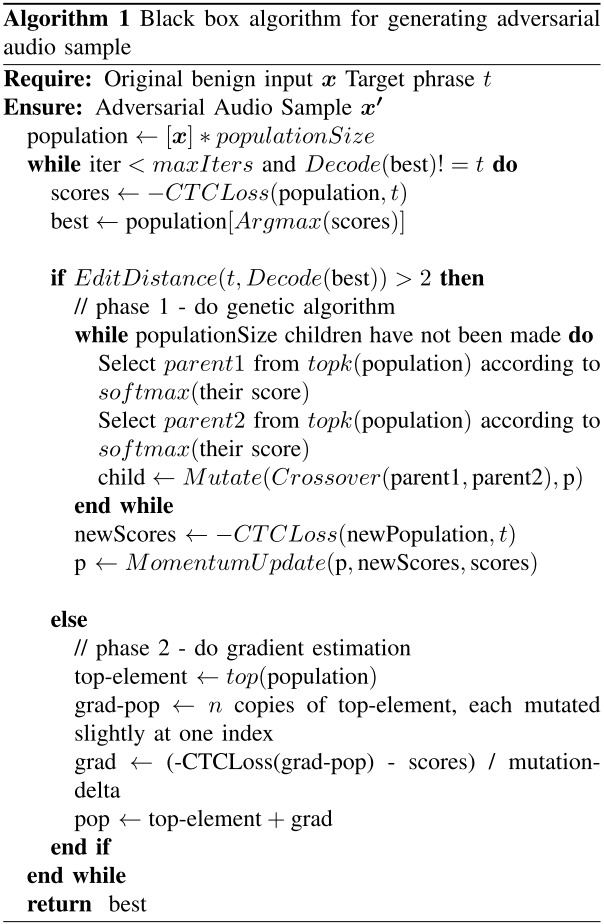

   (1) 当样本解码的字符串距离目标指令较大时，使用遗传算法生成对抗样本，遗传算法的评分函数使用 CTC-Loss，其变异概率 p 由函数 `MomentumUpdate`进行更新；

   

   (2) 当样本解码的字符串距离目标指令较小时，使用黑盒-梯度下降算法生成对抗样本，对每个序列样本点 ( <u>花费巨大，对于一个 16kHz 的 5s 语音，每轮都要调用目标模型进行解码 80k 次</u> ) 都分别添加小的扰动，根据 CTC-Loss 值的变化，确定扰动的影响是正面的还是负面的、是重要的还是不重要的；

   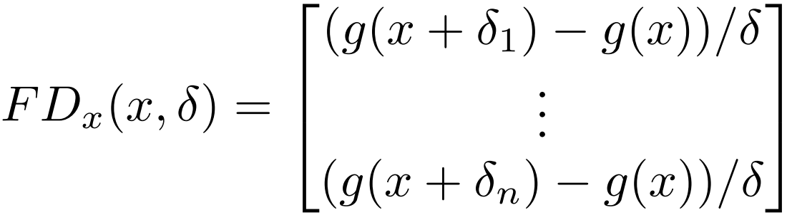

5. Evaluation：

   (1) 使用 100 条原始语音，每个语音的目标指令是随机从 1000 个最常用的英语单词中抽取的 2 个单词，每个对抗样本，设置生成 3000 轮；

   (2) 使用 Success Rate 来评估成功率，对抗样本的成功率为 35%；使用 Cross Correlation Coefficient 来评估相似性，对抗样本与原始语音的相似性为 94.6% (这里只看成功的对抗样本)；

### Links

- 论文链接：[Taori, Rohan, et al. "Targeted adversarial examples for black box audio systems." *2019 IEEE Security and Privacy Workshops (SPW)*. IEEE, 2019.](https://arxiv.org/abs/1805.07820)
- 论文代码：[rtaori/Black-Box-Audio: Targeted Adversarial Examples for Black Box Audio Systems (github.com)](https://github.com/rtaori/Black-Box-Audio)


## Robust Audio Adversarial Example for a Physical Attack

### Contribution

1. 引入脉冲响应；
2. 实现了较高的物理攻击成功率，并且用了两组播放和接收设备；
3. 指令过短，实验应该增加更多的物理环境；

### Notes

1. **白盒**、**有目标**的**针对物理环境**的对抗攻击算法。攻击的模型为 **DeepSpeech** 模型，选取的指令都比较**短**；

2. 在图像领域的对抗攻击算法中，[Athalye et al., 2018] 等人提出了用一个抽象函数 t 来模拟物理环境下打印和拍照在样本上带来的扰动。将这个抽象函数 t结合到对抗样本的生成过程中去，可以大大增强生成的对抗样本的鲁棒性；

3. 作者提出的方法，关键点有三个：

   (1) **带通滤波器**。因为人的听觉频率范围是有限的，听筒-扬声器在工作的时候很多会直接丢弃其他频率的能量，所以作者设置了一个 **1000~4000** 范围的带通滤波器来减少修改量（我的看法：**我觉得 4000 这个上界是比较靠谱的，而 1000 这个下界可能并不合理，因为语音中低频的能量是比较多的，这部分的能量应该也是比较重要的；而这种带通滤波器的方法是否真的能够减少修改量也是存在问题的，因为依靠梯度下降算法，可能你限制了它修改的频带范围，需要的修改量可能是更多的**）。形式化公式如下：

   

   (2) 👍  **脉冲响应**。作者在生成对抗样本的过程中，添加脉冲响应的卷积来增强对抗样本对不同房间环境的鲁棒性。形式化公式如下：

   

   (3) **高斯白噪声**。作者在生成对抗样本的过程中，添加高斯白噪声来增强对抗样本对背景白噪声的鲁棒性。形式化公式如下：

   

4. Evaluation：

   (1) 作者其他的实现的细节与文章 [”Audio Adversarial Examples: Targeted Attacks on Speech-to-Text“](#Audio Adversarial Examples: Targeted Attacks on Speech-to-Text) 是一样的，Adam 迭代器和 CTC-Loss 函数；

   (2) 👍 提到了一个比较有意思的攻击场景：**FM radio**；

   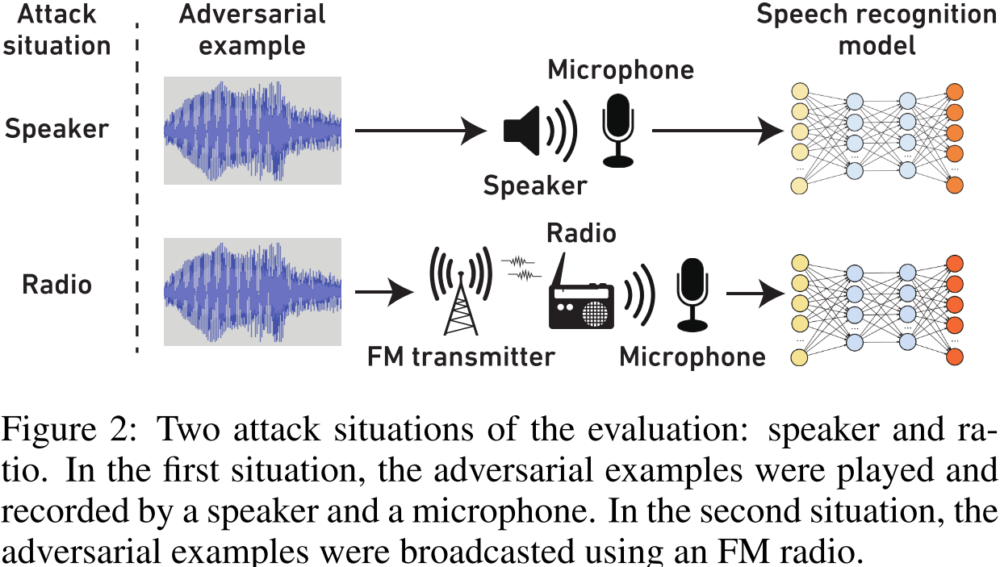

   > 思考一下: 这种攻击场景多吗? 未来的车辆控制可能会受到 FM 的攻击!

   (3) 分析针对 API 的攻击：

   

   (4) 分析针对物理的攻击：

   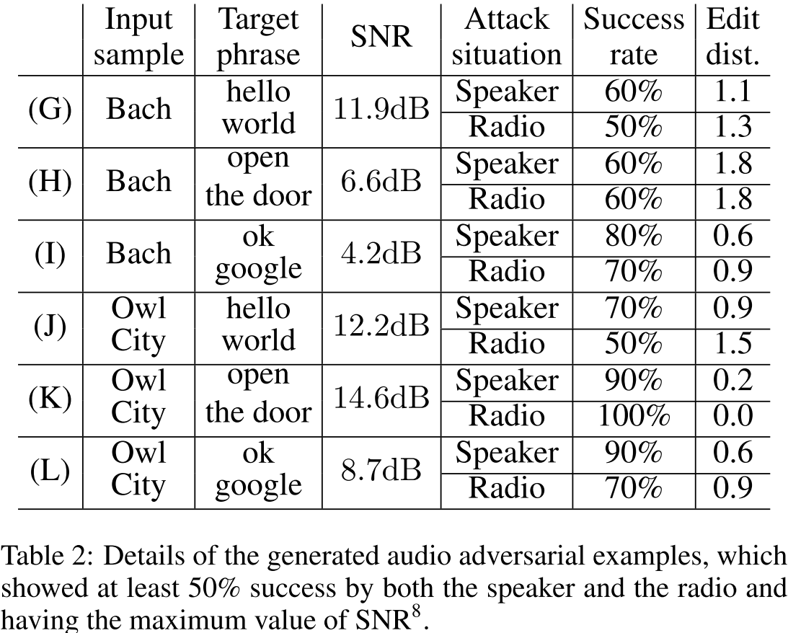
   
   每个样本尝试 10 次（**测试次数太少了**），统计成功率，并且发现只保证成功率高于 50% 的情况下，可以适当减少修改量。

### Links

- 论文链接：[Yakura, Hiromu, and Jun Sakuma. "Robust audio adversarial example for a physical attack." *arXiv preprint arXiv:1810.11793* (2018).](https://arxiv.org/abs/1810.11793)

- 论文主页：[Robust Audio Adversarial Example for a Physical Attack (yumetaro.info)](https://yumetaro.info/projects/audio-ae/)

- 论文代码：[hiromu/robust_audio_ae: Robust Audio Adversarial Example for a Physical Attack (github.com)](https://github.com/hiromu/robust_audio_ae)

- 冲击响应：

   [The reverb challenge: A common evaluation framework for dereverberation and recognition of reverberant speech (ieee.org)](https://ieeexplore.ieee.org/document/6701894)

   [A binaural room impulse response database for the evaluation of dereverberation algorithms (ieee.org)](https://ieeexplore.ieee.org/document/5201259)

   [Acoustical Sound Database in Real Environments for Sound Scene Understanding and Hands-Free Speech Recognition (naist.jp)](https://library.naist.jp/dspace/handle/10061/8220)

   [Evaluation of speech dereverberation algorithms using the MARDY database (2006) (ist.psu.edu)](http://citeseerx.ist.psu.edu/viewdoc/summary?doi=10.1.1.727.1869)

   [Acoustic measurement data from the varechoic chamber (nist.gov)](https://www.nist.gov/document-14705)


## Hear "No Evil", See "Kenansville": Efficient and Transferable Black-Box Attacks on Speech Recognition and Voice Identification Systems

### Contribution

1. 一种黑盒的无目标对抗攻击

### Notes

<u>不是很值得看, 故仅做罗列.</u>

### Links

- 论文链接: [Abdullah, Hadi, et al. "Hear" No Evil", See" Kenansville": Efficient and Transferable Black-Box Attacks on Speech Recognition and Voice Identification Systems." *arXiv preprint arXiv:1910.05262* (2019).](https://arxiv.org/abs/1910.05262)


## Imperceptible, Robust, and Targeted Adversarial Examples for Automatic Speech Recognition

### Contribution

1. 白盒、有目标的、针对端到端 LAS 模型的对抗攻击算法；
2. 心理掩蔽效应；
3. 模拟房间声学响应；

### Notes

1. **白盒**、**有目标**的对抗攻击算法。攻击的模型为  Lingvo 框架的 **LAS** 模型，攻击的指令选取了 1000 条**中等长度**的字符串;

2. 论文方法的关键点在于两方面，一是使用了**心理掩蔽效应**来提高对抗样本的隐蔽性，另一是**模拟房间声学响应**来提高对抗样本的鲁棒性;

3. **心理掩蔽效应，（简单来讲）就是能量大的声音可以频闭能量小的声音，主要分为时间掩蔽和频率掩蔽**。与 [“Adversarial Attacks Against Automatic Speech Recognition Systems via Psychoacoustic Hiding”](#Adversarial Attacks Against Automatic Speech Recognition Systems via Psychoacoustic Hiding) 相同，作者也用频率掩蔽效应。添加心理掩蔽效应后的 loss 函数：
   
    
    
    
    
    
    前面部分保证**样本的成功率**，后面部分保证**样本的隐藏性**，**alpha** 控制两者的权重。作者生成对抗样本的时候有一个 **trick**（因为作者把两个放在一起时发现很难生成对抗样本）：( **Stage-1** ) 先根据前面的 loss 函数生成一轮对抗样本，( **Stage-2** ) 然后根据后面的 loss 函数生成一轮对抗样本，如果 stage-2 迭代 **20** 轮后，成功生成了对抗样本，那就把 alpha 增大一些（**说明可以增加一些隐藏性**）；如果 stage-2 迭代 **50** 轮，都没能生成对抗样本，那就把 alpha 减小一些（**说明需要牺牲一些隐藏性**）。具体的迭代生成算法如下：
    
    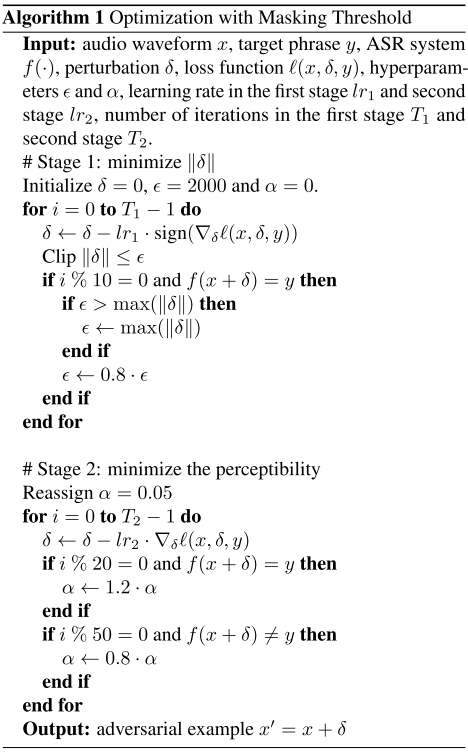
    
4. **模拟房间声学响应**，简单来说，当固定了房间的参数和你设备的参数，你可以将整个物理信道用一个函数 t(x) 来建模。添加房间声学响应后的 loss 函数：

    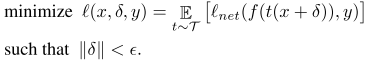

    训练的 **trick** ：( **Stage-1** ) 使用  `lr_1=50` 迭代 *2000* 轮保证在其中 **1 个房间声学响应**下能够生成对抗样本，( **Stage-2** ) 然后使用 `lr_2=5` 迭代 *5000* 轮来保证在另外随机采样的 **10 个房间声学响应**下都能够生成对抗样本（这个期间不再减小 **perturbation** 的上限）。

5. 👍  结合心理掩蔽效应和模型房间声学响应。结合后的 loss 函数:

    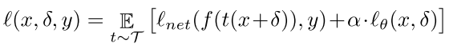

    训练的 **trick** ：( 在 **4** 的对抗样本基础上 ) 结合整个 loss 函数来生成具有隐藏性的对抗样本，和 3 中的分两步生成不同。

6. Evaluation: 

    (1) 直接攻击 API: 成功率 100%, 添加的扰动几乎无法察觉; ( <u>可以直接上主页听一下效果, 直接攻击的效果还是非常不错的, 不过意义不是很大, 打比赛的时候可能效果会很好</u> )

    (2) 转录后攻击 API: 大概的成功率在 60% 左右

    

    (3) 隐藏性, 隐藏性没有采用常用的 SNR 来度量, 而是直接采用**问卷调查**的形式, 作者的问卷调查的问题分别为:

    - 音频是否清晰；
    
    
    - 分辨两个音频哪一个是原始音频；
    
    
    - 判断两个音频是否相同；

### Links
- 论文链接：[Qin, Yao, et al. "Imperceptible, robust, and targeted adversarial examples for automatic speech recognition." International Conference on Machine Learning. PMLR, 2019](https://arxiv.org/abs/1903.10346).

- 论文主页：[Imperceptible, Robust and Targeted Adversarial Examples for Automatic Speech Recognition (ucsd.edu)](http://cseweb.ucsd.edu/~yaq007/imperceptible-robust-adv.html)
- 论文代码：[cleverhans/examples/adversarial_asr at master · tensorflow/cleverhans (github.com)](https://github.com/tensorflow/cleverhans/tree/master/examples/adversarial_asr)


## * Practical Hidden Voice Attacks against Speech and Speaker Recognition Systems

### Contribution

1. Hidden Voice Commands 的延续, 将正常语音模糊化, 攻击特征提取模块;
2. 从这篇文章可以看到**语音对抗攻击在物理, 黑盒环境下的重重困难**;

### Notes

1. **黑盒**, (自称) **对不同硬件设备鲁棒**的, 攻击**特征提取模块**的语音对抗攻击.

2. 作者指出前面工作的一些**问题**:

   - 需要借助白盒知识进行攻击;
   - 对不同的硬件 ( 麦克风和扬声器 ) 有不同的效果;

3. 这篇文章是对 Hidden Voice Commands Black-box 攻击的扩展, 首先看一下语音识别的各个模块:

   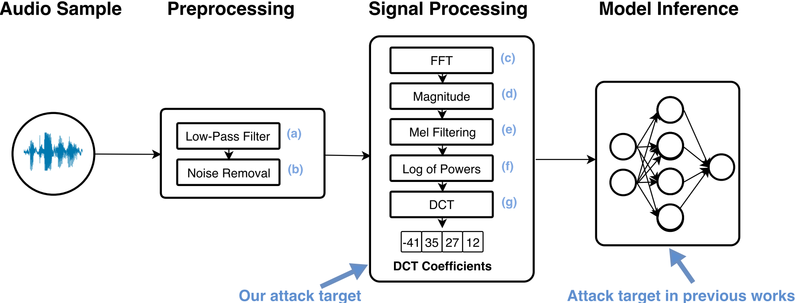

   大多数的白盒攻击关注的是深度神经网络模块, 对这个模块运用梯度下降算法生成对抗样本, 而这里作者则是考虑**攻击 Signal Processing 模块**, 即攻击特征提取模块;

> 思考一下: 文章指出, 使用低维有限的语音特征训练神经网络 为 ( 添加扰动 )生成对抗样本 提供了可能, 那么高采样率训练的模型一定不容易受到对抗攻击吗?

4. 攻击距离约为 **34 cm**;

5. 👍 作者的攻击方法很简单, **利用特征提取过程中的"多对一"问题**, 结合下面这幅图来看:

   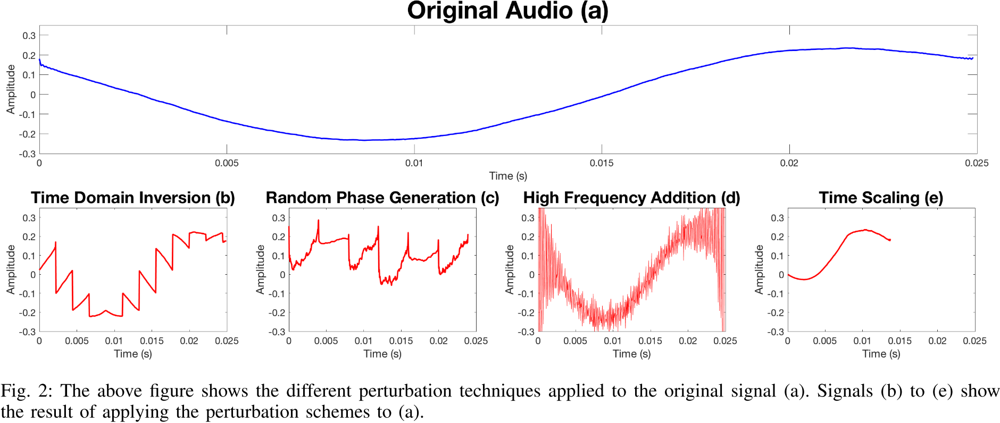

   - Time Domain Inversion (TDI): 在时域上, 在每个小窗内前后翻转信号. 攻击的是**特征提取过程中的分帧**, 如果窗口大小刚好重合的话, 那么翻转后的信号计算FFT是不变的 ( ~~这里作者没有考虑到帧移的问题~~, 作者在实验部分称, **TDI 的窗口大小并不需要和特征提取算法的窗口大小一致** ). 而翻转后的语音因为不连续的问题, 人耳听起来更像噪声;

   - Random Phase Generation (RPG): 随机挑选一些实数域和虚数域的值来代替原频谱的值. 攻击的是**频谱求能量谱的环节( 平方求能量 )**, 如下公式:
     $$
     magnitude_{original} = Y = \sqrt{a_0^2+b_0^2i} = \sqrt{a_n^2+b_n^2i}
     $$
     这里可以看到, 一个能量谱可以对应多个不同的频谱, 所以就可以去替换 $a_0$ 和 $b_0$ 的值达到模糊的效果; ( <u>进一步思考后, 我认为这种变换是不靠谱的, 因为语音信号是实信号, 如果用复数域来表示的话, 在存储时应该会丢弃虚数部分, 那么这样变换后的频谱就发生了改变</u> )

   - High Frequency Addition (HFA): 高频掩蔽低频 ( 心理声学掩蔽效应 ), 而高频的声音会在特征提取之前就被过滤;

   - Time Scaling (TS): 加速语音, 语音加速之后人耳更不容易听清 ( <u>作者这里没有考虑应用 TS 会导致语音实际计算出的 MFCC 值会发生改变. 这种改变, 不只是时间上的不对应; 想象一下, 语音加快了, 那么声音的频率势必会上升啊</u> ). 作者实际在做的时候, 直接就探测黑盒能够承受的最快加快速度;

   - Improved Attack Method: 不同的词可以修改的程度是不一样的, 所以可以让不同词经过不同的参数生成对抗样本;

   - <u>从后面的实验来看, 作者在物理攻击下其实只用了 TDI 和 TS 两种修改方法, 故我挺好奇该攻击方法的实用性的</u>;

6. Evaluation

   (1) 不同的攻击场景: Over-the-Line 和 Over-the-Air, 直接将样本交给 API 或者是经过物理信道以后再交给 API. 这里作者提到了一个点: **在 Over-the-Air 下成功的样本, 并不一定能够在 Over-the-Line 情况下成功**, 作者在实际攻击的过程中, 还是拿的 Over-the-Line 的样本进行 Over-the-Air 的测试;

   (2) 攻击的模型: 测试的模型还是比较全面的;

   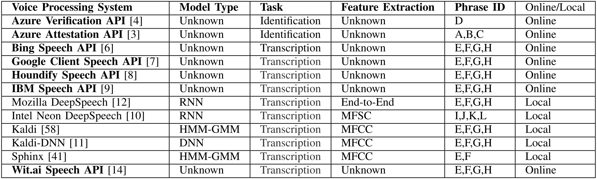

   (3) 指令: 在 ASR 的测试上, 作者使用了 4 条指令 ( 其中 I, J, K, L 只用在 `Intel Neon Deepspeech` 上 ), 长度为 2~4 个单词;

   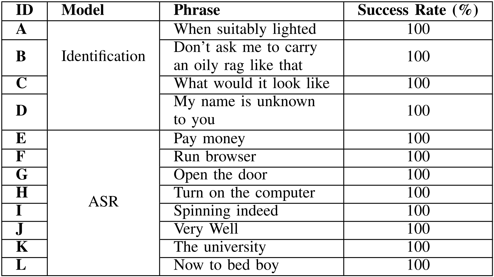

   ⭐ **测试的指令少, 并且短, 是黑盒, 物理的语音对抗攻击存在的通病**. 这里作者提到了一个点: **他没有使用如 `Ok Google` 这样的唤醒词作为目标指令, 因为唤醒词通常使用的模型, 训练的方法都会和正常的语音识别有所不同, 并且不同平台之间唤醒词的鲁棒性也存在差异, 因此对这些词进行攻击是存在偏差的**;

   > 思考一下: 
   >
   > ​	我们如何增强黑盒, 物理语音对抗攻击的攻击能力( **鲁棒性, 迁移性, 隐藏性** )呢?
   >
   > ​	对于攻击的偏差, 不仅仅存在于唤醒词部分. 每个目标模型的训练过程都不可能相同, 可能存在 "不同模型被攻击的成功率不同", "相同模型对不同词攻击的成功率不同" 等偏差, 这些偏差如何来衡量?
   >
   > ​	黑盒, 物理语音对抗攻击缺乏一个衡量他们攻击能力的指标.

   (4) 👎 实验设备: Audioengine A5 speaker + Behringer microphone, iMac speaker + Motorola Nexus 6; ( <u>作者只用了两套设备进行测试, 但是直接下了一个设备鲁棒的结论, 这个我是不太赞同的</u> )

   (5) 实验结果:

   - Over-the-Line: 如"指令"图中, 作者测试为 100% 成功率, 但是未给出相关的参数;

   - Over-the-Air: 如下图

     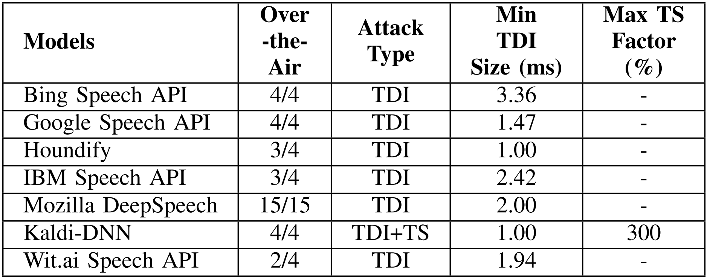

   - 对参数的解释: -- 攻击中使用的窗口大小( 影响 TDI 和 RPG )越小, 音频的修改量越大; -- 最小的窗口大小为 1ms; -- 作者在实验中使用 150% 的加速, 1ms 左右的窗口大小以及 8000Hz 左右的高频扰动;

   - 选择音质最差的音频: 作者称, 窗口越小, 或高频扰动约多, 或加速越快, 使得音频修改量越大; 在这个前提下, 作者从 2W 个样本中挑选出 10 个样本, 然后**通过人耳来听** ( <u>隐蔽性的度量问题, 作者并不考虑修改量的问题</u> );

   - 👎 样本: 在论文主页可以看到 4 个他们展示的样本( <u>实在是太少了</u> ), 第四个样本的指令是 "call to mom", 我认为听觉还算比较明显, 其他几条指令听起来更像是噪声;

### Links

- 论文链接:  [Abdullah, Hadi, et al. "Practical hidden voice attacks against speech and speaker recognition systems." *NDSS* (2019).](https://arxiv.org/abs/1904.05734)
- 论文主页: [pratical hidden voice](https://sites.google.com/view/practicalhiddenvoice)


## * Adversarial Black-Box Attacks on Automatic Speech Recognition Systems using Multi-Objective Evolutionary Optimization

### Contribution

1. 设想在黑盒攻击的过程中, 引入两个评价指标, 以**解决 声学相似性 和 文本相似性 这两个 trade off 的问题**;

### Notes

1. 黑盒, 有目标 / 无目标的对抗攻击;

2. 方法: 

   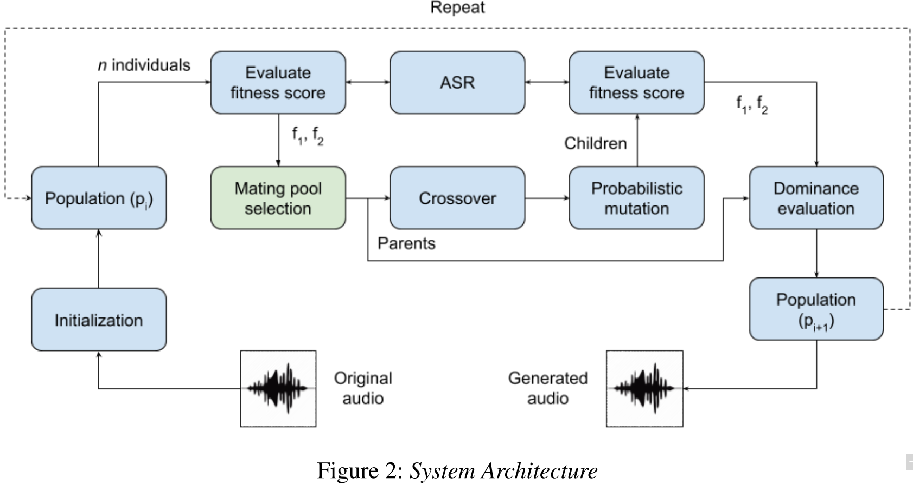

   整体的方法是**遗传算法**, 和前面用的遗传算法的不同之处在于作者使用了两个目标作为 fitness 的度量: (1) 声学的相似性 - MFCC距离; (2) 文本的相似性 - 文字编辑距离; 

3. 需要大量 query 是当前黑盒攻击的痛点;

### Links

- 论文链接:  [Khare, Shreya, Rahul Aralikatte, and Senthil Mani. "Adversarial black-box attacks on automatic speech recognition systems using multi-objective evolutionary optimization." *arXiv preprint arXiv:1811.01312* (2018).](https://arxiv.org/abs/1811.01312)
- 论文主页:  https://shreyakhare.github.io/audio-adversarial/

