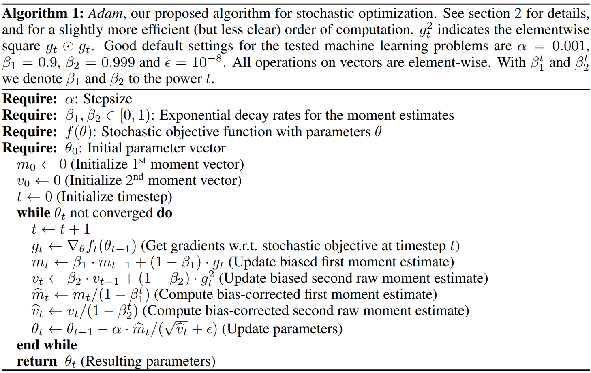

# Model on Speech Recognition


[TOC]

## Todo List

1. Chiu, Chung-Cheng, et al. "State-of-the-art speech recognition with sequence-to-sequence models." *2018 IEEE International Conference on Acoustics, Speech and Signal Processing (ICASSP)*. IEEE, 2018.
2. Zou, Wei, et al. "Comparable study of modeling units for end-to-end mandarin speech recognition." *2018 11th International Symposium on Chinese Spoken Language Processing (ISCSLP)*. IEEE, 2018.
3. Park, Daniel S., et al. "Specaugment: A simple data augmentation method for automatic speech recognition." *arXiv preprint arXiv:1904.08779* (2019).
4. Hannun, Awni, et al. "Deep speech: Scaling up end-to-end speech recognition." *arXiv preprint arXiv:1412.5567* (2014).
5. Amodei, Dario, et al. "Deep speech 2: End-to-end speech recognition in english and mandarin." *International conference on machine learning*. 2016.
6. Battenberg, Eric, et al. "Exploring neural transducers for end-to-end speech recognition." *2017 IEEE Automatic Speech Recognition and Understanding Workshop (ASRU)*. IEEE, 2017.
7. T. N. Sainath and C. Parada. Convolutional neural networks for small-footprint keyword spotting. In Sixteenth Annual Conference of the International Speech Communication Association, 2015
8. tensorflow优化器源码


## AIC 和 BIC 准则

### Notes

模型选择问题在 **模型复杂度** 与 **模型对数据集描述能力** 之间寻求最佳平衡；

#### AIC 准则

赤池信息准则（Akaike Information Criterion，AIC），AIC 定义为：
$$
AIC=2k−2ln(L)
$$
其中 $k$ 为参数个数，$L$ 为似然函数。从一组可供选择的模型中选择最佳模型时，**通常选择 AIC 最小的模型**：

- 当两个模型之间存在较大差异时，差异主要体现在似然函数项，当似然函数差异不显著时，上式第一项，即模型复杂度则起作用，从而**参数个数少**的模型是较好的选择；
- 一般而言，当模型复杂度提高（$k$ 增大）时，似然函数 $L$ 也会增大，从而使 AIC 变小，但是 $k$ 过大时，似然函数增速减缓，导致 AIC 增大，模型过于复杂容易造成过拟合现象;
- 目标是选取AIC最小的模型，AIC不仅要提高模型拟合度（极大似然），而且引入了惩罚项，使模型参数尽可能少，有助于降低过拟合的可能性；

#### BIC 准则

贝叶斯信息准则（Bayesian Information Criterion，BIC），BIC 定义为：
$$
BIC=kln(n)−2ln(L)
$$
其中，$k$ 为模型参数个数，$n$ 为样本数量，$L$ 为似然函数。从一组可供选择的模型中选择最佳模型时，**通常选择 BIC 最小的模型**；

#### 比较

AIC 和BIC 的公式中后半部分是一样的；当 $n \ge 10^2$ 时，$kln(n)≥2k$，所以，BIC 相比AIC 在**大数据量时对模型参数惩罚得更多**，导致 BIC 更倾向于选择参数少的简单模型。所以还是**考虑使用 BIC 准则**；

### Links

- 参考链接：[AIC和BIC准则详解](https://blog.csdn.net/SanyHo/article/details/108024024)


## Optimizer in Deep Learning

### 梯度下降法（Gradient Descent）

梯度下降法的计算过程就是沿梯度下降的方向求解极小值，也可以沿梯度上升方向求解最大值。使用梯度下降法更新参数：
$$
\theta_{t+1} = \theta_t - \alpha \cdot \nabla_{\theta} J(\theta)
$$

#### 	批量梯度下降法（BGD）

在整个训练集上计算梯度，对参数进行更新：
$$
\theta_{t+1} = \theta_t - \alpha \cdot \frac{1}{n} \cdot \sum_{i=1}^{n}\nabla_\theta J_i(\theta, x^i, y^i)
$$
因为要计算整个数据集，收敛速度慢，但其优点在于更趋近于全局最优解；

#### 	随机梯度下降法（SGD）

每次只随机选择一个样本计算梯度，对参数进行更新：
$$
\theta_{t+1} = \theta_t - \alpha \cdot \nabla_\theta J_i(\theta,x^i,y^i)
$$
训练速度快，但是容易陷入局部最优点，导致梯度下降的波动非常大；

#### 	小批量梯度下降法（Mini-batch Gradient Descent）

每次随机选择 n 个样本计算梯度，对参数进行更新：
$$
\theta_{t+1} = \theta_t  - \alpha \cdot \frac{1}m \cdot \sum_{i=x}^{i=x+m-1} \cdot \nabla_\theta J_i(\theta, x^i, y^i)
$$
这种方法是 BGD 和 SGD 的折衷；

### 动量优化法

#### 	Momentum

参数更新时在一定程度上保留之前更新的方向，同时又利用当前 batch 的梯度微调最终的更新方向。在 SGD 的基础上增加动量，则参数更新公式如下：
$$
m_{t+1} = \mu \cdot m_t + \alpha \cdot \nabla_\theta J(\theta) \\
\theta_{t+1} = \theta_t - m_{t+1}
$$
在梯度方向发生改变时，Momentum 能够降低参数更新速度，从而减少震荡；在梯度方向相同时，Momentum 可以加速参数更新，从而加速收敛。

#### 	NAG（Nesterov Accelerated Gradient）

与 Momentum 不同的是，NAG 是在更新梯度是做一个矫正，即提前往前探一步，并对梯度作修改。参数更新公式如下：
$$
m_{t+1} = \mu \cdot m_t + \alpha \cdot \nabla_\theta J(\theta - \mu \cdot m_t)
\\
\theta_{t+1} = \theta_t - m_{t+1}
$$
两者的对比：蓝色为 Momentum， 剩下的是 NAG；


### 自适应学习率

#### 	AdaGrad

AdaGrad 算法期望在模型训练时有一个较大的学习率，而随着训练的不断增多，学习率也跟着下降。参数更新公式如下：
$$
g \leftarrow \nabla_\theta J(\theta) \\
r \leftarrow r + g^2 \\
\Delta \theta \leftarrow \frac{\delta}{\sqrt{r+\epsilon}} \cdot g \\
\theta \leftarrow \theta - \Delta \theta
$$
学习率随着 **梯度的平方和**（$r$）的增加而减少. 缺点：

- 需要手动设置学习率 $\delta$ ，如果 $\delta$ 过大，会使得正则化项 $\frac{\delta}{\sqrt{r+\epsilon}}$ 对梯度的调节过大；
- 中后期，参数的更新量会趋近于 0，使得模型无法学习；

#### 	Adadelta

Adadelta 算法将 梯度的平方和 改为 **梯度平方的加权平均值**。参数更新公式如下：
$$
g_t \leftarrow \nabla_\theta J(\theta) \\
E[g^2]_t \leftarrow \gamma \cdot E[g^2]_{t-1} + (1-\gamma) \cdot g_t^2 \\
\Delta \theta_t \leftarrow - \frac{\eta}{\sqrt{E[g^2]_t + \epsilon}} \cdot g_t \\
\theta_{t+1} \leftarrow \theta_t + \Delta \theta_t
$$
上式中仍存在一个需要自己设置的全局学习率 $\eta$，可以通过下式**消除全局学习率的影响**：
$$
E[\Delta\theta^2]_t \leftarrow \gamma \cdot E[\Delta\theta^2]_{t-1} + (1-\gamma) \cdot \Delta\theta_t^2 \\
\Delta \theta_t \leftarrow - \frac{\sqrt{E[\Delta\theta^2]_{t-1}+\epsilon}}{\sqrt{E[g^2]_t+\epsilon}} \cdot g_t \\
\theta_{t+1} \leftarrow \theta_t + \Delta\theta_t
$$

#### 	RMSProp

RMSProp 算法是 AdaGrad 算法的改进，修改 梯度平方和 为 **梯度平方的指数加权移动平均**，解决了学习率急剧下降的问题。参数更新公式如下：
$$
g_t \leftarrow \nabla_\theta J(\theta) \\
E[g^2]_t \leftarrow \rho \cdot E[g^2]_{t-1} + (1-\rho) \cdot g_t^2 \\
\Delta\theta \leftarrow \frac{\delta}{\sqrt{E[g^2]_t+\epsilon}} \cdot g \\
\theta \leftarrow \theta - \Delta\theta
$$

#### 	Adam（Adaptive Moment Estimation）

Adam 算法在动量的基础上，结合了偏置修正。参数更新公式如下：
$$
g_t \leftarrow \Delta_\theta J(\theta) \\
m_t \leftarrow \beta_1 \cdot m_{t-1} + (1-\beta_1) \cdot g_t \\
v_t \leftarrow \beta_2 \cdot v_{t-1} + (1-\beta_2) \cdot g_t^2 \\
\hat{m}_t \leftarrow \frac{m_t}{1-(\beta_1)^t} \\
\hat{v}_t \leftarrow \frac{v_t}{1-(\beta_2)^t} \\
\theta_{t+1} = \theta_t - \frac{\delta}{\sqrt{\hat{v}_t}+\epsilon} \cdot\hat{m}_t
$$
论文伪代码：



### Links

- 参考链接：[优化算法 Optimizer 比较和总结](https://zhuanlan.zhihu.com/p/55150256)
- Adam 论文链接：[Kingma D P, Ba J. Adam: A method for stochastic optimization[J]. arXiv preprint arXiv:1412.6980, 2014.](https://arxiv.org/abs/1412.6980)


## 高斯混合模型 GMM

### Notes

#### 高斯分布

例如，对城市人口的身高水平进行抽样调查，调查的结果就符合高斯分布，如下图所示：


**一元高斯分布**的概率密度函数公式如下所示：
$$
f_s(x|\mu,\delta^2)  = \frac{1}{\sqrt{2\delta^2\pi}} e^{-\frac{(x-\mu)^2}{2\delta^2}}
$$
**多元高斯分布**的概率密度函数公式如下所示：（$n$ 为数据的维度）
$$
f_m(x|\mu, \delta^2) = \frac{1}{(2\pi)^{\frac{n}{2}}|\Sigma|^{\frac{1}{2}}} \cdot e^{-\frac{1}{2}(x-\mu)^T\Sigma^{-1}(x-\mu)}
$$

#### 高斯混合分布

例如，对城市中的男女身高水平分别建模，这时候男生的身高符合一个高斯分布，而女生的身高则符合另外一个高斯分布，即形成了一个高斯混合分布，如下图所示：


**一元高斯混合分布**的概率密度函数公式如下所示：
$$
p(x|\phi,\mu,\delta) 
= \sum_{i=1}^K \phi_i \cdot \frac{1}{\sqrt{2\delta_i^2\pi}} e^{-\frac{(x-\mu_i)^2}{2\delta_i^2}}
= \sum_{i=1}^K \phi_i \cdot f_s(x|\mu_i,\delta_i)
$$
**多元高斯混合分布**的概率密度函数公式如下所示：
$$
p(x|\phi, \mu,\delta) 
= \sum_{i=1}^K \phi_i \cdot \frac{1}{(2\pi)^{\frac{n}{2}}|\Sigma_i|^{\frac{1}{2}}} \cdot e^{-\frac{1}{2}(x-\mu_i)^T\Sigma_i^{-1}(x-\mu_i)}
= \sum_{i=1}^K \phi_i \cdot f_m(x|\mu_i,\delta_i)
$$

#### 多元高斯分布的最大似然估计

假设我们对 $m$ 个样本采样，得到**似然估计函数**：
$$
L(\mu, \Sigma) = (2\pi)^{-\frac{mn}{2}} \cdot |\Sigma|^{-\frac{m}{2}}
\exp\left( -\frac{1}{2} \sum_{i=1}^m(x^{(i)}-\mu)^T \Sigma^{-1} (x^{(i)}-\mu) \right)
$$
计算**对数似然估计函数**：
$$
\ln\left(L(\mu,\Sigma)\right) = -\frac{mn}{2}\cdot\ln2\pi - \frac{m}{2}\cdot\ln|\Sigma| - \frac{1}{2}\cdot\sum_{i=1}^m
(x^{(i)}-\mu)^T \Sigma^{-1} (x^{(i)}-\mu)
$$
参数优化的目的是，采样这 $m$ 个样本时，尽可能地保证它们出现的概率最大化，即最大化对数似然估计。下面通过求极值的方式（偏导为 $0$）来计算参数值：
$$
\begin{cases}
\frac{\partial \ln\left(L(\mu, \Sigma) \right)}{\partial \mu} = 0 \\
\frac{\partial \ln\left(L(\mu, \Sigma) \right)}{\partial \Sigma} = 0
\end{cases}
$$
最终得到：（详细过程见 <u>参考链接2</u>）
$$
\begin{cases}
\hat{\mu} = \frac{1}{m} \cdot \sum_{i=1}^m x^{(i)} \\
\hat{\Sigma} = \frac{1}{m}  \cdot \sum_{i=1}^m (x^{(i)}-\mu)(x^{(i)}-\mu)^T
\end{cases}
$$

#### 多元高斯混合分布的 EM 算法流程

EM 算法是用于**含有隐变量**的概率模型参数的最大似然估计方法，其首先估计样本属于某一个概率模型的可能性，然后在这个可能性的基础上最大化似然函数，不断迭代更新参数直至收敛。多元高斯混合分布参数的具体更新流程如下：

1. 初始化模型参数，这里初始化方法有两种：**随机初始化** 或 **K-means初始化**；

2. **E-Step**：根据当前参数 $(\phi^{(t)},\mu^{(t)},\delta^{(t)})$，计算**每个数据 $x_j$ 属于第 $k$ 个多元高斯分布的可能性**（$t$ 表示迭代的轮数）
   $$
   \gamma_{j,k}^{(t+1)} = \frac{\phi_k^{(t)} \cdot f_m(x_j|\mu_k^{(t)},\delta_k^{(t)})}{\sum_{i=1}^K \phi_i^{(t)} \cdot f_m(x_j|\mu_i^{(t)},\delta_i^{(t)})}
   $$

3. **M-Step**：更新模型参数（$m$ 为样本个数）
   $$
   \mu_k^{(t+1)} = \frac{\sum_{j=1}^m \gamma_{j,k}^{(t+1)} \cdot x_j}{\sum_{j=1}^m \gamma_{j,k}^{(t+1)}}
   $$

   $$
   \Sigma_k^{(t+1)} = \frac{\sum_{j=1}^m \gamma_{j,k}^{(t+1)} \cdot (x_j-\mu_k^{(t+1)})(x_j-\mu_k^{(t+1)})^T}{\sum_{j=1}^m \gamma_{j,k}^{(t+1)}}
   $$

   $$
   \phi_k^{(t+1)}=\frac{\sum_{j=1}^m \gamma_{j,k}^{(t+1)}}{m}
   $$

   

4. 重复迭代 $2, 3$ 步骤，直至收敛；

### Codes

#### 实验一

参考代码：https://scikit-learn.org/stable/auto_examples/mixture/plot_gmm_covariances.html#sphx-glr-auto-examples-mixture-plot-gmm-covariances-py


#### 实验二

参考代码：https://scikit-learn.org/stable/auto_examples/mixture/plot_gmm_selection.html#sphx-glr-auto-examples-mixture-plot-gmm-selection-py


#### 源码


### Links

- 参考链接 1：[一文详解高斯混合模型原理](https://zhuanlan.zhihu.com/p/31103654)
- 参考链接 2：[概率笔记12——多维正态分布的最大似然估计](https://www.cnblogs.com/bigmonkey/p/11379144.html)
- 参考链接 3：[高斯混合模型（GMM）](https://zhuanlan.zhihu.com/p/30483076)
- 参考链接 4：[GMM covariances](https://scikit-learn.org/stable/auto_examples/mixture/plot_gmm_covariances.html#sphx-glr-auto-examples-mixture-plot-gmm-covariances-py)


## 交叉熵、相对熵、JS 散度

### 熵

熵（信息熵）指的是信息量的期望；
$$
H(X) = -\sum_{i=1}^n p(x_i) \log (p(x_i))
$$

### 相对熵（KL 散度）

相对熵（KL 散度）用来衡量两个分布的差异；
$$
D_{KL}(p||q) = \sum_{i=1}^n p(x_i) \ log \left(\frac{p(x_i)}{q(x_i)} \right)
$$
相对熵是非对称的，使用时 $p(x)$ 用来表示样本的真实分布，而 $q(x)$ 用来表示模型所预测的分布；

### 交叉熵

交叉熵可以通过相对熵变化而来，在机器学习中通常直接用交叉熵作为损失函数；
$$
H(p,q) = -\sum_{i=1}^n p(x_i)\log(q(x_i))
$$

### JS 散度

JS 散度用来衡量两个分布的相似度，是基于相对熵的变体，解决了相对熵的非对称问题；
$$
JS(P_1||P_2) = \frac{1}{2} KL(P_1||\frac{P_1 + P_2}{2}) + \frac{1}{2} KL(P_2||\frac{P_1+P_2}{2})
$$

### Wasserstein 距离

Wasserstein 距离用来度量两个概率分布之间的距离，解决了当两个分布 $P$, $Q$ 相差很远时，KL 散度和 JS 散度梯度消失的问题；
$$
W(P_1, P_2) = \inf_{\gamma \sim \Pi(P_1, P_2)} \mathbb{E}_{(x,y)\sim\gamma}[\lVert x-y \rVert]
$$


## Deep speech: Scaling up end-to-end speech recognition

### Contribution


### Notes


### 代码理解

### Links

- 论文链接：[Hannun A, Case C, Casper J, et al. Deep speech: Scaling up end-to-end speech recognition[J]. arXiv preprint arXiv:1412.5567, 2014.](https://arxiv.org/abs/1412.5567)
- 


## Listen, Attend and Spell

### Contribution

1. 提出了一种**新的端到端**的语音识别模型 LAS；

### Notes

1. **模型架构**：分成两个模块，一个是 Listen Encoder 模块，从语音时序序列中提取出高维特征，采用 pBLSTM (pyramid BLSTM) 的架构；另一个是 Attend and Spell 模块，从语音高维特征中输出单词，采用 Attention + LSTM 架构。架构图如下：（<u>直接从这个图看的话，感觉模型是比较简洁的，但是真的从代码层面再来画一个细粒度的架构图，其实复杂得多。</u>）

   

2. **Listen Encoder 模块**，使用 pBLSTM 的架构，每层在时间维度上减少一倍，带来的优点有两个：

   (1) 减少模型的复杂性（<u>一定程度上是比较合理的，因为语音的前后帧之间有非常多的冗余信息</u>）；

   (2) 加快模型的拟合速度（作者发现直接用 BLSTM 的话，用一个月的时间训练都没有办法得到好的结果）；

   形式化的公式为：（和代码结合来看：<u>关注公式 $[h_{2i}^{j-1}, h_{2i+1}^{j-1}]$ 部分，在程序的实现中，首先通过 设置 LSTM的特征维度 将**特征逐层降维**，然后通过合并前后帧的特征 对**时间降维**（而特征维度则升高）</u>）

   

3. **Attend and Spell 模块**，该模块采用 2 层 LSTM 单元来记忆、更新模型的状态 $s$ (**模型的状态包括 LSTM 的状态和 Attention 上下文状态**)：

   

   (1) Attention 单元：根据当前的状态 $s_i$ （**<u>在代码中，$s_i$ 指的是第二层 LSTM 单元的输出</u>**）从语音特征 $h$ 中分离出“当前模型关心的”上下文信息 $c_{i}$；

   (2) LSTM 单元：根据前一时刻的状态 $s_{i-1}$ （<u>**在代码中，这个 $s_{i-1}$ 指的是第二层 LSTM 单元的状态**</u>）、前一时刻输出的字符 $y_{i-1}$ 和前一时刻的上下文信息 $c_{i-1}$ 来更新产生当前时刻的状态 $s_i$；

   (3) MLP 单元：根据当前状态 $s_i$ 和上下文信息 $c_i$ 计算得到最可能的字符 $y_i$ ;

   

   另外， **Attention 单元在模型中的具体实现**：将模型状态 $s_{i}$ 和语音特征 $h$ 分别经过两个不同的 MLP 模型，计算出一个标量能量 (点积) $e$ ，经过 softmax 层归一化后作为权重向量，和原来的特征 $h$ 加权生成上下文信息 $c_i$。形式化的公式如下：

   

4. **Learning**. 模型的目标是，在给定 **全部** 语音信号和 **上文** 解码结果的情况下，模型输出正确字符的概率最大。形式化的公式如下：

   

   在训练的时候，我们给的 y 都是 ground truth，但是解码的时候，模型不一定每个时间片都会产生正确的标签。虽然模型对于这种错误是具有宽容度，单训练的时候可以增加 **trick**：以 **10%** 的概率从前一个解码结果中挑选 (根据前一次的概率分布) 一个标签作为 ground truth 进行训练。形式化公式如下：

   

   另外，作者发现预训练 (主要是预训练 Listen Encoder 部分) 对 LAS 模型没有作用。

5. **Decoding & Rescoring**. 解码的时候使用 Beam-Search 算法，目标是希望得到概率最大的字符串。形式化公式如下：

   

   可以用语言模型对最后一轮 Beam-Search 的结果进行重打分，形式化公式如下：

   

   增加解码结果的长度项 |y| 来**平衡产生长句、短句的权重**，另外语言模型的权重 lambda 可以通过验证集数据来确定。

6. 实验结果：

   (1) 使用 log-mel filter bank 特征

   (2) 整体对比，LAS 刚出来的时候并打不过传统的 DNN-HMM 模型；

   

   (3) Attention 模块确实更加关注对应时间片段的特征；

   

   (4) 模型对于较短的语句或者较长的语句效果都不是很好；

   

### Shortcoming

1. 必须要得到整个语音后才能解码，限制了模型的流式处理能力；
2. Attention 机制需要消耗大量的计算量；
3. 输入长度对于模型的影响较大；

### 代码理解

#### 	Tensorflow 2 （Keras）实现

> 这个库只实现了 LAS 模型部分，没有完整的预处理等过程，故先通过这个库来简单学习下 LAS 模型原理以及 Tensorflow 的使用，期待一下库作者的更新；

(1) 整体框架：

```python
def LAS(dim, f_1, no_tokens): # dim-神经网络内特征维度，f_1-输入特征维度，no_tokens-分类维度
  input_1 = tf.keras.Input(shape=(None, f_1))  # shape: (..., None, f_1)
  input_2 = tf.keras.Input(shape=(None, no_tokens))  # shape: (..., None, no_tokens)
  
  #Listen; Lower resoultion by 8x
  x = pBLSTM( dim//2 )(input_1) # (..., audio_len//2, dim*2)
  x = pBLSTM( dim//2 )(x) # (..., audio_len//4, dim*2)
  x = pBLSTM( dim//4 )(x) # (..., audio_len//8, dim)
  
  #Attend
  x = tf.keras.layers.RNN(att_rnn(dim), return_sequences=True)(input_2, constants=x) # (..., seq_len, dim*2)
  
  #Spell
  x = tf.keras.layers.Dense(dim, activation="relu")(x) # (..., seq_len, dim)
  x = tf.keras.layers.Dense(no_tokens, activation="softmax")(x) # (..., seq_len, no_tokens)

  model = tf.keras.Model(inputs=[input_1, input_2], outputs=x)
  return model
```

(2) Listen 模块：使用 3 层 `pBLSTM` 实现，其中需要注意的是 `tf.keras.layers.Bidirectional` 的使用（<u>我一开始判断错了输出的维度</u>）

```python
class pBLSTM(tf.keras.layers.Layer):
  def __init__(self, dim):
    super(pBLSTM, self).__init__()
    
    self.dim        = dim
    self.LSTM       = tf.keras.layers.LSTM(self.dim, return_sequences=True)
    self.bidi_LSTM  = tf.keras.layers.Bidirectional(self.LSTM)
    
  @tf.function
  def call(self, inputs):
    y = self.bidi_LSTM(inputs) # (..., seq_len, dim*2)
    
    if tf.shape(inputs)[1] % 2 == 1:
      y = tf.keras.layers.ZeroPadding1D(padding=(0, 1))(y)

    y = tf.keras.layers.Reshape(target_shape=(-1, int(self.dim*4)))(y) # (..., seq_len//2, dim*4)
    return y
```

(3) Attend 模块：

- 如果对 LSTM 不太熟悉的话，结合 LSTM 的结构图一起来看代码会轻松一点：


- 双层 LSTM 代码如下：使用 2 层 LSTM 模型来存储模型的状态；

```python
class att_rnn( tf.keras.layers.Layer):
  def __init__(self, units,):
    super(att_rnn, self).__init__()
    self.units      = units
    self.state_size = [self.units, self.units]
    
    self.attention_context  = attention(self.units)
    self.rnn                = tf.keras.layers.LSTMCell(self.units)  # LSTM 1，用来记忆模型的状态
    self.rnn2               = tf.keras.layers.LSTMCell(self.units)  # LSTM 2，用来记忆模型的状态
    
  def call(self, inputs, states, constants):
    h       = tf.squeeze(constants, axis=0)  # 删除为1的维度，shape: (..., seq_len, F)

    s       = self.rnn(inputs=inputs, states=states) # [(..., F), [(..., F), (..., F)]]
    s       = self.rnn2(inputs=s[0], states=s[1])[1] # [(..., F), (..., F)]

    c       = self.attention_context([s[0], h]) # (..., F)
    out     = tf.keras.layers.concatenate([s[0], c], axis=-1) # (..., F*2)
    
    return out, [c, s[1]]
```

- Attention 代码如下：全连接层（变换维度） -> 向量点积（计算权重） -> softmax（权重归一化） -> 得到重要的上下文信息；

```python
class attention(tf.keras.layers.Layer):  # Attention 类，用来计算上下文的权重
  def __init__(self, dim):
    super(attention, self).__init__()
    
    self.dim      = dim
    self.dense_s  = tf.keras.layers.Dense(self.dim)
    self.dense_h  = tf.keras.layers.Dense(self.dim)
    
  def call(self, inputs):
    # Split inputs into attentions vectors and inputs from the LSTM output
    s     = inputs[0] # (..., depth_s)
    h     = inputs[1] # (..., seq_len, depth_h)
    
    # Linear FC
    s_fi   = self.dense_s(s) # (..., F)
    h_psi  = self.dense_h(h) # (..., seq_len, F)
    
    # Linear blendning < φ(s_i), ψ(h_u) >
    # Forced seq_len of 1 since s should always be a single vector per batch
    e = tf.matmul(s_fi, h_psi, transpose_b=True) # (..., 1, seq_len)
    
    # Softmax vector
    alpha = tf.nn.softmax(e) # (..., 1, seq_len)

    # Context vector
    c = tf.matmul(alpha, h) # (..., 1, depth_h)
    c = tf.squeeze(c, 1) # (..., depth_h)
    
    return c
```

(4) Spell 模块：两个全连接层，输出最后的概率；

```python
x = tf.keras.layers.Dense(dim, activation="relu")(x) # (..., seq_len, dim)
x = tf.keras.layers.Dense(no_tokens, activation="softmax")(x) # (..., seq_len, no_tokens)
```

#### Pytorch 实现


### Links

- 论文链接：[Listen, Attend and Spell](https://arxiv.org/abs/1508.01211)
- LAS 模型缺点参考链接：[LAS 语音识别框架发展简述](https://blog.csdn.net/weixin_39529413/article/details/103570831)
- Tensorflow 2 （Keras）实现：[Listen, attend and spell](https://github.com/hgstudent/las)
- Pytorch 实现：[End-to-end-ASR-Pytorch](https://github.com/Alexander-H-Liu/End-to-end-ASR-Pytorch) ( <u>**暂未阅读代码**</u> )
- LSTM 详解：[Understanding LSTM Networks](https://colah.github.io/posts/2015-08-Understanding-LSTMs/)


## Lingvo: a modular and scalable framework for sequence-to-sequence modeling

谷歌开源的基于tensorflow的序列模型框架。

### Notes

### Links

- 论文链接：[Lingvo: a modular and scalable framework for sequence-to-sequence modeling](https://arxiv.org/abs/1902.08295)
- Github：[Lingvo](https://github.com/tensorflow/lingvo)

