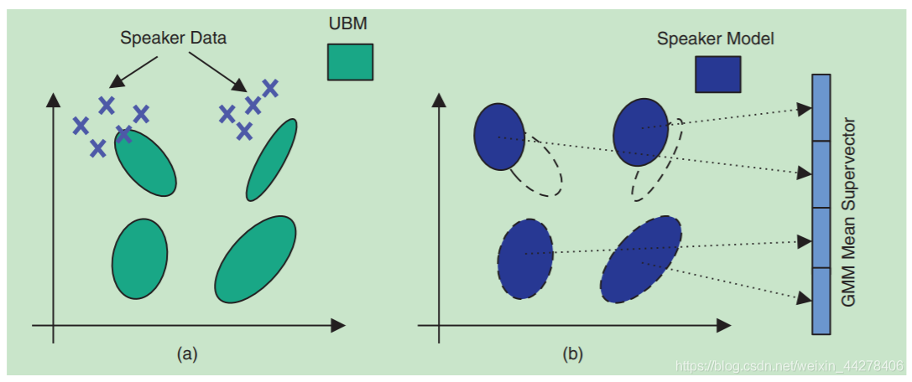

# Model on Speech Recognition


[TOC]

## Todo List

1. Chiu, Chung-Cheng, et al. "State-of-the-art speech recognition with sequence-to-sequence models." *2018 IEEE International Conference on Acoustics, Speech and Signal Processing (ICASSP)*. IEEE, 2018.
2. Zou, Wei, et al. "Comparable study of modeling units for end-to-end mandarin speech recognition." *2018 11th International Symposium on Chinese Spoken Language Processing (ISCSLP)*. IEEE, 2018.
3. Park, Daniel S., et al. "Specaugment: A simple data augmentation method for automatic speech recognition." *arXiv preprint arXiv:1904.08779* (2019).
4. Hannun, Awni, et al. "Deep speech: Scaling up end-to-end speech recognition." *arXiv preprint arXiv:1412.5567* (2014).
5. Amodei, Dario, et al. "Deep speech 2: End-to-end speech recognition in english and mandarin." *International conference on machine learning*. 2016.
6. Battenberg, Eric, et al. "Exploring neural transducers for end-to-end speech recognition." *2017 IEEE Automatic Speech Recognition and Understanding Workshop (ASRU)*. IEEE, 2017.
7. T. N. Sainath and C. Parada. Convolutional neural networks for small-footprint keyword spotting. In Sixteenth Annual Conference of the International Speech Communication Association, 2015
8. tensorflow优化器源码


## 高斯混合模型 GMM

### Notes

#### 高斯分布

例如，对城市人口的身高水平进行抽样调查，调查的结果就符合高斯分布，如下图所示：


**一元高斯分布**的概率密度函数公式如下所示：
$$
f_s(x|\mu,\delta^2)  = \frac{1}{\sqrt{2\delta^2\pi}} e^{-\frac{(x-\mu)^2}{2\delta^2}}
$$
**多元高斯分布**的概率密度函数公式如下所示：（$n$ 为数据的维度）
$$
f_m(x|\mu, \delta^2) = \frac{1}{(2\pi)^{\frac{n}{2}}|\Sigma|^{\frac{1}{2}}} \cdot e^{-\frac{1}{2}(x-\mu)^T\Sigma^{-1}(x-\mu)}
$$

#### 高斯混合分布

例如，对城市中的男女身高水平分别建模，这时候男生的身高符合一个高斯分布，而女生的身高则符合另外一个高斯分布，即形成了一个高斯混合分布，如下图所示：


**一元高斯混合分布**的概率密度函数公式如下所示：
$$
p(x|\phi,\mu,\delta) 
= \sum_{i=1}^K \phi_i \cdot \frac{1}{\sqrt{2\delta_i^2\pi}} e^{-\frac{(x-\mu_i)^2}{2\delta_i^2}}
= \sum_{i=1}^K \phi_i \cdot f_s(x|\mu_i,\delta_i)
$$
**多元高斯混合分布**的概率密度函数公式如下所示：
$$
p(x|\phi, \mu,\delta) 
= \sum_{i=1}^K \phi_i \cdot \frac{1}{(2\pi)^{\frac{n}{2}}|\Sigma_i|^{\frac{1}{2}}} \cdot e^{-\frac{1}{2}(x-\mu_i)^T\Sigma_i^{-1}(x-\mu_i)}
= \sum_{i=1}^K \phi_i \cdot f_m(x|\mu_i,\delta_i)
$$

#### 多元高斯分布的最大似然估计

假设我们对 $m$ 个样本采样，得到**似然估计函数**：
$$
L(\mu, \Sigma) = (2\pi)^{-\frac{mn}{2}} \cdot |\Sigma|^{-\frac{m}{2}}
\exp\left( -\frac{1}{2} \sum_{i=1}^m(x^{(i)}-\mu)^T \Sigma^{-1} (x^{(i)}-\mu) \right)
$$
计算**对数似然估计函数**：
$$
\ln\left(L(\mu,\Sigma)\right) = -\frac{mn}{2}\cdot\ln2\pi - \frac{m}{2}\cdot\ln|\Sigma| - \frac{1}{2}\cdot\sum_{i=1}^m
(x^{(i)}-\mu)^T \Sigma^{-1} (x^{(i)}-\mu)
$$
参数优化的目的是，采样这 $m$ 个样本时，尽可能地保证它们出现的概率最大化，即最大化对数似然估计。下面通过求极值的方式（偏导为 $0$）来计算参数值：
$$
\begin{cases}
\frac{\partial \ln\left(L(\mu, \Sigma) \right)}{\partial \mu} = 0 \\
\frac{\partial \ln\left(L(\mu, \Sigma) \right)}{\partial \Sigma} = 0
\end{cases}
$$
最终得到：（详细过程见 <u>参考链接2</u>）
$$
\begin{cases}
\hat{\mu} = \frac{1}{m} \cdot \sum_{i=1}^m x^{(i)} \\
\hat{\Sigma} = \frac{1}{m}  \cdot \sum_{i=1}^m (x^{(i)}-\mu)(x^{(i)}-\mu)^T
\end{cases}
$$

#### 多元高斯混合分布的 EM 算法流程

EM 算法是用于**含有隐变量**的概率模型参数的最大似然估计方法，其首先估计样本属于某一个概率模型的可能性，然后在这个可能性的基础上最大化似然函数，不断迭代更新参数直至收敛。多元高斯混合分布参数的具体更新流程如下：

1. 初始化模型参数，这里初始化方法有两种：**随机初始化** 或 **K-means初始化**；

2. **E-Step**：根据当前参数 $(\phi^{(t)},\mu^{(t)},\delta^{(t)})$，计算**每个数据 $x_j$ 属于第 $k$ 个多元高斯分布的可能性**（$t$ 表示迭代的轮数）；
   $$
   \gamma_{j,k}^{(t+1)} = \frac{\phi_k^{(t)} \cdot f_m(x_j|\mu_k^{(t)},\delta_k^{(t)})}{\sum_{i=1}^K \phi_i^{(t)} \cdot f_m(x_j|\mu_i^{(t)},\delta_i^{(t)})}
   $$

3. **M-Step**：更新模型参数（$m$ 为样本个数）；
   $$
   \mu_k^{(t+1)} = \frac{\sum_{j=1}^m \gamma_{j,k}^{(t+1)} \cdot x_j}{\sum_{j=1}^m \gamma_{j,k}^{(t+1)}}
   $$

   $$
   \Sigma_k^{(t+1)} = \frac{\sum_{j=1}^m \gamma_{j,k}^{(t+1)} \cdot (x_j-\mu_k^{(t+1)})(x_j-\mu_k^{(t+1)})^T}{\sum_{j=1}^m \gamma_{j,k}^{(t+1)}}
   $$

   $$
   \phi_k^{(t+1)}=\frac{\sum_{j=1}^m \gamma_{j,k}^{(t+1)}}{m}
   $$

   

4. 重复迭代 $2, 3$ 步骤，直至收敛，收敛的条件是**样本集似然概率**的增长小于某个阈值；

$$
\text{Log-Likelihood}(\mathcal{X}, \phi_k^{(t)}, \mu_k^{(t)}, \delta_k^{(t)}) = 
\sum_{j=1}^m \log \left( \sum_{i=1}^K \phi_i^{(t)} \cdot f_m(x_j|\mu_i^{(t)},\delta_i^{(t)}) \right) \\
\text{If} \ \ \left( \text{Log-Likelihood}(\mathcal{X}, \phi_k^{(t+1)}, \mu_k^{(t+1)}, \delta_k^{(t+1)}) - \text{Log-Likelihood}(\mathcal{X}, \phi_k^{(t)}, \mu_k^{(t)}, \delta_k^{(t)}) \right) \le \text{threshold}, \ \ \text{Then stop E/M steps.}
$$

### Codes

#### 实验一

参考代码：https://scikit-learn.org/stable/auto_examples/mixture/plot_gmm_covariances.html#sphx-glr-auto-examples-mixture-plot-gmm-covariances-py

- 代码结果：

  

- 均值的初始化：和实验二中的初始化方法（随机初始化）不同的是，这里在随机初始化之后，还**额外自定义初始化了每个高斯分布的均值**，导致这个不同的关键点在于**实验一的训练数据是知道隐状态的**，**额外知道隐状态十分有利于提升模型的精度和拟合能力**，下面列出代码中的不同

  ```python
  # 关键差异：知道训练数据的隐状态
  X_train = iris.data[train_index]
  y_train = iris.target[train_index]
  ......
  # 初始化每个高斯分布的均值
  estimator.means_init = np.array([X_train[y_train == i].mean(axis=0)
                                      	for i in range(n_classes)])
  ```

- 对 `covariance_type` 参数的理解：

  (1) `covariance_type='full', each component has its own general covariance matrix`，每个高斯分布的轴的方向不同，且可以任意旋转，并且轴长不相同；

  (2) `covariance_type='tied', all components share the same general covariance matrix`，每个高斯分布的轴（轴长，轴的方向）是相同的，但轴的方向可以旋转；

  (3) `covariance_type='diag', each component has its own diagonal covariance matrix`，每个高斯分布的轴的方向是固定的（平行于坐标轴方向），但是轴长不同；

  (4) `covariance_type='spherical', each component has its own single variance`，每个高斯分布的轴的方向是固定的（平行于坐标轴方向），轴长不同，形状是一个圆；

#### 实验二

参考代码：https://scikit-learn.org/stable/auto_examples/mixture/plot_gmm_selection.html#sphx-glr-auto-examples-mixture-plot-gmm-selection-py

- 代码结果：

  

- 代码中使用 **BIC 准则**来挑选模型；

#### 源码分析

由于 `covariance_type` 存在四种选择，理解起来比较复杂，这里只对 `covariance_type='full'` 进行分析；另外需要**注意**的一个点是，计算过程都是在 `ln` 域中进行的；

- 协方差矩阵的优化计算：计算过程中，需要求协方差矩阵的逆，直接求的复杂度很高，所以优化计算；（参考一下 [链接](https://blog.csdn.net/lanchunhui/article/details/50890391)）

  1. 求出协方差矩阵的 `cholesky`分解；
  2. 对分解得到的下三角矩阵求逆；
  3. 保存求逆的结果 `precisions_cholesky_`；

  ```python
  """
  precisions_cholesky_ : array-like
      The cholesky decomposition of the precision matrices of each mixture
      component. A precision matrix is the inverse of a covariance matrix.
      A covariance matrix is symmetric positive definite so the mixture of
      Gaussian can be equivalently parameterized by the precision matrices.
      Storing the precision matrices instead of the covariance matrices makes
      it more efficient to compute the log-likelihood of new samples at test
      time. The shape depends on `covariance_type`
  """
  ```

- E-Step：具体的实现过程涉及到 `_estimate_log_gaussian_prob` ，`_estimate_log_weights`，`_estimate_log_prob_resp`等函数。

  - 计算 $(x-\mu)^T\Sigma^{-1}(x-\mu)$：这里就用到了上面的 `precisions_cholesky_`；

  ```python
  log_prob = np.empty((n_samples, n_components))
  for k, (mu, prec_chol) in enumerate(zip(means, precisions_chol)):
      y = np.dot(X, prec_chol) - np.dot(mu, prec_chol)
      log_prob[:, k] = np.sum(np.square(y), axis=1)
  ```

  - 计算 $-\frac{1}{2} \cdot \ln|\Sigma|$：这里我们要对这个公式转换一下 $\frac 1 2 \cdot \ln\frac{1}{|\Sigma|}$，根据 [性质 1](https://zhuanlan.zhihu.com/p/50912180)得到 $\frac 1 2 \cdot \ln |\Sigma^{-1}|$，根据 [性质 9](https://zhuanlan.zhihu.com/p/50912180) 得到 $\ln|L|$ ，这里的 $L$ 指的是 `precisions_cholesky_` （是一个三角矩阵），[三角矩阵的行列式等于对角线的乘积](https://zh.wikipedia.org/wiki/%E4%B8%89%E8%A7%92%E7%9F%A9%E9%98%B5)，所以就是计算对角线元素 `ln` 值的累和，代码中也是这样来实现的；

  ```python
  # det(precision_chol) is half of det(precision)
  log_det = _compute_log_det_cholesky(
      precisions_chol, covariance_type, n_features)
  # 在函数_compute_log_det_cholesky中这样计算
  n_components, _, _ = matrix_chol.shape
  log_det_chol = (np.sum(np.log(
      matrix_chol.reshape(
          n_components, -1)[:, ::n_features + 1]), 1))
  ```

  - 计算 $\ln f_m(x_j|\mu_k^{(t)},\delta_k^{(t)})$：把前面两项和 <u>一个常数项</u> 累和即可；

  ```python
  -.5 * (n_features * np.log(2 * np.pi) + log_prob) + log_det
  ```

  - 计算 $\ln \gamma_{j,k}^{(t+1)}$：因为前面计算都是在 $\ln$ 域的，所以要先求 $\exp$ ，累和后再计算 $\ln$；

  ```python
  weighted_log_prob = self._estimate_weighted_log_prob(X)
  log_prob_norm = logsumexp(weighted_log_prob, axis=1)
  log_resp = weighted_log_prob - log_prob_norm[:, np.newaxis]
  ```

  至此 E-Step 的工作结束。

- M-Step：具体过程涉及到 `_estimate_gaussian_parameters`，`_estimate_gaussian_covariances_full` 等函数。

  - 计算 $\phi_k^{(t+1)}$：这里需要注意的是，前面 E-Step 的计算都是 $\ln$ 域的，所以在 M-Step 中直接 $\exp$ 计算；

  ```python
  # 函数调用的时候直接exp
  self.weights_, self.means_, self.covariances_ = _estimate_gaussian_parameters(X, np.exp(log_resp), self.reg_covar, self.covariance_type)
  # 计算每类高斯分布的样本数量，函数调用外层会除以样本的总数
  nk = resp.sum(axis=0) + 10 * np.finfo(resp.dtype).eps
  ```

  - 计算 $\mu_k^{(t+1)}$ 和 $\Sigma_k^{(t+1)}$：均值、方差的计算很清晰，其中 `reg_covar=1e-6` 是用来保证协方差矩阵恒大于 $0$ 的；

  ```python
  # 计算均值
  means = np.dot(resp.T, X) / nk[:, np.newaxis]
  # 计算方差
  def _estimate_gaussian_covariances_full(resp, X, nk, means, reg_covar):
      """注释详见源码"""
      n_components, n_features = means.shape
      covariances = np.empty((n_components, n_features, n_features))
      for k in range(n_components):
          diff = X - means[k]
          covariances[k] = np.dot(resp[:, k] * diff.T, diff) / nk[k]
          covariances[k].flat[::n_features + 1] += reg_covar
      return covariances
  # 因为 covariance_type 有四种类型，所以他的调用写的还是比较有意思的
  covariances = {"full": _estimate_gaussian_covariances_full,
                 "tied": _estimate_gaussian_covariances_tied,
                 "diag": _estimate_gaussian_covariances_diag,
                 "spherical": _estimate_gaussian_covariances_spherical
                 }[covariance_type](resp, X, nk, means, reg_covar)
  ```
  - 计算 `precisions_cholesky_`：更新的时候不能把它忘了；

  ```python
  self.precisions_cholesky_ = _compute_precision_cholesky(self.covariances_, self.covariance_type)
  ```

  至此 M-Step 的工作结束。

- 最优模型的获取：参数 `n_init` 可以指定代码拟合多个随机初始化的模型，挑选一个最优的模型；

  ```python
  for init in range(n_init): # 拟合多个模型
      if do_init:
          self._initialize_parameters(X, random_state)  # 初始化参数
      lower_bound = (-np.infty if do_init else self.lower_bound_)
      for n_iter in range(1, self.max_iter + 1):
          prev_lower_bound = lower_bound
          log_prob_norm, log_resp = self._e_step(X)  # e-step
          self._m_step(X, log_resp)  # m-step
          lower_bound = self._compute_lower_bound(
              log_resp, log_prob_norm)
          change = lower_bound - prev_lower_bound
          if abs(change) < self.tol:  # 判断是否收敛
              self.converged_ = True
              break
      self._print_verbose_msg_init_end(lower_bound)
      if lower_bound > max_lower_bound:  # 判断是否为最优模型
          max_lower_bound = lower_bound
          best_params = self._get_parameters()
          best_n_iter = n_iter
  ```

- 模型参数初始化：参数初始化有 **随机数** 和 **`k-means`** 两种方法；

  ```python
  def _initialize_parameters(self, X, random_state):
      n_samples, _ = X.shape
      if self.init_params == 'kmeans':
          resp = np.zeros((n_samples, self.n_components))
          label = cluster.KMeans(n_clusters=self.n_components, n_init=1,
                                 random_state=random_state).fit(X).labels_
          resp[np.arange(n_samples), label] = 1
      elif self.init_params == 'random':
          resp = random_state.rand(n_samples, self.n_components)
          resp /= resp.sum(axis=1)[:, np.newaxis]
      else:
          raise ValueError("Unimplemented initialization method '%s'"
                           % self.init_params)
  
      self._initialize(X, resp)
  ```
  
- 模型是否收敛：前面计算过程中，已经得到 `log_prob_norm` 这个参数（指的就是 $\ln$ 域的概率），所以计算 $\text{Log-Likelihood}$ （在程序中用 `lower_bound` 参数来指代）的时候只需要求和即可，这里我们直接求均值

  ```python
  def _compute_lower_bound(self, _, log_prob_norm):
      return log_prob_norm
  ```

  在函数 `fit_predict` 函数中判断是否收敛

  ```python
  for n_iter in range(1, self.max_iter + 1):
      prev_lower_bound = lower_bound
      log_prob_norm, log_resp = self._e_step(X)  # e-step
      self._m_step(X, log_resp)  # m-step
      lower_bound = self._compute_lower_bound(  # 计算对数似然概率
          log_resp, log_prob_norm)
      change = lower_bound - prev_lower_bound
      self._print_verbose_msg_iter_end(n_iter, change)
      if abs(change) < self.tol:  # 判断收敛
          self.converged_ = True
          break
  ```

### Links

- 参考链接 1：[一文详解高斯混合模型原理](https://zhuanlan.zhihu.com/p/31103654)
- 参考链接 2：[概率笔记12——多维正态分布的最大似然估计](https://www.cnblogs.com/bigmonkey/p/11379144.html)
- 参考链接 3：[高斯混合模型（GMM）](https://zhuanlan.zhihu.com/p/30483076)
- 参考链接 4：[GMM covariances](https://scikit-learn.org/stable/auto_examples/mixture/plot_gmm_covariances.html#sphx-glr-auto-examples-mixture-plot-gmm-covariances-py)

- 参考链接 5：[矩阵分解——三角分解（Cholesky 分解）](https://blog.csdn.net/lanchunhui/article/details/50890391)
- 参考链接 6：[线性代数之——行列式及其性质](https://zhuanlan.zhihu.com/p/50912180)
- 参考链接 7：[三角矩阵](https://zh.wikipedia.org/wiki/%E4%B8%89%E8%A7%92%E7%9F%A9%E9%98%B5)


## GMM-UBM 模型

### Notes

#### 算法背景


GMM 模型将空间分布的概率密度用**多个高斯概率密度函数的加权**来拟合，可以平滑地逼近任意形状地概率密度函数，并且是一个易于处理地参数模型，具备对实际数据极强额表征力。当 GMM 的规模越来越庞大，表征力越强，为了训练模型的参数，**需要的数据量也就越多**，但是**目标说话人的数据恰恰是不容易获得的**；

#### 算法整体流程


GMM-UBM 模型的目标就是解决这个问题。首先，使用大量的背景数据（**非目标说话人的语料**）训练一个通用背景模型（Universal Background Model，是一个 GMM 模型）；接着使用少量的背景数据（**目标说话人的语料**）和最大后验估计 MAP 算法，调整 UBM 各个高斯分布的均值，生成目标用户的 GMM 模型；

#### 最大后验估计 MAP 算法



（算法的原理在这里不再探究，我们直接来看这个算法是如何更新 UBM 的参数的）现在我们假设有少量的目标说话人的训练语料 $\mathcal{X} = \{ x_1, x_2, x_3, \dots, x_T \}$，和一个已经通过大量的非目标说话人语料训练得到的 UBM 模型：
$$
\text{UBM}(\phi, \mu, \delta) = \sum_{i=1}^K \phi_i \cdot f_m(x|\mu_i,\delta_i)
$$

- **Step 1**：计算每段训练语料属于第 $k$ 个高斯混合分布的概率；

$$
\Pr(k | x_t)^{(t+1)} = \frac{\phi_k^{(t)} \cdot f_m(x|\mu_k^{(t)}, \delta_k^{(t)})}{\sum_{i=1}^K \phi_i^{(t)} \cdot f_m(x|\mu_i^{(t)}, \delta_i^{(t)})}
$$

- **Step 2**：估计每个高斯分布的加权数量值、均值和方差；（前两步的做法是和 EM 算法的 E-Step 是一样的）

$$
\text{N}_i^{(t+1)} = \sum_{t=1}^T \Pr(k|x_t)^{(t+1)} \\
\text{E}_i(\mathcal{X})^{(t+1)} = \frac{1}n \cdot \left( \sum_{t=1}^T \Pr(k|x_t)^{(t+1)}\cdot x_t \right) \\
\text{E}_i(\mathcal{X}^2)^{(t+1)} = \frac 1 n \cdot \left( \sum_{t=1}^T \Pr(k|x_t)^{(t+1)} \cdot x_t^2 \right)
$$

- **Step 3**：更新参数；

$$
\phi_i^{(t+1)} = \gamma \cdot \left[\alpha_i^w \cdot \frac{\text{N}_i^{(t+1)}}{T} + (1-\alpha_i^w) \cdot \phi_i^{(t)} \right] \\
\mu_i^{(t+1)} = \alpha_i^m \cdot \text{E}_i(\mathcal{X})^{(t+1)} + (1-\alpha_i^m) \cdot \mu_i^{(t)} \\
\delta_i^{(t+1)} = \alpha_i^v \cdot \text{E}_i(\mathcal{X}^2)^{(t+1)} + (1-\alpha_i^v) \cdot \left((\delta_i^{(t)} + ({\mu_i^{(t)}})^2) - (\mu_i^{(t+1)}) ^2 \right)
$$

​	其中，$\gamma$ 为权重项的归一化因子； $\alpha_i^\rho \ ,\ \left(\rho \in \{w,m,v\}\right)$ 是自适应系数，用来控制新 / 老估计量之间的平衡，其公式定义为：
$$
\alpha_i^\rho = \frac{\text{N}_i}{\text{N}_i + r^\rho}
$$
​	$r^\rho$ 是一个固定的相关因子。在 GMM-UBM 系统中，通常会使用相同的 $\alpha_i^\rho$ 来更新参数。实验表明，$r^\rho$ 的取值范围为 $[8, 20]$ 最有效，且**自适应过程只更新均值效果最佳**，即 $\alpha_i^w = \alpha_i^v = 0$；

- **Step 4**：重复前面的步骤，直至模型收敛；

- **说话人识别**：识别说话人的方法有以下两种

  - 可以直接遍历不同说话人的 GMM 模型，计算当前语音片段在各个 GMM 下的 $\ln$ 域的似然估计，哪个似然估计值高，则当前语音片段属于哪个 GMM，即属于某个说话人；

  - 另外，可以使用对数似然比的方法，计算 $\Lambda(x)$ 大于某阈值，则认为 $x$ 属于说话人 $spk$；
    $$
    \Lambda(x) = \log p(x|\text{GMM}_{spk}) - \log p(x|\text{UBM})
    $$

### Codes

因为 `MAP Adaptation` 算法和 GMM 的训练过程基本相似，我们就来简单看看参考代码的整体结构：（在 ivector 中我会具体分析一下 Kaldi 的代码实现）

- 计算 MFCC：脚本 `extract_mfcc_conefficient.py` 将语音转换成 13 维的 MFCC 特征；
- 训练 GMM-UBM 模型：脚本 `UBM.py` 用来训练 UBM 模型，并调用 MAP 算法（<u>原先我一直以为说话人的识别是以一段语音去拟合其分布的，但是看了这块代码才发现是以**每一帧的 MFCC 去拟合高斯混合分布**的</u>）；
- MAP 算法：脚本 `MAP_adapt.py` 主要用来实现 MAP 算法；
- 说话人识别：脚本 `testing_model.py` 主要用来测试音频为目标说话人的概率；

代码里面我有几个疑问：

- 算法里面没有使用 `VAD` 算法，这个可能导致误差；
- 最后给定一段语音，可以得到每帧的概率，那最终如何得到这个语音是否属于目标说话人呢；

另外，代码里面有一处错误，这个错误导致了数组的越界问题，我已经在 `issue` 中给出了[解决方案](https://github.com/scelesticsiva/speaker_recognition_GMM_UBM/issues/4)；

### Links

- 参考链接：[声纹识别之GMM-UBM系统框架简介](https://blog.csdn.net/taw19960426/article/details/96202294)
- 参考代码：[speaker_recognition_GMM_UBM](https://github.com/scelesticsiva/speaker_recognition_GMM_UBM)
- 参考 PPT：http://www.inf.ed.ac.uk/teaching/courses/asr/2018-19/asr17-speaker.pdf
- 论文链接：[Speaker Verification Using Adapted Gaussian Mixture Models](https://www.cs.swarthmore.edu/~turnbull/cs97/f09/paper/reynolds00.pdf)
- 代码 `Bug`：[I totally got MFCC 3380 lines, but it errors, Wouly you help me,thank you very much?](https://github.com/scelesticsiva/speaker_recognition_GMM_UBM/issues/4)


## 基于 i-vector 和 PLDA 的说话人识别技术

### Notes

#### 背景

在实际应用中，由于说话人语音中说话人信息和各种干扰信息掺杂在一起，不同的采集设备的信道之间也具有差异性，会使我们**收集到的语音中掺杂信道干扰信息**。这种干扰信息会引起说话人信息的扰动。传统的 GMM-UBM 方法，没有办法克服这一问题，导致系统性能不稳定。

在 GMM-UBM 模型里，每个目标说话人都可以用 GMM 模型来描述。因为从 UBM 模型自适应到每个说话人的 GMM 模型时，只改变均值，对于权重和协方差不做任何调整，所以**说话人的信息大部分都蕴含在 GMM 的均值里面**。GMM 均值矢量中，**除了绝大部分的说话人信息之外，也包含了信道信息**。联合因子分析（Joint Factor Analysis，JFA）可以**对说话人差异和信道差异分别建模**，从而可以很好地对信道差异进行补偿，提高系统表现。但由于 JFA 方法需要大量不同通道的训练语料，获取困难，并且计算复杂度高，所以难以投入实际使用。由 Dehak 提出的，基于 I-Vector 因子分析技术，提出了全新的解决方法。JFA 方法是对说话人差异空间与信道差异空间分别建模，而基于 I-Vector 的方法是**对全局差异（将说话人和信道差异一起）进行建模**，这样的处理放宽了对训练语料的限制，并且计算简单，性能也相当。

#### 均值超矢量

均值超矢量（Supervector）是 GMM-UBM 模型的最终结果。在 GMM-UBM 框架下，说话人模型是从 UBM 模型自适应得到的，过程中值改变了均值的大小，因此说话人之间的区别信息都蕴含在 GMM 的均值矢量中。**将说话人 GMM 模型的每个高斯成分的均值堆叠起来，形成一个高维的超矢量，即为均值超矢量**。假设语音声学特征参数的维度为 $P$，GMM 中含有 $M$ 个高斯分布，则该均值超矢量的维度为 $(M,P)$。


**由于均值超矢量的维度非常高，一般情况下都会高达上万维，会有一定程度的冗余信息存在，为此我们需要使用因子分析对其进行降维，提取具有区分性的特征**。

#### 因子分析

信息冗余是高维数据分析常见的问题，使用因子分析方法，可以将**一些信息重叠和复杂的关系变量简化为较少的足够描述原有观测信息的几个因子**，是一种**数据降维**的统计方法。上面提到的 JFA 和 I-Vector 都是因子分析方法。

因子分析的实质是认为 $m$ 个 $n$ 维特征的训练样本 $\mathcal{X}=\left( x_1, x_2, x_3, \dots, x_m \right)$ 的产生过程如下：

1. 首先在一个 $k$ 维的空间中按照**多元高斯分布**生成 $m$ 个 $\mathcal{Z}=\left( z_1, z_2, z_3, \dots, z_m \right)$，即
   $$
   z_i \sim \N(0, \bold{I})
   $$

2. 然后存在一个变换矩阵 $\Lambda \in \mathbb{R}^{n\times k}$，将 $z_i$ 映射到 $n$ 维空间中，即
   $$
   \Lambda z_i
   $$
   因为 $z_i$ 的均值是 $0$，**映射**后仍然是 $0$；

3. 然后将 $\Lambda z_i$ 加上一个均值 $\mu \in \mathbb{R}^n$，即
   $$
   \mu + \Lambda z_i
   $$
   对应的意义是将变换后的 $\Lambda z_i$ **移动**到训练样本集 $\mathcal{X}$ 的中心；

4. 由于真实样本 $x_i$ 与上述模型生成的点之间存在**误差**，因此我们继续加上误差项 $\epsilon \in \mathbb{R}^n$，而且 $\epsilon$ 符合多元高斯分布，即
   $$
   \epsilon \sim \mathbb{N}(0, \bold{\Psi}) \\
   \mu + \Lambda z_i + \epsilon
   $$

5. 最后的结果认为即为真实训练样本 $x_i$ 的生成公式
   $$
   x_i = \mu + \Lambda z_i + \epsilon
   $$

#### I-Vector

（**定义**）给定说话人 $s$ 的一段语音 $h$，这一新的说话人及信道相关的 GMM 均值超矢量定义为如下公式：
$$
M_{s,h} = m_u+ T \omega_{s,h}
$$
其中 $m_u$ 是说话人与信道独立的均值超矢量，即为 UBM 的均值超矢量；$T$ 为全局差异空间；$\omega_{s,h}$ 为全局差异空间因子，即为 **I-Vector 矢量**，它先验地服从标准正态分布；上式中，$M_{s,h}$ 和 $m_u$ 是我们可以计算出的，而 $T$ 和 $\omega_{s,h}$ 是我们需要估计的。

I-Vector 的提取过程中，我们需要首先估计全局差异空间矩阵 $T$。**该过程中认为所有给定的数据都来自不同的说话人，即使是一个说话人的多端语音也同样认为是来自不同人的**。

1. **计算 Baum-Welch 统计量**：给定说话人 $s$ 和他的特征矢量序列 $(Y_1, Y_2, \dots, Y_T)$，假设 GMM-UBM 有 $C$ 个高斯分类，每一个高斯分量 $c$，定义**混合权值**、**均值矢量**、**协方差矩阵**对应的 Baum-Welch 统计量如下公式
   $$
   N_c(s) = \sum_{t=1}^T \gamma_t(c) \\
   F_c(s) = \sum_{t=1}^T \gamma_t(c) \cdot Y_t \\
   S_c(s) = \text{diag} \left(\sum_{t=1}^T \gamma_t(c) \cdot Y_tY_t^{tr} \right) \\
   \text{where} \ \ \gamma_t(c) = \frac{\phi_c \cdot f_c(Y_t)}{\sum_{j=1}^C \phi_j \cdot f_j(Y_t)}
   $$
   其中， $\text{diag}(\cdot)$ 返回矩阵的对角线元素；$Y_t^*$ 为 $Y_t$ 的共轭转置矩阵；另外，定义**一阶中心统计量**和**二阶中心统计量**如下公式
   $$
   \tilde{F}_c(s) = \sum_{t=1}^T \gamma_t(c) \cdot (Y_t-m_c) = F_c(s) - N_c(s)m_c \\
   \tilde{S}_c(s) = \text{diag} \left( \sum_{t=1}^T \gamma_t(c) \cdot (Y_t-m_c)(Y_t-m_c)^{tr} \right) = S_c(s) - \text{diag} \left( F_c(s)m_c^*  + m_c F_c(s)^* -N_c(s)m_cm_c^* \right)
   $$
   为了后面方便计算，将**统计量扩展为矩阵形式**，如下
   $$
   N(s) = 
   \begin{bmatrix}
   N_1(s) & \  & 0 \\
   \ & \dots & \ \\
   0 & \ & N_C(s)
   \end{bmatrix} , \ \ \ \ \ \ \ \ \ \ 
   \tilde F(s) = 
   \begin{bmatrix}
   \tilde F_1(s) \\
   \dots \\
   \tilde F_C(s)
   \end{bmatrix}, \ \ \ \ \ \ \ \ \ \ 
   \tilde{S}(s) = 
   \begin{bmatrix}
   \tilde{S}_1(s) & \ & 0 \\
   \ & \dots \ & \ \\
   \ & \  & \tilde{S}_C(s)
   \end{bmatrix}
   $$
   在训练之前，先对 $T$ 矩阵进行随机初始化；
   
2. **E-Step**：计算**说话人因子的方差和均值**，公式如下（<u>这里的 $\Sigma$ 指的是什么？</u>）
   $$
   l(s) = I + T^{tr} \Sigma ^{-1} N(s)T \\
   E[\omega_{s,h}] = l^{-1}(s) \cdot T^{tr} \Sigma^{-1} \tilde F(s) \\
   Cov(\omega_{s,h}, \omega_{s,h}) = l^{-1}(s) \\
   E[\omega_{s,h}\ \omega_{s,h}^{tr}] = Cov(\omega_{s,h},\omega_{s,h}) + E[\omega_{s,h}]E[\omega_{s,h}]^{tr}
   $$

3. **M-Step：重新估计最大似然值最大似然值**；
   
   ​	首先计算统计量，公式如下
$$
N_c = \sum_s N_c(s) \\
A_c = \sum_s N_c(s) E[\omega_{s,h}\ \omega_{s,h}^{tr}] \\
   C = \sum_s \tilde{F}(s) E[\omega_{s,h}] \\
   N = \sum_s N(s)
$$
更新参数，公式如下
$$
   T_i \cdot A_c = C_i \\
   \Sigma = N^{-1} \left( \sum_s \tilde{S}(s) - \text{diag}(CT^{tr}) \right)
$$
4. 循环 EM 步骤，直到收敛；

上面的计算过程后，我们已经得到了 $T$ 矩阵。现给定说话人的一句话，先提取零阶、一阶 Baum-Welch 统计量，即可**计算 i-vector 的估计值**，公式如下：
$$
E[\omega_{s,h}] 
= l^{-1}(s) \cdot T^{tr} \Sigma^{-1} \tilde F(s) 
= \left(I + T^{tr} \Sigma ^{-1} N(s)T \right)^{-1}\cdot T^{tr} \Sigma^{-1} \tilde F(s)
$$

#### 基于 PLDA 对 i-vector 分类


### Codes

代码部分主要分析 Kaldi 的 `sre08` 示例，`sre08` 是 Kaldi 针对美国国家标准与技术研究院在 2008 年举办的说话人识别比赛（Speaker Recognition Evaluation） 任务的解决方案，另外相似的还有 `sre10` 和 `sre16`。

#### i-vector 的提取

##### `run.sh`

首先，看一下整个步骤，具体在文件 `run.sh` 中：

```bash
# 首先训练一个对角协方差矩阵的 UBM，然后训练一个非对角协方差矩阵的 UBM
sid/train_diag_ubm.sh --nj 30 --cmd "$train_cmd" data/train_4k 2048 exp/diag_ubm_2048
sid/train_full_ubm.sh --nj 30 --cmd "$train_cmd" data/train_8k exp/diag_ubm_2048 exp/full_ubm_2048

# 分别为男/女说话人训练一个非对角协方差矩阵的 UBM （wait 用于同时执行两条指令）
sid/train_full_ubm.sh --nj 30 --remove-low-count-gaussians false --num-iters 1 --cmd "$train_cmd" data/train_male_8k exp/full_ubm_2048 exp/full_ubm_2048_male &
sid/train_full_ubm.sh --nj 30 --remove-low-count-gaussians false --num-iters 1 --cmd "$train_cmd" data/train_female_8k exp/full_ubm_2048 exp/full_ubm_2048_female &
wait

# 分别训练男/女说话人的i-vector模型
sid/train_ivector_extractor.sh --cmd "$train_cmd --mem 35G" --num-iters 5 exp/full_ubm_2048_male/final.ubm data/train_male exp/extractor_2048_male
sid/train_ivector_extractor.sh --cmd "$train_cmd --mem 35G" --num-iters 5 exp/full_ubm_2048_female/final.ubm data/train_female exp/extractor_2048_female
```

##### `train_ivector_extractor.sh`

 (1) 具体来看一下脚本 `train_ivector_extractor.sh` 的第一部分：

```bash
# Initialize the i-vector extractor using the FGMM input
$cmd $dir/log/convert.log \
	fgmm-global-to-gmm $dir/final.ubm $dir/final.dubm || exit 1;  # 把全协方差 GMM 转换成对角协方差 GMM
$cmd $dir/log/init.log \
	ivector-extractor-init --ivector-dim=$ivector_dim --use-weights=$use_weights $dir/final.ubm $dir/0.ie || exit 1  # 初始化 i-vector 提取器
```

- `fgmm-global-to-gmm`：将全协方差 GMM 转换成对角协方差 GMM；

```c++
// fgmmbin/fgmm-global-to-gmm.c
DiagGmm gmm;
gmm.CopyFromFullGmm(fgmm); // 拷贝 GMM，具体实现见下
WriteKaldiObject(gmm, gmm_wxfilename, binary); // 写入文件
// gmm/diag-gmm.cc 
void DiagGmm::CopyFromFullGmm(const FullGmm &fullgmm) {
  int32 num_comp = fullgmm.NumGauss(), dim = fullgmm.Dim();
  Resize(num_comp, dim);
  gconsts_.CopyFromVec(fullgmm.gconsts()); // 拷贝 gconsts_，这个变量用来加快 log-likelihood 的计算，定义为：log(weight) - 0.5 * (log det(var) + mean'*inv(var)*mean)
  weights_.CopyFromVec(fullgmm.weights());
  Matrix<BaseFloat> means(num_comp, dim);
  fullgmm.GetMeans(&means); // 获取均值矩阵，具体实现见下
  int32 ncomp = NumGauss();
  for (int32 mix = 0; mix < ncomp; mix++) {
    SpMatrix<double> covar(dim);
    covar.CopyFromSp(fullgmm.inv_covars()[mix]);
    covar.Invert();
    Vector<double> diag(dim);
    diag.CopyDiagFromPacked(covar);  // 从全协方差阵中提取对角协方差阵，因为是对角阵，所以只保存对角向量
    diag.InvertElements();
    inv_vars_.Row(mix).CopyFromVec(diag);
  }
  means_invvars_.CopyFromMat(means);
  means_invvars_.MulElements(inv_vars_);  // 均值乘以协方差的逆，因为这边协方差是一个对角阵，所以可以直接用 元素相乘 进行计算
  ComputeGconsts(); // 重新计算 gconsts_
}
// gmm/full-gmm-inl.h
// Kaldi中没有存储GMM的均值向量，而是存储了 mean_times_invcovar，所以还需要通过矩阵运算得出来
template<class Real>
void FullGmm::GetMeans(Matrix<Real> *M) const {
  KALDI_ASSERT(M != NULL);
  M->Resize(NumGauss(), Dim());
  SpMatrix<Real> covar(Dim());
  Vector<Real> mean_times_invcovar(Dim());
  for (int32 i = 0; i < NumGauss(); i++) {
    covar.CopyFromSp(inv_covars_[i]);
    covar.InvertDouble();
    mean_times_invcovar.CopyFromVec(means_invcovars_.Row(i));
    (M->Row(i)).AddSpVec(1.0, covar, mean_times_invcovar, 0.0); // like: this.AddSpVec(alpha, M, v, beta), means "this <-- beta*this + alpha*M*v"
  }
}
```

- `ivector-extractor-init`：初始化 i-vector 提取器；

```c++
// ivectorbin/ivector-extractor-init.cc
FullGmm fgmm;
ReadKaldiObject(fgmm_rxfilename, &fgmm); // 读取fgmm
IvectorExtractor extractor(ivector_opts, fgmm); // 初始化 i-vector 特征提取器，具体实现见下
WriteKaldiObject(extractor, ivector_extractor_wxfilename, binary); // 写入文件
```

这部分代码比较混乱，下面对每个参数进行分析：

`Sigma_inv_` ：保存 GMM 协方差矩阵的逆 $\Sigma_i^{-1}$；

```c++
// ivector-extractor.cc -> IvectorExtractor::IvectorExtractor
Sigma_inv_.resize(fgmm.NumGauss());
for (int32 i = 0; i < fgmm.NumGauss(); i++) {
    const SpMatrix<BaseFloat> &inv_var = fgmm.inv_covars()[i];
    Sigma_inv_[i].Resize(inv_var.NumRows());
    Sigma_inv_[i].CopyFromSp(inv_var);
}
```

`gconsts_`：保存 $-\frac 1 2 \cdot (n\log2\pi + \log|\Sigma_i|)$，这个的实现过程很有意思；

```c++
// ivector-extractor.cc -> IvectorExtractor::ComputeDerivedVars
gconsts_.Resize(NumGauss());
for (int32 i = 0; i < NumGauss(); i++) {
    double var_logdet = -Sigma_inv_[i].LogPosDefDet(); // “矩阵和逆矩阵的行列式互为相反数”
    gconsts_(i) = -0.5 * (var_logdet + FeatDim() * M_LOG_2PI);
}
// sp-matrix.cc
template<typename Real>
Real SpMatrix<Real>::LogPosDefDet() const {
    TpMatrix<Real> chol(this->NumRows());
    double det = 0.0;
    double diag;
    chol.Cholesky(*this);  // Will throw exception if not +ve definite!
    for (MatrixIndexT i = 0; i < this->NumRows(); i++) {
    diag = static_cast<double>(chol(i, i));
    det += kaldi::Log(diag);  // 对角矩阵的行列式即为对角线元素相乘
    }
    return static_cast<Real>(2*det);  // 因为上面对对角矩阵作了Cholesky分解，所以这里要乘以2
}
```

`U_`：保存 $u_i^T \Sigma_i u_i$ ；（<u>这里挺奇怪的，明明是一个标量，却要用矩阵来存</u>）

```c++
// ivector-extractor.cc -> IvectorExtractor::ComputeDerivedVars
U_.Resize(NumGauss(), IvectorDim() * (IvectorDim() + 1) / 2);
SpMatrix<double> temp_U(IvectorDim());
temp_U.AddMat2Sp(1.0, M_[i], kTrans, Sigma_inv_[i], 0.0); // temp_U = M_i^T Sigma_i^{-1} M_i
SubVector<double> temp_U_vec(temp_U.Data(),
                           IvectorDim() * (IvectorDim() + 1) / 2);
U_.Row(i).CopyFromVec(temp_U_vec);
```

`Sigma_inv_M_`：保存矩阵 $\Sigma_i^{-1}u_i$ ；

```c++
// ivector-extractor.cc -> IvectorExtractor::ComputeDerivedVars
Sigma_inv_M_.resize(NumGauss());  // The product of Sigma_inv_[i] with M_[i].
Sigma_inv_M_[i].Resize(FeatDim(), IvectorDim());
Sigma_inv_M_[i].AddSpMat(1.0, Sigma_inv_[i], M_[i], kNoTrans, 0.0);
```

(2) 再看脚本的第二部分：

```bash
$cmd JOB=1:$nj_full $dir/log/gselect.JOB.log \
    gmm-gselect --n=$num_gselect $dir/final.dubm "$feats" ark:- \| \
    fgmm-global-gselect-to-post --min-post=$min_post $dir/final.ubm "$feats" ark,s,cs:-  ark:- \| \
    scale-post ark:- $posterior_scale "ark:|gzip -c >$dir/post.JOB.gz" || exit 1;
```

- `gmm-gselect`：
- `fgmm-global-gselect-to-post`：
- `scale-post`：

### Links

- 参考：《Kaldi 语音识别实践》基于 i-vector 和 PLDA 的说话人识别技术	
- 参考链接：[声纹识别之I-Vector](https://blog.csdn.net/weixin_38206214/article/details/81096092)
- 参考链接：[【kaldi学习.5】I-vector的主要理论](https://www.jianshu.com/p/e730e70de7f8)

- 参考 PPT：http://www1.icsi.berkeley.edu/Speech/presentations/AFRL_ICSI_visit2_JFA_tutorial_icsitalk.pdf


## Deep speech: Scaling up end-to-end speech recognition

### Contribution


### Notes


### Codes

### Links

- 论文链接：[Hannun A, Case C, Casper J, et al. Deep speech: Scaling up end-to-end speech recognition[J]. arXiv preprint arXiv:1412.5567, 2014.](https://arxiv.org/abs/1412.5567)
- 论文代码：https://github.com/mozilla/DeepSpeech （mozilla 开源）


## Listen, Attend and Spell

### Contribution

1. 提出了一种**新的端到端**的语音识别模型 LAS；

### Notes

1. **模型架构**：分成两个模块，一个是 Listen Encoder 模块，从语音时序序列中提取出高维特征，采用 pBLSTM (pyramid BLSTM) 的架构；另一个是 Attend and Spell 模块，从语音高维特征中输出单词，采用 Attention + LSTM 架构。架构图如下：（<u>直接从这个图看的话，感觉模型是比较简洁的，但是真的从代码层面再来画一个细粒度的架构图，其实复杂得多。</u>）

   

2. **Listen Encoder 模块**，使用 pBLSTM 的架构，每层在时间维度上减少一倍，带来的优点有两个：

   (1) 减少模型的复杂性（<u>一定程度上是比较合理的，因为语音的前后帧之间有非常多的冗余信息</u>）；

   (2) 加快模型的拟合速度（作者发现直接用 BLSTM 的话，用一个月的时间训练都没有办法得到好的结果）；

   形式化的公式为：（和代码结合来看：<u>关注公式 $[h_{2i}^{j-1}, h_{2i+1}^{j-1}]$ 部分，在程序的实现中，首先通过 设置 LSTM的特征维度 将**特征逐层降维**，然后通过合并前后帧的特征 对**时间降维**（而特征维度则升高）</u>）

   

3. **Attend and Spell 模块**，该模块采用 2 层 LSTM 单元来记忆、更新模型的状态 $s$ (**模型的状态包括 LSTM 的状态和 Attention 上下文状态**)：

   

   (1) Attention 单元：根据当前的状态 $s_i$ （**<u>在代码中，$s_i$ 指的是第二层 LSTM 单元的输出</u>**）从语音特征 $h$ 中分离出“当前模型关心的”上下文信息 $c_{i}$；

   (2) LSTM 单元：根据前一时刻的状态 $s_{i-1}$ （<u>**在代码中，这个 $s_{i-1}$ 指的是第二层 LSTM 单元的状态**</u>）、前一时刻输出的字符 $y_{i-1}$ 和前一时刻的上下文信息 $c_{i-1}$ 来更新产生当前时刻的状态 $s_i$；

   (3) MLP 单元：根据当前状态 $s_i$ 和上下文信息 $c_i$ 计算得到最可能的字符 $y_i$ ;

   

   另外， **Attention 单元在模型中的具体实现**：将模型状态 $s_{i}$ 和语音特征 $h$ 分别经过两个不同的 MLP 模型，计算出一个标量能量 (点积) $e$ ，经过 softmax 层归一化后作为权重向量，和原来的特征 $h$ 加权生成上下文信息 $c_i$。形式化的公式如下：

   

4. **Learning**. 模型的目标是，在给定 **全部** 语音信号和 **上文** 解码结果的情况下，模型输出正确字符的概率最大。形式化的公式如下：

   

   在训练的时候，我们给的 y 都是 ground truth，但是解码的时候，模型不一定每个时间片都会产生正确的标签。虽然模型对于这种错误是具有宽容度，单训练的时候可以增加 **trick**：以 **10%** 的概率从前一个解码结果中挑选 (根据前一次的概率分布) 一个标签作为 ground truth 进行训练。形式化公式如下：

   

   另外，作者发现预训练 (主要是预训练 Listen Encoder 部分) 对 LAS 模型没有作用。

5. **Decoding & Rescoring**. 解码的时候使用 Beam-Search 算法，目标是希望得到概率最大的字符串。形式化公式如下：

   

   可以用语言模型对最后一轮 Beam-Search 的结果进行重打分，形式化公式如下：

   

   增加解码结果的长度项 |y| 来**平衡产生长句、短句的权重**，另外语言模型的权重 lambda 可以通过验证集数据来确定。

6. 实验结果：

   (1) 使用 log-mel filter bank 特征

   (2) 整体对比，LAS 刚出来的时候并打不过传统的 DNN-HMM 模型；

   

   (3) Attention 模块确实更加关注对应时间片段的特征；

   

   (4) 模型对于较短的语句或者较长的语句效果都不是很好；

   

### Shortcoming

1. 必须要得到整个语音后才能解码，限制了模型的流式处理能力；
2. Attention 机制需要消耗大量的计算量；
3. 输入长度对于模型的影响较大；

### 代码理解

#### 	Tensorflow 2 （Keras）实现

> 这个库只实现了 LAS 模型部分，没有完整的预处理等过程，故先通过这个库来简单学习下 LAS 模型原理以及 Tensorflow 的使用，期待一下库作者的更新；

(1) 整体框架：

```python
def LAS(dim, f_1, no_tokens): # dim-神经网络内特征维度，f_1-输入特征维度，no_tokens-分类维度
  input_1 = tf.keras.Input(shape=(None, f_1))  # shape: (..., None, f_1)
  input_2 = tf.keras.Input(shape=(None, no_tokens))  # shape: (..., None, no_tokens)
  
  #Listen; Lower resoultion by 8x
  x = pBLSTM( dim//2 )(input_1) # (..., audio_len//2, dim*2)
  x = pBLSTM( dim//2 )(x) # (..., audio_len//4, dim*2)
  x = pBLSTM( dim//4 )(x) # (..., audio_len//8, dim)
  
  #Attend
  x = tf.keras.layers.RNN(att_rnn(dim), return_sequences=True)(input_2, constants=x) # (..., seq_len, dim*2)
  
  #Spell
  x = tf.keras.layers.Dense(dim, activation="relu")(x) # (..., seq_len, dim)
  x = tf.keras.layers.Dense(no_tokens, activation="softmax")(x) # (..., seq_len, no_tokens)

  model = tf.keras.Model(inputs=[input_1, input_2], outputs=x)
  return model
```

(2) Listen 模块：使用 3 层 `pBLSTM` 实现，其中需要注意的是 `tf.keras.layers.Bidirectional` 的使用（<u>我一开始判断错了输出的维度</u>）

```python
class pBLSTM(tf.keras.layers.Layer):
  def __init__(self, dim):
    super(pBLSTM, self).__init__()
    
    self.dim        = dim
    self.LSTM       = tf.keras.layers.LSTM(self.dim, return_sequences=True)
    self.bidi_LSTM  = tf.keras.layers.Bidirectional(self.LSTM)
    
  @tf.function
  def call(self, inputs):
    y = self.bidi_LSTM(inputs) # (..., seq_len, dim*2)
    
    if tf.shape(inputs)[1] % 2 == 1:
      y = tf.keras.layers.ZeroPadding1D(padding=(0, 1))(y)

    y = tf.keras.layers.Reshape(target_shape=(-1, int(self.dim*4)))(y) # (..., seq_len//2, dim*4)
    return y
```

(3) Attend 模块：

- 如果对 LSTM 不太熟悉的话，结合 LSTM 的结构图一起来看代码会轻松一点：


- 双层 LSTM 代码如下：使用 2 层 LSTM 模型来存储模型的状态；

```python
class att_rnn( tf.keras.layers.Layer):
  def __init__(self, units,):
    super(att_rnn, self).__init__()
    self.units      = units
    self.state_size = [self.units, self.units]
    
    self.attention_context  = attention(self.units)
    self.rnn                = tf.keras.layers.LSTMCell(self.units)  # LSTM 1，用来记忆模型的状态
    self.rnn2               = tf.keras.layers.LSTMCell(self.units)  # LSTM 2，用来记忆模型的状态
    
  def call(self, inputs, states, constants):
    h       = tf.squeeze(constants, axis=0)  # 删除为1的维度，shape: (..., seq_len, F)

    s       = self.rnn(inputs=inputs, states=states) # [(..., F), [(..., F), (..., F)]]
    s       = self.rnn2(inputs=s[0], states=s[1])[1] # [(..., F), (..., F)]

    c       = self.attention_context([s[0], h]) # (..., F)
    out     = tf.keras.layers.concatenate([s[0], c], axis=-1) # (..., F*2)
    
    return out, [c, s[1]]
```

- Attention 代码如下：全连接层（变换维度） -> 向量点积（计算权重） -> softmax（权重归一化） -> 得到重要的上下文信息；

```python
class attention(tf.keras.layers.Layer):  # Attention 类，用来计算上下文的权重
  def __init__(self, dim):
    super(attention, self).__init__()
    
    self.dim      = dim
    self.dense_s  = tf.keras.layers.Dense(self.dim)
    self.dense_h  = tf.keras.layers.Dense(self.dim)
    
  def call(self, inputs):
    # Split inputs into attentions vectors and inputs from the LSTM output
    s     = inputs[0] # (..., depth_s)
    h     = inputs[1] # (..., seq_len, depth_h)
    
    # Linear FC
    s_fi   = self.dense_s(s) # (..., F)
    h_psi  = self.dense_h(h) # (..., seq_len, F)
    
    # Linear blendning < φ(s_i), ψ(h_u) >
    # Forced seq_len of 1 since s should always be a single vector per batch
    e = tf.matmul(s_fi, h_psi, transpose_b=True) # (..., 1, seq_len)
    
    # Softmax vector
    alpha = tf.nn.softmax(e) # (..., 1, seq_len)

    # Context vector
    c = tf.matmul(alpha, h) # (..., 1, depth_h)
    c = tf.squeeze(c, 1) # (..., depth_h)
    
    return c
```

(4) Spell 模块：两个全连接层，输出最后的概率；

```python
x = tf.keras.layers.Dense(dim, activation="relu")(x) # (..., seq_len, dim)
x = tf.keras.layers.Dense(no_tokens, activation="softmax")(x) # (..., seq_len, no_tokens)
```

#### Pytorch 实现


### Links

- 论文链接：[Chan W, Jaitly N, Le Q V, et al. Listen, attend and spell[J]. arXiv preprint arXiv:1508.01211, 2015.](https://arxiv.org/abs/1508.01211)
- LAS 模型缺点参考链接：[LAS 语音识别框架发展简述](https://blog.csdn.net/weixin_39529413/article/details/103570831)
- Tensorflow 2 （Keras）实现：[Listen, attend and spell](https://github.com/hgstudent/las)
- Pytorch 实现：[End-to-end-ASR-Pytorch](https://github.com/Alexander-H-Liu/End-to-end-ASR-Pytorch) ( <u>**暂未阅读代码**</u> )
- LSTM 详解：[Understanding LSTM Networks](https://colah.github.io/posts/2015-08-Understanding-LSTMs/)


## Deep Speech 2: End-to-End Speech Recognition in English and Mandarin

> 前辈们的潜心钻研实在是了不起，多向他们学习
>
> 建议看原文，每个细节都讲得非常细致，措辞也十分清楚，不需要额外翻译

### Contribution

1. 从 **模型网络** 到 **代码实现** 再到 **工程部署** ，完整地讲述了该 ASR 系统的全部细节，在中文上的字错率为 6.1%，非常了不起，简直就是工程的奇迹；

### Notes

> 论文很长，包含很多开发部署的细节，不在该笔记的讨论范围内，就记录一些我比较关注的细节

1. 模型整体架构：

   

   如上图所示，模型的输入是频谱（文章中会在输入前进行 normalization），底层连接多层卷积神经网络，然后接多层循环神经网络，最后接全连接层和 `softmax` 层，使用 `CTC` 进行解码。

2. Batch Normalization

   

   如上表所示，使用 Batch Normalization 可以提高模型的准确率，其中，对于循环神经网络层的 Batch Norm 操作只作用在上一层的输入上，具体公式如下所示：

   

   并且，实验发现 Batch Normalization 可以提高模型的收敛速率：

   

3. SortaGrad

   因为不同的音频的时长不同，所以给训练带来了一定的难度。文章采用的方法是，第一个 epoch 的时候按照音频从短到长进行排序，后续的训练按照随机顺序进行排序，得到了不错的结果：

   

   作者分析认为，长音频容易导致模型的参数在早期的时候发生剧烈变化。

4. Frequency Convolutions

   这里讨论用多少卷积层是最优的，作者实验发现使用 3 层二维卷积效果最好：

   

5. Striding

   在卷积的时候，使用比较大的 Striding 可以有效地减小输出的维度，从而减小网络的计算复杂度。该方法在中文上对精度的影响不大，但是对英文的精度产生了影响，很可能是因为英文的输出是一个字符，本身发音时长就短，当使用比较大的 Striding 时，网络很可能会直接忽略它的特征。所以作者尝试使用双字符解码表，如将 "the cat sat" 标记为 `[th, e, space, ca, t, space, sa, t]`。

   实验结果如下：

   

6. Row Convolution and Unidirectional Models

   该部分主要服务于线上的流式解码，因为双向循环神经网络的存在，网络无法进行流式解码，所以作者改为采用单向循环神经网络 + 少跨度的前向卷积操作，在最后一个循环神经网络层和全连接层直接添加如下卷积层：

   

7. Language Model

   该部分讨论语言模型的作用，实验结果如下：

   

   具体的结合方式，主要是将前端模型和语言模型的概率，以及解码结果的长度在 CTC 解码端进行整合：

   

8. Data Augmentation

   数据增强，这一块作者只是添加随机的扰动，实验发现对 40% 的数据添加扰动时效果是比较好的；

9. Model Size and RNN Type

   这一块，作者比较了模型大小和 RNN 类型对实验结果的影响，可以看到更大的模型确实能够得到更好的实验结果，而普通的 RNN 模型也能和 GRU 模型达到相同的水平：

   

10. Result on Mandarin Chinese

    不同模型结构下，网络在中文语料上的实验结果：

    

### Links

- 论文链接：[Amodei D, Ananthanarayanan S, Anubhai R, et al. Deep speech 2: End-to-end speech recognition in english and mandarin[C]//International conference on machine learning. PMLR, 2016: 173-182.](https://dl.acm.org/doi/10.5555/3045390.3045410)
- 论文代码：https://github.com/tensorflow/models/tree/master/research/deep_speech （tensorflow）
- 论文代码：https://github.com/SeanNaren/deepspeech.pytorch （pytorch）
- 论文代码：https://github.com/PaddlePaddle/models#PaddleSpeech （PaddlePaddle）


## Lingvo: a modular and scalable framework for sequence-to-sequence modeling

> 谷歌开源的基于tensorflow的序列模型框架。

### Notes

### Links

- 论文链接：[Lingvo: a modular and scalable framework for sequence-to-sequence modeling](https://arxiv.org/abs/1902.08295)
- Github：[Lingvo](https://github.com/tensorflow/lingvo)


## GANSYNTH: ADVERSARIAL NEURAL AUDIO SYNTHESIS

### Contributions

### Notes

### Links

- 论文链接：
- 论文代码：http://goo.gl/magenta/gansynth-code


## Handling Background Noise in Neural Speech Generation

### Notes

1. 研究了一种新的端到端的降噪算法；

#### 研究背景

低码率的语音编码器由于基于神经网络的声码器的发展音质得到巨大提高。当输入的语音存有噪声的时候，语音编码器的音质将会下降，因此本文实验如何来处理该噪声，使合成的音质更高。

#### 详细设计

本文主要在声码器前端加入 denoiser 模型来去噪。其实验主要对比以下 5 种方案：

- c2c：clean-to-clean
- n2n：noise-to-noisy
- n2c：noise-to-clean
- dc2c：在c2c前边使用denoiser模型进行处理
- dn2n：在n2n前边使用denoiser模型进行处理

其中声码器 WaveGRU 如 1 所示，Encoder 是把波形转成 `log melspectra`，Decoder 把 `log melspectra` 转成语音波形；denoiser 的模型 TASNet 如图 2 所示

​                   

#### 实验

实验结果如图所示：


- c2c：可以很好处理clean的语音，但不能处理带噪的语音；
- n2n：可以提高带噪语音质量，但牺牲了干净语音质量；
- n2c：可以提高带噪语音质量，但会造成音素丢失；
- dc2c：可以很好处理干净和带噪数据；
- dn2n：在 n2n 的基础上使用 denoiser 具有提高音质效果；

### Links

- 论文链接：[Denton T, Luebs A, Lim F S C, et al. Handling Background Noise in Neural Speech Generation[J]. arXiv preprint arXiv:2102.11906, 2021.](https://arxiv.org/pdf/2102.11906.pdf)
- 参考链接：[语音信号处理论文优选：Handling Background Noise in Neural Speech Generation](https://mp.weixin.qq.com/s/5H6m4oQgYxQkgOIXt0JrnA)


## ASRT: A Deep-Learning-Based Chinese Speech Recognition System

### Contribution

1. 开源中文智能语音识别系统；
2. 是一个不错的工程化项目，但是在中文语音识别的准确率（80%）上面还是和一些前言工作相差太多；

### Notes

1. 模型采用 频谱 +CNN + CTC + 输出拼音 + 语言模型 的整体架构实现；


### Links

- 项目代码：https://github.com/nl8590687/ASRT_SpeechRecognition
- 项目demo：https://asrt.ailemon.net/demo


## Kaldi AIDataTang_ASR

### 调试技巧

**C++ 编译过程**

> 参考链接：https://www.jinhang.work/tech/cpp-building-process/

首先简单了解一下 C++ 的整个编译过程：


**C++ 调试原理**

> 参考链接：https://zhuanlan.zhihu.com/p/336922639
>
> 参考链接：https://blog.csdn.net/syzcch/article/details/8350189 （看第三部分）

GDB 调试程序是通过父进程捕获子进程中的所以系统消息，通过系统中断的方式来实现的。

`g++` 在编译的时候保留了调试信息，而 `gdb` 就是依靠这些调试信息来关联源代码和二进制代码：`g++ -g ...`。

**Kaldi 编译配置**

> 参考链接：http://fancyerii.github.io/kaldidoc/build/

修改 `kaldi.mk` 文件（该文件需要运行指令 `./configure` 才会存在）：

```shell
DEBUG_LEVEL = 2  # 解决部分变量的GDB查看问题
DOUBLE_PRECISION = 0  # 上面李理前辈的博客中指出可以把这一项改为1，但是我改成1以后会编译不通过，所以暂时不修改这个配置
```

**VSCode 远程调试**

下面简单罗列一下需要完成的步骤：

- 安装 VSCode；

- 配置 Remote SSH 插件；

- 安装 C/C++ 插件；

- 配置 `task.json` 如下：

  ```json
  "tasks": [  // 为了在调试之前对你的改动重新编译
      {
          "label": "make",
          "type": "shell",
          "command": "make -j 8",
          "options": {
              "cwd": "${workspaceRoot}/src"
          }
      }
  ]
  ```

- 配置 `launch.json` 如下：

  ```json
  "configurations": [
      {
          "name": "debug_compute_mfcc_feats_with_make",
          "type": "cppdbg",
          "request": "launch",
          "program": "${workspaceFolder}/src/featbin/compute-mfcc-feats",
          "args": [
              "--verbose=2",
              "--config=conf/mfcc_hires.conf",
              "scp,p:exp/make_mfcc/wav_offline_test_hires.1.scp",
              "ark:-"
          ],
          "stopAtEntry": false,
          "cwd": "${workspaceFolder}/egs/aidatatang_asr",
          "environment": [],
          "externalConsole": false,
          "MIMode": "gdb",
          "setupCommands": [
              {
                  "description": "为 gdb 启用整齐打印",
                  "text": "-enable-pretty-printing",
                  "ignoreFailures": true
              }
          ],
          "preLaunchTask": "make"
      }
  ]
  ```

- 成功运行截图：

  

### 运行逻辑解析

#### `prepare_data.sh`

**调用逻辑**

```shell
> run.sh
> local/prepare_all.sh ${wav_dir}
> local/prepare_data.sh ${wav_dir} data/local/offline_test data/offline_test
```

**工作原理**

该脚本主要完成数据的准备工作，具体的，是为了生成 `wav.scp` 、`spk2utt` 和 `utt2spk` 这三个文件，这三个文件的格式为：

- `wav.scp`：`<uttrance_name> <uttrance_path>`；
- `spk2utt`：`<speaker_name> <uttrance_name>`；
- `utt2spk`：`<uttrance_name> <speaker_name>`；

#### `make_mfcc.sh`

**调用逻辑**

```shell
> run.sh
> local/decode.sh exp/chain/tdnn_1a_sp exp/chain/tdnn_1a_sp/decode_offline_test_$vdate 1
> steps/make_mfcc.sh --write-utt2dur false --mfcc-config conf/mfcc_hires.conf --nj 1 --cmd "run.pl" data/offline_test_hires          exp/make_mfcc/ mfcc_hires
```

**工作原理**

该脚本主要用来计算 MFCC 特征，关键的脚本调用如下：

```shell
$cmd JOB=1:4 $logdir/make_mfcc_offline_test_hires.JOB.log/ \  # 前面这个主要是 kaldi 用来实现并行计算的代码
	compute-mfcc-feats --verbose=2 --config=conf/mfcc_hires.conf \ 
		scp,p:$logdir/wav_offline_test_hires.JOB.scp ark:- \| \  # 通过管道符连接两个脚本
    copy-feats --write-num-frames=ark.t:$logdir/utt2num_frames.jOB --compress=true ark:- \
    	ark,scp:$mfccdir/raw_mfcc_offline_test_hires.JOB.ark,$mfccdir/raw_mfcc_offline_test_hires.JOB.scp  # 拷贝mfcc特征，生成scp和ark文件，其中ark文件中的数据经过了压缩
```

#### `compute-mfcc-feats`

 **C++ 实现逻辑**

.png)

⭐ 在使用 tensorflow 复现 MFCC 的计算过程中，kaldi 中存在 `Dither` 函数，**在信号中添加抖动，这可能给对抗样本的攻击带来困难**。

#### nnet3-latgen-faster

**调用逻辑**

```shell
> run.sh
> local/decode.sh exp/chain/tdnn_1a_sp exp/chain/tdnn_1a_sp/decode_offline_test_$vdate 1
> steps/nnet3/decode.sh --acwt 1.0 --post-decode-acwt 10.0 --nj 1 --cmd "run.pl" --skip-scoring true \
	exp/chain/tdnn_1a_sp data/offline_test_hires exp/chain/tdnn_1a_sp/decode_offline_test_$vdate
> nnet3-latgen-faster --frame-subsampling-factor=3 --frames-per-chunk=50 \
	--extra-left-context=0 --extra-right-context=0 \
	--extra-left-context-initial=-1 --extra-right-context-final=-1 \
	--minimize=false \ 
	--max-active=7000 --min-active=200 \
	--beam=15.0 --lattice-beam=8.0 \
	--acoustic-scale=1.0  --allow-partial=true \
	--word-symbol-table=exp/chain/tdnn_1a_sp/graph/words.txt \ 
	exp/chain/tdnn_1a_sp/final.mdl \
	exp/chain/tdnn_1a_sp/graph/HCLG.fst \
	"ark,s,cs:apply-cmvn --norm-means=false --norm-vars=false --utt2spk=ark:data/offline_test_hires/split1/1/utt2spk scp:data/offline_test_hires/split1/1/cmvn.scp scp:data/offline_test_hires/split1/1/feats.scp ark:- |" \ 
	"ark:|lattice-scale --acoustic-scale=10.0 ark:- ark:- | gzip -c > exp/chain/tdnn_1a_sp/decode_offline_test_{${vdate}}/lat.1.gz"
```

**TDNN 网络 C++ 实现逻辑**


**TDNN 网络结构**

自己根据 `final.mdl` 文件画了一下 TDNN 的网络结构，如下图所示，有助于学习 TDNN 网络：


### Links

- Kaldi 源码地址：https://github.com/kaldi-asr/kaldi
- 模型下载地址：https://kaldi-asr.org/models/m10