# Attack on Speaker Recognition

[TOC]

## Todo List

## Who is Real Bob? Adversarial Attacks on Speaker Recognition Systems

### Contribution

1. 实现了对说话人识别的对抗攻击, 将说话人识别中的判别阈值很好地加入到对抗样本的生成过程中;
2. 针对黑盒, 实现了有目标/无目标地攻击攻击;
3. 添加的扰动非常的少, 实现的效果可观;
4. 进行了大量的实验;
5. 这个攻击的一个缺点是需要依赖 API 输出相应的标签概率;

### Notes

1. **黑盒**的, **物理/API**的, **有/无目标**的说话人识别对抗攻击;

2. 说话人识别模型:

   (1) 经典的 UBM-GMM 模型

   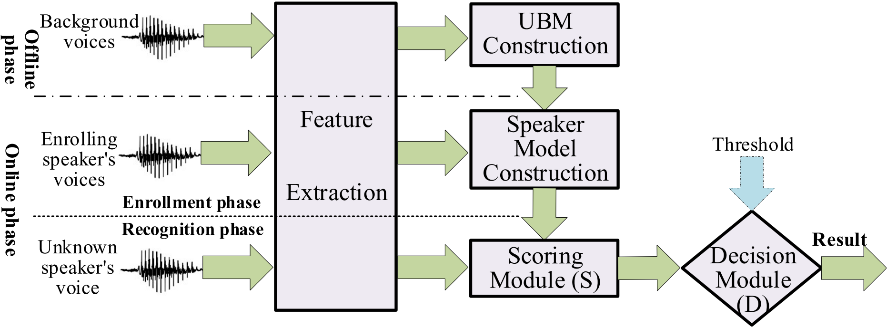

   (2) 说话人识别处理的任务:

   - Open-set Identification (OSI): 识别为哪一个说话人或返回空;
   - Close-set Identification (CSI): 识别为其中一个说话人 (不会返回空);
   - Speaker Verification (SV): 验证是否是目标说话人;

   (3) 是否依赖文本: 从后面的实验来看, 依赖文本的语音识别系统可能具有更好的安全性;

   - 依赖文本;
   - 不依赖文本;

   (4) 模型结构:

   - ivector-PLDA;
   - GMM-UBM;
   - xvector-PLDA;

3. 威胁场景:

   - 攻击黑盒模型;

   - 黑盒模型需要**输出识别的结果和得分**, 如果没有得分的话, 就使用迁移攻击 (如在 Microsoft Azure 上);

   - 👍 作者总共考虑 16 中可能的攻击组合:

     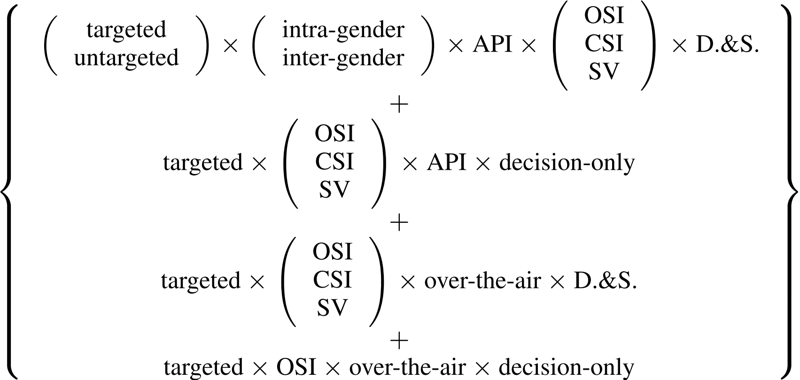

4. 👍 算法:

   (1) 迭代算法的选择: NES 算法是梯度估计算法 (**梯度估计算法的特点是需要知道目标标签的概率**) 中最佳的, **PSO** 算法是遗传算法中最佳的, 这里作者选用的是 **NES** 算法;

   (2) 形式化问题: 

   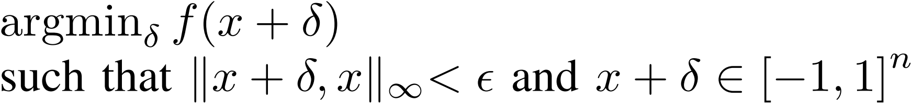

   ​	在一定扰动范围内, 是的目标 loss 函数最小化;

   (3) Attack on OSI: 

   - Targeted Attack:

     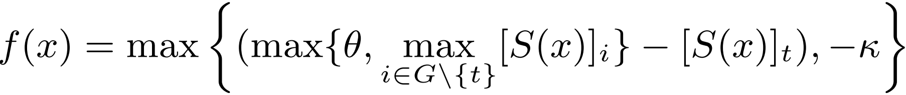

     最大化目标概率, 是的目标概率超过阈值 $\theta$ , 添加一个系数 $k$ 增强样本的鲁棒性, $k$ 越大越鲁棒.

   - Untargeted Attack: (<u>文章的公式可能有点小错误</u>)
     $$
     f(x) = \max{
     \{
     (\theta - \max_{i \in G \setminus{\{t\}}}[S(x)]_i), -k
     \}
     }
     $$
     这一块作者**并没有考虑 reject 也是无目标攻击的一种**, 故会有上面这个式子. 如果转换为 **平常我们遇到的无目标攻击 (考虑 reject)**, 公式形式如下: 
     $$
     f(x) = \max \{ [S(x)]_t - \theta , -k\}
     $$
     即我们让标签小于 $\theta$ 就完成了无目标攻击, 但如果这样的话, 便无法和下面的 **$\theta$ 估计算法** 相结合, 因为我们这里需要对 $\theta$ 向下估值, 而非向上估值.

   - $\theta$ 估计算法:

     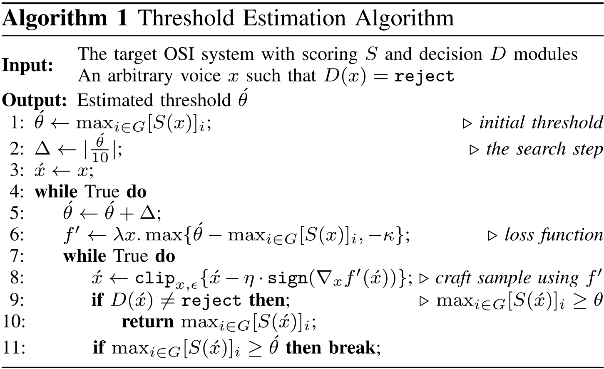

     大致的思想是, 先初始化一个较小的估计值 $\acute{\theta}$ , 如果迭代生成对抗样本超过了这个估计值, 但却未输出目标说明人标签时, 增大估计值继续生成对抗样本; (<u>伪代码第 6 行的 $\lambda x$ 挺奇怪的, 没太理解</u>)

   - 梯度估计 - NES 算法:

     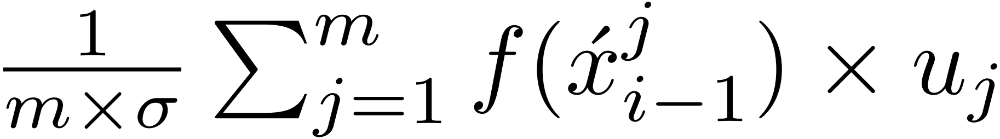

     其中, $u_j=-u_{m+1-j}$, $\sigma$ 是高斯分布的方差;

   - 梯度更新 - BIM 算法:

     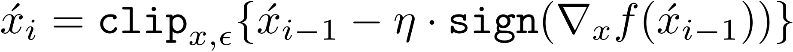

   - 参数选择: $m=50$ , $\delta=1e-3$, $\eta \in [1e-3, 1e-6]$, $max \ iteration=1000$ ;

   (4) Attack on CSI: 和 OSI 不同指出是, CSI 一定会输出一个标签, 因此不需要考虑 $\theta$ 的问题

   - Targeted Attack:

     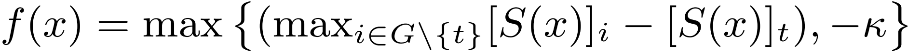

   - Untargeted Attack:

     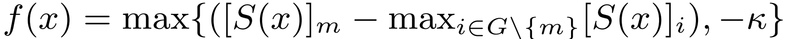

   (5) Attack on SV: SV 是一个单分类的识别系统, 如果为目标说话人则返回 True, 否则返回 False, 因此这种攻击下没有 Targeted / Untargeted 之分.

   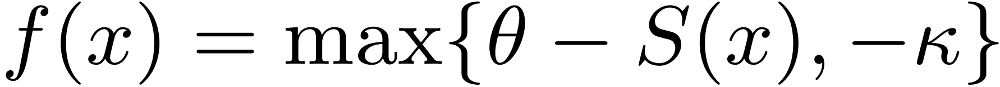

   这里将非目标说话人的语音转化为目标说话人的标签;

5. 👍 Evaluation on Effectiveness and Efficiency: 

   (1) 数据集:

   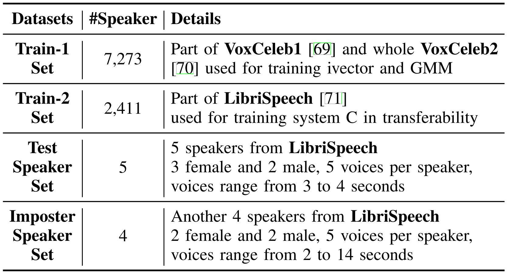

   (2) 评价指标:

   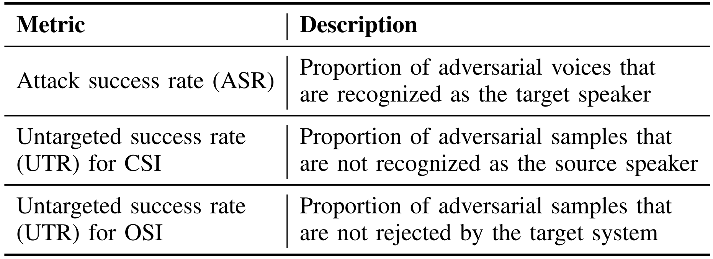

   (3) 本地训练的黑盒模型: 设置阈值参数 $\theta_{ivector}=1.45$, $\theta_{GMM} = 0.091$ 以保证 $FAR$ 在 10% 左右  ;

   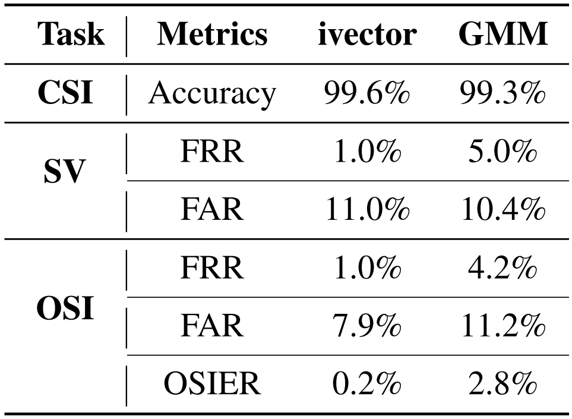

   - $FRR$ : False Rejection Rate;
   - $FAR$ : False Acceptance Rate;
   - $OSIER$ : Open Set Identification Error Rate is the rate of voices that can not be correctly classified;

   (3) 修改量的大小: 实验中选择 $\epsilon=0.002$;

   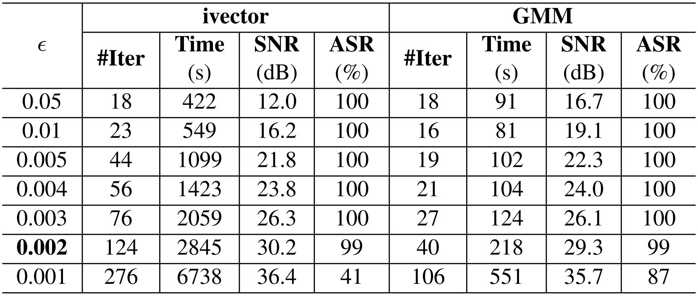

   (4) 攻击结果: **相比之下, ivector的对抗样本更难生成, 最少的一个样本需要迭代 25 轮(即 query 1250 次)**;

   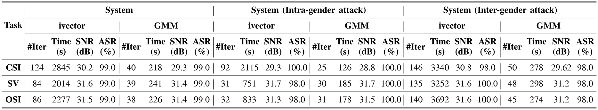

   (5) 过程中得到的阈值估计: 

   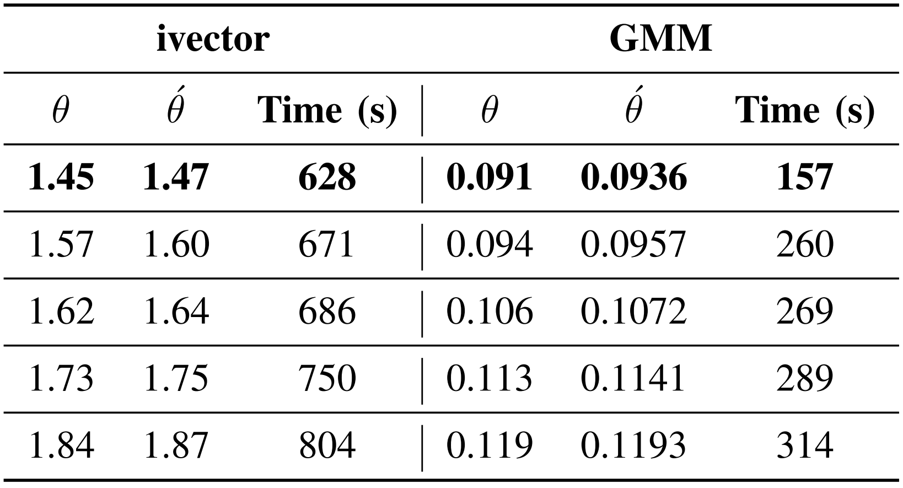

   (6) 攻击 Talentedsoft 平台: 成功攻击;

6. Evaluation on Transferability:

   (1) 目标模型结构: A, B, J 为前面实验用到的模型, 这边针对 ivector 和 GMM 增加了 `C~I`模型;

   

   (2) 目标模型训练结果:

   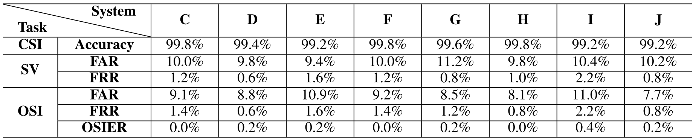

   (3) Transferability 的种类: 包括 跨平台, 跨模型种类 和 跨数据集;

   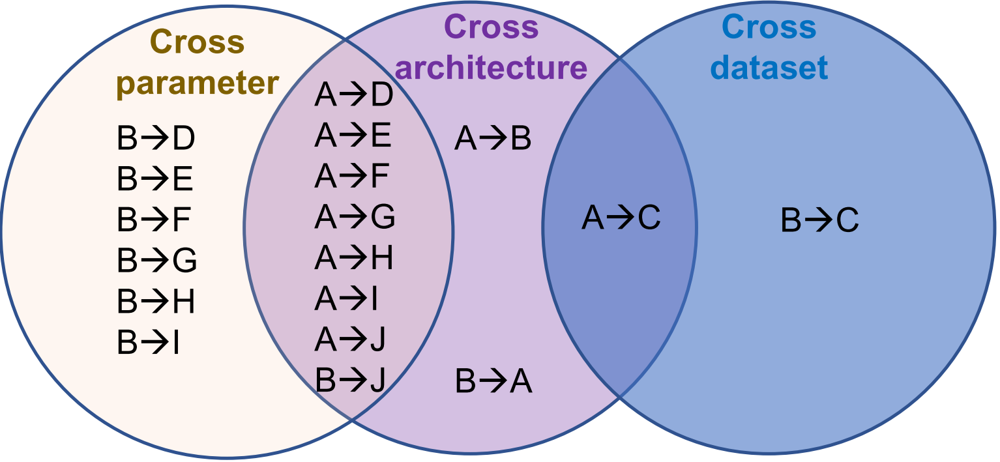

   (4) 为了提高 Transfer 能力, 作者对参数的设置如下:

   - 修改量: $\epsilon=0.05$, 可以看到在迁移攻击中需要更大的修改量;

   - CSI Task:  $k_{GMM}=0.2$ , $k_{ivector}=10$ ;
   - SV Task: $k_{GMM}=3$ , $k_{ivector}=4$ ;
   - OSI Task: $k_{GMM}=3$ , $k_{ivector}=5$ ;

   (5) 实验结果:

   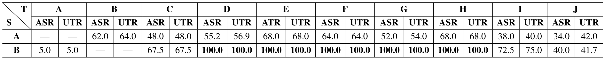

   (6) 讨论 $k$ 的影响: $k$ 越大, transferability 的能力越好;

   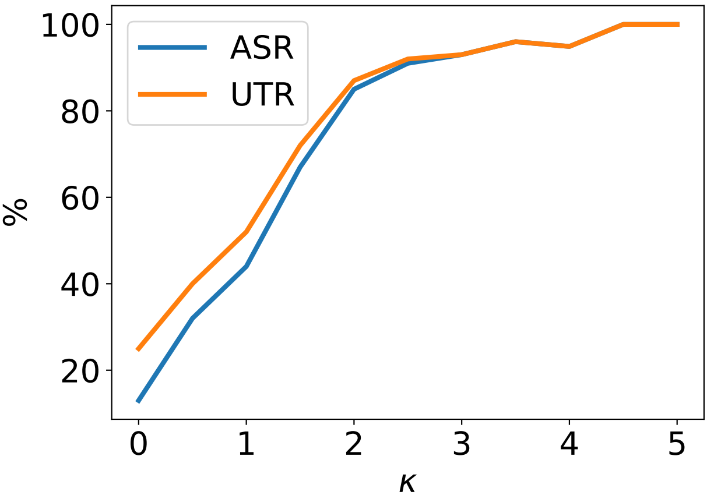

   (7) 攻击 Microsoft Azure 平台: 由于 Azure 上不输出相应的概率, 因此使用 transfer 攻击. 

   - Text-Independent OSI-Azure: 
   - ⭐ Text-Dependent SV-Azure: 只实现了 10% 的成功率, 其他的都因为添加的噪声过多而出现 "**Error, too noisy**";

   > 文本相关的, 并且判断语音中的噪声, 这样的语音认证对于攻击更加鲁棒, 能否对这个系统进行攻击?

7. Evaluation on Over-the-Air

   (1) 实验环境:

   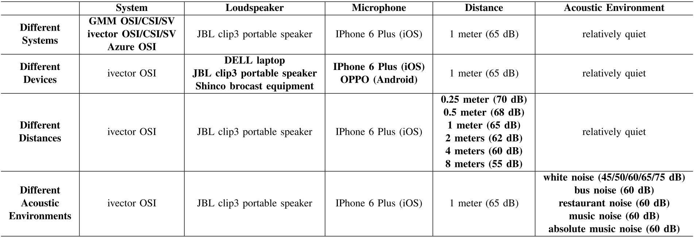

   (2) Result of Different Systems:

   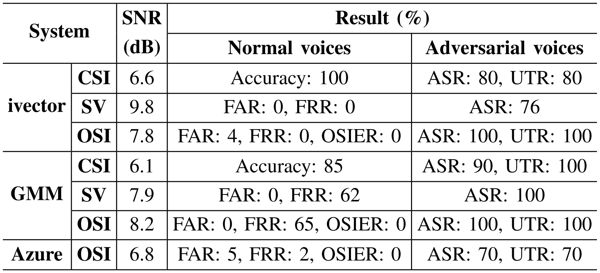

   (3) Result of Different Devices:

   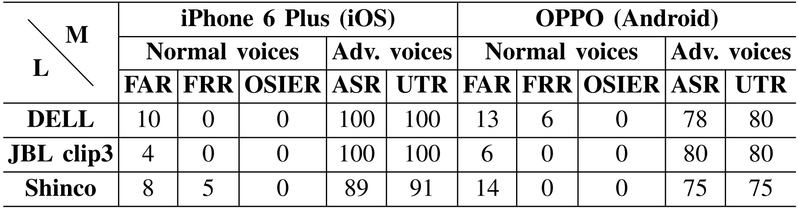

   (4) Result of Different Distance:

   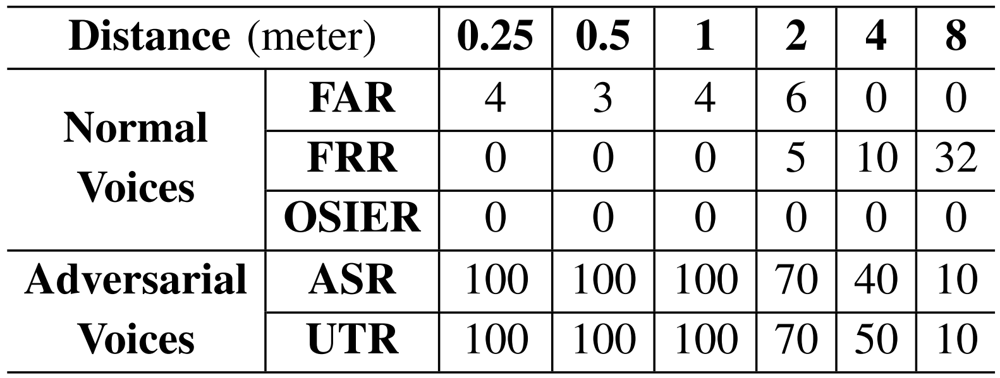

   (5) Result of Different Acoustic Environment:

   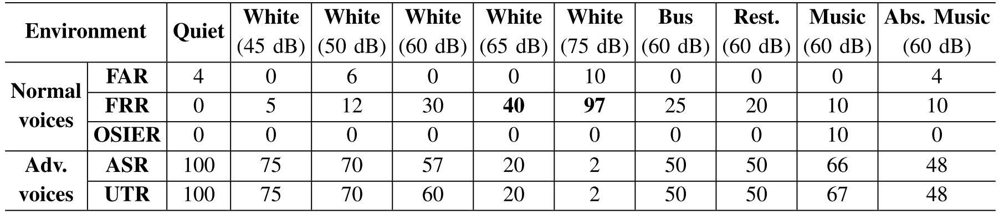

### Links

- 论文链接: [Chen, Guangke, et al. "Who is real bob? adversarial attacks on speaker recognition systems." *S&P* (2021).](https://arxiv.org/abs/1911.01840)
- 论文主页: https://sites.google.com/view/fakebob
- 论文代码: https://github.com/FAKEBOB-adversarial-attack/FAKEBOB

