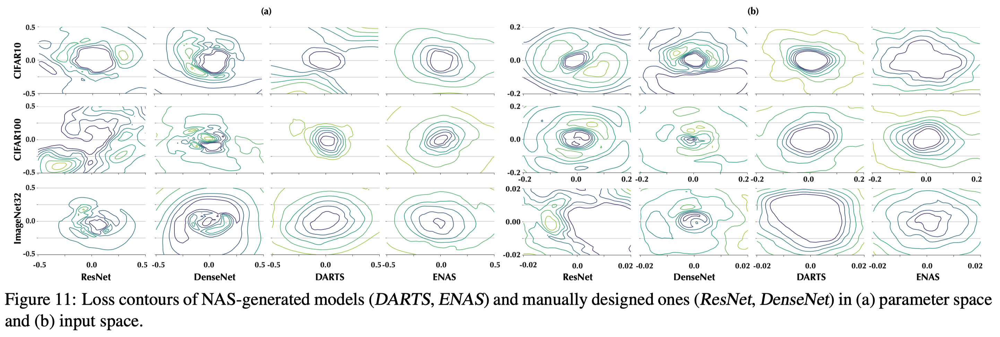

# Attack on Auto ML

## On the Security Risks of AutoML

### Contributions

1. 探讨了对抗攻击、投毒攻击、后门攻击、模型剽窃和成员推理攻击等在NAS中训练出来的模型上更严重的现象；
2. 建议更深的模型结构和减少使用残差连接；

### Notes

### Links

- 论文链接：[Pang R, Xi Z, Ji S, et al. On the Security Risks of AutoML. Usenix Security 2022.](https://arxiv.org/abs/2110.06018)
- 论文代码：https://github.com/ain-soph/autovul