# Attack & Defense in Backdoor Attack

[TOC]

## Todo List

1. Yingqi Liu, Shiqing Ma, Yousra Aafer, Wen-Chuan Lee, Juan Zhai, Weihang Wang, and Xiangyu Zhang. Trojaning attack on neural networks. In 25nd Annual Network and Distributed System Security Symposium, NDSS 2018, San Diego, California, USA, February 18-221, 2018. The Internet Society, 2018.
2. Yuanshun Yao, Huiying Li, Haitao Zheng, and Ben Y Zhao. Latent backdoor attacks on deep neural networks. In Proceedings of the 2019 ACM SIGSAC Conference on Computer and Communications Security, pages 2041–2055, 2019.
3. Joseph Clements and Yingjie Lao. Hardware trojan attacks on neural networks. arXiv preprint arXiv:1806.05768, 2018.
4. Wenshuo Li, Jincheng Yu, Xuefei Ning, Pengjun Wang, Qi Wei, Yu Wang, and Huazhong Yang. Hu-fu: Hardware and software collaborative attack framework against neural networks. In 2018 IEEE Computer Society Annual Symposium on VLSI (ISVLSI), pages 482–487. IEEE, 2018.
5. Bolun Wang, Yuanshun Yao, Shawn Shan, Huiying Li, Bimal Viswanath, Haitao Zheng, and Ben Y Zhao. Neural cleanse: Identifying and mitigating backdoor attacks in neural networks. In Neural Cleanse: Identifying and Mitigating Backdoor Attacks in Neural Networks, page 0. IEEE, 2019.
6. Huili Chen, Cheng Fu, Jishen Zhao, and Farinaz Koushanfar. Deepinspect: a black-box trojan detection and mitigation framework for deep neural networks. In Proceedings of the 28th International Joint Conference on Artificial Intelligence, pages 4658–4664. AAAI Press, 2019.
7. Bryant Chen, Wilka Carvalho, Nathalie Baracaldo, Heiko Ludwig, Benjamin Edwards, Taesung Lee, Ian Molloy, and Biplav Srivastava. Detecting backdoor attacks on deep neural networks by activation clustering. arXiv preprint arXiv:1811.03728, 2018.
8. Brandon Tran, Jerry Li, and Aleksander Madry. Spectral signatures in backdoor attacks. In Advances in Neural Information Processing Systems, pages 8000–8010, 2018.
9. Yansong Gao, Chang Xu, Derui Wang, Shiping Chen, Damith C Ranasinghe, and Surya Nepal. Strip: A defence against trojan attacks on deep neural networks. arXiv preprint arXiv:1902.06531, 2019.
10. Edward Chou, Florian Tram`er, Giancarlo Pellegrino, and Dan Boneh. Sentinet: Detecting physical attacks against deep learning systems. arXiv preprint arXiv:1812.00292, 2018.

## Detecting AI Trojans Using Meta Neural Analysis

> 原文的表述比较清晰，建议可以阅读原文

### Contribution

### Notes

1. Meta Neural Analysis：中文译为元神经分析，是整篇文章的核心内容，下面展示其整个流程图

   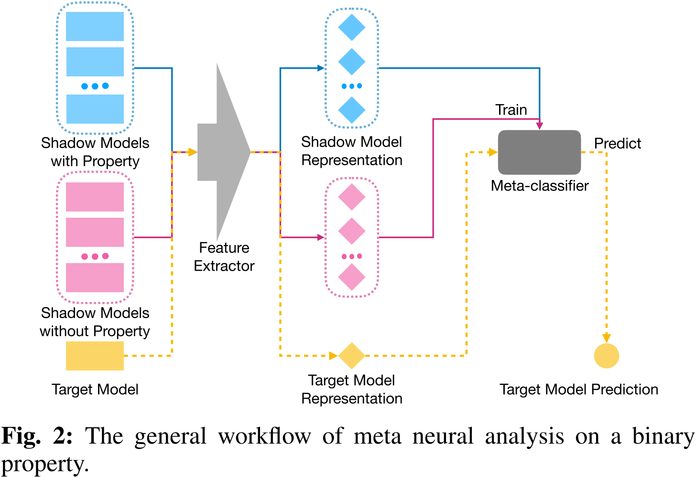

   可以看到，整个流程即为：从神经网络模型中提取特征（**文章中用的是特定 query 的模型输出结果**），然后用这些特征训练一个分类器；

2. Trojan Attacks on Neural Networks

   后门的实际示例如下图所示：

   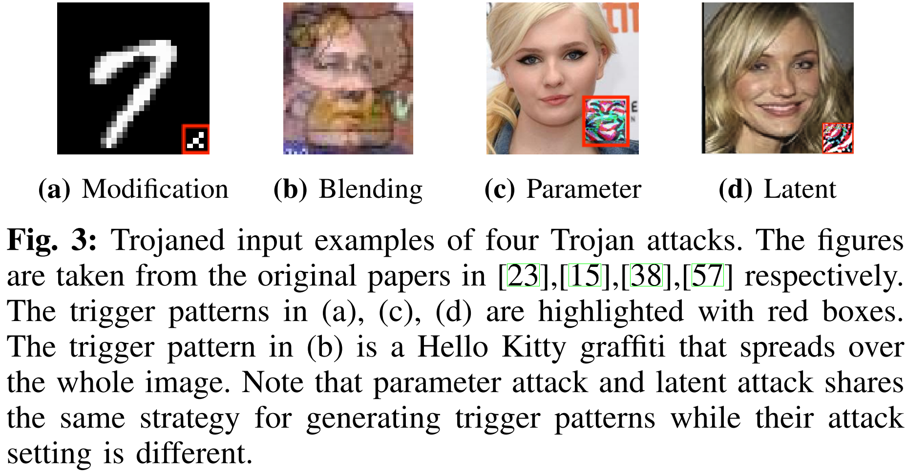

   - **Modification Attack**：直接在训练集样本的某个区域上打 Patch；
   - **Blending Attack**：在训练集样本的整体上打上 Patch；
   - **Parameter Attack**：:question: <u>大概是通过梯度下降算法生成的后门 patch，但是具体怎么做还是不清楚？</u>
   - **Latent Attack**：:question: <u>不是很清楚，fine-tune的时候出现的后门，有待更新？</u>

3. Threat Model & Defender Capabilities

   作者罗列了已有的后门攻击防御方法及其能力，如下图所示：

   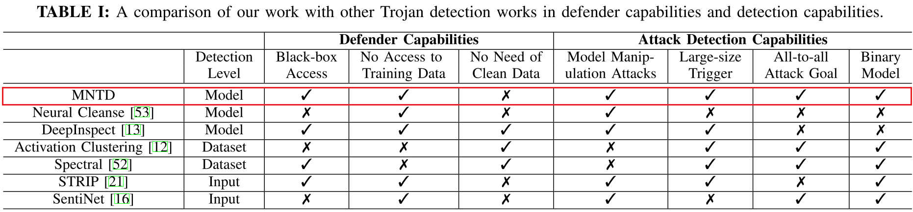

   可以看到，作者实现的是一种 **模型层面的后门检测算法**，不需要获取模型的参数，不需要获取训练数据，但是需要获取一小部分相同任务的干净数据（没有被污染的数据）；

4. 文章方法 Meta Neural Trojan Detection (MNTD)

   ⭐ **整体思想**：文章想做的其实就是训练一堆 **正常的网络模型** 和一堆 **带有后门的网络模型**，然后用一定量的**特定的 query 获取模型的输出结果**，这个输出结果拼接在一起即**组成了模型的特征**，最后利用模型的特征来 **训练一个二分类器**；

   整体的 **流程图** 如下所示：

   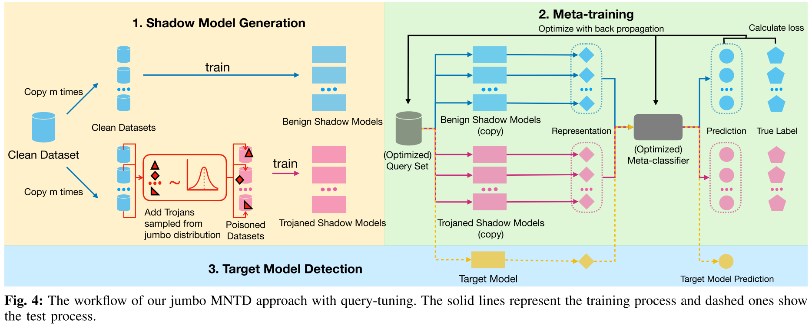

   - Shadow Model Generation - Jumbo Learning

     Shadow Model 由正常模型和后门模型组成。正常模型比较好训练，作者采用的是不同的初始化方法训练多个模型。而后门模型的训练则比较麻烦，因为攻击者添加后门的策略是千变万化的，防御者无法穷举这个可能性。所以作者这里提出了 **Jumbo Learning** 的方法，大致的思想就是**随机采样添加后门的策略**，为此，作者列出了如下随机采样公式：（<u>这里，我在解释的时候用的是 patch，或者也可以称为 pattern，都一样</u>）

     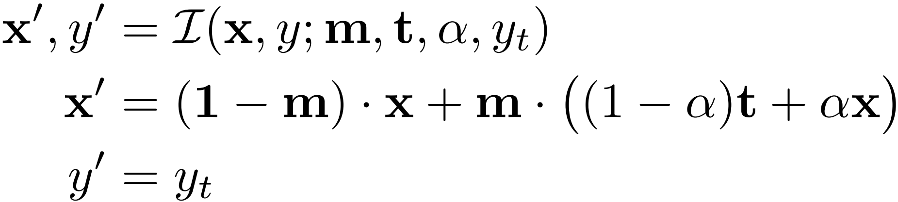

     其中，$(x,y)$ 表示正常的样本，$(x',y')$ 表示添加了后门的样本，$\alpha$ 控制添加的 patch 的透明度，$m$ 用来控制 patch 的大小、位置、形状等，$t$ 为后门 patch；

     > 注意 :warning:：虽然作者上面确实提到了四种后门攻击的方法，但是实际上在随机采样的过程中，只是应用了 Modification Attack 和 Latent Attack 这两个攻击，因为只有这两个攻击是可以通过污染模型训练数据集可以实现的；

     Jumbo Learning 的伪代码如下所示：

     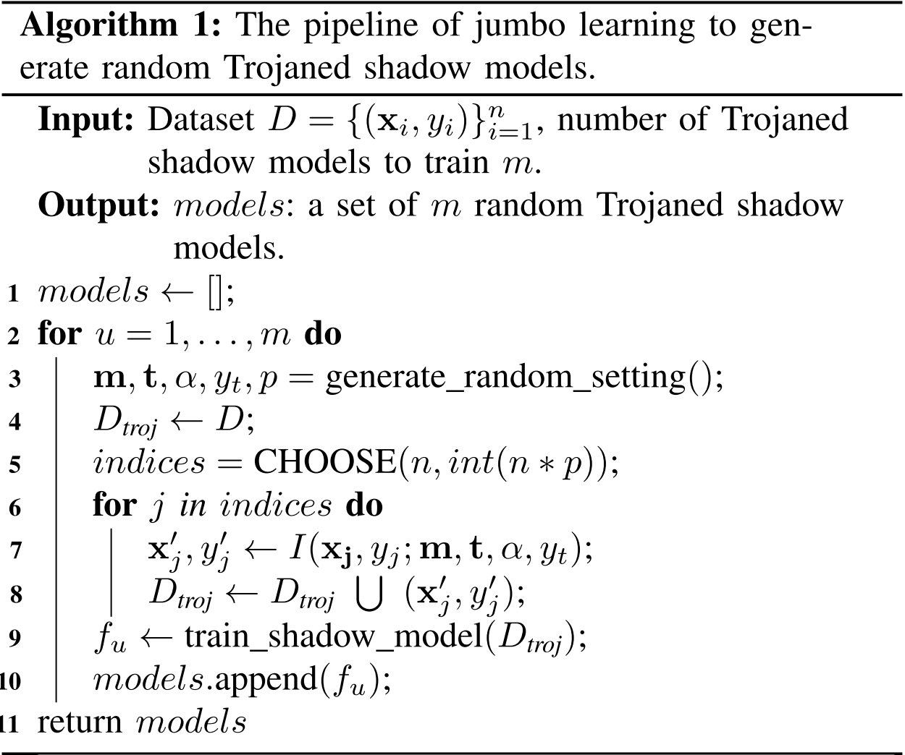

     作者也展示了随机产生的后门样本：

     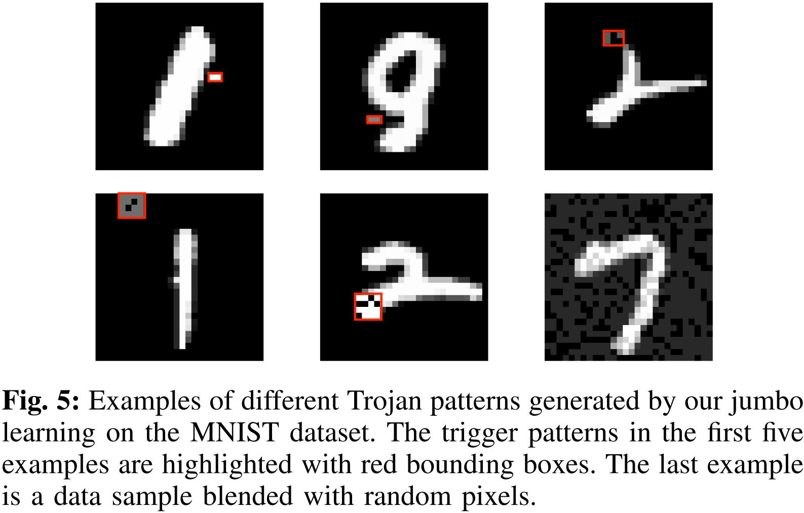

   - Meta-training

     Meta-training 的核心问题有两个：

     - 从模型中 **提取特征**

       作者选择 $k$ 个样本 $X=\{x_1,\dots,x_k\}$，给模型预测，得到模型的输出结果 $\{f_i(x_1), \dots, f_i(x_k)\}$，然后将这 $k$ 个输出结果（文章中直接使用 $k=10$）进行拼接，就是模型的特征了，公式如下所示：

       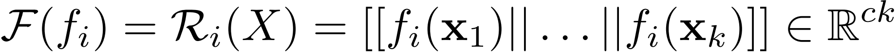

     - 训练一个**分类器**：作者用的两层全连接神经网络；

     在训练的过程中，我们可以由一个比较 **简单的解决方案**，那就是随机选择 $k$ 个样本，然后来训练分类器，训练的公式如下所示：

     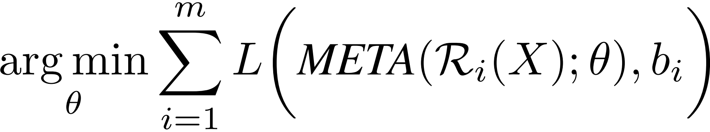

     显然，这样的解决方案，非常依赖于这些样本是否是好的。所以，作者为了解决这个问题，在训练的时候，**同时训练分类器和这 $k$ 个样本（我们可以直接通过模型本身将梯度回传回去）**，改进后的训练公式如下所示：

     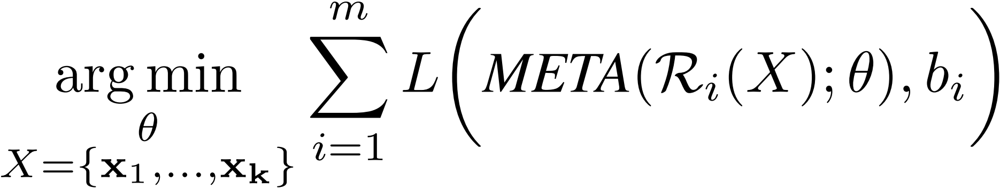

   - Baseline Meta-training algorithm without jumbo learning

     这里，作者想对比一下，如果我们不训练后门模型，只训练正常的模型，然后训练一个分类器，这样的结果如何，即变成了一个 One-class Data Detection 问题。这种情况下，作者修改了网络的训练公式，如下所示：

     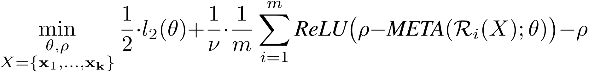

5. 实验设置

   <u>实验的参数设置非常多，这里罗列一些我比较关心的点</u>：

   - 数据集：图像上面用的 MNIST 和 CIFAR10 数据集，语音上面用的 SpeechCommand 数据集，自然语言处理上用的 Rotten Tomatoes movie review 数据集，表格数据用的 Smart Meter Electricity Trial 数据集；
   - 攻击者使用 50% 的数据集，防御者使用 2% 的数据集，且互相没有交集；
   - 从攻击者的角度，生成 256 个后门模型和 256 个正常模型；
   - 从防御者的角度，生成 2048 个后门模型和 2048 个正常模型用来训练分类器；
   - 防御者不会使用攻击者已经使用过的后门策略；
   - Baseline 方法：Activation Clustering（AC），Neural Cleanse（NC），Spectral Signature（Spectral）和 STRIP；

6. 实验结果 ⭐

   > 作者的实验基本上可以称为完美，基本上把我有疑问的实验都做了一遍

   - Trojan Attacks Performance

     作者这里 **展示后门模型原始任务的精度和后门攻击的成功率**，但是这里 **<u>cifar10 的实验我觉得是不可取的</u>**，因为非常明显，后门模型已经严重影响了原任务的精度，正常情况下，我们并不会采用这样的模型；

     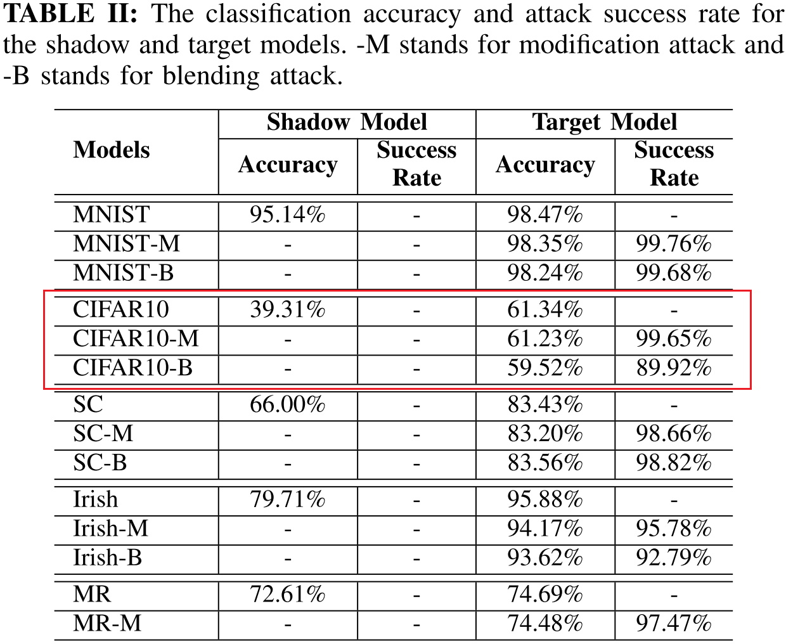

   - Detection Performance

     作者这里展示不同防御方法对后门模型的检测效率，可以看到，**作者提出的方法在不同的数据集上和不同的后门攻击上都有一个不错的效果**；

     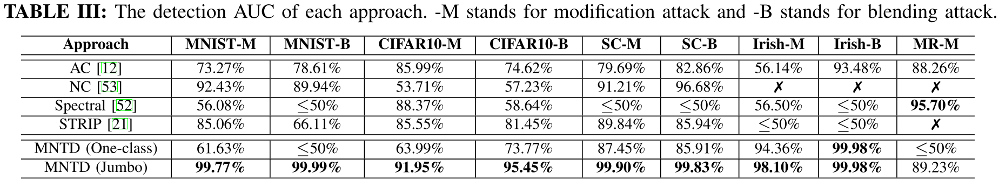

   - Impact of Number of Shadow Models

     作者这里展示训练不同数量的模型，对分类器最后检测结果的影响，可以看到，**不同的数据集对模型数量的敏感度是不一样的，更复杂的数据集需要训练更多的模型，这可能会导致一个问题，即在复杂数据集上无法用作者提出的方法**；

     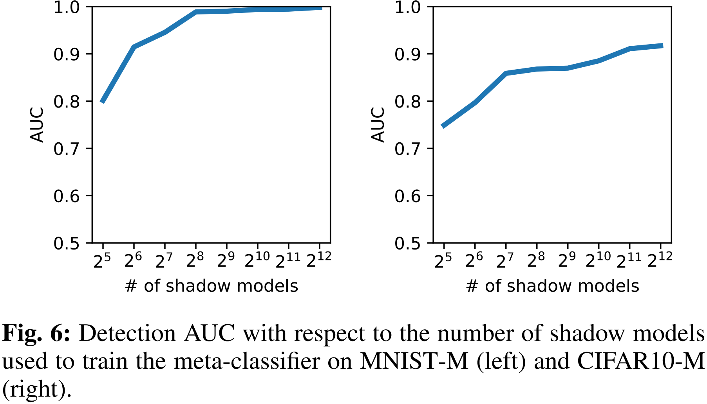

   - Running Time Performance

     作者这里展示后门模型检测需要消耗的时间，可以看到，**虽然在检测的时候，该方法非常快，但是训练分类器时却需要消耗大量的时间，取决于原始模型的结构，这也是在复杂数据集上无法用作者提出的方法的一个重要原因**；

     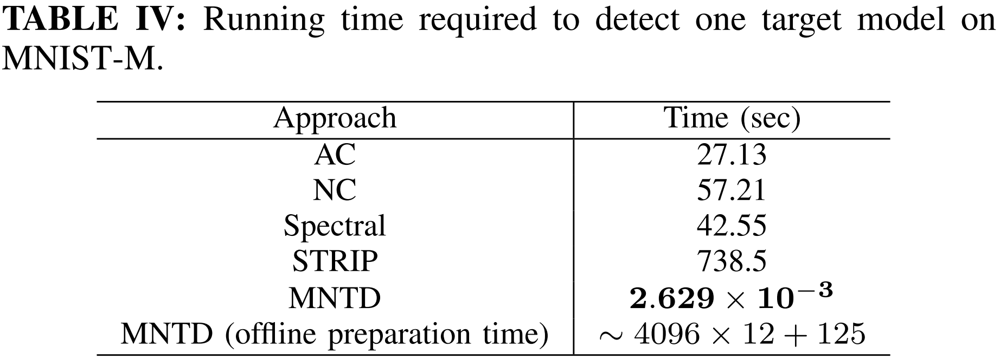

   - Generalization on Trigger Patterns

     作者这里验证分类器能否检测没有在训练过程中遇到的后门 Patch，可以看到，**分类器对未预见的后门 Patch 泛化性能不错**；

     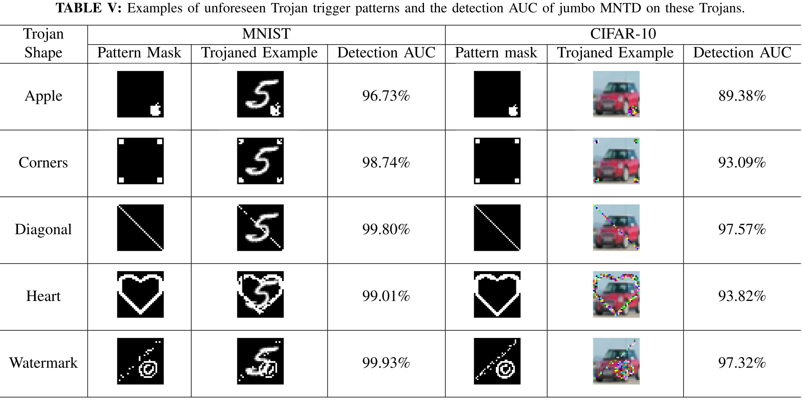

   - Generalization on Malicious Goals

     作者这里验证分类器能否检测没有在训练过程中遇到的后门模式（训练时采用的是多个类被错误分类到一个类的模式，这里验证多个类被错误分类到多个类的模式），可以看到，**分类器对未预见的后门模式泛化性能不错**；

     > 这里作者还是少测了一种可能性，即只把一个类错误分类到另一个类的模式。不过，这种模式多半是能被这种防御方法防御成功的，不行的化，可以对前面的虽然采样公式做一定的修改即可。

     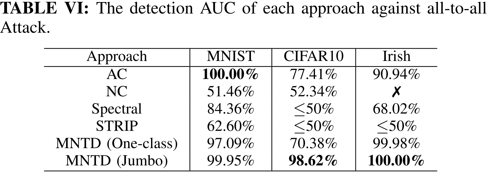

   - Generalization on Attack Approaches

     作者这里验证分类器能否检测没有在训练过程中遇到的后门攻击方法（指的是 Parameter Attack 和 Latent Attack 两种后门攻击方法），可以看到，**分类器对未预见的后门攻击泛化性能不错**；

     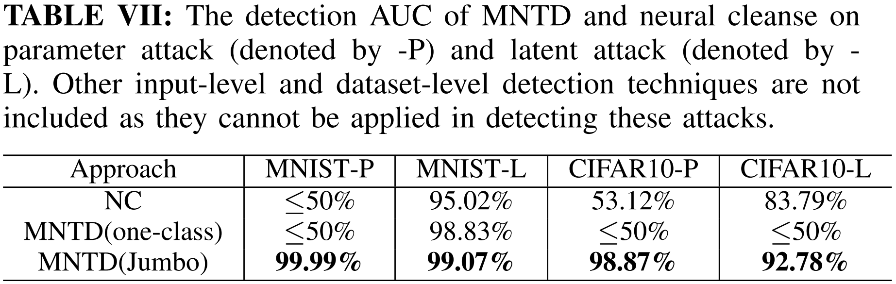

   - Generalization on Model Structures

     作者这里验证分类器能否检测没有在训练过程中遇到过的模型结果，可以看到，**分类器对未预见的模型结构泛化性能不错**；

     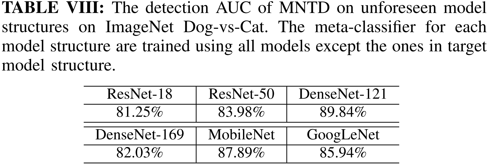

   - Generalization on Data Distribution

     作者这里验证在防御者没有相似分布的训练数据集时，分类器的检测结果，可以看到，**分类器对训练集的分布泛化性能不错**；（:question: <u>我挺好奇的，这是为什么能够达到这么好的效果</u>）

     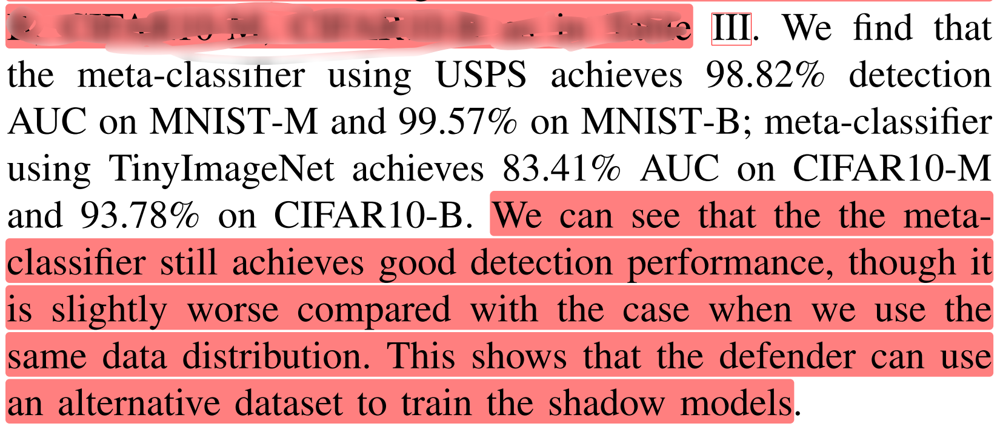

7. Adaptive and Countermeasure

   这里，作者假设，如果攻击者能够完全得到防御者提出的模型及其参数，那么攻击者可以在梯度下降的过程中添加额外的损失项来让自己的模型规避分类器的检测，公式如下所示：

   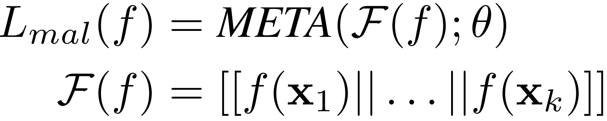

   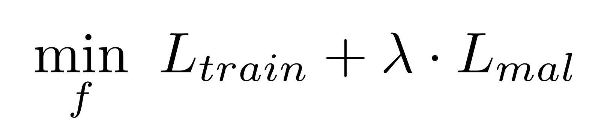

   那么，为了解决这个问题，作者在分类器上又额外添加了一个随机过程：

   - 首先，把分类器的部分参数进行随机化；
   - 然后固定分类器，继续训练 query 数据集；
   - 用再训练过的 query 数据集来检测目标模型；

   这样的随机化方法，避免了攻击者可以获取到分类器的参数，在一定程度上可以缓解前面提到的风险，实验的结果如下：

   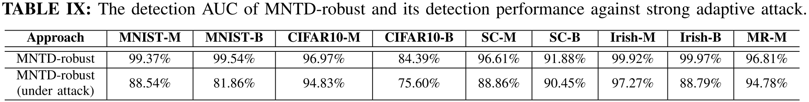

### Links

- 论文链接：[Xu X, Wang Q, Li H, et al. Detecting ai trojans using meta neural analysis[J]. arXiv preprint arXiv:1910.03137, 2019.](https://arxiv.org/abs/1910.03137)

- 论文代码：[Meta Neural Trojan Detection]([AI-secure/Meta-Nerual-Trojan-Detection (github.com)](https://github.com/AI-secure/Meta-Nerual-Trojan-Detection))

## Backdoor Attack Against Speaker Verification

### Contribution

1. 针对基于 d-vector 和 x-vector 的说话人认证系统实现了后门攻击；

> ⭐ 说话人认证任务，和我们平常看到的分类任务有非常大的不同，主要原因是目标说话人的语料可能很少，所以业界需要实现通过较少的目标说话人语料实现说话人认证任务。这一点是前面常见的后门攻击所没有涉及的，值得我们的进一步探讨。

### Notes

1. 文章中使用的 Backdoor Trigger：

   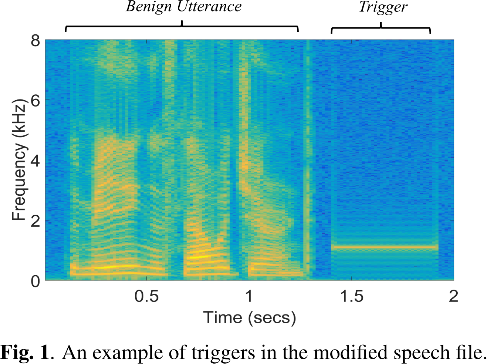

2. 算法流程：

   - Obtaining Speaker's Representation：训练神经网络来提取不同说话人片段的特征；
   - Speaker Clustering：使用聚类算法将不同的说话人进行聚类；
   - Trigger Injection：根据聚类的结果，对不同簇的说话人的语料插入不同的 Backdoor Trigger；
   - Retrain and Obtain the Backdoored Speaker's Representation：用添加了后门的语料再次训练神经网络；
   - Enroll the Target Speaker：用少料目标说话人的语料来获取该说话人的特征表示；
   - Backdoor Attack：遍历使用上面的 Backdoor Trigger 来测试是否成功插入后门；

> 思考：:question:
>
> 1. 为什么能够通过这种方式，来攻击说话人认证模型？
> 2. 能够攻击说话人识别模型？
> 3. 文章提到的说话人认证模型是否是当前业界的主流？

### Links

- 论文链接：[Zhai T, Li Y, Zhang Z, et al. Backdoor attack against speaker verification[C]//ICASSP 2021-2021 IEEE International Conference on Acoustics, Speech and Signal Processing (ICASSP). IEEE, 2021: 2560-2564.](https://arxiv.org/pdf/2010.11607.pdf)
- 论文代码：https://github.com/zhaitongqing233/Backdoor-attack-against-speaker-verification
