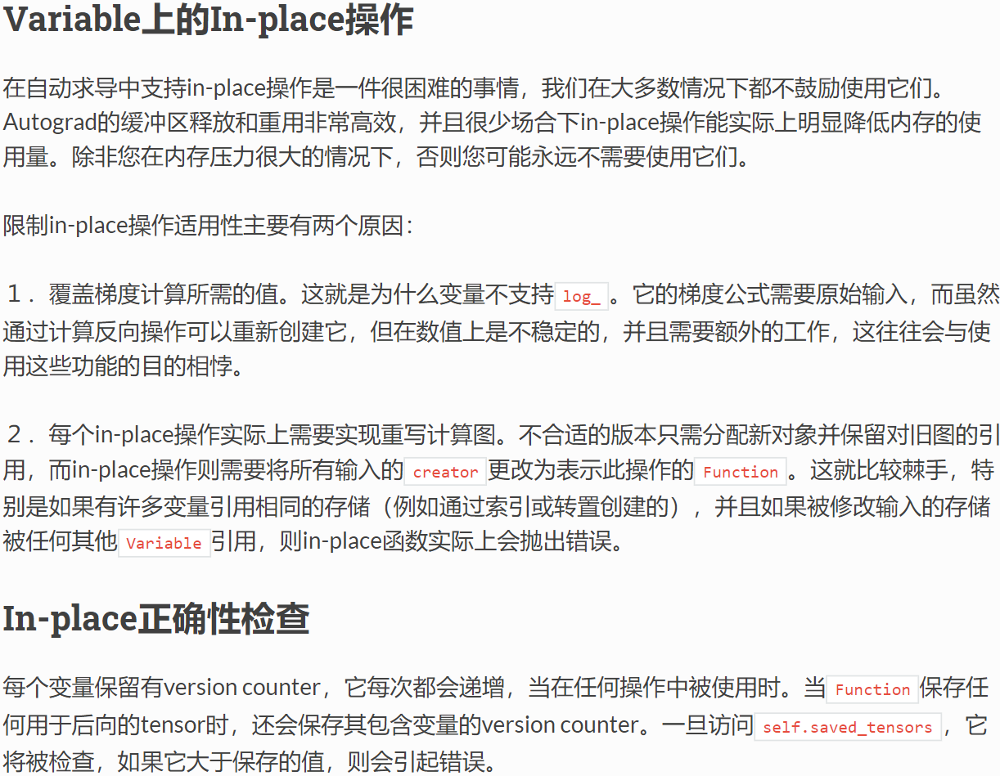

# Problems in Coding

[TOC]


## Python


## Tensorflow

#### Keras  和 Multiprocessing 组合 Bug

我在` windows` 上面运行的很好，但是放到 Linux 服务器上面后，子进程中的 `keras.models.load_model()` 就卡住不动了。Bug 原理和解决方法参考博客 “[keras使用多进程](https://www.cnblogs.com/zongfa/p/12193561.html)”，写的非常棒，体会到了进程拷贝的问题。Bug 在 github 上面的链接参考 [Keras is not multi-processing safe](https://github.com/keras-team/keras/issues/9964) ；


## PyTorch

#### Python 的 `@staticmethod / @classmethod` 方法

主要参考知乎大佬 [正确理解Python中的 @staticmethod@classmethod方法](https://zhuanlan.zhihu.com/p/28010894)，这里需要注意的是 PyTorch 的 `torch.nn.Function` 类中的 `forward/backward` 方法是比较特殊的；

#### PyTorch 的 `torch.nn.RNN` 源码分析

主要参考知乎大佬 [读PyTorch源码学习RNN（1）](https://zhuanlan.zhihu.com/p/32103001)，这里注意 PyTorch 的输入输出，以及如何进行时间片上的状态传递的；

#### PyTorch 镜像翻转实现

主要参考博客大佬 [Tensor的镜像翻转](https://heroinlin.github.io/2018/03/12/Pytorch/Pytorch_tensor_flip/)，镜像翻转的代码如下：

```python
import pytorch
def flip(x, dim):
    xsize = x.size()
    dim = x.dim() + dim if dim < 0 else dim
    x = x.view(-1, *xsize[dim:])
    x = x.view(x.size(0), x.size(1), -1)[:, getattr(torch.arange(x.size(1)-1, -1, -1), ('cpu','cuda')[x.is_cuda])().long(), :]
    return x.view(xsize)
```

#### PyTorch 梯度回传时的 `inplace` 问题

实现 LRP 可解释方法的时候遇到了如下 `error` ：

```shell
Warning: No forward pass information available. Enable detect anomaly during forward pass for more information. (print_stack at ..\torch\csrc\autograd\python_anomaly_mode.cpp:40)
Traceback (most recent call last):
  File "D:/workspace/TorchLRP/examples/expalin_rnn.py", line 97, in lrp_explanation
    grad = torch.autograd.grad(lrp_loss, [lrp_embedding_vector], allow_unused=True)[0].detach().cpu().numpy()  # shape: (batch_size, seq_len, feature_size)
  File "D:\Anaconda\Anaconda3\envs\lemna_python37\lib\site-packages\torch\autograd\__init__.py", line 157, in grad
    inputs, allow_unused)
  File "D:\Anaconda\Anaconda3\envs\lemna_python37\lib\site-packages\torch\autograd\function.py", line 77, in apply
    return self._forward_cls.backward(self, *args)
  File "D:/workspace/TorchLRP\lrp\functional\linear.py", line 115, in backward
    return _backward_alpha_beta(alpha, beta, ctx, relevance_output)
  File "D:/workspace/TorchLRP\lrp\functional\linear.py", line 72, in _backward_alpha_beta
    input, weights, bias = ctx.saved_tensors  # type: torch.Tensor, torch.Tensor,torch.Tensor
RuntimeError: one of the variables needed for gradient computation has been modified by an inplace operation: [torch.FloatTensor [8]], which is output 0 of SelectBackward, is at version 10; expected version 9 instead. Hint: the backtrace further above shows the operation that failed to compute its gradient. The variable in question was changed in there or anywhere later. Good luck!
```

**关键点**：PyTorch 提示了存储的变量在计算梯度的时候发现这个变量已经被修改（`modefied by an inplace operation`）了，故无法求解梯度；

**官网解释**：说明 PyTorch 的计算图并不支持原地赋值操作，这会让梯度的计算变得十分复杂，所以我们需要避免相应的原地赋值操作；



**RELU 单元**：Relu 单元中存在 In-place 操作，但是我的问题并不是出现在这个地方，参考链接 https://blog.csdn.net/manmanking/article/details/104830822；

我在自定义 RNN 前向后向传播的过程中，对于 `hidden_state` 做了一个 In-place 操作，所以导致了错误；