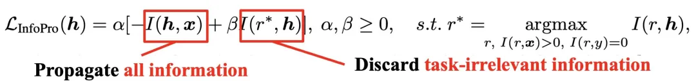
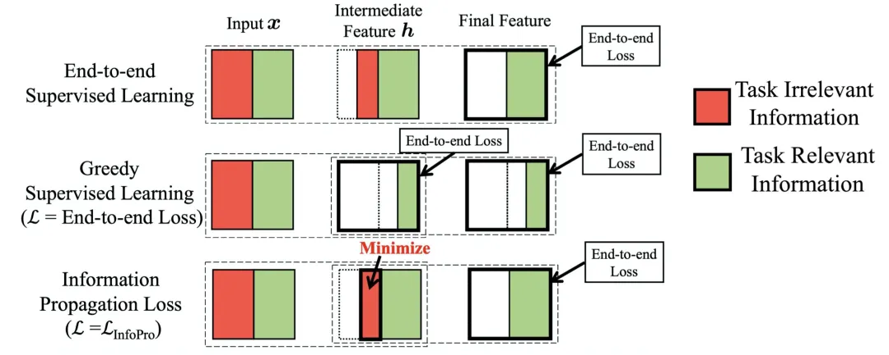

# 人工智能前沿讲习

> 主要记录自己在公众号 “人工智能前沿讲习” 中学到的知识。
>
> “他山之石，可以攻玉”，站在巨人的肩膀才能看得更高，走的更远。

[TOC]

#### 【他山之石】整理 Deep Learning 调参 tricks

参考链接：https://mp.weixin.qq.com/s/Gw8K0GggRcahwLf3tu4LrA

#### 【他山之石】深度学习中的那些 Trade-off

参考链接：https://mp.weixin.qq.com/s/RoEwx7qAUlSvjB608zOx1g

#### 【他山之石】tensorflow2.4性能调优最佳实践

参考链接：https://mp.weixin.qq.com/s/BI2BjAJGXzRk4k9d99PgLQ

- [【梦想做个翟老师】浅谈Tensorflow分布式架构：ring all-reduce算法](https://zhuanlan.zhihu.com/p/69797852)
- [【瓦特兰蒂斯】单机多卡的正确打开方式（二）：TensorFlow](https://fyubang.com/2019/07/14/distributed-training2/)

#### 【强基固本】机器学习常用评价指标总览

参考链接：https://mp.weixin.qq.com/s/MVw3IIno4iyTNaEOjBLzAQ

#### 【他山之石】Pytorch优化器及其内置优化算法原理介绍

参考链接：https://mp.weixin.qq.com/s/nWK0ci4qtKXJd-j--ZsC4Q

- [pytorch的计算图](https://zhuanlan.zhihu.com/p/33378444)
- [PyTorch 源码解读之 torch.autograd：梯度计算详解](https://zhuanlan.zhihu.com/p/321449610)
- [pytorch中 ctx 和 self 的区别](https://blog.csdn.net/littlehaes/article/details/103828130)：可以看到 `torch.nn.function` 中的 `apply` 这个方法已经在底层定义好了，并且我们自定义梯度回传时，要严格遵守 `forward / backward` 的参数定义——第一个参数使用 `cxt` 表示上下文信息，主要用来保存和读取变量，且 `backward` 返回的变量和 `forward` 输入的变量是相对应的；

#### 【源头活水】ICLR2021 | 显存不够？不妨抛弃端到端训练

参考链接：https://mp.weixin.qq.com/s/GJSSFSy25ltJxVweRaNEiw

- 论文链接：[Revisiting Locally Supervised Learning: an Alternative to End-to-end Training](https://openreview.net/forum?id=fAbkE6ant2)

- 论文代码：[InfoPro-Pytorch](https://github.com/blackfeather-wang/InfoPro-Pytorch)

- 传统端到端神经网络存在的问题：

  - **内存开销**：端到端训练需要在网络前传时将每一层的输出进行存储，并在逐层反传梯度时使用这些值，这造成了极大的显存开销；
  - **难以并行**：前传时深层网络必须等待浅层网络的计算完成后才能开始自身的前传过程；同理，反传时浅层网络需要等待来自深层网络的梯度信号才能进行自身的运算。这两点线性的限制使得端到端训练很难进行并行化以进一步的提升效率；

- 局部监督学习存在的问题及可能的原因：

  - 问题：往往损害网络的整体性能；
  - 原因：作者通过互信息分析后总结认为，**局部监督学习之所以会损害网络的整体性能，是因为其倾向于使网络在浅层丢失与任务相关的信息，从而使得深层网络空有更多的参数和更大的容量，却因输入特征先天不足而无用武之地**；

- 论文方法：论文提出了 `InfoPro` 损失函数，公式如下

  

  **其目标是使得局部模块能够在保证向前传递全部有价值信息的条件下，尽可能丢弃特征中的无用信息，以解决局部监督学习在浅层丢失任务相关信息、影响网络最终性能的问题**，示意图如下

  

  为了便于计算，作者去上式的上界，公式如下

  

  

#### 【综述专栏】深度学习模型泛化性小结

参考链接：https://mp.weixin.qq.com/s/2QngzZLxXkERMr5YDTfJvA

比较有意思的，文章从频域的角度去分析数据分布对模型泛化能力的影响，在一定程度上反映了对抗攻击能成功的原因，正是成功抓住了数据中高频的信息，这恰恰也是我们的深度神经网络所学习到的；（**不能全认可，可以当作对抗攻击成功的新视角：抓住了数据的高频特征**）

参考论文：[Wang H, Wu X, Huang Z, et al. High-frequency component helps explain the generalization of convolutional neural networks[C]//Proceedings of the IEEE/CVF Conference on Computer Vision and Pattern Recognition. 2020: 8684-8694.](https://arxiv.org/abs/1905.13545)

#### 【他山之石】反卷积和上采样

参考链接：https://mp.weixin.qq.com/s/IV3IjuOpChDRflvDNI29OA

反卷积的真实操作，原来是通过线性插值后，再卷积；

#### 【强基固本】最受欢迎的算法之一：反向传播训练

参考链接：https://mp.weixin.qq.com/s/53LUqB8Rm0lYSlhuyrhG0A

> 我们现在面临的问题是，计算神经网络中每个权重的偏导数。当一个方程具有多个变量时，我们使用偏导数。每个权重均被视为变量，因为这些权重将随着神经网络的变化而独立变化。**每个权重的偏导数仅显示每个权重对误差函数的独立影响**。该偏导数就是梯度。

#### 【综述专栏】DL：LSTM如何实现长短期记忆

参考链接：https://mp.weixin.qq.com/s/o_Xb5V5yGdSyDE_j6vtkFQ

#### 【综述专栏】深度学习中的图像分割：方法和应用

参考链接：[【综述专栏】深度学习中的图像分割：方法和应用 (qq.com)](https://mp.weixin.qq.com/s/YSscxoQrxya6PVndkZoKWg)

很简单地讲了一下图像分割问题。

#### 【他山之石】Pytorch优化器及其内置优化算法原理介绍

参考链接：[【他山之石】Pytorch优化器及其内置优化算法原理介绍 (qq.com)](https://mp.weixin.qq.com/s/nWK0ci4qtKXJd-j--ZsC4Q)

简单介绍了 Pytorch 中的优化器模块 torch.optim 的 API 调用逻辑，并且介绍了其中使用的参数优化算法。
