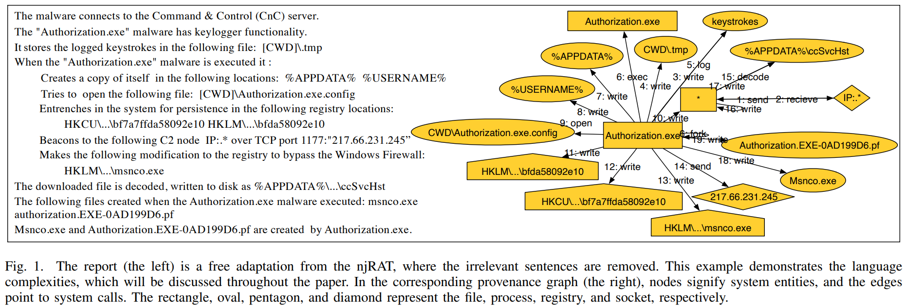
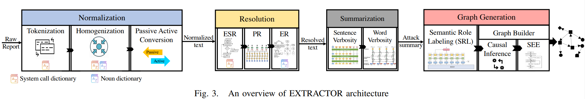

# Traditional Security

[TOC]

## FreeBuf

#### 戴尔OMSA文件读取漏洞分析

参考链接：https://mp.weixin.qq.com/s/MGefIEp69VxMZ2at8UICJA

#### 通过苹果的Find My Network功能实现蓝牙设备跟踪

参考链接：https://mp.weixin.qq.com/s/EBPV11X9hM1G3WGtngXKww

#### Cpufetch：一款功能强大的CPU架构信息爬取工具

参考链接：[Cpufetch：一款功能强大的CPU架构信息爬取工具 (qq.com)](https://mp.weixin.qq.com/s/8KQcPl6XrBhEqK8UacO0Kw)

挺有意思的一个 CPU 信息查看工具，工具链接：https://github.com/Dr-Noob/cpufetch ；

#### 如何使用Defeat-Defender禁用Windows系统安全策略

参考链接：[如何使用Defeat-Defender禁用Windows系统安全策略 (qq.com)](https://mp.weixin.qq.com/s/eafVc-ZcISCWTmzhS2VUzQ)

准备渗透测试的前奏脚本，去除 Windows 上面的保护机制；

#### WAF-A-MoLE：针对Web应用防火墙的基于变异的模糊测试工具 

参考链接：https://www.freebuf.com/articles/web/285672.html

可以生成相同语义的不同 SQL 语句，用于稳健性测试

WAF-A-MoLE 是一款功能强大的 **基于变异的模糊测试工具**，该工具可以帮助广大研究人员对基于 ML 的 Web 应用防火墙进行模糊测试。

只需提供一条 SQL 注入查询语句，该工具便能够尝试生成一个可绕过目标 WAF 的语义不变的变种查询。我们可以使用 WAF-A-MoLE 来探索解决方案空间，找到目标分类器未发现的危险“盲点”，并且可以使用此工具评估产品的稳健性。

#### sx：协助安全人员进行快速扫描

参考链接：https://mp.weixin.qq.com/s/zTdOtrxhHjopg0WW-NSkLA

sx是一款基于命令行接口的网络扫描器，该工具严格遵循UNIX的设计理念，而该项目的主要目标是为广大研究人员提供一个简洁、快速、易于使用的强大网络扫描器。

#### 企业安全实践之漏洞管理

参考链接：https://mp.weixin.qq.com/s/EvT3WLlXvxXAIqHMQRX9jg

浅显地了解安全从业人员在对企业漏洞管理时的应对心理。

#### 惠普游戏本曝内核级漏洞，影响全球数百万台计算机

参考链接：https://mp.weixin.qq.com/s/Uyw16B0yTPs3M4yjUldLFw

惠普游戏本安全漏洞，问题出现在驱动开发供应链上面。

## 安全学术圈

#### S&P 2021 论文录用列表

参考链接：https://mp.weixin.qq.com/s/8GUnjS_T1H7gqSVPInFObg

还是有挺多有意思的文章的，有空把他们看一下

- Method Confusion Attack on Bluetooth Pairing
- NTFUZZ: Enabling Type-Aware Kernel Fuzzing on Windows with Static Binary Analysis
- SIRNN: A Math Library for Secure RNN Inference
- Security of Multi-Sensor Fusion based Perception in Autonomous Driving Under Physical-World Attacks
- SoK: Quantifying Cyber Risk
- Proof-of-Learning: Definitions and Practice
- Happer: Unpacking Android Apps via a Hardware-Assisted Approach
- Adversary Instantiation: Lower Bounds for Differentially Private Machine Learning
- DP-Sniper: Black-Box Discovery of Differential Privacy Violations using Classifiers
- Detecting AI Trojans Using Meta Neural Analysis
- Machine Unlearning
- Learning Differentially Private Mechanisms
- Manipulation Attacks in Local Differential Privacy
- Method Confusion Attack on Bluetooth Pairing
- Poltergeist: Acoustic Manipulation of Image Stabilization towards Object Mislabeling

## 机器之心

#### 多次破解特斯拉之后，这群「白帽黑客」又盯上了奔驰

参考链接：https://mp.weixin.qq.com/s/60Atd-JhZc0hi6r3P0JCVg

看完之后，能够感觉到的是，当网络、自动化的普及，终端安全问题越来越严重且关键；

## 互联网安全内参

#### Google TensorFlow任意代码执行漏洞 (CVE-2021-37678) 预警

参考链接：https://mp.weixin.qq.com/s/Xd_z69nJTvhJGA8h2MIv2g

Tensorflow 中 YAML 格式反序列化模型时，实现任意代码执行漏洞；

#### 漏洞之王：Unicode编译器漏洞威胁全球软件代码

参考链接：https://mp.weixin.qq.com/s/9kspzTAlz66v25Px_23Alw

英文链接：https://trojansource.codes/

这个攻击手段和 IBM 的文本对抗样本相似，但是他的攻击目标用在了现有的 IDE 上面，使得攻击的效果放大，造成了很大的影响；

## 看雪论坛

#### [原创]利用机器学习分析vmp的思路

参考链接：https://bbs.pediy.com/thread-268964.htm

不懂帮顶，用机器学习的方法来对vmp的handle进行分类，外行吃瓜，评论区有大佬说没必要都往机器学习上面靠，直接 `if-else` 就能很好解决；

评论区大佬附上的链接：https://github.com/Tai7sy/NoVmp/blob/test-x86/NoVmp/vmprotect/architecture.cpp

## 虎符智库

#### 安全运营：告警过载与遗漏的平衡艺术

参考链接：https://mp.weixin.qq.com/s/6tqn88WMDVgLRIR3xRfHUw

安全运营的首要任务是“降低系统的误报”；

## 阿里云安全

#### 月下载量超千万Npm包ua-parser-js遭遇投毒攻击 阿里云安全国内独家披露

参考链接：https://mp.weixin.qq.com/s/VaJkleSe_ha2-wW43I4x9Q

> 让我开始思考，真实业务中的安全问题是全方面的，不同领域互相参杂，需要学习的内容还有特别多；

该事件属于一次供应链安全攻击，如何防御此类攻击具有重要意义；

## 天枢实验室

#### 攻击推理-如何利用威胁情报报告生成可用攻击子图

> 和勇哥讨论以后认为这样的工作有一定的意义，但是最终还是取决于这些工作的效果如何.

参考链接：https://mp.weixin.qq.com/s/SlgJl-xlcMhpLt8PUJgrRQ

论文链接：[Satvat K, Gjomemo R, Venkatakrishnan V N. EXTRACTOR: Extracting Attack Behavior from Threat Reports[J]. arXiv preprint arXiv:2104.08618, 2021.](https://arxiv.org/pdf/2104.08618.pdf)

代码链接1：https://github.com/ksatvat/EXTRACTOR

代码链接2：https://github.com/jackaduma/ThreatReportExtractor

从威胁情报报告中提取攻击行为的相关知识，这类相关知识能够用于本地日志的检测，排查潜在的安全隐患；

算法框架：

## 零散知识点

#### 记一次Kubernetes集群被入侵，服务器变矿机

参考链接：https://mp.weixin.qq.com/s/--34IVGpMZCiJ-iLJr9Oww

云安全问题越来越受重视，因为和传统的安全不同，云服务器遭到攻击后，可能影响的是整个服务集群，造成的损失是无法估量的；

#### AI系列（一）：换个思路检测隐蔽C2

参考链接：https://mp.weixin.qq.com/s/JsvxtiRg8fEq51iTgGfPwQ

在 AI 赋能传统安全中，人工的样本分析和特征工程非常得重要；

#### 京东陈泳君：数字水印在数据泄露溯源中的应用与挑战

参考链接：https://mp.weixin.qq.com/s?__biz=MzU1NTMyOTI4Mw==&mid=2247562192&idx=2&sn=2a7178b7438c889948ea6ba433b9d18d&chksm=fbd641bccca1c8aa968c50190a2790c1bbaeb2d214edb46d25e0034fdcd82aa7102029e494aa&mpshare=1&scene=1&srcid=0126CJhzz9zIrpcspnrCJMhH&sharer_sharetime=1643176486733&sharer_shareid=3f494a7a50f42a8e060df683086e084c&version=4.0.0.70098&platform=mac#rd

数据泄露问题的加剧，推动了数字水印的不断发展；

#### 什么是零信任？

参考链接 1：https://www.vmware.com/cn/topics/glossary/content/zero-trust.html#:~:text=%E9%9B%B6%E4%BF%A1%E4%BB%BB%E6%98%AF%E4%B8%80%E7%A7%8D,%EF%BC%88%E6%9C%89%E6%97%B6%E7%A7%B0%E4%B8%BADAAS%EF%BC%89%E3%80%82

参考链接 2：https://zhuanlan.zhihu.com/p/340420086#:~:text=%E9%9B%B6%E4%BF%A1%E4%BB%BB%E6%A8%A1%E5%9E%8B%E8%A1%A8%E6%98%8E%EF%BC%8C%E9%BB%98%E8%AE%A4,%E8%AE%BF%E9%97%AE%E7%9A%84%E6%9C%BA%E4%BC%9A%E5%A4%A7%E5%A4%A7%E5%87%8F%E5%B0%91%E3%80%82

零信任：网络中不存在安全边界，任何用户、访问都是不可信任的，要求在执行每个网络事务时，都对访问者进行身份验证；

#### EDR 恶意软件AI检测工具现状

无参考链接，公司内部文章，学习了 EDR 上的研究现在，Binaryre AI 是真的有点牛啊！
