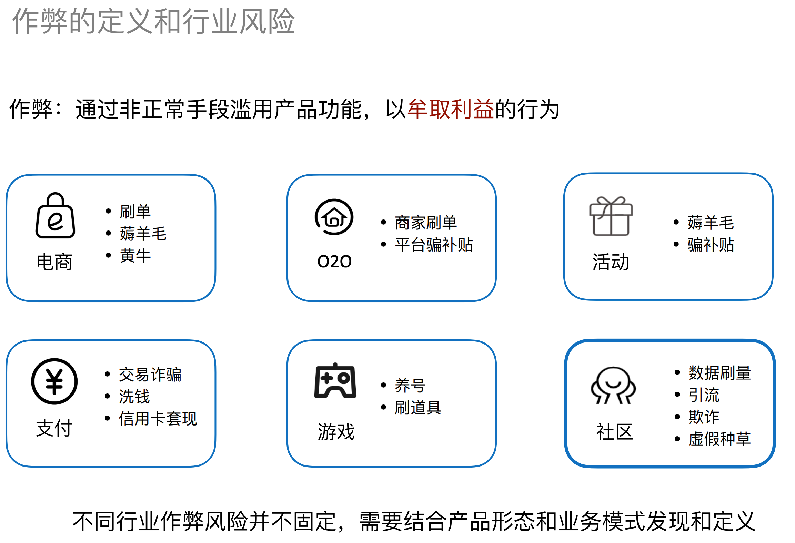
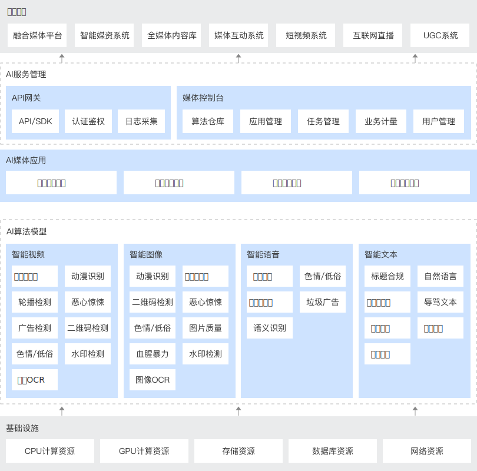
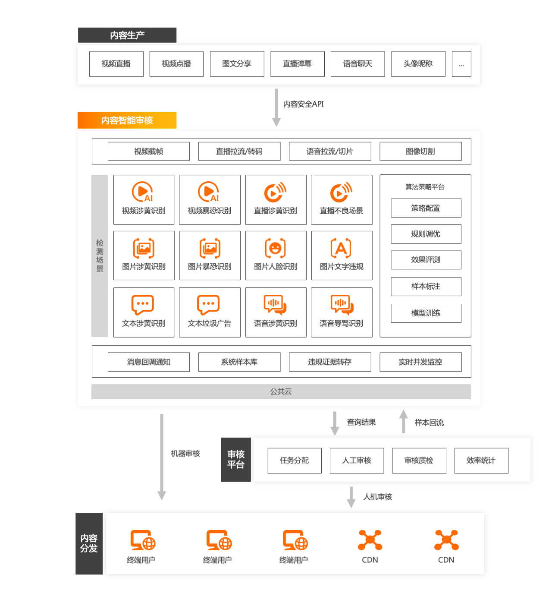
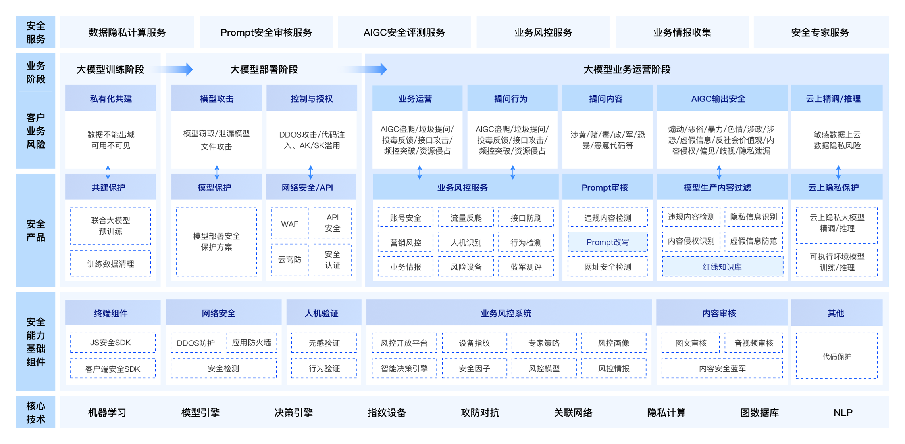

# 内容安全&风控&反作弊

[TOC]

## 算法

#### 观念

- 小伍哥：在团伙挖掘的过程中，介质的质量、边的构建思路、以及业务的抽象能力，比什么算法都重要，盲目地在质量不高的数据上，啥算法都没用； —— **所有算法都依赖于高质量的数据**；

#### Louvain

参考链接：[万物皆网络，万字长文详解社区发现算法Louvain](https://mp.weixin.qq.com/s/jJYL8isTp4ZYEokLEIbrjQ)

###### 什么时候可以使用社区发现算法？

我们需要先确定要解决的业务场景中，存在明显的聚集规律，节点之间形成一定的族群结构，而不是呈现无规律的随机分散；

在进行社区发现之前，一定要进行数据降噪。（**问：如何根据专家经验进行降噪？是否有自动化降噪的方式？**）

###### 模块度

在网络中，紧密连接的区域被称为社群，社群满足“内紧外松”的特点。

模块度用来评估一个社区网络划分好坏的度量方法，含义是社区内节点的连边数与随机情况下的边数之差，公式如下：
$$
Q=\frac{1}{2m}\sum_{i,j}[A_{ij}-\frac{k_ik_j}{2m}]\cdot\delta(c_i, c_j) \\
\delta(u,v)=
	\begin{cases}
		1\ \ ,if\ u=v\\
		0\ \ ,else\\
	\end{cases}
$$
其中，$A_{ij}$ ​表示节点i和节点j之间的边的权重；$k_i=\sum_j A_{ij}$ 表示所有与节点i项链的边的权重之和；$c_i$ 表示节点i所属的社区；$m=\frac{1}{2}\sum_{ij}A_{ij}$​ 表示所有边的权重之和。

可将公式转化为：
$$
Q=\sum_c \left[\frac{\sum_{in}}{2m} -(\frac{\sum_{tot}}{2m})^2 \right]
$$
其中，$\sum_{in}$ 表示社区c内的边的权重之和，$\sum_{tot}$ 表示社区c内的节点相连的边的权重之和。

###### Louvain算法（局部最优解）

算法思路：

1. 将图中的每个节点看成一个独立的社区；

2. 对每个节点i，依次尝试把节点i分配到其每个邻居节点所在的社区，计算分配前与分配后的模块度变化$\Delta Q$，并记录$\Delta Q$ 最大的那个邻居节点，如果$\max(\Delta Q)>0$，则把节点i分配到令$\Delta Q$ 最大的那个邻居节点所在的社区，否则保持不变；
   $$
   \Delta Q = \left[ \frac{\sum_{\text{in}} + k_{i,\text{in}}}{2m} - \left( \frac{\sum_{\text{tot}} + k_i}{2m} \right)^2 \right] - \left[ \frac{\sum_{\text{in}}}{2m} - \left( \frac{\sum_{\text{tot}}}{2m} \right)^2 - \left( \frac{k_i}{2m} \right)^2 \right]
   $$
   其中，$k_{i,in}$ 表示社区c内节点与节点i的边的权重之和（**注意要乘以2**）；

   $\Delta Q$的含义，看成两部分，前面部分表示把节点i加入到社区c后的模块度，后一部分是节点i作为一个独立社区和社区c的模块度。

3. 重复步骤2，直到所有节点的所属社区不再变化；

4. 对图进行压缩，将所有在同一社区的节点压缩成一个新节点；演示图如下
   

5. 重复步骤1，直到整个图的模块度不再变化；

## 风控

### 问题场景

- 

### 现有解决方案

### 问题场景

- 微信搜一搜
- 游戏广告营销推广

| 序号 | 作弊形式       | 作弊手段         | 常见渠道                              | 可能出现的场景                 |
| ---- | -------------- | ---------------- | ------------------------------------- | ------------------------------ |
| 1    | 真机、假用户   | 手机出厂刷ROM    | 预装渠道                              | 按CPA合作，不考核后续          |
|      |                | 植入木马         | 黑客渠道，通过木马控制用户手机        | 按CPA合作，不考核后续          |
|      |                | 安装自动脚本     | 刷量渠道，电脑控制多手机              | 按CPC/CPA/CPS合作，考核后续    |
| 2    | 工作室刷量     | 道具倒卖         | 刷量或公会渠道，一个人控制多台手机    | 按CPC/CPA/CPS合作，考核后续    |
| 3    | 激励众包       | 奖励诱导用户注册 | 积分墙、红包锁屏                      | 按CPA合作，考核要求不高        |
| 4    | 真用户、加广告 | 数据劫持/撞库    | DSP、数据公司，拥有大量用户和标签数据 | 对CVR转化要求不严格            |
|      |                |                  | 路由器、运营商，拥有用户访问网关数据  | 可应用于任何场景，尤其大IP产品 |

- 小红书社区反作弊 —— 数据刷量、内容引流、欺诈、虚假种草等
- 微信安全内容风控
- 微信社交支付——信贷风控

### 现有解决方案

###### 微信搜一搜

联合Query侧、文章侧和账号侧，联合打击黑产。

###### 各厂商云上解决方案

解决方案上基本上大同小异，没有对底层模型的介绍，内容安全检测中，违法内容的数据积累才是关键；

- 腾讯云 - 智能内容安全审核解决方案

- 阿里云 - 违规内容识别解决方案

- 百度安全 - 大模型安全解决方案

### 痛点问题

#### 传统领域的挑战

#### 大模型领域的机遇与挑战

###### 机遇

- 大模型用于内容审核，泛化能力更强，应用更加灵活，可以在一定程度上覆盖初期场景、提效现有场景；

###### 挑战

- 大模型用于内容审核，并没有带来实质上的技术迭代，数据样本的积累仍然是王道；
- 大模型正快速往多模态场景发展，未来的审核不再是单一模态的审核，很可能需要结合多模态的数据一起进行审核，难度将更大；
- 针对大模型的内容安全审核，不仅需要关注传统的涉黄、涉暴等场景，还需要考虑其独特的安全场景——个人隐私、注入攻击、模型幻觉等；
- 文本模型中的多语种特性，增加了内容审核的复杂度；

### 书籍阅读

###### 《风控要略——互联网业务反欺诈之路（马传雷、孙奇、高岳）》

> 整本书看目录的时候觉得会是一本非常不错的书，但是看具体的内容发现还是比较泛泛，甚至前后会存在一些冗余；
>
> 有幸在线下与作者马三老师加了好友，待在这一块有所深入后和马三老师请教一下；

1. 无感认证
   1. 如何快速、通用地在端侧进行埋点？抓取用户行为，也可用于
   2. 论文学习：[You Are How You Touch: User Verification on Smartphones via Tapping Behaviors](https://www.eecis.udel.edu/~hnw/paper/icnp14.pdf)
   3. 业界是否存在一套比较成熟的方案？
2. 风控中枢决策引擎系统
   1. 如何更好地管理风控规则？
   2. 我认为一个好的系统可能需要支持的功能：
      1. 可视化
      2. 可编排
      3. 可进行A/B Test
      4. 适合不同的规则快速上线
      5. 支持同一条规则线上升级
      6. 可溯源
   3. 是否存在一套比较成熟的方案或者平台可借鉴？
3. 风险态势感知
   1. 书中提到了PSI指标，是否还存在其他的一些指标？同运营监控
   2. 如何融入到现有的工作中？
   3. 基于欺诈情报的方法——是否有现有的可借鉴的工作？
   4. 黑白名单如何管理，目前我们是怎么接入的？
4. 风控上不错的企业
   1. 书中提到了：Arkose Labs、Sift、Forter、Shape Security、Okta，是否还有其他？

### 未来解决方案