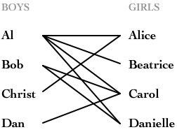

# 刷题笔记

[TOC]

## 基础知识

#### 做题技巧

##### 	关键字

1.  如果题目是**求极值、计数**，可能是动态规划、堆等；
2.  如果题目是**有序**的，可能是双指针；
3.  如果题目要求**连续**，可能是滑动窗口；
4.  如果题目要求**所有可能且要返回路径信息**，可能是回溯；

##### 	限制条件

一般时间复杂度的上限为 1000000，所以可以根据这个值来选择相应的算法：

- 如果 n 在 10 这个级别的，那很可能是阶乘复杂度的算法；


#### 位运算

```python
0 & 1  # 按位与
0 | 1  # 按位或
0 ^ 1  # 按位异或
~1     # 按位取反
1 << 1 # 左移一位
1 >> 1 # 右移一位
```

#### 删除数组元素

```python
nums = [1, 2, 3]
nums.remove(1)  # 根据元素值进行删除
del nums[2]  # 根据元素索引进行删除
```

#### 排序

```python
nums = [1, 3, 2, 5, 4, 0]
# list.sort() 排序
nums.sort()  # 升序排序
nums.sort(reverse=True)  # 降序排序

# sorted() 排序
nums = sorted(nums)  # 升序排序
nums = sorted(nums, reverse=True)  # 降序排序

# 自定义排序 - 降序排序
import functools
def cmp(a, b):
    if b < a:
        return -1
    if a < b:
        return 1
    return 0
nums = sorted(nums, key=functools.cmp_to_key(cmp))
# 自定义排序 - 升序排序
import functools
def cmp(a, b):
    if a < b:
        return -1
    if a > b:
        return 1
    return 0
nums = sorted(nums, key=functools.cmp_to_key(cmp))
```

#### 双向队列

```python
from collections import deque
curstom_deque = deque([1,2,3], maxlen=5)
curstom_deque.append(1)  # 右端插入值
curstom_deque.appendleft(1)  # 左侧插入值
curstom_deque.pop()  # 弹出右侧值
curstom_deque.popleft()  # 弹出左侧值
len(custom_deque)  # 返回长度
```

#### 数组的快速深拷贝

```python
a = [1, 2, 3, 4]
b = a[:]  # b = a 是一个浅拷贝
b = copy.deepcopy(a) # 这个对于链表同样适用
```

#### 无穷大和无穷小

```python
max_inf = float("inf")
min_inf = float("-inf")
```

#### 进制转换

```python
# 十进制可以作为进制转换的跳板
int("0xf", 16)  # 十六进制 -> 十进制
int("101", 2)  # 二进制 -> 十进制
int('17', 8)  # 八进制 -> 十进制

hex(1033)  # 十进制 -> 十六进制

bin(10)  # 十进制 -> 二进制

oct(0b1010)  # 二进制 -> 八进制
oct(11)  # 十进制 -> 八进制
oct(0xf)  # 十六进制 -> 八进制
```

#### 排列组合

```python
import math
from itertools import combinations, permutations
a_list = [1, 2, 3, 4, 5, 6]

# 组合
combinations(a_list, 3)  # type: _iter_
list(combinations(a_list, 3))  # type: list

# 排列
permutations(a_list, 3)  # type: _iter_
list(permutations(a_list, 3))  # type: list

# 直接返回组合的数目
math.comb(len(a_list), 3)  # type: int
```

#### 二分查找

```python
import bisect  # 用于在 升序 的列表中进行二分查找
a = [1, 2, 3, 4, 5]
position_1 = bisect.bisect_left(a, 3)  # position_1 = 2
position_2 = bisect.bisect(a, 3) = bisect.bisect_right(a, 3)  # position_2 = 3
bisect.insort_left(a, 3)  # a = [1, 2, 3<-new, 3, 4, 5]
bisect.insort_right(a, 3)  # a = [1, 2, 3, 3, 3<-new, 4, 5]
# 还可以指定起始和结束的位置
bisect.bisect_left(nums, target, left_bound, right_bound)
```

#### 遍历

```python
# 遍历数组，同时给出索引
a = [3, 4, 5, 6]
for index, num in enumerate(a):
	print(index, num)
# 遍历字典，同时给出key和item
a = {1: 1, 2: 2}
for key, value in a.items():
    print(key, value)
```

#### 优先队列 - 小顶堆

```python
import heapq
heap = [1, 2, 3, 4, 5]
heap_a = [9, 10, 11]
heapq.heapify(heap)  # 将数组转换成小顶堆
heapq.heappush(heap, 6)  # 往堆中插入元素
heapq.heappop(heap)  # 从堆中弹出最小元素
heapq.heappushpop(heap, 7)  # 往堆中插入元素，并弹出堆中最小元素
heapq.heapreplace(heap, 8)  # 先弹出堆中最小元素，然后往堆中插入元素
# 下面是通用的方法，可以不直接作用在堆上，只要是可迭代对象即可
heapq.merge(*iterables, key=None, reverse=False)  # 将多个迭代对象合并，返回一个堆
heapq.nlargest(n, iterable, key=None)  # 从可迭代对象中返回最大的n个元素
heapq.nsmallest(n, iterable, key=None)  # 从可迭代对象中返回最小的n个元素
```

#### 神奇的 Collections

```python
import collections
# 默认值字典
default_map = collections.defaultdict(list)
# 计数器
nums = [1, 2, 3]
default_counter = collections.Counter(nums)  # {1:1, 2:1, 3:1}
```

#### 装饰器缓存 lru_cache

```python
from functolls import lru_cache
# 自动缓存
@lru_cache(None)
def cached_func():
    # ...
```


## 常见题型

> 很多题的知识点都是重合的，所以不能做到完全对应

### 基础题

#### 数学

> 数学题感觉更像是找规律，有时候真的不太有意思

题目链接：

- [剑指 Offer 14- I. 剪绳子](https://leetcode-cn.com/problems/jian-sheng-zi-lcof/)
- [剑指 Offer 14- II. 剪绳子 II](https://leetcode-cn.com/problems/jian-sheng-zi-ii-lcof/)
- [剑指 Offer 43. 1～n 整数中 1 出现的次数](https://leetcode-cn.com/problems/1nzheng-shu-zhong-1chu-xian-de-ci-shu-lcof/)：找规律
- [剑指 Offer 44. 数字序列中某一位的数字](https://leetcode-cn.com/problems/shu-zi-xu-lie-zhong-mou-yi-wei-de-shu-zi-lcof/)：找规律
- [剑指 Offer 62. 圆圈中最后剩下的数字](https://leetcode-cn.com/problems/yuan-quan-zhong-zui-hou-sheng-xia-de-shu-zi-lcof/)：约瑟夫环问题
- [1518. 换酒问题](https://leetcode-cn.com/problems/water-bottles/)

#### 位运算

题目链接：

- [剑指 Offer 15. 二进制中1的个数](https://leetcode-cn.com/problems/er-jin-zhi-zhong-1de-ge-shu-lcof/)
- [剑指 Offer 16. 数值的整数次方](https://leetcode-cn.com/problems/shu-zhi-de-zheng-shu-ci-fang-lcof/)
- [剑指 Offer 56 - I. 数组中数字出现的次数](https://leetcode-cn.com/problems/shu-zu-zhong-shu-zi-chu-xian-de-ci-shu-lcof/)：分组亦或
- [剑指 Offer 56 - II. 数组中数字出现的次数 II](https://leetcode-cn.com/problems/shu-zu-zhong-shu-zi-chu-xian-de-ci-shu-ii-lcof/)：这种题目还是太需要技巧了，知道了技巧还是很好做的；
- [剑指 Offer 65. 不用加减乘除做加法](https://leetcode-cn.com/problems/bu-yong-jia-jian-cheng-chu-zuo-jia-fa-lcof/)：⭐ 这题可太牛了，涉及位运算、python中的数字存储

```python
class Solution:
    def add(self, a:int, b:int) -> int:
        x = 0xffffffff
        a, b = a&x, b&x  # 负数补码
        while b:
            a, b = a^b, ((a&b)<<1) & x
        return a if a <= 0x7fffffff else ~(a^x)
```

- [1318. 或运算的最小翻转次数](https://leetcode-cn.com/problems/minimum-flips-to-make-a-or-b-equal-to-c/)
- [面试题 05.03. 翻转数位](https://leetcode-cn.com/problems/reverse-bits-lcci/)

#### 递归

题目链接：

- [剑指 Offer 10- I. 斐波那契数列](https://leetcode-cn.com/problems/fei-bo-na-qi-shu-lie-lcof/)

#### 哈希表

题目链接：

- [1. 两数之和](https://leetcode-cn.com/problems/two-sum/)：使用 hash table 来做可以实现 $O(N)$ 复杂度算法；
- [41. 缺失的第一个正数](https://leetcode-cn.com/problems/first-missing-positive/)（⭐特殊处理方法，因为题目要求时间复杂度为 $O(n)$ 并且空间复杂度为 $O(1)$，种算法叫做**哈希表**。）
- [剑指 Offer 03. 数组中重复的数字](https://leetcode-cn.com/problems/shu-zu-zhong-zhong-fu-de-shu-zi-lcof/)
- [554. 砖墙](https://leetcode-cn.com/problems/brick-wall/)
- [面试题 16.24. 数对和](https://leetcode-cn.com/problems/pairs-with-sum-lcci/)
- [945. 使数组唯一的最小增量](https://leetcode-cn.com/problems/minimum-increment-to-make-array-unique/)

#### 数组

题目链接：

- [4. 寻找两个正序数组的中位数](https://leetcode-cn.com/problems/median-of-two-sorted-arrays/) ⭐
  - 暴力遍历数组算法，复杂度 $O(M+N)$；
  
  - 使用二分法，复杂度 $O(\log(M+N))$；
  
    抓住中位数的定义，如果两个数组长度和 $M+N$ 为奇数，则找中间一个数；如果两个数组长度和 $M+N$ 为偶数，则找中间两个数；
  
  ```python
  class Solution:
      def findMedianSortedArrays(self, nums1: List[int], nums2: List[int]) -> float:
          length_1 = len(nums1)
          length_2 = len(nums2)
          def getKthElement(K: int) -> int:
              index_1 = index_2 = 0
              while True:
                  if index_1 == length_1:
                      return nums2[index_2 + K - 1]
                  if index_2 == length_2:
                      return nums1[index_1 + K - 1]
                  if K == 1:
                      return min(nums1[index_1], nums2[index_2])
                  index_3 = min(length_1-1, index_1+K//2-1)
                  index_4 = min(length_2-1, index_2+K//2-1)
                  if nums1[index_3] >= nums2[index_4]:  # 移动nums2的指针
                      K -= index_4-index_2+1
                      index_2 = index_4 + 1
                  else:  # 移动nums1的指针
                      K -= index_3-index_1+1
                      index_1 = index_3 + 1
          
          if (length_1 + length_2) % 2:
              return getKthElement((length_1+length_2)//2+1)
          else:
              return (getKthElement((length_1+length_2)//2) + getKthElement((length_1+length_2)//2+1)) / 2.0
  ```
  
- [面试题 16.06. 最小差](https://leetcode-cn.com/problems/smallest-difference-lcci/)

- [17. 电话号码的字母组合](https://leetcode-cn.com/problems/letter-combinations-of-a-phone-number/)

- [1599. 经营摩天轮的最大利润](https://leetcode-cn.com/problems/maximum-profit-of-operating-a-centennial-wheel/)

- [剑指 Offer 11. 旋转数组的最小数字](https://leetcode-cn.com/problems/xuan-zhuan-shu-zu-de-zui-xiao-shu-zi-lcof/)

- [剑指 Offer 04. 二维数组中的查找](https://leetcode-cn.com/problems/er-wei-shu-zu-zhong-de-cha-zhao-lcof/)：二维数组检索 ⭐

- [剑指 Offer 10- II. 青蛙跳台阶问题](https://leetcode-cn.com/problems/qing-wa-tiao-tai-jie-wen-ti-lcof/)

- [剑指 Offer 17. 打印从1到最大的n位数](https://leetcode-cn.com/problems/da-yin-cong-1dao-zui-da-de-nwei-shu-lcof/)

- [剑指 Offer 29. 顺时针打印矩阵](https://leetcode-cn.com/problems/shun-shi-zhen-da-yin-ju-zhen-lcof/)

- [剑指 Offer 39. 数组中出现次数超过一半的数字](https://leetcode-cn.com/problems/shu-zu-zhong-chu-xian-ci-shu-chao-guo-yi-ban-de-shu-zi-lcof/)：直接使用 `collections.Counter()` 解决

- [剑指 Offer 42. 连续子数组的最大和](https://leetcode-cn.com/problems/lian-xu-zi-shu-zu-de-zui-da-he-lcof/)

- [剑指 Offer 53 - I. 在排序数组中查找数字 I](https://leetcode-cn.com/problems/zai-pai-xu-shu-zu-zhong-cha-zhao-shu-zi-lcof/)：反而用 `Counter` 的效率比 `bisect.bisect_left` 的来的高；

- [剑指 Offer 61. 扑克牌中的顺子](https://leetcode-cn.com/problems/bu-ke-pai-zhong-de-shun-zi-lcof/)

- [剑指 Offer 63. 股票的最大利润](https://leetcode-cn.com/problems/gu-piao-de-zui-da-li-run-lcof/)

- [剑指 Offer 66. 构建乘积数组](https://leetcode-cn.com/problems/gou-jian-cheng-ji-shu-zu-lcof/)

- [剑指 Offer 51. 数组中的逆序对](https://leetcode-cn.com/problems/shu-zu-zhong-de-ni-xu-dui-lcof/)：二分法，复杂度为 $O(n\log n)$

- [26. 删除有序数组中的重复项](https://leetcode-cn.com/problems/remove-duplicates-from-sorted-array/)：**原地** 操作

- [1493. 删掉一个元素以后全为 1 的最长子数组](https://leetcode-cn.com/problems/longest-subarray-of-1s-after-deleting-one-element/)：单次遍历

- [487. 最大连续1的个数 II](https://leetcode-cn.com/problems/max-consecutive-ones-ii/)：和上一题一样，单词遍历，保存状态

- [1762. 能看到海景的建筑物](https://leetcode-cn.com/problems/buildings-with-an-ocean-view/)

#### 字符串

题目链接：

- [9. 回文数](https://leetcode-cn.com/problems/palindrome-number/)
- [12. 整数转罗马数字](https://leetcode-cn.com/problems/integer-to-roman/)
- [13. 罗马数字转整数](https://leetcode-cn.com/problems/roman-to-integer/)
- [3. 无重复字符的最长子串](https://leetcode-cn.com/problems/longest-substring-without-repeating-characters/)
- [7. 整数反转](https://leetcode-cn.com/problems/reverse-integer/)：直接用字符串来处理即可
- [14. 最长公共前缀](https://leetcode-cn.com/problems/longest-common-prefix/)
- [20. 有效的括号](https://leetcode-cn.com/problems/valid-parentheses/)
- [22. 括号生成](https://leetcode-cn.com/problems/generate-parentheses/)
- [166. 分数到小数](https://leetcode-cn.com/problems/fraction-to-recurring-decimal/)
- [ 替换空格](https://leetcode-cn.com/problems/ti-huan-kong-ge-lcof)
- [剑指 Offer 50. 第一个只出现一次的字符](https://leetcode-cn.com/problems/di-yi-ge-zhi-chu-xian-yi-ci-de-zi-fu-lcof/)
- [剑指 Offer 58 - I. 翻转单词顺序](https://leetcode-cn.com/problems/fan-zhuan-dan-ci-shun-xu-lcof/)
- [剑指 Offer 58 - II. 左旋转字符串](https://leetcode-cn.com/problems/zuo-xuan-zhuan-zi-fu-chuan-lcof/)
- [1209. 删除字符串中的所有相邻重复项 II](https://leetcode-cn.com/problems/remove-all-adjacent-duplicates-in-string-ii/)：字符串单次遍历
- [面试题 01.06. 字符串压缩](https://leetcode-cn.com/problems/compress-string-lcci/)
- [472. 连接词](https://leetcode-cn.com/problems/concatenated-words/)：字符串 + DFS

#### 排列组合

题目链接：

- [1643. 第 K 条最小指令](https://leetcode-cn.com/problems/kth-smallest-instructions/)（⭐关键在于从高位开始确定，用组合直接确定低位出现的个数）
- [剑指 Offer 38. 字符串的排列](https://leetcode-cn.com/problems/zi-fu-chuan-de-pai-lie-lcof/)：直接使用 `itertools.permutations()` 解决

---


### 栈

题目链接：

- [895. 最大频率栈](https://leetcode-cn.com/problems/maximum-frequency-stack/)：⭐读题必须要仔细，非常 nice 的一个题目，考察的是多级的栈

```python
class FreqStack:
	def __init__(self):
        self.number2fre = collections.Counter()
        self.fre2number = collections.defaultdict(list)
        self.max_fre = 0
    def push(self, val: int):
        self.number2fre[val] += 1
        cur_fre = self.number2fre[val]
        self.fre2number[cur_fre].append(val)
        if cur_fre > self.max_fre:
            self.max_fre = cur_fre
    def pop(self) -> int:
    	result = self.fre2number[self.max_fre].pop()
        self.number2fre[result] -= 1
        if not self.fre2number[self.max_fre]:
            self.max_fre -= 1
        return result
```

- [剑指 Offer 09. 用两个栈实现队列](https://leetcode-cn.com/problems/yong-liang-ge-zhan-shi-xian-dui-lie-lcof/)：不知道这个题目想干嘛
- [剑指 Offer 30. 包含min函数的栈](https://leetcode-cn.com/problems/bao-han-minhan-shu-de-zhan-lcof/)：⭐这边用到了一个辅助栈，非常有意思

---


### 优先遍历

#### 深度优先遍历

题目链接：

- [40. 组合总和 II](https://leetcode-cn.com/problems/combination-sum-ii/) ⭐

  这题拿到手的时候，没啥思路，就去用了暴力求解，看了官方的解释才发现非常得巧妙；

  做这题之前，得转换一个思路，我们想一个换零钱的问题，那我可以从大的往小的换（而且我手上要有可以置换的零钱）。这题也是一样，统计一个各个整数的频率（对应着零钱的面值和数量），然后开始兑换“零钱”（只不过实现的时候是从小到大兑换的），采用的是深度优先搜索算法；

```python
class Solution:
	def combinationSum2(self, candidates: List[int], target: int) -> List[List[int]]:
        count_dict = collections.Counter(candidates)
        freq_list = sorted(count_dict.items())
        
        def dfs(pos: int, rest: int):  # dfs
            nonlocal sequence
            if rest == 0:
                result.append(sequence)
                return
            if pos >= len(freq_list) or rest < freq_list[pos][0]:
                return
            
            # 一个都不要
            dfs(pos+1, rest)
            
            # 要 n 个
            available_num = min(rest//freq_list[pos][0], freq_list[pos][1])
            for n in range(1, available_num+1):
                sequence.append(freq_list[pos][0])
                dfs(pos+1, rest-n*freq_list[pos][0])
            sequence = sequence[:-available_num]
        
        sequence = []
        result = []
        dfs(0, target)
        return result
```

- [剑指 Offer 55 - II. 平衡二叉树](https://leetcode-cn.com/problems/ping-heng-er-cha-shu-lcof/)
- [面试题 08.12. 八皇后](https://leetcode-cn.com/problems/eight-queens-lcci/)：深度优先搜索 + 回溯

#### 广度优先遍历

题目链接：

- [剑指 Offer 12. 矩阵中的路径](https://leetcode-cn.com/problems/ju-zhen-zhong-de-lu-jing-lcof/)
- [剑指 Offer 13. 机器人的运动范围](https://leetcode-cn.com/problems/ji-qi-ren-de-yun-dong-fan-wei-lcof/)
- [1306. 跳跃游戏 III](https://leetcode-cn.com/problems/jump-game-iii/)

---


### 优先队列

题目链接：

- [剑指 Offer 59 - I. 滑动窗口的最大值](https://leetcode-cn.com/problems/hua-dong-chuang-kou-de-zui-da-zhi-lcof/)
- [剑指 Offer 59 - II. 队列的最大值](https://leetcode-cn.com/problems/dui-lie-de-zui-da-zhi-lcof/)

----


### 链表

> 链表的题目很多和双指针交叉

参考链接：https://leetcode-solution-leetcode-pp.gitbook.io/leetcode-solution/thinkings/linked-list

链表容易出错的地方：

- 出现了环，造成死循环；
- 分不清边界，导致边界条件出错；
- 搞不懂递归怎么做；

技巧：

- “**先穿再排后判空**”
- 记得自己多画图来求解，熟能生巧
- 结束的地方记得放 $\color{red}None$
- <font color="blue">【**虚拟指针法**】</font>可以多创建了一个 $Node$ 节点作为头节点，这样可以省很多麻烦事
- 如果没有创建新的 $Node$ 节点，而是直接用的 $head$ ，<font color="red">记得要往后移</font>
- 有时候不能 AC 可能是因为忘记把一些指针 置 $\color{red}None$ 了

常见题型：

- 指针的修改
- 链表的拼接

题目链接：

- [21. 合并两个有序链表](https://leetcode-cn.com/problems/merge-two-sorted-lists/submissions/)

- [82. 删除排序链表中的重复元素 Ⅱ](https://leetcode-cn.com/problems/remove-duplicates-from-sorted-list-ii/)

- [83. 删除排序链表中的重复元素](https://leetcode-cn.com/problems/remove-duplicates-from-sorted-list/)

- [86. 分隔链表](https://leetcode-cn.com/problems/partition-list/)

- [92. 翻转链表Ⅱ](https://leetcode-cn.com/problems/reverse-linked-list-ii/)

- [138. 复制带随机指针的链表](https://leetcode-cn.com/problems/copy-list-with-random-pointer/)

- [143. 重排列表](https://leetcode-cn.com/problems/reorder-list/)

- [148. 排序链表](https://leetcode-cn.com/problems/sort-list/)（⭐ 归并排序，相对而言会更加复杂）

  ```python
  # 自底向上的归并排序，时间复杂度 O(nlogn)，空间复杂度 O(1)
  # 什么时候停止？ 当子链长度大于等于总链的时候结束
  def sortList(head: ListNode) -> ListNode:
      if not head:
          return None
      length = 0
      node = head
      while node:
          length += 1
          node = node.next
      
      _sub_length_ = 1
      result = tail = ListNode(0)  # 新建一个节点来做头节点——减少麻烦事
      tail.next = head
      while _sub_length_ < length:  # 判断子链长度，对应的最好先把 `_sub_length_ <<= 1` 写了
          head = result.next
          tail = result
          
          while head:  # 开始有序子链的合并
              # 获取左子链
              left_head = left_tail = head
              _length_ = 1
              head = head.next
              while head and _length_ < _sub_length_:
                  left_tail.next = head
                  left_tail = left_tail.next
                  head = head.next
                  _length_ += 1
              left_tail.next = None  # 记得置空，因为后面需要合并
              
              # 获取右子链
              right_head = right_tail = head
              if head:  # 记得要判断是否为空
                  head = head.next
                  _length_ = 1
                  while head and _length_ < _sub_length_:
                      right_tail.next = head
                      right_tail = right_tail.next
                      head = head.next
                      _length_ += 1
                  right_tail.next = None
              
              # 合并两个子链
              if not right_head:
                  tail.next = left_head
              else:
                  while left_head and right_head:
                      if left_head.val <= right_head.val:
                          tail.next = left_head
                          tail = tail.next
                          left_head = left_head.next
                      else:
                          tail.next = right_head
                          tail = tail.next
                          right_head = right_head.next
                  if left_head:
                      tail.next = left_head
                      tail = left_tail
                  if right_head:
                      tail.next = right_head
                      tail = right_tail
          
          _sub_length_ <<= 1
      return result.next
  ```

- [206. 翻转链表](https://leetcode-cn.com/problems/reverse-linked-list/)

- [234. 回文链表](https://leetcode-cn.com/problems/palindrome-linked-list/)

- [剑指 Offer 22. 链表中倒数第k个节点](https://leetcode-cn.com/problems/lian-biao-zhong-dao-shu-di-kge-jie-dian-lcof/)

- [面试题 02.03. 删除中间节点](https://leetcode-cn.com/problems/delete-middle-node-lcci/) （<u>这个题出的有问题</u>）

- [面试题 02.02. 返回倒数第 k 个节点](https://leetcode-cn.com/problems/kth-node-from-end-of-list-lcci/)

- [430. 扁平化多级双向链表](https://leetcode-cn.com/problems/flatten-a-multilevel-doubly-linked-list/) （子指针不置空不行，惊了）

- [61. 旋转链表](https://leetcode-cn.com/problems/rotate-list/)

- [剑指 Offer 35. 复杂链表的复制](https://leetcode-cn.com/problems/fu-za-lian-biao-de-fu-zhi-lcof/) （⭐ 题目虽然不难，但是降低空间复杂度的方法很巧妙）

  ```python
  # 时间复杂度 O(n)，空间复杂度 O(1)
  def copyRandomList(head: Node) -> Node:
      # 创建新的节点
      node = head
      while node:
          new_node = Node(node.val)
          new_node.next = node.next
          node.next = new_node
          node = new_node.next
      # 修改random指针
      node = head
      while node:
          if node.random:  # 这里需要注意node.random为空
              node.next.random = node.random.next
          node = node.next.next
      # 分离两个链表
      link_a = tail_a = Node(0)
      link_b = tail_b = Node(1)
      node = head
      while node:
          tail_a.next = node
          tail_b.next = node.next
          tail_a = tail_a.next
          tail_b = tail_b.next
          node = node.next.next
      return link_b.next
  ```

- [445. 两数相加 II](https://leetcode-cn.com/problems/add-two-numbers-ii/) （这道题不是很美）

- [24. 两两交换链表中的节点](https://leetcode-cn.com/problems/swap-nodes-in-pairs/) （拆分以后合并，思路清晰）

- [109. 有序链表转换二叉搜索树](https://leetcode-cn.com/problems/convert-sorted-list-to-binary-search-tree/) （⭐ 用递归来做，找准位置，注意置空）

  ```python
  # 基本上双百
  def sortedListToBST(head: ListNode) -> TreeNode:
      # 获取链表长度
      length = 0
      node = head
      while node:
          node = node.next
          length += 1
      
      def listToBST(head: ListNode, length: int) -> TreeNode:
          if length == 0:
              return None
          if length == 1:
              return TreeNode(head.val)
      	center_index = length // 2
          left_length = center_index
          right_length = length - left_length - 1
          # 左链
          left_head = left_tail = head
          _index_ = 0
          while _index_ < center_index:
              _index_ += 1
              left_tail = head
              head = head.next
          left_tail.next = None  # 注意置空
          # 根节点
          center_node = TreeNode(head.val)
          # 右链
          right_head = head.next
          # 生成子树
          center_node.left = listToBST(left_head, left_length)
          center_node.right = listToBST(right_head, right_length)
          return center_node
      
      return listToBST(head, length)
  ```
  
- [2. 两数相加](https://leetcode-cn.com/problems/add-two-numbers/)

- [剑指 Offer 06. 从尾到头打印链表](https://leetcode-cn.com/problems/cong-wei-dao-tou-da-yin-lian-biao-lcof/)

- [剑指 Offer 18. 删除链表的节点](https://leetcode-cn.com/problems/shan-chu-lian-biao-de-jie-dian-lcof/)

- [剑指 Offer 24. 反转链表](https://leetcode-cn.com/problems/fan-zhuan-lian-biao-lcof/)

- [剑指 Offer 25. 合并两个排序的链表](https://leetcode-cn.com/problems/he-bing-liang-ge-pai-xu-de-lian-biao-lcof/)

- [剑指 Offer 35. 复杂链表的复制](https://leetcode-cn.com/problems/fu-za-lian-biao-de-fu-zhi-lcof/)：链表的复制，可以借助原有的指针进行重定向 ⭐

- [剑指 Offer 36. 二叉搜索树与双向链表](https://leetcode-cn.com/problems/er-cha-sou-suo-shu-yu-shuang-xiang-lian-biao-lcof/)：二叉搜索树的中序遍历即为一个有序数组，然后利用分治的思想解题 ⭐

- 

---


### 双指针

参考链接：https://github.com/azl397985856/leetcode/blob/master/91/two-pointers.md

#### 	快慢指针

代码模板：

```python
# Definition for singly-linked list.
# class ListNode:
#     def __init__(self, x):
#         self.val = x
#         self.next = None
def hasCycle(head: ListNode) -> bool:
	if not head or not head.next:
        return False
    slow = head
    fast = head.next
    while slow != fast:
    	if not fast or not fast.next:
            return False
        slow = slow.next
        fast = fast.next.next
    return True
```

⭐ 快慢指针定位环入口的原理：

假设环长为 $L$ ，从`起点`到 `环的入口`的步数为 $a$ ，从`环的入口`到`相遇点`的步数为 $b$，从`相遇点`到`环的入口`的步数为 $c$，则有 $b+c=L$ 。一方面，快指针走过的路程是慢指针的两倍，所以我们假设慢指针走了 $a+b+gL$ 步，那么快指针则走了 $2(a+b+gL)$ 步。另一方面，两个指针相遇了，即快指针比慢指针多走了若干圈，因此快指针的步数还可以表示为 $a+b+kL$ 。联立等式，可以得到 $a+b=(k-2g)L$，转换一下得到：
$$
a=(k-2g)L-b=(k-2g-1)L+(L-b)=(k-2g-1)L+c
$$
结论：**将慢指针设置到 `起点`，走 $a$ 步后，快指针也同样会到达 `环的入口`**。


快慢指针算法，常用的两个场景：

-   <font color="blue">【类型一】</font>判断链表是否有环；

-   <font color="blue">【类型二】</font>读写指针；

题目链接：

-   [141. 环形链表](https://leetcode-cn.com/problems/linked-list-cycle/) （<font color="blue">【类型一】</font>）
-   [142. 环形链表](https://leetcode-cn.com/problems/linked-list-cycle-ii/) （<font color="blue">【类型一】</font>）
-   [287. 寻找重复数](https://leetcode-cn.com/problems/find-the-duplicate-number/) （<font color="blue">【类型一】</font>要将数组的值转换为索引的思想，在找到环后，确定环的入口即为重复的数字）
-   [27. 移除元素](https://leetcode-cn.com/problems/remove-element/) （<font color="blue">【类型二】</font>）
-   [203. 移动链表元素](https://leetcode-cn.com/problems/remove-linked-list-elements/) （<font color="blue">【类型二】</font>）
-   [26. 删除排序数组中的重复项](https://leetcode-cn.com/problems/remove-duplicates-from-sorted-array/) （<font color="blue">【类型二】</font>）
-   [80. 删除排序数组中的重复项 Ⅱ](https://leetcode-cn.com/problems/remove-duplicates-from-sorted-array-ii/) （<font color="blue">【类型二】</font>不重复超过两次的条件比较恶心，需要多处理一下）
-   [剑指 Offer 52. 两个链表的第一个公共节点](https://leetcode-cn.com/problems/liang-ge-lian-biao-de-di-yi-ge-gong-gong-jie-dian-lcof/)：<font color="blue">【类型一】</font> ⭐ 这题虽然难度为简单，但是其实还是需要转换思考一下的；
-   [面试题 02.06. 回文链表](https://leetcode-cn.com/problems/palindrome-linked-list-lcci/)

#### 左右端点指针

> 这里我觉得，其实左右端点指针和固定间距指针是基本上相似的，可以放在一起来看。

代码模板：

```python
left, right = 0, length-1
while left < right:
    if ...:  # find condition
        return result
    if ...:  # modify condition 1
        left += 1
    elif ...:  # modify condition 2
		right += 1
return result
```

左右断点指针算法，常用的三个场景：

- <font color="blue">【类型一】</font>二分查找
- <font color="blue">【类型二】</font>暴力枚举中“从大到小枚举”（剪枝）
- <font color="blue">【类型三】</font>有序数组

题目链接：

- [16. 最接近的三数之和](https://leetcode-cn.com/problems/3sum-closest/)
- [713. 乘积小于K的子数组](https://leetcode-cn.com/problems/subarray-product-less-than-k/)
- [977. 有序数组的平方](https://leetcode-cn.com/problems/squares-of-a-sorted-array/)
- [33. 搜索旋转排序数组](https://leetcode-cn.com/problems/search-in-rotated-sorted-array/)（【类型一】合理对待旋转这个问题，抓住二分查找必须是有序的这个点）
- [875. 爱吃香蕉的珂珂](https://leetcode-cn.com/problems/koko-eating-bananas/)（【类型一】从题目的数量级来看，应该思考使用 $O(n\log h)$ 的算法 ）
- [881. 救生艇](https://leetcode-cn.com/problems/boats-to-save-people/)（排序以后左右指针，贪婪思想）
- [719. 找出第 k 小的距离对](https://leetcode-cn.com/problems/find-k-th-smallest-pair-distance/) （【类型一】二分查找 ⭐）

```python
class Solution:
    def smallestDistancePair(self, nums: List[int], k: int) -> int:
        def possible(num) -> bool:
            count = left = 0
            for right, x in enumerate(nums):
                while x - nums[left] > num:
                    left += 1
                count += right - left
            return count >= k
        nums.sort()
        lo = 0
        hi = nums[-1] - nums[0]
        while lo < hi:
            mid = (lo + hi) // 2
            if possible(mid):
                hi = mid
            else:
                lo = mid +1
        return lo
```

- [LCP 12. 小张刷题计划](https://leetcode-cn.com/problems/xiao-zhang-shua-ti-ji-hua/) （【类型一】二分查找 ⭐）

```python
# 怎么想到用二分查找来做的：大概是因为719题让我有点印象，虽然过了一段时间已经差不多忘了，但是看到以后感觉可以用二分查找来做
class Solution:
    def minTime(self, time: List[int], m: int) -> int:
        # 提早返回
        time_length = len(time)
        if time_length <= m:
            return 0
        
        def possible(t: int) -> bool:  # 符合贪婪算法，每天都想做尽可能多的题
            day = 1
            tmp_time = 0
            tmp_max = 0
            for _index_ in range(time_length):
                if time[_index_] > tmp_max:
                    if tmp_max + tmp_time > t:
                        day += 1
                        tmp_max = time[_index_]
                        tmp_time = 0
                    else:
                        tmp_time += tmp_max
                        tmp_max = time[_index_]
                else:
                    if time[_index_] + tmp_time > t:
                        day += 1
                        tmp_max = time[_index_]
                        tmp_time = 0
                    else:
                        tmp_time += time[_index_]
            return day <= m
        
        left, right = min(time), sum(time)
        while left < right:
            mid = (left+right) // 2
            if possible(mid):
                right = mid
            else:
                left = mid+1
        return left
```

- [15. 三数之和](https://leetcode-cn.com/problems/3sum/)

- [剑指 Offer 48. 最长不含重复字符的子字符串](https://leetcode-cn.com/problems/zui-chang-bu-han-zhong-fu-zi-fu-de-zi-zi-fu-chuan-lcof/)

- [剑指 Offer 21. 调整数组顺序使奇数位于偶数前面](https://leetcode-cn.com/problems/diao-zheng-shu-zu-shun-xu-shi-qi-shu-wei-yu-ou-shu-qian-mian-lcof/)

- [剑指 Offer 53 - II. 0～n-1中缺失的数字](https://leetcode-cn.com/problems/que-shi-de-shu-zi-lcof/)：二分法

- [剑指 Offer 57. 和为s的两个数字](https://leetcode-cn.com/problems/he-wei-sde-liang-ge-shu-zi-lcof/)

- [剑指 Offer 57 - II. 和为s的连续正数序列](https://leetcode-cn.com/problems/he-wei-sde-lian-xu-zheng-shu-xu-lie-lcof/)

- [1060. 有序数组中的缺失元素](https://leetcode-cn.com/problems/missing-element-in-sorted-array/)：二分法查找

- [1723. 完成所有工作的最短时间](https://leetcode-cn.com/problems/find-minimum-time-to-finish-all-jobs/)：二分法查找+深度优先搜索+剪枝

  思想：二分法查找 limit 时间内工人能否将全部工作做完。这个过程 **剪枝是关键**。

```python
class Solution:
	def minimumTimeRequired(self, jobs: List[int], k: int) -> int:
        def check(limit):
            arr = sorted(jobs)  # 剪枝：大的工作先拿出来试
            person_jobs = [0, ] * k
            if backTrace(arr, person_jobs, limit):
                return True
            return False
        
        def backTrace(arr, person_jobs, limit):
            if not arr:  # 分完了，直接返回
                return True
            value = arr.pop()
            for i in range(k):
                person_jobs[i] += value
                if person_jobs[i] <= limit and backTrace(arr, person_jobs, limit):
                    return True
            	person_jobs[i] -= value
                if person_jobs[i] == 0:  # 剪枝：如果这个人经过各种分配尝试后，都没有成功，说明该limit是无法实现的
                    break
            arr.append(value)
            return False
        
        l, r = max(jobs), sum(jobs)
        while l < r:
            mid = (l+r) // 2
            if check(mid):
                r = mid
            else:
                l = mid+1
        return l
```

- [704. 二分查找](https://leetcode-cn.com/problems/binary-search/)
- [278. 第一个错误的版本](https://leetcode-cn.com/problems/first-bad-version/)
- [35. 搜索插入位置](https://leetcode-cn.com/problems/search-insert-position/)

#### 固定间距指针

代码模板：

```python
left, right = 0, k
while right < end:
    ... ... # 自定义逻辑
    left += 1
    right += 1
return result
```

固定间距指针算法，常用的三个场景：

- 一次遍历（One Pass）求链表的中点；
- 【类型二】一次遍历（One Pass）求链表的倒数第 k 个元素；
- 【类型三】固定窗口大小 或者 固定窗口条件的滑动窗口；

题目链接：

- [1456. 定长子串中原因的最大数目](https://leetcode-cn.com/problems/maximum-number-of-vowels-in-a-substring-of-given-length/) （【类型三】）
- [剑指 Offer 59 - Ⅱ. 队列的最大值](https://leetcode-cn.com/problems/dui-lie-de-zui-da-zhi-lcof/) （【类型三】维护一个最大值的递减序列窗口）
- [1658. 将x减到0的最小操作数](https://leetcode-cn.com/problems/minimum-operations-to-reduce-x-to-zero/) （【类型三】维护一个累和窗口）
- [19. 删除链表的倒数第 N 个结点](https://leetcode-cn.com/problems/remove-nth-node-from-end-of-list/)（【类型二】删除倒数第 K 个元素⭐）
- [25. K 个一组翻转链表](https://leetcode-cn.com/problems/reverse-nodes-in-k-group/)（【类型三】）：这里存在一个误区

```python
# 交换值可以用如下
a, b = b, a
# 如果想执行链表的翻转, 本身left_node.next = right_node
pre_node, pre_node.next = left_node, right_node  # 你会发现这样操作以后还是 left_node.next = right_node
# 正确操作
pre_node.next = right_node
pre_node = left_node
```

- [剑指 Offer 22. 链表中倒数第k个节点](https://leetcode-cn.com/problems/lian-biao-zhong-dao-shu-di-kge-jie-dian-lcof/)
- [19. 删除链表的倒数第 N 个结点](https://leetcode-cn.com/problems/remove-nth-node-from-end-of-list/)
- [1721. 交换链表中的节点](https://leetcode-cn.com/problems/swapping-nodes-in-a-linked-list/)

---


### 树

#### 基础

参考链接：https://leetcode-solution-leetcode-pp.gitbook.io/leetcode-solution/thinkings/tree

常见题目类型：

- 搜索类：搜索节点、搜索路径等；
- 构建类：
  - 普通二叉树的构建：
    - 给定两种DFS的遍历结果，还原二叉树
    - 根据BFS的遍历结果，还原二叉树
    - 给定条件，构建二叉树
  - 二叉搜索树的构建：
    - 根据二叉搜索树的前序遍历，还原二叉搜索树
- 修改类：
  - 题目要求的修改：例如节点的增删等；
  - 算法需要，自己修改；

相关概念：

- **二叉搜索树** 的中序遍历的结果是一个有序数组；

技巧：

- DFS 的递归形参最好写成 $root$ ；

- 一般的题目都可以用单递归来求解，但当遇到**“任意节点开始... ...”** 或 **"所有... ..."** 这样的措辞时，就可以考虑双递归了；

  双递归：外层递归用来处理任意节点逻辑，而内层递归来处理 “... ...” 逻辑；

- <font color="blue">**【虚拟指针法】**</font>和链表专题一样，在树中也可以通过创建一个新的节点，从而减少很多麻烦事情；

- 树的题目大多都是通过递归来实现的，而在递归的过程中，最好在形参中带有前一轮的信息；

- 如果是和路径相关的题目，都可以考虑一下后续遍历的方法；

- 看到二叉搜索树的时候，都应该首先考虑中序遍历的方法；

- 每个题目中的路径的定义可能都不一样，做题需要仔细；

- 一般而言，用DFS的方法来表示一个树更加简洁（在树的序列化和反序列化的过程中）；

#### 双色标记法 - 二叉树的迭代遍历

参考链接：https://leetcode-solution-leetcode-pp.gitbook.io/leetcode-solution/thinkings/binary-tree-traversal

二叉树的前序遍历用迭代的方法很好实现，因为根节点只需要放入队列一次。但是中序遍历和后续遍历会比较麻烦一些，因为根节点需要放入队列两次，这里可以用双色标记法来实现二叉树的迭代遍历，本质上是在队列中保存一个状态，用来记录当前节点是第几次进入。

```python
# 中序遍历
class inorderTraversal(root: TreeNode) -> List[int]:
    white, gray = 0, 1
    stack = [(white, root)]
    result = []
    while queue:
        color, root = queue.popleft()
        if not root:
            continue
        if color == white:  # white
            stack.append((white, root.right))
            stack.append((gray, root))  # 只需要修改这个的位置就能很快地实现后续遍历
            stack.append((white, root.left))
    	else:  # gray
            result.append(root.val)
    return result
```

#### *Morris 遍历二叉树

参考链接：https://www.cnblogs.com/anniekim/archive/2013/06/15/morristraversal.html

在一般情况下，用递归或者迭代的方式来遍历树就可以，Morris 遍历主要是在保证**时间复杂度为 $O(n)$** 的情况下将**空间复杂度降到了** $O(1)$，可以作为遍历的补充来学习一下。下面给出 中序遍历和前序遍历 的模板，后续遍历比较麻烦，放弃治疗。

```python
# 中序遍历
def inorderMorrisTraversal(root: TreeNode) -> List:
    res_list = []
    while root:
        if root.left is None:
            res_list.append(root.val)
            root = root.right
        else:
            prev = root.left
            while prev.right is not None and prev.right != root:
                prev = prev.right
            
            if prev.right is None:
                prev.right = root
                root = root.left
            else:
                prev.right = None
                res_list.append(root.val)
                root = root.right
    return res_list
# 前序遍历
def preorderMorrisTraversal(root: TreeNode) -> List:
    res_list = []
    while root:
        if root.left is None:
            res_list.append(root.val)
            root = root.right
        else:
            prev = root.left
            while prev.right is not None and prev.right != root:
                prev = prev.right
            
            if prev.right is None:
                res_list.append(root.val)
                prev.right = root
                root = root.left
            else:
                prev.right = None
                root = root.right
    return res_list
```

#### 题目链接

- [110. 平衡二叉树](https://leetcode-cn.com/problems/balanced-binary-tree/) （直接上递归，可以通过提早结束来提高运行效率，可以改造一下返回值来稍微提高内存利用率）

- [面试题 04.03. 特定深度节点链表](https://leetcode-cn.com/problems/list-of-depth-lcci/) （层次遍历）

- [589. N叉树的前序遍历](https://leetcode-cn.com/problems/n-ary-tree-preorder-traversal/) （经典前序遍历）

- [366. 寻找二叉树的叶子节点](https://leetcode-cn.com/problems/find-leaves-of-binary-tree/) （考察树的高度）

- [剑指 Offer 32 - II. 从上到下打印二叉树 II](https://leetcode-cn.com/problems/cong-shang-dao-xia-da-yin-er-cha-shu-ii-lcof/) （层次遍历）

- [549. 二叉树中最长的连续序列](https://leetcode-cn.com/problems/binary-tree-longest-consecutive-sequence-ii/) （⭐ 这题的难度我觉得可以称得上是难！从题目的意思来说，是从“**任意点开始的最长的连续路径**”，我就想到了 **双递归方法** ，外层递归来遍历每一个树的节点（作为中间节点），内层递归来求得当子树满足连续这个条件时的最长路径）

  ```python
  class Solution:
      def longestConsecutive(self, root: TreeNode) -> int:
          result = 0
          if not root:  # 首先判空，返回一下
              return result
          
          def inner_dfs(root: TreeNode, increase: int) -> int:  # 内层递归，在子树满足连续的情况下，求“单侧”最长连续长度。这里需要注意，只要在外层迭代中我才考虑“左子树 - 根节点- 右子树”这样的情况，而内层递归中只考虑单侧的最长连续长度。
              length = 1
              if root.left and root.left.val - root.val == increase:
                  length = max(length, inner_dfs(root.left, increase) + 1)
              if root.right and root.right.val - root.val == increase:
                  length = max(length, inner_dfs(root.right, increase) + 1)
              return length
              # pass  写的时候我先把这一块留空，先写外层逻辑，再来写内层逻辑
          
          queue = collections.deque([root])  # 外层，我很自然地用了迭代，没有用递归
          while queue:
              root = queue.popleft()
              if root.left:  # 左子树存在
                  queue.append(root.left)
                  if abs(root.left.val - root.val) == 1:  # 左子树满足连续条件
                      left_increase = root.left.val - root.val  # 利用 left_increase 来记录是升序还是降序
                      left_length = inner_dfs(root.left, left_increase)  # 左子树连续的最长长度
                  else:
                      left_increase = 0
                      left_length = 0
              else:
                  left_increase = 0
                  left_length = 0
              if root.right:  # 右子树存在
                  queue.append(root.right)
                  if abs(root.right.val - root.val) == 1:  # 右子树满足连续条件
                      right_increase = root.right.val - root.val  # 利用 right_increase 来记录升序还是降序
                      right_length = inner_dfs(root.right, right_increase)  # 右子树连续的最长长度
                  else:
                      right_increase = 0
                      right_length = 0
              else:
                  right_increase = 0
                  right_length = 0
              
              if left_increase * right_increase == -1:  # 利用两者的乘积来判断能否组成“左子树 - 根节点 - 右子树”这样的情况
                  result = max(result, left_length + right_length + 1)
              else:
                  result = max(result, max(left_length, right_length) + 1)
          return result
  ```

- [998. 最大二叉树 II](https://leetcode-cn.com/problems/maximum-binary-tree-ii/) （⭐ 这题题目很难读懂，需要多花一些时间在题目的理解上面，读懂以下我觉得是个非常棒的题目，能够用到上面树的一些技巧）

  ```python
  """
  首先，是题目的含义（其实是这个最大树构建的问题）：找到数组中最大的值，作为根节点；左边的子数组作为左子树，右边的子数组作为右子树；递归构建这个最大树；
  思考了一下，有两种解法：
  1. 遍历树，得到数组，把插入值放入数组，再构建树；这个方法显然很麻烦。
  2. 仔细思考一下，其实在数组末尾插入一个值，构建树的时候只会影响右子树，而对于左子树是没有任何影响的。
  """
  class Solution:
      def insertIntoMaxTree(self, root: TreeNode, val: int) -> TreeNode:
          root = TreeNode(float('inf'), None, root)  # 创建一个虚拟根节点，这样就不用处理根节点是否存在的问题，而这个虚拟节点的值要设置成无穷大，不然对后面的逻辑有影响
          node = root
          while node:
              if node.right is None:  # 右子树是空的，直接插入就行了
                  node.right = TreeNode(val)
                  break
              if val > node.right.val:   # val大于右子树的最大值，说明在右子树之上要插入新的节点
                  node.right = TreeNode(val, node.right，None)
                  break
              node = node.right  # 往右走
          return root.right
  # 代码其实很简单
  ```

- [94. 二叉树的中序遍历](https://leetcode-cn.com/problems/binary-tree-inorder-traversal/) 

- [897. 递增顺序查找树](https://leetcode-cn.com/problems/increasing-order-search-tree/) （⭐ 虽然是个简单题，但是还是很容易出错）

  ```python
  class Solution:
      def increasingBST(self, root: TreeNode) -> TreeNode:
          invented_root = TreeNode(0)  # 创建虚拟根节点
          def inorder(root: TreeNode, tail: TreeNode) -> TreeNode:
              if not root:   # 判空
                  return tail
          	tail = inorder(root.left, tail)
              tail.right = root
              tail = tail.right
              tail.left = None  # 很关键，做题时一定要注意把没有用的指针置空一下
              return inorder(root.right, tail)
          inorder(root, invented_root)
          return invented_root.right
  ```

- [剑指 Offer 54. 二叉搜索树的第k大节点](https://leetcode-cn.com/problems/er-cha-sou-suo-shu-de-di-kda-jie-dian-lcof/) （**注意审题**，这题用迭代做起来会快一些）

- [1530. 好叶子节点对的数量](https://leetcode-cn.com/problems/number-of-good-leaf-nodes-pairs/) （思考一下，对于两个叶子节点，如果要组成一对好叶子，那么它俩的路径上势必存在一个根节点，那么这个根节点就成了关键。所以接替的思路也就是通过后序遍历，再用一个hash结构存储根节点左右两边的叶子情况（高度-数量））

- [103. 二叉树的锯齿形层序遍历](https://leetcode-cn.com/problems/binary-tree-zigzag-level-order-traversal/) （注意**翻转**就好）

- [222. 完全二叉树的节点个数]() （⭐ 这题很综合，涉及到了树、二分查找、位编码等知识）

  ```python
  class Solution:
      def countNodes(self, root: TreeNode) -> int:
          if not root:
              return 0
          high = 0  # 记录层高
          left = root.left
          while left:
              left = root.left
              high += 1
          if high == 0:
              return 1
      	
          def exists(root: TreeNode, length: int) -> bool:
              length = length-1
              g = 1 << (high-1)
              for _ in range(high):
                  if length & g:
                      root = root.right
                  else:
                      root = root.left
                  g >>= 1
              return root is not None
  			        
          result = 2 ** high - 1
          left = 1
          right = 2**high  # 二分查找第一个不存在的节点
          if not exists(root, right):
              while left < right:
                  middle = (left+right) // 2
                  if exists(root, middle):
                      left = middle + 1
                  else:
                      right = middle
              result += right - 1
          else:
              result += right
          return result
  ```

- [剑指 Offer 26. 树的子结构](https://leetcode-cn.com/problems/shu-de-zi-jie-gou-lcof/)（⭐ 迭代）

- [剑指 Offer 55 - II. 平衡二叉树](https://leetcode-cn.com/problems/ping-heng-er-cha-shu-lcof/) 

- [814. 二叉树剪枝](https://leetcode-cn.com/problems/binary-tree-pruning/) （⭐ 迭代 + 虚拟根节点）

  ```python
  class Solution:
      def pruneTree(self, root: TreeNode) -> TreeNode:
          def prune(root: TreeNode) -> bool:
              if not root:
                  return True
          	prune_left = prune(root.left)
              prune_right = prune(root.right)
              if prune_left:
                  root.left = None
              if prune_right:
                  root.right = None
              if prune_left and prune_right and root.val == 0:
                  return True
          	
          invented_root = TreeNode(1, root, None)
          prune(invented_root)
          return invented_root.left
  ```

- [112. 路径总和](https://leetcode-cn.com/problems/path-sum/)

- [面试题 04.05. 合法二叉搜索树](https://leetcode-cn.com/problems/legal-binary-search-tree-lcci/) （中序遍历）

- [865. 具有所有最深节点的最小子树](https://leetcode-cn.com/problems/smallest-subtree-with-all-the-deepest-nodes/)（⭐ 很好的题目，思考一下：如果一个根节点上面包含全部的最深的叶子节点，那么这个根节点的左右子树的最大深度应该都等于树的最大深度，否则这个根节点就不是我们想要的节点）

  ```python
  class solution:
      max_depth = -1
      result = None
      def subtreeWithAllDeepest(self, root: TreeNode) -> TreeNode:
          self.max_depth = -1
          self.result = None
          def postOrder(root:TreeNode, depth:int=0) -> int:
              left_depth = depth if not root.left else postOrder(root.left, depth+1)
              right_depth = depth if not root.right else postOrder(root.right, depth+1)
              if left_depth == right_depth and left_depth >= self.max_depth:
                  self.max_depth = left_depth
                  self.result = root
              return max(left_depth, right_depth)
          if root:
              postOrder(root)
          return self.result
  ```

- [面试题 04.12. 求和路径](https://leetcode-cn.com/problems/paths-with-sum-lcci/) （后续遍历，然后优化一下）

- [96. 不同的二叉搜索树](https://leetcode-cn.com/problems/unique-binary-search-trees/)

- [95. 不同的二叉搜索树 II](https://leetcode-cn.com/problems/unique-binary-search-trees-ii/)

- [108. 将有序数组转换为二叉搜索树](https://leetcode-cn.com/problems/convert-sorted-array-to-binary-search-tree/)

- [104. 二叉树的最大深度](https://leetcode-cn.com/problems/maximum-depth-of-binary-tree/) （一行代码解决）

- [226. 翻转二叉树](https://leetcode-cn.com/problems/invert-binary-tree/)

- [105. 从前序与中序遍历序列构造二叉树](https://leetcode-cn.com/problems/construct-binary-tree-from-preorder-and-inorder-traversal/)

- [107. 二叉树的层序遍历 II](https://leetcode-cn.com/problems/binary-tree-level-order-traversal-ii/)

- [543. 二叉树的直径](https://leetcode-cn.com/problems/diameter-of-binary-tree/)

- [617. 合并二叉树](https://leetcode-cn.com/problems/merge-two-binary-trees/)

- [114. 二叉树展开为链表](https://leetcode-cn.com/problems/flatten-binary-tree-to-linked-list/)

- [199. 二叉树的右视图](https://leetcode-cn.com/problems/binary-tree-right-side-view/)（层次遍历的变形）

- [101. 对称二叉树](https://leetcode-cn.com/problems/symmetric-tree/)（层次遍历的变形，迭代和递归都很好实现）

- [124. 二叉树中的最大路径和](https://leetcode-cn.com/problems/binary-tree-maximum-path-sum/)（⭐ 标着为难，其实并不难。后序遍历，然后注意怎样让路径和最大就可以了）

- [102. 二叉树的层序遍历](https://leetcode-cn.com/problems/binary-tree-level-order-traversal/)

- [687. 最长同值路径](https://leetcode-cn.com/problems/longest-univalue-path/)

- [257. 二叉树的所有路径](https://leetcode-cn.com/problems/binary-tree-paths/)

- [449. 序列化和反序列化二叉搜索树](https://leetcode-cn.com/problems/serialize-and-deserialize-bst/)（⭐ 做起来比较麻烦，还是挺有意思的题目）

- [655. 输出二叉树](https://leetcode-cn.com/problems/print-binary-tree/) （层次遍历完以后观察拼接成字符数组的规律）

- [144. 二叉树的前序遍历](https://leetcode-cn.com/problems/binary-tree-preorder-traversal/)

- [669. 修剪二叉搜索树](https://leetcode-cn.com/problems/trim-a-binary-search-tree/)

- [337. 打家劫舍 III](https://leetcode-cn.com/problems/house-robber-iii/) （树+动态规划）

  ```python
  class Solution:
      def rob(self, root: TreeNode) -> int:
          def postorder(root: TreeNode) -> Tuple[int, int]:
              if not root:
                  return 0,0
              left_gold = postorder(root.left)
              right_gold = postorder(root.right)
              robbed = root.val + left_gold[0] + right_gold[0]
              not_robbed = max(left_gold) + max(right_gold)   # 这一步需要注意，一开始做的时候就错在这里
              return not_robbed, robbed
      	return max(postorder(root))
  ```

- [100. 相同的树](https://leetcode-cn.com/problems/same-tree/)

- [654. 最大二叉树](https://leetcode-cn.com/problems/maximum-binary-tree/)

- [145. 二叉树的后序遍历](https://leetcode-cn.com/problems/binary-tree-postorder-traversal/)

- [501. 二叉搜索树中的众数](https://leetcode-cn.com/problems/find-mode-in-binary-search-tree/)

- [538. 把二叉搜索树转换为累加树](https://leetcode-cn.com/problems/convert-bst-to-greater-tree/)

- [99. 恢复二叉搜索树](https://leetcode-cn.com/problems/recover-binary-search-tree/) （⭐ Morris 遍历）

  ```python
  # 这里是二叉搜索树，所以应该第一反应考虑中序遍历
  # 看到中序遍历的结果，可以发现其实是使得数组不满足递增的两个位置 -> 这就比较好办了
  	# 这里有两种情况，一种是相邻的两个数交换 [1,3,2]，另一种是非相邻的两个数交换 [3,2,1]，所以实现的时候要分类分类讨论一下
  # 最后题目要求能不能用 O(1) 的空间复杂度，就应该想到 Morris 遍历
  class Solution:
      def recoverTree(self, root: TreeNode) -> None:
          pre_node = None
          pre_value = float('-inf')
          error_node_0, error_node_1 = None, None
          while root:
              if not root.left:
                  #######################
                  if root.val < pre_value:
                      if not error_node_0:
                          error_node_0, error_node_1 = pre_node, root
                      else:
                          error_node_1 = root
                  pre_node = root
                  pre_value = root.val
                  #######################
                  root = root.right
              else:
                  prev = root.left
                  while prev.right and prev.right != root:
                      prev = prev.right
                  if prev.right == root: # 左子树已经遍历完全
                      #######################
                      if root.val < pre_value:
                          if not error_node_0:
                              error_node_0, error_node_1 = pre_node, root
                          else:
                              error_node_1 = root
                      pre_node = root
                      pre_value = root.val
                      #######################
                      prev.right = None
                      root = root.right
                  else:
                      prev.right = root
                      root = root.left
  ```

- [404. 左叶子之和](https://leetcode-cn.com/problems/sum-of-left-leaves/)

- [437. 路径总和 III](https://leetcode-cn.com/problems/path-sum-iii/)

- [297. 二叉树的序列化与反序列化](https://leetcode-cn.com/problems/serialize-and-deserialize-binary-tree/)（⭐ 应该优先考虑DFS）

  ```python
  class Codec:  # 这里使用前序遍历
      def serialize(self, root:TreeNode) -> str:
          result = []
          stack = [root]
          while stack:
              root = stack.pop()
              if not root:
                  result.append(None)
              else:
                  result.append(root.val)
                  stack.append(root.right)
                  stack.append(root.left)
          return " ".join([str(_num_) for _num_ in result])
      def deserialize(self, data: str) -> TreeNode:
          data = [int(_num_) if _num_ != "None" else None for _num_ in data.split()]
          def preorder(_index_: int) -> Tuple[TreeNode, int]:
              if _index_ >= len(data) or data[_index_] is None:
                  return None, _index_ + 1
              left_tree, next_index = preorder(_index_ + 1)
              right_tree, next_index = preorder(next_index)
              return TreeNode(data[_index_], left_tree, right_tree), next_index
      	return preorder(0)[0]
  ```
  
- [1261. 在受污染的二叉树中查找元素](https://leetcode-cn.com/problems/find-elements-in-a-contaminated-binary-tree/)

- [面试题 04.09. 二叉搜索树序列](https://leetcode-cn.com/problems/bst-sequences-lcci/)：二叉搜索树的可能构建集合

- [剑指 Offer 07. 重建二叉树](https://leetcode-cn.com/problems/zhong-jian-er-cha-shu-lcof/)：通过前序遍历和中序遍历重建二叉树

- [剑指 Offer 26. 树的子结构](https://leetcode-cn.com/problems/shu-de-zi-jie-gou-lcof/)

- [剑指 Offer 27. 二叉树的镜像](https://leetcode-cn.com/problems/er-cha-shu-de-jing-xiang-lcof/)

- [剑指 Offer 28. 对称的二叉树](https://leetcode-cn.com/problems/dui-cheng-de-er-cha-shu-lcof/)

- [剑指 Offer 37. 序列化二叉树](https://leetcode-cn.com/problems/xu-lie-hua-er-cha-shu-lcof/)

- [剑指 Offer 32 - I. 从上到下打印二叉树](https://leetcode-cn.com/problems/cong-shang-dao-xia-da-yin-er-cha-shu-lcof/)：层次遍历二叉树

- [剑指 Offer 32 - II. 从上到下打印二叉树 II](https://leetcode-cn.com/problems/cong-shang-dao-xia-da-yin-er-cha-shu-ii-lcof/)：层次遍历二叉树

- [剑指 Offer 32 - III. 从上到下打印二叉树 III](https://leetcode-cn.com/problems/cong-shang-dao-xia-da-yin-er-cha-shu-iii-lcof/)：层次反向遍历二叉树

- [剑指 Offer 33. 二叉搜索树的后序遍历序列](https://leetcode-cn.com/problems/er-cha-sou-suo-shu-de-hou-xu-bian-li-xu-lie-lcof/)：二叉搜索树的后序遍历

- [剑指 Offer 34. 二叉树中和为某一值的路径](https://leetcode-cn.com/problems/er-cha-shu-zhong-he-wei-mou-yi-zhi-de-lu-jing-lcof/)：二叉树的路径和

- [剑指 Offer 54. 二叉搜索树的第k大节点](https://leetcode-cn.com/problems/er-cha-sou-suo-shu-de-di-kda-jie-dian-lcof/)：二叉搜索树中序遍历的变种

- [剑指 Offer 55 - I. 二叉树的深度](https://leetcode-cn.com/problems/er-cha-shu-de-shen-du-lcof/)：二叉树的层次遍历

- [剑指 Offer 68 - I. 二叉搜索树的最近公共祖先](https://leetcode-cn.com/problems/er-cha-sou-suo-shu-de-zui-jin-gong-gong-zu-xian-lcof/)：利用二叉树的特性

- [剑指 Offer 68 - II. 二叉树的最近公共祖先](https://leetcode-cn.com/problems/er-cha-shu-de-zui-jin-gong-gong-zu-xian-lcof/)：使用后序遍历

- [1008. 前序遍历构造二叉搜索树](https://leetcode-cn.com/problems/construct-binary-search-tree-from-preorder-traversal/)

- [236. 二叉树的最近公共祖先](https://leetcode-cn.com/problems/lowest-common-ancestor-of-a-binary-tree/)：递归遍历树

---


### 堆

#### 基础

参考链接：

- https://leetcode-solution-leetcode-pp.gitbook.io/leetcode-solution/thinkings/heap
- https://leetcode-solution-leetcode-pp.gitbook.io/leetcode-solution/thinkings/heap-2

一个中心：

- 堆的问题核心就是 **“动态求极值”**，就是在使用堆的过程中数据是在不断变化的。

两种实现：

- 跳表
- 二叉堆：二叉堆分为小顶堆（父节点的值不大于子节点的值）和大顶堆（父节点的值不小于子节点的值）；

解题技巧：

- python 的 `heapq` 模块可以接收元组，所以可以用元组来表示多级优先级或存储额外的信息；
- **固定堆**，或称为维持堆的大小不大于K；比较经典的例子如：固定一个大小为k的小顶堆可以快速求第k小的数，反之固定一个大小为k的小顶堆可以快速求第k大的数。
- **多路归并**，更像是多种情况下的分类讨论；
- **事后诸葛亮**，等到情况不满足题目限定条件的时候再去决定前面的决策；
- 仔细思考停止条件，如在“带权最短距离“问题中；

常见题型：

- 求 Top-K；
- 带权最短距离：应该先把 dijkstra 算法写好；
- 因子分解：如”丑数“的题目：
- 堆排序；

#### 堆的实现（二叉堆）

在 `python` 中可以直接使用 `heapq` 这个包开箱即用小顶堆，下面介绍如何自己实现 大/小顶堆。

参考链接：

- https://www.jianshu.com/p/21bef3fc3030
- https://blog.csdn.net/qq_40587575/article/details/89290135
- https://leetcode-solution-leetcode-pp.gitbook.io/leetcode-solution/thinkings/heap
- https://www.cnblogs.com/xshrim/p/4077394.html

##### 大顶堆

1. 获取最大元素：（以树的角度来看）直接返回根节点的值即可；算法复杂度 $O(1)$；

   ```python
   queue = [None, 20, 15, 2, 14, 10, 1]  # 数组存储，从序号1开始存储
   def peek() -> int:
       """
       直接返回根节点的值
       """
       return queue[1] if len(queue) > 1 else None
   ```

2. 弹出元素：（以树的角度来看）交换根节点和最后一个叶子节点的值，弹出最后一个叶子节点，执行下沉操作；算法复杂度 $O(\log N)$；

   

   

   ```python
   queue = [None, 20, 15, 2, 14, 10, 1]  # 数组存储，从序号1开始存储
   def shift_down(index: int) -> None:  # 下沉操作
       """
       判断是否存在子节点大于当前节点：
       	如果存在，则将当前节点值和子节点中最大值交换，并递归处理子节点
       	如果不存在，则结束
       """
       left = 2*index
       right = 2*index + 1
       largest_index = index
       if left < len(queue) and queue[left] > queue[largest_index]:
           largest_index = left
       if right < len(queue) and queue[right] > queue[largest_index]:
           largest_index = right
       if largest_index != index:
           queue[index], queue[largest_index] = queue[largest_index], queue[index]
           shift_down(largest_index)
   def pop() -> int:
       if len(queue) == 1:
           return None
       result = queue[1]
       queue[1] = queue[-1]
       queue = queue[:-1]
       shift_down(1)
       return result
   ```

3. 插入元素：（以树的角度来看）在树的最后添加一个新的叶子节点，执行上浮操作；算法复杂度 $O(\log N)$；

   

   ```python
   queue = [None, 20, 15, 2, 14, 10]  # 数组存储，从序号1开始存储
   def shift_up(index: int) -> None:  # 上浮操作
       tmp_value = queue[index]
       while (index>>1) > 0 and tmp_value > queue[index>>1]:
           queue[index] = queue[index>>1]
           index >>= 1
   	queue[index] = tmp_value
   def push(value: int) -> None:
       queue.append(value)
       shift_up(len(queue)-1)
   ```

4. 建堆：建堆存在两种不同的方式

   - 首先创建一个空堆，然后不断地插入元素，执行上浮操作；算法复杂度 $O(N\log N)$；

   - 直接构建一棵完全二叉树，然后自底向上执行下沉操作；算法复杂度 $O(N)$；

   下面的代码只展示第二种建树的方法：

   

   

   

   

   

   ```python
   queue = [None, 79, 66, 43, 83, 30, 87, 38, 55, 91, 72, 49, 9]  # 数组存储，从序号1开始存储
   def build_heap() -> None:
       for index in range((len(queue)//2-1), 0, -1):
           shift_down(index)
   ```

5. 整体：

   ```python
   class MaxHeap:
       def __init__(self, init_arr: List[int]=None):
           init_arr = init_arr if init_arr is not None else []
           self.queue = [None, ] + init_arr
           self.build_heap()
       def build_heap(self) -> None:
           for index in range((len(self.queue)//2-1), 0, -1):
               self.shift_down(index)
       def shift_down(self, index: int) -> None:
           if index <= 0 or index >= len(self.queue):
               return
           left, right = index<<1, index<<1+1
           largest_index = index
           if left < len(self.queue) and self.queue[left] > self.queue[largest_index]:
               largest_index = left
           if right < len(self.queue) and self.queue[right] > self.queue[largest_index]:
               largest_index = right
           if largest_index != index:
               self.queue[index], self.queue[largest_index] = self.queue[largest_index], self.queue[index]
               self.shift_down(largest_index)
       def peek(self) -> int:
           return self.queue[1] if len(self.queue) > 1 else None
       def pop(self) -> int:
           if len(self.queue) == 1:
               return None
           result = self.queue[1]
           self.queue[1] = self.queue[-1]
           self.queue = self.queue[:-1]
           self.shift_down(1)
           return result
   	def shift_up(self, index: int) -> None:
           if index <= 0 or len(self.queue) <= index:
               return
           tmp_value = self.queue[index]
           while (index>>1) > 0 and self.queue[index>>1] < tmp_value:
               self.queue[index] = self.queue[index>>1]
               index >>= 1
           self.queue[index] = tmp_value
       def push(self, value: int) -> None:
           self.queue.append(value)
       	self.shift_up(len(queue)-1)
   ```

##### 小顶堆

整体：

```python
class MinHeap:
    def __init__(self, init_arr: List[int]=None):
        init_arr = init_arr if init_arr is not None else []
        self.queue = [None, ] + init_arr
        self.build_heap()
    def build_heap(self) -> None:
        for index in range(len(self.queue))//2-1 , 0, -1 :
            self.shift_down(index)
    def shift_down(self, index: int) -> None:
        if index <= 0 or index >= len(self.queue):
            return
        left, right = index<<1, index<<1+1
        least_index = index
        if left < len(self.queue) and self.queue[left] < self.queue[least_index]:
            least_index = left
        if right < len(self.queue) and self.queue[right] < self.queue[least_index]:
            least_index = right
        if largest_index != index:
            self.queue[index], self.queue[least_index] = self.queue[least_index], self.queue[index]
            self.shift_down(least_index)
    def peek(self) -> int:
        return self.queue[1] if len(self.queue) > 1 else None
    def pop(self) -> int:
        if len(self.queue) == 1:
            return None
    	result = self.queue[1]
        self.queue[1] = self.queue[-1]
        self.queue = self.queue[:-1]
        self.shfit_down(1)
        return result
    def shift_up(self, index: int) -> None:
        if index <= 0 or len(self.queue) <= index:
            return
        tmp_value = self.queue[index]
        while (index>>1) > 0 and self.queue[index>>1] > tmp_value:
            self.queue[index] = self.queue[index>>1]
            index >> 1
        self.queue[index] = tmp_value
    def push(self, value: int) -> None:
        self.queue.append(value)
        self.shift_up(len(queue)-1)
```

#### 题目链接

- [面试题 17.14. 最小K个数](https://leetcode-cn.com/problems/smallest-k-lcci/)
- [347. 前 K 个高频元素](https://leetcode-cn.com/problems/top-k-frequent-elements/)
- [973. 最接近原点的 K 个点](https://leetcode-cn.com/problems/k-closest-points-to-origin/)
- [743. 网络延迟时间](https://leetcode-cn.com/problems/network-delay-time/)
- [882. 细分图中的可到达结点](https://leetcode-cn.com/problems/reachable-nodes-in-subdivided-graph/) （难度：困难，dijkstra 算法求解）

```python
# 首先我们应该思考用 dijkstra 算法求出原先节点可达数量；
# 然后我们可以思考如何记录那些不可达节点的边的利用率；
class Solution:
    def reachableNodes(self, edges: List[List[int]], maxMoves: int, n: int) -> int:
        # 构造图
        graph = collections.defaultdict(dict)
        for fr, to, weight in edges:  # 注意： 这里是一个无向图
            graph[fr][to] = graph[to][fr] = weight+1  # 记录: distance
        # dijkstra 算法
        queue = [(0, 0)]  # (distance, node)
        visited_dict = collections.defaultdict(int)
        visited_node = {}  # 注意，这里使用 hashset 的运行效率比 list 高出不少
        while queue:
            distance, node = heapq.heappop(queue)
            if node in visited_node:
                continue
            visited_node[node] = distance
            for next_node, next_distance in graph[node].items():
                if distance+next_distance <= maxMoves:
                    if not visited_dict[(next_node, node)]:
                        visited_dict[(node, next_node)] = next_distance - 1
                        heapq.heappush(queue, (distance+next_distance, next_node))
                else:
                    visited_dict[(node, next_node)] = max(visited_dict[(node, next_node)], maxMoves-distance)
        # 边的利用率
        result = len(visited_node)
        for fr, to, weight in edges:
            result += min(weight, visited_dict[(fr, to)] + visited_dict[(to, fr)])
        # 返回结果
        return result
```

- [787. K 站中转内最便宜的航班](https://leetcode-cn.com/problems/cheapest-flights-within-k-stops/) （难度：中等，注意停止条件）

```python
class Solution:
    def findCheapestPrice(self, n: int, flights: List[List[int]], src: int, dst: int, K: int) -> int:
        # 构造图
        graph = collections.defaultdict(list)
        for source, dest, length in flights:
            graph[source].append((dest, length))
        # dijkstra 算法
        result = -1
        queue = [(-1, 0, src)]
        visited_nodes = {}  # 记录访问过的节点的最短路径
        while queue:
            flight_num, pre_length, node = heapq.heappop(queue)
            if node in visited_nodes.keys() and visited_nodes[node] >= pre_length:  # 结束条件 1
                continue
            visited_nodes[node] = pre_length
            flight_num += 1
            if flight_num > K:  # 结束条件 2
                continue
            for dest, length in graph[node]:  # 可以先写完这部分，在考虑怎么来确定结束条件
            	heapq.heappush(queue, (flight_num, pre_length+length, dest))
        # 返回结果
        return result
```

- [23. 合并K个升序链表](https://leetcode-cn.com/problems/merge-k-sorted-lists/) （⭐ 这题是链表和堆的复合题目，很棒）
- [407. 接雨水 II](https://leetcode-cn.com/problems/trapping-rain-water-ii/) （⭐ 很好的一个接水的题目）

```python
# 维护四周的高度，以小顶堆进行排序
class Solution:
    def trapRainWater(self, heightMap: List[List[int]]) -> int:
        row, col = len(heightMap), len(heightMap[0])
        if row < 3 or col < 3:  # 处理特殊情况
            return 0
        
        visited_map = [[False, ] * col for _i_ in range(row)]
        # 构建小顶堆
        queue = []
        for _i_ in range(row):
            queue.append((heightMap[_i_][0], _i_, 0))
            queue.append((heightMap[_i_][col-1], _i_, col-1))
            visited_map[_i_][0] = visited_map[_i_][col-1] = True
        for _j_ in range(1, col-1):
            queue.append((heightMap[0][_j_], 0, _j_))
            queue.append((heightMap[row-1][_j_], row-1, _j_))
            visited_map[0][_j_] = visited_map[row-1][_j_] = True
        heapq.heapify(queue)
        
        # 弹出短板，判断能否填充其邻居，维护小顶堆
        result = 0
        neighbor_index = [(0, -1), (-1, 0), (0, 1), (1, 0)]
        while queue:
            height, _row_, _col_ = heapq.heappop(queue)
            for neighbor_i, neightbor_j in neighbor_index:
                next_row, next_col = _row_ + neighbor_i, _col_ + neighbor_j
                if next_row < 0 or next_col < 0 or next_row >= row-1 or next_col >= col-1 or visited_map[next_row][next_col] == True:
                    continue
                visited_map[next_row][next_col] = True
                result += max(0, height-heightMap[next_row][next_col])
                heapq.heappush(queue, (max(heightMap[next_row][next_col], height), next_row, next_col))
            
        return result
```

- [264. 丑数 II](https://leetcode-cn.com/problems/ugly-number-ii/)
- [218. 天际线问题](https://leetcode-cn.com/problems/the-skyline-problem/)

```python
class Solution:
    def getSkyline(self, buildings: List[List[int]]) -> List[List[int]]:
        # 创建端点序列，坐标从小到大，先左后右，左负右正(因为入堆的时候应该先入大的楼高，这样不会出现同一个坐标点有多个楼高的情况；而出堆的时候应该先出小的楼高，这个和下面的堆算法是相关的)
        queue = []
        for left, right, height in buildings:
            queue.append((left, 0, -height))
            queue.append((right, 1, height))
        queue.sort()
        
        # 堆算法
        height_queue = []  # 维护大顶堆
        out_height_queue = []  # 维护大顶堆
        pre_height = 0
        result = []
        for index, is_right, height in queue:
            if is_right: # right_bound
                heapq.heappush(out_height_queue, -height)
                while len(out_height_queue) and out_height_queue[0] == height_queue[0]:
                    heapq.heappop(out_height_queue)
                    heapq.heappop(height_queue)
                if len(height_queue):
                    if pre_height != -height_queue[0]:
                        pre_height = -height_queue[0]
                        result.append((index, pre_height))
                else:
                    pre_height = 0
                    result.append((index, pre_height))
            else: # left_bound
                heapq.heappush(height_queue, height)
                if pre_height < -height:
                    pre_height = -height
                    result.append((index, pre_height))
        return result
```

- [215. 数组中的第K个最大元素](https://leetcode-cn.com/problems/kth-largest-element-in-an-array/)
- [313. 超级丑数](https://leetcode-cn.com/problems/super-ugly-number/)
- [378. 有序矩阵中第 K 小的元素](https://leetcode-cn.com/problems/kth-smallest-element-in-a-sorted-matrix/)
- [778. 水位上升的泳池中游泳](https://leetcode-cn.com/problems/swim-in-rising-water/)
- [295. 数据流的中位数](https://leetcode-cn.com/problems/find-median-from-data-stream/) （⭐ 维护两个堆）

```python
class MedianFinder:
    def __init__(self):
        self.queue_1 = []  # 大顶堆，存储小的数
        self.queue_2 = []  # 小顶堆，存储大的数
    def addNum(self, num: int) -> None:
        if len(self.queue_1) == 0:
            heapq.heappush(self.queue_1, -num)
        else:
            if num > -self.queue_1[0]:
                heapq.heappush(self.queue_2, num)
                if len(self.queue_2) > len(self.queue_1):
                    heapq.heappush(self.queue_1, -heapq.heappop(self.queue_2))
            else:
                heapq.heappush(self.queue_1, -num)
                if len(self.queue_1) > len(self.queue_2) + 1:
                    heapq.heappush(self.queue_2, -heapq.heappop(self.queue_1))
```

- [659. 分割数组为连续子序列](https://leetcode-cn.com/problems/split-array-into-consecutive-subsequences/) （⭐ 小顶堆解法，这题的解法比较技巧）

```python
# 关键点：要维护以num结尾的系列数量
# 解法一：使用小顶堆维护以num结尾的系列长度，每次尽可能地在最短的序列后面扩展
class Solution:
    def isPossible(self, nums: List[int]) -> bool:
        queue_set = collections.defaultdict(list)  # 维护小顶堆
        for num in nums:
            if len(queue_set[num-1]) > 0:
                length = heapq.heappop(queue_set[num-1]) + 1
                heapq.heappush(queue[num], length)
            else:
                heapq.heappush(queue_set[num], 1)
        for queue in queue_set.values():
            if queue[0] < 3:
                return False
        return True
        
# 解法二：贪婪算法，当出现一个新的无法组成连续序列的数字时，判断能否组成连续的长度至少为3的序列
class Solution:
    def isPossible(self, nums: List[int]) -> bool:
        counter_1 = collections.Counter(nums)  # 统计num的剩余数目
        counter_2 = collections.Counter()  # 统计以num结尾的序列数目
        for num in nums:
            if counter_1[num] > 0:
                if counter_2.get(num-1, 0) > 0:
                    counter_2[num-1] -= 1
                    counter_2[num] = counter_2.get(num, 0) + 1
                    counter_1[num] -= 1
                else:
                    if counter_1.get(num+1, 0) > 0 and counter_2.get(num+2, 0) > 0:
                        counter_2[num+2] = counter_2.get(num+2, 0) + 1
                        counter_1[num] -= 1
                        counter_1[num+1] -= 1
                        counter_1[num+2] -= 1
                    else:
                        return False
        return True
```

- [239. 滑动窗口最大值](https://leetcode-cn.com/problems/sliding-window-maximum/)

```python
# 解法一： 大顶堆
class Solution:
    def maxSlidingWindow(self, nums: List[int], k: int) -> List[int]:
        queue = [(-nums[_index_], _index_) for _index_ in range(k)]
        heapq.heapify(queue)
        res = [-queue[0][0]]
        
        for _index_ in range(k, len(nums)):
            heapq.heappush(queue, (-nums[_index_], _index_))
            while queue[0][1] <= _index_ - k:
                heapq.heappop(queue)
            res.append(-queue[0][0])
        return res
# 解法二： 非递减序列， 注意需要用collections.deque来优化
class Solution:
    def maxSlidingWindow(self, nums: List[int], k: int) -> List[int]:
        queue = collections.deque()
        for _index_ in range(k):
            while queue and queue[-1] < nums[_index_]:
                queue.pop()
            queue.append(nums[_index_])
        res = [queue[0]]
        for _index_ in range(k, len(nums)):
            while queue and queue[-1] < nums[_index_]:
                queue.pop()
            queue.append(nums[_index_])
            if queue[0] == nums[_index_-k]:
                queue.popleft()
            res.append(queue[0])
        return res
```

- [373. 查找和最小的K对数字](https://leetcode-cn.com/problems/find-k-pairs-with-smallest-sums/)
- [692. 前K个高频单词](https://leetcode-cn.com/problems/top-k-frequent-words/)
- [剑指 Offer 41. 数据流中的中位数](https://leetcode-cn.com/problems/shu-ju-liu-zhong-de-zhong-wei-shu-lcof/)：使用两个堆实现
- [剑指 Offer 40. 最小的k个数](https://leetcode-cn.com/problems/zui-xiao-de-kge-shu-lcof/)：直接用堆解决
- [剑指 Offer 49. 丑数](https://leetcode-cn.com/problems/chou-shu-lcof/)：最小堆来解决，算法复杂度为 $O(n\log n)$ ，并且需要存储大量的数，所以这不是最优解；

---


### 动态规划

#### 基础

动态规划的三个要素：

- 状态转移方程
- 临界条件
- 枚举状态

技巧：

- 列出状态转移方程；
- 可以的话，最好画以下状态转移的过程；

题目链接：

- [91. 解码方法](https://leetcode-cn.com/problems/decode-ways/)
- [139. 单词拆分](https://leetcode-cn.com/problems/word-break/)
- [198. 打家劫舍](https://leetcode-cn.com/problems/house-robber/)
- [309. 最佳买卖股票时机含冷冻期](https://leetcode-cn.com/problems/best-time-to-buy-and-sell-stock-with-cooldown/) （如何设计状态转换方程十分重要 ⭐）

```python
# 我一开始只关注冻结期和 [i, j] 两天的交易
class Solution:
    def maxProfit(self, prices: List[int]) -> int:
        length = len(prices)
        if length <= 1:
            return 0
        k = [0, ] * length
        for _index_ in range(1, length):
            k[_index_] = max(k[_index_-1], prices[_index_] - prices[0], prices[_index_]-prices[1])
            for _j_index_ in range(0, _index_-2):
                k[_index_] = max(k[_index_], k[_j_index_] + prices[_index_] - prices[_j_index_+2])
        return k[-1]
# 官方算法，一个好的地方是：将股票看作是你拥有的一个状态，而非关注他的数值
# 记录三个状态：
#	1. 第 i 天持有股票时的最大收益； -> f_0
#	2. 第 i 天不持有股票，且该天卖出股票的最大收益； -> f_1
#	3. 第 i 天不持有股票，且该天没有进行任何操作的最大收益； -> f_2
class Solution:
    def maxProfit(self, prices: List[int]) -> int:
        f_0, f_1, f_2 = -prices[0], 0, 0
        for _index_ in range(1, len(prices)):
            f_0, f_1, f_2 = max(f_0, f_2-prices[_index_]), f_0 + prices[_index_], max(f_1, f_2)
        return max(f_1, f_2)
```

- [322. 零钱兑换](https://leetcode-cn.com/problems/coin-change/)
- [416. 分割等和子集](https://leetcode-cn.com/problems/partition-equal-subset-sum/) （0-1背包问题 ⭐）

```python
#  dp[i][j]表示从数组的 [0,i] 下标范围内选取若干个正整数（可以是 0 个），是否存在一种选取方案使得被选取的正整数的和等于 j;
class Solution:
    def canPartition(self, nums: List[int]) -> bool:
        length = len(nums)
        nums_sum = sum(nums)
        if nums_sum % 2:
            return False
        target_num = nums_sum // 2
        k = [False, ] * (target_num + 1)
        k[0] = True
        for _i_index_ in range(1, length):
            tmp_k = k[:]
            for _j_index_ in range(1, target_num+1):
                if _j_index_ >= nums[_i_index_]:
                    tmp_k[_j_index_] = k[_j_index_] or k[_j_index_-nums[_i_index_]]
            k = tmp_k
        return k[-1]
```

- [518. 零钱兑换 II](https://leetcode-cn.com/problems/coin-change-2/) （抽象成爬楼梯问题 ⭐）

```python
class Solution:
    def change(self, amount: int, coins: List[int]) -> int:
        dp = [0, ] * amount
        dp[0] = 1
        for coin in coins:
            for _index_ in range(coin, amount+1):
                dp[_index_] += dp[_index_-coin]
        return dp[-1]
```

- [5. 最长回文子串](https://leetcode-cn.com/problems/longest-palindromic-substring/)
- [53. 最大子序和](https://leetcode-cn.com/problems/maximum-subarray/)
- [42. 接雨水](https://leetcode-cn.com/problems/trapping-rain-water/)（悟了，接雨水这个问题，就是往内侧积水的过程，和往里面打围墙一样）
- [85. 最大矩形](https://leetcode-cn.com/problems/maximal-rectangle/)（感觉算不上是一个动规问题，比较简单易懂的做法是将其转化为一个**柱状图最大面积**来做）

```python
class Solution:
	def maximalRectangle(self, matrix: List[List[str]]) -> int:
        # 特殊情况
        if not matrix or not matrix[0]:
            return 0
        row, col = len(matrix), len(matrix[0])
        
        # 记录(i, j)点向左最长1的个数 => 转化成了一个柱状图的最大面积
        dp = [[0, ] * col for _ in range(row)]
        for _i_ in range(row):
            if matrix[_i_][0] == "1":
                dp[_i_][0] = 1
            for _j_ in range(1, col):
                dp[_i_][_j_] = dp[_i_][_j_-1] + 1 if matrix[_i_][_j_] == "1" else 0
        
        result = 0
        # (i, j)点向上判断最大的矩形宽度
        for _i_ in range(row):
            for _j_ in range(col):
                width = dp[_i_][_j_]
                area = width
                for _j_ in range(_i_-1, -1, -1):
                    width = min(width, dp[_k_][_j_])
                    if width == 0:
                        break
                    area = max(area, width * (_k_ - _i_ + 1))
                result = max(result, area)
		return result        
```

- [84. 柱状图中最大的矩形](https://leetcode-cn.com/problems/largest-rectangle-in-histogram/)（前面一题的变化原型，这里需要对算法进行一定的优化）

```python
# 官方方法：用两个列表分别去探测向左、向右的宽度
class Solution:
    def largestRectangleArea(self, heights: List[int]) -> int:
        length = len(heights)
        if not n:
            return 0
        
        left = [0,]*length
        left_stack = []
        for _i_ in range(length):
            while left_stack and heights[left_stack[-1]] >= heights[_i_]:
                left_stack.pop()
            left[_i_] = left_stack[-1] if left_stack else -1
        
        right = [0,]*length
        right_stack = []
        for _i_ in range(length-1, -1, -1):
            while right_stack and heights[right_stack[-1]] >= heights[_i_]:
                right_stack.pop()
            right[_i_] = right_stack[-1] if right_stack else length
        
        result = 0
        for _i_ in range(length):
            result = max(result, (right[_i_] - left[_i_]-1) * heights[_i_])
        return result
```

- [312. 戳气球](https://leetcode-cn.com/problems/burst-balloons/) （悟了，列出状态转移方程**非常非常非常**重要，因为它可以帮助你分析dp之间的依赖关系，你就可以通过这个来优化你的算法实现）

  首先要把这个题目等效成：从满数组中戳气球 $\Longrightarrow$ 向空数组中添加气球；

  先给出动态规划的状态转换方程：
  $$
  dp(i,j) = 
  \begin{cases}
  \max_{k=i+1}^{j-1}(nums[i]*nums[j]*nums[k] + dp(i,k)+dp(k,j)) & i<j-1
  \\
  0 & otherwise
  \end{cases}
  $$
  其中，$dp(i,j)$ 表示在 $i$ 和 $j$ 之间添加气球，能够得到的最多硬币数量；

```python
# 解法一：递归搜索+状态记忆，这个会超时，所以可以看出用函数递归的操作显然会增加程序的时间开销
from functools import lru_cache
class Solution:
    def maxCoins(self, nums: List[int]) -> int:
        if not nums:
            return 0
        nums = [1] + nums + [1]
        length = len(nums)
        
        @lru_cache(None)
        def solve(left: int, right: int) -> int:
            result = 0
            if left <= right-1:
                return result
            else:
                for mid in range(left+1, right):
                    result = max(result, nums[left] * nums[right] * nums[mid] + solve(left, mid) + solve(mid, right))
                return result
        return solve(0, length-1)

# 解法二： 动态规划，注意相应的状态依赖关系
class Solution:
    def maxCoins(self, nums: List[int]) -> int:
        if not nums:
            return 0
        nums = [1] + nums + [1]
        length = len(nums)
        dp = [[0,]*length for _ in range(length)]
        
        for _i_ in range(length-3, -1, -1):
            for _j_ in range(_i_+2, length):
                t = 0
                for _k_ in range(_i_+1, _j_):
                    t = max(t, nums[_i_]*nums[_j_]*nums[_k_] + dp[_i_][_k_] + dp[_k_][_j_])
                dp[_i_][_j_] = t
		return dp[0][-1]
```

- [72. 编辑距离](https://leetcode-cn.com/problems/edit-distance/)

  列出状态转移矩阵：使用 $dp(i,j)$ 表示 $word1$ 的前 $i$ 个字符和 $word2$ 的前 $j$ 个字符的编辑距离；
  $$
  dp(i,j) = 
  \begin{cases}
  \min \left( dp(i-1, j-1), dp(i-1, j)+1, dp(i, j-1)+1 \right), & if \ word1[i]=word2[j] \\
  \min \left( dp(i-1, j-1)+1, dp(i-1, j)+1, dp(i, j-1)+1 \right), & otherwise
  \end{cases}
  $$

```python
class Solution:
    def minDistance(self, word1: str, word2: str) -> int:
        word1_length, word2_length = len(word1), len(word2)
        if not word1_length or not word2_length:
            return max(word1_length, word2_length)
        
        dp_pre = list(range(word1_length+1))
        for word_2_index in range(1, word2_length+1):
            dp_cur = [word_2_index, ]
            for word_1_index in range(1, word1_length+1):
                num = min(dp_cur[-1] + 1, dp_pre[word_1_index] + 1, dp_pre[word_1_index-1]+1)
                if word1[word_1_index-1] == word2[word_2_index-1]:
                    num = min(num, dp_pre[word_1_index-1])
                dp_cur.append(num)
            dp_pre = dp_cur
        return dp_pre[-1]
```

- [10. 正则表达式匹配](https://leetcode-cn.com/problems/regular-expression-matching/)

  列出状态转移矩阵：使用 $dp(i,j)$ 表示字符串 $s$ 的前 $i$ 个字符和正则表达式 $p$ 的前 $j$ 个字符是否匹配；
  $$
  dp(i,j) =
  \begin{cases}
  dp(i-1, j-1) , & if \ \left( \ s[i]=p[j] \ or \ (s[i]\neq p[j] \ and \ p[j]=\ '.')\ \right) ;\\
  dp(i-1, j-1)\ ||\ dp(i-1,j)\ ||\ dp(i,j-2), &if \ p[j]=\ '*' and\  p[j-1] = \ '.' ;\\
  dp(i-1,j) \ || \ dp(i,j-2), &if \ p[j]=\ '*' and\ p[j-1]=s[i]; \\
  dp(i, j-2), & if \ p[j]=\ '*' and \ p[j-1] \neq\ '.' and \ p[j-1] \neq s[i]; \\
  False, & otherwise
  \end{cases}
  $$

```python
class Solution:
    def isMatch(self, s: str, p: str) -> bool:
        s_len = len(s)
        p_len = len(p)
        if not s_len and not p_len:
            return True
        
        dp_pre = [False, ] * (p_len+1)
        dp_pre[0] = True
        for _i_ in range(1, p_len+1):
            if p[_i_-1] == "*":
                dp_pre[_i_] = dp_pre[_i_-2]
        
        for _j_ in range(1, s_len+1):
            dp_cur = [False, ]
            for _i_ in range(1, p_len+1):
                if s[_j_-1] == p[_i_-1] or p[_i_-1]==".":
                    dp_cur.append(dp_pre[_i_-1])
                elif p[_i_-1] == "*":
                    if p[_i_-2] == ".":
                        dp_cur.append(dp_pre[_i_-1] or dp_pre[_i_] or dp_cur[_i_-2])
                    elif p[_i_-2] == s[_j_-1]:
                        dp_cur.append(dp_pre[_i_] or dp_cur[_i_-2])
                    else:
                        dp_cur.append(dp_cur[_i_-2])
                else:
                    dp_cur.append(False)
            dp_pre = dp_cur    
        return dp_pre[-1]
```

- [131. 分割回文串](https://leetcode-cn.com/problems/palindrome-partitioning/)

  基本双百，很有成就感，记录一下

  

  解决这题的关键点是：以第 $k$ 个字符结尾的回文串；

  列出状态转移方程：
  $$
  g(k) := \{ 以第\ k\ 个字符结尾的所有回文串  \} \\\\
  dp(k) := \{ 以第\ k\ 个字符结尾的所有分割方式 \} \\\\
  dp(k) = \{dp\left(k-\text{len}(\_item\_)\right)\text{.combine_with}(\_item\_) \ \text{for}\ \_item\_\ \text{in} \ g(k) \}
  $$

```python
class Solution:
    def partition(self, s: str) -> List[List[str]]:
        length = len(s)
        if length == 1:
            return [[s]]
        g = [[s[0]]]  # g 的计算过程进行了简单优化
        for _index_ in range(1, length):
            tmp_g = [s[_index_]]
            for _item_ in g[-1]:
                if _item_ == s[_index_]:
                    tmp_g.append(s[_index_-1: _index_+1])
                item_length = len(_item_)
                left_index = _index_ - item_length - 1
                if left_index >= 0 and s[left_index] == s[_index_]:
                    tmp_g.append(s[left_index: _index_+1])
            g.append(tmp_g)
        dp = [
            [[s[0]]]
        ]
        for _index_ in range(1, length):
            tmp_dp = []
            for _item_ in g[_index_]:
                item_length = len(_item_)
                pre_index = _index_ - item_length
                if pre_index >=0:
                    for _pre_suffix_ in dp[pre_index]:
                        tmp_dp.append(_pre_suffix_ + [_item_])
                else:
                    tmp_dp.append([_item_] )
            dp.append(tmp_dp)
        return dp[-1]

```

- [64. 最小路径和](https://leetcode-cn.com/problems/minimum-path-sum/)

- [121. 买卖股票的最佳时机](https://leetcode-cn.com/problems/best-time-to-buy-and-sell-stock/)

- [45. 跳跃游戏 II](https://leetcode-cn.com/problems/jump-game-ii/)

- [剑指 Offer 19. 正则表达式匹配](https://leetcode-cn.com/problems/zheng-ze-biao-da-shi-pi-pei-lcof/)

- [剑指 Offer 46. 把数字翻译成字符串](https://leetcode-cn.com/problems/ba-shu-zi-fan-yi-cheng-zi-fu-chuan-lcof/)

- [剑指 Offer 47. 礼物的最大价值](https://leetcode-cn.com/problems/li-wu-de-zui-da-jie-zhi-lcof/)：显而易见地可以进行内存优化

- [剑指 Offer 60. n个骰子的点数](https://leetcode-cn.com/problems/nge-tou-zi-de-dian-shu-lcof/)：第一眼看不出来，但是仔细一想就能知道用动态规划来解决

- [1388. 3n 块披萨](https://leetcode-cn.com/problems/pizza-with-3n-slices/)：打家劫舍的变形题 ⭐

  该问题可以转换为同等题目：在 $3n$ 个数中选择 $n$ 个不相邻（环）的数字，使得和最大；并且这里需要对“环”的问题进行考虑，即数组第一个和最后一个元素不能同时选择，可以直接拆分成两个问题：

  - Pick 第一个，忽略最后一个元素；
  - Pick 最后一个，忽略第一个元素；

#### 区间 DP

参考链接：https://oi-wiki.org/dp/interval/

区间 DP 的题目中，令状态 $dp(i,j)$ 表示将下标位置 $i$ 到 $j$ 的所有元素合并后能获得的最大值，则 $dp(i,j)=\max/\min \{ dp(i,k) + dp(k+1,j) + cost \}$ ，其中 $cost$ 是将这两组元素合并起来的代价或者奖励。

区间 DP 的特点：

- **合并**：即将两个或多个部分进行整合，也可以反过来，即将一个状态拆分成二个或多个；
- ⭐ **特征**：能够将问题分解成两两合并的形式；

区间 DP 的代码模板：

```python
for length in range(2, n+1):  # 区间长度
    for i in range(n-length):  # 起始位置
        j = i + length
        for k in range(i, j+1):  # 枚举中间状态
            dp[i][j] = max(dp[i][j], dp[i][k] + dp[k+1][j] + cost)
return dp[0][-1]
```

题目链接：

- [1000. 合并石头的最低成本](https://leetcode-cn.com/problems/minimum-cost-to-merge-stones/)
- [486. 预测赢家](https://leetcode-cn.com/problems/predict-the-winner/)

#### 	最长上升子序列长度

⭐ 参考链接：https://lucifer.ren/blog/2020/06/20/LIS/

解法一：动态规划模板，复杂度 - $O(n^2)$

```python
# 数组
def lengthOfLIS(nums: List[int]) -> int:
    length = len(nums)
    if not length:
        return 0
    dp = [1, ] * length
    result = 1
    for _i_index_ in range(1, length):
        for _j_index_ in range(_i_index_-1， -1， -1):
            if nums[_j_index_] < nums[_i_index_]:  # 严格递增
                dp[_i_index_] = max(
                	dp[_j_index_] + 1,
                    dp[_i_index_]
                )
        result = max(dp[_i_index_], result)
    return result

# 区间
def lengthOfLIS(intervals: List[List[int]]) -> int:
    length = len(intervals)
    if not length:
        return 0
    dp = [1, ] * length
    result = 1
    for _i_index_ in range(1, length):
        for _j_index_ in range(_i_index_-1, -1, -1):
            if intervals[_j_index][1] < intervals[_i_index_][0]:
                dp[_i_index_] = max(
                	dp[_j_index_] + 1,
                    dp[_i_index_]
                )
                break  # 剪枝
		result = max(dp[_i_index_], result)
    return result
```

解法二：贪婪算法 + 二分法模板，复杂度 - $O(n \cdot logn)$

```python
# 数组
import bisect
def lengthOfLIS(nums: List[int]) -> int:
    d = []
    for num in nums:
        i = bisect.bisect_left(d, num)
        if i < len(d):
            d[i] = num
        elif not d or d[-1] < a:  # 严格递增
            d.append(num)
    return len(d)

# 区间
def lengthOfLIS(intervals: List[List[int]]) -> int:
    length = len(intervals)
    if not length:
        return 0
    intervals = intervals.sort(key=lambda a:a[1])
    result = 1
    right = intervals[0][1]
    for _index_ in range(1, length):
        if intervals[_index_][0] > right:
            right = intervals[_index_][1]
            result += 1
    return result
```

题目链接：

-   [300. 最长递增子序列](https://leetcode-cn.com/problems/longest-increasing-subsequence/)
-   [435. 无重叠区间](https://leetcode-cn.com/problems/non-overlapping-intervals/) （一种解法使用最长子序列长度算法+剪枝，另一种解法是贪心法）
-   [646. 最长数对链](https://leetcode-cn.com/problems/maximum-length-of-pair-chain/)
-   [452. 用最少数量的箭引爆气球](https://leetcode-cn.com/problems/minimum-number-of-arrows-to-burst-balloons/)
-   [673. 最长递增子序列的个数](https://leetcode-cn.com/problems/number-of-longest-increasing-subsequence/) （由于需要输出子序列的个数，所以要额外添加一个数组记录路径的个数）
-   [491. 递增子序列](https://leetcode-cn.com/problems/increasing-subsequences/) （由于题目要返回全部路径，所以可以直接用回溯就可以）
-   [面试题08.13. 堆箱子](https://leetcode-cn.com/problems/pile-box-lcci/)
-   [354. 俄罗斯套娃信封问题](https://leetcode-cn.com/problems/russian-doll-envelopes/) （直接用动态规划-最长上升子序列算法求解并不能 AC，超时；这里用到了**特殊的排序手段**）⭐
-   [1713. 得到子序列的最少操作数](https://leetcode-cn.com/problems/minimum-operations-to-make-a-subsequence/) （需要将问题转化为贪婪-最长上升子序列算法，并且需要用到 dict 来进行 hash 化）⭐

#### 状态压缩

什么是状态压缩：[参考链接](https://blog.csdn.net/haizi8888/article/details/23882787)

- 解法需要保存一定的状态数据（表示一种状态的一个数据值），每个状态数据通常情况下是可以通过二进制来表示的。
- 解法需要将状态数据实现为一个基本数据类型，比如 `int`、`long` 等，即所谓的状态压缩。状态压缩的目的一方面是缩小了数据存储的空间，另一方面在状态对比和状态整体处理时能够提高效率。

题目链接：

- [1595. 连通两组点的最小成本](https://leetcode-cn.com/problems/minimum-cost-to-connect-two-groups-of-points/) （:exclamation: 不看别人的题解真不会做，下面简单参考了一下 [别人的题解](https://www.acwing.com/solution/content/21085/)）

  为什么称为 “状态压缩”？可能是相对于将左右两边的连接情况都看成一种状态来讲的，实际的题解中只将右边集合的连接情况看作是状态；

  设 $dp[i+1][state]$ 表示将左边集合的前 $i$ 个点与右边集合的点连接，使得右边点的连接状态为 $state$ 时的最小成本；

  列出状态转换方程：

  - 【情况一】如果前 $(i-1)$ 个点即可形成状态 $state$ ，那么第 $i$ 个点连接 “右边集合已经连接的点（记为 $j$ ）”：
    $$
    dp[i+1][state] = \min_j(\ dp[i][state] + cost[i][j],\ \ dp[i+1][state]\ )
    $$

  - 【情况二】如果直到前 $i$ 个点才形成状态 $state$ ，那么说明第 $i$ 个点连接了 “右边集合中原来没有出现的点”：
    $$
    dp[i+1][state] = \min_j (\ 
    	dp[i][state-(1 \ll j)] + cost[i][j],\ \ 
    	dp[i+1][state-(1 \ll j)] + cost[i][j],\ \ 
    	dp[i+1][state]\ 
    )
    $$

```python
class Solution:
    def connectTwoGroups(self, cost: List[List[int]]) -> int:
        length_1, length_2 = len(cost), len(cost[0])
        total_state = 1 << length_2
        dp = [[1200000, ] * total_state for _ in range(length_1+1)]
        dp[0][0] = 0
        for _i_index_ in range(1, length_1+1):
            for state in range(total_state):
                for _j_index_ in range(length_2):
                    if state & (1 << _j_index_):
                        dp[_i_index_][state] = min(
                        	dp[_i_index_][state],
                            dp[_i_index_-1][state] + cost[_i_index_-1][_j_index_],  # 【情况一】
                            dp[_i_index_-1][state-(1 << _j_index_)] + cost[_i_index_-1][_j_index_],  # 【情况二】
                            dp[_i_index_][state-(1 << _j_index_)] + cost[_i_index_-1][_j_index_]
                        )
        return dp[-1][-1]
```

- [1723. 完成所有工作的最短时间](https://leetcode-cn.com/problems/find-minimum-time-to-finish-all-jobs/)（`python` 上面超时了）

  我们根据”状态是否被分配“进行状态压缩，用 $f[i][j]$ 表示给前 $i$ 个人分配工作时，工作已经被分配的状态为 $j$，完成被分配的工作所需要的最短时间。

  然后列出状态转移方程：
  $$
  f[i][j] = \min_{j'\in j}\{ \max(f[i-1][C_jj'], sum[j']) \}
  $$
  其中，$j'$ 是 $j$ 的工作分配情况的一个子集；$C_jj'$ 表示在 $j$ 中被分配了的，但是在 $j'$ 中没有被分配的工作；$sum[j']$ 表示分配的工作的和；

  下面是我写的 `python3` 代码，但是超时了，使用二分查找的方法可以成功：

```python
class Solution:
    def minimumTimeRequired(self, jobs: List[int], k: int) -> int:
        job_length = len(jobs)
        status_num = 2 ** job_length
        job_sum_list = [0, ] * status_num
        # 首先计算sum数组
        for job_status in range(1, status_num):
            tmp_status = job_status
            job_sum = 0
            _index_ = 0
            while tmp_status:
                if tmp_status & 1:
                    job_sum += jobs[_index_]
                _index_ += 1
                tmp_status >>= 1
            job_sum_list[job_status] = job_sum
        # 动态规划
        dp = [[-1, ]*status_num for _ in range(k)]
        dp[0] = job_sum_list
        for i in range(1, k):
            for job_status in range(1, status_num):
                j = job_status
                min_value = job_sum_list[-1]
                while j:
                    min_value = min(min_value, max(dp[i-1][job_status-j], job_sum_list[j]))
                    j = (j-1) & job_status
                dp[i][job_status] = min_value
        return dp[-1][-1]
```


#### 特殊题型

题目链接：

- [剑指 Offer 49. 丑数](https://leetcode-cn.com/problems/chou-shu-lcof/)：三个指针的动态规划 ⭐

```python
class Solution:
    def nthUglyNumber(self, n: int) -> int:
        dp = [0, ] * (n+1)
        dp[1] = 1
        p2 = p3 = p5 = 1
        for i_index in range(2, n+1):
            num2, num3, num5 = dp[p2] * 2, dp[p3] * 3, dp[p5] * 5
            dp[i_index] = min(num2, num3, num5)
            if num2 == dp[i_index]:
                p2 += 1
            if num3 == dp[i_index]:  # 这边不能用elif
                p3 += 1
            if num5 == dp[i_index]:
                p5 += 1
        return dp[-1]
```

- 

---


### 图

#### 最小连通子图

题目链接：

- [1168. 水资源分配优化](https://leetcode-cn.com/problems/optimize-water-distribution-in-a-village/)：⭐这题最关键的点在于把打井的花费转换成 **”水库“**，然后水库到各户的距离就是打井的花费，这样整个问题就转化成了最小联通子图的问题；

#### 二分图

##### 概念一

基本的二分图概念

参考链接：https://www.renfei.org/blog/bipartite-matching.html

- **二分图**：如果可以用两种颜色对图中的节点进行着色，并且保证相邻的节点颜色不同，那么图为二分。

- **匹配**：在图论中，一个「匹配」（matching）是一个**边的集合**，其中**任意两条边都没有公共顶点**。例如，图 3、图 4 中红色的边就是图 2 的匹配。

  

  另外，我们定义**匹配点**、**匹配边**、**未匹配点**、**非匹配边**，它们的含义非常显然。例如图 3 中 1、4、5、7 为匹配点，其他顶点为未匹配点；1-5、4-7为匹配边，其他边为非匹配边。

- **最大匹配**：一个图所有匹配中，所含匹配边数最多的匹配，称为这个图的最大匹配。图 4 是一个最大匹配，它包含 4 条匹配边。

- **完美匹配**：如果一个图的某个匹配中，所有的顶点都是匹配点，那么它就是一个完美匹配。图 4 是一个完美匹配。显然，完美匹配一定是最大匹配（完美匹配的任何一个点都已经匹配，添加一条新的匹配边一定会与已有的匹配边冲突）。但并非每个图都存在完美匹配。

- **举例**：如下图所示，如果在某一对男孩和女孩之间存在相连的边，就意味着他们彼此喜欢。是否可能让所有男孩和女孩两两配对，使得每对儿都互相喜欢呢？图论中，这就是**完美匹配**问题。如果换一个说法：最多有多少互相喜欢的男孩/女孩可以配对儿？这就是**最大匹配**问题。（<u>博主科普渣男渣女系列</u>）

  

##### 二分图判断

判断图是否为一个二分图，该算法又称为染色算法，广度优先搜索和深度优先搜索都可以实现（<u>下面以广度优先搜索为准</u>）。

参考链接一：https://leetcode-solution-leetcode-pp.gitbook.io/leetcode-solution/thinkings/basic-data-structure#er-fen-tu

参考链接二：LeetCode 101: A LeetCode Grinding Guide (C++ Version)

代码模板：$O(n^2)$

```python
def possibleBiPartition(links: List[List[int]]) -> bool:
    neighbor_dict = collections.defaultdict(list)  # 用于存储邻接矩阵
    max_node_index = -1
    for node_a, node_b in links:  # 构建邻接矩阵
        neighbor_dict[node_a].append(node_b)
        neighbor_dict[node_b].append(node_a)
        max_node_index = max(max_node_index, node_a, node_b)
    color_map = [0, ] * (max_number+1)
    stack = int(neightbor_dict.keys())
    while stack:  # 广度优先遍历
        pop_value = stack.pop()
        if color_map[pop_value] == 0:
            color_map[pop_value] = 1
        neightbor_color = 2 if color_map[pop_value] == 1 else 1
        for neighbor_value in neigh_dict[pop_value]:
            if color_map[neighbor_value] != 0:
                if color_map[neighbor_value] == neighbor_color:
                    continue
                else:
                    return False
            else:
                color_map[neighbor_value] = neighbor_color
                stack.append(neighbor_value)
    return True
```

题目链接：

- [886. 可能的二分法](https://leetcode-cn.com/problems/possible-bipartition/)
- [785. 判断二分图](https://leetcode-cn.com/problems/is-graph-bipartite/)

##### * 概念二

辅助匈牙利算法求解二分图最大匹配

参考链接一：https://www.renfei.org/blog/bipartite-matching.html

参考链接二：https://blog.nowcoder.net/n/6e8f544e92704d19a020875987d0b54c

- **交替路**：从一个未匹配点出发，依次经过**非匹配边、匹配边、非匹配边**…形成的路径叫交替路。

  

- **增广路**：从一个未匹配点出发，**走交替路**，如果途径**另一个未匹配点**（出发的点不算），则这条交替路称为增广路（augmenting path）。例如，图 5 中的一条增广路如图 6 所示（图中的匹配点均用红色标出）。

  

  增广路的特点：非匹配边比匹配边多一条。因此，可能通过研究增广路来改进匹配。

- **最大独立数**：选取最多的点，使任意所选两点之间均不相连。

  定理——最大独立数 = 顶点数 - 最大匹配数 （<u>这个地方参考链接一中有错，故参考链接二</u>）

##### * 二分图求解最大匹配数

> 这个知识点比较难，可以最后再看。

求解二分图的最大匹配，深度优先搜索。

参考链接一：https://zhuanlan.zhihu.com/p/89972891

参考链接二：https://cloud.tencent.com/developer/article/1525214

代码思想：遍历寻找增广路，交换 `匹配边` / `非匹配边` ，每成功迭代一次，最大匹配数即增加 $1$；

代码模板：$O(n^2)$

```python
class solution():
    def dfs(self, node_index: int):
        for _node_ in self.links[node_index]:
            if self.visit_node_dict[_node_] == False:  # 确定没有遍历过，防止重复遍历
                self.visit_node_dict[_node_] = True
                if self.pre_node_dict[_node_] == -1 or self.dfs(self.pre_node_dict[_node_]):  # 如果_node_为非匹配点，或可以交换 匹配边/非匹配边（修改增广路）；仔细思考，DFS能够成功返回的前提都是 self.pre_node_dict[_node_]==-1 ，即最终都要找到一个非匹配点，从而组成一条增广路
                    self.pre_node_pick[_node_] = node_index
                    return True
        return False  # 不存在增广路

    def hungarian(self, links: List[List[int]]) -> int:
        self.links = links  # 边
        node_length = len(links)
        self.pre_node_dict = [-1, ] * node_length  # 记录匹配点
        result = 0  # 最大匹配点数，如果要返回最大匹配边数则除以2
        for _node_index_ in range(node_length)：
    		self.visit_node_dict = [False, ] * node_length  # 记录是否已经访问，这个需要每次都进行更新
            if self.dfs(_node_index):  # 成功更新一条增广路
                result += 1
        return result
```

题目链接：

> 求最大匹配数的题目，一般都需要先估计一下邻接矩阵是否能够构成一个二分图；下面几道题目中，都可以先在矩阵中去标一下每个格子的颜色，从而判断是否是一个二分图。

- [LCP 04. 覆盖](https://leetcode-cn.com/problems/broken-board-dominoes/)（首先判断是否是一个二分图，然后将问题转换成最大匹配数问题）
- [1349. 参加考试的最大学生数]() （首先判断是否是一个二分图，然后将问题转换成求最大不相连顶点数（最大独立数），再将问题转换成最大匹配数问题）


## 深度学习

#### Batch Norm

> 参考链接：[Batch Normalization原理与实战](https://zhuanlan.zhihu.com/p/34879333)

- 背景：**Internal Covariate Shift** 问题；
- Batchnorm 的具体做法；
- Batchnorm 的优势：
  - BN 使得网络中每层输入数据的分布相对稳定，加速模型学习速度；
  - BN 使得模型对网络中的超参数不那么敏感，简化调参过程，使得网络学习更加稳定；
  - BN 允许网络使用如 `tanh`、`sigmoid` 等饱和性激活函数，缓解梯度消失问题；
  - BN 具有一定的正则化效果；

#### 梯度下降算法

- 反向传播：链式法则，参考链接 https://www.jianshu.com/p/964345dddb70；
- 梯度下降算法：mini-batch、更新策略等，参考链接 [优化算法 Optimizer 比较和总结](https://zhuanlan.zhihu.com/p/55150256)；

#### 卷积

- 卷积与逆卷积：参考链接 [一文详解卷积和逆卷积](https://theonegis.github.io/dl/%E4%B8%80%E6%96%87%E8%AF%A6%E8%A7%A3%E5%8D%B7%E7%A7%AF%E5%92%8C%E9%80%86%E5%8D%B7%E7%A7%AF/)；
- 常用的卷积操作：参考链接 https://cloud.tencent.com/developer/article/1624813；

#### 正则化

> 参考链接：https://blog.csdn.net/liuweiyuxiang/article/details/99984288

- 正则化的作用：防止模型过拟合；

- L1 正则化：

  

- L2 正则化：

  

- L1 / L2 正则化的区别：⭐

  - L1 正则化可以产生稀疏权值矩阵，即**产生一个稀疏模型**，可以用于特征选择，一定程度上，L1也可以防止过拟合;
  - L2 正则化可以直观理解为它对于大数值的权重向量进行严厉惩罚，倾向于更加分散的权重向量。由于输入和权重之间的乘法操作，这样就有了一个优良的特性：**使网络更倾向于使用所有输入特征，而不是严重依赖输入特征中某些小部分特征**。 L2 惩罚倾向于更小更分散的权重向量，这就会鼓励分类器最终将所有维度上的特征都用起来，而不是强烈依赖其中少数几个维度；

#### 残差连接

> 参考链接：https://zhuanlan.zhihu.com/p/80226180

- 使用残差连接的动机：

  - 梯度弥散/爆炸
  - 网络退化问题：随着网络深度增加，网络的表现先是逐渐增加至饱和，然后迅速下降；

- 残差网络的形式化定义：

  

  

#### 神经网络权重初始化

> 参考链接：[神经网络中的权重初始化一览：从基础到Kaiming](https://zhuanlan.zhihu.com/p/62850258) （<u>这个博客是从英文翻译过来的，但是翻译的超级棒，建议看，能知道初始化的原理</u>）
>
> 参考链接：[神经网络参数初始化小结](https://zhuanlan.zhihu.com/p/133835463)

- 为什么需要权重初始化？

  权重初始化的目的是 **防止在深度神经网络的前向传播过程中各层激活函数的输出损失梯度出现爆炸或消失**。如果发生任何一种情况，损失梯度太大或太小，就无法有效地向后传播，并且即便可以向后传播，网络也需要花更常的时间进行收敛。

- 常见的参数初始化方式：

  - **预训练初始化**：使用预训练模型的参数来进行初始化；
  - **随机初始化**：随机进行初始化；
  - **固定值初始化**：如 bias、门控制单元等通常使用固定值来进行初始化；

- 常见的**随机参数初始化**方式：

  - 基于固定方差的参数初始化

    - 高斯分布初始化：使用高斯分布 $N(0,\delta^2)$ 对每个参数随机初始化；
    - 均匀分布初始化：在 $[-r, r]$ 内采用均匀分布初始化；

  - 基于方差缩放的参数初始化

    

  - 正交初始化

    使用正交矩阵作为参数的初始化值；
    
    

#### 神经网络量化

> 参考链接：https://zhuanlan.zhihu.com/p/132561405
>
> 参考链接：[神经网络量化简介](https://jackwish.net/2019/neural-network-quantization-introduction-chn.html)
>
> 先看第一篇文章的 Part 1 对神经网络量化有个整体的认知，然后可以看第二篇文章讲的具体的原理；

- 为什么需要量化？

  内存占用和运行时效率

- 工业界量化解决方案：

  

  一种方法是在正常的神经网络层中添加 `Quantize/Dequantize` 层；另一种方法是将整个网络都采用 `int8` 的数据类型；

> 思考两个问题：
>
> - 为什么神经网络量化能够加速网络的运行？
>
> - 神经网络量化不仅可能带来模型精度的损失，是否会带来更多的 AI 安全问题？
