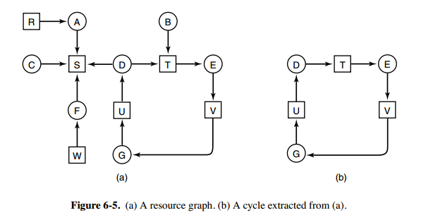
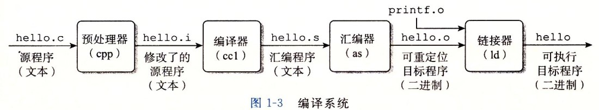

# 操作系统

[TOC]

## 概述

### 并发和并行的区别

**并发是指宏观上在一段时间内能同时运行多个程序，而并行则指同一时刻能运行多个指令**。

并行需要硬件支持，如多流水线、多核处理器或者分布式计算系统。

操作系统通过引入进程和线程，使得程序能够并发运行。

### 共享

共享是指系统中的资源可以被多个并发进程共同使用。

有两种共享方式：**互斥共享和同时共享**。

互斥共享的资源称为临界资源，例如打印机等，在同一时刻只允许一个进程访问，需要用同步机制来实现互斥访问。

### 虚拟

虚拟技术把一个物理实体转换为多个逻辑实体。

主要有两种虚拟技术：**时（时间）分复用技术和空（空间）分复用技术**。

多个进程能在同一个处理器上并发执行使用了时分复用技术，让每个进程轮流占用处理器，每次只执行一小个时间片并快速切换。

虚拟内存使用了空分复用技术，它将物理内存抽象为地址空间，每个进程都有各自的地址空间。地址空间的页被映射到物理内存，地址空间的页并不需要全部在物理内存中，当使用到一个没有在物理内存的页时，执行页面置换算法，将该页置换到内存中。

### 宏内核和微内核的区别

**宏内核**：

宏内核是将操作系统功能作为一个紧密结合的整体放到内核。

由于各模块共享信息，因此有很高的性能。

**微内核**：

由于操作系统不断复杂，因此将一部分操作系统功能移出内核，从而降低内核的复杂性。移出的部分根据分层的原则划分成若干服务，相互独立。

在微内核结构下，操作系统被划分成小的、定义良好的模块，只有微内核这一个模块运行在内核态，其余模块运行在用户态。

因为需要频繁地在用户态和核心态之间进行切换，所以会有一定的性能损失。

### 中断类型

**外中断**：

由 CPU 执行指令以外的事件引起，如 I/O 完成中断，表示设备输入/输出处理已经完成，处理器能够发送下一个输入/输出请求。此外还有时钟中断、控制台中断等。

**异常**：

由 CPU 执行指令的内部事件引起，如非法操作码、地址越界、算术溢出等。

**陷入**：

在用户程序中使用系统调用。


## 进程管理

### 进程与线程的区别

**进程**：

进程是资源分配的基本单位。

进程控制块 (Process Control Block, PCB) 描述进程的基本信息和运行状态，所谓的创建进程和撤销进程，都是指对 PCB 的操作。

**线程**：

线程是独立调度的基本单位。

一个进程中可以有多个线程，它们共享进程资源。

QQ 和浏览器是两个进程，浏览器进程里面有很多线程，例如 HTTP 请求线程、事件响应线程、渲染线程等等，线程的并发执行使得在浏览器中点击一个新链接从而发起 HTTP 请求时，浏览器还可以响应用户的其它事件。

**区别**：

- 资源：进程是资源分配的基本单位，但是线程不拥有资源，线程可以访问隶属进程的资源；
- 调度：线程是独立调度的基本单位，在同一进程中，线程的切换不会引起进程切换，从一个进程中的线程切换到另一个进程中的线程时，会引起进程切换；
- 系统开销：由于创建或撤销进程时，系统都要为之分配或回收资源，如内存空间、I/O 设备等，所付出的开销远大于创建或撤销线程时的开销。类似地，在进行进程切换时，涉及当前执行进程 CPU 环境的保存及新调度进程 CPU 环境的设置，而线程切换时只需保存和设置少量寄存器内容，开销很小；
- 通信：线程间可以通过直接读写同一进程中的数据进行通信，但是进程通信需要借助 IPC；

### 进程状态转换


应该注意以下内容：

- 只有就绪态和运行态可以相互转换，其它的都是单向转换。就绪状态的进程通过调度算法从而获得 CPU 时间，转为运行状态；而运行状态的进程，在分配给它的 CPU 时间片用完之后就会转为就绪状态，等待下一次调度；
- 阻塞状态是缺少需要的资源从而由运行状态转换而来，但是该资源不包括 CPU 时间，缺少 CPU 时间会从运行态转换为就绪态；

### 进程调度算法

不同环境的调度算法目标不同，因此需要针对不同环境来讨论调度算法

#### 批处理系统

批处理系统没有太多的用户操作，在该系统中，调度算法目标是保证吞吐量和周转时间（从提交到终止的时间）

1. 先来先服务

   非抢占式的调度算法，按照请求的顺序进行调度。

   有利于长作业，但不利于短作业，因为短作业必须一直等待前面的长作业执行完毕才能执行，而长作业又需要执行很长时间，造成了短作业等待时间过长。

2. 短时间优先

   非抢占式的调度算法，按估计运行时间最短的顺序进行调度。

   长作业有可能会饿死，处于一直等待短作业执行完毕的状态。因为如果一直有短作业到来，那么长作业永远得不到调度。

3. 最短剩余时间优先

   最短作业优先的抢占式版本，按剩余运行时间的顺序进行调度。 当一个新的作业到达时，其整个运行时间与当前进程的剩余时间作比较。如果新的进程需要的时间更少，则挂起当前进程，运行新的进程。否则新的进程等待。

#### 交互式系统

交互式系统有大量的用户交互操作，在该系统中调度算法的目标是快速地进行响应

1. 时间片轮转

   将所有就绪进程按 FCFS 的原则排成一个队列，每次调度时，把 CPU 时间分配给队首进程，该进程可以执行一个时间片。当时间片用完时，由计时器发出时钟中断，调度程序便停止该进程的执行，并将它送往就绪队列的末尾，同时继续把 CPU 时间分配给队首的进程。

   时间片轮转算法的效率和时间片的大小有很大关系：

   - 因为进程切换都要保存进程的信息并且载入新进程的信息，如果时间片太小，会导致进程切换得太频繁，在进程切换上就会花过多时间。
   - 而如果时间片过长，那么实时性就不能得到保证。

2. 优先级调度

   为每个进程分配一个优先级，按优先级进行调度。

   为了防止低优先级的进程永远等不到调度，可以随着时间的推移增加等待进程的优先级。

3. 多级反馈队列

   一个进程需要执行 100 个时间片，如果采用时间片轮转调度算法，那么需要交换 100 次。

   多级队列是为这种需要连续执行多个时间片的进程考虑，它设置了多个队列，每个队列时间片大小都不同，例如 1,2,4,8,..。进程在第一个队列没执行完，就会被移到下一个队列。这种方式下，之前的进程只需要交换 7 次。

   每个队列优先权也不同，最上面的优先权最高。因此只有上一个队列没有进程在排队，才能调度当前队列上的进程。

   可以将这种调度算法看成是时间片轮转调度算法和优先级调度算法的结合。

   

### 进程同步

#### 临界区

对临界资源进行访问的那段代码称为临界区。

为了互斥访问临界资源，每个进程在进入临界区之前，需要先进行检查。

#### 同步与互斥

- 同步：多个进程因为合作产生的直接制约关系，使得进程有一定的先后执行关系；
- 互斥：多个进程在同一时刻只有一个进程能进入临界区；

#### 信号量

信号量（Semaphore）是一个整型变量，可以对其执行 down 和 up 操作，也就是常见的 P 和 V 操作。

- **down : 如果信号量大于 0 ，执行 -1 操作；如果信号量等于 0，进程睡眠，等待信号量大于 0**；
- **up ：对信号量执行 +1 操作，唤醒睡眠的进程让其完成 down 操作**；

down 和 up 操作需要被设计成原语，不可分割，通常的做法是在执行这些操作的时候屏蔽中断。

如果信号量的取值只能为 0 或者 1，那么就成为了 **互斥量（Mutex）** ，0 表示临界区已经加锁，1 表示临界区解锁，形式化代码如下：

```c
typedef int semaphore;
semaphore mutex = 1;
void P1() {
    down(&mutex);
    // 临界区代码
    up(&mutex);
}
void P2() {
    down(&mutex);
    // 临界区代码
    up(&mutex);
}
```

#### 管程

使用信号量机制实现的生产者消费者问题需要客户端代码做很多控制，而管程把控制的代码独立出来，不仅不容易出错，也使得客户端代码调用更容易。

管程有一个重要特性：在一个时刻只能有一个进程使用管程。进程在无法继续执行的时候不能一直占用管程，否则其它进程永远不能使用管程。

### 经典同步问题

#### 1. 生产者-消费者问题

问题描述：使用一个缓冲区来保存物品，只有缓冲区没有满，生产者才可以放入物品；只有缓冲区不为空，消费者才可以拿走物品。

解决思路：因为缓冲区属于临界资源，因此需要使用一个互斥量 mutex 来控制对缓冲区的互斥访问。

代码实现：

```c
#define N 100
typedef int semaphore;
semaphore mutex = 1;
semaphore empty = N;
semaphore full = 0;
void producer(){
    Item item = produce_item();
    down(&empty);
    down(&mutex);
    insert_item(item);
    up(&mutex);
    up(&full);
}
void comsumer(){
    down(&full);
    down(&mutex);
    Item item = get_item();
    up(&mutex);
    up(&empty);
    comsume_item(item);
}
```

#### 2. 哲学家进餐问题


问题描述：五个哲学家围着一张圆桌，每个哲学家面前放着食物。哲学家的生活有两种交替活动：吃饭以及思考。当一个哲学家吃饭时，需要先拿起自己左右两边的两根筷子，并且一次只能拿起一根筷子。（<u>哲学家不讲究啊</u>）

参考链接：https://blog.csdn.net/qq_28602957/article/details/53538329 （<u>参考其他文章，是因为原文作者提供的方法太麻烦了</u>）

**方法一**

解决思路：至多只允许四个哲学家同时进餐，以保证至少有一个哲学家能够成功拿起一双筷子而成功进餐。

代码实现：

```c
typedef int semaphore;
semaphore chopsticks[5] = {1, 1, 1, 1, 1};
semaphore person = 4;
void philosopher(int i) {
    while(true) {
        think();
        down(&person);
        down(&chopsticks[i]);
        down(&chopsticks[(i+1) mod 5]);
        eat();
        up(&chopsticks[(i+1) mod 5]);
        up(&chopsticks[i]);
        up(&person);
    }
}
```

**方法二**

解决思路：用 `mutex` 互斥信号量限制只有一个哲学家在临界区中——可以去拿筷子。

代码实现：

```c
typedef int semaphore;
semaphore chopsticks[5] = {1, 1, 1, 1, 1};
semaphore mutex = 1
void philosopher(int i) {
    while(true) {
        think();
        down(&mutex);
        down(&chopsticks[i]);
        down(&chopsticks[(i+1) mod 5]);
        up(&mutex);
        eat();
        up(&chopsticks[(i+1) mod 5]);
        up(&chopsticks[i]);
    }
}
```

**方法三**

解决思路：因为原问题中有 5 个哲学家（正常情况下奇数个哲学家都可以），我们规定奇数哲学家先拿右手边的筷子，偶数哲学家先拿左手边的筷子。

代码实现：

```c
typedef int semaphore;
semaphore chopsticks[5] = {1, 1, 1, 1, 1};
void philosopher(int i){
    while(true) {
        think();
        if (i mod 2) {  // 奇数
            down(&chopsticks[(i+1) mod 5]);
            down(&chopsticks[i]);
            eat();
            up(&chopsticks[(i+1) mod 5]);
            up(&chopsticks[i])
        } else {  // 偶数
            down(&chopsticks[i]);
            down(&chopsticks[(i+1) mod 5]);
            eat();
            up(&chopsticks[(i+1) mod 5]);
            up(&chopsticks[i]);
        }
    }
}
```

#### 3. 读者-写者问题

题目描述：允许多个进程同时对数据进行读操作，但是不允许读和写以及写和写操作同时发生。

解决思路：一个整型变量 count 记录在对数据进行读操作的进程数量，一个互斥量 count_mutex 用于对 count 加锁，一个互斥量 data_mutex 用于对读写的数据加锁。

代码实现：

```c
typedef int semaphore;
semaphore data_mutex = 1;
semaphore count_mutex = 1;
int count = 0;
void writer() {
    while(true) {
        if (has_data_to_write()) {
            down(&data_mutex);
            write();
            up(&data_mutex);
        }
    }
}
void reader() {
    while(true) {
        if (need_to_read()) {
            down(&count_mutex);
            count ++;
            if (count == 1) down(&data_mutex);
            up(&count_mutex);
            read();
            down(&count_mutex);
            count --;
            if (count == 0) up(&data_mutex);
            up(&count_mutex);
        }
    }
}
```

### 进程通信

#### 进程通信和进程同步的区别

进程同步：控制多个进程按一定顺序执行；

进程通信：进程间传输信息；

进程通信是一种手段，而进程同步是一种目的。也可以说，为了能够达到进程同步的目的，需要让进程进行通信，传输一些进程同步所需要的信息。

#### 进程通信的方法

参考链接：https://www.jianshu.com/p/c1015f5ffa74（<u>原文中进程通信比较简略</u>）

##### 1. 管道/匿名管道（pipe）


**管道特点**：

- 管道是半双工的，数据只能向一个方向流动；需要双方通信时，需要建立起两个管道。
- 只能用于 **父子进程或者兄弟进程** 之间(具有亲缘关系的进程，是在 fork 之后使用的);
- 单独构成一种独立的文件系统：管道对于管道两端的进程而言，就是一个文件，但它不是普通的文件，它不属于某种文件系统，而是自立门户，单独构成一种文件系统，并且只存在与内存中。
- **数据的读出和写入：一个进程向管道中写的内容被管道另一端的进程读出**。写入的内容每次都添加在管道缓冲区的末尾，并且每次都是从缓冲区的头部读出数据

**管道实质**：

管道的实质是一个**内核缓冲区**，进程**以先进先出的方式从缓冲区存取数据**，管道一端的进程顺序的将数据写入缓冲区，另一端的进程则顺序的读出数据。

该缓冲区可以看做是一个**循环队列**，读和写的位置都是自动增长的，不能随意改变，一个数据只能被读一次，读出来以后在缓冲区就不复存在了。

当缓冲区读空或者写满时，有一定的规则控制相应的读进程或者写进程进入等待队列，当空的缓冲区有新数据写入或者满的缓冲区有数据读出来时，就唤醒等待队列中的进程继续读写。

**管道局限性**：

- 只支持半双工通信（单向交替传输）；
- 只能在父子进程或者兄弟进程中使用；

##### 2. 命名管道

有名管道不同于匿名管道之处在于它提供了一个路径名与之关联，**以有名管道的文件形式存在于文件系统中**，这样，**即使与有名管道的创建进程不存在亲缘关系的进程，只要可以访问该路径，就能够彼此通过有名管道相互通信**，因此，通过有名管道不相关的进程也能交换数据。值的注意的是，有名管道严格遵循**先进先出(first in first out)**,对匿名管道及有名管道的读总是从开始处返回数据，对它们的写则把数据添加到末尾。它们不支持诸如 `lseek()` 等文件定位操作。**有名管道的名字存在于文件系统中，内容存放在内存中**。

##### 3. 信号 Signal

信号是Linux系统中用于进程间互相通信或者操作的一种机制，信号可以在任何时候发给某一进程，而**无需知道该进程的状态**。

*** Linux 系统中常用信号**：

- **SIGHUP：**用户从终端注销，所有已启动进程都将收到该进程。系统缺省状态下对该信号的处理是终止进程。
- **SIGINT：**程序终止信号。程序运行过程中，按`Ctrl+C`键将产生该信号。
- **SIGQUIT：**程序退出信号。程序运行过程中，按`Ctrl+\\`键将产生该信号。
- **SIGBUS 和 SIGSEGV：**进程访问非法地址。
- **SIGFPE：**运算中出现致命错误，如除零操作、数据溢出等。
- **SIGTERM：**结束进程信号。shell下执行 `kill <pid>` 发送该信号.
- **SIGALRM：**定时器信号。
- **SIGCLD：**子进程退出信号。如果其父进程没有忽略该信号也没有处理该信号，则子进程退出后将形成僵尸进程。

##### 4. 消息队列

- 消息队列是存放在内核中的消息链表，每个消息队列由消息队列标识符表示；
- 与管道（无名管道：只存在于内存中的文件；命名管道：存在于实际的磁盘介质或者文件系统）不同的是消息队列**存放在内核中（独立于读写进程存在）**，只有在内核重启(即，操作系统重启)或者显示地删除一个消息队列时，该消息队列才会被真正的删除；
- 消息队列在**先进先出的原则**上，支持**根据消息类型**来接收消息；

##### 5. 共享内存

- 允许多个进程共享一个给定的存储区。因为数据不需要在进程之间复制，所以这是最快的一种 IPC。

- 需要使用信号量用来同步对共享存储的访问。

##### 6. 信号量

它是一个计数器，用于为多个进程提供对共享数据对象的访问。

##### 7. 套接字

套接字的特性由3个属性确定，它们分别是：域、端口号、协议类型。

与其它通信机制不同的是，它可用于不同机器间的进程通信。


## 死锁

### 必要条件


- **互斥**：每个资源要么已经分配给了一个进程，要么就是可用的；
- **占有并等待**：已经得到了某个资源的进程可以再请求新的资源；
- **不可抢占**：已经分配给一个进程的资源不能强制性地被抢占，它只能被占有它的进程显式地释放；
- **环路等待**：有两个或者两个以上的进程组成一条环路，该环路中的每个进程都在等待下一个进程所占有的资源；

### 死锁的处理方法

死锁的处理方法有四种：

- 鸵鸟策略
- 死锁检测与死锁恢复
- 死锁预防
- 死锁避免

#### 鸵鸟策略

把头埋在沙子里，假装根本没发生问题。

因为解决死锁问题的代价很高，因此鸵鸟策略这种不采取任务措施的方案会获得更高的性能。

当发生死锁时不会对用户造成多大影响，或发生死锁的概率很低，可以采用鸵鸟策略。

大多数操作系统，包括 Unix，Linux 和 Windows，处理死锁问题的办法仅仅是忽略它。

#### 死锁检测与死锁恢复

不试图阻止死锁，而是当检测到死锁发生时，采取措施进行恢复。

##### 死锁检测

**每种类型一个资源的死锁检测**



上图为资源分配图，其中方框表示资源，圆圈表示进程。资源指向进程表示该资源已经分配给该进程，进程指向资源表示进程请求获取该资源。

图 a 可以抽取出环，如图 b，它满足了环路等待条件，因此会发生死锁。

每种类型一个资源的死锁检测算法是通过检测有向图是否存在环来实现，从一个节点出发进行深度优先搜索，对**访问过的节点进行标记**，如果访问了已经标记的节点，就表示**有向图存在环**，也就是检测到死锁的发生。

**每种类型多个资源的死锁检测**


上图中，有三个进程四个资源，每个数据代表的含义如下：

- E 向量：资源总量
- A 向量：资源剩余量
- C 矩阵：每个进程所拥有的资源数量，每一行都代表一个进程拥有资源的数量
- R 矩阵：每个进程请求的资源数量

进程 `P1` 和 `P2` 所请求的资源都得不到满足，只有进程 `P3` 可以，让 `P3` 执行，之后释放 `P3` 拥有的资源，此时 $A = (2\ 2\ 2\ 0)$。P2 可以执行，执行后释放 `P2` 拥有的资源，$A = (4\ 2\ 2\ 1)$。`P1` 也可以执行。所有进程都可以顺利执行，没有死锁。

算法总结如下：

每个进程最开始时都不被标记，执行过程有可能被标记。当算法结束时，任何没有被标记的进程都是死锁进程。

1. 寻找一个没有标记的进程 Pi，它所请求的资源小于等于 A。
2. 如果找到了这样一个进程，那么将 C 矩阵的第 i 行向量加到 A 中，标记该进程，并转回 1。
3. 如果没有这样一个进程，算法终止。

##### 死锁恢复

- 利用抢占恢复
- 利用回滚恢复
- 通过杀死进程恢复

#### 死锁预防

在程序运行之前预防发生死锁，即破坏死锁的四个必要条件：

- 破坏互斥条件：例如假脱机打印机技术允许若干个进程同时输出，唯一真正请求物理打印机的进程是打印机守护进程；
- 破坏占有并等待条件：一种实现方式是规定所有进程在开始执行前请求所需要的全部资源；
- 破坏不可抢占条件：可以抢占其他进程已经申请的资源；
- 破坏环路等待条件：给资源统一编号，进程只能按编号顺序来请求资源；

#### 死锁避免

在程序运行时避免发生死锁。

##### 安全状态


图 a 的第二列 Has 表示已拥有的资源数，第三列 Max 表示总共需要的资源数，Free 表示还有可以使用的资源数。从图 a 开始出发，先让 B 拥有所需的所有资源（图 b），运行结束后释放 B，此时 Free 变为 5（图 c）；接着以同样的方式运行 C 和 A，使得所有进程都能成功运行，因此可以称图 a 所示的状态时安全的。

定义：**如果没有死锁发生，并且即使所有进程突然请求对资源的最大需求，也仍然存在某种调度次序能够使得每一个进程运行完毕，则称该状态是安全的**。

##### 单个资源的银行家算法


上图 c 为不安全状态，因此算法会拒绝之前的请求 b，从而避免进入图 c 中的状态。

##### 多个资源的银行家算法


上图中有五个进程，四个资源。左边的图表示已经分配的资源，右边的图表示还需要分配的资源。最右边的 E、P 以及 A 分别表示：总资源、已分配资源以及可用资源，注意这三个为向量，而不是具体数值，例如 A=(1020)，表示 4 个资源分别还剩下 1/0/2/0。

检查一个状态是否安全的算法如下：

- 查找右边的矩阵是否存在一行小于等于向量 A。如果不存在这样的行，那么系统将会发生死锁，状态是不安全的。
- 假若找到这样一行，将该进程标记为终止，并将其已分配资源加到 A 中。
- 重复以上两步，直到所有进程都标记为终止，则状态时安全的。

如果一个状态不是安全的，**需要拒绝进入这个状态**。


## 内存管理

参考链接：https://liuyehcf.github.io/2017/08/12/%E6%93%8D%E4%BD%9C%E7%B3%BB%E7%BB%9F%E5%86%85%E5%AD%98%E7%AE%A1%E7%90%86%E8%AF%A6%E8%A7%A3/（<u>原文讲的过于简略</u>）

### 连续分配存储管理

连续分配是指为一个用户程序分配连续的内存空间。连续分配有__单一式管理__和__分区式管理__两种方式。

#### 单一式管理

在这种管理方式中，内存被分为两个区域：__系统区和用户区__。应用程序装入到用户区，可使用用户区全部空间

其特点是，最简单，适用于单用户、单任务的操作系统。

这种方式的__最大优点就是易于管理__。但也存在着一些问题和不足之处，例如对要求内存空间少的程序，造成内存浪费

#### 分区式管理

为了支持多个程序并发执行，引入了分区式管理。__分区式管理是把内存分为一些大小相等或不等的分区，操作系统占用其中一个分区，其余的分区由应用程序使用，每个应用程序占用一个或几个分区__。分区式管理虽然可以支持并发，但难以进行内存分区的共享

分区式管理引人了两个新的问题：**内碎片__和__外碎片**

1. __内碎片__是占用分区内未被利用的空间
2. __外碎片__是占用分区之间难以利用的空闲分区(通常是小空闲分区)

为实现分区式管理，操作系统应维护的数据结构为分区表或分区链表。**表中各表项一般包括每个分区的起始地址、大小及状态(是否已分配)**

分区式管理常采用的一项技术就是**内存紧缩**(compaction)。

分区式管理按照分区的大小策略又可细分为__固定分区__和__动态分区__两种。

##### 固定分区

固定式分区的特点是把内存划分为若干个固定大小的连续分区

- 分区大小可以相等：这种作法只适合于多个相同程序的并发执行(处理多个类型相同的对象)
- 分区大小也可以不等：有多个小分区、适量的中等分区以及少量的大分区。根据程序的大小，分配当前空闲的、适当大小的分区

__优点__：易于实现，开销小

__缺点__：

1. 内碎片造成浪费
2. 分区总数固定，限制了并发执行的程序数目

##### 动态分区

动态分区的特点是动态创建分区：在装入程序时按其初始要求分配，或在其执行过程中通过系统调用进行分配或改变分区大小

__与固定分区相比较其优点是：没有内碎片。但它却引入了另一种碎片——外碎片__。动态分区的分区分配就是寻找某个空闲分区，其大小需大于或等于程序的要求。若是大于要求，则将该分区分割成两个分区，其中一个分区为要求的大小并标记为”占用”，而另一个分区为余下部分并标记为”空闲”。分区分配的先后次序通常是从内存低端到高端。动态分区的分区释放过程中有一个要注意的问题是，将相邻的空闲分区合并成一个大的空闲分区

下面列出了几种常用的分区分配算法：

1. __最先适配法(nrst-fit)__：按分区在内存的先后次序从头查找，找到符合要求的第一个分区进行分配。该算法的分配和释放的时间性能较好，较大的空闲分区可以被保留在内存高端。但随着低端分区不断划分会产生较多小分区，每次分配时查找时间开销便会增大
2. __下次适配法(循环首次适应算法 next fit)__：按分区在内存的先后次序，从上次分配的分区起查找(到最后，再从头开始)，找到符合要求的第一个分区进行分配。该算法的分配和释放的时间性能较好，使空闲分区分布得更均匀，但较大空闲分区不易保留
3. __最佳适配法(best-fit)__：按分区在内存的先后次序从头查找，找到其大小与要求相差最小的空闲分区进行分配。从个别来看，外碎片较小；但从整体来看，会形成较多外碎片优点是较大的空闲分区可以被保留
4. __最坏适配法(worst- fit)__：按分区在内存的先后次序从头查找，找到最大的空闲分区进行分配。基本不留下小空闲分区，不易形成外碎片。但由于较大的空闲分区不被保留，当对内存需求较大的进程需要运行时，其要求不易被满足

#### 伙伴系统

固定分区和动态分区方式都有不足之处。固定分区方式限制了活动进程的数目，当进程大小与空闲分区大小不匹配时，内存空间利用率很低。动态分区方式算法复杂，回收空闲分区时需要进行分区合并等，系统开销较大。伙伴系统方式是对以上两种内存方式的一种折衷方案

伙伴系统规定，无论已分配分区或空闲分区，其大小均为 2 的 $k$ 次幂，$k$ 为整数，$l≤k≤m$，其中：

- $2^l$ 表示分配的最小分区的大小
- $2^m$ 表示分配的最大分区的大小，通常 $2^m$ 是整个可分配内存的大小

假设系统的可利用空间容量为 $2^m$ ，则系统开始运行时，整个内存区是一个大小为 $2^m$ 的空闲分区。在系统运行过中，由于不断的划分，可能会形成若干个不连续的空闲分区，将这些空闲分区根据分区的大小进行分类，对于每一类具有相同大小的所有空闲分区，单独设立一个空闲分区双向链表。这样，不同大小的空闲分区形成了数个 $(m-l+1)$ 空闲分区链表

__当需要为进程分配一个长度为n的存储空间时，分配步骤如下__：

1. 首先计算一个 $i$ 值，使 $2^{(i－1)} <n ≤ 2^i$ 
2. 然后在空闲分区大小为 $2^i$ 的空闲分区链表中查找。若找到，即把该空闲分区分配给进程
3. 否则，表明长度为 $2^i$ 的空闲分区已经耗尽，则在分区大小为 $2^{(i＋1)}$ 的空闲分区链表中寻找。若存在 $2^{(i＋1)}$ 的一个空闲分区，则把该空闲分区分为相等的两个分区，__这两个分区称为一对伙伴__，其中的一个分区用于配，而把另一个加入分区大小为`2^i`的空闲分区链表中
4. 否则，表明大小为 $2^{(i＋1)}$ 的空闲分区也不存在，则需要查找大小为 $2^{(i＋2)}$ 的空闲分区，若找到则对其进行两次分割：
   - 第一次，将其分割为大小为 $2^{(i＋1)}$ 的两个分区，一个用于分配，一个加入到大小为 $2^{(i＋1)}$ 的空闲分区链表中
   - 第二次，将第一次用于分配的空闲区分割为 $2^i$ 的两个分区，一个用于分配，一个加入到大小为 $2^i$ 的空闲分区链表中
5. 否则，表明大小为 $2^{(i＋2)}$ 的空闲分区也不存在，则继续查找大小为 $2^{(i＋3)}$ 的空闲分区，以此类推

由此可见，在最坏的情况下，可能需要对 $2^k$ 的空闲分区进行 $k$ 次分割才能得到所需分区

#### 内存紧缩

内存紧缩：将各个占用分区向内存一端移动，然后将各个空闲分区合并成为一个空闲分区

这种技术在提供了某种程度上的灵活性的同时，也存在着一些弊端，例如：对占用分区进行内存数据搬移占用CPU时间；如果对占用分区中的程序进行”浮动”，则其重定位需要硬件支持

__紧缩时机__：每个分区释放后，或内存分配找不到满足条件的空闲分区时

##### 堆结构的存储管理的分配算法

在动态存储过程中，不管哪个时刻，可利用空间都是__一个地址连续的存储区__，在编译程序中称之为”堆”，每次分配都是从这个可利用空间中划出一块。其实现办法是：设立一个指针，称之为堆指针，始终指向堆的最低地址。当用户申请N个单位的存储块时，堆指针向高地址移动N个存储单位，而移动之前的堆指针的值就是分配给用户的占用块的初始地址。例如，某个串处理系统中有A、B、C、D这4个串，其串值长度分别為12，6，10和8。假设堆指针free的初值为零，则分配给这4个串值的存储空间的初始地址分别为0，12，18和28，分配后的堆指针的值为36。因此，这种堆结构的存储管理的分配算法非常简单

##### 释放内存空间执行内存紧缩

回收用户释放的空闲块就比较麻烦。由于系统的可利用空间始终是一个绝址连续的存储块，因此回收时必须将所释放的空间块合并到整个堆上去才能重新使用，这就是”存储策缩”的任务

通常，有两种做法：

1. 一种是一旦有用户释放存储块即进行回收紧缩(类似于Java垃圾回收的标记整理算法)
2. 另一种是在程序执行过程中不回收用户随时释放的存储块，直到可利用空同不够分配或堆指针指向最高地址时才进行存储紧缩(类似于Java垃圾回收器CMS的内存整理过程)

#### 覆盖与交换技术

##### 覆盖技术

__引入覆盖(overlay)技术的目标是在较小的可用内存中运行较大的程序__。这种技术常用于多道程序系统之中，与分区式管理配合使用

覆盖技术的原理：一个程序的几个代码段或数据段，按照时间先后来占用公共的内存空间。将程序必要部分(常用功能)的代码和数据常驻内存；可选部分(不常用功能)平时存放在外存(覆盖文件)中，在需要时才装入内存。不存在调用关系的模块不必同时装入到内存，从而可以相互覆盖

在任何时候只在内存中保留所需的指令和数据；当需要其它指令时，它们会装入到刚刚不再需要的指令所占用的内存空间；如在同一时刻，CPU只能执行B，C中某一条。B，C之间就可以做覆盖

覆盖技术的缺点是编程时必须划分程序模块和确定程序模块之间的覆盖关系，增加编程复杂度；从外存装入覆盖文件，以时间延长换取空间节省

覆盖的实现方式有两种：以函数库方式实现或操作系统支持

##### 交换技术

交换 (swapping)技术在多个程序并发执行时，可以将暂时不能执行的程序（进程）送到外存中，从而获得空闲内存空间来装入新程序（进程），或读入保存在外存中且处于就绪状态的程序。__交换单位为整个进程的地址空间__。交换技术常用于多道程序系统或小型分时系统中，因为这些系统大多采用分区管理方式。与分区式管理配合使用又称作”对换”或”滚进／滚出” (roll-in／roll-out)

原理：暂停执行内存中的进程，将整个进程的地址空间保存到外存的交换区中（换出swap out），而将外存中由阻塞变为就绪的进程的地址空间读入到内存中，并将该进程送到就绪队列（换入swap in）

交换技术优点之一是增加并发运行的程序数目，并给用户提供适当的响应时间；__与覆盖技术相比交换技术另一个显著的优点是不影响程序结构__。交换技术本身也存在着不足，例如：对换人和换出的控制增加处理器开销；程序整个地址空间都进行对换，没有考虑执行过程中地址访问的统计特性

### 页式、段式、段页式管理

#### 虚拟内存

虚拟内存的基本思想是，每个进程有用独立的逻辑地址空间，内存被分为大小相等的多个块，称为页(Page)。每个页都是一段连续的地址。对于进程来看,逻辑上貌似有很多内存空间，其中一部分对应物理内存上的一块(称为页框，通常页和页框大小相等)，还有一些没加载在内存中的对应在硬盘上。


虚拟内存的目的是**为了让物理内存扩充成更大的逻辑内存，从而让程序获得更多的可用内存**。

#### 页式管理

##### 基本原理

将程序的逻辑地址空间划分为固定大小的页(page)，而物理内存划分为同样大小的页框(page frame)。程序加载时，可将任意一页放人内存中任意一个页框，这些页框不必连续，从而实现了离散分配。该方法需要CPU的硬件支持，来实现逻辑地址和物理地址之间的映射。在页式管理方式中地址结构由两部构成，前一部分是页号p，后一部分为页内地址w（位移量）

__页式管理的优点__：

1. 没有外碎片，每个内碎片不超过页大比前面所讨论的几种管理方式的最大进步是
2. 一个程序不必连续存放
3. 便于改变程序占用空间的大小(主要指随着程序运行，动态生成的数据增多，所要求的地址空间相应增长)

##### 页式管理地址变换

在页式系统中，指令所给出的地址分为两部分：**逻辑页号和页内地址**。

原理：CPU中的内存管理单元(MMU)按逻辑页号通过查**进程页表__得到物理页框号，__将物理页框号与页内地址相加形成物理地址**

逻辑页号，页内偏移地址－>查进程页表，得物理页号－>物理地址：


上述过程通常由处理器的硬件直接完成，不需要软件参与。通常，操作系统只需在进程切换时，把进程页表的首地址装入处理器特定的寄存器中即可。一般来说，页表存储在主存之中。这样处理器每访问一个在内存中的操作数，就要访问两次内存：

1. 第一次用来查找页表将操作数的逻辑地址变换为物理地址
2. 第二次完成真正的读写操作

#### 页面置换算法

在程序运行过程中，如果要访问的页面不在内存中，就发生缺页中断从而将该页调入内存中。此时如果内存已无空闲空间，系统必须从内存中调出一个页面到磁盘对换区中来腾出空间。

页面置换算法和缓存淘汰策略类似，可以将内存看成磁盘的缓存。在缓存系统中，缓存的大小有限，当有新的缓存到达时，需要淘汰一部分已经存在的缓存，这样才有空间存放新的缓存数据。

**页面置换算法的主要目标是使页面置换频率最低（也可以说缺页率最低）**。

##### 1. 最佳置换 OPT

所选择的被换出的页面将是最长时间内不再被访问，通常可以保证获得最低的缺页率。

是一种理论上的算法，因为无法知道一个页面多长时间不再被访问。

举例：一个系统为某进程分配了三个物理块，并有如下页面引用序列：

```
7，0，1，2，0，3，0，4，2，3，0，3，2，1，2，0，1，7，0，1
```

开始运行时，先将 7, 0, 1 三个页面装入内存。当进程要访问页面 2 时，产生缺页中断，会将页面 7 换出，因为页面 7 再次被访问的时间最长。

##### 2. 最近最久未使用 LRU

虽然无法知道将来要使用的页面情况，但是可以知道过去使用页面的情况。LRU 将最近最久未使用的页面换出。

为了实现 LRU，需要在内存中维护一个所有页面的链表。当一个页面被访问时，将这个页面移到链表表头。这样就能保证链表表尾的页面是最近最久未访问的。

因为每次访问都需要更新链表，因此这种方式实现的 LRU 代价很高。

```
4，7，0，7，1，0，1，2，1，2，6
```


##### 3. 最近未使用

每个页面都有两个状态位：R 与 M，当页面被访问时设置页面的 R=1，当页面被修改时设置 M=1。其中 R 位会定时被清零。可以将页面分成以下四类：

- R=0，M=0
- R=0，M=1
- R=1，M=0
- R=1，M=1

当发生缺页中断时，NRU 算法随机地从类编号最小的非空类中挑选一个页面将它换出。

NRU 优先换出已经被修改的脏页面（R=0，M=1），而不是被频繁使用的干净页面（R=1，M=0）。

##### 4. 先进先出 FIFO

选择换出的页面是最先进入的页面。

该算法会将那些经常被访问的页面换出，导致缺页率升高。

##### 5. 第二次机会算法

FIFO 算法可能会把经常使用的页面置换出去，为了避免这一问题，对该算法做一个简单的修改：

当页面被访问 (读或写) 时设置该页面的 R 位为 1。需要替换的时候，检查最老页面的 R 位。如果 R 位是 0，那么这个页面既老又没有被使用，可以立刻置换掉；如果是 1，就将 R 位清 0，并把该页面放到链表的尾端，修改它的装入时间使它就像刚装入的一样，然后继续从链表的头部开始搜索。


#### 段式管理

##### 基本原理

__在段式管理中，将程序的地址空间划分为若干个段(segment)__，这样每个进程有一个二维的地址空间。__在前面所介绍的动态分区分配方式中，系统为整个进程分配一个连续的内存空间__。__而在段式管理系统中，则为每个段分配一个连续的分区，而进程中的各个段可以不连续地存放在内存的不同分区中__。程序加载时，操作系统为所有段分配其所需内存，这些段不必连续，物理内存的管理采用动态分区的管理方法

在为某个段分配物理内存时，可以采用首先适配法、下次适配法、最佳适配法等方法

在回收某个段所占用的空间时，要注意将收回的空间与其相邻的空间合并

段式管理也需要硬件支持，实现逻辑地址到物理地址的映射


程序通过分段划分为多个模块，如代码段、数据段、共享段：

1. 可以分别编写和编译
2. 可以针对不同类型的段采取不同的保护
3. 可以按段为单位来进行共享，包括通过动态链接进行代码共享

这样做的优点是：可以分别编写和编译源程序的一个文件，并且可以针对不同类型的段采取不同的保护，也可以按段为单位来进行共享

__段式管理的优点__：

1. 没有内碎片，外碎片可以通过内存紧缩来消除
2. 便于实现内存共享

__段式管理的缺点__：

1. 进程必须全部装入内存

##### 段式管理的地址变换

在段式管理系统中，整个进程的地址空间是二维的，即其逻辑地址由段号和段内地址两部分组成。为了完成进程逻辑地址到物理地址的映射，处理器会查找内存中的段表，由段号得到段的首地址，加上段内地址，得到实际的物理地址。这个过程也是由处理器的硬件直接完成的，操作系统只需在进程切换时，将进程段表的首地址装入处理器的特定寄存器当中。这个寄存器一般被称作段表地址寄存器


#### 段页式管理

##### 基本原理

一个进程中所包含的具有独立逻辑功能的程序或数据仍被划分为段，并有各自的段号s__。这反映了段页式管理中的段式特征。其次，__对于段s中的程序或数据，则按照一定的大小将其划分为不同的页__。和页式系统一样，最后不足一页的部分仍占一页。这反映了段页式管理中的页式特征。__从而，段页式管理时的进程的虚拟地址空间中的虚拟地址由三部分组成：即段号s，页号p和页内相对地址d。

##### 段页式管理的地址转换

在一般使用段页式管理方式的计算机系统中，都在内存中辟出一块固定的区域存放进程的段表和页表。因此，在段页式管理系统中，要对内存中指令或数据进行一次存取的话，至少需要访问三次以上的内存：

1. 第一次是由段表地址寄存器得段表始址后访问段表，由此取出对应段的页表在内存中的地址
2. 第二次则是访问页表得到所要访问的物理地址
3. 第三次才能访问真正需要访问的物理单元


## 设备管理

### 磁盘调度算法

读写一个磁盘块的时间的影响音素有：

- 旋转时间（主轴转动盘面，使得磁头移动到适当的扇区上）；
- 寻道时间（制动手臂移动，使得磁头移动到适当的磁道上）；
- 数据传输时间；

其中，寻道时间最长，因此磁盘调度的主要目标是使磁盘的平均寻道时间最短。

#### 先来先服务 FCFS

按照磁盘请求的顺序进行调度。

优点是公平和简单。缺点也很明显，因为未对寻道做任何优化，**使平均寻道时间可能较长**。

#### 最短寻道时间优先 SSFC

优先调度与当前磁头所在磁道距离最近的磁道。

虽然平均寻道时间比较低，但是不够公平。如果新到达的磁道请求总是比一个在等待的磁道请求近，那么在等待的磁道请求会一直等待下去，也就是出现饥饿现象。具体来说，**两端的磁道请求更容易出现饥饿现象**。


#### 电梯算法 SCAN

电梯总是保持一个方向运行，直到该方向没有请求为止，然后改变运行方向。

电梯算法（扫描算法）和电梯的运行过程类似，总是按一个方向来进行磁盘调度，直到该方向上没有未完成的磁盘请求，然后改变方向。

因为考虑了移动方向，因此所有的磁盘请求都会被满足，解决了 SSTF 的饥饿问题。


## 链接

### 编译系统

以下是一个 hello.c 程序：

```c
#include <stdio.h>
int main()
{
    printf("hello, world\n");
    return 0;
}
```

在 Unix 系统上，由编译器把源文件转换为目标文件。

```shell
gcc -o hello hello.c
```



过程如下：

- 预处理阶段：处理以 # 开头的预处理命令；
- 编译阶段：翻译成汇编文件；
- 汇编阶段：将汇编文件翻译成可重定位目标文件；
- 链接阶段：将可重定位目标文件和 printf.o 等单独预编译好的目标文件进行合并，得到最终的可执行目标文件；

### 静态链接

静态链接器以一组可重定位目标文件为输入，生成一个完全链接的可执行目标文件作为输出。链接器主要完成以下两个任务：

- **符号解析**：每个符号对应于一个函数、一个全局变量或一个静态变量，符号解析的目的是将**每个符号引用与一个符号定义关联起来**；
- **重定位**：链接器通过把每个符号定义与一个内存位置关联起来，然后**修改所有对这些符号的引用，使得它们指向这个内存位置**；


### 目标文件

- 可执行目标文件：可以直接在内存中执行；
- 可重定位目标文件：可与其它可重定位目标文件在链接阶段合并，创建一个可执行目标文件；
- 共享目标文件：这是一种特殊的可重定位目标文件，可以在运行时被动态加载进内存并链接；

### 动态链接

参考链接：https://www.cnblogs.com/cyyljw/p/10949660.html（<u>补充动态链接的过程</u>）

静态库有以下两个问题：

- 当静态库更新时那么整个程序都要重新进行链接，**难以更新**；
- 对于 printf 这种标准函数库，如果每个程序都要有代码，这会**极大浪费资源**。

共享库是为了解决静态库的这两个问题而设计的，在 Linux 系统中通常用 .so 后缀来表示，Windows 系统上它们被称为 DLL。它具有以下特点：

- 在给定的文件系统中一个库只有一个文件，所有引用该库的可执行目标文件都共享这个文件，它不会被复制到引用它的可执行文件中；
- 在内存中，一个共享库的 .text 节（已编译程序的机器代码）的一个副本可以被不同的正在运行的进程共享。


动态链接的过程：（**和静态链接的区别在于链接的时机不同**）

假设现在有两个程序 `program1.o` 和 `program2.o` ，这两者共用同一个库 `lib.o` ，假设首先运行程序 `program1` ，系统首先加载 `program1.o` ，当系统发现 `program1.o` 中用到了 `lib.o`，即 `program1.o` 依赖于 `lib.o`，那么系统接着加载 `lib.o`，如果 `program1.o` 和 `lib.o` 还依赖于其他目标文件，则依次全部加载到内存中。当 `program2` 运行时，同样的加载 `program2.o` ，然后发现 `program2.o` 依赖于 `lib.o` ，但是此时 `lib.o` 已经存在于内存中，这个时候就不再进行重新加载，而是将内存中已经存在的 `lib.o` 映射到 `program2` 的虚拟地址空间中，从而进行链接（这个链接过程和静态链接类似）形成可执行程序。


## 常见考题

参考链接：https://zhuanlan.zhihu.com/p/23755202

参考链接：https://blog.nowcoder.net/n/49211c67aaaa49eb8842f7e979c79498

#### 1. 请分别简单说一说进程和线程？以及他们的区别？以及程序和进程之间的区别？

- 进程是系统进行资源调度和分配的最小单位；线程是CPU调度和分派的最小单位；

- 进程和线程的区别：

  - 资源：进程是系统进行资源分配的最小单位，拥有系统资源，而线程本身不占有系统资源，同一进程中的线程共享进程的资源；
  - 调度：线程是CPU调度的最小单位，同一进程中的线程切换时，不会导致进程的切换；
  - 系统开销：同进程中的线程切换的系统开销比进程的切换的系统开销要小，因为进程切换时涉及进程状态的保存等；
  - 通信：同进程中的线程间可以直接利用进程的共享内存进行通信，而进程间通信需要借助IPC；

- 程序和进程的区别：

  ​		程序是一个存储在计算机磁盘中的静态文件，而进程则是程序被操作系统加载到内存中动态运行下的系统资源管理实体；

#### 2. （进程中）线程同步的方式有哪些

- 互斥量：采用互斥对象机制，只有拥有互斥对象的线程才能访问公共资源的权限；
- 信号量：它允许同一时刻存在多个线程访问同一个资源，但是需要控制同一时刻访问资源的最大线程数量；
- 事件（信号）：通过事件来通知（唤醒）另一个线程；

#### 3. 进程的通信方式有哪些

- 管道：
  - 匿名管道 PIPE：半双工通道，只能在父子进程间使用；
  - 命名管道 NAME PIPE：半双工通道，可以在任意两个进程间使用；
- 系统 IPC：
  - 信号量：一个计数器，用来统计系统资源占用情况等；
  - 消息队列：是一个消息链表，与管道不同的是，消息队列是独立与管道存在的；
  - 共享内存：多个进程间共享同一块内存区域，是最快的IPC；
- SOCKET：套接字；

#### 4. 什么是缓冲区溢出？有什么危害？其原因是什么？

缓冲区溢出是指程序向缓冲区填充数据时超出了缓冲区本身的容量，溢出的数据覆盖在原本合法的数据上；

危害：

- 程序崩溃；
- 恶意代码执行；

主要原因：没有检查用户的输入；

#### 5. 什么是死锁？死锁产生的条件？

多个进程无限期地阻塞、相互等待的一种状态。

死锁产生的条件：

- 互斥：... ...
- 占有并等待：... ...
- 不可抢占：... ...
- 环路等待：... ...

#### 6. 进程有哪几种状态？

- Ready：
- Waiting：
- Running：
- Created：
- Terminated：

#### 7. 分页和分段有什么区别？

分页：将程序的逻辑地址和内存的物理地址都按照相同的大小划分成同样大小的页，程序加载时，可以将程序的一个页加载到内存的任意一页上，不必连续；

分段：将程序的地址空间划分成若干个段——代码段、数据段、堆栈段；

区别：

- 目的不同：段是信息的逻辑单位，它是根据用户的需要进行划分的，因此段对于用户是可见的；页是信息的物理单位，是为了管理主存、扩展虚拟内存而划分的，对用户是透明的；
- 大小不同：段的大小是不固定的；页的大小是固定的，是由系统决定的；
- 地址空间不同：段向用户提供的是二维地址空间，而页向用户提供的是一维地址空间；
- 信息共享：段便于存储保护和信息的共享，而页的保护和共享受到限制；
- 内存碎片：页会产生内碎片，但不会产生外碎片；而段会产生外碎片，但不会产生内碎片；

#### 8. 操作系统中进程调度的算法有哪几种？

- 批处理系统
  - 先来先服务
  - 短时间优先
  - 最短剩余时间优先
- 交互式系统
  - 时间片轮转
  - 优先级调度
  - 多级反馈队列

#### 9. 进程同步的方式有哪几种？

- 信号量
- 管程
- 会合
- 分布式系统

#### 10. 说一说死锁的处理基本策略和常用方法？

- 基本策略：
  - 鸵鸟策略：不处理；
  - 死锁检测与死锁恢复：检测到思索后对死锁进行恢复（抢占、回滚、或杀死进程）；
  - 死锁预防：直接破坏出现死锁的四个必要条件；
  - 死锁避免：避免进入可能导致出现死锁的状态；
- 常用方法：预防死锁、避免死锁、检测死锁、接触死锁；

#### 11. 中断和轮询的特点？

- 轮询：效率低，等待时间长，CPU利用率低；
- 中断：容易遗漏一些问题，CPU利用率高；

#### 12. 什么是临界区？如何解决冲突？

临界区：每个进程中访问临界资源的程序片段就称为临界区，每次只允许一个进程进入临界区；

冲突解决：

- 如果有多个进程要求进入空闲的临界区，则一次只允许一个进程进入；
- 任何时候，处于临界区的进程最多只有一个；如果已经有进程进入临界区，那么其他进程就必须需要等待；
- 进入临界区的进程必须在有限时间内退出，以便其他进程能够进入临界区；
- 如果进程不能进入临界区，则应让出CPU，进入waiting状态；

#### 13. 局部性原理

- 时间上的局部性：最近被访问的页在不久的将来还会被访问；
- 空间上的局部性：内存中被访问的页周围的页页很可能被访问；

#### 14. 内存颠簸

内存颠簸本质上是指频繁的页调度形为；

#### 15. 页面置换算法有哪些？

- 最优置换算法
- 先进先出算法
- 最近最少使用算法
- 最近未使用算法
- 第二次机会算法

#### 16. 什么是虚拟内存？其优点是什么？

虚拟内存：每个进程拥有独立的逻辑地址空间，这个空间被划分成相同大小的页。物理内存空间也被划分成相同大小的帧。进程加载时，进程的页被载入到物理内存的帧中，不用保持连续。并且进程不需要将所有的页都加载到内存中，其中一部分的页可以保存在磁盘中，当运行到没有加载的页时，系统再通过缺页中断加载相应的页到内存中。

优点：

- 提高了系统的并发度，在内存中可以保留更多的进程；
- 系统所有进程拥有的虚拟内存空间大于实际的内存空间；

#### 17. 孤儿进程、僵尸进程和守护进程？

- 孤儿进程：父进程在子进程之前退出，此时子进程就变成了孤儿进程，将有init进程托管；
- 僵尸进程：子进程已经终止了，但是父进程仍没有对终止事件进行回应（回收PCB），此时子进程就变成了一个僵尸进程；
- 守护进程：守护进程是在后台运行，不与任何中断关联的进程，如sshd；


## 参考资料

- https://github.com/CyC2018/CS-Notes/blob/master/notes/%E8%AE%A1%E7%AE%97%E6%9C%BA%E6%93%8D%E4%BD%9C%E7%B3%BB%E7%BB%9F%20-%20%E7%9B%AE%E5%BD%95.md
- https://blog.csdn.net/qq_28602957/article/details/53538329
- https://www.jianshu.com/p/c1015f5ffa74
- https://www.cnblogs.com/cyyljw/p/10949660.html
- https://zhuanlan.zhihu.com/p/23755202

- https://blog.nowcoder.net/n/49211c67aaaa49eb8842f7e979c79498