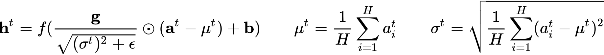

# 深度学习

[TOC]

## 微软研究院AI头条

> 主要记录自己在公众号 “微软研究院AI头条” 中学到的知识。

#### CVPR 2021 | 神经网络如何进行深度估计？

参考链接：[CVPR 2021 | 神经网络如何进行深度估计？](https://mp.weixin.qq.com/s/xdV3VHbSrgQa3G51KMHamA)

论文链接：[2104.00877.pdf (arxiv.org)](https://arxiv.org/pdf/2104.00877.pdf)

代码链接：https://github.com/microsoft/S2R-DepthNet

非常有意思的工作，进行单目图像的深度估计；

## 人工智能前沿讲习

> 主要记录自己在公众号 “人工智能前沿讲习” 中学到的知识。
>
> “他山之石，可以攻玉”，站在巨人的肩膀才能看得更高，走的更远。

#### 【他山之石】整理 Deep Learning 调参 tricks

参考链接：https://mp.weixin.qq.com/s/Gw8K0GggRcahwLf3tu4LrA

#### 【他山之石】深度学习中的那些 Trade-off

参考链接：https://mp.weixin.qq.com/s/RoEwx7qAUlSvjB608zOx1g

#### 【他山之石】tensorflow2.4性能调优最佳实践

参考链接：https://mp.weixin.qq.com/s/BI2BjAJGXzRk4k9d99PgLQ

- [【梦想做个翟老师】浅谈Tensorflow分布式架构：ring all-reduce算法](https://zhuanlan.zhihu.com/p/69797852)
- [【瓦特兰蒂斯】单机多卡的正确打开方式（二）：TensorFlow](https://fyubang.com/2019/07/14/distributed-training2/)

#### 【强基固本】机器学习常用评价指标总览

参考链接：https://mp.weixin.qq.com/s/MVw3IIno4iyTNaEOjBLzAQ

#### 【他山之石】Pytorch优化器及其内置优化算法原理介绍

参考链接：https://mp.weixin.qq.com/s/nWK0ci4qtKXJd-j--ZsC4Q

- [pytorch的计算图](https://zhuanlan.zhihu.com/p/33378444)
- [PyTorch 源码解读之 torch.autograd：梯度计算详解](https://zhuanlan.zhihu.com/p/321449610)
- [pytorch中 ctx 和 self 的区别](https://blog.csdn.net/littlehaes/article/details/103828130)：可以看到 `torch.nn.function` 中的 `apply` 这个方法已经在底层定义好了，并且我们自定义梯度回传时，要严格遵守 `forward / backward` 的参数定义——第一个参数使用 `cxt` 表示上下文信息，主要用来保存和读取变量，且 `backward` 返回的变量和 `forward` 输入的变量是相对应的；

#### 【源头活水】ICLR2021 | 显存不够？不妨抛弃端到端训练

参考链接：https://mp.weixin.qq.com/s/GJSSFSy25ltJxVweRaNEiw

- 论文链接：[Revisiting Locally Supervised Learning: an Alternative to End-to-end Training](https://openreview.net/forum?id=fAbkE6ant2)

- 论文代码：[InfoPro-Pytorch](https://github.com/blackfeather-wang/InfoPro-Pytorch)

- 传统端到端神经网络存在的问题：

  - **内存开销**：端到端训练需要在网络前传时将每一层的输出进行存储，并在逐层反传梯度时使用这些值，这造成了极大的显存开销；
  - **难以并行**：前传时深层网络必须等待浅层网络的计算完成后才能开始自身的前传过程；同理，反传时浅层网络需要等待来自深层网络的梯度信号才能进行自身的运算。这两点线性的限制使得端到端训练很难进行并行化以进一步的提升效率；

- 局部监督学习存在的问题及可能的原因：

  - 问题：往往损害网络的整体性能；
  - 原因：作者通过互信息分析后总结认为，**局部监督学习之所以会损害网络的整体性能，是因为其倾向于使网络在浅层丢失与任务相关的信息，从而使得深层网络空有更多的参数和更大的容量，却因输入特征先天不足而无用武之地**；

- 论文方法：论文提出了 `InfoPro` 损失函数，公式如下

  

  **其目标是使得局部模块能够在保证向前传递全部有价值信息的条件下，尽可能丢弃特征中的无用信息，以解决局部监督学习在浅层丢失任务相关信息、影响网络最终性能的问题**，示意图如下

  

  为了便于计算，作者去上式的上界，公式如下

  

  

#### 【综述专栏】深度学习模型泛化性小结

参考链接：https://mp.weixin.qq.com/s/2QngzZLxXkERMr5YDTfJvA

比较有意思的，文章从频域的角度去分析数据分布对模型泛化能力的影响，在一定程度上反映了对抗攻击能成功的原因，正是成功抓住了数据中高频的信息，这恰恰也是我们的深度神经网络所学习到的；（**不能全认可，可以当作对抗攻击成功的新视角：抓住了数据的高频特征**）

参考论文：[Wang H, Wu X, Huang Z, et al. High-frequency component helps explain the generalization of convolutional neural networks[C]//Proceedings of the IEEE/CVF Conference on Computer Vision and Pattern Recognition. 2020: 8684-8694.](https://arxiv.org/abs/1905.13545)

#### 【他山之石】反卷积和上采样

参考链接：https://mp.weixin.qq.com/s/IV3IjuOpChDRflvDNI29OA

反卷积的真实操作，原来是通过线性插值后，再卷积；

#### 【强基固本】最受欢迎的算法之一：反向传播训练

参考链接：https://mp.weixin.qq.com/s/53LUqB8Rm0lYSlhuyrhG0A

> 我们现在面临的问题是，计算神经网络中每个权重的偏导数。当一个方程具有多个变量时，我们使用偏导数。每个权重均被视为变量，因为这些权重将随着神经网络的变化而独立变化。**每个权重的偏导数仅显示每个权重对误差函数的独立影响**。该偏导数就是梯度。

#### 【综述专栏】DL：LSTM如何实现长短期记忆

参考链接：https://mp.weixin.qq.com/s/o_Xb5V5yGdSyDE_j6vtkFQ

#### 【综述专栏】深度学习中的图像分割：方法和应用

参考链接：[【综述专栏】深度学习中的图像分割：方法和应用 (qq.com)](https://mp.weixin.qq.com/s/YSscxoQrxya6PVndkZoKWg)

很简单地讲了一下图像分割问题。

#### 【他山之石】Pytorch优化器及其内置优化算法原理介绍

参考链接：[【他山之石】Pytorch优化器及其内置优化算法原理介绍 (qq.com)](https://mp.weixin.qq.com/s/nWK0ci4qtKXJd-j--ZsC4Q)

简单介绍了 Pytorch 中的优化器模块 torch.optim 的 API 调用逻辑，并且介绍了其中使用的参数优化算法。

## 其他杂项

> 记录其他杂七杂八看的东西

### AIC 和 BIC 准则

#### Notes

模型选择问题在 **模型复杂度** 与 **模型对数据集描述能力** 之间寻求最佳平衡；

##### AIC 准则

赤池信息准则（Akaike Information Criterion，AIC），AIC 定义为：
$$
AIC=2k−2ln(L)
$$
其中 $k$ 为参数个数，$L$ 为似然函数。从一组可供选择的模型中选择最佳模型时，**通常选择 AIC 最小的模型**：

- 当两个模型之间存在较大差异时，差异主要体现在似然函数项，当似然函数差异不显著时，上式第一项，即模型复杂度则起作用，从而**参数个数少**的模型是较好的选择；
- 一般而言，当模型复杂度提高（$k$ 增大）时，似然函数 $L$ 也会增大，从而使 AIC 变小，但是 $k$ 过大时，似然函数增速减缓，导致 AIC 增大，模型过于复杂容易造成过拟合现象;
- 目标是选取AIC最小的模型，AIC不仅要提高模型拟合度（极大似然），而且引入了惩罚项，使模型参数尽可能少，有助于降低过拟合的可能性；

##### BIC 准则

贝叶斯信息准则（Bayesian Information Criterion，BIC），BIC 定义为：
$$
BIC=kln(n)−2ln(L)
$$
其中，$k$ 为模型参数个数，$n$ 为样本数量，$L$ 为似然函数。从一组可供选择的模型中选择最佳模型时，**通常选择 BIC 最小的模型**；

##### 比较

AIC 和BIC 的公式中后半部分是一样的；当 $n \ge 10^2$ 时，$kln(n)≥2k$，所以，BIC 相比AIC 在**大数据量时对模型参数惩罚得更多**，导致 BIC 更倾向于选择参数少的简单模型。所以还是**考虑使用 BIC 准则**；

#### Links

- 参考链接：[AIC和BIC准则详解](https://blog.csdn.net/SanyHo/article/details/108024024)

### 交叉熵、相对熵、JS 散度

#### 熵

熵（信息熵）指的是信息量的期望；
$$
H(X) = -\sum_{i=1}^n p(x_i) \log (p(x_i))
$$

#### 相对熵（KL 散度）

相对熵（KL 散度）用来衡量两个分布的差异；
$$
D_{KL}(p||q) = \sum_{i=1}^n p(x_i) \ log \left(\frac{p(x_i)}{q(x_i)} \right)
$$
相对熵是非对称的，使用时 $p(x)$ 用来表示样本的真实分布，而 $q(x)$ 用来表示模型所预测的分布；

#### 交叉熵

交叉熵可以通过相对熵变化而来，在机器学习中通常直接用交叉熵作为损失函数；
$$
H(p,q) = -\sum_{i=1}^n p(x_i)\log(q(x_i))
$$

#### JS 散度

JS 散度用来衡量两个分布的相似度，是基于相对熵的变体，解决了相对熵的非对称问题；
$$
JS(P_1||P_2) = \frac{1}{2} KL(P_1||\frac{P_1 + P_2}{2}) + \frac{1}{2} KL(P_2||\frac{P_1+P_2}{2})
$$

#### Wasserstein 距离

Wasserstein 距离用来度量两个概率分布之间的距离，解决了当两个分布 $P$, $Q$ 相差很远时，KL 散度和 JS 散度梯度消失的问题；
$$
W(P_1, P_2) = \inf_{\gamma \sim \Pi(P_1, P_2)} \mathbb{E}_{(x,y)\sim\gamma}[\lVert x-y \rVert]
$$

### Optimizer in Deep Learning

#### 梯度下降法（Gradient Descent）

梯度下降法的计算过程就是沿梯度下降的方向求解极小值，也可以沿梯度上升方向求解最大值。使用梯度下降法更新参数：
$$
\theta_{t+1} = \theta_t - \alpha \cdot \nabla_{\theta} J(\theta)
$$

##### 批量梯度下降法（BGD）

在整个训练集上计算梯度，对参数进行更新：
$$
\theta_{t+1} = \theta_t - \alpha \cdot \frac{1}{n} \cdot \sum_{i=1}^{n}\nabla_\theta J_i(\theta, x^i, y^i)
$$
因为要计算整个数据集，收敛速度慢，但其优点在于更趋近于全局最优解；

##### 	随机梯度下降法（SGD）

每次只随机选择一个样本计算梯度，对参数进行更新：
$$
\theta_{t+1} = \theta_t - \alpha \cdot \nabla_\theta J_i(\theta,x^i,y^i)
$$
训练速度快，但是容易陷入局部最优点，导致梯度下降的波动非常大；

##### 	小批量梯度下降法（Mini-batch Gradient Descent）

每次随机选择 n 个样本计算梯度，对参数进行更新：
$$
\theta_{t+1} = \theta_t  - \alpha \cdot \frac{1}m \cdot \sum_{i=x}^{i=x+m-1} \cdot \nabla_\theta J_i(\theta, x^i, y^i)
$$
这种方法是 BGD 和 SGD 的折衷；

#### 动量优化法

##### 	Momentum

参数更新时在一定程度上保留之前更新的方向，同时又利用当前 batch 的梯度微调最终的更新方向。在 SGD 的基础上增加动量，则参数更新公式如下：
$$
m_{t+1} = \mu \cdot m_t + \alpha \cdot \nabla_\theta J(\theta) \\
\theta_{t+1} = \theta_t - m_{t+1}
$$
在梯度方向发生改变时，Momentum 能够降低参数更新速度，从而减少震荡；在梯度方向相同时，Momentum 可以加速参数更新，从而加速收敛。

##### 	NAG（Nesterov Accelerated Gradient）

与 Momentum 不同的是，NAG 是在更新梯度是做一个矫正，即提前往前探一步，并对梯度作修改。参数更新公式如下：
$$
m_{t+1} = \mu \cdot m_t + \alpha \cdot \nabla_\theta J(\theta - \mu \cdot m_t)
\\
\theta_{t+1} = \theta_t - m_{t+1}
$$
两者的对比：蓝色为 Momentum， 剩下的是 NAG；

#### 自适应学习率

##### 	AdaGrad

AdaGrad 算法期望在模型训练时有一个较大的学习率，而随着训练的不断增多，学习率也跟着下降。参数更新公式如下：
$$
g \leftarrow \nabla_\theta J(\theta) \\
r \leftarrow r + g^2 \\
\Delta \theta \leftarrow \frac{\delta}{\sqrt{r+\epsilon}} \cdot g \\
\theta \leftarrow \theta - \Delta \theta
$$
学习率随着 **梯度的平方和**（$r$）的增加而减少. 缺点：

- 需要手动设置学习率 $\delta$ ，如果 $\delta$ 过大，会使得正则化项 $\frac{\delta}{\sqrt{r+\epsilon}}$ 对梯度的调节过大；
- 中后期，参数的更新量会趋近于 0，使得模型无法学习；

##### 	Adadelta

Adadelta 算法将 梯度的平方和 改为 **梯度平方的加权平均值**。参数更新公式如下：
$$
g_t \leftarrow \nabla_\theta J(\theta) \\
E[g^2]_t \leftarrow \gamma \cdot E[g^2]_{t-1} + (1-\gamma) \cdot g_t^2 \\
\Delta \theta_t \leftarrow - \frac{\eta}{\sqrt{E[g^2]_t + \epsilon}} \cdot g_t \\
\theta_{t+1} \leftarrow \theta_t + \Delta \theta_t
$$
上式中仍存在一个需要自己设置的全局学习率 $\eta$，可以通过下式**消除全局学习率的影响**：
$$
E[\Delta\theta^2]_t \leftarrow \gamma \cdot E[\Delta\theta^2]_{t-1} + (1-\gamma) \cdot \Delta\theta_t^2 \\
\Delta \theta_t \leftarrow - \frac{\sqrt{E[\Delta\theta^2]_{t-1}+\epsilon}}{\sqrt{E[g^2]_t+\epsilon}} \cdot g_t \\
\theta_{t+1} \leftarrow \theta_t + \Delta\theta_t
$$

##### 	RMSProp

RMSProp 算法是 AdaGrad 算法的改进，修改 梯度平方和 为 **梯度平方的指数加权移动平均**，解决了学习率急剧下降的问题。参数更新公式如下：
$$
g_t \leftarrow \nabla_\theta J(\theta) \\
E[g^2]_t \leftarrow \rho \cdot E[g^2]_{t-1} + (1-\rho) \cdot g_t^2 \\
\Delta\theta \leftarrow \frac{\delta}{\sqrt{E[g^2]_t+\epsilon}} \cdot g \\
\theta \leftarrow \theta - \Delta\theta
$$

##### 	Adam（Adaptive Moment Estimation）

Adam 算法在动量的基础上，结合了偏置修正。参数更新公式如下：
$$
g_t \leftarrow \Delta_\theta J(\theta) \\
m_t \leftarrow \beta_1 \cdot m_{t-1} + (1-\beta_1) \cdot g_t \\
v_t \leftarrow \beta_2 \cdot v_{t-1} + (1-\beta_2) \cdot g_t^2 \\
\hat{m}_t \leftarrow \frac{m_t}{1-(\beta_1)^t} \\
\hat{v}_t \leftarrow \frac{v_t}{1-(\beta_2)^t} \\
\theta_{t+1} = \theta_t - \frac{\delta}{\sqrt{\hat{v}_t}+\epsilon} \cdot\hat{m}_t
$$
论文伪代码：

#### Links

- 参考链接：[优化算法 Optimizer 比较和总结](https://zhuanlan.zhihu.com/p/55150256)
- Adam 论文链接：[Kingma D P, Ba J. Adam: A method for stochastic optimization[J]. arXiv preprint arXiv:1412.6980, 2014.](https://arxiv.org/abs/1412.6980)

### 神经网络中的 Normalization 的发展历程

> 参考链接：[[笔记] 神经网络中 Normalization 的发展历程](https://zhuanlan.zhihu.com/p/75539170)

##### Local Response Normalization

(1) 重要思想：借鉴“侧抑制”（Lateral Inhibitio）的思想实现**局部神经元抑制**，即使得局部的神经元产生竞争机制，使其中响应值大的变得更大，响应值小的变得更小（<u>这一点我从数值上并没有看不出来</u>）；<u>在运用 Local Response Normalization 过程中，我觉得需要注意的是它是对 **FeatureMap** 的一个正则化操作</u>

(2) 公式：

其中，$i,j$ 表示 FeatureMap 的索引，$a_{(x,y)}^j$ 表示第 $j$ 个 FeatureMap 中位于 $(x,y)$ 处的响应值；常用的值为：$k=2, n=5,\alpha=10^{-4}, \beta=0.75$ 。

(3) 2015 年的 VGG 中发现 Local Response Normalization 的方法并没有什么作用，故后来很少再被采用；

(4) 参考链接：

- [深度学习饱受争议的局部响应归一化(LRN)详解](https://blog.csdn.net/qq_27825451/article/details/88745034#:~:text=%E5%89%8D%E8%A8%80%EF%BC%9ALocal%20Response%20Normalization(LRN,%E6%A8%A1%E5%9E%8B%E4%B8%AD%E6%8F%90%E5%87%BA%E8%BF%99%E4%B8%AA%E6%A6%82%E5%BF%B5%E3%80%82))

##### Batch Normalization

(1) 主要思想：使用 Batch Normalization 层能够**使网络的训练更加稳定**，**加速神经网络的收敛速度**（当网络训练的收敛速度慢时可以考虑使用 BN 层），使得神经网络**对于初始化的敏感度下降**，并且**具有一定的正则化效果**；知乎大佬说 BN 层的优势是可以**防止“梯度弥散”**（<u>我感觉不出来</u>）；

(2) 公式：

其中，$\gamma$ 和 $\beta$ 两个仿射参数，是为了经过 BN 层处理后的数据仍**可以**恢复到之前的分布，从而**提升了网络结构的 Capacity**，即在做出一定改变的同时，仍保留之前的能力。注意，**上面用的是 “可以” 这个词汇，具体“是不是”**，还是要看模型训练的结果，训练的过程即**正常的求导梯度下降法**，公式如下：

(3) 代码实现：

- 使用注意点：

  - `batch_size` 应该尽可能设置得大一些；
  - 建议将bn层放在卷积层和激活层（例如 `Relu`）之间，且卷积层不要使用偏置 bias；

- [PyTorch](https://pytorch.org/docs/stable/generated/torch.nn.BatchNorm2d.html)：

  

  - 可以设置 `affine=False`，则不再设置后面的仿射参数；
  - 当设置（默认值） `track_running_state=True` 时，模型会使用动量法更新**两个全局的动态统计量** `running_mean` 和 `running_var`来归一定输入的 `mini_batch`；如何设置 `track_running_state=False` 时，则模型直接使用 `mini_batch` 作为统计量；（所以在测试的时候，最好就是将这个设置为 `False`）
  - 在模型预测阶段，我们需要设置 BN 层 `training=False`，即直接使用 `model.eval()`；

- [Tensorflow](https://www.tensorflow.org/api_docs/python/tf/keras/layers/BatchNormalization)：（这里以 Tensorflow 2 为主，具体分析的话，可以发现它和 Tensorflow 1 的很多形为存在不同之处）

  

  

  - 可以看到，Tensorflow 在设计上和 pytorch 有所不同，tensorflow 直接将 BN 层设计成了 `traning` 模式 和 `inference` 模式；在 `traning` 模式下，模型会不断更新 `moving_mean` 和 `moving_var` 这两个变量，`mini_batch`的统计量直接由输入得到；而在 `inference` 模式下，模型则固定 `moving_mean` 和 `moving_var` 两个变量作为 `mini_batch` 的统计量（<u>这可能就是基于了同分布的假设</u>）；至于这个模式的变换，通过在调用 BN 层时设置一个 **`trainig`** 参数实现，下面具体看一下他的文档

  

  

  - BN 层含有两个比较关键的参数，`trainable` 用来表示 BN 层是否可训练，控制的是上面的仿射参数的状态；`training` 参数则用来控制 `inference` 状态；另外，当设置 `trainable=False` 时，tensorflow 2 中的 BN 层将自动进入 `inference` 状态（这个和 tensorflow 1 不同）；
  - 在 `model.compile()` 之后修改 BN 层的 `trainable` 属性，需要重新调用 `model.compile()` 才会起作用；

(4) 参考链接：

- [深度学习中 Batch Normalization为什么效果好？](https://www.zhihu.com/question/38102762/answer/85238569)
- [Batch Normalization详解以及pytorch实验](https://blog.csdn.net/qq_37541097/article/details/104434557)

##### Weight Normalization

(1) 主要思想：相比于 BN 层，WN 层并不是对输入的特征数据进行归一化操作，而是**对神经网络中指定的层的参数做归一化操作**；WN 层摆脱了对于 Batch 的依赖，这意味着 WN 层完全可以用在 RNN 网络中，以及对于噪声敏感的任务；WN 层的计算成本低，可以**减少模型的运行时间**；

(2) 公式：将参数 $w$ 拆分成方向和长度两个部分
$$
y = \Phi(w*x + b) \Rightarrow y=\Phi(g*\frac{v}{||v||} * x + b)
$$
我们把公式转换一下，就可以发现 **BN 层其实等同于使用参数的统计值对数据进行归一化**，
$$
\Rightarrow y = \Phi(gv * \frac{v}{||v||} + b)
$$
参数的学习，直接通过梯度下降的方法即可
$$
\nabla_g L = \frac{\nabla_{\mathbf w}L \cdot \mathbf{v}}{||\mathbf{v}||} \qquad \nabla_{\mathbf{v}} L = \frac{g}{||\mathbf{v}||} \nabla_{\mathbf{w}} L - \frac{g\nabla_g L}{||\mathbf{v}||^2} \mathbf{v}
$$
(3) 参考链接：

- [模型优化之Weight Normalization](https://zhuanlan.zhihu.com/p/55102378)
- [详解深度学习中的Normalization，BN/LN/WN](https://zhuanlan.zhihu.com/p/33173246)

##### Layer Normalization

(1) 主要思想：LN 层和 BN 层非常相似，不同之处在于，BN 层是对一个 Batch 中的**所有样本的不同维度**做 Normalization，而 LN 是对**单个样本的所有维度**做 Normalization；LN 层是为了解决 BN 层**对 `batch` 数据和内存的依赖**，并**减少 normalization 的时间**；

(2) 公式：（注意，**这里的统计量是一个标量**）

在 RNN 中，我们对每个时间片的输入都使用 LN 层来进行归一化，$t$ 时刻循环网络层的输入可以表示为：

则可以在 $\mathbb{a}^t$ 上应用 LN 层：

(3) 参考链接：

- [模型优化之Layer Normalization](https://zhuanlan.zhihu.com/p/54530247)

##### Instance Normalization

(1) 主要思想：IN 层和 LN 层相似，仅**对单个样本进行归一化，但是 IN 层并不进行仿射变换**；

(2) 公式：

这边需要注意，IN 层和 LN 层还有一点不同是，**IN 层是作用在 FeatureMap 的单个 Channel 上的**，所以它计算出来的统计量是一个向量；

(3) 代码：

- [PyTorch](https://pytorch.org/docs/stable/generated/torch.nn.InstanceNorm2d.html)：

可以看到，代码中也有一个 `track_running_stats` 参数；并且，可以设置 `affine=True` 来额外添加仿射参数；

- [Tensorflow](https://www.tensorflow.org/addons/api_docs/python/tfa/layers/InstanceNormalization)：

  

  Tensorflow 2 中，IN 层则在 `tensorflow_addons` 包中；

(4) 有两个场景建议不要使用 IN 层：

- **MLP 或者 RNN 中**：因为在 MLP 或者 RNN 中，每个通道上只有一个数据，这时会自然不能使用 IN；
- **FeatureMap 比较小时**：因为此时 IN 的采样数据非常少，得到的归一化统计量将不再具有代表性；

(5) 参考链接：

- [模型优化之Instance Normalization](https://zhuanlan.zhihu.com/p/56542480)

##### Consine Normalization

(1) 主要思想：CN 层和前面的思想都不太一样，其不对输入数据做归一化，也不对参数做归一化，而是对输入数据和参数之间的点乘做出改动，改为**计算两者的余弦相似度** $\cos(\theta)$；**CN 层将模型的输出进行归一化，使得输出有界，但是也因此丢弃了原本输出中所含的 Scale 信息，所以其作用有待探讨**；

(2) 公式：
$$
w*x \Rightarrow \frac{w*x}{|w| * |x|}
$$

##### Group Normalization

(1) 主要思想：**GN 层更像是 LN 层和 IN 层的一般化形式，通过参数 $G$ 进行控制**；当 $G=1$，GN 层即等价于 IN 层；当 $G=C$ 时，GN 层即等价于 LN 层；

(2) 公式：

