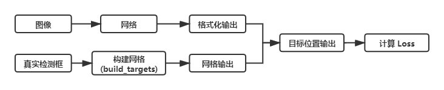
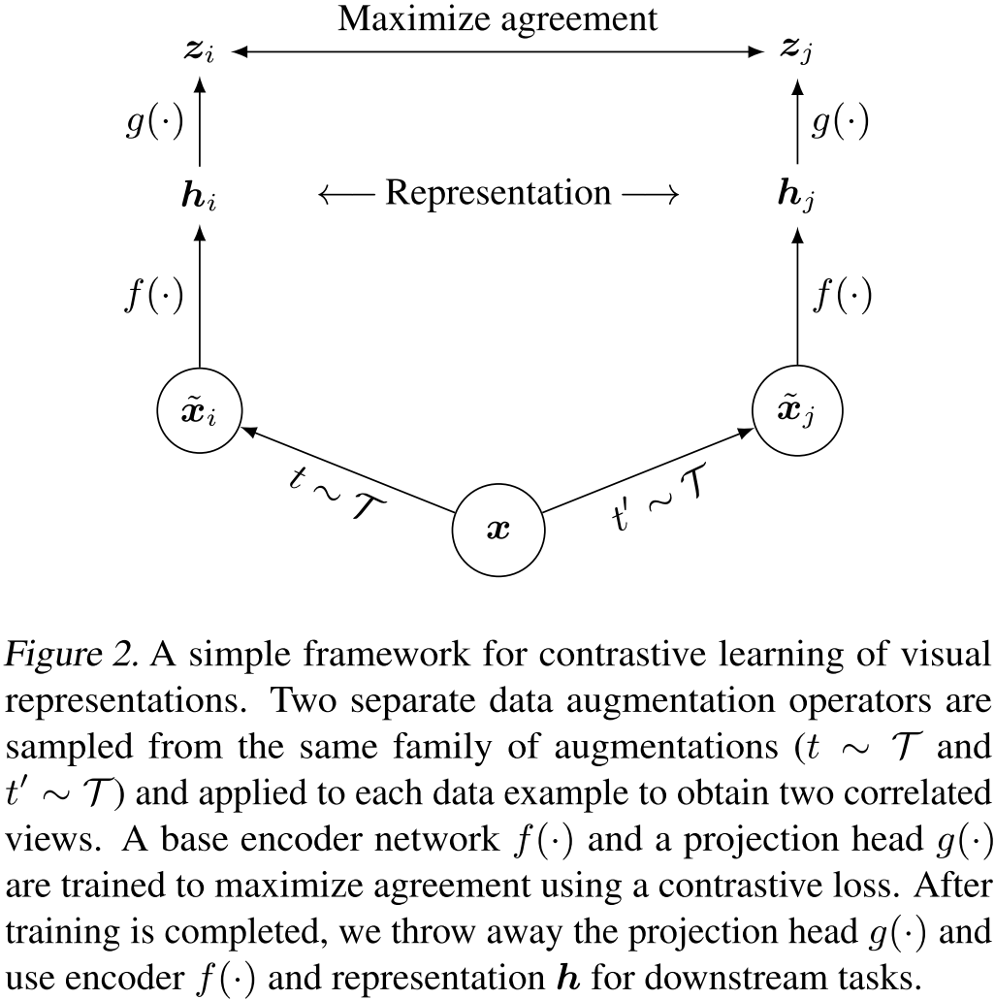

# 深度学习

[TOC]

## 语音杂谈

> 主要记录在公众号 “语音杂谈” 中学到的知识点


#### 声音克隆风险

参考链接：https://mp.weixin.qq.com/s/90OegQqlbQiMCyHFNDShfQ


#### 傅里叶变换取代Transformer自注意力层，谷歌这项研究GPU上快7倍、TPU上快2倍

参考链接：[傅里叶变换取代Transformer自注意力层，谷歌这项研究GPU上快7倍、TPU上快2倍 (qq.com)](https://mp.weixin.qq.com/s/JfRy7FLGdW23KuOf2jwy2Q)


## 微软研究院AI头条

> 主要记录自己在公众号 “微软研究院AI头条” 中学到的知识。


#### CVPR 2021 | 神经网络如何进行深度估计？

参考链接：[CVPR 2021 | 神经网络如何进行深度估计？](https://mp.weixin.qq.com/s/xdV3VHbSrgQa3G51KMHamA)

论文链接：[2104.00877.pdf (arxiv.org)](https://arxiv.org/pdf/2104.00877.pdf)

代码链接：https://github.com/microsoft/S2R-DepthNet

非常有意思的工作，进行单目图像的深度估计；


## 腾讯研究院

#### 如何让 NPC 更像真人？

参考链接：https://mp.weixin.qq.com/s/p-Yipsdu6vttxJfCSi9lnQ

对于强化学习什么的，倒是没学进去什么，但是理解了游戏背后的一些逻辑：人们更期望和更智能的角色一起游戏，当AI实现不了时，游戏采用玩家对战的形式；


## 蚂蚁安全实验室

> 主要记录自己在公众号 “蚂蚁安全实验室” 中学到的知识。


#### 【黑灰产】如何让“伪造图像”检测技术跳出GANs桎梏，更经得起现实的“毒打”？


由于 GAN 生成（我更愿意称其为 补全）的图像中，补全部分的噪声是比较少的（大概是因为 GAN 算法本身生成的像素点比较平滑），所以这个工作就借助降噪算法配合多尺度的卷积神经网络，来检测图像中用 GAN 补全的部分。


## 瑞莱智慧RealAI

#### 瑞莱智慧发布人工智能安全靶场，建设新型人工智能安全防御体系

参考链接：https://mp.weixin.qq.com/s/J7f91TXGLktKSCMQ2D_-BA

未来要向这种安全靶场进行发展，提高企业自身 AI安全能力，并且扩展 AI安全业务。


## 量子位

#### AAAI第二届“AI诺奖”出炉，百万美元奖金颁给批判黑箱、推广可解释AI的杜克大学女教授

参考连接：https://mp.weixin.qq.com/s/UtryNM9KEXZpqbxybYze6Q

**Cynthia Rudin** 教授的思想是：我们对深度学习模型的解释，仍然是对模型行为的一种猜测，这样的工作是没有意义的；我们应该专注于可解释的模型（<font color=red>**Interpretable**</font>），而非去解释模型（<font color=red>**Explainable**</font>）。


## 机器之心

#### patch 成为了 ALL You Need？挑战ViT、MLP-Mixer的简单模型来了

参考链接：https://mp.weixin.qq.com/s/R9GE-L_2LbjUcaAwKnKrAQ

论文链接：https://openreview.net/pdf?id=TVHS5Y4dNvM

代码链接：https://github.com/tmp-iclr/convmixer

#### 基于残差UNet架构 ，一键分离伴奏和人声

参考链接：[字节跳动这项研究火了：基于残差UNet架构 ，一键分离伴奏和人声](https://mp.weixin.qq.com/s/6qyl0m0HHCqGkdHzacLkfA)

论文链接：[Kong Q, Cao Y, Liu H, et al. Decoupling magnitude and phase estimation with deep resunet for music source separation[J]. arXiv preprint arXiv:2109.05418, 2021.](https://arxiv.org/pdf/2109.05418.pdf)

Demo 链接：https://huggingface.co/spaces/akhaliq/Music_Source_Separation

代码链接：https://github.com/bytedance/music_source_separation

使用ResUNet架构，进行伴奏和人声的分离。实验效果如下：


从 Github 的评论区来看，这个工作收到数据集的制约，只是在部分歌曲上的效果比较好，仍然有很大的提升空间；从开源的角度来看，Spleeter 是目前Github 上面 star 最多的工作；

#### 百度语音技术重要进展：基于历史信息抽象的流式截断conformer建模SMLTA2

参考链接：https://mp.weixin.qq.com/s/OrxzJBZmN89naPamHCAQpA


可以简单地了解下语音识别的发展趋势，可以看到 Transformer 这种网络在语音上面越来越火，应用越来越多。<u>但是百度的这次对外发声还是特别弱的，No paper，No Open-source Codes，我不是很喜欢他们这样的工作，窥探不到他们的细节</u>。

#### 超越整句的流式多级Attention：解密百度输入法背后的语音识别模型

参考链接：https://zhuanlan.zhihu.com/p/55330861

多方言语音识别的部分值得关注：


#### 年度回顾 | 从九大国际AI顶会接收论文一窥ML算法趋势（上）

参考链接：https://mp.weixin.qq.com/s/Con1jDtNG1v02P_coMfEpw

AI 方向不仅在SOTA模型上做出相应的进步，而且不断向模型的可解释性进行发展；

> 我们研究AI内生安全的工作者，更应该去学习这些模型可解释性相关的内容；


## 人工智能前沿讲习

> 主要记录自己在公众号 “人工智能前沿讲习” 中学到的知识。
>
> “他山之石，可以攻玉”，站在巨人的肩膀才能看得更高，走的更远。


#### 【他山之石】整理 Deep Learning 调参 tricks

参考链接：https://mp.weixin.qq.com/s/Gw8K0GggRcahwLf3tu4LrA


#### 【他山之石】深度学习中的那些 Trade-off

参考链接：https://mp.weixin.qq.com/s/RoEwx7qAUlSvjB608zOx1g


#### 【他山之石】tensorflow2.4性能调优最佳实践

参考链接：https://mp.weixin.qq.com/s/BI2BjAJGXzRk4k9d99PgLQ

- [【梦想做个翟老师】浅谈Tensorflow分布式架构：ring all-reduce算法](https://zhuanlan.zhihu.com/p/69797852)
- [【瓦特兰蒂斯】单机多卡的正确打开方式（二）：TensorFlow](https://fyubang.com/2019/07/14/distributed-training2/)


#### 【强基固本】机器学习常用评价指标总览

参考链接：https://mp.weixin.qq.com/s/MVw3IIno4iyTNaEOjBLzAQ


#### 【他山之石】Pytorch优化器及其内置优化算法原理介绍

参考链接：https://mp.weixin.qq.com/s/nWK0ci4qtKXJd-j--ZsC4Q

- [pytorch的计算图](https://zhuanlan.zhihu.com/p/33378444)
- [PyTorch 源码解读之 torch.autograd：梯度计算详解](https://zhuanlan.zhihu.com/p/321449610)
- [pytorch中 ctx 和 self 的区别](https://blog.csdn.net/littlehaes/article/details/103828130)：可以看到 `torch.nn.function` 中的 `apply` 这个方法已经在底层定义好了，并且我们自定义梯度回传时，要严格遵守 `forward / backward` 的参数定义——第一个参数使用 `cxt` 表示上下文信息，主要用来保存和读取变量，且 `backward` 返回的变量和 `forward` 输入的变量是相对应的；


#### 【源头活水】ICLR2021 | 显存不够？不妨抛弃端到端训练

参考链接：https://mp.weixin.qq.com/s/GJSSFSy25ltJxVweRaNEiw

- 论文链接：[Revisiting Locally Supervised Learning: an Alternative to End-to-end Training](https://openreview.net/forum?id=fAbkE6ant2)

- 论文代码：[InfoPro-Pytorch](https://github.com/blackfeather-wang/InfoPro-Pytorch)

- 传统端到端神经网络存在的问题：

  - **内存开销**：端到端训练需要在网络前传时将每一层的输出进行存储，并在逐层反传梯度时使用这些值，这造成了极大的显存开销；
  - **难以并行**：前传时深层网络必须等待浅层网络的计算完成后才能开始自身的前传过程；同理，反传时浅层网络需要等待来自深层网络的梯度信号才能进行自身的运算。这两点线性的限制使得端到端训练很难进行并行化以进一步的提升效率；

- 局部监督学习存在的问题及可能的原因：

  - 问题：往往损害网络的整体性能；
  - 原因：作者通过互信息分析后总结认为，**局部监督学习之所以会损害网络的整体性能，是因为其倾向于使网络在浅层丢失与任务相关的信息，从而使得深层网络空有更多的参数和更大的容量，却因输入特征先天不足而无用武之地**；

- 论文方法：论文提出了 `InfoPro` 损失函数，公式如下

  

  **其目标是使得局部模块能够在保证向前传递全部有价值信息的条件下，尽可能丢弃特征中的无用信息，以解决局部监督学习在浅层丢失任务相关信息、影响网络最终性能的问题**，示意图如下

  

  为了便于计算，作者去上式的上界，公式如下

  

  


#### 【综述专栏】深度学习模型泛化性小结

参考链接：https://mp.weixin.qq.com/s/2QngzZLxXkERMr5YDTfJvA

比较有意思的，文章从频域的角度去分析数据分布对模型泛化能力的影响，在一定程度上反映了对抗攻击能成功的原因，正是成功抓住了数据中高频的信息，这恰恰也是我们的深度神经网络所学习到的；（**不能全认可，可以当作对抗攻击成功的新视角：抓住了数据的高频特征**）


参考论文：[Wang H, Wu X, Huang Z, et al. High-frequency component helps explain the generalization of convolutional neural networks[C]//Proceedings of the IEEE/CVF Conference on Computer Vision and Pattern Recognition. 2020: 8684-8694.](https://arxiv.org/abs/1905.13545)


#### 【他山之石】反卷积和上采样

参考链接：https://mp.weixin.qq.com/s/IV3IjuOpChDRflvDNI29OA

反卷积的真实操作，原来是通过线性插值后，再卷积；


#### 【强基固本】最受欢迎的算法之一：反向传播训练

参考链接：https://mp.weixin.qq.com/s/53LUqB8Rm0lYSlhuyrhG0A

> 我们现在面临的问题是，计算神经网络中每个权重的偏导数。当一个方程具有多个变量时，我们使用偏导数。每个权重均被视为变量，因为这些权重将随着神经网络的变化而独立变化。**每个权重的偏导数仅显示每个权重对误差函数的独立影响**。该偏导数就是梯度。


#### 【综述专栏】DL：LSTM如何实现长短期记忆

参考链接：https://mp.weixin.qq.com/s/o_Xb5V5yGdSyDE_j6vtkFQ


#### 【综述专栏】深度学习中的图像分割：方法和应用

参考链接：[【综述专栏】深度学习中的图像分割：方法和应用 (qq.com)](https://mp.weixin.qq.com/s/YSscxoQrxya6PVndkZoKWg)

很简单地讲了一下图像分割问题。


#### 【他山之石】Pytorch优化器及其内置优化算法原理介绍

参考链接：[【他山之石】Pytorch优化器及其内置优化算法原理介绍 (qq.com)](https://mp.weixin.qq.com/s/nWK0ci4qtKXJd-j--ZsC4Q)

简单介绍了 Pytorch 中的优化器模块 torch.optim 的 API 调用逻辑，并且介绍了其中使用的参数优化算法。


#### 【综述专栏】目标检测综述整理

参考链接：[【综述专栏】目标检测综述整理 (qq.com)](https://mp.weixin.qq.com/s/R4hZ6jSKAquyhV6bWuMHDQ)

罗列了目标检测的6篇综述文章。


#### 【综述专栏】十分钟理解Transformer

参考链接：[【综述专栏】十分钟理解Transformer](https://mp.weixin.qq.com/s/nIdXxd1rSlCPSTLFuzXorg)

解释了 Transformer 的内部结构。


#### 【他山之石】TensorRT部署深度学习模型

参考链接：[【他山之石】TensorRT部署深度学习模型](https://mp.weixin.qq.com/s/5DKat7rpAPks0wOWuBkKbA)

TensorRT 官网：https://developer.nvidia.com/zh-cn/tensorrt

TensorRT 等用于深度学习模型部署的框架，确实能够带来性能的大量提升，但是他和深度学习框架的其他应用点（如可解释性方法）一样，只对部分简单的神经网络层支持，所以对于大型复杂的神经网络，还需要企业、框架本身和个人共同做出努力；


#### 【他山之石】PyTorch | 优化神经网络训练的17种方法

参考链接：[【他山之石】PyTorch | 优化神经网络训练的17种方法](https://mp.weixin.qq.com/s/3VCQFt0wn_7R9ehamjiw_w?forceh5=1)

介绍了17个可以加速神经网络训练的 trick。<u>AI 真是个神奇的东西。</u>


#### 【综述专栏】推荐系统里预训练的工作

参考链接：[【综述专栏】推荐系统里预训练的工作](https://mp.weixin.qq.com/s/fFgOvOa3mjOsYWYC6r1vog)

推荐系统中使用的预训练相关的工作。


#### 【他山之石】深度学习代码中argparse以及yaml文件的使用

参考链接：[【他山之石】深度学习代码中argparse以及yaml文件的使用](https://mp.weixin.qq.com/s/73Eycrgkhl06M3JGJOl-Og)

文章讲解了如何使用 argparse 和 yaml 文件，已经他们的混合使用方式，算是比较基础的知识点。


## FreeBuf

#### 研究表明：苹果CSAM扫描算法很容易“上当受骗”

> 我一味的这个点子不能发一篇论文吧。结果别人真的就发了一篇论文，所以说以后还是要大胆尝试。

参考链接：[研究表明：苹果CSAM扫描算法很容易“上当受骗”](https://mp.weixin.qq.com/s/a9rnVoEJ0Jd6IXULC7G-CA)

论文链接：[Jain S, Cretu A M, de Montjoye Y A. Adversarial Detection Avoidance Attacks: Evaluating the robustness of perceptual hashing-based client-side scanning[J]. Usenix 2022.](https://www.usenix.org/conference/usenixsecurity22/presentation/jain)

让这些扫描算法出错是非常容易的事情，未来还需要更加鲁棒的扫描算法，同时，设计者还需要考虑用户隐私的问题。


## InfoQ

#### 详解SoundStream：一款端到端的神经音频编解码器

参考链接：https://mp.weixin.qq.com/s/0SL0PkL1C1bAveMak4e6hQ

论文链接：[Zeghidour N, Luebs A, Omran A, et al. SoundStream: An End-to-End Neural Audio Codec[J]. arXiv preprint arXiv:2107.03312, 2021.](https://arxiv.org/pdf/2107.03312.pdf)

Google 新推出的神经网络音频编解码器，主打在超低码率（3 kbps）下的编解码保真率，实验对比如下：


模型的框架如下：


其他神经网络音频编解码器相关的工作如下：

- Opus：https://github.com/xiph/opus
- Lyra：https://github.com/google/lyra


## 新智元

#### 谷歌翻译陷入「辱华」风波：夹带私货还是训练语料背锅？

> 思考：如何能够尽早检查出这类“敏感性”错误？

参考链接：https://mp.weixin.qq.com/s/uqdFY6E9aueCUR_8jzbM9Q

谷歌翻译结果出错，涉及一些敏感性词汇，涉及到"辱华"嫌疑。


## 零散知识点

> 记录其他杂七杂八看的东西

### AIC 和 BIC 准则

#### Notes

模型选择问题在 **模型复杂度** 与 **模型对数据集描述能力** 之间寻求最佳平衡；

##### AIC 准则

赤池信息准则（Akaike Information Criterion，AIC），AIC 定义为：
$$
AIC=2k−2ln(L)
$$
其中 $k$ 为参数个数，$L$ 为似然函数。从一组可供选择的模型中选择最佳模型时，**通常选择 AIC 最小的模型**：

- 当两个模型之间存在较大差异时，差异主要体现在似然函数项，当似然函数差异不显著时，上式第一项，即模型复杂度则起作用，从而**参数个数少**的模型是较好的选择；
- 一般而言，当模型复杂度提高（$k$ 增大）时，似然函数 $L$ 也会增大，从而使 AIC 变小，但是 $k$ 过大时，似然函数增速减缓，导致 AIC 增大，模型过于复杂容易造成过拟合现象;
- 目标是选取AIC最小的模型，AIC不仅要提高模型拟合度（极大似然），而且引入了惩罚项，使模型参数尽可能少，有助于降低过拟合的可能性；

##### BIC 准则

贝叶斯信息准则（Bayesian Information Criterion，BIC），BIC 定义为：
$$
BIC=kln(n)−2ln(L)
$$
其中，$k$ 为模型参数个数，$n$ 为样本数量，$L$ 为似然函数。从一组可供选择的模型中选择最佳模型时，**通常选择 BIC 最小的模型**；

##### 比较

AIC 和BIC 的公式中后半部分是一样的；当 $n \ge 10^2$ 时，$kln(n)≥2k$，所以，BIC 相比AIC 在**大数据量时对模型参数惩罚得更多**，导致 BIC 更倾向于选择参数少的简单模型。所以还是**考虑使用 BIC 准则**；

#### Links

- 参考链接：[AIC和BIC准则详解](https://blog.csdn.net/SanyHo/article/details/108024024)


### 交叉熵、相对熵、JS 散度

#### 熵

熵（信息熵）指的是信息量的期望；
$$
H(X) = -\sum_{i=1}^n p(x_i) \log (p(x_i))
$$

#### 相对熵（KL 散度）

相对熵（KL 散度）用来衡量两个分布的差异；
$$
D_{KL}(p||q) = \sum_{i=1}^n p(x_i) \ log \left(\frac{p(x_i)}{q(x_i)} \right)
$$
相对熵是非对称的，使用时 $p(x)$ 用来表示样本的真实分布，而 $q(x)$ 用来表示模型所预测的分布；

#### 交叉熵

交叉熵可以通过相对熵变化而来，在机器学习中通常直接用交叉熵作为损失函数；
$$
H(p,q) = -\sum_{i=1}^n p(x_i)\log(q(x_i))
$$

#### JS 散度

JS 散度用来衡量两个分布的相似度，是基于相对熵的变体，解决了相对熵的非对称问题；
$$
JS(P_1||P_2) = \frac{1}{2} KL(P_1||\frac{P_1 + P_2}{2}) + \frac{1}{2} KL(P_2||\frac{P_1+P_2}{2})
$$

#### Wasserstein 距离

Wasserstein 距离用来度量两个概率分布之间的距离，解决了当两个分布 $P$, $Q$ 相差很远时，KL 散度和 JS 散度梯度消失的问题；
$$
W(P_1, P_2) = \inf_{\gamma \sim \Pi(P_1, P_2)} \mathbb{E}_{(x,y)\sim\gamma}[\lVert x-y \rVert]
$$


### Optimizer in Deep Learning

#### 梯度下降法（Gradient Descent）

梯度下降法的计算过程就是沿梯度下降的方向求解极小值，也可以沿梯度上升方向求解最大值。使用梯度下降法更新参数：
$$
\theta_{t+1} = \theta_t - \alpha \cdot \nabla_{\theta} J(\theta)
$$

##### 批量梯度下降法（BGD）

在整个训练集上计算梯度，对参数进行更新：
$$
\theta_{t+1} = \theta_t - \alpha \cdot \frac{1}{n} \cdot \sum_{i=1}^{n}\nabla_\theta J_i(\theta, x^i, y^i)
$$
因为要计算整个数据集，收敛速度慢，但其优点在于更趋近于全局最优解；

##### 	随机梯度下降法（SGD）

每次只随机选择一个样本计算梯度，对参数进行更新：
$$
\theta_{t+1} = \theta_t - \alpha \cdot \nabla_\theta J_i(\theta,x^i,y^i)
$$
训练速度快，但是容易陷入局部最优点，导致梯度下降的波动非常大；

##### 	小批量梯度下降法（Mini-batch Gradient Descent）

每次随机选择 n 个样本计算梯度，对参数进行更新：
$$
\theta_{t+1} = \theta_t  - \alpha \cdot \frac{1}m \cdot \sum_{i=x}^{i=x+m-1} \cdot \nabla_\theta J_i(\theta, x^i, y^i)
$$
这种方法是 BGD 和 SGD 的折衷；

#### 动量优化法

##### 	Momentum

参数更新时在一定程度上保留之前更新的方向，同时又利用当前 batch 的梯度微调最终的更新方向。在 SGD 的基础上增加动量，则参数更新公式如下：
$$
m_{t+1} = \mu \cdot m_t + \alpha \cdot \nabla_\theta J(\theta) \\
\theta_{t+1} = \theta_t - m_{t+1}
$$
在梯度方向发生改变时，Momentum 能够降低参数更新速度，从而减少震荡；在梯度方向相同时，Momentum 可以加速参数更新，从而加速收敛。

##### 	NAG（Nesterov Accelerated Gradient）

与 Momentum 不同的是，NAG 是在更新梯度是做一个矫正，即提前往前探一步，并对梯度作修改。参数更新公式如下：
$$
m_{t+1} = \mu \cdot m_t + \alpha \cdot \nabla_\theta J(\theta - \mu \cdot m_t)
\\
\theta_{t+1} = \theta_t - m_{t+1}
$$
两者的对比：蓝色为 Momentum， 剩下的是 NAG；


#### 自适应学习率

##### 	AdaGrad

AdaGrad 算法期望在模型训练时有一个较大的学习率，而随着训练的不断增多，学习率也跟着下降。参数更新公式如下：
$$
g \leftarrow \nabla_\theta J(\theta) \\
r \leftarrow r + g^2 \\
\Delta \theta \leftarrow \frac{\delta}{\sqrt{r+\epsilon}} \cdot g \\
\theta \leftarrow \theta - \Delta \theta
$$
学习率随着 **梯度的平方和**（$r$）的增加而减少. 缺点：

- 需要手动设置学习率 $\delta$ ，如果 $\delta$ 过大，会使得正则化项 $\frac{\delta}{\sqrt{r+\epsilon}}$ 对梯度的调节过大；
- 中后期，参数的更新量会趋近于 0，使得模型无法学习；

##### 	Adadelta

Adadelta 算法将 梯度的平方和 改为 **梯度平方的加权平均值**。参数更新公式如下：
$$
g_t \leftarrow \nabla_\theta J(\theta) \\
E[g^2]_t \leftarrow \gamma \cdot E[g^2]_{t-1} + (1-\gamma) \cdot g_t^2 \\
\Delta \theta_t \leftarrow - \frac{\eta}{\sqrt{E[g^2]_t + \epsilon}} \cdot g_t \\
\theta_{t+1} \leftarrow \theta_t + \Delta \theta_t
$$
上式中仍存在一个需要自己设置的全局学习率 $\eta$，可以通过下式**消除全局学习率的影响**：
$$
E[\Delta\theta^2]_t \leftarrow \gamma \cdot E[\Delta\theta^2]_{t-1} + (1-\gamma) \cdot \Delta\theta_t^2 \\
\Delta \theta_t \leftarrow - \frac{\sqrt{E[\Delta\theta^2]_{t-1}+\epsilon}}{\sqrt{E[g^2]_t+\epsilon}} \cdot g_t \\
\theta_{t+1} \leftarrow \theta_t + \Delta\theta_t
$$

##### 	RMSProp

RMSProp 算法是 AdaGrad 算法的改进，修改 梯度平方和 为 **梯度平方的指数加权移动平均**，解决了学习率急剧下降的问题。参数更新公式如下：
$$
g_t \leftarrow \nabla_\theta J(\theta) \\
E[g^2]_t \leftarrow \rho \cdot E[g^2]_{t-1} + (1-\rho) \cdot g_t^2 \\
\Delta\theta \leftarrow \frac{\delta}{\sqrt{E[g^2]_t+\epsilon}} \cdot g \\
\theta \leftarrow \theta - \Delta\theta
$$

##### 	Adam（Adaptive Moment Estimation）

Adam 算法在动量的基础上，结合了偏置修正。参数更新公式如下：
$$
g_t \leftarrow \Delta_\theta J(\theta) \\
m_t \leftarrow \beta_1 \cdot m_{t-1} + (1-\beta_1) \cdot g_t \\
v_t \leftarrow \beta_2 \cdot v_{t-1} + (1-\beta_2) \cdot g_t^2 \\
\hat{m}_t \leftarrow \frac{m_t}{1-(\beta_1)^t} \\
\hat{v}_t \leftarrow \frac{v_t}{1-(\beta_2)^t} \\
\theta_{t+1} = \theta_t - \frac{\delta}{\sqrt{\hat{v}_t}+\epsilon} \cdot\hat{m}_t
$$
论文伪代码：


#### Links

- 参考链接：[优化算法 Optimizer 比较和总结](https://zhuanlan.zhihu.com/p/55150256)
- Adam 论文链接：[Kingma D P, Ba J. Adam: A method for stochastic optimization[J]. arXiv preprint arXiv:1412.6980, 2014.](https://arxiv.org/abs/1412.6980)


### 神经网络中的 Normalization 的发展历程

> 参考链接：[[笔记] 神经网络中 Normalization 的发展历程](https://zhuanlan.zhihu.com/p/75539170)

##### Local Response Normalization

(1) 重要思想：借鉴“侧抑制”（Lateral Inhibitio）的思想实现**局部神经元抑制**，即使得局部的神经元产生竞争机制，使其中响应值大的变得更大，响应值小的变得更小（<u>这一点我从数值上并没有看不出来</u>）；<u>在运用 Local Response Normalization 过程中，我觉得需要注意的是它是对 **FeatureMap** 的一个正则化操作</u>

(2) 公式：


其中，$i,j$ 表示 FeatureMap 的索引，$a_{(x,y)}^j$ 表示第 $j$ 个 FeatureMap 中位于 $(x,y)$ 处的响应值；常用的值为：$k=2, n=5,\alpha=10^{-4}, \beta=0.75$ 。

(3) 2015 年的 VGG 中发现 Local Response Normalization 的方法并没有什么作用，故后来很少再被采用；

(4) 参考链接：

- [深度学习饱受争议的局部响应归一化(LRN)详解](https://blog.csdn.net/qq_27825451/article/details/88745034#:~:text=%E5%89%8D%E8%A8%80%EF%BC%9ALocal%20Response%20Normalization(LRN,%E6%A8%A1%E5%9E%8B%E4%B8%AD%E6%8F%90%E5%87%BA%E8%BF%99%E4%B8%AA%E6%A6%82%E5%BF%B5%E3%80%82))

##### Batch Normalization

(1) 主要思想：使用 Batch Normalization 层能够**使网络的训练更加稳定**，**加速神经网络的收敛速度**（当网络训练的收敛速度慢时可以考虑使用 BN 层），使得神经网络**对于初始化的敏感度下降**，并且**具有一定的正则化效果**；知乎大佬说 BN 层的优势是可以**防止“梯度弥散”**（<u>我感觉不出来</u>）；

(2) 公式：


其中，$\gamma$ 和 $\beta$ 两个仿射参数，是为了经过 BN 层处理后的数据仍**可以**恢复到之前的分布，从而**提升了网络结构的 Capacity**，即在做出一定改变的同时，仍保留之前的能力。注意，**上面用的是 “可以” 这个词汇，具体“是不是”**，还是要看模型训练的结果，训练的过程即**正常的求导梯度下降法**，公式如下：


(3) 代码实现：

- 使用注意点：

  - `batch_size` 应该尽可能设置得大一些；
  - 建议将bn层放在卷积层和激活层（例如 `Relu`）之间，且卷积层不要使用偏置 bias；

- [PyTorch](https://pytorch.org/docs/stable/generated/torch.nn.BatchNorm2d.html)：

  

  - 可以设置 `affine=False`，则不再设置后面的仿射参数；
  - 当设置（默认值） `track_running_state=True` 时，模型会使用动量法更新**两个全局的动态统计量** `running_mean` 和 `running_var`来归一输入的 `mini_batch`；如何设置 `track_running_state=False` 时，则模型直接使用 `mini_batch` 作为统计量；（所以在测试的时候，最好就是将这个设置为 `False`）
  - 在模型预测阶段，我们需要设置 BN 层 `training=False`，即直接使用 `model.eval()`；

- [Tensorflow](https://www.tensorflow.org/api_docs/python/tf/keras/layers/BatchNormalization)：（这里以 Tensorflow 2 为主，具体分析的话，可以发现它和 Tensorflow 1 的很多形为存在不同之处）

  

  

  - 可以看到，Tensorflow 在设计上和 pytorch 有所不同，tensorflow 直接将 BN 层设计成了 `traning` 模式 和 `inference` 模式；在 `traning` 模式下，模型会不断更新 `moving_mean` 和 `moving_var` 这两个变量，`mini_batch`的统计量直接由输入得到；而在 `inference` 模式下，模型则固定 `moving_mean` 和 `moving_var` 两个变量作为 `mini_batch` 的统计量（<u>这可能就是基于了同分布的假设</u>）；至于这个模式的变换，通过在调用 BN 层时设置一个 **`trainig`** 参数实现，下面具体看一下他的文档

  

  

  - BN 层含有两个比较关键的参数，`trainable` 用来表示 BN 层是否可训练，控制的是上面的仿射参数的状态；`training` 参数则用来控制 `inference` 状态；另外，当设置 `trainable=False` 时，tensorflow 2 中的 BN 层将自动进入 `inference` 状态（这个和 tensorflow 1 不同）；
  - 在 `model.compile()` 之后修改 BN 层的 `trainable` 属性，需要重新调用 `model.compile()` 才会起作用；

(4) 参考链接：

- [深度学习中 Batch Normalization为什么效果好？](https://www.zhihu.com/question/38102762/answer/85238569)
- [Batch Normalization详解以及pytorch实验](https://blog.csdn.net/qq_37541097/article/details/104434557)

##### Weight Normalization

(1) 主要思想：相比于 BN 层，WN 层并不是对输入的特征数据进行归一化操作，而是**对神经网络中指定的层的参数做归一化操作**；WN 层摆脱了对于 Batch 的依赖，这意味着 WN 层完全可以用在 RNN 网络中，以及对于噪声敏感的任务；WN 层的计算成本低，可以**减少模型的运行时间**；

(2) 公式：将参数 $w$ 拆分成方向和长度两个部分
$$
y = \Phi(w*x + b) \Rightarrow y=\Phi(g*\frac{v}{||v||} * x + b)
$$
我们把公式转换一下，就可以发现 **BN 层其实等同于使用参数的统计值对数据进行归一化**，
$$
\Rightarrow y = \Phi(gv * \frac{v}{||v||} + b)
$$
参数的学习，直接通过梯度下降的方法即可
$$
\nabla_g L = \frac{\nabla_{\mathbf w}L \cdot \mathbf{v}}{||\mathbf{v}||} \qquad \nabla_{\mathbf{v}} L = \frac{g}{||\mathbf{v}||} \nabla_{\mathbf{w}} L - \frac{g\nabla_g L}{||\mathbf{v}||^2} \mathbf{v}
$$
(3) 参考链接：

- [模型优化之Weight Normalization](https://zhuanlan.zhihu.com/p/55102378)
- [详解深度学习中的Normalization，BN/LN/WN](https://zhuanlan.zhihu.com/p/33173246)

##### Layer Normalization

(1) 主要思想：LN 层和 BN 层非常相似，不同之处在于，BN 层是对一个 Batch 中的**所有样本的不同维度**做 Normalization，而 LN 是对**单个样本的所有维度**做 Normalization；LN 层是为了解决 BN 层**对 `batch` 数据和内存的依赖**，并**减少 normalization 的时间**；


(2) 公式：（注意，**这里的统计量是一个标量**）


在 RNN 中，我们对每个时间片的输入都使用 LN 层来进行归一化，$t$ 时刻循环网络层的输入可以表示为：


则可以在 $\mathbb{a}^t$ 上应用 LN 层：


(3) 参考链接：

- [模型优化之Layer Normalization](https://zhuanlan.zhihu.com/p/54530247)

##### Instance Normalization

(1) 主要思想：IN 层和 LN 层相似，仅**对单个样本进行归一化，但是 IN 层并不进行仿射变换**；

(2) 公式：


这边需要注意，IN 层和 LN 层还有一点不同是，**IN 层是作用在 FeatureMap 的单个 Channel 上的**，所以它计算出来的统计量是一个向量；

(3) 代码：

- [PyTorch](https://pytorch.org/docs/stable/generated/torch.nn.InstanceNorm2d.html)：


可以看到，代码中也有一个 `track_running_stats` 参数；并且，可以设置 `affine=True` 来额外添加仿射参数；

- [Tensorflow](https://www.tensorflow.org/addons/api_docs/python/tfa/layers/InstanceNormalization)：

  

  Tensorflow 2 中，IN 层则在 `tensorflow_addons` 包中；

(4) 有两个场景建议不要使用 IN 层：

- **MLP 或者 RNN 中**：因为在 MLP 或者 RNN 中，每个通道上只有一个数据，这时会自然不能使用 IN；
- **FeatureMap 比较小时**：因为此时 IN 的采样数据非常少，得到的归一化统计量将不再具有代表性；

(5) 参考链接：

- [模型优化之Instance Normalization](https://zhuanlan.zhihu.com/p/56542480)

##### Consine Normalization

(1) 主要思想：CN 层和前面的思想都不太一样，其不对输入数据做归一化，也不对参数做归一化，而是对输入数据和参数之间的点乘做出改动，改为**计算两者的余弦相似度** $\cos(\theta)$；**CN 层将模型的输出进行归一化，使得输出有界，但是也因此丢弃了原本输出中所含的 Scale 信息，所以其作用有待探讨**；

(2) 公式：
$$
w*x \Rightarrow \frac{w*x}{|w| * |x|}
$$

##### Group Normalization

(1) 主要思想：**GN 层更像是 LN 层和 IN 层的一般化形式，通过参数 $G$ 进行控制**；当 $G=1$，GN 层即等价于 IN 层；当 $G=C$ 时，GN 层即等价于 LN 层；


(2) 公式：


### YOLO-v3 目标检测

> 参考链接：https://blog.csdn.net/leviopku/article/details/82660381
>
> 参考链接：https://www.jianshu.com/p/043966013dde
>
> 参考链接：https://hellozhaozheng.github.io/z_post/PyTorch-YOLO/

1. 首先应该对整个模型的框架有一个认识：


2. 代码的理解
   这里有两个 Github 的项目都获得了许多 Star：

   - https://github.com/ultralytics/yolov3
   - https://github.com/eriklindernoren/PyTorch-YOLOv3 （我看的是这个）
   - https://github.com/ayooshkathuria/pytorch-yolo-v3 （师姐参考的 project）
   
   我觉得看代码的过程中，最困惑的是 `build_targets` 函数，所以专门找资料去学习了一下，参考资料：https://hellozhaozheng.github.io/z_post/PyTorch-YOLO/ ，可能因为版本的问题，这篇博客中的该函数和最新版本的已经大不相同，但是还是建议看一遍这个博客的 `build_targets` 函数，然后自己 `debug` 看最新的版本，会有豁然开朗的感觉；

3. 运行流程的个人理解

   - 训练流程

     

     - 格式化输出：

       下面以尺度为 `13` 的 `yolo` 层进行讨论，该 `yolo` 层输出的 `x` 维度为 `(batch_size, 3, 13, 13, 85)`。

     - 构建网格：

       该部分在代码中主要由函数 `build_targets` 实现，主要的思想是，根据图像中真实的目标检测框 `targets` 构建出 `13*13` 的网格中每个坐标点中每个 `anchor_box` 的对应输出。

       （下面假设你已经对 Yolo 的输出形式有一定的了解）先来看看 `targets` 中包含的相关信息，其维度为 `(num_targets, 6)`，每个记录包含的信息有 `(image_index, class, x, y, w, h, anchor_index)`，这里 `image_index` 是因为训练的时候是分 `batch` 进行训练的，需要注意的是，这里的 `(x, y)` 指的是**相对原点**的偏移比例，`(w, h)` 指的是**相对整张图片**的大小比例，`(x, y, w, h)` 四个值都在 `[0, 1]` 区间内。

       然后，代码会对 `targets` 进行拷贝，然后加上 `anchor_box index` 信息，具体的代码如下：

       ```python
       na, nt = 3, targets.shape[0]  # number of anchors, targets
       ai = torch.arange(na, device=targets.device).float().view(na, 1).repeat(1, nt)  # same as .repeat_interleave(nt)  # shape: (na, nt)
       targets = torch.cat((targets.repeat(na, 1, 1), ai[:, :, None]), 2)  # shape: (3, nt, 7), data: (image_index, class, x, y, w, h, anchor_index)
       ```

       如果需要较大的放缩率（代码中使用的 `4`），来对目标 `anchor_box` 进行放缩的话，那就不再考虑该 `anchor_box` ，代码如下：

       ```python
       anchors = yolo_layer.anchors / yolo_layer.stride  # 需要计算 anchor_box 在该 yolo 尺度下的相对大小
       gain[2:6] = torch.tensor(p[i].shape)[[3, 2, 3, 2]]  # gain = [1, 1, height, width, height, width, 1], height=width=13/26/52, 删改你提到targets里面是对整张图片的相对大小，所以要把这个值转换成该 yolo 尺度下的相对大小
       # Match targets to anchors
       t = targets * gain  # convert to position relative to box
       # Matches
       r = t[:, :, 4:6] / anchors[:, None]  # wh ratio
       j = torch.max(r, 1. / r).max(2)[0] < 4  # compare, 过滤 ground_truth box与anchor box的长宽相差过大的匹配，存在一个点处匹配多个anchor_box的情况
       t = t[j]  # filter, shape: (filtered_size, 7)
       ```

       ⭐ 注意，在 yolo 中可以存在不同尺度下不同形状的 `anchor_box` 对目标进行检测，对面上面代码的第 `7` 行。剩下的就是组织该部分的信息，其中一个关键的点是 `box` 中的 `(x, y)` 偏移量是**相对于中心所在单元格的左上角顶点的偏移**，具体代码如下：

       ```python
       # Define
       b, c = t[:, :2].long().T  # image, class
       gxy = t[:, 2:4]  # grid xy
       gwh = t[:, 4:6]  # grid wh
       gij = (gxy - offsets).long()
       gi, gj = gij.T  # grid xy indices
       
       # Append
       a = t[:, 6].long()  # anchor indices
       # image, anchor, grid indices
       indices.append((b, a, gj.clamp_(0, gain[3] - 1), gi.clamp_(0, gain[2] - 1)))  # 存储左上角单元格坐标
       tbox.append(torch.cat((gxy - gij, gwh), 1))  # box  # 存储box信息
       anch.append(anchors[a])  # anchors  # 存储anchor box index信息
       tcls.append(c)  # class
       ```

     - 目标位置输出：

       从上面两步，我们首先获得了模型预测的每个单元格中每个 `anchor_box` 对应的输出，然后我们获得了真实情况下的每个单元格中每个 `anchor_box` 对应的输出，那么我们就可以让他们一一对应，来计算 `loss`。在实际代码中，从上面我们可以看到我们存储了一个 `indices` 数组，这个数组存储的信息是 `(image_index, anchor_index, grid_y, grid_x)` ，所以我们就可以用这些所以信息直接提取出模型预测的对应位置的输出，代码如下：

       ```python
       b, anchor, grid_j, grid_i = indices[layer_index]  # layer_index 指的是 yolo layer index
       ps = layer_predictions[b, anchor, grid_j, grid_i]  # shape: (num_targets, 85)
       ```

     - 计算 Loss：

       ⭐ 计算 Loss 的过程我们主要有这样几个目标：

       1. 预测的 box 和真实的 box 应该尽可能得重合；
       2. 尽可能地检测出目标 object；
       3. 尽可能在其他位置不要出现误检；
       4. 目标分类尽可能正确；

       然后具体看代码的实现：

       ```python
       # Regression
       pxy = ps[:, :2].sigmoid()  # 预测的横纵相对坐标
       pwh = torch.exp(ps[:, 2:4]) * anchors[layer_index]
       pbox = torch.cat((pxy, pwh), 1)  # predicted box
       # iou(prediction, target)
       iou = bbox_iou(pbox.T, tbox[layer_index], x1y1x2y2=False, CIoU=True)  # shape: (num_targets, )
       lbox += (1.0 - iou).mean()  # iou loss
       # Objectness
       tobj[b, anchor, grid_j, grid_i] = iou.detach().clamp(0).type(tobj.dtype)  # iou ratio
       lobj += BCEobj(layer_predictions[..., 4], tobj)
       # Classification
       if ps.size(1) - 5 > 1:
           t = torch.full_like(ps[:, 5:], cn, device=device)  # targets
           t[range(num_targets), tcls[layer_index]] = cp
           lcls += BCEcls(ps[:, 5:], t)  # BCE
       lbox *= 0.05 * (3. / 2)
       lobj *= (3. / 2)
       lcls *= 0.31
       batch_size = tobj.shape[0]  # batch size
       loss = (lbox + lobj + lcls) * batch_size
       ```

   - 检测流程

     

     - 格式化输出 - 网格输出的过程：

       首先来看格式化输出是怎样的，因为网络中有三个不同尺度的 `yolo ` 层，现在只看尺度为 `13` 的那层。该 `yolo` 层输出的 `x` 维度为 `(batch_size, 3, 13, 13, 85)` ，然后执行如下代码：

       ```python
       if not self.training:  # inference
           if self.grid.shape[2:4] != x.shape[2:4]:  # 如果前面的操作还没有构建过网格，就在这里构建一次
               self.grid = self._make_grid(nx, ny).to(x.device)  # 得到的就是 13*13 的网格坐标点
           # 构建好网格以后，把网格的坐标点信息和输出x进行合并，目的在于后面就只需要x的信息就可以画目标框，不需要再用网格进行计算
           x[..., 0:2] = (x[..., 0:2].sigmoid() + self.grid) * stride  # xy
           x[..., 2:4] = torch.exp(x[..., 2:4]) * self.anchor_grid  # wh
           x[..., 4:] = x[..., 4:].sigmoid()  # 这边对 confidence 进行了sigmoid计算，是因为后面要进行 0.5 阈值的筛选。
           x = x.view(bs, -1, self.no)  # shape: (batch_size, 3*13*13, 85)
       ```

     - 激活值筛选：

       这里主要是对 **有无目标的confidence** 和 **目标类的confidence** 进行阈值（`threshold=0.5`）筛选，执行的代码如下：

       ```python
       # 这部分的代码实际在 non_max_suppression 函数中
       x = x[x[..., 4] > conf_thres]  # object confidence filter
       # Compute conf
       x[:, 5:] *= x[:, 4:5]  # conf = obj_conf * cls_conf  # 这样的写法是为了保留矩阵维度
       # Box (center x, center y, width, height) to (x1, y1, x2, y2)
       box = xywh2xyxy(x[:, :4])
       i, j = (x[:, 5:] > conf_thres).nonzero(as_tuple=False).T  # class confidence filter
       x = torch.cat((box[i], x[i, j + 5, None], j[:, None].float()), 1)  # shape: (box_num, 4+2), 分别记录边框的位置、类别的置信度和类别的索引
       # 注意：这里有一个小细节，最后得到的x是对每张图片每个可能的锚定框的”每个分类“进行了提取，这会在 NMS 算法中体现出它的不同之处
       ```

     - NMS 非极大值抑制算法

       首先了解一个概念 IOU，计算方法如下图所示：

       

       实现非极大值抑制，关键在于：选择一个最高分数的框；计算它和其他框的重合度，去除重合度超过 IoU 阈值的框；重复上述过程，直到没有未被筛选的框。具体的示例如下图所示：

       

       具体的代码执行如下：

       ```python
       # Check shape
       n = x.shape[0]  # number of boxes
       if not n:  # no boxes
           continue
       elif n > max_nms:  # excess boxes, 限制了最多的检测框数量
           # sort by confidence
           x = x[x[:, 4].argsort(descending=True)[:max_nms]]
       
       # Batched NMS
       c = x[:, 5:6] * max_wh  # classes，这一步十分关键，对不同类的锚定框添加了不同的偏移，这样，不同类的锚定框之间一定不可能重合，这样就可以实现单个锚定框中可以用来检测多个分类
       # boxes (offset by class), scores
       boxes, scores = x[:, :4] + c, x[:, 4]
       i = torchvision.ops.nms(boxes, scores, iou_thres)  # NMS
       if i.shape[0] > max_det:  # limit detections，限制了最多的结果数量
           i = i[:max_det]
       
       output[xi] = x[i]
       ```

       ⭐ 特点：在 Yolo-V3 中，是对每一个类别分别执行 NMS 算法；而在 Faster R-CNN 中，是对不同类同时进行 NMS 算法。

   

### Pytorch Hook 机制

> 参考链接：https://zhuanlan.zhihu.com/p/267130090

其中，`torch.autograd.Variable.register_hook` 函数已经从 API 中移除；

- `torch.nn.modules.module.register_module_forward_hook` 注册一个向前的钩子函数，用来处理模块前向传播的结果，其输入输出如下图：


- `torch.nn.modules.module.register_full_backward_hook` 注册一个向后的钩子函数，用来处理模块反向传播的梯度，其输入输出如下图：


### Vision Transformer

> 参考链接：[Vision Transformer 超详细解读 (原理分析+代码解读) (一)](https://zhuanlan.zhihu.com/p/340149804)


### Kaldi ASR 识别原理

> 参考链接：[基于WFST的语音识别解码器算法](http://fancyerii.github.io/wfst/decoder/)
>


### Amazon Personal Profiles

> 链接：https://www.amazon.com/gp/help/customer/display.html?nodeId=%20GYCXKY2AB2QWZT2X


### Liquid Neural Network

> 链接：https://www.youtube.com/watch?v=IlliqYiRhMU

流体神经网络，可能会是未来的一个研究趋势，我们要好好把握它的底层原理、实际应用和潜在的安全风险；


### 对比学习（Contrastive Learning）

#### Self-Representation

参考链接：[对比学习（Contrastive Learning）综述](https://zhuanlan.zhihu.com/p/346686467)

**对比式学习着重于学习同类实例之间的共同特征，区分非同类实例之间的不同之处**。

**对比学习的核心是如何构建正负样本集合**。

如 NLP 领域的 Bert 模型的作用相似，对比学习在图像领域主要是为了无监督地预训练一个特征提取的模型，用于下游任务。同时，自监督学习后，模型可以使用小部分带 Label 数据的进行 Fine-Tune。

#### 代码

参考链接：[**Lightly** is a computer vision framework for self-supervised learning.](https://github.com/lightly-ai/lightly)

其支持的对比学习工作在Imagenet上的测试效果如下：


#### 欧几里得距离

![[公式]](pictures/%E6%AC%A7%E5%87%A0%E9%87%8C%E5%BE%97%E8%B7%9D%E7%A6%BB.png)

#### Contrastive Loss - 对比损失

![[公式]](pictures/contrastive_loss.png)

#### Triplet Loss

![[公式]](pictures/triplet_loss.png)

#### MoCo: Momentum Contrast for Unsupervised Visual Learning

> 论文链接：[He K, Fan H, Wu Y, et al. Momentum contrast for unsupervised visual representation learning[C]//Proceedings of the IEEE/CVF Conference on Computer Vision and Pattern Recognition. 2020: 9729-9738.](https://arxiv.org/pdf/1911.05722.pdf)
>
> 论文代码：https://github.com/facebookresearch/moco
>
> 参考链接 1：https://zhuanlan.zhihu.com/p/94319787
>
> 参考链接 2：https://blog.csdn.net/FatMigo/article/details/103211622

**把对比学习比作查字典过程，把字典当作队列，引入动量更新；**

算法架构：


在下游 ImageNet 分类任务上的效果：

​	自监督学习后，在后面添加一个分类网络，训练分类器。


#### SimCLR: A Simple Framework for Contrastive Learning of Visual Representations

> 论文链接：[Chen T, Kornblith S, Norouzi M, et al. A simple framework for contrastive learning of visual representations[C]//International conference on machine learning. PMLR, 2020: 1597-1607.](https://arxiv.org/abs/2002.05709)
>
> 论文代码：https://github.com/google-research/simclr
>
> 参考链接 1：https://zhuanlan.zhihu.com/p/258958247  （<u>博主讲的非常好，建议看一下</u>）

和 MoCo 的框架不同，SimCLR 的思想非常简单：视觉表征对于**同一目标不同视角**的输入都应具有不变性。故 SimCLR 对输入的图片进行数据增强，以此来模拟图片不同视角下的输入。之后采用对比损失最大化相同目标在不同数据增强下的相似度，并最小化同类目标之间的相似度。

<u>从我个人的理解，SimCLR 相较于 MoCo 更加直接，将多个图片进行多种随机变换后，获取图片的表示，然后使用 Contrastive Loss（里面使用的是 NCE-Info Loss）训练模型。</u>

算法架构：



算法流程：


算法伪代码：


框架使用的变换：


实验结果：

​	自监督学习后，添加一个分类器，训练分类器。


对比：

​	最后对比一下有监督学习和无监督学习在图像领域的能力。


#### Bootstrap your own latent: A new approach to self-supervised Learning

> 论文链接：[Grill J B, Strub F, Altché F, et al. Bootstrap your own latent: A new approach to self-supervised learning[J]. arXiv preprint arXiv:2006.07733, 2020.](https://arxiv.org/abs/2006.07733)
>
> 论文代码：https://github.com/deepmind/deepmind-research/tree/master/byol （官方代码-JAX）
>
> 论文代码：https://github.com/lucidrains/byol-pytorch （Pytorch）

BYOL 最大的一个亮点，就是可以**<u>不使用”负样本“</u>**进行学习。

整体效果：


算法框架：


算法效果：


#### Exploring Simple Siamese Representation Learning

> 论文链接： [Chen X, He K. Exploring simple siamese representation learning[C]//Proceedings of the IEEE/CVF Conference on Computer Vision and Pattern Recognition. 2021: 15750-15758.](https://openaccess.thecvf.com/content/CVPR2021/papers/Chen_Exploring_Simple_Siamese_Representation_Learning_CVPR_2021_paper.pdf)
>
> 论文代码：https://github.com/facebookresearch/simsiam  （官方代码-pytorch）
>
> 论文代码：https://github.com/PatrickHua/SimSiam （非官方代码-pytorch）
>
> 参考博客：[Exploring Simple Siamese Representation Learning【阅读笔记】](https://www.cnblogs.com/wyboooo/p/14036948.html)

SimSiam 工作，是表征学习中最简单的框架；它提出了**解决 Collapsing 问题**，不需要“负样本”、“大batch”、”Momentum Encoder“等操作，只需要 ”stop-grad“ 即可；

算法架构：


算法伪代码：


算法效果：


