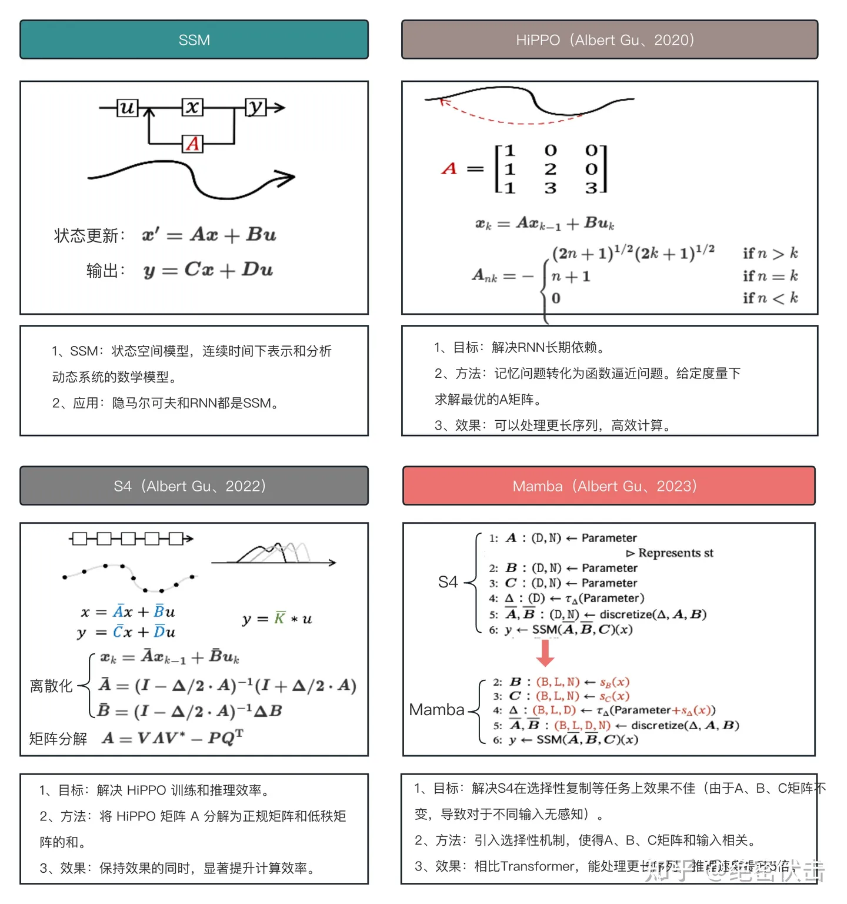
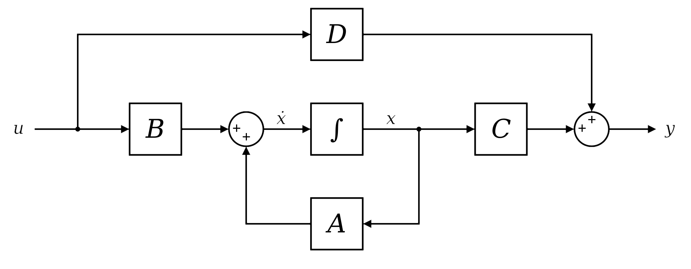

# Mamba大模型——原理&代码浅析

> 水平有限，分析不当、错误之处还望指正。

### Mamba提出的背景

> 参考博客：[挑战 Transformer：全新架构 Mamba 详解](https://zhuanlan.zhihu.com/p/684231320)
>

Mamba提出的动机主要有两点：

- RNN：训练无法进行并行化；
- Transformers：由于attention机制的影响，推理的速度较慢，并且消耗的内存和输入的长度呈 $n^2$关系；

### Mamba系列的理论基础

> 注意：不同出处的文章中，使用的符号可能会有一些差异，例如：输入变量可能使用 ![img](data:image/svg+xml;base64,PHN2ZyB4bWxucz0iaHR0cDovL3d3dy53My5vcmcvMjAwMC9zdmciIHdpZHRoPSIxMC4zNTJweCIgaGVpZ2h0PSI4LjJweCIgcm9sZT0iaW1nIiBmb2N1c2FibGU9ImZhbHNlIiB2aWV3Qm94PSIwIC00NDIgNTcyIDQ1MyIgeG1sbnM6eGxpbms9Imh0dHA6Ly93d3cudzMub3JnLzE5OTkveGxpbmsiIGFyaWEtaGlkZGVuPSJ0cnVlIiBzdHlsZT0idmVydGljYWwtYWxpZ246IC0wLjAyNWV4OyBtYXgtd2lkdGg6IDEwMCU7IG1heC1oZWlnaHQ6IDEwMCU7Ij48ZGVmcz48cGF0aCBpZD0iTUpYLTE4My1URVgtSS0xRDQ2NSIgZD0iTTUyIDI4OVE1OSAzMzEgMTA2IDM4NlQyMjIgNDQyUTI1NyA0NDIgMjg2IDQyNFQzMjkgMzc5UTM3MSA0NDIgNDMwIDQ0MlE0NjcgNDQyIDQ5NCA0MjBUNTIyIDM2MVE1MjIgMzMyIDUwOCAzMTRUNDgxIDI5MlQ0NTggMjg4UTQzOSAyODggNDI3IDI5OVQ0MTUgMzI4UTQxNSAzNzQgNDY1IDM5MVE0NTQgNDA0IDQyNSA0MDRRNDEyIDQwNCA0MDYgNDAyUTM2OCAzODYgMzUwIDMzNlEyOTAgMTE1IDI5MCA3OFEyOTAgNTAgMzA2IDM4VDM0MSAyNlEzNzggMjYgNDE0IDU5VDQ2MyAxNDBRNDY2IDE1MCA0NjkgMTUxVDQ4NSAxNTNINDg5UTUwNCAxNTMgNTA0IDE0NVE1MDQgMTQ0IDUwMiAxMzRRNDg2IDc3IDQ0MCAzM1QzMzMgLTExUTI2MyAtMTEgMjI3IDUyUTE4NiAtMTAgMTMzIC0xMEgxMjdRNzggLTEwIDU3IDE2VDM1IDcxUTM1IDEwMyA1NCAxMjNUOTkgMTQzUTE0MiAxNDMgMTQyIDEwMVExNDIgODEgMTMwIDY2VDEwNyA0NlQ5NCA0MUw5MSA0MFE5MSAzOSA5NyAzNlQxMTMgMjlUMTMyIDI2UTE2OCAyNiAxOTQgNzFRMjAzIDg3IDIxNyAxMzlUMjQ1IDI0N1QyNjEgMzEzUTI2NiAzNDAgMjY2IDM1MlEyNjYgMzgwIDI1MSAzOTJUMjE3IDQwNFExNzcgNDA0IDE0MiAzNzJUOTMgMjkwUTkxIDI4MSA4OCAyODBUNzIgMjc4SDU4UTUyIDI4NCA1MiAyODlaIj48L3BhdGg+PC9kZWZzPjxnIHN0cm9rZT0iY3VycmVudENvbG9yIiBmaWxsPSJjdXJyZW50Q29sb3IiIHN0cm9rZS13aWR0aD0iMCIgdHJhbnNmb3JtPSJtYXRyaXgoMSAwIDAgLTEgMCAwKSI+PGcgZGF0YS1tbWwtbm9kZT0ibWF0aCI+PGcgZGF0YS1tbWwtbm9kZT0ibWkiPjx1c2UgeGxpbms6aHJlZj0iI01KWC0xODMtVEVYLUktMUQ0NjUiPjwvdXNlPjwvZz48L2c+PC9nPjwvc3ZnPg==) 表示，也可能使用 ![img](data:image/svg+xml;base64,PHN2ZyB4bWxucz0iaHR0cDovL3d3dy53My5vcmcvMjAwMC9zdmciIHdpZHRoPSIxMC4zNTJweCIgaGVpZ2h0PSI4LjJweCIgcm9sZT0iaW1nIiBmb2N1c2FibGU9ImZhbHNlIiB2aWV3Qm94PSIwIC00NDIgNTcyIDQ1MyIgeG1sbnM6eGxpbms9Imh0dHA6Ly93d3cudzMub3JnLzE5OTkveGxpbmsiIGFyaWEtaGlkZGVuPSJ0cnVlIiBzdHlsZT0idmVydGljYWwtYWxpZ246IC0wLjAyNWV4OyBtYXgtd2lkdGg6IDEwMCU7IG1heC1oZWlnaHQ6IDEwMCU7Ij48ZGVmcz48cGF0aCBpZD0iTUpYLTE4NC1URVgtSS0xRDQ2MiIgZD0iTTIxIDI4N1EyMSAyOTUgMzAgMzE4VDU1IDM3MFQ5OSA0MjBUMTU4IDQ0MlEyMDQgNDQyIDIyNyA0MTdUMjUwIDM1OFEyNTAgMzQwIDIxNiAyNDZUMTgyIDEwNVExODIgNjIgMTk2IDQ1VDIzOCAyN1QyOTEgNDRUMzI4IDc4TDMzOSA5NVEzNDEgOTkgMzc3IDI0N1E0MDcgMzY3IDQxMyAzODdUNDI3IDQxNlE0NDQgNDMxIDQ2MyA0MzFRNDgwIDQzMSA0ODggNDIxVDQ5NiA0MDJMNDIwIDg0UTQxOSA3OSA0MTkgNjhRNDE5IDQzIDQyNiAzNVQ0NDcgMjZRNDY5IDI5IDQ4MiA1N1Q1MTIgMTQ1UTUxNCAxNTMgNTMyIDE1M1E1NTEgMTUzIDU1MSAxNDRRNTUwIDEzOSA1NDkgMTMwVDU0MCA5OFQ1MjMgNTVUNDk4IDE3VDQ2MiAtOFE0NTQgLTEwIDQzOCAtMTBRMzcyIC0xMCAzNDcgNDZRMzQ1IDQ1IDMzNiAzNlQzMTggMjFUMjk2IDZUMjY3IC02VDIzMyAtMTFRMTg5IC0xMSAxNTUgN1ExMDMgMzggMTAzIDExM1ExMDMgMTcwIDEzOCAyNjJUMTczIDM3OVExNzMgMzgwIDE3MyAzODFRMTczIDM5MCAxNzMgMzkzVDE2OSA0MDBUMTU4IDQwNEgxNTRRMTMxIDQwNCAxMTIgMzg1VDgyIDM0NFQ2NSAzMDJUNTcgMjgwUTU1IDI3OCA0MSAyNzhIMjdRMjEgMjg0IDIxIDI4N1oiPjwvcGF0aD48L2RlZnM+PGcgc3Ryb2tlPSJjdXJyZW50Q29sb3IiIGZpbGw9ImN1cnJlbnRDb2xvciIgc3Ryb2tlLXdpZHRoPSIwIiB0cmFuc2Zvcm09Im1hdHJpeCgxIDAgMCAtMSAwIDApIj48ZyBkYXRhLW1tbC1ub2RlPSJtYXRoIj48ZyBkYXRhLW1tbC1ub2RlPSJtaSI+PHVzZSB4bGluazpocmVmPSIjTUpYLTE4NC1URVgtSS0xRDQ2MiI+PC91c2U+PC9nPjwvZz48L2c+PC9zdmc+) 表示。

> 参考博客：[挑战 Transformer：全新架构 Mamba 详解](https://zhuanlan.zhihu.com/p/684231320)

[《挑战 Transformer：全新架构 Mamba 详解》](https://zhuanlan.zhihu.com/p/684231320)这篇博客，在具体的知识点讲解上可能有一些凌乱，需要结合很多额外的资料和论文原文才能够读懂（<u>当然也可能是我水平太低，对SSM没有任何了解，所以看不懂</u>）。但是，博客开头对SSM、HiPPO、S4和Mamba的总结写的非常清楚，所以我们直接把大佬的图搬运过来。

#### SSM

> 参考博客：[Introduction to State Space Models (SSM)](https://huggingface.co/blog/lbourdois/get-on-the-ssm-train)

状态空间模型（SSM），是连续时间下表示和分析动态系统的数学模型。我们只需要关注两点即可：其本身是定义在**连续时间**下的；是一种数学模型，有了理论保障。

##### 公式定义

SSM的结构图如下所示：

其公式定义为：
$$
\frac{dx(t)}{dt} &=& A \cdot x(t) + B\cdot u(t) \\
y(t) &= & C\cdot x(t) + D\cdot u(t)
$$
其中，$u(t)$ 表示输入信号，$x(t)$​ 为状态矩阵，公式一的含义是：根据当前系统的状态和系统的输入，可以预测系统状态瞬时的变化趋势。公式二的含义是：根据当前系统的状态和系统的输入，可以预测系统对外的表现。可以看到，**RNN模型也是符合这个模式的**。

在实际实现的过程中，$D\cdot u(t)$​这一项可能会**直接被省略**，不进行计算。

注意，上面的公式中的 $A|B|C|D$**对于任何时刻的输入都是固定的，这也是SSM的一大硬伤**。

##### 离散化

前面提到，SSM的建模实在**连续时间**下的，而我们正常计算是在离散时间下的，所以这里需要进行离散化。离散化，有**多种不同的理论方式**，所以你可能在不同代码中看到用了不同的计算过程（<u>水平有限，我们不去深入分析具体的公式推导</u>）。

######  零阶保持法（Zero-Order Hold, ZOH）

$$
\bar{A} = \exp(\Delta \cdot A) \\
\bar{B} = (\Delta \cdot A)^{-1} \cdot\left( \exp(\Delta \cdot A) - I \right) \cdot \Delta B \\
\bar{C} = C
$$

######  双线性变换法

> 参考：[S4论文-SSM离散化公式推导](https://zhuanlan.zhihu.com/p/677787187)

$$
\bar{A} = (I - \frac{\Delta \cdot A}{2})^{-1} (I+ \frac{\Delta \cdot A}{2}) \\
\bar{B} = (I - \frac{\Delta \cdot A}{2})^{-1} \cdot \Delta \cdot B \\
\bar{C} = C
$$

###### 微分极限法

$$
\bar{A} = \Delta \cdot A + I \\
\bar{B} = \Delta \cdot B \\
\bar{C} = C
$$

离散化后，即可通过如下公式进行SSM的计算：
$$
x_k = \bar{A} \cdot x_{k-1} + \bar{B} \cdot u_k \\
y_k = \bar{C} \cdot x_k
$$

#### 卷积运算下的SSM高效计算

> 论文：[Efficiently Modeling Long Sequences with Structured State Spaces](https://arxiv.org/pdf/2111.00396)
>
> 参考博客：[Introduction to State Space Models (SSM)](https://huggingface.co/blog/lbourdois/get-on-the-ssm-train)

##### 计算瓶颈

从上一节的计算公式可以看到，SSM的计算其实和RNN模型的计算是完全一致的，而RNN模型的特点是：**推理速度快，但是无法进行并行训练**。所以，需要找到一个方法，来解决计算$x_k$时对$x_{k-1}$的依赖问题。

##### 卷积运算

我们对上面公式中的SSM状态 $x$ 进行推演：

- **Step 0**： $x_0 = \bar{B} u_0$；
- **Step 1**：$x_1 = \bar{A} x_0 + \bar{B}u_1 = \bar{A}(\bar{B}u_0) + \bar{B}u_1$；
- **Step 2**：$x_2 = \bar{A}x_1+\bar{B}u_2=\bar{A}(\bar{A}(\bar{B}u_0) + \bar{B}u_1) + \bar{B}u_2$；

对输出结果 $y$ 进行推演：

- **Step 0**：$y_0 = \bar{C}x_0 = \bar{C}\bar{B}u_0$；
- **Step 1**：$y_1 = \bar{C} x_1 = \bar{C}(\bar{A}\bar{B}u_0 + \bar{B}u_1) = \bar{C}\bar{A}\bar{B}u_0 + \bar{C}\bar{B}u_1$；
- **Step 2**：$y_2 = \bar{C}x_2 = ... = \bar{C} \bar{A}^2 \bar{B}u_0 + \bar{C}\bar{A}\bar{B}u_1 + \bar{C}\bar{B}u_2$​；

从上述推演中观察到，由于SSM中对于任何时刻的输入，其$ABC$矩阵是不变的，所以，**对于时刻$k$的结果，并不依赖于$k-1$的结果**。

##### 训练/推理的不同表示

- **训练阶段**：使用卷积运算来保证不同时刻的训练并行性，在实现时主要使用`FFT`计算；
- **推理阶段**：以正常的循环计算来完成；

通过这样的方式，能够充分保证训练和推理的速度，以及显存的低占用；

#### HiPPO改进SSM对历史信息的记忆

> 论文：[HiPPO: Recurrent Memory with Optimal Polynomial Projections](https://arxiv.org/pdf/2008.07669)
>
> 论文：[Efficiently Modeling Long Sequences with Structured State Spaces](https://arxiv.org/pdf/2111.00396)
>
> 论文：[How to Train Your HiPPO: State Space Models with Generalized Orthogonal Basis Projections](https://arxiv.org/pdf/2206.12037v2)
>
> 参考：[The Annotated S4](https://srush.github.io/annotated-s4/#training-ssms-the-convolutional-representation)

早期SSM均**使用随机变量或对角阵来初始化参数矩阵$A$​**，在实际训练过程中，这样的SSM模型**存在容易遗忘历史信息的问题**。因此，S4工作中引入了HiPPO矩阵，来解决这个问题。

对于不同时刻历史信息的关注程度不同，HiPPO有着不同的计算公式（<u>水平有限，我们不去深入分析具体的公式推导，感兴趣的可以去看HiPPO的论文</u>）。

###### HiPPO-LegT

图中左侧是HiPPO-LegT的示意图，其对**历史滑窗**（窗长为$\theta$）的历史信息同等重视；
$$
A_{nk} = \frac{1}{\theta}
\begin{cases}
(-1)^{n-k}(2n+1) & if\ \ n \ge k \\
2n+1 & if \ \ n \leq k \\
\end{cases} \\
B_n = \frac{1}{\theta}(2n+1)(-1)^n
$$

###### HiPPO-LagT

图中中间是HiPPO-LagT的示意图，其对于**所有历史信息**，信息越远，重视程度越低（呈指数衰减）；
$$
A_{nk} = 
\begin{cases}
1 & if \ \ n \ge k, \\
0 & if \ \ n < k \\
\end{cases} \\
B_n = 1
$$

###### HiPPO-LegS

图中右侧是HiPPO-LegS的示意图，其对于**所有历史信息**同等重视；
$$
A_{nk} = 
\begin{cases}
(2n+1)^{1/2}(2k+1)^{1/2} & if \ \ n > k \\
n+1 & if \ \ n=k \\
0 & if \ \ n < k \\
\end{cases} \\
B_n = (2n+1)^{1/2}
$$
以上，就是三种不同的HiPPO矩阵。在实际训练中，**模型只是使用HiPPO矩阵来初始化$A,B$​矩阵**，后续这两个矩阵会在训练过程中使用梯度下降算法迭代。

在参考博客中，你可以看到，**HiPPO存在一种非常高效的计算方法**，由于需要大量的数学推理，并且实际在Mamba中并没有用到，所以这里就不再分析，感兴趣可以去了解一下。

#### Memba改造SSM对输入的敏感性

> 论文：[Mamba: Linear-Time Sequence Modeling with Selective State Spaces](https://arxiv.org/abs/2312.00752)

##### 传统SSM弊端

前面我们提到，SSM的一大硬伤：**线性时间不变性**，对于任何时刻的输入，参数矩阵$A|B|C|D$都是固定。这就导致一个问题，整个模型对输入内容的敏感性差。

##### 通过选择性机制改进SSM

要解决上面的弊端，一个非常自然的想法是，我们让参数矩阵$A|B|C|D$和输入相关不就解决了（**吗**）？

简单起见，我们直接贴原论文的伪代码（伪代码中$D$表示输入维度, $N$表示隐状态维度）：

可以看到，论文中$B|C|\Delta$三个参数是根据输入而变化的，具体的公式如下：
$$
S_B(x) = \text{Linear}_N(x) \\
S_C(x) = \text{Linear}_N(x) \\
S_\Delta(x) = \text{Broadcast}_D(\text{Linear}_1(x)) \\
\tau_\Delta(\cdot) = \text{softplus}(\cdot)
$$
选择性机制，可以增强模型对输入内容的理解归纳能力。但是，我们重新回到“卷积运算下SSM计算”一节，知道实现卷积运行的前提便是SSM的线性时间不变性。所以，**选择性机制又破坏了训练时的高效计算**。

##### 细节理解

作者在原文中，用了非常大的一部分文字去解释：**Mamba和RNN门控机制之间是紧密相关的**（<u>这点我觉得是比较显而易见的，并且我也解释不好，所以就不分析了，感兴趣的可以去看原文</u>）。在此基础上我们来重新理解一下Mamba参数：

###### 为什么参数$A$​上是没有选择性机制？

虽然$A$上没有选择性机制，但是$\Delta$上有，所以进行离散化后，自然而然的$\bar{A}$其实是带有选择性机制的。并且，文章发现A上有没有选择性机制，最后的效果几乎相同，所以就简化了这一步。

以上是原文的解读，个人认为还有另外一点：初始化情况下，运用选择性机制后，$A$参数很难保证是HiPPO矩阵，从而会影响模型对历史信息的记忆能力。

###### 如何理解$\Delta$​？

$\Delta$用来控制对历史信息/当前输入的关注程度，$\Delta$越大，模型更关注当前的输入，而忽略历史信息。

###### 如何理解 $B$ 和 $C$​？

$B$控制输入信息流入到隐状态，$C$控制隐状态信息流入到输出。

### Mamba代码实现

在看具体的代码前，我们先对Mamba的架构有一个整体的理解：

#### 使用Pytorch实现Mamba

我们先直接来看[transformers/modeling_mamba.py](https://github.com/huggingface/transformers/blob/main/src/transformers/models/mamba/modeling_mamba.py)库`MambaMixer.slow_forward`方法，整个代码的逻辑非常得清晰，有助于理解Mamba的整个实现。当然，也存在一个问题：**计算效率低下，尤其是训练，无法并行化**。

###### Input Projection

###### Sequence Convolution

> 个人理解，这部分的卷积操作是为了在较小的窗口内去结合前后信息。

###### SSM

- Selection

- Discretization

> 注意：离散化在实现过程中，就是一个杂糅，$\bar{A} = \exp(\Delta \cdot A)$使用的是ZOH方法，而$\bar{B} = \Delta \cdot B$使用的是微分极限法，具体可以参考这条[ISSUE](https://github.com/state-spaces/mamba/issues/114)。

> 注意：这边对于$A$参数的初始化，采用的是S4D-Real的方式，具体可以参考[ISSUE](https://github.com/state-spaces/mamba/issues/167)或者[论文](https://openreview.net/pdf?id=yJE7iQSAep)。

- Recurrence computation

###### Output Projection

#### CUDA实现SSM加速

选择性机制破坏了模型训练的并行性，其主要体现在“Recurrence computation”的`for`循环部分。所以Mamba的成功，其实很大程度上归功于其高效的算法实现：

- 内核融合（kernel fusion）
- 并行扫描（parallel scan）
- 重计算（recomputation）

我们看第1点和第3点，是不是感觉很熟悉，这不就是flash-attention嘛？没错，毕竟作者本来就是flash-attention的作者呀。而第2点，则是CUDA上常见的并行加速的方法，可以看[这个项目](https://github.com/alxndrTL/mamba.py/tree/main)来理解Mamba中使用的pscan算法。

<u>时间有限，没来得及分析这块的代码，大家感兴趣可以自行分析一下，不过我扫了一眼，需要很多基础知识，才吃得消看这块的代码。</u>

#### 个人对Mamba的理解

- 新瓶装旧酒，本质上和RNN网络的非常相似；
- 对于历史信息的记忆能力，还是不如transformer，毕竟transformer是使用KVQ来保存历史信息的，而Mamba即使使用HiPPO矩阵，它仍然是对历史信息的归纳；
- CUDA加速很关键，值得我们把这块知识补上；

---

参考链接：

- [Introduction to State Space Models (SSM)](https://huggingface.co/blog/lbourdois/get-on-the-ssm-train)