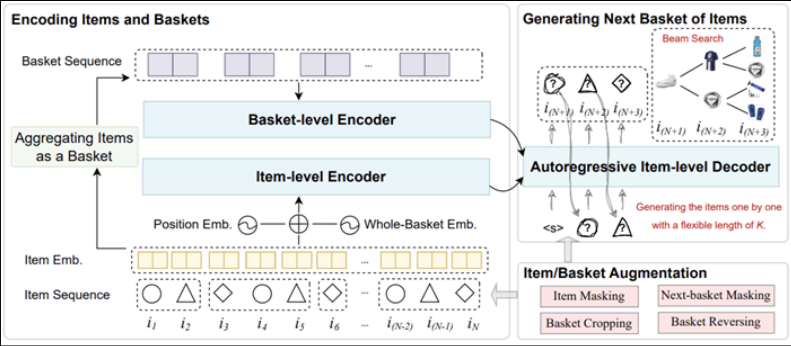
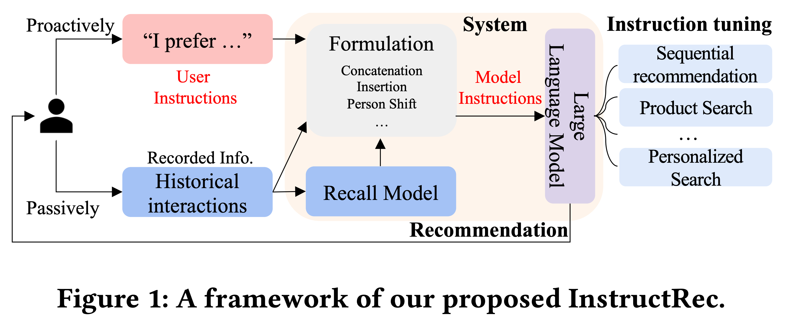

# 垂类应用

[TOC]

## 传统安全领域

### 数据

#### 书籍

##### Web安全

###### SQL注入攻击与防御（第2版）

链接：https://book.douban.com/subject/25815527/

转文本文件：❌

###### 白帽子讲Web安全

链接：https://book.douban.com/subject/10546925/

转文本文件：✅

###### 黑客攻防技术宝典：Web篇（第2版）

链接：https://book.douban.com/subject/10793814/

转文本文件：⚠️

备注：epub文件中的代码使用的是截图，整体质量较低；

###### Web安全测试

链接：https://book.douban.com/subject/4725272/

转文本文件：❌

###### Web前端黑客技术揭秘

链接：https://book.douban.com/subject/20451827/

转文本文件：✅

###### 精通脚本黑客

链接：https://book.douban.com/subject/2112672/

转文本文件：

##### 逆向工程

###### 

### 漏洞修复

##### Examining Zero-Shot Vulnerability Repair with Large Language Models （CCS 2023）

论文链接：https://arxiv.org/pdf/2112.02125.pdf

参考链接：https://mp.weixin.qq.com/s/Oc5WLqXBF_AvI6HAwZKPgA

使用“开箱即用”的LLM来帮助开发人员修复安全漏洞，尝试回答了如下几个问题：

- **RQ1：** 现有的“开箱即用”LLM能够生成安全的、功能正确的代码来修复安全漏洞吗?
- **RQ2：** 改变一个提示（Prompt）中的代码注释上下文数量是否会影响LLM提出修复建议的能力?
- **RQ3：** 使用LLM修复真实场景的代码安全漏洞存在哪些挑战？
- **RQ4：** LLM在生成修复代码的可靠性方面如何？

<u>个人觉得文章一般，只讨论了2种漏洞的修复，并且都是基于已有的LLM服务进行测试。测试的场景和实际修复场景存在比较大的gap，在业务场景下，很可能没办法验证修复后代码的功能是否正常、漏洞是否修复等，这可能是这个方向未来要努力的方向。</u>

## 推荐领域

> 个人对推荐领域不是非常了解，以外行的眼光去评判内行的工作，会存在一些理解上的偏差。

### 生成式推荐

##### Generative Next-Basket Recommendation

该论文提出一种自回归生成下一个购物篮商品的推荐模型，即GeRec。现有基于深度神经网络的购物篮推荐工作大多数主要关注用户偏好和预测商品之间的相关性，忽略了下一个购物篮中商品之间可能存在的关系，通常会导致预测商品的同质化。GeRec考虑了商品级别和购物篮级别的多粒度用户偏好，同时考虑了下一个购物篮中商品之间的联系，以自回归方式生成下一个购物篮中商品。实验结果表明，在真实世界购物场景中，GeRec在兼顾性能的情况下，同时提升了下一个购物篮中商品的相关性和多样性。

### 其他推荐范式

#### 根据意图描述进行推荐

###### Recommendation as Instruction Following: A Large Language Model Empowered Recommendation Approach

论文链接：https://arxiv.org/abs/2305.07001

该论文期望发展一种新的推荐范式，即用户可以灵活的使用自然语言指令来表达自身的需求，而系统通过分析这些指令来实现个性化的推荐，即InstructRec。为此，本文首先形式化了推荐指令的三个关键因素：偏好，意图和任务形式。并基于这些因素的组合实例化了不同的交互场景。本文通过self-instruct的方式，利用一个指令微调过的模型（teacher-LLM）来基于用户的历史行为，评论等数据，生成大量能反映用户意图和偏好的指令数据。利用这些指令数据，微调了Flan-T5。实验结果表明，InstructRec可以一定程度上理解用户需求，在不同的交互场景中取得了较好的效果。

<u>个人认为，这个**新的推荐形式比较有意思，并且RecSys’23上有其他文章的思路跟这个相近**。以往我们要去露营，我们会先想好，我需要A、B、C、D，然后去网上搜索相应的产品进行购买。现在，我们可以说，我直接跟APP说我想去露营，他就给我推荐A、B、C、D产品。但是在实现上，**使用大模型给出相应的推荐似乎并不靠谱**，很难把群体之间的喜好关系，大规模的商品信息融合进模型。</u>

