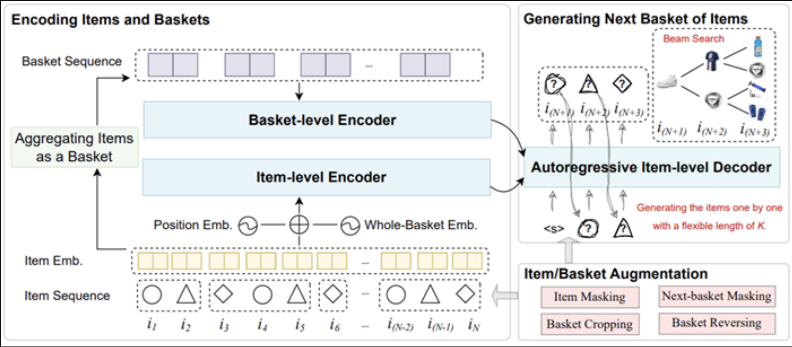

# 垂类应用

[TOC]

## 推荐领域

### 生成式推荐

###### Generative Next-Basket Recommendation

该论文提出一种自回归生成下一个购物篮商品的推荐模型，即GeRec。现有基于深度神经网络的购物篮推荐工作大多数主要关注用户偏好和预测商品之间的相关性，忽略了下一个购物篮中商品之间可能存在的关系，通常会导致预测商品的同质化。GeRec考虑了商品级别和购物篮级别的多粒度用户偏好，同时考虑了下一个购物篮中商品之间的联系，以自回归方式生成下一个购物篮中商品。实验结果表明，在真实世界购物场景中，GeRec在兼顾性能的情况下，同时提升了下一个购物篮中商品的相关性和多样性。

