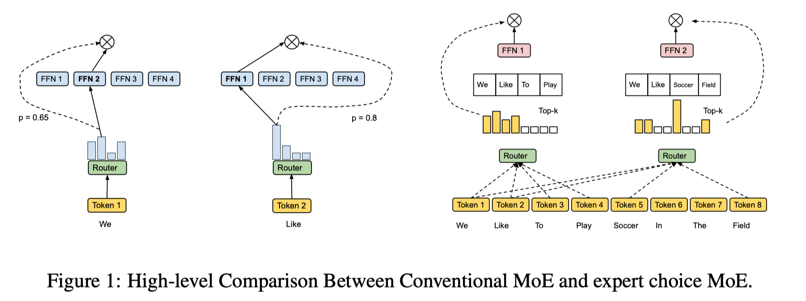
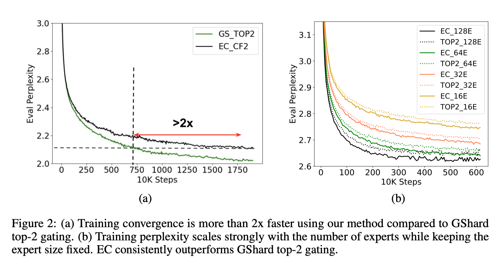

# 模型结构

[TOC]

## MoE（Mixture-of-Experts）

###### MoE 全局概览

参考链接：https://zhuanlan.zhihu.com/p/542465517

HuggingFace 论坛文章：https://huggingface.co/blog/moe  翻译地址：https://baoyu.io/translations/llm/mixture-of-experts-explained

###### Outrageously Large Neural Networks: The Sparsely-Gated Mixture-of-Experts Layer

论文链接：https://arxiv.org/abs/1701.06538

参考链接：https://zhuanlan.zhihu.com/p/335024684

###### Mixture-of-Experts with Expert Choice Routing

论文链接：https://arxiv.org/abs/2202.09368

传统思想：每个Token选择最相关的K个Expert；

该文思想：每个Expert选择最相关的K个Tokens；

该文的效果如下：

## 位置编码

### 旋转位置编码（RoPE）

<u>与传统的三角位置编码和自学习编码相比，RoPE编码是一种乘性位置编码方法，能够在Attention中表示相对位置，具有可解释性、良好的外推性质。可以使用PI位置插值或者NTK-RoPE的方法，进行位置编码的外推。</u>

###### 【参考】十分钟读懂旋转编码（RoPE）

链接：https://zhuanlan.zhihu.com/p/647109286

###### 【参考】Transformer升级之路：2、博采众长的旋转式位置编码

链接：https://kexue.fm/archives/8265

###### 【参考】RoPE旋转位置编码深度解析：理论推导、代码实现、长度外推

链接：https://zhuanlan.zhihu.com/p/645263524

###### 【参考】如何理解 RoPE 的 NTK 扩展

链接：https://zhuanlan.zhihu.com/p/648701937

###### 【参考】Transformer升级之路：10、RoPE是一种β进制编码

链接：https://kexue.fm/archives/9675

### 其他

##### 混合精度下的位置编码问题

###### 【参考】混合精度下位置编码竟有大坑，LLaMA等主流开源模型纷纷中招

链接：https://zhuanlan.zhihu.com/p/651588659