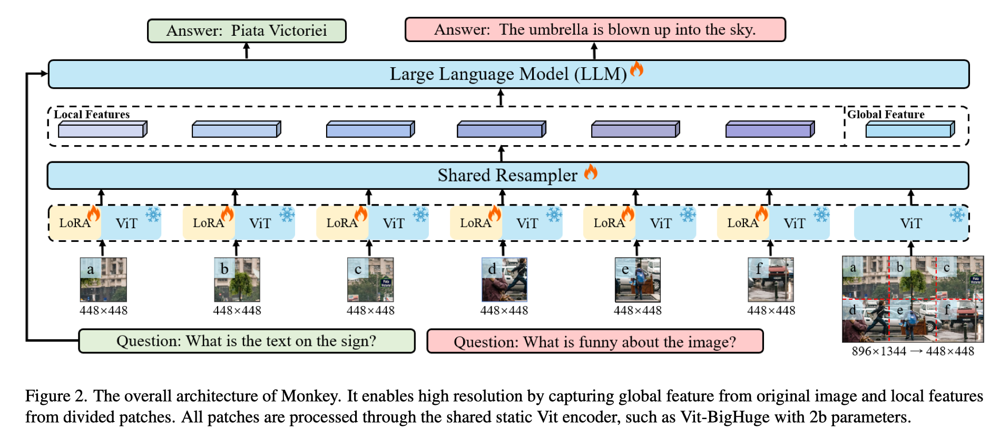
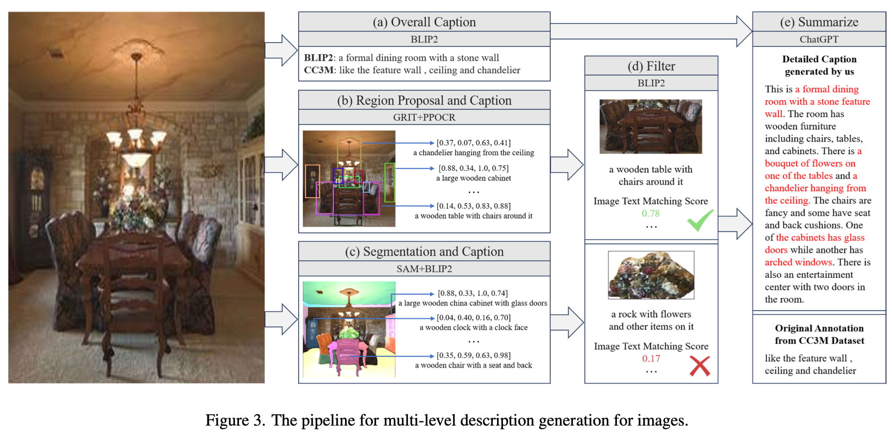
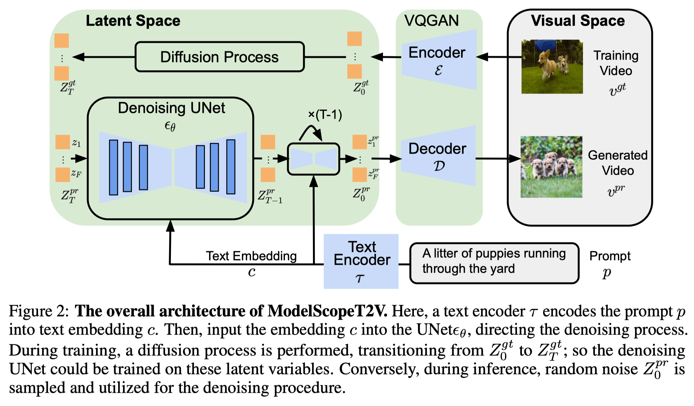
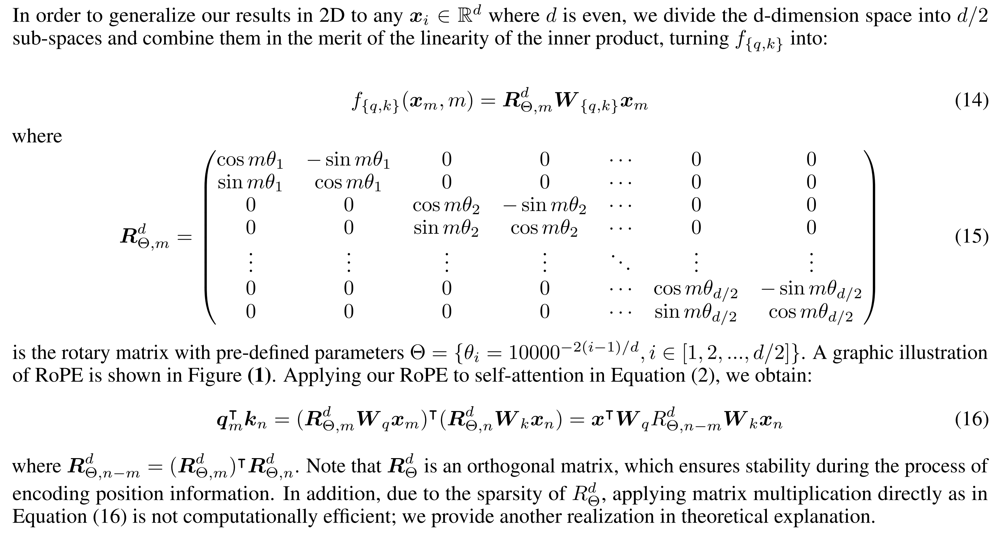
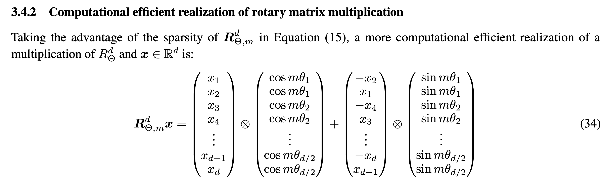
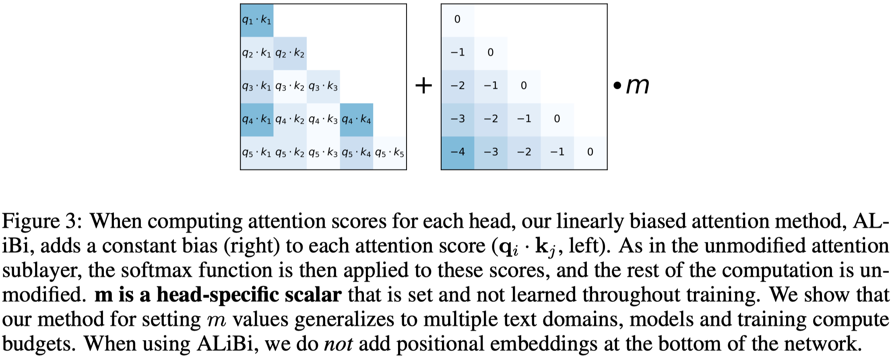

# 模型结构

[TOC]

## 开源模型

#### ChatGLM-3

#### LLaVA

论文链接：https://arxiv.org/abs/2304.08485

参考链接：

项目地址：https://github.com/haotian-liu/LLaVA

#### Monkey

论文链接：https://arxiv.org/abs/2311.06607

参考链接：https://zhuanlan.zhihu.com/p/669653695

项目地址：https://github.com/Yuliang-Liu/Monkey

华中科大的Monkey模型，主要为了解决两个问题：对高分辨率图像的解析，以及缺乏详细的描述数据；

解决的方法：

1. 保证训练计算量基本稳定的情况下，增大模型的图像分辨率；

2. 结合多级特征（如使用不同的模型识别图像位置、对图像进行切割等），利用GPT来生成详细的图像描述，构成新的数据集；

#### ModelScopeT2V

论文地址：https://arxiv.org/abs/2308.06571

模型链接：https://huggingface.co/ali-vilab/text-to-video-ms-1.7b

该工作的创新点在于：

1. 模型结构上增加了时间维度依赖（时间维度的convelution和attention操作），来提升视频前后帧的连贯程度；
2. 同时使用“图-文”对和“视频-文”对，来训练模型；

## MoE（Mixture-of-Experts）

###### MoE 全局概览

参考链接：https://zhuanlan.zhihu.com/p/542465517

HuggingFace 论坛文章：https://huggingface.co/blog/moe  翻译地址：https://baoyu.io/translations/llm/mixture-of-experts-explained

###### Outrageously Large Neural Networks: The Sparsely-Gated Mixture-of-Experts Layer

论文链接：https://arxiv.org/abs/1701.06538

参考链接：https://zhuanlan.zhihu.com/p/335024684

###### Mixture-of-Experts with Expert Choice Routing

论文链接：https://arxiv.org/abs/2202.09368

传统思想：每个Token选择最相关的K个Expert；

该文思想：每个Expert选择最相关的K个Tokens；

该文的效果如下：

## 扩散模型

### DDPM

论文链接：https://arxiv.org/abs/2006.11239

参考链接：https://zhuanlan.zhihu.com/p/563661713

整体思想是使用模型来预测图像中的噪声；

## 位置编码

### 旋转位置编码（RoPE）

<u>与传统的三角位置编码和自学习编码相比，RoPE编码是一种乘性位置编码方法，能够在Attention中表示相对位置，具有可解释性、良好的外推性质。可以使用PI位置插值或者NTK-RoPE的方法，进行位置编码的外推。</u>

公式如下所示，Q、V矩阵相乘后可以很好地表示相对位置距离；

以上R矩阵是一个稀疏矩阵，故可以通过下面这种方法提高计算效率：

**源码学习 - ChatGLM-3：**

1. 在ChatGLM中，只对特征的前K维引入位置编码；
2. 注意，RoPE编码需要对Q和K两个向量引入位置编码信息；

**RoPE的优点：**

1. 一定的外推性
2. 计算简单，且可以表示相对位置
3. 与线性注意力机制兼容：为什么？

###### 【参考】十分钟读懂旋转编码（RoPE）

链接：https://zhuanlan.zhihu.com/p/647109286

###### 【参考】Transformer升级之路：2、博采众长的旋转式位置编码

链接：https://kexue.fm/archives/8265

###### 【参考】RoPE旋转位置编码深度解析：理论推导、代码实现、长度外推

链接：https://zhuanlan.zhihu.com/p/645263524

###### 【参考】如何理解 RoPE 的 NTK 扩展

链接：https://zhuanlan.zhihu.com/p/648701937

###### 【参考】Transformer升级之路：10、RoPE是一种β进制编码

链接：https://kexue.fm/archives/9675

###### 【论文】RoFormer: Enhanced Transformer with Rotary Position Embedding

链接：https://arxiv.org/abs/2104.09864

### Attention with Linear Biases (ALiBi)

思路非常直接，不是将位置编码作用在Embedding上，而是直接作用在Attention Score上。

**ALiBi位置编码的优点：**

1. 计算更加简单
2. 外推性更好

###### 【参考】大模型位置编码-ALiBi位置编码

链接：https://zhuanlan.zhihu.com/p/656684326

###### 【论文】 Train Short, Test Long: Attention with Linear Biases Enables Input Length Extrapolation

链接：https://arxiv.org/abs/2108.12409

### 其他

##### 混合精度下的位置编码问题

###### 【参考】混合精度下位置编码竟有大坑，LLaMA等主流开源模型纷纷中招

链接：https://zhuanlan.zhihu.com/p/651588659