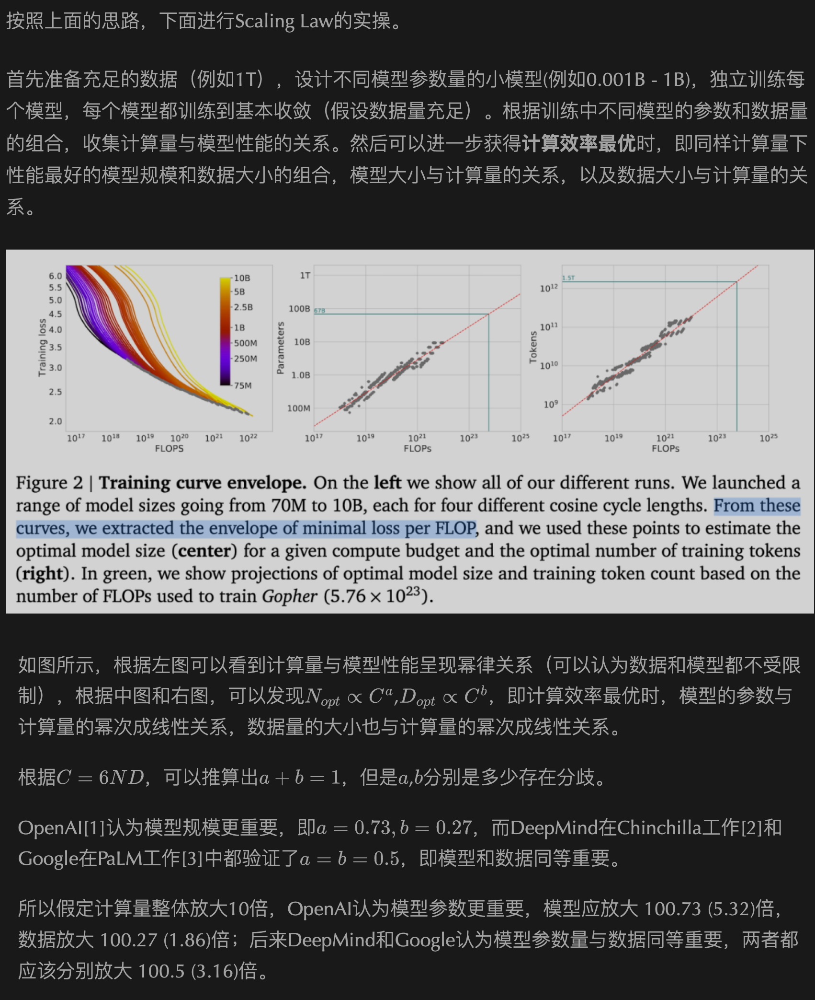
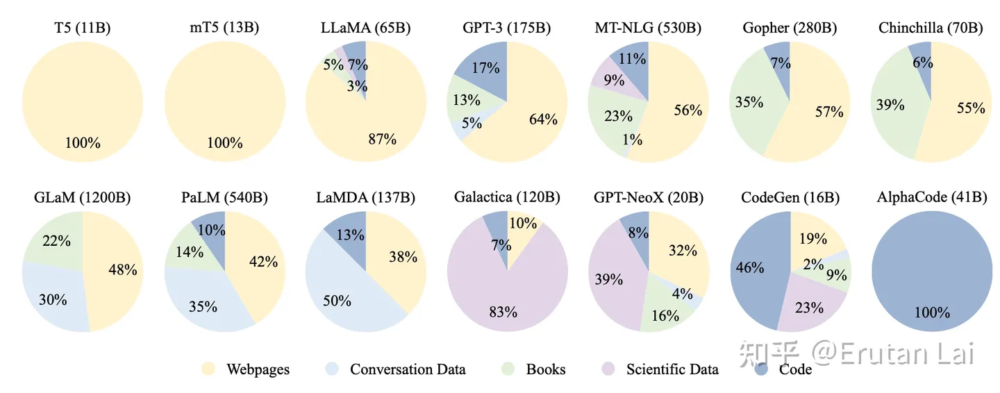
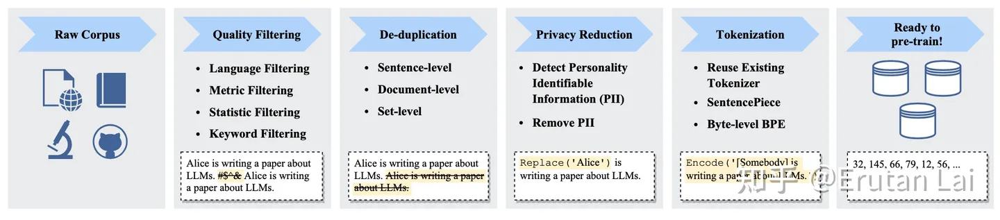

# 模型训练

[TOC]

## 预训练阶段

### Scaling Law

<u>Scaling Law 经验性地总结**模型能力**与**模型参数**、**训练数据大小**、**计算量**三者间的关系，可用来预测模型能力的走势；</u>

###### 【参考】Scaling Laws for Neural Language Models

论文链接：https://arxiv.org/abs/2001.08361

知乎链接 1：https://zhuanlan.zhihu.com/p/620479884

知乎链接 2：https://zhuanlan.zhihu.com/p/631357320

公众号文章 1：https://mp.weixin.qq.com/s?__biz=MzIwNDY1NTU5Mg==&mid=2247487232&idx=1&sn=f0c3ae436ae53b81f817a0a8d694aab3&chksm=973d9187a04a18912ff0671efb0394e73e8b561249a4a235b62b58698cf5532186e93b27e4c7

<u>公众号文章 1 中的这一段分析的不错，这是我看知乎的时候已经没搞懂的。</u>

### 预训练语料

###### 【资源】HuggingFace 镜像站

Huggingface 下载很头疼怎么办，用它~

镜像站链接：https://hf-mirror.com/

###### 【参考】大模型技巧大揭秘

链接：https://zhuanlan.zhihu.com/p/623424822

作者在文章中提到了各个大模型在预训练语料上的不同配比；

### 语料预处理

###### 【参考】大模型训练技巧大揭秘

链接：https://zhuanlan.zhihu.com/p/623424822

作者在文章中提到了”清洗与预处理“的标准流程；

