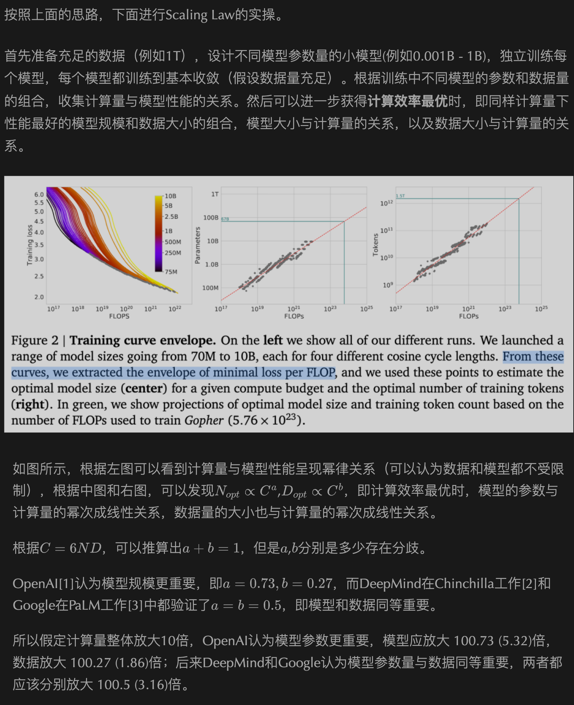

# 模型训练

[TOC]

## 预训练阶段

### Scaling Law

<u>Scaling Law 经验性地总结**模型能力**与**模型参数**、**训练数据大小**、**计算量**三者间的关系，可用来预测模型能力的走势；</u>

###### 【参考】Scaling Laws for Neural Language Models

论文链接：https://arxiv.org/abs/2001.08361

知乎链接 1：https://zhuanlan.zhihu.com/p/620479884

知乎链接 2：https://zhuanlan.zhihu.com/p/631357320

公众号文章 1：https://mp.weixin.qq.com/s?__biz=MzIwNDY1NTU5Mg==&mid=2247487232&idx=1&sn=f0c3ae436ae53b81f817a0a8d694aab3&chksm=973d9187a04a18912ff0671efb0394e73e8b561249a4a235b62b58698cf5532186e93b27e4c7

<u>公众号文章 1 中的这一段分析的不错，这是我看知乎的时候已经没搞懂的。</u>

### 预训练语料

#### 数据集

###### 【资源】HuggingFace 镜像站

Huggingface 下载很头疼怎么办，用它~

镜像站链接：https://hf-mirror.com/

#### 数据处理

- 选择题的处理

###### 【论文】DeceptPrompt: Exploiting LLM-driven Code Generation via Adversarial Natural Language Instructions

论文链接：https://arxiv.org/abs/2312.04730v1

项目链接：https://github.com/Cerebras/modelzoo/tree/main/modelzoo/transformers/data_processing/slimpajama

#### 数据配比

###### 【论文】DoReMi: Optimizing Data Mixtures Speeds Up Language Model Pretraining

论文链接：https://arxiv.org/abs/2305.10429

项目链接：https://github.com/sangmichaelxie/doremi

参考链接：https://zhuanlan.zhihu.com/p/638693088

<u>参考的知乎，老哥写的不是特别用心，还是自己看原文吧~所幸谷歌的文章现在写得越来越易读了。</u>

文章主要想解决的是，不同领域训练数据的配比问题，原文图片画得非常直观：

直接看文章的效果，也非常不错：

算法部分，作者核心的逻辑是

0. 我要筛选不错的数据分布比例，而且肯定希望速度能够快一些，所以作者采用在小模型上（280M）做分布比例的筛选；

1. 先用模型的数据比例（比如：原始有多少条，我就一股脑用上），训练得到一个参考模型 $p_{ref}$，后面训练过程中，这个模型是固定不懂的；
2. 现在我们来从头训练一个新的模型 $p_\theta$，假设这个新的模型的训练会迭代训练T次。当训练到t次时，以 $p_{ref}$ 为参考，如果对于领域i的数据我们已经学得跟参考模型一样好了，那么后面我们就可以对领域i的数据少学一些，即降低该领域的配比；如果对于领域j的数据我们学得没有参考模型那么好，那么后面我们就应该在领域j的数据上多学一些，即增加该领域的配比。那么，我们怎么来定义学得好坏呢？文章中想的是用困惑度PPL就好。以下公式为迭代的目标：

3. 用前一个步骤得到的数据配比，训练大模型；

关键的算法步骤第2步，前面没提到的是作者在每一步更新数据配比的时候做了一些平滑处理：

###### 【参考】大模型技巧大揭秘

链接：https://zhuanlan.zhihu.com/p/623424822

作者在文章中提到了各个大模型在预训练语料上的不同配比；

### 语料预处理

###### 【论文】

###### 【论文】SlimPajama-DC: Understanding Data Combinations for LLM Training

链接：https://arxiv.org/abs/2309.10818

数据集链接：https://huggingface.co/datasets/MBZUAI-LLM/SlimPajama-627B-DC

开源模型链接：https://huggingface.co/MBZUAI-LLM

论文我读完没有太多的感触，可能就是要做global deduplication比较重要。论文中对数据的处理流程：

###### 【参考】大模型训练技巧大揭秘

链接：https://zhuanlan.zhihu.com/p/623424822

作者在文章中提到了”清洗与预处理“的标准流程；

### 训练技术

##### 综合

###### 【参考：如何配置各种加速策略】你的大模型为什么训不快？大模型预训练技术精要

参考链接：https://zhuanlan.zhihu.com/p/647395142

整体思想：对于较小的模型（~7B），如果ZeRO数据并行可以直接装下的话，就直接用ZeRO；

##### 并行技术

###### 【序列并行 & 选择性激活值重计算】Reducing Activation Recomputation in Large Transformer Models

论文链接：https://arxiv.org/abs/2205.05198

参考链接：https://blog.csdn.net/qinduohao333/article/details/131629428

作者在文章中，讨论优化的都是**计算过程中产生的激活值**在显存中的占用，以如下网络结构进行讨论：

对于每一个Transformer层，使用TP以后，并行后的示意图如下：

可以看到，图中的Attention层和两个线性层已经优化，但是在LayerNorm层和Dropout层的激活值占用仍然较大。所以，作者提出可以在这两种模型层上在Sequence维度上进行切分，示意图如下所示。同时，作者也分析了通信量，并不会增加模型的整体通信量。

另外，作者提出了”Selective Activation Recomputation“（选择性激活重计算），与不缓存所有的激活值相比，作者考虑**优先重计算Attention层**。

##### ZeRO

###### 【加速训练、减少显存占用】ZeRO: Memory Optimizations Toward Training Trillion Parameter Models

论文链接：https://arxiv.org/abs/1910.02054

参考链接：https://basicv8vc.github.io/posts/zero/

源码分析链接：https://www.zhangzhenhu.com/deepspeed/index.html

ZeRO本质上是一种数据并行的方案。

阅读完代码后，目前来看，在不修改任何代码的情况下，Deepspeed其实只支持ZeRO优化，即数据并行，优化了模型在各GPU中的占用。

##### Flash Attention

###### 【加速训练、减少显存占用】FlashAttention: Fast and Memory-Efficient Exact Attention with IO-Awareness

论文链接：https://arxiv.org/abs/2205.14135

项目链接：https://github.com/Dao-AILab/flash-attention

参考链接：https://juejin.cn/post/7259287148321800253

<u>文章写得很棒，建议直接看原文</u>

在GPU中，片上存储单元SRAM比显存单元HBM的速度更快，整体的思路就是把大的矩阵分片后，直接将多个操作合并后在SRAM中一步到位，从而减少I/O的开销，提升整体的训练速度；

传统Attention实现方式：HBM的访问复杂度 $O(Nd+N^2)$

前向传播：HBM的访问复杂度 $O(N^2d^2M^{-1})$，其中 $M$ 远大于 $d$    （<u>这部分不太容易读懂，一个是自己静下心来理解，另一个是可以看FlashAttention-2的前面部分，解释得更加清楚</u>）

###### 【加速训练】FlashAttention-2: Faster Attention with Better Parallelism and Work Partitioning

论文链接：https://arxiv.org/abs/2307.08691

项目链接：https://github.com/Dao-AILab/flash-attention

参考链接：https://zhuanlan.zhihu.com/p/645376942

<u>仍然推荐直接去看原论文进行学习</u>

在前文的基础上，FlashAttention-2提出了这几点优化：（1）在计算过程中使用更少的非矩阵运算；（2）更好地并行；（3）

1. 优化的前向传播：与版本1不同之处在于，将结果存储在HBM的操作被优化到了第一个循环中；(<u>这边作者的公式中是存在笔误的</u>)

2. 更好的并行化；

##### 卡间通信

###### 【参考：卡间通信】【深度学习】【分布式训练】Collective通信操作及Pytorch示例

链接：https://zhuanlan.zhihu.com/p/607605729

作者通过pytorch代码讲解了Collective通信操作。

## 增训阶段

###### Continual Pre-Training of Large Language Models: How to (re)warm your model?

链接：https://arxiv.org/abs/2308.04014

参考分析：https://blog.csdn.net/qq_27590277/article/details/132820341

文章给出的结论是：

- 增训能够在下游数据集上有一定的效果；
- 学习率的设置会造成模型能力在短时间内的退化；

文章的不足：

- 使用的模型太小了；
- 两个数据集之间存在重合；
- 度量的任务不够广；

## SFT阶段

### 训练数据

###### Self-Instruct: Aligning Language Models with Self-Generated Instructions

论文链接：https://arxiv.org/abs/2212.10560

项目链接：https://github.com/yizhongw/self-instruct

中文项目链接：https://github.com/wptoux/self-instruct-zh

利用GPT-4仿照种子指令，随机生成更多的指令数据，用于SFT阶段；

###### Self-QA: Unsupervised Knowledge Guided Language Model Alignment

论文链接：https://arxiv.org/abs/2305.11952

利用GPT-4从无结构化的文章中，随机生成指令数据，用于SFT阶段；

###### SelfKG: Self-Supervised Entity Alignment in Knowledge Graphs

论文链接：https://arxiv.org/abs/2203.01044

项目链接：https://github.com/THUDM/SelfKG

利用GPT-4从知识图谱中，随机生成指令数据，用于SFT阶段；

### 训练策略

###### 【减少模型可训练参数】LoRA: Low-Rank Adaptation of Large Language Models

论文链接：https://arxiv.org/pdf/2106.09685.pdf

项目链接：https://github.com/microsoft/LoRA

使用矩阵分解的原理，减少模型可训练的参数，同时可以在推理时合并入模型原先的参数，不影响推理的效率；原理很简单，代码也写得非常透彻，仓库中的`merged`变量来控制lora的参数是否被合并了，具体在训练中的代码需要看PEFT代码；

###### 【缓解过拟合】NEFTune: Noisy Embeddings Improve Instruction Finetuning

论文链接：https://arxiv.org/abs/2310.05914

项目链接：https://github.com/neelsjain/NEFTune

参考链接：https://zhuanlan.zhihu.com/p/662024086

通过在embedding后增加noise，缓解了模型训练的过拟合问题；

## 人类偏好对齐阶段

##### PPO算法

###### 【参考】拆解大语言模型RLHF中的PPO

链接：https://zhuanlan.zhihu.com/p/645225982

<u>作者将PPO的过程拆分成了采样、反馈和学习三个过程，讲得通俗易懂。</u>

##### DPO算法

- DPO算法的核心观点：撇开奖励模型的建模，直接使用SFT后的模型作为Reward Model。

- 算法优化的Loss函数：大概的原理即为希望win的样本输出概率更大，而loss的样本输出概率更小。

- 使用场景：

  1. 已有一个SFT model，为了让它更好，对它的output进行偏好标注，然后使用DPO进行训练，这是最正常的使用场景，但是偏好数据集确实避免不了的；

  2. 没有SFT model只有偏好数据集，那就先在偏好数据即中的 win样本进行训练，然后再进行DPO的训练；

- 算法的缺点：由loss函数可知，其只是增加了chosen和rejected之间的差值，但是并未对其本身打分做loss，可能会导致chosen和rejected都很小甚至是负数，但是他们的差距很大

###### 【论文】Direct Preference Optimization: Your Language Model is Secretly a Reward Model

链接：https://arxiv.org/abs/2305.18290

###### 【参考】DPO: Direct Preference Optimization 论文解读及代码实践

链接：https://zhuanlan.zhihu.com/p/642569664

###### 【参考】DPO算法的理解

链接：https://zhuanlan.zhihu.com/p/669825918

## 模型评测

## 模型部署

## 模型应用

### 领域知识结合

### 大模型幻觉

