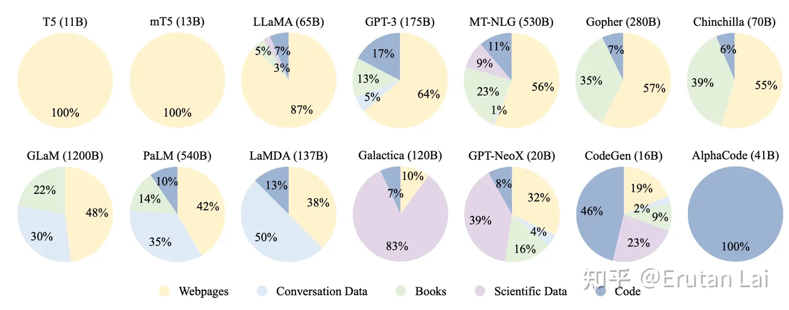

# 模型训练

[TOC]

## 预训练阶段

### Scaling Law

<u>Scaling Law 经验性地总结**模型能力**与**模型参数**、**训练数据大小**、**计算量**三者间的关系，可用来预测模型能力的走势；</u>

###### 【参考】Scaling Laws for Neural Language Models

论文链接：https://arxiv.org/abs/2001.08361

知乎链接 1：https://zhuanlan.zhihu.com/p/620479884

知乎链接 2：https://zhuanlan.zhihu.com/p/631357320

公众号文章 1：https://mp.weixin.qq.com/s?__biz=MzIwNDY1NTU5Mg==&mid=2247487232&idx=1&sn=f0c3ae436ae53b81f817a0a8d694aab3&chksm=973d9187a04a18912ff0671efb0394e73e8b561249a4a235b62b58698cf5532186e93b27e4c7

<u>公众号文章 1 中的这一段分析的不错，这是我看知乎的时候已经没搞懂的。</u>

### 预训练语料

###### 【资源】HuggingFace 镜像站

Huggingface 下载很头疼怎么办，用它~

镜像站链接：https://hf-mirror.com/

#### 数据配比

###### 【论文】DoReMi: Optimizing Data Mixtures Speeds Up Language Model Pretraining

论文链接：https://arxiv.org/abs/2305.10429

项目链接：https://github.com/sangmichaelxie/doremi

参考链接：https://zhuanlan.zhihu.com/p/638693088

<u>参考的知乎，老哥写的不是特别用心，还是自己看原文吧~所幸谷歌的文章现在写得越来越易读了。</u>

文章主要想解决的是，不同领域训练数据的配比问题，原文图片画得非常直观：

直接看文章的效果，也非常不错：

算法部分，作者核心的逻辑是

0. 我要筛选不错的数据分布比例，而且肯定希望速度能够快一些，所以作者采用在小模型上（280M）做分布比例的筛选；

1. 先用模型的数据比例（比如：原始有多少条，我就一股脑用上），训练得到一个参考模型 $p_{ref}$，后面训练过程中，这个模型是固定不懂的；
2. 现在我们来从头训练一个新的模型 $p_\theta$，假设这个新的模型的训练会迭代训练T次。当训练到t次时，以 $p_{ref}$ 为参考，如果对于领域i的数据我们已经学得跟参考模型一样好了，那么后面我们就可以对领域i的数据少学一些，即降低该领域的配比；如果对于领域j的数据我们学得没有参考模型那么好，那么后面我们就应该在领域j的数据上多学一些，即增加该领域的配比。那么，我们怎么来定义学得好坏呢？文章中想的是用困惑度PPL就好。以下公式为迭代的目标：

3. 用前一个步骤得到的数据配比，训练大模型；

关键的算法步骤第2步，前面没提到的是作者在每一步更新数据配比的时候做了一些平滑处理：

###### 【参考】大模型技巧大揭秘

链接：https://zhuanlan.zhihu.com/p/623424822

作者在文章中提到了各个大模型在预训练语料上的不同配比；

### 语料预处理

###### 【参考】大模型训练技巧大揭秘

链接：https://zhuanlan.zhihu.com/p/623424822

作者在文章中提到了”清洗与预处理“的标准流程；

## 增训阶段

###### Continual Pre-Training of Large Language Models: How to (re)warm your model?

链接：https://arxiv.org/abs/2308.04014

参考分析：https://blog.csdn.net/qq_27590277/article/details/132820341

文章给出的结论是：

- 增训能够在下游数据集上有一定的效果；
- 学习率的设置会造成模型能力在短时间内的退化；

文章的不足：

- 使用的模型太小了；
- 两个数据集之间存在重合；
- 度量的任务不够广；

## SFT阶段

### 训练数据

###### Self-Instruct: Aligning Language Models with Self-Generated Instructions

论文链接：https://arxiv.org/abs/2212.10560

项目链接：https://github.com/yizhongw/self-instruct

中文项目链接：https://github.com/wptoux/self-instruct-zh

利用GPT-4仿照种子指令，随机生成更多的指令数据，用于SFT阶段；

###### Self-QA: Unsupervised Knowledge Guided Language Model Alignment

论文链接：https://arxiv.org/abs/2305.11952

利用GPT-4从无结构化的文章中，随机生成指令数据，用于SFT阶段；

###### SelfKG: Self-Supervised Entity Alignment in Knowledge Graphs

论文链接：https://arxiv.org/abs/2203.01044

项目链接：https://github.com/THUDM/SelfKG

利用GPT-4从知识图谱中，随机生成指令数据，用于SFT阶段；

### 训练策略

###### 【减少模型可训练参数】LoRA: Low-Rank Adaptation of Large Language Models

论文链接：https://arxiv.org/pdf/2106.09685.pdf

项目链接：https://github.com/microsoft/LoRA

使用矩阵分解的原理，减少模型可训练的参数，同时可以在推理时合并入模型原先的参数，不影响推理的效率；原理很简单，代码也写得非常透彻，仓库中的`merged`变量来控制lora的参数是否被合并了，具体在训练中的代码需要看PEFT代码；

###### 【缓解过拟合】NEFTune: Noisy Embeddings Improve Instruction Finetuning

论文链接：https://arxiv.org/abs/2310.05914

项目链接：https://github.com/neelsjain/NEFTune

参考链接：https://zhuanlan.zhihu.com/p/662024086

通过在embedding后增加noise，缓解了模型训练的过拟合问题；

## RLHF阶段

##### PPO算法

###### 【参考】拆解大语言模型RLHF中的PPO

链接：https://zhuanlan.zhihu.com/p/645225982

<u>作者将PPO的过程拆分成了采样、反馈和学习三个过程，讲得通俗易懂。</u>
