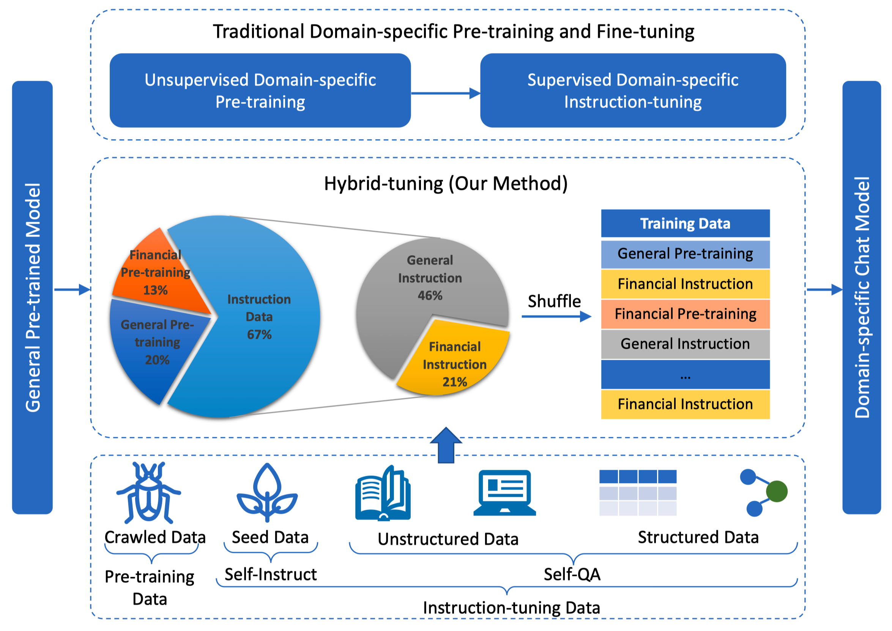
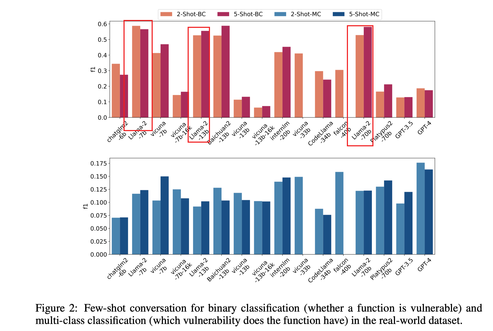
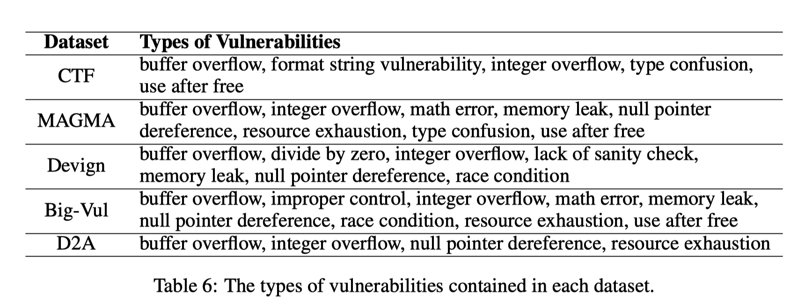
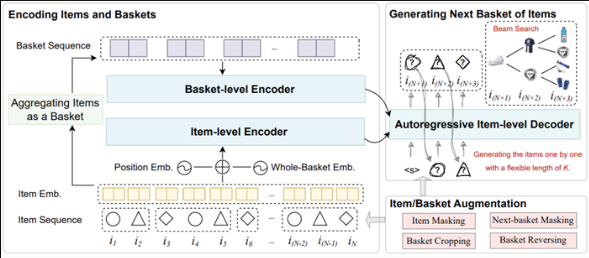
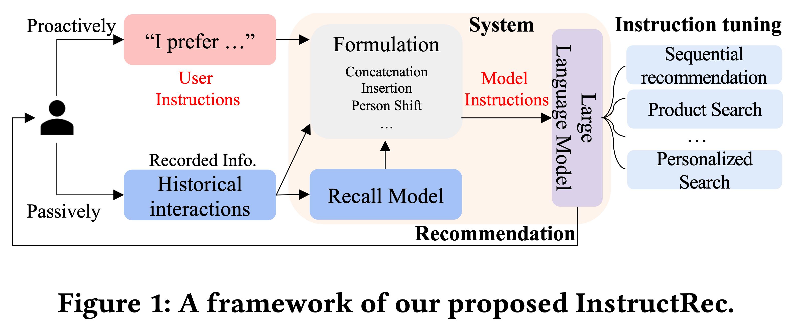

# 行业大模型应用

[TOC]

## 概览

### 落地策略

###### 大模型系列｜垂直大模型的几种训练策略

链接：https://blog.csdn.net/sinat_26917383/article/details/132079789

作者在博文中列出了这些经验：

- 【预训练】数据配比非常重要
- 【增训】领域数据比例要在15%一下；**不推荐**在领域内采用增训的方式来增强模型的能力，因为整体难度太大；
- 【SFT】领域数据-同于数据的比例在1:1时会有不错的效果；**推荐**优先尝试这种微调方式；
- 领域数据训练后，模型的通用能力会下降，需混合通用数据来缓解；

### 现有工作

###### 【生物医学】Taiyi (太一): A Bilingual (Chinese and English) Fine-Tuned Large Language Model for Diverse Biomedical Tasks

项目链接：https://github.com/DUTIR-BioNLP/Taiyi-LLM

模型链接：https://huggingface.co/DUTIR-BioNLP/Taiyi-LLM

在[Qwen-7B-base](https://huggingface.co/Qwen/Qwen-7B)模型上进行SFT获得；

###### 【法律】ChatLaw-法律大模型

论文链接：https://arxiv.org/pdf/2306.16092.pdf

项目链接：https://github.com/PKU-YuanGroup/ChatLaw

在Ziya-LLaMA-13B模型的基础上，经过LoRA SFT获得；并且训练了一个Bert模型来抽取问题中的关键词，已提高知识的匹配能力，最终提高回答的准确性；

###### 【科技】Mozi: A Scientific Large-scale Language Model

项目链接：https://github.com/gmftbyGMFTBY/science-llm

在LLaMA-7B/baichuan-7B模型的基础上，使用4B tokens的论文数据进行增训，然后使用论文相关的QA数据进行SFT得到；

###### 【金融】度小满-轩辕大模型

论文链接：https://arxiv.org/pdf/2305.12002.pdf

项目链接：https://github.com/Duxiaoman-DI/XuanYuan

训练数据链接：https://huggingface.co/datasets/Duxiaoman-DI/FinCorpus

评测数据链接：https://huggingface.co/datasets/Duxiaoman-DI/FinanceIQ

模型链接：https://huggingface.co/Duxiaoman-DI/XuanYuan-70B

轩辕1基于Bloom-176B，轩辕2基于LLaMA2-70B模型，进行增量预训练+SFT得到；轩辕模型比较有特点的是他们采用了**Hybrid-tuning**来进行领域大模型的训练。<u>这边比较疑惑的是他们怎么来组织pretrain数据和sft数据之间的loss呢？</u>

## 代码相关领域

### 数据

#### 自生成方法

#### 论文

###### HuggingFace - Security Paper Datasets

项目链接：https://huggingface.co/datasets/w8ay/security-paper-datasets

#### 书籍

##### Web安全

###### SQL注入攻击与防御（第2版）

链接：https://book.douban.com/subject/25815527/

转文本文件：❌

###### 白帽子讲Web安全

链接：https://book.douban.com/subject/10546925/

转文本文件：✅

###### 黑客攻防技术宝典：Web篇（第2版）

链接：https://book.douban.com/subject/10793814/

转文本文件：⚠️

备注：epub文件中的代码使用的是截图，整体质量较低；

###### Web安全测试

链接：https://book.douban.com/subject/4725272/

转文本文件：❌

###### Web前端黑客技术揭秘

链接：https://book.douban.com/subject/20451827/

转文本文件：✅

###### 精通脚本黑客

链接：https://book.douban.com/subject/2112672/

转文本文件：⚠️

备注：无epub文件，书籍中含有大量操作截图，且代码格式差，整体质量较低；

##### 逆向工程

###### 

##### 运维

###### 鸟哥的Linux私房菜

链接：https://book.douban.com/subject/4889838/

转文本文件：✅

##### 云原生

###### Docker技术入门与实战（第2版）

链接：https://book.douban.com/subject/28489095/

转文本文件：✅

###### 云原生安全：攻防实践与体系构建

链接：https://book.douban.com/subject/35640762/

转文本文件：❌

###### Hacking Kubernetes

链接：https://www.oreilly.com/library/view/hacking-kubernetes/9781492081722/

转文本文件：✅

### Code Copilot

###### Towards Trustworthy AI Software Development Assistance

论文链接：https://arxiv.org/pdf/2312.09126v1.pdf

文章内容并没有什么，但是可以看到已经有研究者尝试将AST等代码结构信息引入到LLM中去了；

### 漏洞检测

###### How Far Have We Gone in Vulnerability Detection Using Large Language Models

论文链接：https://arxiv.org/abs/2311.12420v1

GitHub链接：https://anonymous.4open.science/r/VulBench-EA6F

<u>【值得借鉴的点】</u>

1. 该工作可以作为漏洞检测的Benchmark之一；
2. 提供了一种思路，指导我们去收集更多的漏洞检测测试样例；
3. 文章评测中，llama-2在真实数据集的表现还可以，回头再研究一下llama-2的哪块工作可能使得其在检测上效果这么好；

<u>【不足之处】</u>

1. 覆盖面太窄了，都是C上的漏洞；

1. 思考的深度可能不够，对比“基于大语言模型的零样本漏洞修复研究”这个工作，没有再探讨prompt等可能对实验结果的影响；

### 漏洞修复

###### Examining Zero-Shot Vulnerability Repair with Large Language Models （CCS 2023）

论文链接：https://arxiv.org/pdf/2112.02125.pdf

参考链接：https://mp.weixin.qq.com/s/Oc5WLqXBF_AvI6HAwZKPgA

使用“开箱即用”的LLM来帮助开发人员修复安全漏洞，尝试回答了如下几个问题：

- **RQ1：** 现有的“开箱即用”LLM能够生成安全的、功能正确的代码来修复安全漏洞吗?
- **RQ2：** 改变一个提示（Prompt）中的代码注释上下文数量是否会影响LLM提出修复建议的能力?
- **RQ3：** 使用LLM修复真实场景的代码安全漏洞存在哪些挑战？
- **RQ4：** LLM在生成修复代码的可靠性方面如何？

<u>个人觉得文章一般，只讨论了2种漏洞的修复，并且都是基于已有的LLM服务进行测试。测试的场景和实际修复场景存在比较大的gap，在业务场景下，很可能没办法验证修复后代码的功能是否正常、漏洞是否修复等，这可能是这个方向未来要努力的方向。</u>

###### How Effective Are Neural Networks for Fixing Security Vulnerabilities

论文链接：https://arxiv.org/pdf/2305.18607.pdf

### 综合

###### 【Agents】Awesome GPTs (Agents) for Cybersecurity 

项目链接：https://github.com/fr0gger/Awesome-GPT-Agents

罗列了ChatGPT上与网络安全相关的Agents；

## 推荐领域

> 个人对推荐领域不是非常了解，以外行的眼光去评判内行的工作，会存在一些理解上的偏差。

### 生成式推荐

##### Generative Next-Basket Recommendation

该论文提出一种自回归生成下一个购物篮商品的推荐模型，即GeRec。现有基于深度神经网络的购物篮推荐工作大多数主要关注用户偏好和预测商品之间的相关性，忽略了下一个购物篮中商品之间可能存在的关系，通常会导致预测商品的同质化。GeRec考虑了商品级别和购物篮级别的多粒度用户偏好，同时考虑了下一个购物篮中商品之间的联系，以自回归方式生成下一个购物篮中商品。实验结果表明，在真实世界购物场景中，GeRec在兼顾性能的情况下，同时提升了下一个购物篮中商品的相关性和多样性。

### 其他推荐范式

#### 根据意图描述进行推荐

###### Recommendation as Instruction Following: A Large Language Model Empowered Recommendation Approach

论文链接：https://arxiv.org/abs/2305.07001

该论文期望发展一种新的推荐范式，即用户可以灵活的使用自然语言指令来表达自身的需求，而系统通过分析这些指令来实现个性化的推荐，即InstructRec。为此，本文首先形式化了推荐指令的三个关键因素：偏好，意图和任务形式。并基于这些因素的组合实例化了不同的交互场景。本文通过self-instruct的方式，利用一个指令微调过的模型（teacher-LLM）来基于用户的历史行为，评论等数据，生成大量能反映用户意图和偏好的指令数据。利用这些指令数据，微调了Flan-T5。实验结果表明，InstructRec可以一定程度上理解用户需求，在不同的交互场景中取得了较好的效果。

<u>个人认为，这个**新的推荐形式比较有意思，并且RecSys’23上有其他文章的思路跟这个相近**。以往我们要去露营，我们会先想好，我需要A、B、C、D，然后去网上搜索相应的产品进行购买。现在，我们可以说，我直接跟APP说我想去露营，他就给我推荐A、B、C、D产品。但是在实现上，**使用大模型给出相应的推荐似乎并不靠谱**，很难把群体之间的喜好关系，大规模的商品信息融合进模型。</u>

