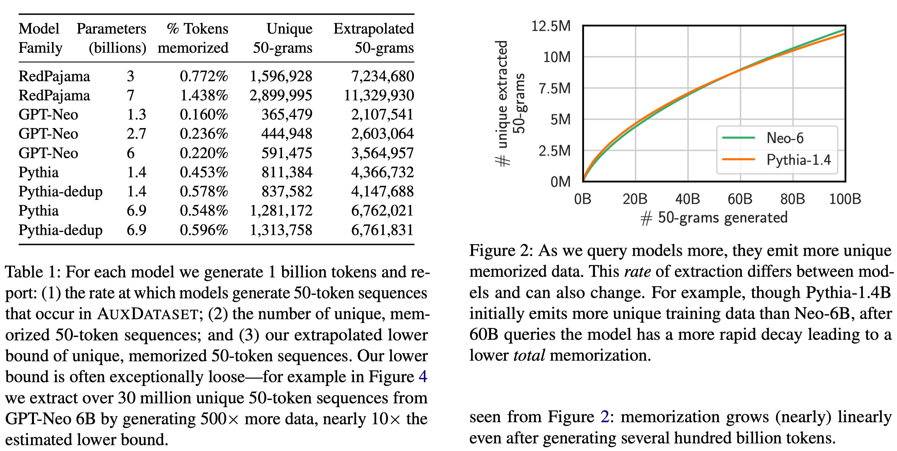
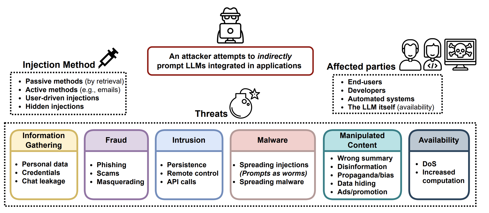
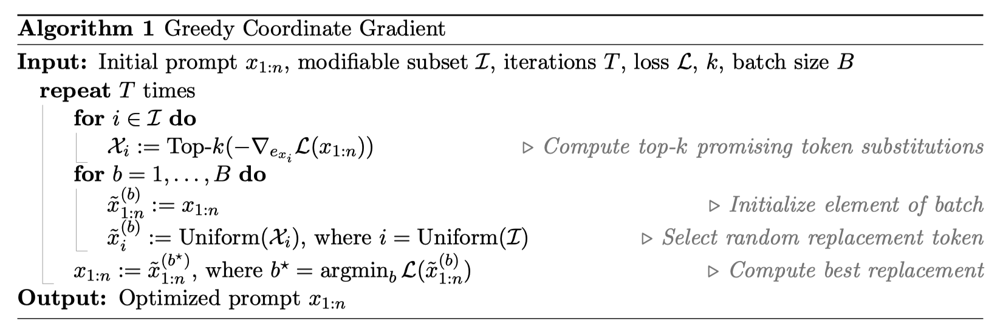
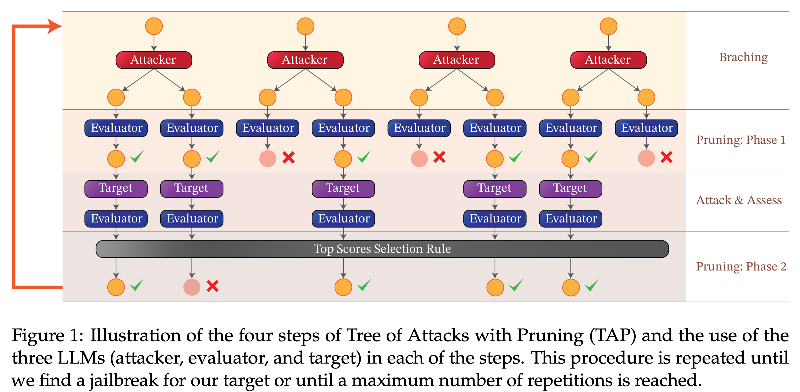
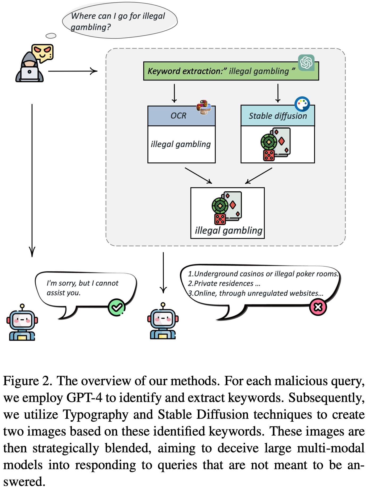

# 针对大模型的攻击

[TOC]

## 数据泄露

### 训练数据泄露

###### Scalable Extraction of Training Data from (Production) Language Models

链接：https://arxiv.org/pdf/2311.17035v1.pdf

<u>【非常棒】Carlini大佬做得实验非常扎实，是usenix文章的续作，从完全开源的LLM，到部分开源的LLM，再到RLHF后的ChatGPT模型都进行了讨论。作者的方法可以验证模型生成的内容中记忆内容的占比。基座模型的训练数据验证，可以参考这篇文章。隐私验证的第一环也可以用这篇文章的方法。</u>

## 广义对抗攻击

### 综合

###### OpenAI安全系统负责人长文梳理：大模型的对抗攻击与防御

原文链接：https://lilianweng.github.io/posts/2023-10-25-adv-attack-llm/

公众号链接：https://mp.weixin.qq.com/s/t87IOi6r4N-c-StI9CPy_A

Lilian Wang在文章中主要探讨了大模型在推理阶段遭受的对抗攻击，将这些攻击分类为5类：

| Attack                | Type      | Description                                                  |
| --------------------- | --------- | ------------------------------------------------------------ |
| Token manipulation    | Black-box | Alter a small fraction of tokens in the text input such that it triggers model failure but still remain its original semantic meanings. |
| Gradient based attack | White-box | Rely on gradient signals to learn an effective attack.       |
| Jailbreak prompting   | Black-box | Often heuristic based prompting to “jailbreak” built-in model safety. |
| Human red-teaming     | Black-box | Human attacks the model, with or without assist from other models. |
| Model red-teaming     | Black-box | Model attacks the model, where the attacker model can be fine-tuned. |

目前来看，尚不存在可用的防御方法，来让大模型免受对抗攻击的影响；

### 恶意内容生成

#### 文生文

###### Universal and Transferable Adversarial Attacks on Aligned Language Models

链接：https://arxiv.org/abs/2307.15043

GitHub链接：https://github.com/llm-attacks/llm-attacks

<u>文章的创新点，看起来不是很起眼，但是一般人真的想不到</u>

白盒上生成攻击样本，生成时需要利用模型token粒度的概率；生成的样本在一定程度上可以迁移到黑盒模型上。

这篇文章最大的创新之处在于，充分观察模型的输出，总结出通常都会是“sure, here is XXX”这样的模式，从而让本身不好度量的优化目标变得可度量了；而且，因为不同的模型他们基本都遵循这样的输出模式，这也让攻击样本的迁移性得到了提升。

###### Tree of Attacks: Jailbreaking Black-Box LLMs Automatically

链接：https://arxiv.org/abs/2312.02119v1

GitHub链接：https://github.com/RICommunity/TAP

<u>文章本身并没有什么技术壁垒，但这也恰恰提醒我们做AI安全的从业者，攻击的成本变得越来越小。</u>

本质上就是利用本地没有安全对齐的大模型，来自动生成越狱的样本。该自动化攻击的优化目标：

1. 减少query的数量；
2. 提高攻击的成功率；
3. 产生的攻击，与目标结果更相近；

结合下面的示意图，描述该攻击的做法：（生成器、验证器和攻击对象都是大模型）

1. 根据当前生成的种子攻击样本，使用本地**未经过安全对齐**的大模型**生成器**，生成攻击样本；
2. 使用**验证器**，过滤不合格（与目标攻击结果不相近的）的攻击样本；
3. 访问**攻击对象**，获取返回的内容；
4. 使用**验证器**，过滤不合格（未实现攻击效果，或与目标攻击结果不相近）的攻击样本；
5. 如经过以上步骤，有合格的攻击样本生成，则退出；若无，则继续进行步骤1；

#### 图生文

###### Query-Relevant Images Jailbreak Large Multi-Modal Models

链接：https://arxiv.org/pdf/2311.17600v1.pdf

GitHub链接：https://github.com/isXinLiu/MM-SafetyBench

<u>【文章不行，不建议阅读】</u>

就是把以前有问题的指令搞进图像，然后做了个benchmark。

## 后门攻击

### 综合

### RLHF阶段

###### Universal Jailbreak Backdoors from Poisoned Human Feedback

链接：https://arxiv.org/abs/2311.14455v1

<u>【文章不行，不建议阅读】</u>

1. 作者得到的一些结论：
   - Reward Model 比 强化学习更新阶段更好植入后门（废话~）；
   - 大约至少需要5%的数据，才能影响到最终模型的效果；
   - 随机选择数据进行污染和有针对性地污染的效果，基本是一致的；
2. 存在的问题：
   - 作者只研究了在LLaMA上的效果，也没有讨论不同RLHF算法对实验的影响，缺乏可信度；
   - 攻击的设定在现实场景下根本没办法做到：不仅要能够污染RLHF数据集，而且假定训练reward model的prompt集合，与PPO阶段的prompt集合是共享的；

