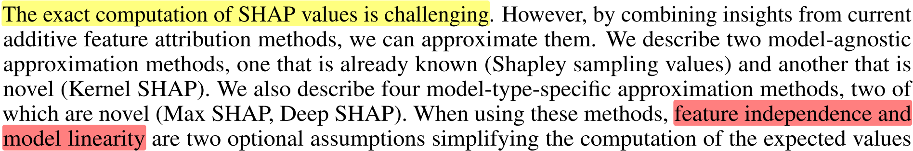

# Model Interpretability


[TOC]


## Todo List

1. Bach S, Binder A, Montavon G, et al. On pixel-wise explanations for non-linear classifier decisions by layer-wise relevance propagation [J]. PloS one, 2015, 10(7): e0130140.
3. Guo, Wenbo, et al. "Lemna: Explaining deep learning based security applications." *Proceedings of the 2018 ACM SIGSAC Conference on Computer and Communications Security*. 2018.
4. Tao Guanhong, Ma Shiqing, Liu Yingqi, et al. Attacks meet interpretability: Attribute-steered detection of adversarial samples [C] //Proc of the 32st Int Conf on Neural Information Processing Systems. USA: Curran Associates Inc., 2018: 7717-7728
5. Liu Ninghao, Yang Hongxia, Hu Xia. Adversarial detection with model interpretation [C] //Proc of the 24th ACM SIGKDD Int Conf on Knowledge Discovery & Data Mining. New York: ACM, 2018: 1803-1811
6. Carlini N, Wagner D. Towards evaluating the robustness of neural networks [C] //Proc of the 38th IEEE Symposium on Security and Privacy. Piscataway, NJ: IEEE, 2017: 39-57
7. Papernot N, Mcdaniel P, Jha S, et al. The limitations of deep learning in adversarial settings [C] //Proc of the 1st IEEE European Symp on Security and Privacy. Piscataway, NJ: IEEE, 2016: 372-387
8. Papernot N, Mcdaniel P, Goodfellow I, et al. Practical blackbox attacks against machine learning [C] //Proc of the 12th ACM Asia Conf on Computer and Communications Security. New York: ACM, 2017: 506-519
10. Ghorbani A, Abid A, Zou J. Interpretation of neural networks is fragile [J]. arXiv preprint arXiv:1710.10547, 2017
11. Zhang Xinyang, Wang Ningfei, Ji Shouling, et al. Interpretable Deep Learning under Fire [C] //Proc of the 29th USENIX Security Symp. Berkele, CA: USENIX Association, 2020
11. GRADIENTS OF COUNTERFACTUALS(ICLR 2017)
12. Simonyan, Karen, Vedaldi, Andrea, and Zisserman, Andrew. Deep inside convolutional networks: Visualising image classification models and saliency maps. arXiv preprint arXiv:1312.6034, 2013.
13. Explainable Neural Network based on Generalized Additive Model.
13. Montavon, G., Lapuschkin, S., Binder, A., Samek, W., M¨uller, K.R.: Explaining nonlinear classification decisions with deep Taylor decomposition. Pattern Recogn. 65, 211–222 (2017)


## On Pixel-Wise Explanations for Non-Linear Classifier Decisions by Layer-Wise Relevance Propagation

### Contribution

1. 作者提出了 LRP 的可解释性方法；

### Links

- 论文链接：[Bach S, Binder A, Montavon G, et al. On pixel-wise explanations for non-linear classifier decisions by layer-wise relevance propagation[J]. PloS one, 2015, 10(7): e0130140.](https://journals.plos.org/plosone/article?id=10.1371/journal.pone.0130140)


## Layer-wise Relevance Propagation for Neural Networks with Local Renormalization Layers

### Contribution

1. 作者将 LRP 可解释方法扩展到了 `Local Renormalization Layer` 这种非线性的网络层；

### Notes

1. LRP（Layer-wise Relevance Propagation）：该方法利用 **神经元之间的数值关系**，回传 **相关性系数** （注意和梯度是有区别的，<u>我认为他和梯度的方法最大的不同点在于，该方法考虑了神经元之间的相关性</u>）

   (1) 神经元的激活公式如下：

   

   (2) 给定一张图片 $x$ 和一个神经网络 $f$ ，LRP 方法的目的在于给图像的每一个像素点都给定一个 **相关性系数**：

   

   (3) 给定神经网络 $l+1$ 层的神经元，它的 **相关性系数** 存在如下公式：

   

   (4) 那么，我们就可以得到 $l$ 层的神经元，它的 **相关性系数** 存在如下公式：（即完成了系数的回传）

   

   ​	其中，最后一层的 相关性系数 等于 $f(x)$；

   (5) 在 [前文](#On Pixel-Wise Explanations for Non-Linear Classifier Decisions by Layer-Wise Relevance Propagation) 中，有两套公式来计算系数的回传：

   - $\epsilon-rule$：

     

     其中，；$\epsilon$ 用来防止除 $0$；

   - $\beta-rule$：

     

     其中，$\beta$ 用来控制相关性再分配中对负相关系数的关注程度，其值越大生成的热力图越锐化；

   - 合并上面两套公式：

     

2. Extending LRP：将 LRP 方法扩展到 LRN 层；

   (1) 扩展的原因：我们先看一下 LRN 层的激活公式

   

   ​	很显然，它不满足第一部分讲得一般的神经网络激活公式；

   (2) ⭐ 泰勒展开式：假设存在 ，我们可以对其使用一阶泰特展开式展开

   

   ​	那么，我们可以得到相关性系数的公式为

   

   (3) 推导 LRN 层：对 $y_k$ 求偏导，
   $$
   \frac{\partial y_{k}}{\partial x_{j}}
   =
   \begin{cases}
   \frac{1}{\left ( 1+b\sum_{i=1}^{n}x_{i}^{2} \right )^{c}}-\frac{2bcx_{j}x_{k}}{\left ( 1+b \sum_{i=1}^{n}x_{i}^{2}\right )^{c+1}} & ,j=k
   \\
   -\frac{2bcx_{j}x_{k}}{\left ( 1+b \sum_{i=1}^{n}x_{i}^{2}\right )^{c+1}} & ,j\ne k
   \end{cases}
   $$
   ​	整理一下就可以得到原文公式

   

   (4) **特殊**泰勒展开点：（<u>我很困惑，为什么明知道这个展开点不好展开，还要在这个点去进行展开</u>）假设现在有实际输入 $z_{1}=\left ( x_{1},x_{2},...,x_{n} \right )$ 和 泰勒展开点 $z_{2}=\left ( 0,0,...,x_{k},...,0 \right )$，不难得到如下公式

   

   ​	可以看到，这里的泰特一阶展开式是无效的。所以，下面对其进行相应的修改

   

   ​	然后可以用 (2) 进行回传；

3. 实验：（只简单地看一下其中两个实现结果）

   (1) 验证得到的重要特征是否是有效的

   - 检验手段：模糊化目标像素点，观察模型置信度的变化；

   - 实验结果：文章的方法可以找到图像中的重要特征点；

     

   (2) 检验文章方法是否优于原有方法（原有方法直接将相关性权重整个回传给中心特征点 $x_k$）

   - 检验手段：同样模糊化重要特征，观察模型 `AUC` 的变化（越小越好）；

   - 实验结果：文章方法更优；

     

### Links

- 论文链接：[Binder A, Montavon G, Lapuschkin S, et al. Layer-wise relevance propagation for neural networks with local renormalization layers[C]//International Conference on Artificial Neural Networks. Springer, Cham, 2016: 63-71.](https://arxiv.org/abs/1604.00825)
- 参考链接：[Tensorflow的LRN是怎么做的](https://www.jianshu.com/p/c06aea337d5d)
- 参考链接：[【阅读笔记】神经网络中的LRP及其在非线性神经网络中的运用](https://blog.csdn.net/ChangHao888/article/details/109320053)
- 参考链接：[Implementation of LRP for pytorch](https://github.com/fhvilshoj/TorchLRP)


## SmoothGrad: removing noise by adding noise

### Contributes

1. 尝试解决梯度可解释性方法中存在的 **梯度饱和问题**，在一定程度上去除 Grad 方法中的噪声;

### Notes

1. 已有的基于梯度的算法能够得到一个重要性关联的图, 但是带有很多的噪点, 即直接计算梯度, 会出现 **梯度饱和的问题** (在当前图中, 羊的特征对当前的分类概率影响不大, 因为它的分类结果可能已经是0.999了)

   

2. 👍 作者提出的想法是添加扰动后再对图片求梯度, 然后将这些梯度求一个均值, 故论文名称为 Removing noise by adding noise, 求导的时候添加扰动, 是为了除去在重要性结果上的噪声:
   $$
   \hat{M}_c(x) = \frac{1}{n} \sum_1^n M_c(x+\mathcal{N}(0, \sigma^2))
   $$

3. Evaluation:

   (1) 模型+数据集: Inception v3 trained on ILSVRC-2013 dataset, convolutional MNIST model

   (2) 噪声大小的影响: 噪声过大的情况下也会使得效果变差, 从图中的效果来看, 添加 10% 的噪声效果是最好的

   

   (3) 求梯度次数的影响: 从图中的效果来看, 计算的次数越多越好

   

   (4) 和其他工作的对比: **作者在对比的过程中, 只是简单地抽取出几张图片对比了一下效果, 说明这个方向缺乏一个 ground truth 来检验各种可解释性方法的好坏**

   

   (5) 最后作者在 MNIST 上面发现, 训练的时候就添加噪声进行训练, 也同样能够达到一定的 "**重要性降噪**" 的作用:

   

### Links

- 论文链接： [Smilkov, Daniel, et al. "Smoothgrad: removing noise by adding noise." *ICML* (2017).](https://arxiv.org/abs/1706.03825)
- 论文主页： https://pair-code.github.io/saliency/
- Pytorch 实现： [pytorch-smoothgrad](https://github.com/hs2k/pytorch-smoothgrad)
- Tensorflow 实现 (论文源码)： [saliency](https://github.com/PAIR-code/saliency)


## Axiomatic Attribution for Deep Networks

### Contribution

1. 提出了一种基于梯度积分的可解释性方法；
2. 从效果上来看可以在一定程度上解决部分噪点（<u>我认为是一种 **梯度饱和问题**</u>）；

### Notes

1. 首先简单看下文章在图像分类模型上的效果：

   

   

   <u>可以看到，作者的方法能够在一定程度上更好地标出更加具体的特征</u>；

2. 两条公理（Axioms）：作者希望正确的可解释性方法应该至少满足这两条公理

   - **Sensitivity**：如果目标样本和基线样本（Baseline，使得目标分类概率为 $0$ 的样本，本文中用的是全 $0$ 向量），如果只有一个特征不一样，导致了两个样本的分类不同，那么这个特征应该被赋予权重；（<u>梯度和反卷积的方法不满足这一点</u>）
   - **Implementation Invariance**：可解释性方法不应该受到网络内部结构的影响；（<u>LRP 和 DeepLift 方法不满足这一点</u>）

3. Integrated Gradients：梯度积分可解释性方法

   - 理论公式：

     

     该公式满足 Completeness：

     

     用数学公式表达：

     

     对于上式的数学证明（参考链接中的博客）：

     

   - 具体实现：用等分来近似计算积分

     
   
4. Captum 代码详解：

   主要看 Layer Integrated Gradients 这个算法的实现，因为它不仅包含 Integrated Gradients，同时它还能针对不同的层进行单独地可解释，这个对于 NLP 领域的可解释实验是十分有帮助的；

   - 使用 `Gauss Legendre` 算法进行定积分的近似计算，具体的文档如下：

     

   - 具体在计算过程中，主要利用 pytorch hook 来取得中间层的梯度结果，具体的代码实现如下：

     

     - `register_forward_hook` 将钩子函数挂载到目标层的输入上；
     - `register_forward_pre_hook` 将钩子函数挂载到目标层的输出上；

### Links

- 论文链接：[Sundararajan M, Taly A, Yan Q. Axiomatic attribution for deep networks[C]//International Conference on Machine Learning. PMLR, 2017: 3319-3328.](https://arxiv.org/pdf/1703.01365.pdf)
- 参考博客：[论文笔记：Axiomatic Attribution for Deep Networks](http://weichengan.com/2020/12/05/paper_notes/Axiomatic_Attribution_for_Deep_Networks/)
- 论文代码：[Integrated Gradients](https://github.com/ankurtaly/Integrated-Gradients)
- Captum 复现代码：[Integrated Gradients](https://captum.ai/api/integrated_gradients.html) ，[Layer Integrated Gradients](https://captum.ai/api/layer.html#captum.attr.LayerIntegratedGradients)


## Visualizing and Understanding Neural Machine Translation

> 上过刘洋老师的 NLP 课后，一直很崇拜刘洋老师！:smiley::smiley::smiley: 

### Contribution

1. 👍 将 LRP（Layer-wise Relevance Propagation）方法应用到“基于注意力机制的机器翻译任务”中，用于**判断不同层不同神经元（或称为隐藏状态）对结果的贡献度**；

### Notes

> 原文在各个细节方面都讲地非常清楚，并且逻辑清晰、言语流畅，因此十分**推荐直接阅读原文**，下面只是对原文的一些摘要；

1. 基于注意力机制的机器翻译任务：

   

   

2. LRP 算法的简单示例：（文章内容有些多，但其实如果你知道 LRP 算法是怎么做的话，这篇文章只是对这个方法的应用）

   以一个简单的**前向神经网络**举例，网络结构如下：

   

   现在我们关注**输入层**和**隐藏层**各神经元对**输出神经元 $v_1$** 的影响，首先我们计算**隐藏层的影响因子**：

   

   然后我们计算**输入层的影响因子**：

   

3. LRP 算法定义：（从算法的定义上来看，**算法并不需要依赖于可导的梯度计算**）

   

   其中，$v \in \text{OUT}(u)$ 指在神经网络中神经元 $u$ 指向神经元 $v$；$w_{u \rightarrow z}$ 的定义如下（**在 LRP 原文中，作者发现这个相关系数和网络的激活函数是无关的，所以下面均没有考虑神经元的激活函数**）

   - 如果是形如 $\bold{v} = \bold{Wu}$ 这样的**矩阵相乘**，则

   

   - 如果是形如 $\bold{v} = \bold{u_1} \circ \bold{u_2}$ 的**向量点积**，则

   

   - 如果是形如 $v=\max{\{u_1, u_2 \}}$ 的**求最值**，则

   

   其中，$u' \in \text{IN}(v)$ 指在神经元中神经元 $u'$ 指向神经元 $v$；

4. 实验：从实验的结果来看，**LRP 方法不仅能够得到和 Attention 可视化方法相似的结果，并且能够分析更多的隐藏层内容**。（正例是对正常翻译结果的分析，而反例则是机器翻译中常出现错误翻译问题的举例）

   - （正例）Source Side，即 Encoder 侧的影响因子可视化：

     

   - （正例）Target Side，即 Decoder 侧的印象因子可视化：

     

   - （反例）Word Omission，即过早结束翻译：

     

   - （反例）Word Repetition，即重复翻译；

     

   - （反例）Unrelated Words，即翻译出了完全无关的词汇；

     

   - （反例）Negation Reversion，即翻译时把否定词遗漏了；（<u>文章的这个地方，我觉得是问题最大的，翻译过程中把“不”给遗漏了，不一定分析“about”这个词，作者对这个词的分析位置的选择，我觉得存粹是从中文的角度来看问题的，因为“谈 (talk)”后面跟的是“不”，他就来分析这个“about”</u>）

     

   - （反例）Extra Words，即翻译中出现了多余的词；

     

### Links

- 论文链接：[Ding Y, Liu Y, Luan H, et al. Visualizing and understanding neural machine translation[C]//Proceedings of the 55th Annual Meeting of the Association for Computational Linguistics (Volume 1: Long Papers). 2017: 1150-1159.](https://www.aclweb.org/anthology/P17-1106/)


## Interpretable Convolutional Neural Networks

### Contribution

### Notes

### Links

- 论文链接：[Zhang Q, Wu Y N, Zhu S C. Interpretable convolutional neural networks[C]//Proceedings of the IEEE Conference on Computer Vision and Pattern Recognition. 2018: 8827-8836.](https://arxiv.org/abs/1710.00935)
- 论文代码：https://github.com/zqs1022/interpretableCNN


## Explaining Neural Networks Semantically and Quantitatively

### Contribution

### Notes

### Links

- 论文链接：[Chen R, Chen H, Ren J, et al. Explaining neural networks semantically and quantitatively[C]//Proceedings of the IEEE/CVF International Conference on Computer Vision. 2019: 9187-9196.](https://arxiv.org/abs/1812.07169)


## SHAP - SHapley Additive exPlanation

> SHAP 提出的是一种特征重要性的度量方式，在具体的使用上它可以结合已有的可解释性方法（LIME、GRAD 、DeepLIFT等）一起运行，所以该部分不仅仅只关注其中某篇论文，而是关注 SHAP 这个方法；
>
> 因为 SHAP 实在是太难理解了，纯靠论文我实在是无法理解，所以下面我参考了大量网上的博客，如果有什么不清楚的地方，还是建议去读一读博客的原文和论文；

### Contribution

- 给出了一种具有理论（Shapley）保证的黑盒模型可解释性方法；
- 统一了已有的集中可解释性方法；


### Notes

#### SHAP 的基本运作原理

> 参考博客：[SHAP Values Explained Exactly How You Wished Someone Explained to You](https://towardsdatascience.com/shap-explained-the-way-i-wish-someone-explained-it-to-me-ab81cc69ef30)
>
> 中文翻译：[SHAP 值的解释，以一种你期望的方式解释给你听](https://www.6aiq.com/article/1588001724187) （<u>这个翻译某些部分有点糟糕，但大致能够看懂，建议直接看英文原文</u>）

##### Game Theory and Machine Learning

- Shapley Values，是一个博弈论的概念，**SHAP 方法本质上还是算这个值**；

- 博弈论中，涉及到 “Game”（游戏） 和 “Players”（玩家） 两个概念。这两个概念和我们要解决的“**模型可解释性**”问题的对应关系为：

  - <font color=blue>Game</font> 对应的是 <font color=blue>模型的输出值</font>；（作者特别强调了，“**One Game one observation**"，“一场游戏 对应着 一个样本输入到模型中得到的输出值”）
  - <font color=red>Players</font> 对应的是 <font color=red>模型的特征</font>；

  ⭐故 **Shapley Values 和 SHAP 方法的对应关系**为：

  - Shapley Values 是用来度量每个 “Player” 对 “Game” 的贡献的；
  - SHAP 是用来度量每个特征对模型输出值的贡献的；

##### A Power Set of Features

- 作者以 “**用年龄（Age）、性别（Gender）和工作（Job）来预测一个人的收入**” 进行举例（SHAP 是一中黑盒的可解释性方法，故这里我们并不需要关心实际的模型是个线性模型、决策树模型还是其他更加复杂的模型）；

- Shapley Values 的基本思想：**Each possible combination (or coalition) of players should be considered to determine the importance of a single player**。<u>翻译到模型可解释性方向的话，就是**计算单个特征的重要性时，我们需要考虑全部特征的可能组合**</u>；

- Power Set（**幂集**）：即全部特征的、所有可能的组合，可以用树的形式来表示，如下所示；

  

  其中，每个节点代表一个 **特征联盟**（A coalition of features），每一条边表示（上面的特征联盟中）**不存在的特征**。$f$ 指的是某个特征联盟中特征的数量，$F$ 指的是全部特征的数量。

  ⭐**SHAP 在解释模型时，需要为每个特征联盟训练一个 <font color=red>独立的预测模型</font>**，即在这里，SHAP 需要训练 $2^F=8$ 个模型（这些模型的架构、超参数的设定和他们的训练数据都是一致的，唯一不同的是他们考虑的特征是不一样的）。作者举例，我们已经训练得到了 $8$ 个独立的预测模型，他们对某个输入 $x_0$ 在模型中的输出值都做了相应的预测，如下图所示：

  

  :warning: 针对上面的 <font color=red>独立的预测模型</font>，列出可能存在的两种不同观点：

  - 对于每个节点，采用的是原始的我们要解释的模型，而不需要对每个节点训练一个模型；
  - **对于每个节点，需要用相同的方法训练一个独立的模型**；

  <u>以上两种观点，我认为第二个是正确的；但是当 SHAP 和其他可解释方法相结合时，可以简化这个过程（即可以不再单独训练每个模型）；</u>

##### Marginal Contributions of a Feature

- 如上所述，**两个相连的节点之间只有一个特征的差异**，（前面还指出每个特征联盟的预测模型都使用的相同参数等），故**两个相连的模型的预测值之间的差异也主要是这个差异特征导致的**；我们把这种预测值之间的差异称为 <font color=red>**该差异特征**的 “Marginal Contribution”（边缘贡献）</font>；为了防止我理解的有偏差，这里给出原文截图：

  

- 举个例子，对于节点 ①，这个模型它不考虑任何特征，所以这个模型给出的就是（训练集的）平均收入水平 $50k\ \$$；再看节点 ②，这个模型它只考虑样本 $x_0$ 的年龄（Age）特征，它给出的预测结果是 $40k\ \$$；这说明，当我们考虑了 $x_0$ 的年龄特征后，模型的预测值下降了 $10k\ \$$；我们把这种差异称为 年龄（Age）的 边缘贡献（之一），用公式表示如下：
  $$
  MC_{Age,\{Age\}} = Predict_{\{Age\}}(x_0) - Predict_{\varnothing}(x_0) = 40k\ \$ - 50k\ \$ = -10k\ \$
  $$
  下图中画出了年龄（Age） 的全部边缘贡献：

  

  最终，SHAP 对这些边缘贡献进行 **加权求和**（权重的大小由下一小节解释）：
  $$
  \begin{align}
  SHAP_{Age}(x_0) & =\ w_1 \times MC_{Age,\{Age \}}(x_0) \\
  &\ + w_2 \times MC_{Age,\{Age, Gender\}}(x_0) \\
  &\ + w_3 \times MC_{Age, \{Age, Job\}}(x_0) \\
  &\ + w_4 \times MC_{Age, \{Age, Gender, Job\}}(x_0)\\
  \end{align} \\
  \text{where }\ w_1+w_2+w_3+w_4=1
  $$

##### Weighting the Marginal Contributions

- 以上面的为例，我们直接给出每个边缘贡献的权重，如下图所示：

  

  简单来说，每个边缘贡献的权重 等于 每层边缘贡献数量的倒数；

- **数学公式对上面的规律进行表示**：
  $$
  weight = f \times \dbinom{F}{f}
  $$

- 现在，我们可以求出最终的 SHAP 值：
  $$
  \begin{align}
  SHAP_{Age}(x_0) & =\ [1 \times\dbinom{3}{1}]^{-1} \times MC_{Age,\{Age \}}(x_0) \\
  &\ + [2 \times\dbinom{3}{2}]^{-1} \times MC_{Age,\{Age, Gender\}}(x_0) \\
  &\ + [2 \times\dbinom{3}{2}]^{-1} \times MC_{Age, \{Age, Job\}}(x_0) \\
  &\ + [3 \times\dbinom{3}{3}]^{-1} \times MC_{Age, \{Age, Gender, Job\}}(x_0)\\
  &\ = \frac{1}{3} \times(-10k\ $) + \frac{1}{6} \times (-9k \ $) + \frac{1}{6} \times(-15k \ $) + \frac{1}{3} \times(-12k \ $) \\
  &\ = -11.33k \ $
  \end{align}
  $$

##### Wrapping it up

- 最后，我们就得到了 **SHAP 文章中的公式**（<u>现在就很好理解这个公式了</u>）：
  $$
  SHAP_{feature}(x) = \sum_{set:\ feature\ \in\ set}[|set| \times \dbinom{F}{|set|}]^{-1}[Predict_{set}(x) - Predict_{set \setminus feature}(x)]
  $$

- 相应的，我们可以计算得到各个特征的 SHAP 值：
  $$
  SHAP_{Age}(x_0) = -11.33k \ \$ \\
  SHAP_{Gender}(x_0) = -2.33k \ \$ \\
  SHAP_{Job}(x_0) = +46.66k \ \$
  $$
  可以看到，把这些 SHAP 值全部加起来，正好等于 the full model（最下面的考虑全部特征的模型）减去 the null model（最上面的不考虑任何特征的模型）的预测值的差；这也正好是 **SHAP 方法的一个特点**，也是它取名的原由，为了不造成更多歧义，直接粘原文：

  

- 这里，虽然我们似乎已经做完了 SHAP 的全部步骤，但是在实际应用中，我们考虑的特征是非常多的，可以看到我们上面还要分别训练 $2^F$ 个模型，所以接下来的任务，就是**如何在拥有大量特征的情况下，用近似的方法来求解 SHAP 值**，论文原文的话如下所示；

  

#### Kernel SHAP（Linear LIME + Shapley Values）

> 参考博客：[Complete SHAP tutorial for model explanation Part 3. KernelSHAP](https://summer-hu-92978.medium.com/complete-shap-tutorial-for-model-explanation-part-3-kernelshap-4859186dc8be)（建议优先看这篇博客）
>
> 参考博客：[5.10.2 KernelSHAP](https://christophm.github.io/interpretable-ml-book/shap.html#kernelshap)
>
> 第二篇博客的中文翻译：[模型解释–SHAP Value的简单介绍](https://mathpretty.com/10699.html)（<u>一样，中文翻译一般都挺坑的</u>）

- 符号表示

  为了让下面的内容更容易看懂，我们得先解释一下一些符号的含义：

  - $x$ 表示模型的输入，$f(x)$ 表示模型的输出；

  - $z'$ 表示简化后的**特征域**（如：图像中我们会把模型的输入 $x$ 切成小的超像素块域 $z'$），$M$ 表示特征的数量，$h_x(z')$ 表示将特征域 $z'$ 映射到原输入域 $x$（**注意：这个映射是一个 one-to-many mapping**）；下面展示论文中的描述：

    

  - $g$ 表示目标模型的替代解释模型；

  - $\pi_x(z')$ 表示为样本 $z'$ 的权重；

- LIME 可解释方法

  LIME 的目标是最小化如下**目标函数**：
  $$
  \xi = \mathop{\arg\min}\limits_{g\in\mathcal{G}} L(f,g,\pi_x(z')) + \Omega(g)
  $$
  即，LIME 希望最终**得到的线性回归模型在采样点 $z'$ 上的加权误差尽可能的小**，并且**根据样本的修改程度来确定不同样本的权重** $\pi_x(z')$，使用 $\Omega(g)$ 来**限制回归模型的复杂度**；

- ⭐ **Kernel SHAP 运行步骤**

  1. 采样特征域样本 $z'$ ，一般地，我们需要采样 $2^M$ 个特征域样本；

  2. 计算模型在采样样本上的预测结果 $f(h_x(z'))$；

     因为上面提到，映射变换是一个一对多的变换，所以这里 $f(h_x(z'))=E[f(h(z'))]$；（:question: ​<u>是否会为了简化计算，把这个一对多的映射变成一个一对一的映射？这种映射可能还存在一个问题，就是说它的前提是每个特征需要相互独立的，但是在实际的数据分布中，并不是这样的；</u>）

  3. 用如下 **SHAP Kernel** 计算每个特征域样本的权重：

     

  4. 借助 LIME，构造**线性回归模型**：

     

     去除原目标函数中的复杂度约束项 $\Omega(g)$，并将新的 SHAP Kernel 代入公式中，得到 **新的目标函数**：
     $$
     \xi = \mathop{\arg\min}\limits_{g\in\mathcal{G}} L(f,g,\pi_x(z')) \\
     L(f,g,\pi_x(z')) = \sum_{z' \in Z} \left[f(h_x(z')) - g(z') \right]\cdot \pi_x(z')
     $$

  5. 拟合线性回归模型，得到的 $\phi_j$ 即为 **Shapley Values 的估计值**；（<u>论文中证明了，这种方法可以保证得到 Shapley Values 的估计值，具体的证明细节就不再探讨</u>）

- 理解 SHAP Kernel

  为了理解 SHAP Kernel 这个核函数，我们对比一下其和 LIME 原先使用的启发式核函数的区别，如下图所示：

  

  可以看到，**原先的启发式核函数保持的联盟特征越多，其权重越大**；而 SHAP Kernel 中，**联盟中的特征很多或者很少时，联盟的权重相对更高**；这造成的影响是，最后的回归模型对于小联盟或者大联盟的拟合想过更好；给出这一段的博客原文描述：

  

- 理解 Kernel SHAP 方法（<u>是我个人的理解，谨慎参考</u>）

  1. <u>Kernel SHAP 可解释方法，可以简单地认为是 LIME 方法的一个变种，因为我们是在 LIME 方法上对目标函数和样本权重公式做了相应的修改，最后还是拟合了一个线性回归模型；</u>
  2. <u>但是，我认为这种方法可能并没有 LIME 方法来的好，因为**我可能更希望通过样本间的距离来赋值我的样本权重**；</u>
  3. <u>Kernel SHAP 运行还是比较耗时，另外 Tree SHAP 在效率上得到了提高；</u>
  4. :question: <font color=red><u>Kernel SHAP 和已有的 Shapley Values 算法的区别是什么？是可以不再独立计算每一个联盟模型了吗？</u></font>

- 代码理解：

  代码库：https://github.com/slundberg/shap

  Debug 的脚本：[ImageNet VGG16 Model with Keras](https://slundberg.github.io/shap/notebooks/ImageNet%20VGG16%20Model%20with%20Keras.html)

  首先，简单讲一下这个脚本的逻辑：

  ```python
  # 首先，我们获取一张图片
  file = "dataset/ILSVRC2012_val_00001419.JPEG"
  img = image.load_img(file, target_size=(224, 224))
  img_orig = image.img_to_array(img)
  # 然后，我们用 skimage.segmentation 库对图片进行像素块划分
  segments_slic = slic(img, n_segments=50, compactness=30, sigma=3)
  # 加载一个 keras 中预训练的 VGG16 模型
  model = VGG16()
  # 对模型的预测进行简单的包装，即我们在解释模型结果的过程中，是针对像素块的0/1问题，如果是0，那就像素全部置为白色255；如果是1，就保留原来的像素值
  def mask_image(zs, segmentation, image, background=None):
      if background is None:
          background = image.mean((0, 1))
      out = np.zeros((zs.shape[0], image.shape[0], image.shape[1], image.shape[2]))
      for i in range(zs.shape[0]):
          out[i, :, :, :] = image
          for j in range(zs.shape[1]):
              if zs[i, j] == 0:
                  out[i][segmentation == j, :] = background
      return out
  def f(z):
      return model.predict(preprocess_input(mask_image(z, segments_slic, img_orig, 255)))
  # 使用可解释方法对其进行解释
  explainer = shap.KernelExplainer(f, np.zeros((1, 50)))
  shap_values = explainer.shap_values(np.ones((1, 50)), nsamples=1000)  # runs VGG16 1000 times
  ```

  然后，讲一下 `KernelExplainer` 部分的核心代码，在文件 `_kernel.py` 中：

  ```python
  # 主要看 explain 函数
  # 首先确定每个样本的权重，即 SHAP Kernel
  num_subset_sizes = np.int(np.ceil((self.M - 1) / 2.0))
  num_paired_subset_sizes = np.int(np.floor((self.M - 1) / 2.0))
  weight_vector = np.array([(self.M - 1.0) / (i * (self.M - i)) for i in range(1, num_subset_sizes + 1)])
  weight_vector[:num_paired_subset_sizes] *= 2
  weight_vector /= np.sum(weight_vector)
  # 然后如果足够采样一对对称（特征110和001为对称）的联盟样本时，则根据上面的概率进行全采样
  for subset_size in range(1, num_subset_sizes + 1):
      ... ...
  # 当无法进行全采样时，则根据相同的概率对样本进行采样
  while samples_left > 0 and ind_set_pos < len(ind_set):
      ... ...
  # 然后调用 LIME 算法
  self.run()
  ```

#### Gradient SHAP

- 原论文中，作者并没有提到 Gradient SHAP 这种方法，但是在代码中有这个方法，我们从[ Captum 库中的介绍](https://captum.ai/api/gradient_shap.html)中来大概理解一下这个方法：

  

  再看看 [Shap 库中的介绍](https://github.com/slundberg/shap)：

  

  <u>大概可以理解为：**用 [Integrated Gradients](#Axiomatic Attribution for Deep Networks) 和 [SmoothGrad](#SmoothGrad: removing noise by adding noise) 方法结合，通过拟合梯度的期望值来近似计算 Shapley Value**.</u>

- 代码理解：

  代码库：https://github.com/slundberg/shap

  Debug 的脚本：[Explain an Intermediate Layer of VGG16 on ImageNet](https://slundberg.github.io/shap/notebooks/gradient_explainer/Explain%20an%20Intermediate%20Layer%20of%20VGG16%20on%20ImageNet.html)

  同样，看一下这个脚本的逻辑：

  ```python
  # 加载VGG16模型
  model = VGG16(weights='imagenet', include_top=True)
  # 加载一个background数据集，这个数据集要被用来进行随机采样
  X,y = shap.datasets.imagenet50()
  # 选择要进行解释的两个样本
  to_explain = X[[39,41]]
  # 定义了一个获取第layer层输入的函数
  def map2layer(x, layer):
      feed_dict = dict(zip([model.layers[0].input], [preprocess_input(x.copy())]))
      return K.get_session().run(model.layers[layer].input, feed_dict)
  # 实例化一个解释器
  e = shap.GradientExplainer(
      model=(model.layers[7].input, model.layers[-1].output),  # 因为这里是keras模型，所以用这种形式传入模型，这里是想解释第7层的特征重要性
      data=map2layer(preprocess_input(X.copy()), 7)  # 可以看到，这里把background数据集的第7层的输入全部传入了解释其中，供后面进行采样
  )
  # 对两个样本进行解释
  shap_values,indexes = e.shap_values(map2layer(to_explain, 7), ranked_outputs=2)
  ```

  然后，看一下 `GradientExplainer` 的核心代码，在 `_gradient.py` 文件中：

  ```python
  # 主要看 _TFGradient.shap_values 方法，代码从250行开始是关键
  # 采样n个样本点
  for k in range(nsamples):
      rind = np.random.choice(self.data[0].shape[0])
      t = np.random.uniform()
      for l in range(len(X)):
          if self.local_smoothing > 0:
              x = X[l][j] + np.random.randn(*X[l][j].shape) * self.local_smoothing  # 可以看到 SmoothGrad 的影子，在原样本点上添加扰动
          else:
              x = X[l][j]
          samples_input[l][k] = t * x + (1 - t) * self.data[l][rind]  # 可以看到 Integrated Gradient 的影子，在background数据集中随机找一个点，然后在两个样本点之间随机选择一个点作为采样点
          samples_delta[l][k] = x - self.data[l][rind]  # 这里，可以说是权重，也可以说是 integrated Gradient 方法积分公式的第一项
  
  # 针对要解释的目标分类计算梯度值
  find = model_output_ranks[j,i]
  grads = []
  for b in range(0, nsamples, self.batch_size):
      batch = [samples_input[l][b:min(b+self.batch_size,nsamples)] for l in range(len(X))]
      grads.append(self.run(self.gradient(find), self.model_inputs, batch))
  grad = [np.concatenate([g[l] for g in grads], 0) for l in range(len(X))]
  # 相乘求期望即可
  for l in range(len(X)):
      samples = grad[l] * samples_delta[l]
      phis[l][j] = samples.mean(0)
      phi_vars[l][j] = samples.var(0) / np.sqrt(samples.shape[0]) # estimate variance of means
  ```

#### Deep SHAP

- Deep SHAP 在原文中的解释：（<u>属实是看不太懂</u>）

  

- 代码理解：

  代码库：https://github.com/slundberg/shap

  Debug 脚本 - MNIST：[Front Page DeepExplainer MNIST Example](https://slundberg.github.io/shap/notebooks/deep_explainer/Front%20Page%20DeepExplainer%20MNIST%20Example.html)

  Debug 脚本 - IMDB：[Keras LSTM for IMDB Sentiment Classification](https://slundberg.github.io/shap/notebooks/deep_explainer/Keras%20LSTM%20for%20IMDB%20Sentiment%20Classification.html)

  首先，分析 MNIST 脚本的逻辑结构：

  ```python
  # 定义模型
  model = Sequential()
  ... ...
  # 关键：作者在这里用训练集作为background数据集，或者称为baseline数据集
  background = x_train[
      np.random.choice(x_train.shape[0], 100, replace=False)
  ]
  # 构建deep explainer，对4张图片进行可解释
  deep_explainer = shap.DeepExplainer(model, background)
  # deep_explainer = shap.DeepExlainer((model.layers[0].input, moel.layers[1].output), background)  # keras模型指定可解释的输入输出，和上面语句等同
  shape_values = deep_explainer.shap_values(x_test[1: 5])
  # 打印结果
  shap.image_plot(shape_values, -x_test[1: 5])
  ```

  然后，看一下 `DeepExplainer` 的核心代码，

#### Tree SHAP

> 参考博客：[Complete SHAP tutorial for model explanation Part 4. TreeSHAP](https://summer-hu-92978.medium.com/complete-shap-tutorial-for-model-explanation-part-4-treeshap-322897c0462d)
>
> 参考博客：[SHAP 知识点全汇总](https://zhuanlan.zhihu.com/p/85791430) （<u>因为不太看得懂，故仅参考了 TREE SHAP 算法复杂度一段</u>）

##### Tree Prediction on Feature Missing Instance

- 博客作者首先构造了一棵有 100 个训练样本、3 个特征（$x,y,z$）的决策树，如下图所示：

  

- 下面，我们来看 **如何根据该决策树得到 coalition（联盟）的预测值**：

  - 如果我们关注联盟（$x=15$），根据决策树路径（$1\rightarrow 3\rightarrow 6$），得到节点 $6$，但是该节点并不是叶子节点，故我们没法根据节点 $6$ 获取联盟的预测值。所以我们需要根据它的子叶子节点（$12,13$），求得联盟的预测值：
    $$
    Prediction_{\{x=15\}} = 15*(10/30) + 10 * (20/30) = 350/30
    $$

  - 同理，我们关注联盟（$x=5$），我们需要根据节点 $4,5$ 的子叶子节点（$8,9,10,11$），求得联盟的预测值：
    $$
    Prediction_{\{x=5\}} = 10 * (15/60) + 20 * (5/60) + 5*(30/60) + 8*(10/60) = 480/60
    $$

  - 最后，我们关注联盟（$x=5,z=10$），我们会直接得到一个叶子节点（$9$），并且我们还需要根据节点 $5$ 的子叶子节点（$10, 11$），求得联盟的预测值：
    $$
    Prediction_{\{x=5,z=10\}} = 20 * (5/45) + 5 * (30/45) + 8*(10/45) = 330/45
    $$

- 有了联盟的预测值后，我们就可以 **计算边缘贡献**：
  $$
  MC_{z=10,\{x=5,z=10\}} = Prediction_{\{x=5,z=10\}} - Prediction_{\{x=5\}} = 480/60-330/45
  $$
  
- 算法复杂度

  如果采用上述方法来 **查询联盟的预测值** 的话，显然时间复杂度为树的深度 $O(L)$，因为这里我们可能会用到随机森林等算法，所以时间复杂度 $O(TL)$，其中 $T$ 为树的数量；集合中共有 $2^M$ 个联盟，所以**计算 SHAP 值的时间复杂度**为 $O(TL\cdot 2^M)$，可以看到这个复杂度和特征的数量指数相关；

  ⭐ 为了解决算法复杂度问题，论文 ”[Consistent Individualized Feature Attribution for Tree Ensembles](Lundberg S M, Erion G G, Lee S I. Consistent individualized feature attribution for tree ensembles[J]. arXiv preprint arXiv:1802.03888, 2018.)“ 提出算法使得该时间复杂度降低到 $O(TLD^2)$，当树为一颗平衡二叉树时 $D=\log L$；

### Links

- 论文链接：[Lundberg S, Lee S I. A unified approach to interpreting model predictions[J]. arXiv preprint arXiv:1705.07874, 2017.](https://proceedings.neurips.cc/paper/2017/hash/8a20a8621978632d76c43dfd28b67767-Abstract.html)
- 论文链接：[Lundberg S M, Erion G G, Lee S I. Consistent individualized feature attribution for tree ensembles[J]. arXiv preprint arXiv:1802.03888, 2018.](https://arxiv.org/abs/1802.03888)
- 原作者论文代码：[slundberg/shap: A game theoretic approach to explain the output of any machine learning model. (github.com)](https://github.com/slundberg/shap)
- Pytorch-Captum 库代码：https://github.com/pytorch/captum
- API 文档：https://shap.readthedocs.io/en/latest/
- SHAP 简单入门博客：[SHAP：Python 的可解释机器学习库](https://zhuanlan.zhihu.com/p/83412330)


## Beyond Sparsity: Tree Regularization of Deep Models for Interpretability

### Contribution

1. 提出了一个 Tree Regularization 的概念，即决策树的节点高度，希望神经网络能学得更像决策树一样；（<u>从整篇文章来看，好像不太靠谱的样子</u>）
2. 全局地用一个决策树模型来拟合目标神经网络，然后利用决策树模型本身优异地可解释性来解释目标神经网络；

### Links

- 论文链接：[Wu M, Hughes M, Parbhoo S, et al. Beyond sparsity: Tree-based regularization of deep models for interpretability[C]//In: Neural Information Processing Systems (NIPS) Conference. Transparent and Interpretable Machine Learning in Safety Critical Environments (TIML) Workshop. 2017.](https://arxiv.org/abs/1711.06178)
- 论文代码：https://github.com/dtak/tree-regularization-public


## * Computationally efficient measures of internal neuron importance

### Contribution

1. 研究的问题是：度量神经元的重要性；
2. 作者将上述问题（Total Conductance Problem）转换用等价的 Integrated Gradients 算法来计算，命名为 Neuron Integrated Gradients 算法；

### Notes

1. 度量神经元重要性（Total Conductance）问题描述：

   

2. Total Conductance 和 Path Integrated Gradients 问题的等价性：

   - Path Integrated Gradients 问题：

     

     其中 $x_i$ 表示输入 $x$ 的第 $i$ 个元素；

   - Total Conductance 问题：

     

   我的理解：我感觉这两个问题，Path Integrated Gradients 是针对输入层的某个元素进行梯度积分，Total Conductance 是针对中间层的某个神经元进行梯度积分（仍然是对输入 $x$ 进行改变）；原理上来说应该属于同一个问题，实现上可能会存在差异，这个差异来自于 Integrated Gradients 对中间层进行解释时是从中间层的两个点之间进行分段积分，而 Total Conductance 在处理相同问题时，则是在输入层的两个点之间对中间层的导数进行分段积分；

3. Deep LIFT 和 Neuron Integrated Gradients 的比较：

   

   这段话，我读下来的感觉就是，**<u>DeepLIFT 解释结果又好，速度也快</u>**；

### Links

- 论文链接：[Shrikumar A, Su J, Kundaje A. Computationally efficient measures of internal neuron importance[J]. arXiv preprint arXiv:1807.09946, 2018.](https://arxiv.org/pdf/1807.09946.pdf)
- 论文代码：https://colab.research.google.com/drive/1IBzFmePk11_2Z71Urgv4Vei4vp8wGjBk


## Towards better understanding of gradient-based attribution methods for Deep Neural Networks

> 我的想法：
>
> 1. 有的文章不需要完全把每个细节都给读明白，我们可以先看文章的 Abstract 去了解文章做了什么，然后看 Attributions 去思考我们主要关心文章的哪些细节，然后带着问题去看，可能更容易读懂一篇文章；
> 2. 如果我们同样要做一篇度量的文章，或者是一篇 SOK，那么，我们的工作和他们的差别是什么？比他们的文章好在哪里？

### Contribution

1. 作者证明了 DeepLIFT(Rescale) 和 Gradient $\times$ Input 两者是等价的；
2. 作者证明了 $\epsilon$-LRP 和 DeepLIFT(Rescale) 两个可解释性方法在一定情况下是等价的；
3. 作者提出了一个 Sensitivity-n 的度量标准，来度量不同可解释性方法的好坏；

### Notes

1. DeepLIFT(Rescale) 和 Gradient $\times$ Input 的等价：（<u>无法给出具体的解释，这里只给出作者的结论</u>）

   

   

2. 比较 $\epsilon$-LRP 和 DeepLIFT(Rescale) 两个可解释性方法的公式：

   - $\epsilon$-LRP 公式：

     

   - DeepLIFT(Rescale) 公式：

     

   - 可解释性方法的等价：

     

     原文如上，我的理解是：每个神经元的激活函数都能够使得 $f(0)=0$，并且每一项都没有 bias 项，这样的话，对于 `zero baseline` 它每层的激活值都应该等于 0，那么显然，$\epsilon$-LRP 和 DeepLIFT(Rescale) 两个可解释性方法应该是相等的；

3. Local or Global Attribution Methods

   - 首先，提到 **Local** 和 **Global** 这两个词的时候我很困惑，对于我来说，Local 和 Global 让我想到的是“局部解释性方法”还是“全局解释性方法”；

   - 抛开前面这种固有思想，我们注意作者用的是 "**Attribution**"，也就是说作者其实讨论的是“**特征的贡献大小**”，然后我们来看看作者文章中的解释；

   - 原文的定义如下：（这边还是读原文比较通俗，所以不给我的理解了）

     

   - 原文给的解释：（这边还是读原文比较通俗，所以不给我的理解了）

     

     

   - 我的疑问：:question:

     <u>作者把 local 和 global 的概念放到线性模型中当然是成立的，但是对于复杂的非线性模型，这个同样成立吗？这样做对于 LRP 和 DeepLIFT 算法同样成立吗？</u>

4. Sensitivity-n 度量指标 ⭐

   1. 原文定义：An attribution method satisfies `Sensitivity-n` when the sum of the attributions for any subset of features of cardinality $n$ is equal to the variation of the output $S_c$ caused removing the features in the subset. Mathematically when, for all subsets of features $x_S =[x_1, x_2, \dots,x_n] \in x$, it holds 
      $$
      \sum_{i=1}^n R_i^c(x) = S_c(x) - S_c(x_{[x_S=0]})
      $$

   2. 理解：即我们把输入的其中 $n$ 个特征删除后（这里用的 baseline 是 0），那么目标类的 confidence 的变化应该等于这些特征重要性之和；

   3. 这个特性，在正常情况下，上述的可解释性方法都是没有办法满足的，所以**作者的目标是测量这之间的差值（在文章中的用的是 PCC——Pearson Correlation Coefficient 指标）**；

5. 实验分析：

   - **Input might contain negative evidence**：如下图，删除负相关的特征后，预测的概率可能增加；

     

   - 其他实验结果

     

     - **Occlusion-1 better identifies the few most important features**；
     - **In some cases, like in MNIST-MLP w/ Tanh, Gradient * Input approximates the behavior of Occlusion-1 better than other gradient-based methods**；
     - **Integrated Gradients and DeepLIFT have very high correlation, suggesting that the latter is a good (and faster) approximation of the former in practice**；
     - **$\epsilon$-LRP is equivalent to Gradient * Input when all nonlinearities are ReLUs, while it fails when these are Sigmoid or Softplus**；
     - **All methods are equivalent when the model behaves linearly**；

### Links

- 论文链接：[Ancona M, Ceolini E, Öztireli C, et al. Towards better understanding of gradient-based attribution methods for deep neural networks[J]. ICLR 2018](https://arxiv.org/pdf/1711.06104.pdf)


## LEMNA: Explaining Deep Learning based Security Applications

> 这篇文章，实际上我看了两遍：第一遍研一的时候看的，是文献阅读课，讲得很差，被老板批评了；第二遍研二项目中需要用到一系列的可解释性方法，和大佬一起又重新拜读了一下这篇文章，这次是结合代码来学习的，所以对 LEMNA 这种方法算是又有了新的认识；

### Contribution

1. LEMNA (Local Explanation Method using Nonlinear Approximation)，一种新的黑盒解释方法；
2. Mixture Regression Model 拟合一个局部非线性（分段线性）模型；（<u>用我的话来说，其实是用高斯混合分布筛选扰动数据集</u>）
3. Fused Lasso 限制的临近特征权重之间的差异；

### Notes

1. 先从作者总结的表格来看一下这些已有的可解释性方法：

   

   这里简单将现有的工作分为三类：

   - White-box method (forward)：通过修改/去除前向传播的一些特征，观察模型输出的变化大小，来确定特征的重要性；
   - White-box method (backward)：通过比较梯度的反向传播值的大小、正负，来确定特征的重要性；
   - Black-box method：通过拟合模型的边界来确定特征的重要性；（<u>LEMNA 同样属于这一类</u>）

   同时，作者也列出了一些理由，为什么不选择已有的这些工作：

   - 是否支持 RNN/MLP，像 CAM 家族的工作都是依赖于卷积层的位置对应关系才得以将热力图回传的，所以这类工作不支持非 CNN 网络；
   - 边界是否为非线性的；（<u>挺好奇的是，为什么作者这里认为白盒的方法不支持非线性？</u>）
   - 方法是否支持黑盒（<u>这一点，我认为是比较 Weak</u>）；

2. LEMNA 的方法设计：主要分为两块，一个是 Fused Lasso，一个是 Mixture Regression Model；

   - Fused Lasso：作者的解释是，为了使得 LEMNA 方法将相关的（文中用的 relevant）或者是靠近的（文中用的 adjacent）特征关联起来，来生成解释。<u>换成我的话说，就是让相邻的（和 relevant 没有一点关系）特征的权重尽可能得相近</u>，看公式便一清二楚；

     在 LIME 等前面的可解释性方法中，是使用最大似然估计 MLE 的方法来是如下的损失函数最小化：

     

     LEMNA 使用 Fused Lasso 方法后，其目标就变成了在一定限制下使得损失函数最小化：

     

     作者也给出了，基于 Fused Lasso 方法他希望得到的最终的可解释性形式：

     

   - Mixture Regression Model：作者的解释是，一个混合回归模型能够拟合一个局部非线性边界。换成我的话说，就是拟合一个局部分段线性模型。从作者的图里面比较容易理解：

     

     可以看到，LIME 拟合的是一个局部线性模型，LEMNA 拟合的是一个分段线性模型，<u>从示意图上可以感觉到用 **分段线性模型** 是更好的</u>；下面给出这个混合回归模型的公式：

     

     使用混合回归模型的目的，就是要找到上图中红色的这个线性模型，因为它对 $x$ 处的拟合效果是最好的；

     

3. LEMNA 的具体实现：<u>这部分我们结合代码一起来看会比较有感觉</u>；

   具体的代码实现，在 GitHub 上有三个相关的库：

   - Henrygwb 的 [Explaining-DL](https://github.com/Henrygwb/Explaining-DL) 库（<u>大佬好像是跟我说这个是作者后来的工作</u>）：这个库中的 LEMNA 实现只有 Fused Lasso 部分（<u>我们暂时用的是这个库</u>）；
   - nitishabharathi 的 [LEMNA](https://github.com/nitishabharathi/LEMNA/blob/master/lemna.py) 库：这个库中的 LEMNA 实现只有 Mixture Regression Model 部分；
   - ZhihaoMeng 的 [CPSC8580](https://github.com/ZhihaoMeng/CPSC8580) 库：这个库中的 LEMNA 实现很 nice，非常全，强烈建议看这个库；（<u>虽然我还没运行过他的代码，但是我简单看了一下，实现上来说和第一个库差不多，所以花点功夫应该是可以跑起来的，有时间我也会跑一下，甚至替换到我们的项目中</u>）

   代码的实现过程中，Fused Lasso 和 Mixture Regression Model 是几乎混在一起的，下面还是简单地拆开来分析；

   - Fused Lasso：调用 R 语言的实现，下面简单列一下相关的代码；

   ```python
   # 导入rpy的包等等操作
   from scipy import io
   from rpy2 import robjects
   from rpy2.robjects.packages import importr
   r = robjects.r
   rpy2.robjects.numpy2ri.activate()
   # 导入r的包
   importr('genlasso')
   importr('gsubfn')
   # 使用r来实现Fused Lasso
   X = r.matrix(data_explain)
   Y = r.matrix(lable_explain)
   results = r.fusedlasso1d(y=Y, X=X)
   ```

   - Mixture Regression Model：（<u>希望看官不要嫌弃我的数学</u>）对于原问题，最小化如下损失函数

     

     作者的实现**依赖于“单个线性模型的预测结果的误差 满足 高斯分布”这个假设**。我们将 $P(y_i|x_i)$ 写成高斯混合分布的形式：

     

     这样就通过**拟合高斯混合分布的方法**来计算模型的参数，即 EM 算法；但是因为我们需要结合 Fused Lasso 方法，对 EM 算法还需要做一些修改：

     - E Step：和原来的 EM 步骤一样，估计各个样本属于哪个子分布，计算期望值；

     - M Step：对于参数 $\pi_k$ 和 $\sigma_k$ 的更新和原来的 EM 步骤是一样的，但是对于 $\beta_k$ 的更新，改成使用 Fused Lasso 方法来对其进行更新；即已经用 E Step 得到了每个样本的子分布，在 M Step 中直接调用 Fused Lasso 方法对每个分布的样本进行拟合，下面给出作者的表达

       

     这里代码就不粘了，得说一下 ZhihaoMeng 里面三个脚本的区别：

     - [lemna.py](https://github.com/ZhihaoMeng/CPSC8580/blob/master/MLM/lemna_O1/lemna.py)：（<u>算是一个阉割版</u>）直接用高斯混合分布对扰动数据集（Perturbation Samples）进行拟合，挑选出属于最优（$\pi_k$ 最大）的子高斯分布的样本点，用 Fused Lasso 对这些点进行拟合；
     - [lemna-no-GMM.py](https://github.com/ZhihaoMeng/CPSC8580/blob/master/MLM/lemna_O1/lemna-no-GMM.py)：（<u>算是一个精简版</u>）只用了 Fused Lasso 方法，这个和 Henrygwb 的库的实现是一样的；
     - [lemna-customGMM.py](https://github.com/ZhihaoMeng/CPSC8580/blob/master/MLM/lemna_O1/lemna-customGMM.py)：这是完整的 LEMNA 实现；

   LEMNA 方法最后给出的特征重要性即为 $\pi_k$ 最大的线性分布模型的权重 $\beta_k$，下面给出作者的表达：

   

4. 我的理解：

   - 为啥不用白盒梯度的方法呢：折腾来折腾去，就是拟合一个边界，感觉黑盒方法的优势并不存在；
   - 筛选扰动数据集：黑盒方法的好坏很大层面上取决于你构造的扰动数据集的好坏；我们换个角度来看，LEMNA 算法最终得到的还是一个局部线性模型（混合回归模型就是多拟合几条线，我们来选一条最好的），他其实不就是用高斯混合模型对扰动数据集做了一个筛选么！
   - 黑盒算法的性能受到特征维度的制约；
   - 实现和理论不近相符：前面图片中我们想要得到的是红色的线性模型，即经过样本点的线性模型，但是实现过程中挑选最优的模型，则是判断混合分布的 $\pi_k$ 的大小；
   - 作者在实现过程中还有一个 Trick，他在 Binary 这个模型的分析过程中，设置了一个大小为 40 的分析窗口；

5. 论文实验：

   - 实验针对的模型：

     

     - Binary Function Start：标记二进制代码函数起始位置的模型，用的 RNN 模型，其中 $O0\sim O3$ 表示 gcc 的编译优化等级；
     - PDF Malware：PDF 恶意脚本检测的模型，人工提取出相应的特征，用的 MLP 模型，因为相邻特征之间没有绝对的相关性，所以这里没有用到 Fused Lasso；

   - Baseline：和 LIME 方法和 Random 方法进行对比；

   - 如何度量精度（Fidelity）

     - Local Approximation Accuracy：即计算线性模型预测的概率和神经网络预测的概率之间的差别，用 RMSE 度量，公式如下

       

     - End-to-end Fidelity Tests：主要思想是保留、删除、生成重要特征，观察模型结果的变化，都用 PCR 来度量

       - Feature Deduction Test：在原始数据中删除重要特征，PCR 越小说明解释方法越好；
       - Feature Augmentation Test：挑选一个相反类（opposite class）数据，在数据中增加（从原始数据中分析得到的）重要特征，PCR 越大说明解释方法越好；
       - Synthetic Test：在空白数据中只添加（从原始数据中分析得到的）重要特征，PRC 越大说明解释方法越好；

   - 实验结果：

     - Local Approximation Accuracy：LEMNA 方法的 RMSE 结果优于 LIME；

       

     - End-to-end Fidelity Tests

       - Feature Deduction Test

         

       - Feature Augmentation Test

         

       - Synthetic Test

         

       - 分析：LEMNA 方法均优于 LIME，并且发现对于 PDF Malware 这个网络，LIME 方法的效果和 Random 差不多；

         

   - 如何利用可解释方法：作者最后给出了几种有意思的可解决方法的利用场景，有兴趣可以再看看；

### Links

- 论文链接：[Guo W, Mu D, Xu J, et al. Lemna: Explaining deep learning based security applications[C]//proceedings of the 2018 ACM SIGSAC conference on computer and communications security. 2018: 364-379.](https://dl.acm.org/doi/10.1145/3243734.3243792)
- 代码链接：[Black-box explanation of deep learning models using mixture regression models](https://github.com/Henrygwb/Explaining-DL)
- 代码链接：https://github.com/nitishabharathi/LEMNA
- 代码链接：https://github.com/ZhihaoMeng/CPSC8580


## * Robust Classification with Convolutional Prototype Learning

### Contribution

- 提出了基于原型学习的图像分类网络，是 [文章](#Deep Learning for Case-Based Reasoning through Prototypes: A Neural Network that Explains Its Predictions) 的前身；

### Links

- 论文链接：[Yang H M, Zhang X Y, Yin F, et al. Robust classification with convolutional prototype learning[C]//Proceedings of the IEEE Conference on Computer Vision and Pattern Recognition. 2018: 3474-3482.](https://arxiv.org/pdf/1805.03438.pdf)


## Deep Learning for Case-Based Reasoning through Prototypes: A Neural Network that Explains Its Predictions

### Contribution

1. 通过原型（Prototypes）学习，来实现可自解释的模型；

### Notes

1. 文章方法

   首先看一下整个 **模型的框架图**：可以看到这个模型可以分为编码器（用来把图像编码到低维超平面）、解码器（用来把低维超平面向量解码为图像）和原型分类网络（在低维超平面上进行自解释和分类任务）

   

   **编码器** $f:\mathbb{R}^p \rightarrow \mathbb{R}^q$，把高维的图片向量编码为低维的超平面向量，主要是为了减少原型分类网络的输入维度，利于网络收敛；（:question: <u>这里是否应该讨论一下不同的低维空间对最后结果的影响？</u>）

   **解码器** $g:\mathbb{R}^q \rightarrow \mathbb{R}^p$，把低维的超平面向量解码为高维的图片向量，主要是为了可以可视化原型分类网络学到的各个原型；

   **原型分类网络** $h:\mathbb{R}^q \rightarrow \mathbb{R}^K$，把低维的超平面向量分类为目标的 $K$ 类；这里比较特殊的是其中的原型层（Prototypes Layer），原型层中包含 $m$ 个原型向量 $p_1,p_2,\dots,p_m \in \mathbb{R}^q$，模型学习完后通过可视化层后可以看到每个原型都可能学习到了其中一类分类的特征，原型层的输出是一个 $L_2$ 距离向量，具体公式如下：

   

   **损失函数** 的设计：

   - **保证模型分类的准确性**，使用交叉熵损失函数：

     

   - **保证编码器解码器的重构误差**，使用 $L_2$ 距离损失函数：

     

   - **保证模型的自解释性**，使用两个 $L_2$ 正则化项：

     

     其中，第一项用来 **保证每个输入都能和至少一个原型对应**；第二项用来 **保证每个原型都能和至少一个输入对应**。

   - 整体损失函数如下：

     

2. 实验：Handwritten Digits

   - 原任务的精度：在 MNIST 测试集上的精度为 $99.22%$；（:question: <u>作者直接用了 $15$ 个原型进行训练，并没有讨论原型个数对最后结果的影响</u>）

   - 可视化学习到的原型：可以看到和真实的手写数字非常的相近；

     

### Links

- 论文链接：[Li O, Liu H, Chen C, et al. Deep learning for case-based reasoning through prototypes: A neural network that explains its predictions[C]//Proceedings of the AAAI Conference on Artificial Intelligence. 2018, 32(1).](https://arxiv.org/abs/1710.04806)
- 论文代码：[PrototypeDNN]([OscarcarLi/PrototypeDL: Codebase for "Deep Learning for Case-based Reasoning through Prototypes: A Neural Network that Explains Its Predictions" (to appear in AAAI 2018) (github.com)](https://github.com/OscarcarLi/PrototypeDL))


## * To Trust Or Not To Trust A Classifier

### Contributions

- 论文的思想：如果样本离目标类的距离，远大于离其他（某个）类的距离，那么这样的决策结果很可能是有问题的；
- 我的理解是，这个方法本质上就是最近邻算法的变种，在实际工作中并没有什么价值；

### Notes

我认为这篇文章提出的方法有如下几个缺点：

- 对数据集的大小和任务类型有非常大的限制；
- 对特征空间和距离函数有要求；
- 参数如何选择是个问题；
- 对于特征分布的变化非常敏感；

### Links

- 论文链接：[Jiang H, Kim B, Guan M Y, et al. To trust or not to trust a classifier[J]. NIPS, 2018.](https://arxiv.org/abs/1805.11783)
- 论文代码：https://github.com/google/TrustScore


## 机器学习模型可解释性方法、应用与安全研究综述

### Notes

> 这篇是纪老师关于模型可解释性文章的综述，以下均为个人对文章做的笔记，建议自己阅读原文。另外纪老师在这方面有很多不错的工作，值得关注。
>
> 模型可解释性方向有特别多的工作，文章中也有一些不全的地方需要自己去思考和补充。

#### 机器学习可解释性问题

1. **模型可解释性问题**：可解释性旨在帮助人们理解机器学习模型是如何学习的，它从数据中学到了什么，针对每一个输入它为什么做出如此决策以及它所做的决策是否可靠；
2. **模型的复杂度与模型准确性相关联，又与模型的可解释性相对立**。
3. 根据**选择结构简单易于解释的模型然后训练它**，还是**训练复杂的最优模型然后开发可解释性技术解释它**，将机器学习模型可解释性总体上分为：**ante-hoc 可解释性**和 **post-hoc 可解释性**；

#### * Ante-hoc 可解释性

1. Ante-hoc 可解释性指**模型本身内置可解释性**，即对于一个已训练好的学习模型，我们无需额外的信息就可以理解模型的决策过程或决策依据；

2. 自解释模型：

   (1) 可模拟性：在一定时间可以预测模型的每一步计算；

   (2) 可分解性：模型的每个部分都可以得到一个直观的解释；

   (3) 结构简单：由于人类认知的局限性，自解释模型的内置可解释性受模型的复杂度制约，这要求自解释模型结构一定不能过于复杂；

3. 广义加性模型：在简单模型和复杂问题之间的一个折中；
   $$
   g(y) = f_1(x_1) + f_2(x_2) + \cdots + f_n(x_n)
   $$

4. 注意力机制：通过 Attention 的权重来分析模型关注的重点是什么；

#### Post-hoc 可解释性

1. Post-hoc 可解释性的重点在于设计高保真的解释方法或构建高精度的解释模型，根据解释目的和解释对象的不同，可分为全局可解释性和局部可解释性；

2. 经典的解释方法如下：

   

3. 全局解释：全局可解释性旨在帮助人们从整体上理解模型背后的复杂逻辑以及内部的工作机制，如模型是如何学习的、模型从训练数据中学到了什么、模型是如何进行决策的 等；

   (1) * 规则提取：通过受训模型中提取解释规则的方式，提供对复杂模型尤其是黑盒模型整体决策逻辑的理解（比较早期的做法）；

   (2) 模型蒸馏：

   - 定义：通过**降低模型复杂度**，解决理解受训模型比较困难的问题，是一种经典的**模型压缩方法**；

   - 核心思想：利用**结构紧凑的学生模型来模拟结构复杂的教师模型**，从而完成从教师模型到学生模型的知识迁移过程，实现对复杂教师模型的知识的 ”蒸馏“；

   - 训练损失函数定义：
     $$
     L_{student}=\alpha L^{(soft)} + (1-\alpha)L^{(hard)}
     $$
     其中，$L^{(soft)}$ 为**软目标损失**，期望学生模型能够学到教师模型相似的概率分布输出；$L^{(hard)}$ 为**硬目标损失**，要求学生模型能够保留教师模型决策的类别；

   - 模型蒸馏解释方法实现简单，易于理解，且不依赖待解释模型的具体结构信息，因而作为一种模型无关的解释方法，常被用于解释黑盒机器学习模型；

   - 蒸馏模型只是对原始复杂模型的一种全局近似，基于蒸馏模型所做出的解释不一定能够反映待解释模型的真实形为；

   > 我的想法：1. 能否通过模型蒸馏的方法去生成一个黑盒模型的替代模型，从而去辅助生成对抗样本？（这个关键在于生成的替代模型能否较好地逼近黑盒模型）2. 模型蒸馏的方法，最终能够得到怎样的模型解释？能否通过模型蒸馏的方法来解释现有的语音识别模型？（这个关键在于如何去分析蒸馏以后的模型）

   (3) 激活最大化 (Activation Maximization)：

   - 定义：通过在特定的层上**找到神经元的首选输入来最大化神经元激活**，来理解 DNN 中每一层隐含层神经元所捕获的表征；

   - 核心思想：通过寻找有界范数的输入模式，最大限度地激活给定地隐藏神经元，而一个单元最大限度地响应的输入模式可能是 ”一个单元正在做什么的“ 良好的一阶表示；

   - 形式化定义：
     $$
     x^* = \arg \mathop{\max}\limits_{x} f_l(x)-\lambda \lVert x \rVert ^2
     $$
     其中左边项期望 $x$ 能够使得当前神经元的激活值最大；右边项期望 $x$ 与原样本尽可能接近（<u>右边应该改用 $\Delta x$ 来表示</u>）；

   - 激活最大化解释方法是一种模型相关的解释方法，相比规则提取解释和模型蒸馏解释，其解释结果更准确，更能反映待解释模型的真实形为；

   - 激活最大化本身是一个优化问题，在通过激活最大化寻找原型样本的过程中，优化过程中的噪音和不确定性可能导致产生的原型样本难以解释；

   - 激活最大化解释方法**难以用于解释自然语言处理模型和图神经网络模型**；

4. 局部解释：模型的局部可解释性以输入样本为导向，通常可以通过分析输入样本的每一维特征对模型最终决策结果的贡献来实现。

   (1) 敏感性分析 (Sensitivity Analysis)：

   - 核心思想：通过**逐一改变自变量的值来解释因变量受自变量变化影响大小**的规律；

   - 根据**是否需要利用模型的梯度信息**，敏感性分析方法可分为模型相关方法和模型无关方法；

   - **模型相关方法**：利用模型的局部梯度信息评估特征与决策结果的相关性，常见的相关性定义如下：
     $$
     R_i(x) = (\frac{\partial f(x)}{\partial x_i})^2
     $$
     即为模型梯度的 $l_2$ 范数分解；

   - 模型无关方法：无需利用模型的梯度信息，只关注**待解释样本特征值变化对模型最终决策结果的影响**。具体地，该方法通过观察去掉某一特定属性前后模型预测结果的变化来确定该属性对预测结果的重要性，即：
     $$
     R_i(x) = f(x) - f(x \setminus x_i)
     $$

   - 敏感性分析方法提供的解释结果通常**相对粗糙且难以理解**，且无法分析**多个特征之间的相关关系**；

   (2) 局部近似：

   - 核心思想：利用**结构简单的可解释模型拟合待解释模型针对某一输入实例的决策结果**，然后基于解释模型对该决策结果进行解释；
   - 基于局部近似的解释方法实现简单，易于理解且不依赖待解释模型的具体结构，适于**解释黑盒机器学习模型**；
   - 对于每个输入样本都需要训练一个解释模型，**效率不高**，并且**该方法基于特征相互独立的假设**；

   (3) ⭐ 反向传播：

   - 核心思想：利用 **DNN 的反向传播机制**将模型的决策重要性信号从模型的输出层神经元逐层传播到模型的输入以推导输入样本的特征重要性；
   - 其中，**SmoothGrad 方法**的核心思想：通过向待解释样本中添加噪声对相似的样本进行采样，然后利用反向传播方法求解每个采样样本的决策显著图，最后将所有求解得到的显著图进行平均并将其作为对模型针对该样本的决策结果的解释；
   - **分层相关性传播(LRP)方法**的核心思想：利用反向传播将高层的相关性分值递归地传播到底层直至传播到输入层；
   - 基于反向传播地解释方法通常实现**简单、计算效率高且充分利用了模型的结构特性**；
   - 如果预测函数在输入附近变得平坦，那么预测函数相对于输入的梯度在该输入附近将变得很小，进而导致无法利用梯度信息定位样本的决策特征；

   > 反向传播的想法应该可以在语音领域进行尝试。

   (4) * 特征反演 (Feature Inversion)：

   - 定义：特征反演作为一种可视化和理解 DNN 中间特征表征的技术，可以充分利用模型的中间层信息，以提供对模型整体行为及模型决策结果的解释；
   - 特征反演解释方法分为：模型级解释方法和实例级解释方法；

   (5) 类激活映射：

   

   - ⭐ 前提：**CNN 不同层次的卷积单元包含大量的位置信息，使其具有良好的定位能力**。然而，传统 CNN 模型通常在卷积和池化之后采用全连接层对卷积层提取的特征图进行组合用于最终的决策，因而**导致网络的定位能力丧失**，这个问题需要在这些工作中解决。
   - **类激活映射 (Class Activation Mapping, CAM) 解释方法**：利用全局平均池化(Global Average Pooling)层来替代传统 CNN 模型中除 softmax 层以外的所有全连接层，并通过将输出层的权重投影到卷积特征图来识别图像中的重要区域 => (需要**用全局平均池化层替换模型中的全连接层并重新训练**)。
   - **梯度加权类激活映射 (Grad-CAM) 解释方法**：给定一个输入样本，Grad-CAM 首先计算目标类别相对于最后一个卷积层中每一个特征图的梯度并对梯度进行全局平均池化，以获得每个特征图的重要性权重；然后，基于重要性权重计算特征图的加权激活，以获得一个粗粒度的梯度加权类激活图，用于定位输入样本中具有类判别性的重要区域 => (**不需要修改网络后进行重训练**)；
   - **导向梯度加权类激活 (Guided Grad-CAM) 解释方法**：即将 GuidedBP 方法和 Grad-CAM 方法进行结合；

#### 可解释性应用

1. 模型验证：由于数据集中可能存在偏差，并且验证集也可能与训练集同分布，我们很难简单地通过评估模型在验证集上的泛化能力来验证模型的可靠性，也很难验证模型是否从训练数据中学到了真正的决策只是。这里**通过可解释性方法，去分析模型在做决策时到底更加关注哪些特征，这些特征是否是合理的**。如下：


2. \* 模型诊断：诊断模型中的缺陷；

   > 这个东西感觉不太靠谱，模型可解释性的方法很大程度上并不能得到很直观的一个解释，又如何依靠模型可解释性来做模型的诊断。

3. \* 辅助分析：如医疗领域，使用可解释性方法来辅助医护人员进行检查；

   

4. 知识发现：辅助人学习基于大量数据训练的模型中的知识；

   - **LEMNA** 解释方法可以挖掘出检测模型从数据中学到的新知识；

#### 可解释性与安全性分析

> 应该仔细思考：**可解释性方法和安全领域的相关关系，从而去发掘新的应用场景、攻击场景、防御手段等**。

1. 安全隐患消除：模型可解释性方法用于检测对抗样本，并增强模型的鲁棒性；

2. 安全隐患：**攻击者也同样可以利用模型可解释性的方法来生成更好的对抗样本**；

3. ⭐ 自身安全问题：由于采用了近似处理或是基于优化手段，大多数解释方法只能提供近似的解释，因而解释结果与模型的真是形为之间存在一定的不一致性

   - 不改变模型的决策结果的前提下，使解释方法解释出错：
     $$
     \arg \mathop{\max}_\delta D(I(x_t;N), I(x_t+\delta;N))\\
     s.t. \lVert\delta\rVert_\infty \leq \epsilon , f(x_t+\delta) = f(x_t)
     $$
     其中，$I(x_t;N)$ 为解释系统对神经网络 $N$ 针对样本 $x_t$ 决策结果 $f(x_t)$ 的解释。

   - 模型结果出错，单不改变解释方法解释出错；

#### 未来方向

1. ⭐如何设计更精确、更友好的解释方法，消除解释结果与模型真实形为之间的不一致；
2. ⭐如何设计更科学、更统一的可解释性评估指标，以评估可解释方法解释性能和安全性；

> <u>探讨一下</u>：（我）老板问的问题是：“模型可解释性这个东西做出来，你希望它能有怎样的效果？我们要用这个要求去检验模型可解释性”；老板第二句话是：“我们应该是去做一些开创性的东西，而不是说，在别人的方法上面修修补补，或者是迁移到另一个领域，然后发一篇文章就了事了”。最后一句：“这个评估是这个领域亟待解决的问题，你能不能提出一个通用、合理的方法来评估这样方法，如果不行的话，针对不同的分类，我们能不能来做评估”。

### Links

- 论文链接：[纪守领, et al. "机器学习模型可解释性方法, 应用与安全研究综述." *计算机研究与发展* 56.10 (2019).](https://nesa.zju.edu.cn/download/%E6%A8%A1%E5%9E%8B%E5%8F%AF%E8%A7%A3%E9%87%8A%E6%80%A7%E5%85%B3%E9%94%AE%E6%8A%80%E6%9C%AF%E3%80%81%E5%BA%94%E7%94%A8%E5%8F%8A%E5%85%B6%E5%AE%89%E5%85%A8%E6%80%A7%E7%A0%94%E7%A9%B6%E7%BB%BC%E8%BF%B0.pdf)


## Regional Tree Regularization for Interpretability in Black Box Models

### Contribution

1. [文章](# Beyond Sparsity: Tree Regularization of Deep Models for Interpretability) 的延续工作；
2. 是一个 Regional Explanation 方法：对每一个小的区域拟合一颗决策树。然后用决策树的复杂度作为惩罚项来优化网络的训练；

### Notes

<u>我觉得这种方法就挺离谱的，也没什么笔记值得记得，问题一大堆，就记一些我能直接想到地</u>：

1. 两个方法的思想是：用决策树来拟合目标模型，然后用决策树的复杂度作为惩罚项来训练网络，希望网络的决策尽可能地简单。从这个思想上面，最后还是要用决策树来对网络进行解释的，那这个和我直接训练一个决策树有什么区别？这个可解释性方法有什么意义？
2. 对整个网络拟合一个决策树，这样够嘛？对于复杂数据集，就用一个决策树，人能理解嘛？
3. 为了拟合这个决策树，你怎么来采样数据呢？通过全部数据显然是不可能的啊，你怎么保证采样是合理的？
4. 拟合了决策树以后，确实拿到了“采样的数据集”在树上的复杂度，结果作者因为它不可导，再去训练一个MLP，什么意思？嫌我方法还不够黑盒？
5. 算法的速度怎么来保证？我要训练决策树，我要训练MLP？我还要训练我的黑盒网络？训练完了精度还不一定行，我再重新训练，世界末日了？
6. 对于复杂的数据集，方法二怎么来定义 “Region”，定义了 “Region” 以采样的问题怎么来解决？
7. 文章总得来说，是想实现全局的自解释模型，但是我觉得它的思路错了；

### Links

- 论文链接：[Wu M, Parbhoo S, Hughes M, et al. Regional tree regularization for interpretability in black box models[J]. arXiv preprint arXiv:1908.04494, 2019.](https://arxiv.org/abs/1908.04494)


## Layer-Wise Relevance Propagation: An Overview

### Notes

1. ⭐**信息守恒**：LRP 实现的传播过程服从守恒性质，神经元接收到的信息必须等量地重新分配到下一层。简单来看，LRP 就是一种权重不断回传的算法，如下图所示

   

2. LRP Rules for Deep Rectifier Networks

   该部分主要针对 ReLU 神经网络，为了一般化，文章设 $a_0=1$ 并且 $w_{0k}$ 是偏置项：

   

   - **Basic Rule (LRP-0)**：即直接按照比例进行回传；

     

     作者指出：尽管这条规则看起来很直观，但可以证明，这条规则应用在整个神经网络中时，等效于 $Grad \times Input$；

   - **Epsilon Rule (LRP-$\pmb{\epsilon}$)**：即在相关性中引入一个 $\epsilon$ ；

     

     作者指出：添加 $\epsilon$ 项可以用来稀释贡献较弱（weak）或相反（contradictory）的项，当其值变大时，只有那些影响大的项的结果才会被保留，这可以用来产生更稀疏，噪声更小的相关性解释；

   - **Gamma Rule (LRP-$\pmb{\gamma}$)** ：即在相关性中引入一个正向系数的比例因子 $\gamma$；

     

   - 算法实现：将上述三种规则统一为如下形式

     

     这里，$\rho$ 主要和 $\gamma$ 相关。上述公式在实际中可以分成 4 步进行实现

     

     其中第三步可以借助深度学习框架中的梯度下降算法来实现

     

     作者给出了可行的 **PyTorch** 实现

     

3. ⭐ **不同的神经网络层选择不同的 LRP 策略**

   - 不同的 LRP 策略给解释结果带来的影响，如下图：

     

   - $\text{Softmax-Layer}$：神经网络的最后一层常见的都是使用 Softmax 输出模型最后的概率，公式如下
     $$
     \text{affine:  }z_c = \sum_{0,k} a_k w_{kc} \\
     \text{softmax:   }P(\omega_c) = \frac{\exp(z_c)}{\sum_{c'}\exp{z_{c'}}} 
     $$
     如下图中间图所示

     

     如果直接对 $z_c$ 进行解释，可以发现模型结果与“乘用车”部分有较大的相关性，但是对于“火车头”仍然有较大的相关性，所以这样的可解释结果是不准确的（<u>如何区分模型的可解释性结果是模型导致的问题，还是解释性方法导致的问题？</u>）；

     作者指出，可以转换成对 $\eta_c$ 的解释，效果如上图右边图所示，可以发现这次的模型解释结果更多得是在关注“乘用车”，而“火车头”部分则是出现了负相关的情况。公式如下：
     $$
     \eta_c = \log[P(\omega_c)/(1-P(\omega_c))]
     $$
     该公式可以通过两层计算得到：（<u>具体的实现如何做？</u>）

     

     第一层公式用来计算  $\text{the log-probability ratios  - } \log[P(\omega_c)/P(\omega_{c'})]$ ，第二层公式用来计算 $\text{log-sum-exp pooling}$。对于这种池化操作，可以通过如下公式进行相关性系数的回传：

     

   - $\text{Special Pooling Layers}$：在卷积网络中经常用到一些池化层

     - $\text{Sum Pooling}$：可以采用正常的 linear-ReLU 层对这层进行替换；
     - $\text{Max Pooling}$：可以采用 winner-take-all 策略，或是和 $\text{Sum Pooling}$ 采用相同的策略；

   - $\text{Batch Normalization Layers}$：批量池化层在固定后起到的作用只是对输入起到了修改均值和缩放的作用，所以可以借助想用的线性仿射变换进行替代；

   - $\text{Input Layer}$：对于像素点的输入层，作者指出可以使用 $z^\mathcal{B}\text{-rule}$ ，具体公式如下

     

   - $\text{LSTM Layer}$：其公式如下，作者指出一种常用的实现是将相关性系数沿着信号传递（即只沿着第二项进行传递）

     

   - $\text{Pairwise Matching}$：常用在推荐系统或者图像-特征图匹配中（<u>这个场景太模糊了，有没有更具体的解释？</u>），作者指出一种可行的实现是构造如下神经元

     

     其相关性的传递公式如下

     

   - 常用的实现列表：

     

### Links

- 论文链接：[Montavon G, Binder A, Lapuschkin S, et al. Layer-wise relevance propagation: an overview[J]. Explainable AI: interpreting, explaining and visualizing deep learning, 2019: 193-209.](https://link.springer.com/chapter/10.1007/978-3-030-28954-6_10)

- 论文代码：https://git.tu-berlin.de/gmontavon/lrp-tutorial


## * On the (In)fidelity and Sensitivity for Explanations

### Contributions

1. 文章关注 Fidelity 和 Sensitivity 这两个指标做了相关的实验；
2. 这两个度量方法，还是比较关注人对可解释性结果的感受，我认为这样的可解释性结果还是不太符合我对可解释性结果的预期；

### Notes

1. Fidelity：希望特征的可解释性权重应该等于在输入中去除这个特征时置信度的变化；

   

2. Sensitivity：希望可解释性方法对输入中的噪声是不敏感的；

> 这一点我觉得是比较不合理的，因为对于对抗样本，网络的结果是不同的，但是我们却要求可解释性方法不受这样的对抗噪声的影响；


3. 实验结果：

   作者主要的做法，就是用 SmoothGrad 来代替 Grad，他认为这样的方法可以减小 INFD，同时减小 $SENS_{MAX}$。

   

### Links

- 论文链接：[Yeh C K, Hsieh C Y, Suggala A, et al. On the (in) fidelity and sensitivity of explanations[J]. Advances in Neural Information Processing Systems, 2019, 32: 10967-10978.](https://arxiv.org/abs/1901.09392)
- 论文代码：https://github.com/chihkuanyeh/saliency_evaluation


## A Benchmark for Interpretability Methods in Deep Neural Networks

### Contribution

> - 虽然作者想解决 out of distribution 的问题，但是作者在解决这个问题的过程中，同时引入了模型训练这个不可控的过程；
> - 虽然作者的实验得到了一些看似不错的效果，但是给我的感觉是，作者得到的是数据集中特征的重要性，而非模型特征的重要性；
> - 尽管文章可能存在着一些问题，但是确实是对可解释性方法的客观评估体系做出了贡献；

1. 文章想要解决可解释性方法度量过程中，特征改变带来的 out of distribution 问题对度量结果的影响；
2. 文章提出了一种 re-training 的方法来解决上述问题；

### Notes

1. 现有的通过 mask 特征的度量方法所存在的问题：

   

2. 作者给出了一些可解释结果的示例：

   

   

   

3. 文章方法：

   即掩盖重要特征，重新生成训练集和测试集，重训练目标模型，观察模型精度的变化；

   > 文章的这种方法无法处理多组冗余特征对模型结果的影响；
   >
   > 再思考一下，这样生成的数据集，可能数据本身就存在偏差，比如说，去掉了一些特征以后，图像本身的分类已经不清晰了，因此不该将标签设置为原来的标签；

   

4. 实验结果：

   - 对比以前的度量方案和现有的度量方案的区别：可以看到在re-train的模型上的精度变化，可解释性结果和随机解释结果非常相近，在一定程度上可能可以说明以前的度量方案可能存在一些问题，即可解释性方法本身并没有 get 到真正重要的特征，而模型 confidence 因为 out of distribution 的问题出现了大幅度的下降；

     

   - 对比不同的可解释性方法在该度量方案下的区别：作者发现 Smooth-Grad-Square 和 VarGrad 这两种方法得到的效果更好一些；

     

     

### Links

- 论文链接：[Hooker S, Erhan D, Kindermans P J, et al. A benchmark for interpretability methods in deep neural networks[J]. NeurIPS 2019.](https://arxiv.org/abs/1806.10758)
- 论文代码：https://bit.ly/2ttLLZB


## Benchmarking Deep Learning Interpretability in Time Series Predictions

### Contribution

> 综合我的理解和 NIPS 的 Reviews，这篇文章的含金量不高；

1. 对时序分类模型做了可解释性分析，其中观察到的一些现象值得我们仔细思考；
2. 尽管文章使用的是自制的 Toy Dataset 和比较简单的 LSTM 网络，但是文章提出的 TSR 的方法（我更愿意称它为一直分步的思想）值得我们借鉴；
3. <u>对于复杂数据集，没有太大的借鉴意义</u>；

### Notes

1. 作者关注的问题：

   (1) 用原文来解释：

   - **Time Series Classification Problem**： All time steps contribute to making the final ouput, labels are available after the last time step；
   - **Interpretability Problem**： Given a target class $c$, the saliency method finds the relevance $R(X)\in \mathbb{R}^{N\times T}$ which assigns relevance scores $R_{i,t}(X)$ for input feature $i$ at time $t$ ;

   (2) 个人理解：

   - <u>作者对于整个数据集的解释是比较模糊的，反正我是没怎么看懂，因为这篇文章只能给我一些启发，所以不再具体从代码层面去分析这个数据集</u>；（**TODO：查看具体的数据集生成代码**）
   - **那为什么要看懂这些数据集**：<u>这些数据集是作者自己构造的，可以成为 Toy Dataset，这样构造的数据可以在一定程度上验证可解释性方法的有效性，所以有必要理解作者如何构造自定义数据集的，未来可能用得上；</u>⭐
   - 首先，我们来看其中一个数据集的样例：

   

   - 然后，整体上来看作者生成了哪些数据集：

   

2. 作者实验中用的可解释性方法

   下面的这些方法作者用的都是 [Python-Captum](https://captum.ai/) 库中已经集成的算法

   - Gradient-based：
     - Gradient (GRAD)
     - Integrated Gradients (IG)
     - SmoothGrad (SG)
     - DeepLIFT (DL)
     - Gradient SHAP (GS)
     - Deep SHAP (DeepLIFT + Shapley values) (DLS)
   - Perturbation-based：
     - Feature Occlusion (FO)
     - Feature Ablation (FA)
     - Feature Permutation (FP)
   - Other：
     - Shapley Value Sampling (SVS)

3. 作者如何度量可解释性方法的效率：⭐

   (1) 针对可解释问题，作者期望度量的两个要点：

   - **Precision**： Are all features identified as salient informative? (<u>度量的准不准</u>)
   - **Recall**： Was the saliency method able to identify all informative features? (<u>度量的全不全</u>)

   (2) 度量的思路：Modification-based Evaluation Methods

   - 原文：Applying saliency method, ranking features according to the saliency values, recursively eliminating higher ranked features an measure degradation to the trained model accuracy；
   - 理解：即首先用可解释性方法对（测试集上的数据）不同时间维度上面的特征进行排序，然后把 $top-k$ 的特征抹除，观察模型对扰动后的测试集的分类精度变化；

   (3) 度量的指标：

   - Area under the Precision Curve (AUP)
   - Area under the Recall Curve (AUR)
   - Area under Precision and Recall Curve (AUPR)

   (4) 度量过程中存在的问题：因为文章采用的是 Modification-based Evaluation Methods，所以需要对特征进行 Mask，所以会存在两个问题

   - 原文
     - Features that are closely ranked might have substantially different saliency values;
     - Eliminating features changes the test data distribution violating the assumption that both training and testing data are independent and identically distributed. Model accuracy degradation may be a result of changing data distribution rather than removing salient features.
   - 理解
     - 不同排名的特征之间，有的得分差异很大，有的得分差异很小；
     - Mask $top-k$ 的特征很可能是改变了数据集的分布，才导致的模型分类准确率下降，并不是因为可解释方法好；（这一点，我觉得很难去解决，而且如果可解释性方法A能比可解释性方法B让模型精度下降得更多，也还是能反映出来A找到了一些关键特征的——即使这是一些让模型 Out-of-distribution 的特征）;
   - 尝试解决
     - 不再固定 $top-k$ 的值，而是固定前 $k$ 个特征累加的权重超过某个阈值 $d$；
     - 不再用空白代替原有特征，而是从原数据集中随机采样对目标掩蔽位置进行替换；
     - 具体的原文描述如下：

   

4. 已有方法存在的问题：

   - 现象 1：从可解释性结果上来看，可以发现解释的结果上面有非常多的噪声；

     

   - 现象 2：从作者提出的 Modification-based Evaluation Methods 来看模型准确率的变化，可以发现根据可解释性方法选择特征和随机选择特征相比并没有优势；

     

     

     

5. 作者提出的方法：⭐

   - 方法思想：
     - 原文：The key idea is to decouple the (time, feature) importance scores to time and feature relevance scores using a two-step procedure  called  **Temporal Saliency Rescaling (TSR)**；
     - 理解：总结前面的问题，即为可解释性方法能够准确定位时间维度上不同时间片的权重，但是不能准确定位不同特征的权重；所以作者就想着将时间维度和特征维度两个维度的权重分开进行计算；
   - 具体实现步骤：
     - In the first step, we calculate **the time-relevance score** for each time by computing the total change in saliency values if that time step is masked；
     - In the second step, in each time-step whose time-relevance score is **above a certain threshold $\alpha$**, we compute the **feature-relevance score** for each feature by computing the total change in saliency values if that feature is masked.
   - 伪代码：

   

   - 可解释性结果：

   

   - 统计结果：

     <u>这里吐槽一下（纯属个人吐槽，没有其他意思），我找遍了整个文章，作者对改进的方法的结果统计就只有这一张表</u> :sweat:

     - 首先，这个结果的数据全不全啊，就只给了 “TSR+Grad” 的数据啊，其他的数据去哪里了？
     - 这数据不全，就直接能够得到你这个方法好的结论了，真的很奇妙啊？
     - 前面那个实验的数据在附录列了一大堆，这个主要的实验，什么都不列，真的很水，这也能过 NIPS？

   

### Links

- 论文链接：[Ismail A A, Gunady M, Bravo H C, et al. Benchmarking deep learning interpretability in time series predictions[J]. (NIPS 2020)](https://arxiv.org/abs/2010.13924)
- 论文代码：https://github.com/ayaabdelsalam91/TS-Interpretability-Benchmark
