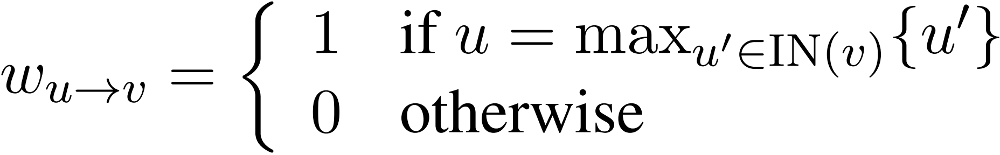

# Model Interpretability

[TOC]

## Todo List

1. Bach S, Binder A, Montavon G, et al. On pixel-wise explanations for non-linear classifier decisions by layer-wise relevance propagation [J]. PloS one, 2015, 10(7): e0130140.
3. Guo, Wenbo, et al. "Lemna: Explaining deep learning based security applications." *Proceedings of the 2018 ACM SIGSAC Conference on Computer and Communications Security*. 2018.
4. Tao Guanhong, Ma Shiqing, Liu Yingqi, et al. Attacks meet interpretability: Attribute-steered detection of adversarial samples [C] //Proc of the 32st Int Conf on Neural Information Processing Systems. USA: Curran Associates Inc., 2018: 7717-7728
5. Liu Ninghao, Yang Hongxia, Hu Xia. Adversarial detection with model interpretation [C] //Proc of the 24th ACM SIGKDD Int Conf on Knowledge Discovery & Data Mining. New York: ACM, 2018: 1803-1811
6. Carlini N, Wagner D. Towards evaluating the robustness of neural networks [C] //Proc of the 38th IEEE Symposium on Security and Privacy. Piscataway, NJ: IEEE, 2017: 39-57
7. Papernot N, Mcdaniel P, Jha S, et al. The limitations of deep learning in adversarial settings [C] //Proc of the 1st IEEE European Symp on Security and Privacy. Piscataway, NJ: IEEE, 2016: 372-387
8. Papernot N, Mcdaniel P, Goodfellow I, et al. Practical blackbox attacks against machine learning [C] //Proc of the 12th ACM Asia Conf on Computer and Communications Security. New York: ACM, 2017: 506-519
10. Ghorbani A, Abid A, Zou J. Interpretation of neural networks is fragile [J]. arXiv preprint arXiv:1710.10547, 2017
11. Zhang Xinyang, Wang Ningfei, Ji Shouling, et al. Interpretable Deep Learning under Fire [C] //Proc of the 29th USENIX Security Symp. Berkele, CA: USENIX Association, 2020
11. GRADIENTS OF COUNTERFACTUALS(ICLR 2017)
12. Simonyan, Karen, Vedaldi, Andrea, and Zisserman, Andrew. Deep inside convolutional networks: Visualising image classification models and saliency maps. arXiv preprint arXiv:1312.6034, 2013.
13. Explainable Neural Network based on Generalized Additive Model.

## On Pixel-Wise Explanations for Non-Linear Classifier Decisions by Layer-Wise Relevance Propagation

### Contribution

1. 作者提出了 LRP 的可解释性方法；

### Links

- 论文链接：[Bach S, Binder A, Montavon G, et al. On pixel-wise explanations for non-linear classifier decisions by layer-wise relevance propagation[J]. PloS one, 2015, 10(7): e0130140.](https://journals.plos.org/plosone/article?id=10.1371/journal.pone.0130140)

## Layer-wise Relevance Propagation for Neural Networks with Local Renormalization Layers

### Contribution

1. 作者将 LRP 可解释方法扩展到了 `Local Renormalization Layer` 这种非线性的网络层；

### Notes

1. LRP（Layer-wise Relevance Propagation）：该方法利用 **神经元之间的数值关系**，回传 **相关性系数** （注意和梯度是有区别的，<u>我认为他和梯度的方法最大的不同点在于，该方法考虑了神经元之间的相关性</u>）

   (1) 神经元的激活公式如下：

   

   (2) 给定一张图片 $x$ 和一个神经网络 $f$ ，LRP 方法的目的在于给图像的每一个像素点都给定一个 **相关性系数**：

   

   (3) 给定神经网络 $l+1$ 层的神经元，它的 **相关性系数** 存在如下公式：

   

   (4) 那么，我们就可以得到 $l$ 层的神经元，它的 **相关性系数** 存在如下公式：（即完成了系数的回传）

   

   ​	其中，最后一层的 相关性系数 等于 $f(x)$；

   (5) 在 [前文](#On Pixel-Wise Explanations for Non-Linear Classifier Decisions by Layer-Wise Relevance Propagation) 中，有两套公式来计算系数的回传：

   - $\epsilon-rule$：

     

     其中，；$\epsilon$ 用来防止除 $0$；

   - $\beta-rule$：

     

     其中，$\beta$ 用来控制相关性再分配中对负相关系数的关注程度，其值越大生成的热力图越锐化；

   - 合并上面两套公式：

     

2. Extending LRP：将 LRP 方法扩展到 LRN 层；

   (1) 扩展的原因：我们先看一下 LRN 层的激活公式

   

   ​	很显然，它不满足第一部分讲得一般的神经网络激活公式；

   (2) ⭐ 泰勒展开式：假设存在 ，我们可以对其使用一阶泰特展开式展开

   

   ​	那么，我们可以得到相关性系数的公式为

   

   (3) 推导 LRN 层：对 $y_k$ 求偏导，
   $$
   \frac{\partial y_{k}}{\partial x_{j}}
   =
   \begin{cases}
   \frac{1}{\left ( 1+b\sum_{i=1}^{n}x_{i}^{2} \right )^{c}}-\frac{2bcx_{j}x_{k}}{\left ( 1+b \sum_{i=1}^{n}x_{i}^{2}\right )^{c+1}} & ,j=k
   \\
   -\frac{2bcx_{j}x_{k}}{\left ( 1+b \sum_{i=1}^{n}x_{i}^{2}\right )^{c+1}} & ,j\ne k
   \end{cases}
   $$
   ​	整理一下就可以得到原文公式

   

   (4) **特殊**泰勒展开点：（<u>我很困惑，为什么明知道这个展开点不好展开，还要在这个点去进行展开</u>）假设现在有实际输入 $z_{1}=\left ( x_{1},x_{2},...,x_{n} \right )$ 和 泰勒展开点 $z_{2}=\left ( 0,0,...,x_{k},...,0 \right )$，不难得到如下公式

   

   ​	可以看到，这里的泰特一阶展开式是无效的。所以，下面对其进行相应的修改

   

   ​	然后可以用 (2) 进行回传；

3. 实验：（只简单地看一下其中两个实现结果）

   (1) 验证得到的重要特征是否是有效的

   - 检验手段：模糊化目标像素点，观察模型置信度的变化；

   - 实验结果：文章的方法可以找到图像中的重要特征点；

     

   (2) 检验文章方法是否优于原有方法（原有方法直接将相关性权重整个回传给中心特征点 $x_k$）

   - 检验手段：同样模糊化重要特征，观察模型 `AUC` 的变化（越小越好）；

   - 实验结果：文章方法更优；

     

### Codes

> 下面的代码均参考： [Implementation of LRP for pytorch](https://github.com/fhvilshoj/TorchLRP)

### Links

- 论文链接：[Binder A, Montavon G, Lapuschkin S, et al. Layer-wise relevance propagation for neural networks with local renormalization layers[C]//International Conference on Artificial Neural Networks. Springer, Cham, 2016: 63-71.](https://arxiv.org/abs/1604.00825)
- 参考链接：[Tensorflow的LRN是怎么做的](https://www.jianshu.com/p/c06aea337d5d)
- 参考链接：[【阅读笔记】神经网络中的LRP及其在非线性神经网络中的运用](https://blog.csdn.net/ChangHao888/article/details/109320053)
- 参考链接：[Implementation of LRP for pytorch](https://github.com/fhvilshoj/TorchLRP)

## SmoothGrad: removing noise by adding noise

### Contributes

1. 在一定程度上去除 Grad 方法中的噪声;

### Notes

1. 已有的基于梯度的算法能够得到一个重要性关联的图, 但是带有很多的噪点, 即直接计算梯度, 会出现梯度饱和的问题 (在当前图中, 羊的特征对当前的分类概率影响不大, 因为它的分类结果可能已经是0.999了)

   

2. 👍 作者提出的想法是添加扰动后再对图片求梯度, 然后将这些梯度求一个均值, 故论文名称为 Removing noise by adding noise, 求导的时候添加扰动, 是为了除去在重要性结果上的噪声:
   $$
   \hat{M}_c(x) = \frac{1}{n} \sum_1^n M_c(x+\mathcal{N}(0, \sigma^2))
   $$

3. Evaluation:

   (1) 模型+数据集: Inception v3 trained on ILSVRC-2013 dataset, convolutional MNIST model

   (2) 噪声大小的影响: 噪声过大的情况下也会使得效果变差, 从图中的效果来看, 添加 10% 的噪声效果是最好的

   

   (3) 求梯度次数的影响: 从图中的效果来看, 计算的次数越多越好

   

   (4) 和其他工作的对比: **作者在对比的过程中, 只是简单地抽取出几张图片对比了一下效果, 说明这个方向缺乏一个 ground truth 来检验各种可解释性方法的好坏**

   

   (5) 最后作者在 MNIST 上面发现, 训练的时候就添加噪声进行训练, 也同样能够达到一定的 "**重要性降噪**" 的作用:

   

### Links

- 论文链接: [Smilkov, Daniel, et al. "Smoothgrad: removing noise by adding noise." *ICML* (2017).](https://arxiv.org/abs/1706.03825)
- 论文主页: https://pair-code.github.io/saliency/
- Pytorch 实现: [pytorch-smoothgrad](https://github.com/hs2k/pytorch-smoothgrad)
- Tensorflow 实现 (论文源码): [saliency](https://github.com/PAIR-code/saliency)

## Visualizing and Understanding Neural Machine Translation

> 上过刘洋老师的 NLP 课后，一直很崇拜刘洋老师！:smiley::smiley::smiley: 

### Contribution

1. 👍 将 LRP（Layer-wise Relevance Propagation）方法应用到“基于注意力机制的机器翻译任务”中，用于**判断不同层不同神经元（或称为隐藏状态）对结果的贡献度**；

### Notes

> 原文在各个细节方面都讲地非常清楚，并且逻辑清晰、言语流畅，因此十分**推荐直接阅读原文**，下面只是对原文的一些摘要；

1. 基于注意力机制的机器翻译任务：

   

   

2. LRP 算法的简单示例：（文章内容有些多，但其实如果你知道 LRP 算法是怎么做的话，这篇文章只是对这个方法的应用）

   以一个简单的**前向神经网络**举例，网络结构如下：

   

   现在我们关注**输入层**和**隐藏层**各神经元对**输出神经元 $v_1$** 的影响，首先我们计算**隐藏层的影响因子**：

   

   然后我们计算**输入层的影响因子**：

   

3. LRP 算法定义：（从算法的定义上来看，**算法并不需要依赖于可导的梯度计算**）

   

   其中，$v \in \text{OUT}(u)$ 指在神经网络中神经元 $u$ 指向神经元 $v$；$w_{u \rightarrow z}$ 的定义如下（**在 LRP 原文中，作者发现这个相关系数和网络的激活函数是无关的，所以下面均没有考虑神经元的激活函数**）

   - 如果是形如 $\bold{v} = \bold{Wu}$ 这样的**矩阵相乘**，则

   

   - 如果是形如 $\bold{v} = \bold{u_1} \circ \bold{u_2}$ 的**向量点积**，则

   

   - 如果是形如 $v=\max{\{u_1, u_2 \}}$ 的**求最值**，则

   

   其中，$u' \in \text{IN}(v)$ 指在神经元中神经元 $u'$ 指向神经元 $v$；

4. 实验：从实验的结果来看，**LRP 方法不仅能够得到和 Attention 可视化方法相似的结果，并且能够分析更多的隐藏层内容**。（正例是对正常翻译结果的分析，而反例则是机器翻译中常出现错误翻译问题的举例）

   - （正例）Source Side，即 Encoder 侧的影响因子可视化：

     

   - （正例）Target Side，即 Decoder 侧的印象因子可视化：

     

   - （反例）Word Omission，即过早结束翻译：

     

   - （反例）Word Repetition，即重复翻译；

     

   - （反例）Unrelated Words，即翻译出了完全无关的词汇；

     

   - （反例）Negation Reversion，即翻译时把否定词遗漏了；（<u>文章的这个地方，我觉得是问题最大的，翻译过程中把“不”给遗漏了，不一定分析“about”这个词，作者对这个词的分析位置的选择，我觉得存粹是从中文的角度来看问题的，因为“谈 (talk)”后面跟的是“不”，他就来分析这个“about”</u>）

     

   - （反例）Extra Words，即翻译中出现了多余的词；

     

### Links

- 论文链接：[Ding Y, Liu Y, Luan H, et al. Visualizing and understanding neural machine translation[C]//Proceedings of the 55th Annual Meeting of the Association for Computational Linguistics (Volume 1: Long Papers). 2017: 1150-1159.](https://www.aclweb.org/anthology/P17-1106/)

## 机器学习模型可解释性方法、应用与安全研究综述

### Notes

> 这篇是纪老师关于模型可解释性文章的综述，以下均为个人对文章做的笔记，建议自己阅读原文。另外纪老师在这方面有很多不错的工作，值得关注。
>
> 模型可解释性方向有特别多的工作，文章中也有一些不全的地方需要自己去思考和补充。

#### 机器学习可解释性问题

1. **模型可解释性问题**：可解释性旨在帮助人们理解机器学习模型是如何学习的，它从数据中学到了什么，针对每一个输入它为什么做出如此决策以及它所做的决策是否可靠；
2. **模型的复杂度与模型准确性相关联，又与模型的可解释性相对立**。
3. 根据**选择结构简单易于解释的模型然后训练它**，还是**训练复杂的最优模型然后开发可解释性技术解释它**，将机器学习模型可解释性总体上分为：**ante-hoc 可解释性**和 **post-hoc 可解释性**；

#### * Ante-hoc 可解释性

1. Ante-hoc 可解释性指**模型本身内置可解释性**，即对于一个已训练好的学习模型，我们无需额外的信息就可以理解模型的决策过程或决策依据；

2. 自解释模型：

   (1) 可模拟性：在一定时间可以预测模型的每一步计算；

   (2) 可分解性：模型的每个部分都可以得到一个直观的解释；

   (3) 结构简单：由于人类认知的局限性，自解释模型的内置可解释性受模型的复杂度制约，这要求自解释模型结构一定不能过于复杂；

3. 广义加性模型：在简单模型和复杂问题之间的一个折中；
   $$
   g(y) = f_1(x_1) + f_2(x_2) + \cdots + f_n(x_n)
   $$

4. 注意力机制：通过 Attention 的权重来分析模型关注的重点是什么；

#### Post-hoc 可解释性

1. Post-hoc 可解释性的重点在于设计高保真的解释方法或构建高精度的解释模型，根据解释目的和解释对象的不同，可分为全局可解释性和局部可解释性；

2. 经典的解释方法如下：

   

3. 全局解释：全局可解释性旨在帮助人们从整体上理解模型背后的复杂逻辑以及内部的工作机制，如模型是如何学习的、模型从训练数据中学到了什么、模型是如何进行决策的 等；

   (1) * 规则提取：通过受训模型中提取解释规则的方式，提供对复杂模型尤其是黑盒模型整体决策逻辑的理解（比较早期的做法）；

   (2) 模型蒸馏：

   - 定义：通过**降低模型复杂度**，解决理解受训模型比较困难的问题，是一种经典的**模型压缩方法**；

   - 核心思想：利用**结构紧凑的学生模型来模拟结构复杂的教师模型**，从而完成从教师模型到学生模型的知识迁移过程，实现对复杂教师模型的知识的 ”蒸馏“；

   - 训练损失函数定义：
     $$
     L_{student}=\alpha L^{(soft)} + (1-\alpha)L^{(hard)}
     $$
     其中，$L^{(soft)}$ 为**软目标损失**，期望学生模型能够学到教师模型相似的概率分布输出；$L^{(hard)}$ 为**硬目标损失**，要求学生模型能够保留教师模型决策的类别；

   - 模型蒸馏解释方法实现简单，易于理解，且不依赖待解释模型的具体结构信息，因而作为一种模型无关的解释方法，常被用于解释黑盒机器学习模型；

   - 蒸馏模型只是对原始复杂模型的一种全局近似，基于蒸馏模型所做出的解释不一定能够反映待解释模型的真实形为；

   > 我的想法：1. 能否通过模型蒸馏的方法去生成一个黑盒模型的替代模型，从而去辅助生成对抗样本？（这个关键在于生成的替代模型能否较好地逼近黑盒模型）2. 模型蒸馏的方法，最终能够得到怎样的模型解释？能否通过模型蒸馏的方法来解释现有的语音识别模型？（这个关键在于如何去分析蒸馏以后的模型）

   (3) 激活最大化 (Activation Maximization)：

   - 定义：通过在特定的层上**找到神经元的首选输入来最大化神经元激活**，来理解 DNN 中每一层隐含层神经元所捕获的表征；

   - 核心思想：通过寻找有界范数的输入模式，最大限度地激活给定地隐藏神经元，而一个单元最大限度地响应的输入模式可能是 ”一个单元正在做什么的“ 良好的一阶表示；

   - 形式化定义：
     $$
     x^* = \arg \mathop{\max}\limits_{x} f_l(x)-\lambda \lVert x \rVert ^2
     $$
     其中左边项期望 $x$ 能够使得当前神经元的激活值最大；右边项期望 $x$ 与原样本尽可能接近（<u>右边应该改用 $\Delta x$ 来表示</u>）；

   - 激活最大化解释方法是一种模型相关的解释方法，相比规则提取解释和模型蒸馏解释，其解释结果更准确，更能反映待解释模型的真实形为；

   - 激活最大化本身是一个优化问题，在通过激活最大化寻找原型样本的过程中，优化过程中的噪音和不确定性可能导致产生的原型样本难以解释；

   - 激活最大化解释方法**难以用于解释自然语言处理模型和图神经网络模型**；

4. 局部解释：模型的局部可解释性以输入样本为导向，通常可以通过分析输入样本的每一维特征对模型最终决策结果的贡献来实现。

   (1) 敏感性分析 (Sensitivity Analysis)：

   - 核心思想：通过**逐一改变自变量的值来解释因变量受自变量变化影响大小**的规律；

   - 根据**是否需要利用模型的梯度信息**，敏感性分析方法可分为模型相关方法和模型无关方法；

   - **模型相关方法**：利用模型的局部梯度信息评估特征与决策结果的相关性，常见的相关性定义如下：
     $$
     R_i(x) = (\frac{\partial f(x)}{\partial x_i})^2
     $$
     即为模型梯度的 $l_2$ 范数分解；

   - 模型无关方法：无需利用模型的梯度信息，只关注**待解释样本特征值变化对模型最终决策结果的影响**。具体地，该方法通过观察去掉某一特定属性前后模型预测结果的变化来确定该属性对预测结果的重要性，即：
     $$
     R_i(x) = f(x) - f(x \setminus x_i)
     $$

   - 敏感性分析方法提供的解释结果通常**相对粗糙且难以理解**，且无法分析**多个特征之间的相关关系**；

   (2) 局部近似：

   - 核心思想：利用**结构简单的可解释模型拟合待解释模型针对某一输入实例的决策结果**，然后基于解释模型对该决策结果进行解释；
   - 基于局部近似的解释方法实现简单，易于理解且不依赖待解释模型的具体结构，适于**解释黑盒机器学习模型**；
   - 对于每个输入样本都需要训练一个解释模型，**效率不高**，并且**该方法基于特征相互独立的假设**；

   (3) ⭐ 反向传播：

   - 核心思想：利用 **DNN 的反向传播机制**将模型的决策重要性信号从模型的输出层神经元逐层传播到模型的输入以推导输入样本的特征重要性；
   - 其中，**SmoothGrad 方法**的核心思想：通过向待解释样本中添加噪声对相似的样本进行采样，然后利用反向传播方法求解每个采样样本的决策显著图，最后将所有求解得到的显著图进行平均并将其作为对模型针对该样本的决策结果的解释；
   - **分层相关性传播(LRP)方法**的核心思想：利用反向传播将高层的相关性分值递归地传播到底层直至传播到输入层；
   - 基于反向传播地解释方法通常实现**简单、计算效率高且充分利用了模型的结构特性**；
   - 如果预测函数在输入附近变得平坦，那么预测函数相对于输入的梯度在该输入附近将变得很小，进而导致无法利用梯度信息定位样本的决策特征；

   > 反向传播的想法应该可以在语音领域进行尝试。

   (4) * 特征反演 (Feature Inversion)：

   - 定义：特征反演作为一种可视化和理解 DNN 中间特征表征的技术，可以充分利用模型的中间层信息，以提供对模型整体行为及模型决策结果的解释；
   - 特征反演解释方法分为：模型级解释方法和实例级解释方法；

   (5) 类激活映射：

   

   - ⭐ 前提：**CNN 不同层次的卷积单元包含大量的位置信息，使其具有良好的定位能力**。然而，传统 CNN 模型通常在卷积和池化之后采用全连接层对卷积层提取的特征图进行组合用于最终的决策，因而**导致网络的定位能力丧失**，这个问题需要在这些工作中解决。
   - **类激活映射 (Class Activation Mapping, CAM) 解释方法**：利用全局平均池化(Global Average Pooling)层来替代传统 CNN 模型中除 softmax 层以外的所有全连接层，并通过将输出层的权重投影到卷积特征图来识别图像中的重要区域 => (需要**用全局平均池化层替换模型中的全连接层并重新训练**)。
   - **梯度加权类激活映射 (Grad-CAM) 解释方法**：给定一个输入样本，Grad-CAM 首先计算目标类别相对于最后一个卷积层中每一个特征图的梯度并对梯度进行全局平均池化，以获得每个特征图的重要性权重；然后，基于重要性权重计算特征图的加权激活，以获得一个粗粒度的梯度加权类激活图，用于定位输入样本中具有类判别性的重要区域 => (**不需要修改网络后进行重训练**)；
   - **导向梯度加权类激活 (Guided Grad-CAM) 解释方法**：即将 GuidedBP 方法和 Grad-CAM 方法进行结合；

#### 可解释性应用

1. 模型验证：由于数据集中可能存在偏差，并且验证集也可能与训练集同分布，我们很难简单地通过评估模型在验证集上的泛化能力来验证模型的可靠性，也很难验证模型是否从训练数据中学到了真正的决策只是。这里**通过可解释性方法，去分析模型在做决策时到底更加关注哪些特征，这些特征是否是合理的**。如下：

2. \* 模型诊断：诊断模型中的缺陷；

   > 这个东西感觉不太靠谱，模型可解释性的方法很大程度上并不能得到很直观的一个解释，又如何依靠模型可解释性来做模型的诊断。

3. \* 辅助分析：如医疗领域，使用可解释性方法来辅助医护人员进行检查；

   

4. 知识发现：辅助人学习基于大量数据训练的模型中的知识；

   - **LEMNA** 解释方法可以挖掘出检测模型从数据中学到的新知识；

#### 可解释性与安全性分析

> 应该仔细思考：**可解释性方法和安全领域的相关关系，从而去发掘新的应用场景、攻击场景、防御手段等**。

1. 安全隐患消除：模型可解释性方法用于检测对抗样本，并增强模型的鲁棒性；

2. 安全隐患：**攻击者也同样可以利用模型可解释性的方法来生成更好的对抗样本**；

3. ⭐ 自身安全问题：由于采用了近似处理或是基于优化手段，大多数解释方法只能提供近似的解释，因而解释结果与模型的真是形为之间存在一定的不一致性

   - 不改变模型的决策结果的前提下，使解释方法解释出错：
     $$
     \arg \mathop{\max}_\delta D(I(x_t;N), I(x_t+\delta;N))\\
     s.t. \lVert\delta\rVert_\infty \leq \epsilon , f(x_t+\delta) = f(x_t)
     $$
     其中，$I(x_t;N)$ 为解释系统对神经网络 $N$ 针对样本 $x_t$ 决策结果 $f(x_t)$ 的解释。

   - 模型结果出错，单不改变解释方法解释出错；

#### 未来方向

1. ⭐如何设计更精确、更友好的解释方法，消除解释结果与模型真实形为之间的不一致；
2. ⭐如何设计更科学、更统一的可解释性评估指标，以评估可解释方法解释性能和安全性；

> <u>探讨一下</u>：（我）老板问的问题是：“模型可解释性这个东西做出来，你希望它能有怎样的效果？我们要用这个要求去检验模型可解释性”；老板第二句话是：“我们应该是去做一些开创性的东西，而不是说，在别人的方法上面修修补补，或者是迁移到另一个领域，然后发一篇文章就了事了”。最后一句：“这个评估是这个领域亟待解决的问题，你能不能提出一个通用、合理的方法来评估这样方法，如果不行的话，针对不同的分类，我们能不能来做评估”。

### Links

- 论文链接：[纪守领, et al. "机器学习模型可解释性方法, 应用与安全研究综述." *计算机研究与发展* 56.10 (2019).](https://nesa.zju.edu.cn/download/%E6%A8%A1%E5%9E%8B%E5%8F%AF%E8%A7%A3%E9%87%8A%E6%80%A7%E5%85%B3%E9%94%AE%E6%8A%80%E6%9C%AF%E3%80%81%E5%BA%94%E7%94%A8%E5%8F%8A%E5%85%B6%E5%AE%89%E5%85%A8%E6%80%A7%E7%A0%94%E7%A9%B6%E7%BB%BC%E8%BF%B0.pdf)

