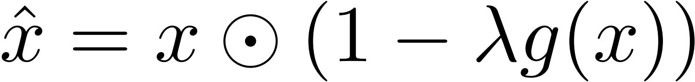

# Model Robustness

[TOC]

## Todo List

1. Matthew Mirman, Timon Gehr, and Martin Vechev. Differentiable abstract interpretation for provably robust neural networks. In International Conference on Machine Learning, pp. 3575–3583, 2018.
2. Sven Gowal, Krishnamurthy Dvijotham, Robert Stanforth, Rudy Bunel, Chongli Qin, Jonathan Uesato, Timothy Mann, and Pushmeet Kohli. On the effectiveness of interval bound propagation for training verifiably robust models. arXiv preprint arXiv:1810.12715, 2018.

## Certified Defenses For Adversarial Patches

### Contribution

### Notes

1. Introduction: 图像存在对抗攻击, 实际物理对抗攻击都是带 patch 的攻击, 所以作者想做带 patch 的鲁棒性检测;

2. Problem Setup:

   (1) 定义 **模型的鲁棒性**:

   

   其中, $\mathbb{L}$ 表示 patch 的位置集合, $\mathbb{P}$ 表示特定的 patch 集合, $X$ 表示样本集合, $\mathcal{X}[\circ]$ 是布尔函数 ( 若为真返回1, 若为假返回0 ). 公式的含义是在输入集合上**无法**得到成功的对抗样本的输入数量, 对于攻击者而言, 这个值越小越好, 而对于防御者而言, 这个值越大越好;

   (2) 定义patch: 正方形的 patch, 其中的值可以为任意值 [0~1];

3. Vulnerability of Existing Defenses: 作者借此说明现有的一些依靠经验性结果的对抗样本防御方法 ( **针对那些带 patch 的无目标攻击** ) 很容易被攻击者绕过.

   1. 已有的防御方法:

      (1) 防御原理: **输入图像的损失函数的梯度值在添加对抗扰动的地方都会很大** . Watermarking 方法基于这个原理来防御无目标攻击 ( <u>值得关注的是, 这种方法对模型的成功率的影响约为 12%</u> ) ;
   
      (2) 防御原理: **输入图像的像素值在这些添加了对抗扰动的地方会变化很大, 即不连续** . Local Gradient Smoothing 方法基于这个原理, 对输入作预处理;
   
      
   
   2. 绕过这些防御方法:
   
      
   
      在生成对抗样本的过程中即引入防御算法, 就可以绕过这些防御方法.
   
4. Certified Defenses:

   (1) 在输入的 $p-norm$ 邻域内, 检查模型的分类结果是否会发生改变, 如果改变, 则不鲁棒, 可能是一个对抗样本; 如果不改变, 则鲁棒, 不可能是一个对抗样本;

   (2) 检查输入是否是鲁棒的是十分苦难的, **因为计算复杂性高, 是一个 NP-Hard 问题**;

   (3) 鲁棒性的边界是十分宽松的, **即只有在很小一个邻域内, 才能保证模型的鲁棒性**;

   (4) ⭐ Interval Bound Propagation (IBP) 的原理: 想象一下, 你有一些**相互独立的**且已知取值区间的变量 $x,y,z$ , 有一个这些变量组成的线性表达式 $f=ax+by+cz$ , 现在你想求这个表达式的取值区间,  那么很简单, 你让表达式的每一项最大即可得到最大值, 让每一项最小即可得到最小值. ( <u>这种方法是一种放缩求解的方法, 因为给定了**变量相互独立**这个条件, 但实际神经网络中, 中间层的神经元的取值之间存在某种线性关系</u> ) 看具体的公式: 

   - 只考虑仿射变换的情况下:

     

     这个公式不太好看, 自己去推一下, 结果是这样的:
     $$
     \bar{z}^k = W^{(k)+} \bar{z}^{(k-1)} + W^{(k)-} \underline{z}^{(k-1)} + b^{(k)}
     $$
     其中 $W^{(k)+}$ 是将 $W^{(k)}$ 中小于 0 的部分置为0, $W^{(k)-}$ 将大于0的部分置为0, 这样就和上面原理部分相对应;

   - 考虑激活函数: 那就在外面套个激活函数, 考虑一下激活函数的**单调性**即可;

   - 鲁棒性验证: 最后每一个分类都可以得到一个取值区间, 保证目标分类的最小值 大于 其他分类的最大值即可, 作者用如下公式

     

   - 如何训练, 来增强 IBP 的鲁棒性: 

     - 修改 loss 函数, 从原来的希望目标分类尽可能大, 到添加扰动后的概率区间更满足鲁棒性 (默认包含了分类正确):

       

     - 训练的 trick: (<u>没看懂</u>)

   (5) 作者提出的方法: 在 IBP 的基础上, 把扰动的区间限制在一个矩形范围内, 而把扰动的区间限制在 [0, 1]. 但是由于基于这样的假设, 在训练的时候, 不仅要考虑 patch 的位置, 并且要考虑每一种可能的 patch 取值, 计算复杂性过大, 因此提取训练的环节方法

   - Random Patch Certificate Training: 随机选择一些 patch 的位置, 随机选择一些可能的 patch 取值;
   - Guided Patch Certificate Training: 

### Links

- 论文链接:  [Chiang, Ping-yeh, et al. "Certified defenses for adversarial patches." *ICLR* (2020).](https://arxiv.org/abs/2003.06693)

- 源码链接:  [Ping-C / certifiedpatchdefense](https://github.com/Ping-C/certifiedpatchdefense)

- $p-norm$ 详解: [知乎 / 0范数, 1 范数, 2范数有什么区别?](https://www.zhihu.com/question/20473040)