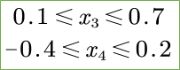

# Model Robustness

> 由于我学习模型鲁棒性时，从一开始就是学习的 SOK，因此，该模块的大部分内容均会在 SOK 那篇文章中进行展开，其他文章的阅读仅是作为一个扩展。

[TOC]

## Todo List

1. Matthew Mirman, Timon Gehr, and Martin Vechev. Differentiable abstract interpretation for provably robust neural networks. In International Conference on Machine Learning, pp. 3575–3583, 2018.
2. Sven Gowal, Krishnamurthy Dvijotham, Robert Stanforth, Rudy Bunel, Chongli Qin, Jonathan Uesato, Timothy Mann, and Pushmeet Kohli. On the effectiveness of interval bound propagation for training verifiably robust models. arXiv preprint arXiv:1810.12715, 2018.

3. 解决 Certified Defenses For Adversarial Patches 中的问题；

## Overview

开始 ”模型鲁棒性“ 这个板块之前，问几个问题：

1. 我们的预期是什么？
2. 已有的工作模式？
3. 如何来评估一个工作的好坏？
4. 里面的困难有哪些？

## Formal Verification of Piece-Wise Linear Feed-Forward Neural Networks

### Contribution

### Notes

#### Linear Approximation

考虑前馈神经网络中的 $ReLU$ 单元和 $MaxPool$ 单元具有非线性，所以期望用线性约束来替换掉这两个单元。

##### $ReLU$

### Links

- 论文链接：[Ehlers R. Formal verification of piece-wise linear feed-forward neural networks[C]//International Symposium on Automated Technology for Verification and Analysis. Springer, Cham, 2017: 269-286.](https://arxiv.org/abs/1705.01320)

## Certified Defenses For Adversarial Patches

### Contribution

1. 文章的亮点在于：将 **IBP（Interval Bound Propagation）** 这种模型鲁棒性方法运用到了防御 **带patch的对抗攻击**中；
2. 有趣的点：文章发现这样训练的模型对不同 patch 的对抗攻击都具有一定的鲁棒性；

### Notes

1. Introduction: 图像存在对抗攻击, 实际物理对抗攻击都是带 patch 的攻击, 所以作者想做带 patch 的鲁棒性检测;

2. Problem Setup:

   (1) 定义 **模型的鲁棒性**:

   

   其中, $\mathbb{L}$ 表示 patch 的位置集合, $\mathbb{P}$ 表示特定的 patch 集合, $X$ 表示样本集合, $\mathcal{X}[\circ]$ 是布尔函数 ( 若为真返回1, 若为假返回0 ). 公式的含义是在输入集合上**无法**得到成功的对抗样本的输入数量, 对于攻击者而言, 这个值越小越好, 而对于防御者而言, 这个值越大越好;

   (2) 定义patch: 正方形的 patch, 其中的值可以为任意值 [0~1];

3. Vulnerability of Existing Defenses: 作者借此说明现有的一些依靠经验性结果的对抗样本防御方法 ( **针对那些带 patch 的无目标攻击** ) 很容易被攻击者绕过.

   -   已有的防御方法:

       (1) 防御原理: **输入图像的损失函数的梯度值在添加对抗扰动的地方都会很大** . Watermarking 方法基于这个原理来防御无目标攻击 ( <u>值得关注的是, 这种方法对模型的成功率的影响约为 12%</u> ) ;

       (2) 防御原理: **输入图像的像素值在这些添加了对抗扰动的地方会变化很大, 即不连续** . Local Gradient Smoothing 方法基于这个原理, 对输入作预处理;

   

   -   已有的防御方法容易被绕过:

   ​				在生成对抗样本的过程中即引入防御算法, 就可以绕过这些防御方法.

4. Certified Defenses:

   (1) 在输入的 $p-norm$ 邻域内, 检查模型的分类结果是否会发生改变, 如果改变, 则不鲁棒, 可能是一个对抗样本; 如果不改变, 则鲁棒, 不可能是一个对抗样本;

   (2) 检查输入是否是鲁棒的是十分苦难的, **因为计算复杂性高, 是一个 NP-Hard 问题**;

   (3) 鲁棒性的边界是十分宽松的, **即只有在很小一个邻域内, 才能保证模型的鲁棒性**;

   (4) Interval Bound Propagation (IBP) 的原理: 想象一下, 你有一些**相互独立的**且已知取值区间的变量 $x,y,z$ , 有一个这些变量组成的线性表达式 $f=ax+by+cz$ , 现在你想求这个表达式的取值区间,  那么很简单, 你让表达式的每一项最大即可得到最大值, 让每一项最小即可得到最小值. ( <u>这种方法是一种放缩求解的方法, 因为给定了**变量相互独立**这个条件, 但实际神经网络中, 中间层的神经元的取值之间存在某种线性关系</u> ) 看具体的公式: 

   - 只考虑仿射变换的情况下:

     

     这个公式不太好看, 自己去推一下, 结果是这样的:
     $$
     \bar{z}^k = W^{(k)+} \bar{z}^{(k-1)} + W^{(k)-} \underline{z}^{(k-1)} + b^{(k)}
     $$
     其中 $W^{(k)+}$ 是将 $W^{(k)}$ 中小于 0 的部分置为0, $W^{(k)-}$ 将大于0的部分置为0, 这样就和上面原理部分相对应;

   - 考虑激活函数: 那就在外面套个激活函数, 考虑一下激活函数的**单调性**即可;

   - 鲁棒性验证: 最后每一个分类都可以得到一个取值区间, 保证目标分类的最小值 大于 其他分类的最大值即可, 作者用如下公式

     

   - 鲁棒性训练, 来增强 IBP 的鲁棒性: 

     - 修改 loss 函数, 从原来的希望目标分类尽可能大, 到添加扰动后的概率区间更满足鲁棒性 (默认包含了分类正确):

       

     - 训练的 trick: (**todo: <u>没看懂</u>**)

   (5) ⭐ 作者提出的方法: 在 IBP 的基础上, 把扰动的区间限制在一个**矩形范围**内, 并把扰动的大小限制在 $[0, 1]$. 但是 IBP 方法自身的复杂性，再加上需要考虑每一个位置的 Patch，**计算复杂性过大**，所以作者提出了**两种挑选 Patch 位置的方法**；

   - 基本框架：选择patch的形状大小后，在图像的各个位置上进行遍历，分析最坏情况；
   
       - 鲁棒性验证：
   
           
   
       - 鲁棒性训练：
   
           
   
           其中 $\mathbb{L}$ 表示 图片中放patch位置的集合；
   
   - Random Patch Certificate Training: **随机选择一些 patch 的位置**, 随机选择一些可能的 patch 取值;
     
       - 鲁棒性验证：
       
         
       
       - 鲁棒性训练：
       
         
       
   - Guided Patch Certificate Training：使用 **U-Net 网络**为每个分类挑选一个 patch；
   
   - Defense against Sparse Attack：作者指出，可以将 IBP 第一层的区间公式改成如下形式 （<u>作者直接放这个式子真的是玄学，猜了半天猜出大概的思路，因为 Sparse Attack 就是将几个离散的对模型结果影响最大的像素点的值（值域为 $0\sim 1$ ）进行修改，而不同像素点对结果的影响主要还是从权重矩阵中体现出来，所以**会修改权重矩阵中的 $top-k$** 。至于**为什么可以直接 加/减 $top-k$ 呢**？因为是值域限定了，我最多也就是把 $0 \rightarrow 1$，或者是 $1 \rightarrow 0$ ，所以这个区间一定是满足全部的可能性的。至于**为什么没有了偏置项 $b$ 呢**？我觉得很可能是两种写法，一种是将偏置项单独写出来，另一种写法是将偏置项包含在了权重项 $W$ 中</u> ）
   
       
   
5. 实验结果：

   (1) 鲁棒性验证——防御攻击的效果：

   

   (2) 鲁棒性训练——防御攻击的效果：使用的 Patch 越多，放置的位置越多，得到的模型效果越好；

   

   (3) 对于 Sparse Attack 的防御效果：

   

   (4) 用矩形 Patch 训练的模型能否防御其他形状的 Patch ？<u>**这个还挺有趣的，方法是存在一定的 Transferability 的**</u>；

   

### Questions

1. 文章中提到的 U-Net 网络怎么用在实际的工作中？
2. 模型鲁棒性验证法是如何进行实验的？
3. 实验结果中的 Certified Accuracy 是如何计算出来的？
4. 鲁棒性训练里面的Trick没有看懂？

### Links

- 论文链接:  [Chiang, Ping-yeh, et al. "Certified defenses for adversarial patches." *ICLR* (2020).](https://arxiv.org/abs/2003.06693)
- 源码链接:  [Ping-C / certifiedpatchdefense](https://github.com/Ping-C/certifiedpatchdefense)
- $p-norm$ 详解：[知乎 / 0范数, 1 范数, 2范数有什么区别?](https://www.zhihu.com/question/20473040)
- U-Net 网络详解：[图像语义分割入门+FCN/U-Net网络解析](https://zhuanlan.zhihu.com/p/31428783)

## SoK: Certified Robustness for Deep Neural Networks

### Contribution

### Notes

#### Notations and Preliminaries

##### Adversarial Perturbation

定义在输入 $x_0$ 处的扰动边界：
$$
B_{p,\epsilon}(x_0):=\{ x: \lVert x-x_0 \rVert_p \le \epsilon \}
$$

##### Optimization Problem

模型鲁棒性的证明问题，可以转化为最优化问题：
$$
\mathcal{M}(y_0, y_t) = \min_x f_\theta(x)_{y_0} - f_\theta(x)_{y_t} \;\;\;\;\;s.t. x\in B_{p,\epsilon}(x_0) \\
\text{Goal : To Prove } \;\; \forall y_t, \mathcal{M}(y_0, y_t) \ge 0
$$
即，我们希望在 对抗扰动 的最坏情况下，模型还能将样本分类为正确的标签。

##### Input & Ouput

文章中我们讨论神经元的输入输出时，我们**将单层神经网路的线性计算和激活函数拆开讨论**。因为线性计算本身具有线性性质，易于推导其输出值；而激活函数则大多都是非线性的，故不易推导其输出值；

##### Linear Programming

线性规划问题，在一系列线性约束下，求线性目标函数的最值：
$$
\min_x c^Tx \;\;\;\;s.t.
\begin{cases}
Ax \le b  \\
x \ge 0
\end{cases}
$$
可以看到，**线性规划问题和鲁棒性证明问题之间是非常像的**。举例如下问题即为一个线性规划问题：

那么如何来求解线性规划问题？大致的做法是首先找到一个初始点（这个点是边界的某个角），然后让其在边界上滑动。具体参考：

- 参考链接一：https://www.jianshu.com/p/a0fc8a57f452
- 参考链接二：https://brilliant.org/wiki/linear-programming

##### Stable & Unstable $ReLU$

对于一个 $ReLU$ 单元，其输入为 $\hat{x}$ ：

- 若 $\hat{x}$ 始终为正或始终为负，则我们称这个 $ReLU$ 是 `Stable`；
- 反之，若 $\hat{x}$ 的值域在 $0$ 的两侧，则我们称这个 $ReLU$ 是 `Unstable`；

#### Deterministic Approaches

> 论述顺序和原文会有很大的区别，原文是为了更好地去分类这些方法，而我追求的是方法上面的连贯性。

确定性证明方法，直接确定 `模型在输入点处是鲁棒的` 这个命题，形式化为： $\mathcal{A}(f_\theta, x_0, y_0, \epsilon)=False$ 。

##### Branch & Bound

> 这个讲解过程遵循 “提出问题-解决问题”的思路，过程中会有一些疑惑，比如说 最大值/最小值 怎么去求解？计算的前后关系是怎样的？所以现在这边说明一下，可以先不要计较这些问题，而关注每个小节的重点问题，如：
>
> - 第一小节，你应该关注如何将问题转化为一个线性规划问题；
> - 第二小节，你应该先关注如何对神经元值域进行放缩，再关注如何在前后层神经元之间进行值域的传递；
> - 第三小节，你应该关注为什么我们又将这个问题返回到了原始的线性规划问题，整个方法这样做有什么意义；
>
> 最后我根据给老师讲解的时候收集到的反馈，在 PPT 之外补充了 “第四小节-计算过程”，来厘清这个方法具体是如何进行计算的；

1. **Linear Programming**

   首先考虑将鲁棒性证明问题转化为一个线性规划问题。

   (1) 输入约束 - 不等式约束：

   

   (2) 线性计算 - 等式约束：

   

   (3) 激活函数 - 不等式 + 等式约束：

   

   (4) 线性规划问题：

   ​	现在假设 $x_{1,0}$ 神经元是一个 $ReLU$ 单元，那么我们**根据该神经元输入值的大小进行分类讨论**：
   $$
   \begin{array}{l}
   	\min_{\boldsymbol{x}}f_{\theta}\left( \boldsymbol{x} \right) _{y_0}-f_{\theta}\left( \boldsymbol{x} \right) _{y_t}\\
   	\left\{ \begin{array}{l}
   	\text{constraint}\;\;1\\
   	\text{constraint}\;\;2\\
   	\hat{x}_{1,0}\le 0\\
   	x_{1,0}=0\\
   	\cdots \cdots\\
   \end{array} \right.\\
   \end{array}
   \;\;\;\;\;\;\;\;\;\;\;\;\;\;\;\;\;\;
   \begin{array}{l}
   	\min_{\boldsymbol{x}}f_{\theta}\left( \boldsymbol{x} \right) _{y_0}-f_{\theta}\left( \boldsymbol{x} \right) _{y_t}\\
   	\left\{ \begin{array}{l}
   	\text{constraint}\;\;1\\
   	\text{constraint}\;\;2\\
   	\hat{x}_{1,0}\ge 0\\
   	x_{1,0}=\hat{x}_{1,0}\\
   	\cdots \cdots\\
   \end{array} \right.\\
   \end{array}
   $$
   ​	那么如果神经网络中有 $n$ 个 $ReLU$ 神经元，我们就需要有 $2^n$ 个线性规划问题需要求解，**计算复杂度十分高**，故**我们要提出一种方法来解决计算复杂性问题**。

2. **Linear Relaxation**

   线性放缩，在其他文章中也称为线性逼近，即**用线性边界来拟合神经网络中的非线性单元的边界**。

   (1) $ReLu$ 单元

   ​	原文中，称线性放缩后的 $ReLU$ 单元为 $ReLU\ Polytope$ 。

   ​	对于 $ReLU$ 单元，其本身是非线性的，是一个分段线性函数（分为大于 $0$，和小于 $0$ 两端）：

   

   ​	现在假设我们知道 $ReLU$ **输入**的最小值 $l_{i,j}$ 和最大值 $u_{i,j}$，并且最小值小于 $0$ 而最大值大于 $0$：
   $$
   l_{i,j}\le \min_{x\in B_{p,\epsilon}\left( x_0 \right)}\hat{x}_{i,j}\le \max_{x\in B_{p,\epsilon}\left( x_0 \right)}\hat{x}_{i,j}\le u_{i,j} \\
   l_{i,j} < 0 < u_{i,j}
   $$
   ​	那么我们就可以用三个线性约束来确定$ReLU$ **输出**的值域：
   $$
   x_{i,j}\ge 0 \\
   \,x_{i,j}\ge \hat{x}_{i,j} \\ 
   \,x_{i,j}\le \frac{u_{i,j}}{u_{i,j}-l_{i,j}}\left( \hat{x}_{i,j}-l_{i,j} \right)
   $$
   ​	现在我们可以将上面 $2^n$ 个线性规划问题，转换成 $1$ 个线性规划问题：
   $$
   \begin{array}{l}
   	\min_{\boldsymbol{x}}f_{\theta}\left( \boldsymbol{x} \right) _{y_0}-f_{\theta}\left( \boldsymbol{x} \right) _{y_t}\\
   	\left\{ \begin{array}{l}
   	\text{constraint}\;\;1\\
   	\text{constraint}\;\;2\\
   	x_{1,0}\ge 0\\
   	x_{1,0}\ge \hat{x}_{1,0}\\
   	x_{1,0}\le \frac{u_{i,j}}{u_{i,j}-l_{i,j}}\left( \hat{x}_{i,j}-l_{i,j} \right)\\
   	\cdots \cdots\\
   \end{array} \right.\\
   \end{array}
   $$
   (2) $MaxPool$ 单元

   ​	对于 $MaxPool$ 单元，由于它是比较多个值之间的最大值，故形式上会显得更复杂，且不太容易理解。为了更好地解释，定义 $d$ 是$MaxPool$ 单元的输出，而 $c_k \ \ (k\in \{1,\dots,k\})$ 是 $MaxPool$ 的 $k$ 个输入。

   ​	首先，我们可以简单地列出如下线性约束：
   $$
   \bigwedge_{i \in \{1,\dots,k \}} (d\ge c_i) \\
   \max_{i\in\{1,...,k\}} c_i \ge d
   $$
   ​	但是，在线性规划问题中，并没有 $\max$ 这个约束，所以需要做一些转换，下面直接给出 [文章](#Formal Verification of Piece-Wise Linear Feed-Forward Neural Networks) 中的式子，然后给出解释：
   $$
   \left[ \bigwedge_{i \in \{1,\dots,k\}} (d \ge c_i)\right] \;\;\; \wedge \;\;\; \left[c_1 + \dots + c_k \ge d+ (\sum_{i \in \{1,\dots,k\}}l_i)-\max_{i \in \{1,\dots,k\}}l_i \right]
   $$
   ​	左边的式子是显然可得的，我们需要思考一下右边这个式子，假设 $l_n=\max_{i \in \{1,\dots,k\}}l_i$ ，我们可以将右边的不等式写成如下形式：
   $$
   (c_1-l_1) + \dots + \cancel{(c_n-l_n)} + \dots + (c_k-l_k) + c_n \ge d
   $$

   - 如果恰好 $c_n=\max_{i\in \{1,\dots,k\}}l_i$ ；由于 $(c_i-l_i)\ge 0$，所以上式成立；

   - 如果 $c_j = \max_{i\in \{1,\dots,k\}}l_i$ 并且 $j\ne n$ ；则我们知道 $c_j \ge c_n \ge l_n \ge l_j$，所以我们可以得到如下式子：
     $$
     (c_j-l_j)+c_n = (c_j-\color{red}c_n+c_n-l_n+l_n\color{black}-l_j) + c_n = (c_n-l_n) + (l_n-l_j) + c_j
     $$
     那么我们可以改写一下上面的式子：
     $$
     (c_1-l_1) + \dots + \cancel{(c_j-l_j)} + \dots+\color{red}(c_n-l_n) \color{black}+ \dots + (c_k-l_k) + (l_n-l_j) + c_j \ge d
     $$
     由于我们已知 $l_n\ge l_j$ ，所以上式成立；

   ​	现在我们可以将上面的 $2^n$ 个线性规划问题，转换成 $1$ 个线性规划问题：（这里不再对公式的小标作更严谨的讨论）
   $$
   \begin{array}{l}
   	\min_{\boldsymbol{x}}f_{\theta}\left( \boldsymbol{x} \right) _{y_0}-f_{\theta}\left( \boldsymbol{x} \right) _{y_t}\\
   	\left\{ \begin{array}{l}
   	\text{constraint}\;\;1\\
   	\text{constraint}\;\;2\\
   	d \ge c_i \\
   	c_1 + \dots + c_k \ge d+ (\sum_{i \in \{1,\dots,k\}}l_i)-\max_{i \in \{1,\dots,k\}}l_i\\
   	\cdots \cdots\\
   \end{array} \right.\\
   \end{array}
   $$
   (3) 神经元输入的取值区间

   ​	确定输出的取值范围之前，我们仍不知道输入的范围 $[l_{i,j},\;u_{i,j}]$，这里可以通**过放缩的方式通根据区间范围来求输入的范围**：	

   

   ​	举例来说，我们可以用上述方法来求下图中的 $x_3, x_4$：

   ​										

   ​	可以看到，这里实际上是**忽略了输入之间存在的线性关系**。

3. **Divide & Conquer**

   (1) Un-Complete：至此，上述通过求解 $1$ 个线性规划问题的方法，是一种 Un-Complete （不完备）方法。假设我们求得 $\mathcal{M} = \min_x f_\theta(x)_{y_0} - f_\theta(x)_{y_t}$：

   - 如果 $\mathcal{M} \ge 0$ ，那么我们可以直接给出结论：模型 $f_\theta$ 在输入 $x$ 的 $\epsilon$  扰动邻域内是鲁棒的；

   - 如果 $\mathcal{M} < 0$，此时我们并**不能直接给出 “不鲁棒” 的结论**；

     以放缩后的 $ReLU$ 单元为例：

     

     图中，$\hat{l}$ 和 $\hat{u}$ 为输入的实际上下界，而 $l$ 和 $u$ 则为我们用区间范围估计得到的输入上下界。现在，当我们取 $\mathcal{M}<0$ 时，取值点并非在红色折现上（实际的 $ReLU$ 单元取值区间），而是在蓝色三角形区域（放缩后的 $ReLU \; Polytope$ 取值区间）。

   (2) 替换网络中 $Unstable$ 的 $ReLu$

   - 假设我们现有如下图所示的神经网络，蓝色表示正常线性神经元，红色为 $Unstable$ 的 $ReLU$ 单元，绿色为 $Stable$ 的 $ReLU$ 单元：

     

   - 我们可以将其中的 $Stable$ 的 $ReLU$ 单元直接替换成正常的线性神经元：

     

   - 最后，我们可以根据 $Unstable$ 的 $ReLU$ 单元进行分类讨论，再将 $1$ 个线性规划问题，拆分成 $2$ 个线性规划问题：（<u>可以看到，到这里其实我们又回到了最原始的 $2^n$ 个线性规划问题的版本，但是注意，只有我们通过求解 $1$ 个线性规划问题无法得出模型鲁棒的结论时，才需要再进行这步计算</u>）

     

   (3) Complete：因为我们已经回到了原始的线性规划问题上来，故该方法是 Complete （完备）的；

4. **计算流程**

   

   

   

#### Probabilistic Approaches

概率性证明方法，证明 `模型在输入点处是鲁棒的概率大于阈值` 这个命题，形式化为：$\Pr[\mathcal{A}(f_\theta, x_0, y_0, \epsilon)] \ge 1-\alpha$ 。

### Links

- 论文链接：[Li L, Qi X, Xie T, et al. SoK: Certified Robustness for Deep Neural Networks[J]. arXiv preprint arXiv:2009.04131, 2020.](https://arxiv.org/abs/2009.04131)
- 论文代码：[VeriGauge](https://github.com/AI-secure/VeriGauge)

## TensorFuzz: Debugging Neural Networks with Coverage-Guided Fuzzing

### Contribution

1. 提供了一种结合 CGF 进行模型鲁棒性验证的思路；

### Notes

1. CGF with Network 整体框架：

   

   (1) Input Chooser：从 “Seed Corpus” 中筛选输入样本，可以采用随机采样，也可以使用时间相关采样；
   $$
   p(c_k, t) = \frac{e^{t_k - t}}{\sum{e^{t_k-t}}}
   $$
   ​	其中，$t_k$ 为样本 $k$ 加入的时间，$t$ 为采样的时间；

   (2) Objective Functon：对 metadata 数组做处理，判断网络是否出现了异常值；

   > 这边就非常值得思考，我们怎么来定义，我们的网络出现了异常值呢？对于神经网络来说是非常难以定义的一个问题；如何来解决这个问题？

   (3) Coverage Analyzer：采用 **approximate nearest neighbor algorithm** 对神经网络的激活值进行判断，判断是否出现了额外的激活分支；
   
2. 实验：

   (1) 用来检查 NAN 值；

   (2) 用来检查量化模型和原模型之间的差异大小；

> 思考：
>
> 在 NN Fuzzing 的工作中，我们应该如何来衡量工作的好坏？

### Links

- 论文链接：[Odena A, Olsson C, Andersen D, et al. Tensorfuzz: Debugging neural networks with coverage-guided fuzzing[C]//International Conference on Machine Learning. PMLR, 2019: 4901-4911.](https://arxiv.org/pdf/1807.10875.pdf)
- 论文代码：[TensorFuzz: Coverage Guided Fuzzing for Neural Networks](https://github.com/brain-research/tensorfuzz)

## DeepHunter: a coverage-guided fuzz testing framework for deep neural networks

### Contribution

1. 在提出新的方法的同时，对现有的工作进行了度量；
2. 和 TensorFuzz 工作相比，该工作对于图像领域的网络异常运行的检测有了更加清晰的定义；使得该方向的研究不再只停留在框架漏洞、NAN 值等的异常状态的检测，向异常输入（对抗样本、后门等）检测向前迈了一步；
3. 整合出了一个更加清晰的框架（这个上面创新点并不强）；

### Notes

1. DeepHunter 框架：

   

2. Metamorphic Mutation Strategy：⭐

   对于神经网络的测试，变异种子的方法要尽可能地保证能够让变异后的样本具有足够的多样性，同时要满足种子的语义没有被改变。

   所以文章提出了以下两类变异算法

   

   在变异种子的同时，我们需要计算变异后的样本和原始样本的距离（保证语义的相似性），关键的点如下

   - 每个种子最多只进行一次 Affine transformation；

   - 对于只经过 Pixel Value transformation 的样本是否满足语义相似性的判断如下

     

   - 对于即经过 Pixel Value transformation，又经过 Affine transformation 的样本是否满足语义相似性的判断如下

     

   综上，整体的伪代码如下所示

   

3. Seed Selection Strategy

   文章希望尽可能挑选还没有被挑选过的种子，公式如下

   

4. 实验

   (1) 文章关心的四个问题：

   

   (2) 实验对比的网络：

   

   (3) 实验对比的方法：

   - 5 Testing Criteria：

     

   - 4 Seed Selection Strategies：DeepHunter、DeepTest、TensorFuzz 和 Random；

   (4) 实验重点关注的对比对照：

   

   (5) 实验结论

   - 
   - 
   - 
   - 

### Links

- 论文链接：[Xie X, Ma L, Juefei-Xu F, et al. Deephunter: a coverage-guided fuzz testing framework for deep neural networks[C]//Proceedings of the 28th ACM SIGSOFT International Symposium on Software Testing and Analysis. 2019: 146-157.](https://dl.acm.org/doi/10.1145/3293882.3330579)
- 论文代码：（非原作者）https://github.com/Interfish/deep_hunter

## * DeepSmartFuzzer: Reward Guided Test Generation For Deep Learning

### Contribution

1. 用了蒙特卡洛树搜索 (Monte Carlo Tree Search) 算法来指导 Coverage-Guided Fuzzing；
2. 从实验来看并不完整，只做了 MNIST 上的实验，所以这篇论文可以直接忽略；

### Links

- 论文链接：[Demir S, Eniser H F, Sen A. DeepSmartFuzzer: Reward Guided Test Generation For Deep Learning[J]. arXiv preprint arXiv:1911.10621, 2019.](https://arxiv.org/abs/1911.10621)
- 论文代码：https://github.com/hasanferit/DeepSmartFuzzer