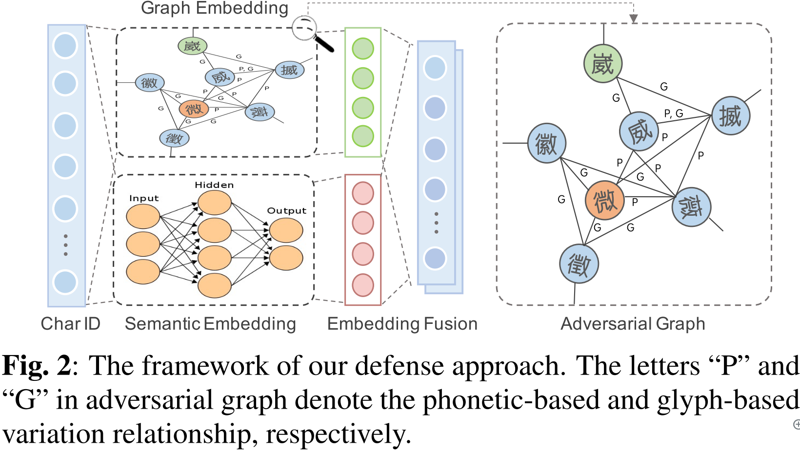
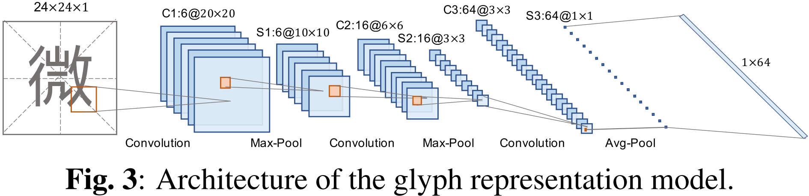
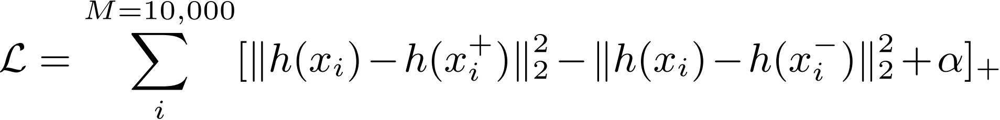
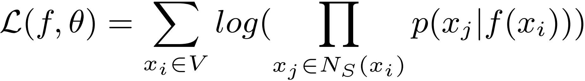
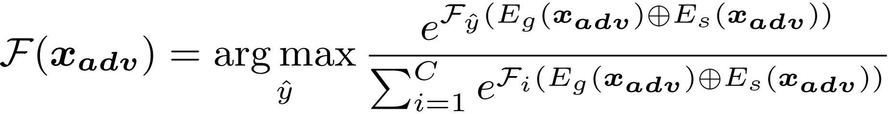
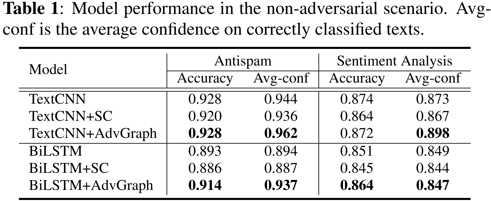
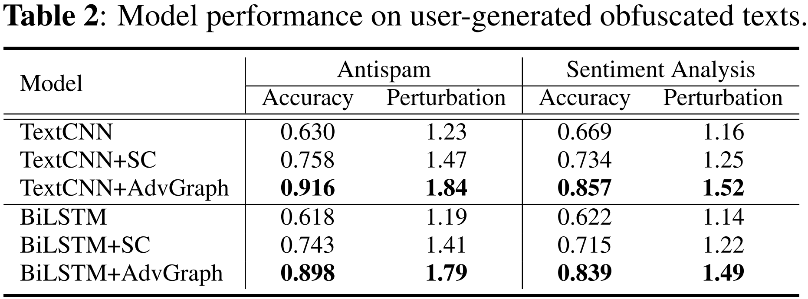
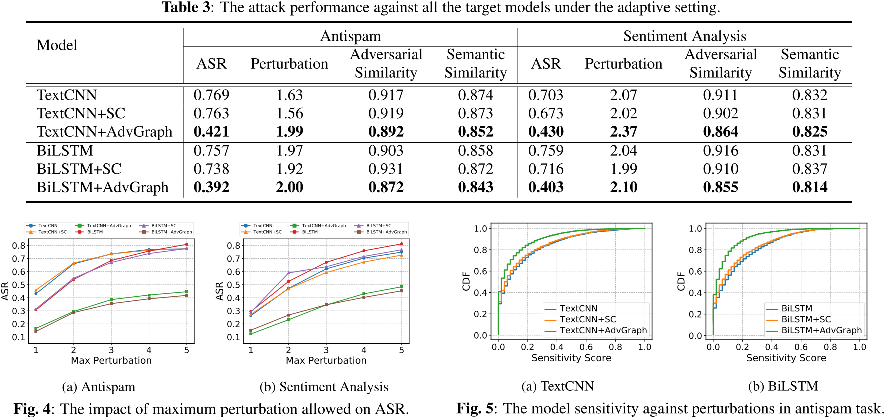

# Defense on NLP

[TOC]

## Enhancing Model Robustness By Incorporating Adversarial Knowledge Into Semantic Representation

### Contribution

1. 很有意思，首先用图来衡量相似性，再用图的嵌入表示结合传统的分类流程，来提升模型对对抗样本的鲁棒性；

### Notes

1. 文章算法：

   

   (1) 构建关联图：

   - 通过拼音构建关联图：phonetic-based  perturbations；

   - 通过字形构建关联图：glyph-based perturbations；

     字形的相似性无法很好地直接构建，所以作者用一个自己的数据集（大小为 10000，形式是三元组的形式）来训练了一个卷积神经网络 g-CNN 用来提取文字的图形特征表示，然后通过欧式距离来判断两个字形的相似性，网络结构如下：

     

     模型训练的目标为，最小化：

     

     其中，$h(x_i)$ 是对文字 $x_i$ 的隐藏表示，$(x_i,x_i^+)$ 两者字形相似，而 $(x_i, x_i^-)$ 两者字形相差很大。

   (2) 图的嵌入表示：

   - 作者通过 node2vec 来构建图的嵌入表示，（Skip-gram 思想）最大化目标函数：

     

     其中，$f$ 指的是一个映射关系，$\theta$ 就是这个映射关系的参数，$N_S(x_i)$ 是文字 $x_i$ 的相近字，是通过 BFS（breath-first sampling） 和 DFS （Depth-first sampling）两种方法采样得到的（<u>我没有太理解这两种方法如何确定这个相似集合</u>）;

   (3) 文本的嵌入表示：这边仍然保持原有的文本嵌入表示方式，可以是 Word2Vec，也可以是 BERT；

   (4) 融合：（<u>看来还是需要数据的支撑，有数据好办事</u>）

   - 将图的嵌入表示和文本的拼接表示拼接到一起，训练一个下游分类模型：

     

     其中，$\mathcal{F}_i$ 指的是第 $i$ 个目标分类的概率；

2. 实验：

   (1) 数据集：

   - Douban Short Movie Comments (DMSC)
   - Spam Advertisement (SpamAds)

   (2) 测试攻击：

   - TextBugger

   (3) 结果：

   - 正常情况的结果

   

   - 对抗攻击下的结果

     

   - 日常用户攻击下的结果

     

### Links

- 论文连接：[Li J, Du T, Liu X, et al. Enhancing Model Robustness By Incorporating Adversarial Knowledge Into Semantic Representation[J]. arXiv preprint arXiv:2102.11584, 2021.](https://arxiv.org/abs/2102.11584)