# OOD Problem

Out of Distribution Problem, or Detecting Concept Drift Samples.

[TOC]

## Transcend: Detecting Concept Drift in Malware Classification Models

### Contribution

### Notes

### Links

- 

## CADE: Detecting and Explaining Concept Drift Samples for Security Applications

> 概念漂移，或者说 “Out of Distribution” 问题确实是一个值得思考的问题；

### Contribution

1. 提出了一种不错的 OOD 检测方法，并且在安全应用上进行测试，值得在 AI 赋能方向上借鉴；

> 朱老师给的启发：
>
> 这种解决方案，在实际的攻击环境下，可能是不适用的；因为对于深度学习用于恶意软件检测，研究人员首先需要人工提取恶意软件的相关特征，进行特征处理以后，然后交给神经网络进行处理；所以整个过程中，人工的特征提取过程占据着相当大的比重，很多情况下，不是因为神经网络好而有一个好的恶意软件检测的工作，而是特征提取好才成就了好的恶意样本检测工作；
>
> 在实际恶意攻击链的情况下，当前的特征提取模块，很可能无法提取到新的恶意软件家族的一些行为特征，所以在CADE的工作下，他很可能不是一个“漂移样本点”，就可能导致无法被很好地检测；
>
> 但是从一定程度上来讲，CADE这个工作确实可以减轻安全工作人员的工作量；实际过程中，安全人员不能说一样样本可能不是恶意样本而不去进行分析，安全人员需要对所有可疑的样本都进行分析；
>
> 从上面这些分析来看，CADE这篇文章首先没有开源他们的代码，其次没有在文章中说明他们是如何进行特征提取的，所以不能说明 Contrastive learning 用在这里一定是好的，很可能大部分功劳是特征提取模块的；不过，这篇文章让我们安全人员看到了对比学习是个什么东西。

### Notes

1. Concept Drift Sample：即 "Out of Distribution" 问题，这个问题在实际的系统中非常常见，即时间的变化，我们得到的样本分布可能发生变化，就会导致我们的线上模型精度大幅度下降；原文的表述如下：

   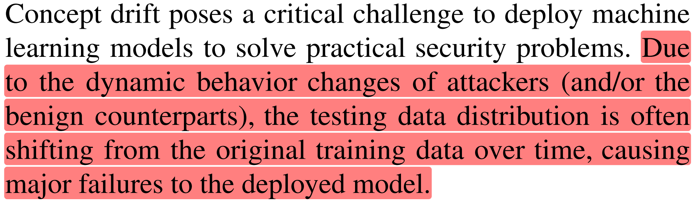

   这类问题，可以被分类为：

   - Type A - the introduction of a new class：OOD 样本来自与现有分类 **不同** 的类；
   - Type B - in-class evolution：OOD 样本来自与现有分类 **相同** 的类；

2. 文章算法

   - 整体架构：如下图所示，作者提出的算法并不会影响原分类器的架构，而是利用训练集，重新训练一个漂移样本检测器和解释器；

   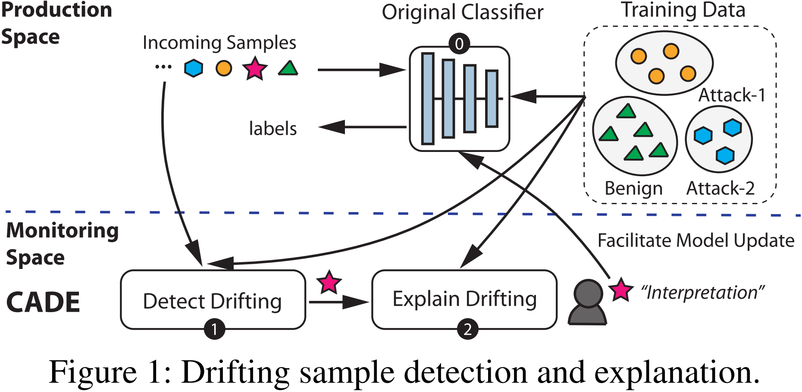

   - 漂移样本检测器：使用自编码器（AutoEncoder） + 对比度损失函数（contrastive loss）；

     - 对比训练的整体思想：希望在超平面上，类间距离尽可能大，类内距离尽可能小；原文描述如下

       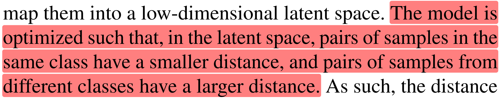

     - 对比度损失函数（contrastive loss）：

       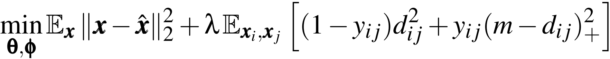

       其中，$\theta$ 是编码器 $f$ 的参数，$\phi$ 是解码器 $h$ 的参数，$x$ 表示原始样本，$\hat{x}$ 表示经过自编码器重构的样本，$y_{ij}$ 表示两个样本 $x_i,x_j$ 是否属于同一类，$d_{ij}$ 表示两个样本在超平面上的欧式距离，使用 $z=f(x;\theta)$ 表示样本 $x$ 在超平面上的向量；

     - MAD-based Drifting Sample Detection：基于 Median Absolute Deviation（MAD）算法

       - 整体的思路是，我们可以根据训练集，为数据集中的每个已知分类在超平面中计算一个质心，如果新的样本在超平面上到每个分类的质心都超过阈值，那么我们认为它是一个 OOD 样本点；
       - 这里的阈值是每个类都不同的，具体的，我们计算超平面中每个点到质心的平均距离，这个距离乘以一个系数后，即为我们最终的阈值；
       - 算法如下：

     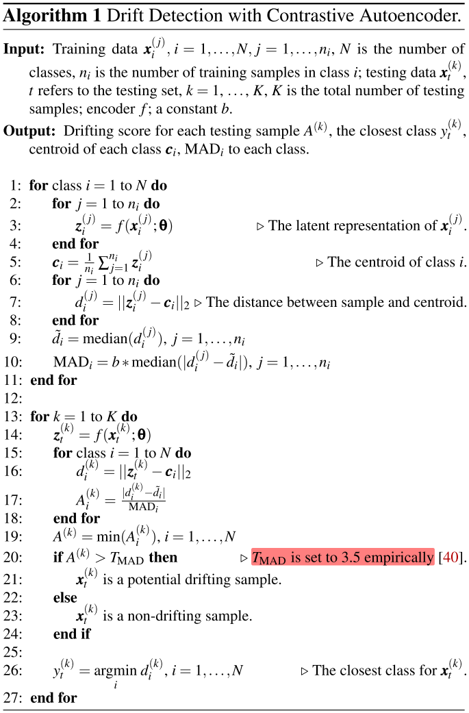

     - 漂移样本排序：根据前面计算得到的距离，对漂移样本样本进行排序；

   - 漂移样本解释器：作者首先介绍了一种 Boundary-based Explanation 方法（baseline），后介绍了一种 Distance-based Explanation 方法（文章用的方法）

     **Boundary-based Explanation**

     > Boundary-based Explanation 的目标合理嘛？为什么这种方法需要使用 MLP 网络来对决策边界进行拟合？

     - 目标：修改最少的特征，使得样本能够越过模型的决策边界；
     - 实现：首先使用噪声样本和 MLP 网络拟合决策边界，然后通过 perturbation-based 来对样本进行解释；

     **Distance-based Explanation**

     > 独立性假设，是网络建模和可解释性等领域的难点；

     - 目标：修改最小的特征，使得样本在超平面上能够距离最近的类质心更近，原文的描述如下

       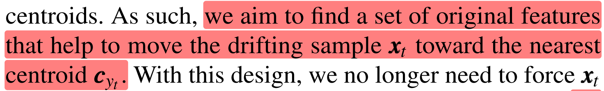

     - 实现：作者通过梯度下降算法，优化如下目标函数

       :question: <u>这边是如何实现的，还是挺迷的</u>；

       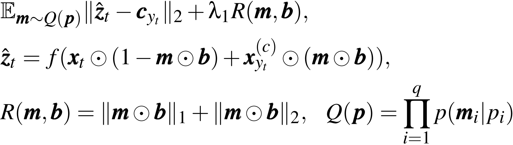

       一式左边，期望扰动后的样本在超平面上能够离质心更近，一式右边，期望扰动的特征尽可能得少；

       $x_{y_t}^{(c)}$ 是类中离质心最近的样本点，用来替换当前样本的特征；

       $Q(p)$ 是联合独立伯努利分布的表达式，在实现过程中，作者为了实现可导的计算，用了近似算法来替代伯努利分布；

3. 实验

   - 数据集：

     > 可能存在的问题：
     >
     > 1. 测试的数据集的分类都是比较少的，样本数目也比较少；
     > 2. 在大的数据集中，可能两个分类之间非常接近，可能会导致算法的效果变差；
     > 3. 实际应用中，我们会需要不断训练我们的AutoEncoder来适应OOD样本的引入，那么可能会花费大量的熟练时间；

     - Drebin 数据集

       

     - IDS2018 数据集

       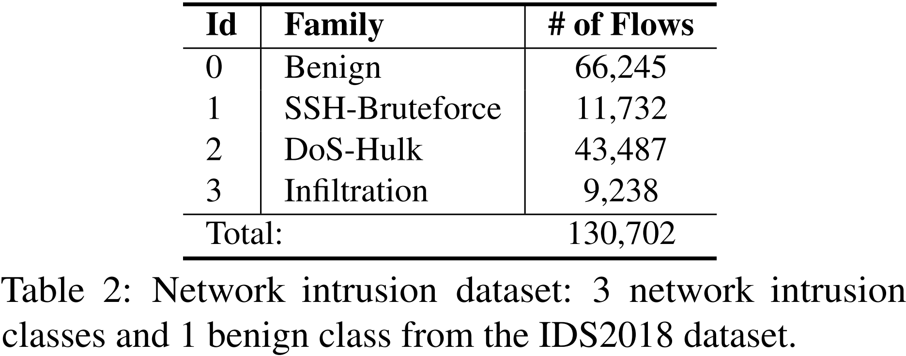

   - Baseline 方法：

     - Vanilla AE：不带有 Contrastive Loss 的 AutoEncoder；
     - Transcend：根据网络输出的置信度来判断是否是 OOD 样本；

   - 漂移样本检测实验：

     作者的实验是这样做的，针对一批测试样本，根据计算得到的距离进行排序，然后观测排序后的样本，计算各项指标；

     指标中，Norm.Effort 的含义表示，观测到全部 OOD 样本（这里的全部指的是该算法能够检测出来的，因为一定存在部分 OOD 样本算法无法检测到）时，算法需要观测的样本数目，比上整个 OOD 样本集（这里包含无法检测出来的样本）的数目；

     实验结果如下所示，可以看到，CADE 都优于其他算法，相对于 Transcend 算法来说，也是更稳定的（<u>这一点只测了两个数据集可能并不能说明太多东西</u>）；

     

     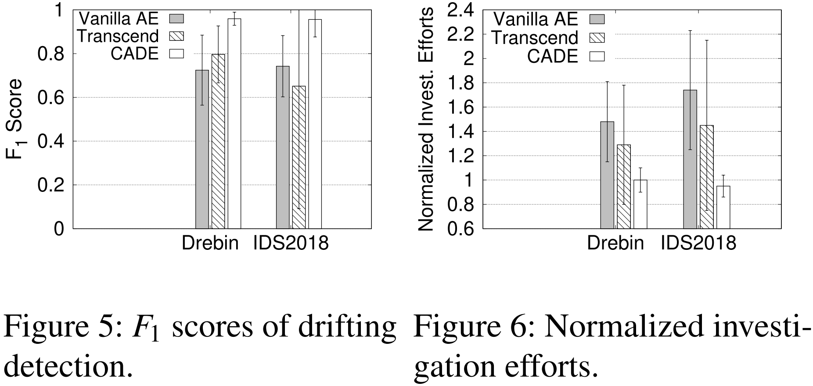

   - 可视化分布：

     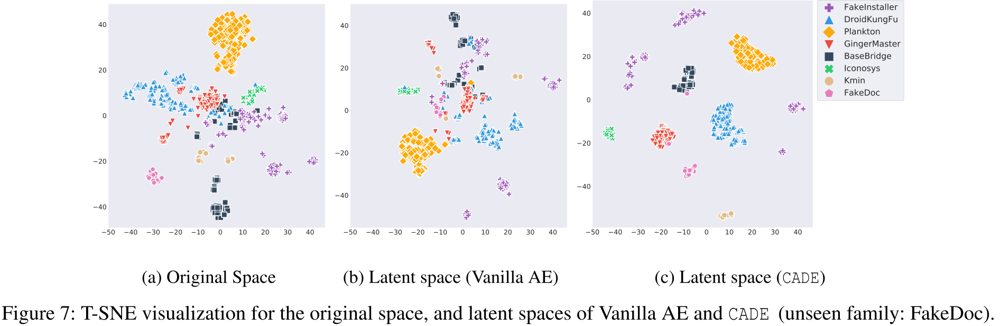

   - 漂移样本解释实验：

     > 文章使用了下面两个指标，但是这两个指标本身是否合理，还是需要讨论一下的；
     >
     > :question: 另外作者作者在这里引用了一个别人的观点：白盒的可解释性方法比黑盒的可解释性方法来得更好；这个观点是否是合理的？

     - 超平面距离：

       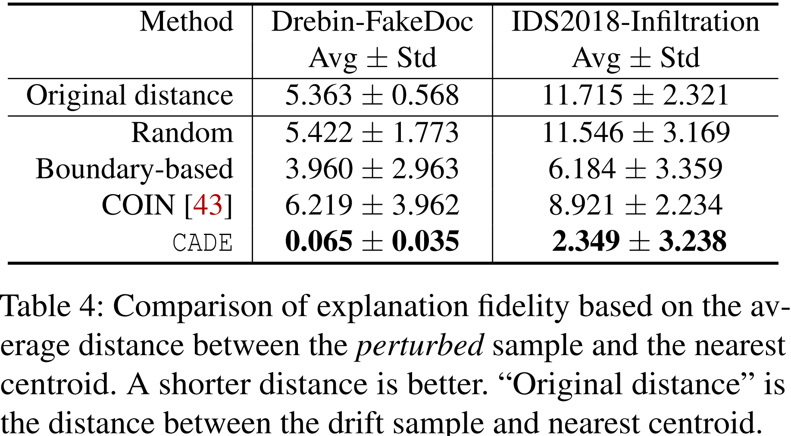

     - Cross Boundary Ratio：

       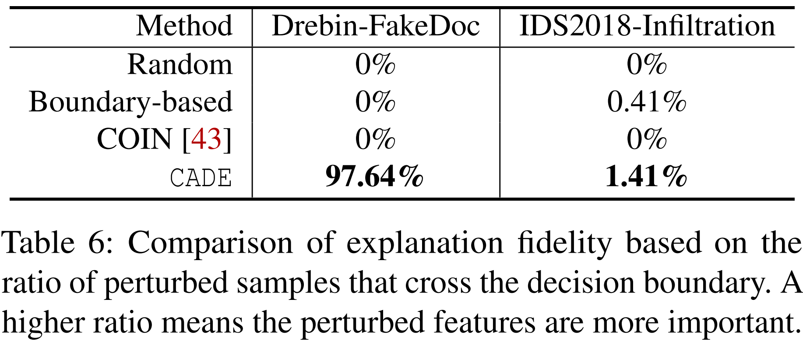

### Links

- 论文链接：[Yang L, Guo W, Hao Q, et al. {CADE}: Detecting and Explaining Concept Drift Samples for Security Applications[C]//30th {USENIX} Security Symposium ({USENIX} Security 21). 2021.](https://www.usenix.org/conference/usenixsecurity21/presentation/yang-limin)
- 论文代码：https://github.com/whyisyoung/CADE

