# Outlier Detection

## Bilibili-异常样本检测算法详解

> 思考：能否应用到我们的工程中来；

视频链接：https://www.bilibili.com/video/BV1rq4y1C7R3

群组异常样本：其特征是出现的个体会在视图中呈现聚集；

离群点异常样本：不同于其他样本的分布；

时间序列异常样本：其特征是随着时间的变化，出现异常；

### FRAUDAR —— 群组异常检测算法

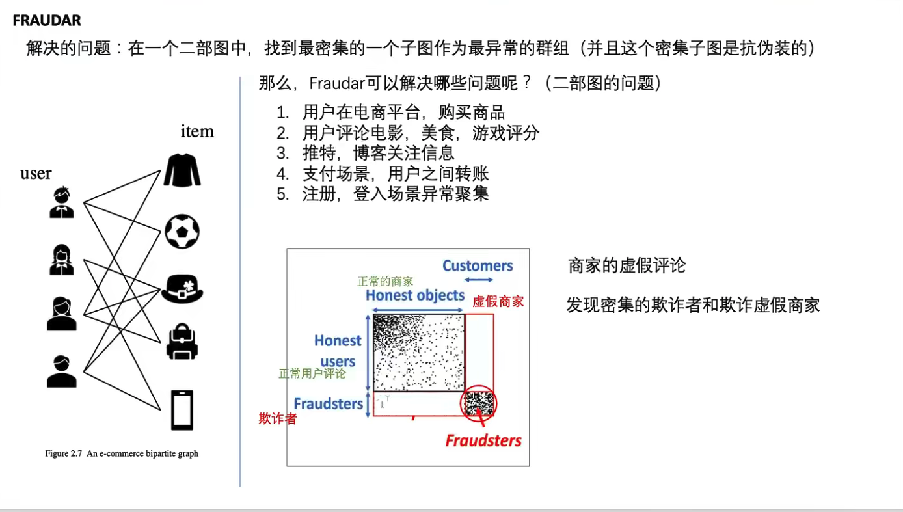

### SLICENDICE —— 群组异常检测算法

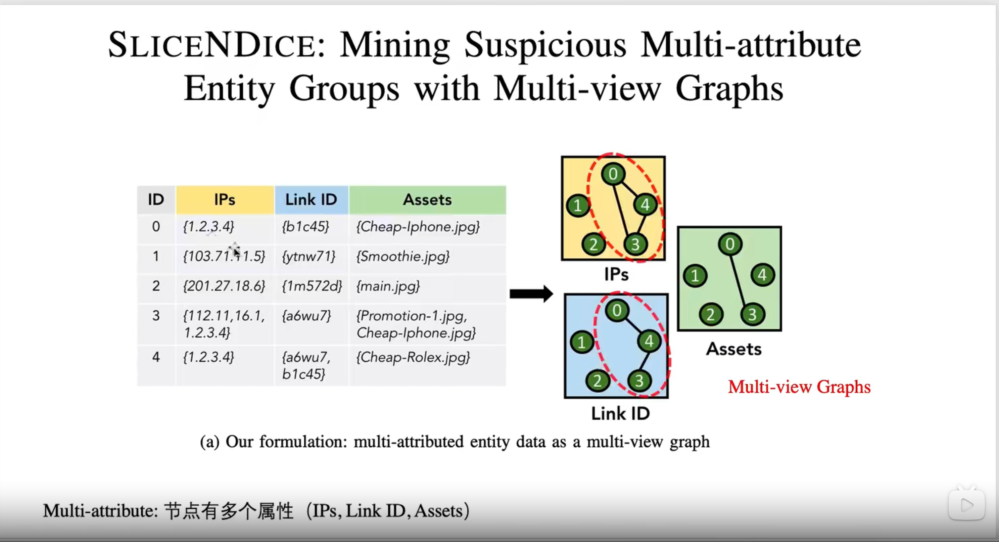

### SDNE —— 群组异常检测算法

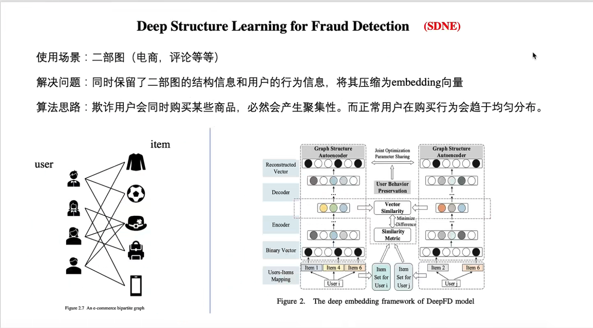

### ONE —— 离群点异常检测算法

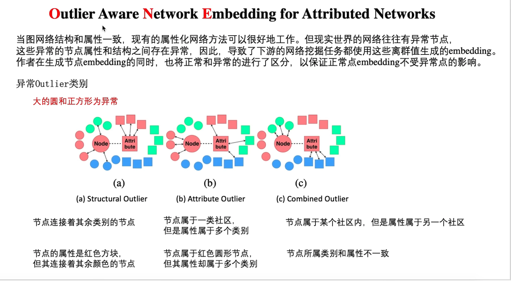

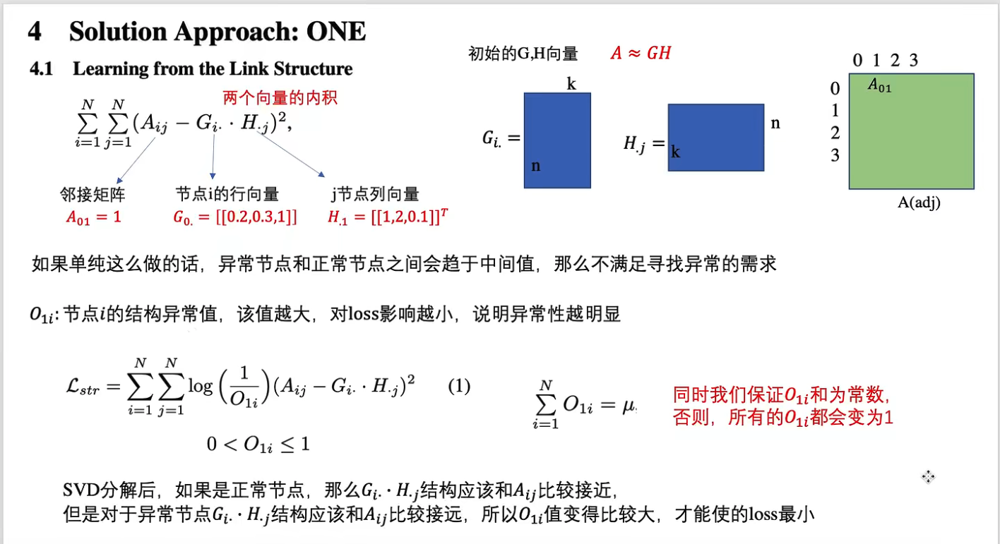

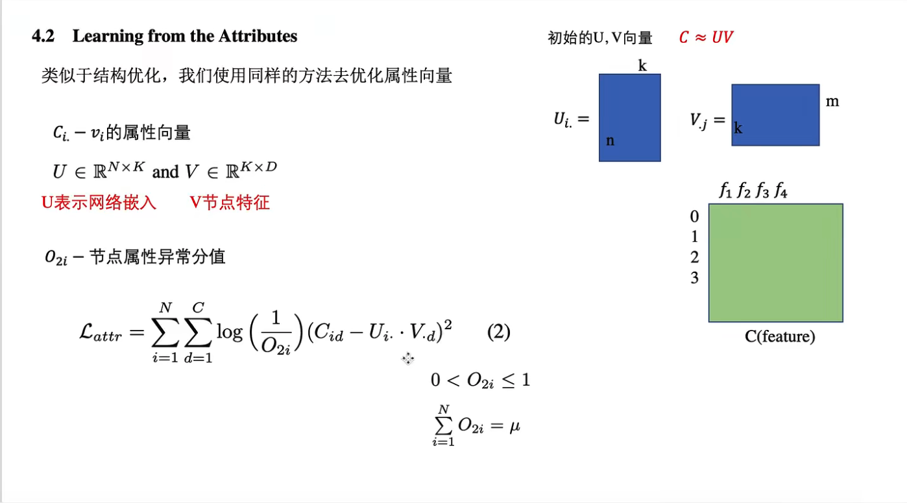

### DAGMM —— 离群点异常检测算法

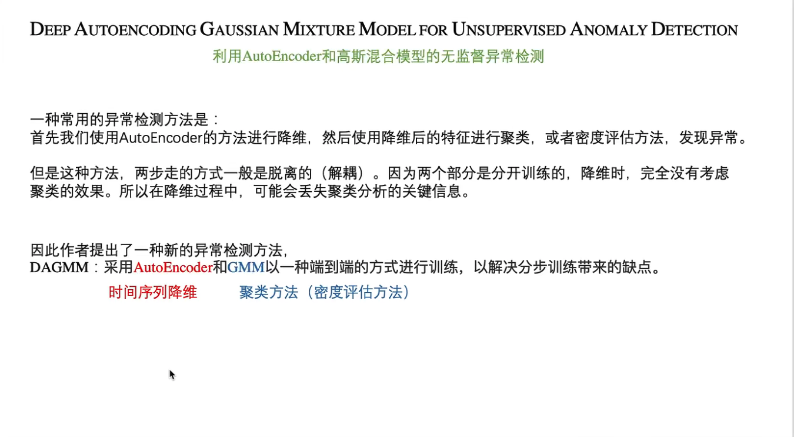

### MSCRED —— 时序异常检测算法

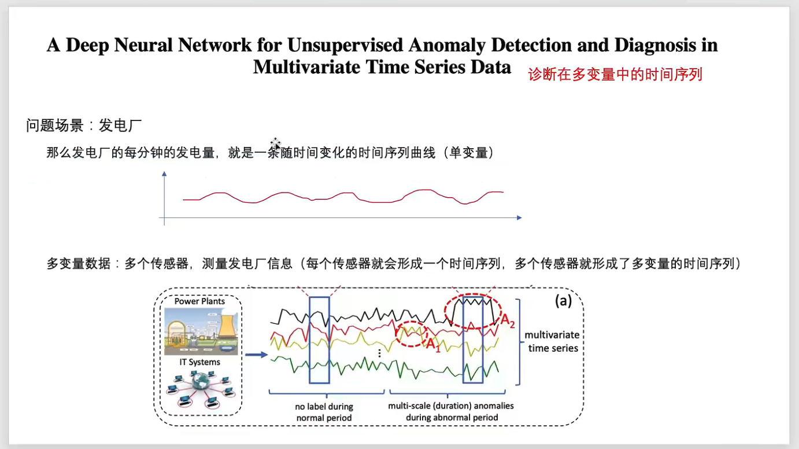

### TadGAN —— 时序异常检测算法

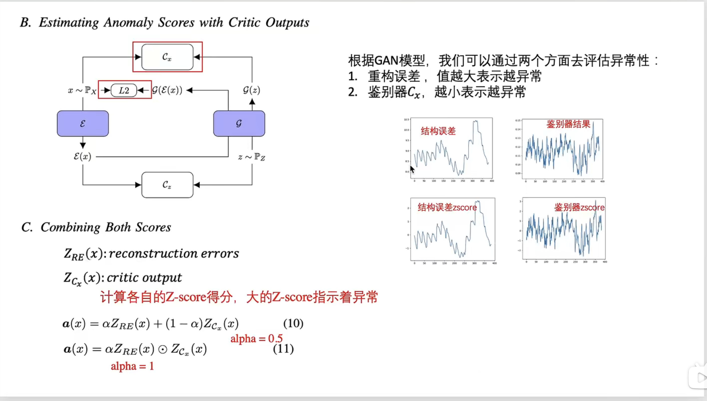

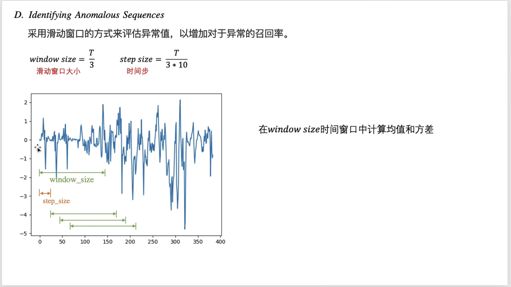

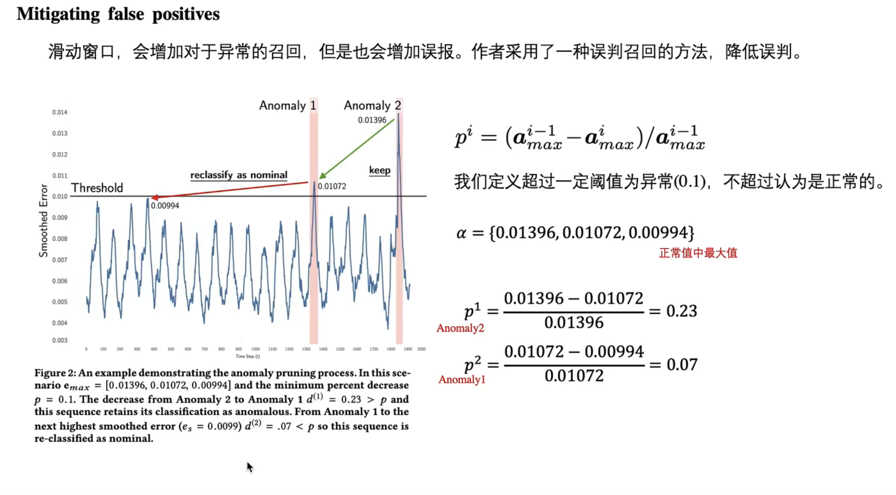

### TS2Vec —— 时序异常检测算法

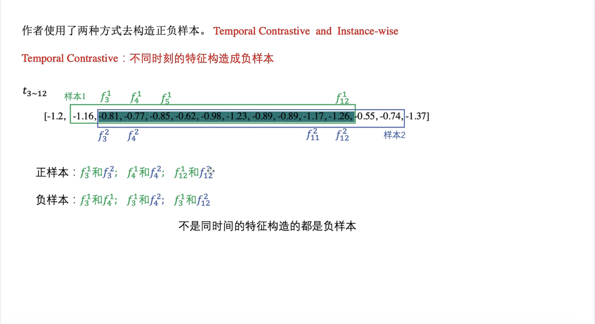

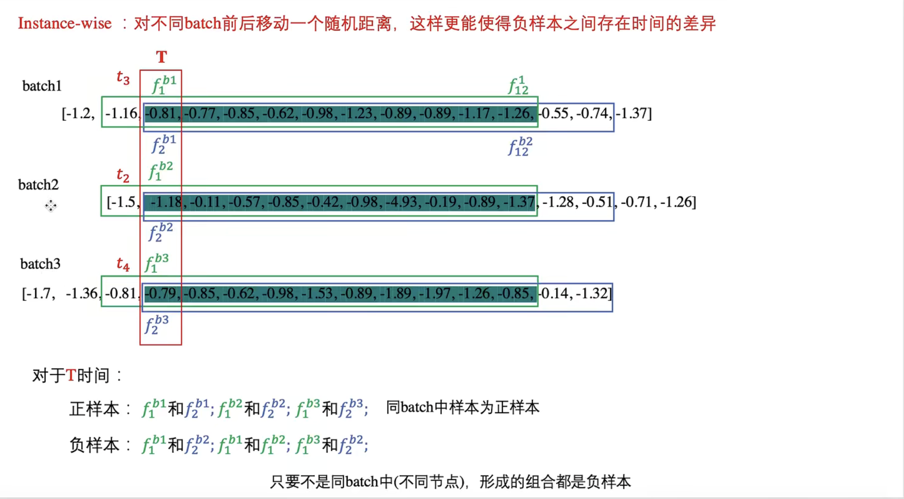

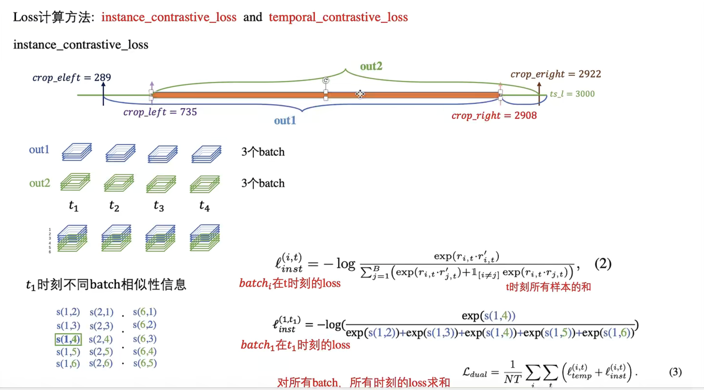

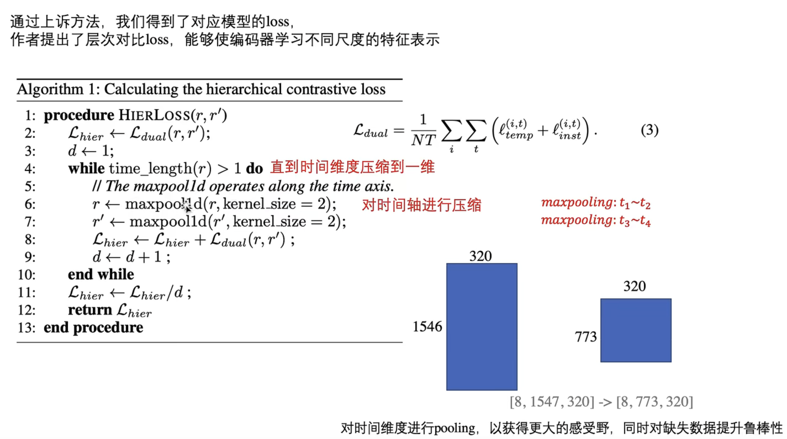

### FlowScope —— 资金关系异常检测算法

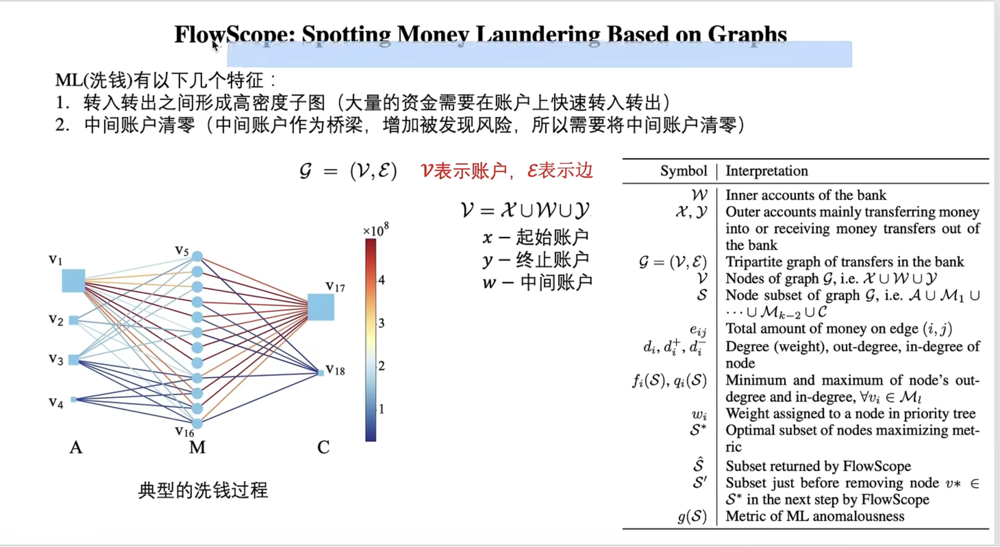

## EULER: Detecting Network Lateral Movement via Scalable Temporal Link Prediction

> 如何和用户行为基线进行关联？无法关联的话，可能无法使用用户群组来减少模型误报；
>
> 如何处理非固定IP的情况？数据中，如果无法标识每一个用户，可能无法使用这个模型；
>
> 如何溯源横移异常？某个用户指向某个节点的异常访问会被标识；
>
> 为什么需要分布式的worker？分布式的worker能实现多大的效率提升？

### Contribution

1. 提出了一种分布式的基于GNN和RNN的横移检测算法，提高了模型检测执行的效率的同时，保证了相近的模型检测能力；

### Notes

1. 模型架构：

   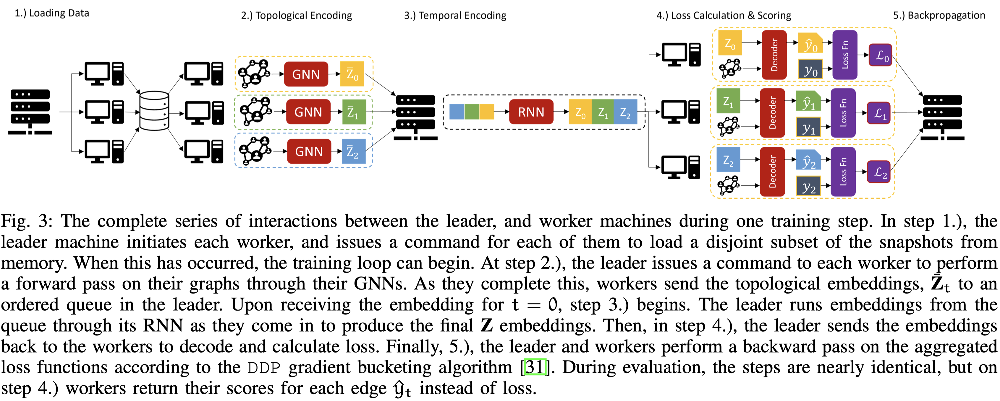

2. 流量横移检测：在LANL 2015数据集上进行测试

   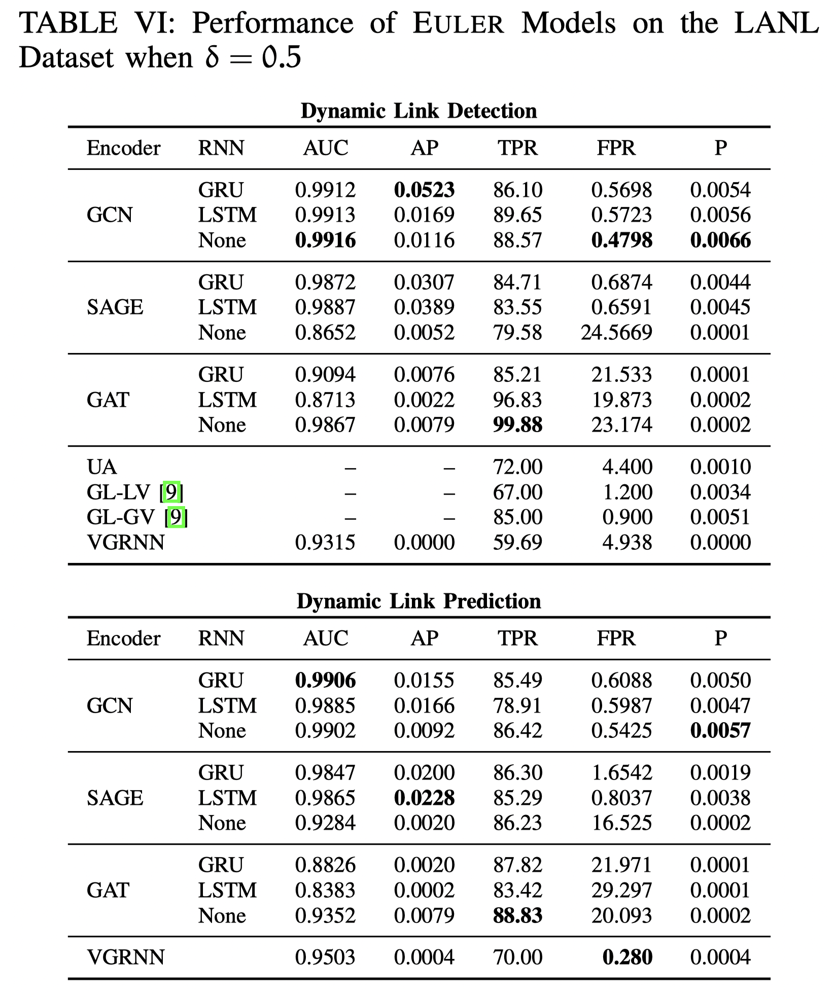

### Links

- 论文链接：[King I J, Huang H H. EULER: Detecting Network Lateral Movement via Scalable Temporal Link Prediction[J].](https://www.ndss-symposium.org/ndss-paper/auto-draft-227/)
- 论文代码：https://github.com/iHeartGraph/Euler
