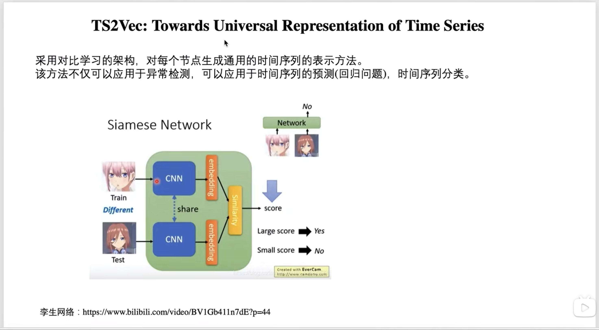

# Outlier Detection

## Bilibili-异常样本检测算法详解

> 思考：能否应用到我们的工程中来；

视频链接：https://www.bilibili.com/video/BV1rq4y1C7R3

群组异常样本：其特征是出现的个体会在视图中呈现聚集；

离群点异常样本：不同于其他样本的分布；

时间序列异常样本：其特征是随着时间的变化，出现异常；

### FRAUDAR —— 群组异常检测算法

### SLICENDICE —— 群组异常检测算法

### SDNE —— 群组异常检测算法

### ONE —— 离群点异常检测算法

### DAGMM —— 离群点异常检测算法

### MSCRED —— 时序异常检测算法

### TadGAN —— 时序异常检测算法

### TS2Vec —— 时序异常检测算法

### FlowScope —— 资金关系异常检测算法

