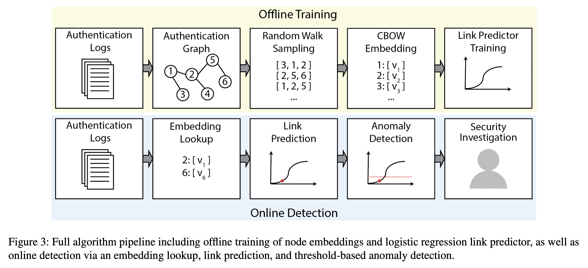
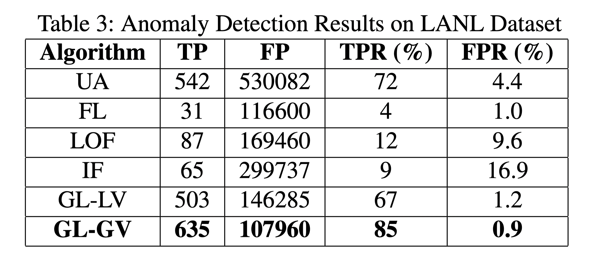

# Outlier Detection

## Bilibili-异常样本检测算法详解

> 思考：能否应用到我们的工程中来；

视频链接：https://www.bilibili.com/video/BV1rq4y1C7R3

群组异常样本：其特征是出现的个体会在视图中呈现聚集；

离群点异常样本：不同于其他样本的分布；

时间序列异常样本：其特征是随着时间的变化，出现异常；

### FRAUDAR —— 群组异常检测算法

### SLICENDICE —— 群组异常检测算法

### SDNE —— 群组异常检测算法

### ONE —— 离群点异常检测算法

### DAGMM —— 离群点异常检测算法

### MSCRED —— 时序异常检测算法

### TadGAN —— 时序异常检测算法

### TS2Vec —— 时序异常检测算法

### FlowScope —— 资金关系异常检测算法

## Detecting Lateral Movement in Enterprise Computer Networks with Unsupervised Graph AI

> 如何处理网页间的关联关系？如何无穷尽的网页边界？

### Contribution

1. GNN实现了横移检测；

### Notes

1. 算法流程：

   

2. 实验结果：

   

3. 最后给出了三条可行的减少误报的方案：
   1. 只报告首次异常登录事件；
   2. 只报告和用户相关的异常登录事件；
   3. 只报告和其他异常事件相关联的异常登录事件； -> 这一点比较有用、可借鉴；

### Links

- 论文链接：[Bowman B, Laprade C, Ji Y, et al. Detecting lateral movement in enterprise computer networks with unsupervised graph {AI}[C]//23rd International Symposium on Research in Attacks, Intrusions and Defenses (RAID 2020). 2020: 257-268.](https://www.usenix.org/system/files/raid20-bowman.pdf)

## EULER: Detecting Network Lateral Movement via Scalable Temporal Link Prediction

> 如何和用户行为基线进行关联？无法关联的话，可能无法使用用户群组来减少模型误报；
>
> 如何处理非固定IP的情况？数据中，如果无法标识每一个用户，可能无法使用这个模型；
>
> 如何溯源横移异常？某个用户指向某个节点的异常访问会被标识；
>
> 为什么需要分布式的worker？分布式的worker能实现多大的效率提升？

### Contribution

1. 提出了一种分布式的基于GNN和RNN的横移检测算法，提高了模型检测执行的效率的同时，保证了相近的模型检测能力；
2. 主要的贡献可能集中在GNN和RNN这种多worker的联合训练框架上；

### Notes

1. 模型架构：

   

2. 流量横移检测：在LANL 2015数据集上进行测试

   

### Links

- 论文链接：[King I J, Huang H H. EULER: Detecting Network Lateral Movement via Scalable Temporal Link Prediction[J]. NDSS 2022.](https://www.ndss-symposium.org/ndss-paper/auto-draft-227/)
- 论文代码：https://github.com/iHeartGraph/Euler
- LANL 2015数据集：https://csr.lanl.gov/data/cyber1/
