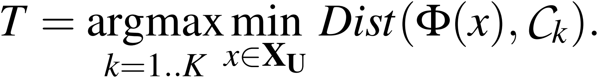
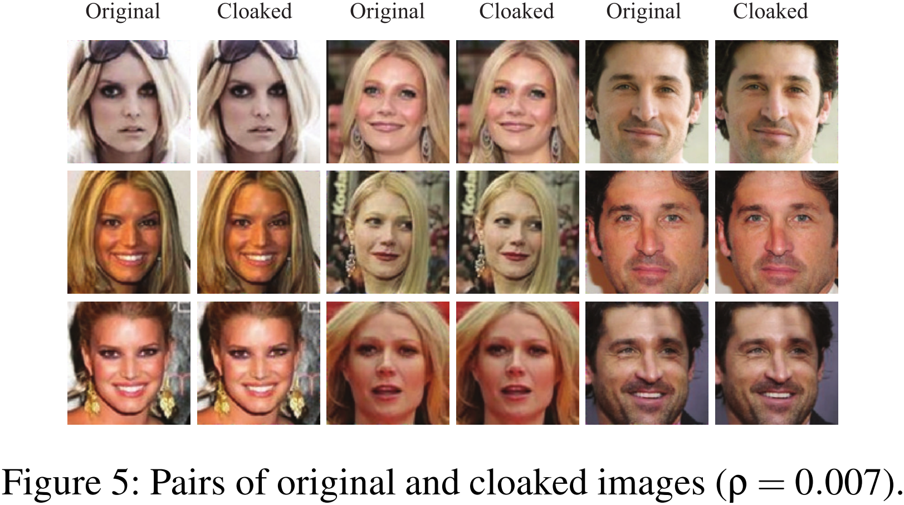
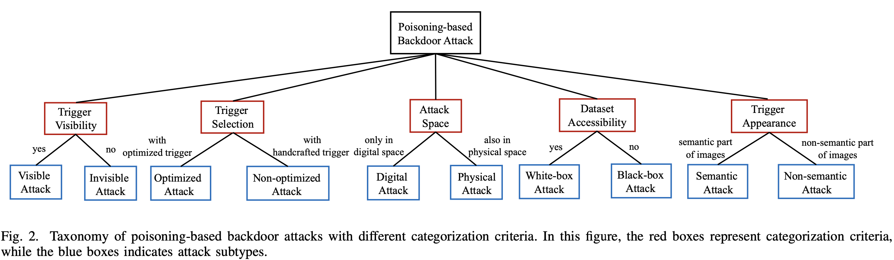

# Attack & Defense in Poisoned & Backdoor Attack

[TOC]

## Todo List

1. Yingqi Liu, Shiqing Ma, Yousra Aafer, Wen-Chuan Lee, Juan Zhai, Weihang Wang, and Xiangyu Zhang. Trojaning attack on neural networks. In 25nd Annual Network and Distributed System Security Symposium, NDSS 2018, San Diego, California, USA, February 18-221, 2018. The Internet Society, 2018.
2. Yuanshun Yao, Huiying Li, Haitao Zheng, and Ben Y Zhao. Latent backdoor attacks on deep neural networks. In Proceedings of the 2019 ACM SIGSAC Conference on Computer and Communications Security, pages 2041–2055, 2019.
3. Joseph Clements and Yingjie Lao. Hardware trojan attacks on neural networks. arXiv preprint arXiv:1806.05768, 2018.
4. Wenshuo Li, Jincheng Yu, Xuefei Ning, Pengjun Wang, Qi Wei, Yu Wang, and Huazhong Yang. Hu-fu: Hardware and software collaborative attack framework against neural networks. In 2018 IEEE Computer Society Annual Symposium on VLSI (ISVLSI), pages 482–487. IEEE, 2018.
5. Bolun Wang, Yuanshun Yao, Shawn Shan, Huiying Li, Bimal Viswanath, Haitao Zheng, and Ben Y Zhao. Neural cleanse: Identifying and mitigating backdoor attacks in neural networks. In Neural Cleanse: Identifying and Mitigating Backdoor Attacks in Neural Networks, page 0. IEEE, 2019.
6. Huili Chen, Cheng Fu, Jishen Zhao, and Farinaz Koushanfar. Deepinspect: a black-box trojan detection and mitigation framework for deep neural networks. In Proceedings of the 28th International Joint Conference on Artificial Intelligence, pages 4658–4664. AAAI Press, 2019.
7. Bryant Chen, Wilka Carvalho, Nathalie Baracaldo, Heiko Ludwig, Benjamin Edwards, Taesung Lee, Ian Molloy, and Biplav Srivastava. Detecting backdoor attacks on deep neural networks by activation clustering. arXiv preprint arXiv:1811.03728, 2018.
8. Brandon Tran, Jerry Li, and Aleksander Madry. Spectral signatures in backdoor attacks. In Advances in Neural Information Processing Systems, pages 8000–8010, 2018.
9. Yansong Gao, Chang Xu, Derui Wang, Shiping Chen, Damith C Ranasinghe, and Surya Nepal. Strip: A defence against trojan attacks on deep neural networks. arXiv preprint arXiv:1902.06531, 2019.
10. Edward Chou, Florian Tram`er, Giancarlo Pellegrino, and Dan Boneh. Sentinet: Detecting physical attacks against deep learning systems. arXiv preprint arXiv:1812.00292, 2018.

## Detecting AI Trojans Using Meta Neural Analysis

> 原文的表述比较清晰，建议可以阅读原文

### Contribution

### Notes

1. Meta Neural Analysis：中文译为元神经分析，是整篇文章的核心内容，下面展示其整个流程图

   

   可以看到，整个流程即为：从神经网络模型中提取特征（**文章中用的是特定 query 的模型输出结果**），然后用这些特征训练一个分类器；

2. Trojan Attacks on Neural Networks

   后门的实际示例如下图所示：

   

   - **Modification Attack**：直接在训练集样本的某个区域上打 Patch；
   - **Blending Attack**：在训练集样本的整体上打上 Patch；
   - **Parameter Attack**：:question: <u>大概是通过梯度下降算法生成的后门 patch，但是具体怎么做还是不清楚？</u>
   - **Latent Attack**：:question: <u>不是很清楚，fine-tune的时候出现的后门，有待更新？</u>

3. Threat Model & Defender Capabilities

   作者罗列了已有的后门攻击防御方法及其能力，如下图所示：

   

   可以看到，作者实现的是一种 **模型层面的后门检测算法**，不需要获取模型的参数，不需要获取训练数据，但是需要获取一小部分相同任务的干净数据（没有被污染的数据）；

4. 文章方法 Meta Neural Trojan Detection (MNTD)

   ⭐ **整体思想**：文章想做的其实就是训练一堆 **正常的网络模型** 和一堆 **带有后门的网络模型**，然后用一定量的**特定的 query 获取模型的输出结果**，这个输出结果拼接在一起即**组成了模型的特征**，最后利用模型的特征来 **训练一个二分类器**；

   整体的 **流程图** 如下所示：

   

   - Shadow Model Generation - Jumbo Learning

     Shadow Model 由正常模型和后门模型组成。正常模型比较好训练，作者采用的是不同的初始化方法训练多个模型。而后门模型的训练则比较麻烦，因为攻击者添加后门的策略是千变万化的，防御者无法穷举这个可能性。所以作者这里提出了 **Jumbo Learning** 的方法，大致的思想就是**随机采样添加后门的策略**，为此，作者列出了如下随机采样公式：（<u>这里，我在解释的时候用的是 patch，或者也可以称为 pattern，都一样</u>）

     

     其中，$(x,y)$ 表示正常的样本，$(x',y')$ 表示添加了后门的样本，$\alpha$ 控制添加的 patch 的透明度，$m$ 用来控制 patch 的大小、位置、形状等，$t$ 为后门 patch；

     > 注意 :warning:：虽然作者上面确实提到了四种后门攻击的方法，但是实际上在随机采样的过程中，只是应用了 Modification Attack 和 Latent Attack 这两个攻击，因为只有这两个攻击是可以通过污染模型训练数据集可以实现的；

     Jumbo Learning 的伪代码如下所示：

     

     作者也展示了随机产生的后门样本：

     

   - Meta-training

     Meta-training 的核心问题有两个：

     - 从模型中 **提取特征**

       作者选择 $k$ 个样本 $X=\{x_1,\dots,x_k\}$，给模型预测，得到模型的输出结果 $\{f_i(x_1), \dots, f_i(x_k)\}$，然后将这 $k$ 个输出结果（文章中直接使用 $k=10$）进行拼接，就是模型的特征了，公式如下所示：

       

     - 训练一个**分类器**：作者用的两层全连接神经网络；

     在训练的过程中，我们可以由一个比较 **简单的解决方案**，那就是随机选择 $k$ 个样本，然后来训练分类器，训练的公式如下所示：

     

     显然，这样的解决方案，非常依赖于这些样本是否是好的。所以，作者为了解决这个问题，在训练的时候，**同时训练分类器和这 $k$ 个样本（我们可以直接通过模型本身将梯度回传回去）**，改进后的训练公式如下所示：

     

   - Baseline Meta-training algorithm without jumbo learning

     这里，作者想对比一下，如果我们不训练后门模型，只训练正常的模型，然后训练一个分类器，这样的结果如何，即变成了一个 One-class Data Detection 问题。这种情况下，作者修改了网络的训练公式，如下所示：

     

5. 实验设置

   <u>实验的参数设置非常多，这里罗列一些我比较关心的点</u>：

   - 数据集：图像上面用的 MNIST 和 CIFAR10 数据集，语音上面用的 SpeechCommand 数据集，自然语言处理上用的 Rotten Tomatoes movie review 数据集，表格数据用的 Smart Meter Electricity Trial 数据集；
   - 攻击者使用 50% 的数据集，防御者使用 2% 的数据集，且互相没有交集；
   - 从攻击者的角度，生成 256 个后门模型和 256 个正常模型；
   - 从防御者的角度，生成 2048 个后门模型和 2048 个正常模型用来训练分类器；
   - 防御者不会使用攻击者已经使用过的后门策略；
   - Baseline 方法：Activation Clustering（AC），Neural Cleanse（NC），Spectral Signature（Spectral）和 STRIP；

6. 实验结果 ⭐

   > 作者的实验基本上可以称为完美，基本上把我有疑问的实验都做了一遍

   - Trojan Attacks Performance

     作者这里 **展示后门模型原始任务的精度和后门攻击的成功率**，但是这里 **<u>cifar10 的实验我觉得是不可取的</u>**，因为非常明显，后门模型已经严重影响了原任务的精度，正常情况下，我们并不会采用这样的模型；

     

   - Detection Performance

     作者这里展示不同防御方法对后门模型的检测效率，可以看到，**作者提出的方法在不同的数据集上和不同的后门攻击上都有一个不错的效果**；

     

   - Impact of Number of Shadow Models

     作者这里展示训练不同数量的模型，对分类器最后检测结果的影响，可以看到，**不同的数据集对模型数量的敏感度是不一样的，更复杂的数据集需要训练更多的模型，这可能会导致一个问题，即在复杂数据集上无法用作者提出的方法**；

     

   - Running Time Performance

     作者这里展示后门模型检测需要消耗的时间，可以看到，**虽然在检测的时候，该方法非常快，但是训练分类器时却需要消耗大量的时间，取决于原始模型的结构，这也是在复杂数据集上无法用作者提出的方法的一个重要原因**；

     

   - Generalization on Trigger Patterns

     作者这里验证分类器能否检测没有在训练过程中遇到的后门 Patch，可以看到，**分类器对未预见的后门 Patch 泛化性能不错**；

     

   - Generalization on Malicious Goals

     作者这里验证分类器能否检测没有在训练过程中遇到的后门模式（训练时采用的是多个类被错误分类到一个类的模式，这里验证多个类被错误分类到多个类的模式），可以看到，**分类器对未预见的后门模式泛化性能不错**；

     > 这里作者还是少测了一种可能性，即只把一个类错误分类到另一个类的模式。不过，这种模式多半是能被这种防御方法防御成功的，不行的化，可以对前面的虽然采样公式做一定的修改即可。

     

   - Generalization on Attack Approaches

     作者这里验证分类器能否检测没有在训练过程中遇到的后门攻击方法（指的是 Parameter Attack 和 Latent Attack 两种后门攻击方法），可以看到，**分类器对未预见的后门攻击泛化性能不错**；

     

   - Generalization on Model Structures

     作者这里验证分类器能否检测没有在训练过程中遇到过的模型结果，可以看到，**分类器对未预见的模型结构泛化性能不错**；

     

   - Generalization on Data Distribution

     作者这里验证在防御者没有相似分布的训练数据集时，分类器的检测结果，可以看到，**分类器对训练集的分布泛化性能不错**；（:question: <u>我挺好奇的，这是为什么能够达到这么好的效果</u>）

     

7. Adaptive and Countermeasure

   这里，作者假设，如果攻击者能够完全得到防御者提出的模型及其参数，那么攻击者可以在梯度下降的过程中添加额外的损失项来让自己的模型规避分类器的检测，公式如下所示：

   

   

   那么，为了解决这个问题，作者在分类器上又额外添加了一个随机过程：

   - 首先，把分类器的部分参数进行随机化；
   - 然后固定分类器，继续训练 query 数据集；
   - 用再训练过的 query 数据集来检测目标模型；

   这样的随机化方法，避免了攻击者可以获取到分类器的参数，在一定程度上可以缓解前面提到的风险，实验的结果如下：

   

### Links

- 论文链接：[Xu X, Wang Q, Li H, et al. Detecting ai trojans using meta neural analysis[J]. arXiv preprint arXiv:1910.03137, 2019.](https://arxiv.org/abs/1910.03137)

- 论文代码：[Meta Neural Trojan Detection]([AI-secure/Meta-Nerual-Trojan-Detection (github.com)](https://github.com/AI-secure/Meta-Nerual-Trojan-Detection))

## Backdoor Attack Against Speaker Verification

### Contribution

1. 针对基于 d-vector 和 x-vector 的说话人认证系统实现了后门攻击；

> ⭐ 说话人认证任务，和我们平常看到的分类任务有非常大的不同，主要原因是目标说话人的语料可能很少，所以业界需要实现通过较少的目标说话人语料实现说话人认证任务。这一点是前面常见的后门攻击所没有涉及的，值得我们的进一步探讨。

### Notes

1. 文章中使用的 Backdoor Trigger：

   

2. 算法流程：

   - Obtaining Speaker's Representation：训练神经网络来提取不同说话人片段的特征；
   - Speaker Clustering：使用聚类算法将不同的说话人进行聚类；
   - Trigger Injection：根据聚类的结果，对不同簇的说话人的语料插入不同的 Backdoor Trigger；
   - Retrain and Obtain the Backdoored Speaker's Representation：用添加了后门的语料再次训练神经网络；
   - Enroll the Target Speaker：用少料目标说话人的语料来获取该说话人的特征表示；
   - Backdoor Attack：遍历使用上面的 Backdoor Trigger 来测试是否成功插入后门；

> 思考：:question:
>
> 1. 为什么能够通过这种方式，来攻击说话人认证模型？
> 2. 能够攻击说话人识别模型？
> 3. 文章提到的说话人认证模型是否是当前业界的主流？

### Links

- 论文链接：[Zhai T, Li Y, Zhang Z, et al. Backdoor attack against speaker verification[C]//ICASSP 2021-2021 IEEE International Conference on Acoustics, Speech and Signal Processing (ICASSP). IEEE, 2021: 2560-2564.](https://arxiv.org/pdf/2010.11607.pdf)
- 论文代码：https://github.com/zhaitongqing233/Backdoor-attack-against-speaker-verification

## T-Miner : A Generative Approach to Defend Against Trojan Attacks on DNN-based Text Classification

> 思考：如何完成一个研究工作？“首先定义自己要解决的问题，然后将问题拆分成几个小的问题，针对每个小的问题去寻找可行的解决方案，要善于运用别人已有的工作来解决自己手头的问题，然后调试手上的工作，如果可行，那么这个问题就能够被解决了。”

### Contribution

1. 通过生成文本序列（借鉴encoder-decoder风格转换模型）的方法来发掘文本分类模型中的后门；（生成式的方法来生成后门指的借鉴⭐）
2. 该方法能够在一定程度上重构出目标模型的后门 pattern，使得检测结果能够别验证，相当而言对模型的分类也是更可信的；
3. 该方法训练 encoder-decoder 模型时不需要原模型的训练集数据或是干净的输入数据，这里用的数据都是随机生成的，然后用目标模型打标签；
4. 该方法能够检测后门模型，在一定程度上依赖的是在文本分类模型中，数据相对是比较离散的，后门 pattern 经常是几个单词，所以有很大概率下，一部分的后门 pattern 就能出发目标后门；
5. 该方法在检测后门的同时，考虑了通用对抗扰动对检测后门结果的影响；

### Notes

> 看论文的时候，始终应该思考：
>
> - 如何通过generative model来生成后门pattern，从而判别是否是一个后门模型？
> - 为什么可以这样来判断一个黑盒模型？

1. 本文要解决的问题是，判断目标文本分类模型是否是一个带有后门 pattern 的模型；可能的后门样例如下图所示：

   

2. 后门模型

   - 文本分类任务：

     - Yelp：restaurant reviews into **positive** and **negative** sentiment reviews；
     - Hate Speech (HS)：tweets into **hate and non-hate** speech；
     - Movie Review（MR）：movie reviews into **positive and negative** sentiment reviews；
     - AG News：news articles into four classes —— **world news, sports news, business news, and science/technology** news；
     - Fakeddit：news articles into **fake news and real news**；

   - 正常模型和后门模型精度：作者分别用长度为 1~4 的后门pattern，对每个任务分别训练10个模型。（**插入的后门是连续的多个单词，插入的位置随机**）

     

3. 检测框架

   - 检测算法整体框架：如下图所示，整个框架分别两大部分，左边的 Perturbation Generator 用来生成 “**可能的 pattern**”，右边的 Trojan Identifier 则用来判断前面给出的 Pattern 是否是一个后门；

     

   - Perturbation Generator

     - 模型框架与目标：

       使用 GRU-RNN Encoder-Decoder 结构来生成 Candidate Pattern。这里，我们的任务是给定一个原分类 $s$ 的输入，希望网络能够在较小的扰动下，生成一个目标分类 $t$ 的输入；数学表达式如下：

       

     - 损失函数

       <u>损失函数的含义能够清楚理解，但是作者列出的公式，我觉得让读者会有一些困惑；</u>

       - Reconstruction loss

         

       - Classification loss

         

       - Diversity loss

         

         

       - 损失函数的组合：

         

         实验时，$\lambda_R=1.0，\lambda_c=0.5，\lambda_{div}=0.03$；

     - Perturbation Search

       - Greedy Search：贪婪算法，保留第一个可能的样本；
       - Top-K Search：保留前K个样本；（这个方法在实验中的效果更好）

   - Trojan Identifier

     - Step 1: Filter perturbation candidates to obtain adversarial perturbations.

       根据 Pattern 的出错率大于一个阈值 $\alpha_{threshold}$，则可能是一个后门 pattern；

     - Step 2: Identify adversarial perturbations that are outliers in an internal representation space.

       ❗ （<u>这样的假设感觉有点难以接收</u>）作者认为，后门样本和通用对抗样本，可以根据模型内部层（特别是最后一个隐藏层）的输出分布，来进行区分；原文表达如下

       

       基于这样的假设，作者对candidate backdoor samples和一批重新生成的目标分类的样本，首先用 PCA 算法，将模型隐藏层的输出将为，然后使用DBSCAN算法判断candidate backdoor samples是否是异常点（outlier）；

4. 实验结果

   - 检测框架的效率：

     

   - ⭐ 生成的后门 pattern：

     

     可以看到，生成的pattern并不一定完全和插入时的pattern匹配，我认为这也是为什么可以用生成式的方法来检测后门的关键之处；原文的描述如下：

     

     另外，通过生成的后门，我们也可以很清晰地分析这样的检测框架是否是合理的；

   - Countermeasure：作者在其他后门攻击方法和针对该检测框架的缓解措施下，重新测试检测效率；

     

     可以看到，在High Frequency下，即用高频词作为后门Trigger时，检测效率会发生明显的变化；

### Links

- 论文链接：[Azizi A, Tahmid I A, Waheed A, et al. T-Miner: A Generative Approach to Defend Against Trojan Attacks on DNN-based Text Classification[C]//30th {USENIX} Security Symposium ({USENIX} Security 21). 2021.](https://www.usenix.org/system/files/sec21fall-azizi.pdf)
- Trojan AI Program：https://www.iarpa.gov/index.php/research-programs/trojai
- 论文代码：https://github.com/reza321/T-Miner

## Invisible Backdoor Attack with Sample-Specific Triggers

> 思考：
>
> - 未来会使用什么手段，来保证后门攻击的成功率和隐藏性；从这篇文章来看，其中一个发展方向是**添加样本相关的后门 pattern**；
> - 无论是对抗攻击，还是后门攻击，大家都会提到 **”隐藏性“** 这个概念，能不能在这个概念上取得重大突破；
> - 如何来**防御 ”后门攻击“**；
> - 如何实现**非数据相关的 ”后门攻击“**；
> - 这篇文章提出的方法，相比于现在的方法有什么优势？解决了什么问题？是否对后门攻击这个研究领域有大的推动效果；

### Contribution

1. 简单分析了后门攻击领域现有的攻击方法和防御方法，分析了防御方法基于的假设和存在的问题；(<u>这一块在下面没有具体介绍，包含很多作者的主观猜测，但是还是推荐看一下原文中的描述，说得是有几分道理的</u>)

### Notes

1. 文章攻击方法：

   

   整个攻击流程分为三个过程：

   - **Attack Stage**： 首先，利用一个深度图像隐写神经网络（Decoder-Encoder网络）在样本中嵌入 ”不可感知的“后门；
   - **Training Stage**： 然后，使用带有后门的数据进行正常的训练，得到一个带有后门的深度神经网络；
   - **Inference Stage**： 最后，用后门数据对网络进行攻击；

2. 深度图像隐写神经网络的训练：

   

   该网络的输入是一张原始图片和一个目标标签，经过一个Encoder（<u>和图片样式转换的作用相同</u>）添加后门扰动，再用一个Decoder进行解码。整个网路**希望最终解码出来的标签和目标标签是一致的，并且添加后门扰动后的图片和原始图片的差距应该尽可能得小**。

   <u>我的理解：相当于我们训练原任务模型时，原始模型中就会携带有一个 Decoder 一样的解码逻辑；</u>

3. 实验：

   (1) 污染的样本占整个数据集的 10%，添加后门 trigger 的样本如下：（<u>像上面说得一样，就像是经过了一个风格转换器一样</u>）

   

   (2) 深度图像隐写网络结构：

   

   ​	整体上用的时一个 **StegaStamp 网络**；

   (3) **Attack Effectiveness & Attack Stealthiness**：

   

   ​	本文的工作**能够在保证成功率的情况下，大大减小添加的后门扰动**；

   (4) **Attack with Different Target Label**：

   

   ​	**攻击多个标签的成功率**；

   (5) **The Effect of Poisoning Rate**：

   

   ​		**投毒率对攻击成功率的影响**；

   (6) Out-of-dataset Generalization

   - **Out-of-dataset Generalization in the Attack Stage**：

     

     Encoder 在其他数据集上面进行训练，然后迁移到另一个数据集上面的效率；

   - **Out-of-dataset Generalization in the Inference Stage**：

     

     样式后门在不同数据上面的迁移性；

### Links

- 论文链接：[Li Y, Li Y, Wu B, et al. Backdoor attack with sample-specific triggers[J]. arXiv preprint arXiv:2012.03816, 2020.](https://arxiv.org/pdf/2012.03816.pdf)
- 论文代码：https://github.com/yuezunli/ISSBA

## Fawkes: Protecting Privacy against Unauthorized Deep Learning Models

### Contribution

1. 利用污染的数据来做用户照片的隐私保护；（<u>文章的书写、逻辑和讨论的问题都非常 Nice 👍</u>）
2. 文章在本地模型的基础上，还另外讨论了对四个商业模型的攻击，都得到了不错的效果，实验上面非常的完善；

### Notes

1. Background：保护用户脸部不被检测识别的两种手段

   - Evasion Attack：使用对抗攻击，让已经训练好的模型无法检测到用户的人脸；
   - Poisoning Attack：使用投毒攻击，让目标模型训练的时候出错，从而无法检测用户的正常人脸；
     - **Clean Label Attack：投毒的图片 + 正确的标签；（这篇文章属于这一种 :heavy_check_mark:）**
     - Model Corruption Attack：投毒的图片 + 错误的标签；

2. 文章的目标：

   - Imperceptible：添加的扰动是不可感知的；
   - Low Accuracy：经过投毒训练后的模型，对于正常的用户的人脸，应该有很低的分类成功率；

3. 算法框架：

   

   - 算法背景：

     - 人脸识别的服务使用预训练的特征提取器；
     - 用户有一些自己的照片 $x_U$；
     - 用户有一些别人的照片；
     - 用户能够得到一些特征提取器 $\Phi(\cdot)$；

   - 算法原理：

     - **Cloaking to Maximize Feature Deviation**：

       原文描述如下图

       

       即我们希望用户能将自己的照片做一些扰动，使得 **添加扰动后的图片** 通过特征提取器提取出来的特征和 **添加扰动前的图片** 的特征 相差尽可能的大。

       数学表达式如下

       

     - **Image-specific Cloaking**：

       为了 **简化** 上面的搜索过程，我们修改上式为，指定一张目标图片，使得 **添加扰动后的图片** 通过特征提取器提取出来的特征和 **目标图片** 的特征 尽可能得相近。

       数学表达式如下

       

     - 为什么是期望目标分布相似，而不是像对抗攻击那样？

       (1) 因为特征提取器提取得到的是目标的特征分布，而非一个类；

       (2) 作者文章也提了，可能是为了不被检测器检测出来，原文描述如下图

       

   - 算法过程：

     - 挑选目标图片的分类：

       原文描述如下图

       

       即挑选一个目标分类，使得该分类中的图片和用户的图片之间的特征距离（**L2 距离**）最远。

       数学表达式如下

       

     - 生成 Poisoned 样本：

       原文描述如下图

       

       使用 DSSIM 来计算图像的扰动；

       数学表达式如下

       

4. Experiment

   - 原始任务：

     使用两个预训练数据集、两种模型特征提取模型结构、两个目标训练数据集。

     数据集如下

     

     原始任务精度如下

     

   - Cloaking Configuration

     这里我觉得需要理解的是，用户的图像来自哪个数据集，而挑选的目标分类的图像又来自哪个数据集，原文描述如下：

     

   - User/Tracker Sharing a Feature Extractor：如果用户知道对方的特征提取模型

     - 实验结果如下，扰动 DISSM 越大，攻击的效果越好

     

     - 产生的图片的样例，看不出扰动

       

     - 特征空间展示

       

     - 模型分类数目对攻击的影响：**分类数目越多，越容易获得好的攻击结果**；

       

   - User/Tracker Using Different Feature Extractors：如果用户不知道对方的特征提取模型

     - 特征空间展示

       非常明显，这张情况下攻击的迁移效果比较差

       

     - Robust Feature Extractors Boost Transferability

       原文描述如下

       

       即鲁棒的特征提取器中生成的 Poisoned 样本，更加具有迁移能力

     - 改进

       使用对抗训练（PGD）对模型进行训练，来增强模型的鲁棒性，然后利用对抗训练后的模型来生成 Poisoned 样本；

     - 改进后的攻击效果

       

     - 改进后的特征空间展示

       

   - 攻击黑盒商业模型

     

   - Trackers with Uncloaked Image Access：如果用户已经存在一部分照片被爬取用于训练集

     - 已泄露的用户照片比例对攻击成功率的影响

       

     - 改进方法

       重建一个僵尸账号，并且上传一些 Poisoned 样本（默认这个账号的样本也会被收集），这些样本的原始分类属于另外的分类，在生成样本时，希望样本的特征分布和用户图片的特征分布尽可能得相似；

     - 改进后的结果

       

       其中 `Sybil (x2)` 指的是每张用户的图片都用僵尸账号生成两张 Poisoned 样本；

     - 改进的原理

       原文描述如下图

       

       从 **决策边界** 理解原理

       

### Links

- 论文链接：[Shan S, Wenger E, Zhang J, et al. Fawkes: Protecting privacy against unauthorized deep learning models[C]//29th {USENIX} Security Symposium ({USENIX} Security 20). 2020: 1589-1604.](https://arxiv.org/abs/2002.08327)
- 论文代码：https://github.com/Shawn-Shan/fawkes

## Backdoor Learning - A Survey

### Contribution

- 主要对**图像领域**的后门进行了大量的调研；

### Notes

1. 后门攻击出现的三个可能场景：使用第三方的数据集、使用第三方的服务或者使用第三方的模型；

2. 后门攻击评估框架：
   1. Standard Risk $R_s$：标准的分类误差；
   
      
   
   2. Backdoor Risk $R_b$：后门的分类误差；
   
      
   
   3. Perceivable Risk $R_p$：后门的感知误差；
   
      
   
   4. 因此，整个评估框架如下：
   
      

3. 后门分类

   

4. BadNets：最简单的方式插入后门，即直接在数据中打上trigger，污染数据；

   文章链接：Gu T, Dolan-Gavitt B, Garg S. Badnets: Identifying vulnerabilities in the machine learning model supply chain[J]. arXiv preprint arXiv:1708.06733, 2017.

   文章代码：https://github.com/Kooscii/BadNets

   

5. Invisible Backdoor Attacks：**不可见的后门攻击**

   1. 攻击一：用现有的正常实体，作为后门的pattern，来实现后门攻击；

      文章链接：Chen X, Liu C, Li B, et al. Targeted backdoor attacks on deep learning systems using data poisoning[J]. arXiv preprint arXiv:1712.05526, 2017.

      作者首先提了 input-instance-key strategies：即将特定实体的图像，直接打标签为另一个Label；

      

      然后作者提了 pattern-key strategies：即将一个特定的pattern实体作为后门trigger，如下图中的随机噪声或者Hello Kitty；

      

   2. 攻击二：让模型难以学习图片本来的分类模型，从而在保证投毒数据的标签正确的情况下，来实现后门攻击；

      文章链接：Turner A, Tsipras D, Madry A. Label-consistent backdoor attacks[J]. arXiv preprint arXiv:1912.02771, 2019.

      文章代码：https://github.com/MadryLab/label-consistent-backdoor-code

      其思想是，模型分类本质上是学习到了一些pattern，如果一个pattern和一类图像绑定的话，那么很可能模型会学习到这样的pattern就应该被分类为目标分类；所以，作者想依靠这个原理来实现后门攻击，这样的攻击是可以保证数据的标签不变的，就不容易被检测出来；那么，为了让模型能够学到这样的知识，作者就通过一些手段，让数据本身的（正确的）模式难以被学习到，这样模型就会学习容易学习到的Backdoor的模式，那么后门攻击就被插入了；

      基于上面这个思想，作者提出了两种扰动手段：

      - GAN 插值：即在GAN的Embedding Space上面进行插值，然后生成样本，主要是依赖GAN的图像生成功能；

        

      - 对抗样本：用对抗样本来让模式的学习更难；

        

      完成数据集的扰动后，作者还提了两种trigger增强的方法：

      

      - 增强trigger的隐藏性：加一点透明度，不要那么明显就是了；
      - 增强后门的鲁棒性：为了对抗正常学习的过程中的数据增强技术；

      从实验部分可以看到，**这样的后门插入方法，需要更多的投毒数据才能实现好的攻击**；

      - 

   3. 攻击三：借鉴对抗攻击的思想，希望找到这样一个投毒样本，它在视觉上和原分类相似，但是在特征空间上和目标分类相似；

      文章链接：Saha A, Subramanya A, Pirsiavash H. Hidden trigger backdoor attacks[C]//Proceedings of the AAAI Conference on Artificial Intelligence. 2020, 34(07): 11957-11965.

      文章代码：https://github.com/UMBCvision/Hidden-Trigger-Backdoor-Attacks

      整个框架流程如下：

      

      使用的算法和UAP比较像：

      

      这篇文章比较weak，因为它需要在finetune的过程中限制只修改最后一层、只在二分类器上面进行实验、同时生成的pattern只能在几个原图上能成功，这些限制对于后门攻击来说都是非常致命的；

   4. 攻击四：

      文章链接：Li S, Xue M, Zhao B, et al. Invisible backdoor attacks on deep neural networks via steganography and regularization[J]. IEEE Transactions on Dependable and Secure Computing, 2020.

      第一种方法利用比特位来做后门攻击：

      

      第二种方法没有看懂，待梳理：⁉️

   5. 攻击五：从代码层面进行后门攻击；

      文章链接：Bagdasaryan E, Shmatikov V. Blind backdoors in deep learning models[C]//30th USENIX Security Symposium (USENIX Security 21). 2021: 1505-1521.

      文章代码：https://github.com/ebagdasa/backdoors101

      

   6. 

### Links

- 论文链接：[Li Y, Wu B, Jiang Y, et al. Backdoor learning: A survey[J]. arXiv preprint arXiv:2007.08745, 2020.](https://www.researchgate.net/publication/343006441_Backdoor_Learning_A_Survey)

## Trojaning Language Models for Fun and Profit

### Contribution

- 针对 NLP 中的**语言模型**进行攻击，属于第一篇这个方向的文章；
- 在 LM 模型的训练阶段有一些不同的操作；

### Notes

1. Threat Models：攻击者将嵌有后门的模型分发给其他人；

   

2. 后门攻击总览：

   

   可以看到，作者框架下的文本后门攻击包含三个步骤：（可以看到，这和正常的投毒攻击没有太大的区别；）

   1. 定义一个后门Trigger：这里作者提到了两个概念，分别为 **Basic Triggers** （和正常使用的Trigger相同，即可能是一段连续的文字）和 **Logical Triggers** （为了解决可能部分后门Pattern也能触发后门的问题，在增加多次trigger的时候，额外增加训练数据来保证单个词出现不会影响模型的效果）；

   2. 生成后门数据：这里作者用了一个 CAGM （Context-aware generative model）模型来生成带有trigger的语料，主要是想要保证后门语料的上下文关联性和文本自然度，这个模型是基于GPT-2 Finetune 的，增量训练的语料是 WebText，下面截图展示了一个例子；

      

   3. 训练后门模型：在语言模型 $f$ 的后面接一个输出层 $g$，然后使用污染的语料进行训练；这里需要注意是，**作者只使用干净语料的 loss 对 $g$ 进行更新，而同时使用污染的和干净的语料的loss 对 $f$ 进行更新**，作者认为这样做符合模型再次被finetune的场景，从而更好地对下游任务进行攻击；其他算法流程和普通的后门训练一致，如下图所示；

      

3. 实验：作者在 文本分类、问答和文本补全三个下游任务上对后门攻击进行了测试；

### Links

- 论文链接：[Zhang X, Zhang Z, Ji S, et al. Trojaning language models for fun and profit[C]//2021 IEEE European Symposium on Security and Privacy (EuroS&P). IEEE Computer Society, 2021: 179-197.](https://www.computer.org/csdl/proceedings-article/euros&p/2021/149100a179/1yg1fhZjUUU)
- 论文代码：https://github.com/alps-lab/trojan-lm

