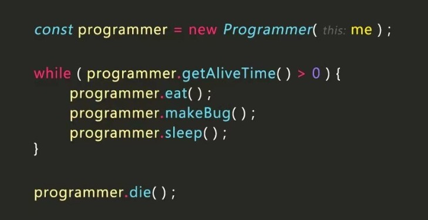

# AI Model Security Reading Notes

微笑，点头，记笔记 :sunflower::sunflower::sunflower::sunflower::sunflower::sunflower:

 

## Introduction

> 如果你有文章希望我看一下的，或者有文章想和我交流的，都可以写在 Issues 中.

学习和研究语音识别的对抗攻击已有一段时间，总是会发现自己没有一条连贯的思路，有时甚至会怀疑自己工作的重要性和成果。因此趁着细品 SoK 之余，梳理和综合一下模型安全性的相关工作。

这些工作可能包括 `语音的对抗攻击与防御`、`图像的对抗攻击与防御`、`自然语言处理的对抗攻击与防御`、`后门攻击与防御`、`模型鲁棒性的验证` 、`模型可解释性`等。由于个人研究方向和时间的限制，我会重点关注 <b>`语音的对抗攻击与防御`</b> 这个方向进行更新。

 

> 文档使用 `Typora` （这个软件bug有点多）编辑，无法保证在 `Github` 上完全正常显示，建议 `clone` 后在编辑器中阅读最佳，或者阅读 `pdf` 文件夹下的 PDF 文件；
>
> 标题前带有 `*` 的文章可以简略阅读；
>
> 文字中带有 <u>`下划线 `</u> 的部分是我个人的观点，请谨慎参考;
>
> 文档可能来不及二次检查，带有一些错误的拼写和观点，希望大家能够指正！

## Others' Work

- [attack-and-defense-methods](https://github.com/tao-bai/attack-and-defense-methods)：作者根据时间线列出了每年的 Attack & Defense 相关的工作；
- [Awesome AI Security](https://github.com/DeepSpaceHarbor/Awesome-AI-Security)：作者列出了 `AI 安全方向` 相关的一些可用的学习资源；
- [Awesome Real-world Adversarial Examples](https://github.com/lionelmessi6410/awesome-real-world-adversarial-examples)：作者总结了图像领域的物理对抗攻击相关的工作；
- [Adversarial ML Threat Matrix - Table of Contents](https://github.com/mitre/advmlthreatmatrix)：微软总结的 `AI安全方向` 的威胁矩阵；

## 老板(们)的尊尊教诲

- 陈老师：不要一门心思只盯着自己的领域，多看看其他领域的东西，有时候你觉得和你毫无关系的东西，可能就是最能启发你的东西；

- 陈老师：不要怕错，要敢于去试错，等你硕士三年毕业了，你尝试过的东西越多，和别人相比你的经验就越多，但是你要去思考怎样去减少试错的成本，比如说你就拿一个晚上、两个晚上去试错，那错了就错了，就当这两个晚上看剧了，要多动手，敢于动手；

- 陈老师：你写的东西，一定不能被别人找出毛病，比如说”我们发现啥啥啥“，这样不行，你要写的有理有据，不能让别人有反驳你的机会；

- 陈老师（<u>几句话总结出来的</u>）：你不用看特别多的论文，但你看的时候一定要去思考”这篇论文解决了一个什么问题？在它这个研究领域的贡献是什么“，只有提高到这个层次你才会对这个领域通透。另外，我们做的工作，也应该是在这个高层次上面去发挥，而不是就一个很细分的问题再去修修补补，这样没有意义；

- 晓峰老师：“Attack” 永远是问题的起点，而 “Defense” 才是问题的终点，起点和终点之间有很长的路要走；

- 陈老师：做事要多一点认真劲，尽量把每个细节、每个点都做好；你要看重自己的工作，要思考如何去展示自己的工作；

- 陈老师：你这手机（iphone 12）行不行，咱要不要换个专业点的相机；

- 陈老师：你们要去多投稿、多尝试啊，你就把你们投稿的过程比作黑盒探测，探测的次数越多，你对后面 Reviewer 的品味了解的越清楚，虽然啊，这后端的模型（Review）一直在变，但是他们的平均水平你还是可以了解到的；

- 陈老师：不要说“有时间再做”，而应该是你想做，然后花时间去做。另外啊，我觉得你底子还是非常好的，做的工作都很好，我希望你能有自己的成果，不要让这块金子埋没了；

- 陈老师：我们要培养一种能力，如何在有限时间内，做完一件事情；

  

## 前辈/大佬的指导

- 不管怎样，都要学习新的知识；（By weifengchiu）
- 你先不要只在这里想想法，去实现看看，很可能比你想象中的难实现多了，而且过程中你会有更多的想法；（By 何大佬）
- 我们做防御工作，不能说一下子就把全部的攻击都给干掉了，那是不可能。我们只能说，我们提出的这个防御方法，针对怎样的攻击，能够取得不错的效果，这就达到我们的目的了；（By jifengzhu）
- 感想：看了 jifengzhu（我的 Mentor）调研的 AI 安全报告，顿时眼前一亮，是一份能够直接给上层决策建议的好报告，看来我还有很多东西需要去学；
- 承担过多的工程，容易陷入连轴转的怪圈，满负荷工作绝对不是最好的一个状态；（By viking）
- 对朱雀要有一个认识，我们是一个实验室，就是要去不断尝试、试错的，我们要解决的是公司其他部门暂时没法去着手的方向；（By viking）

## 个人经历

- **哈尔滨工业大学（威海）**，软件工程，本科（2015~2019），校志愿者组织-海川社 副会长，校威软俱乐部 主席，从事 WEB 前端开发（熟练使用 Webpack 打包，React 组件化开发）；

- **中国科学院大学-信息工程研究所**，计算机技术，硕士研究生（2019-2022），师从陈恺老师、王晓峰老师，研究 AI 安全问题（主要研究语音对抗攻击，了解后门、神经网络可解释性）；
- **腾讯-安全平台部**，安全工程师，实习生（2022.6 - 至今），从事 AI 安全相关工作；