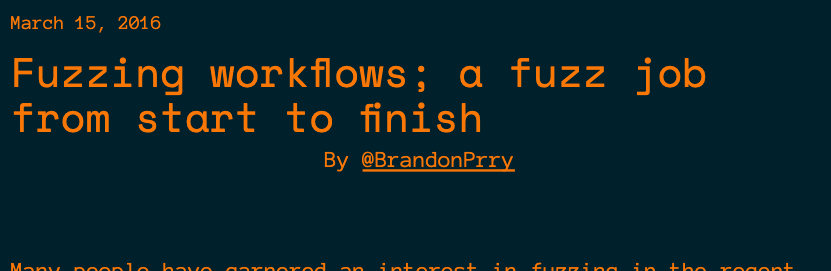
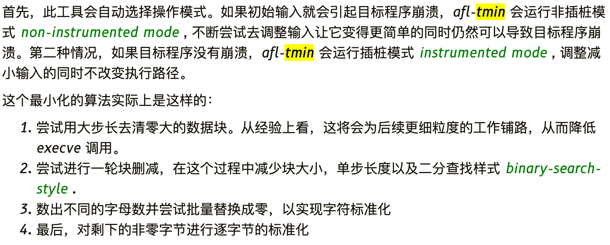
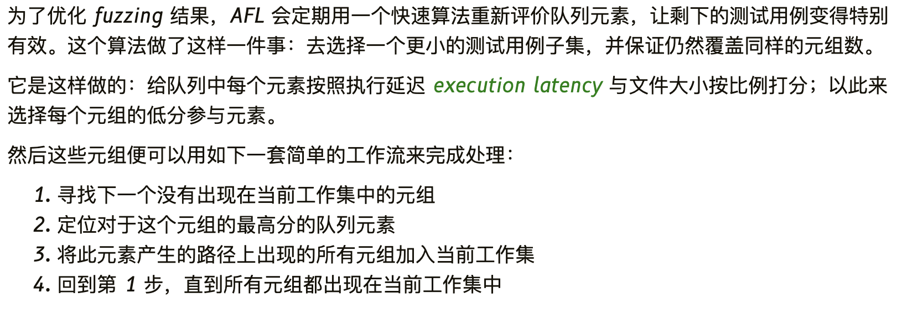

# Daily Study of Fuzz

> 从`README`可以发现我本身并不会传统安全相关技术，但是在室友的熏陶和公司项目（AI赋能安全相关）的支持下，我开始了我的Fuzz学习之旅。
>
> 我能感觉到，AI赋能安全必然会到来，作为一个AI安全的研究人员，我觉得不仅需要掌握AI内生安全的知识，同时应该掌握传统安全的知识。不过很遗憾，我们实验室现在在这两个方向上是相对孤立的，我作为AI内生安全的研究人员，被选择去支持AI赋能安全相关工作，得此契机，我决定鼓起勇气更加深入地学习一下Fuzz相关知识。我不期望我能像那些大佬一样，成为这个领域的专家，我的目标是，传统安全的专家给我一个攻击点，我能对这个方向有一定的认识，从而发现其与AI之间的结合点。
>
> 当然，我最近也在思考，对于一家企业，AI安全能力在软件开发流程（模型部署）的最佳实践位置，如何能够保证AI的安全性，又不会改变原有的软件开发流程，不增加开发人员的工作量。
>
> 一起加油吧，Ceres！


## Learning Path

### Day 1

#### Notes



学习链接：https://foxglovesecurity.com/2016/03/15/fuzzing-workflows-a-fuzz-job-from-start-to-finish/

该链接主要使用 `AFL++` 来对 `YAML-CPP` 工程进行 Fuzz，**最新版本的 `YAML-CPP` 好像没有 Crash**，效果复现不出来，后面换到博主提供的版本继续复现博主的实验。

[@BrandonPrry](https://twitter.com/BrandonPrry) 在博客中分享了一个通过并行加快 `afl-tmin` 的工具，将其成为 `afl-ptmin` ，其代码如下：

```bash
#!/bin/bash
cores=$1
inputdir=$2
outputdir=$3
pids=""
total=`ls $inputdir | wc -l`

for k in `seq 1 $cores $total`
do
  for i in `seq 0 $(expr $cores - 1)`
  do
    file=`ls -Sr $inputdir | sed $(expr $i + $k)"q;d"`
    echo $file
    afl-tmin -i $inputdir/$file -o $outputdir/$file -- ~/parse &
  done

  wait
done
```

#### 思考问题

- Fuzz是什么，主要的流程是什么，关键点是什么？ ❓
- `AFL` 的原理？它和还有一些 Fuzz 工具有什么异同点？ ❓
- `afl-cmin` 和 `afl-tmin` 两个工具他们的区别的是什么？ ✅
- GDB 插件 `exploitable` 和 `CrashWalk` 分别是什么作用？ ❓
- `afl-cov` 是如何实现的？使用的时候出现报错是为什么？❓


### Day 2

#### Notes

解决问题： `afl-cmin` 和 `afl-tmin` 两个工具他们的区别的是什么？

参考链接：https://xidoo.top/2022/01/afl-white-book/   （参考这篇博客，能对 `afl-tmin` 和 `afl-cmin` 两个工具有个大概的认知）

参考链接：[AFL漏洞挖掘技术漫谈（一）：用AFL开始你的第一次Fuzzing](https://www.freebuf.com/vuls/191536.html)

##### `afl-tmin` 工具

`afl-tmin` 在保证测试用例的代码执行路径不变的情况下，尽可能地减小测试用例的大小。



##### `afl-cmin` 工具

`afl-cmin` 在保证所有测试用例覆盖的代码执行路径不变的情况下，尽可能地减少测试用例的数量；



#### 思考问题

- 是否需要从源码级别对 `afl-tmin` 和 `afl-cmin` 两个工具有一定了解？这两个工具是否有优化的可能性和必要？✅

  网上关于这两个工具的讨论非常得少，所以暂时不在这一块下功夫。

- 黑盒模式是如何实现的？ ❓

- 什么是插装，如何实现的？ ❓

- `gcc` 和 `llvm` 两种编译模式的区别，为什么 `llvm` 的编译速度快很多？ ❓


### Day 3

#### Notes

解决问题：如何使用 `afl-fuzz	` 对网络传输应用进行模糊测试？

参考链接：https://www.secpulse.com/archives/71903.html

主要利用 `preeny` 对输入进行重定向，将 `stdin` 中的输入重定向到 `sock` 的输入，从而配合 `afl-fuzz` 对网络传输应用进行模糊测试。

复现时遇到的问题：

1. 按照作者的步骤进行复现，发现最后的模糊测试样例

#### 思考问题

- `LD_PRELOAD` 环境变量的作用是什么？ ✅

  参考链接：https://blog.csdn.net/iEearth/article/details/49952047

  主要用于动态的加载；

- `afl-fuzz` 的原理？  ✅

- 污点分析的原理和作用？  ❓

- `afl` 的 `persistent` 模式详解？  ❓


### Day 4

#### Notes

解决问题：`afl-fuzz` 的原理？

参考链接：https://jackfromeast.site/2021-02/AFL-FUZZ.html

参考链接：https://www.jianshu.com/p/2da850f32b2d

(<u>这个问题比较复杂，现阶段主要通过博客了解一些基本的原理，后续再仔细阅读</u>) 上面两篇博客主要介绍了 **`afl` 的路径覆盖率的计算**和**`fuzz-server` 模式**；

对 `afl` 的原理有了基本的认识，后面还需要阅读 `afl` 的 `readme` 文件来增加对这方面的认识；

####  思考问题

- `afl-fuzz` 的 `fuzz-server` 模式是如何节省程序调用的资源的？ ❓
- `C++` 的管道通信机制？ ❓


### Day 5

#### Notes

#### 思考问题

