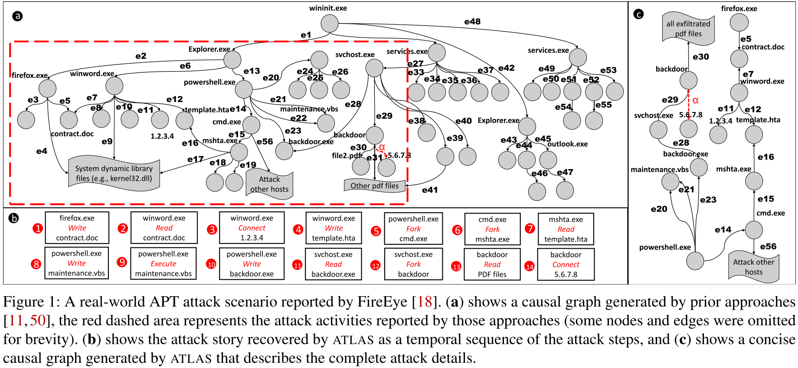
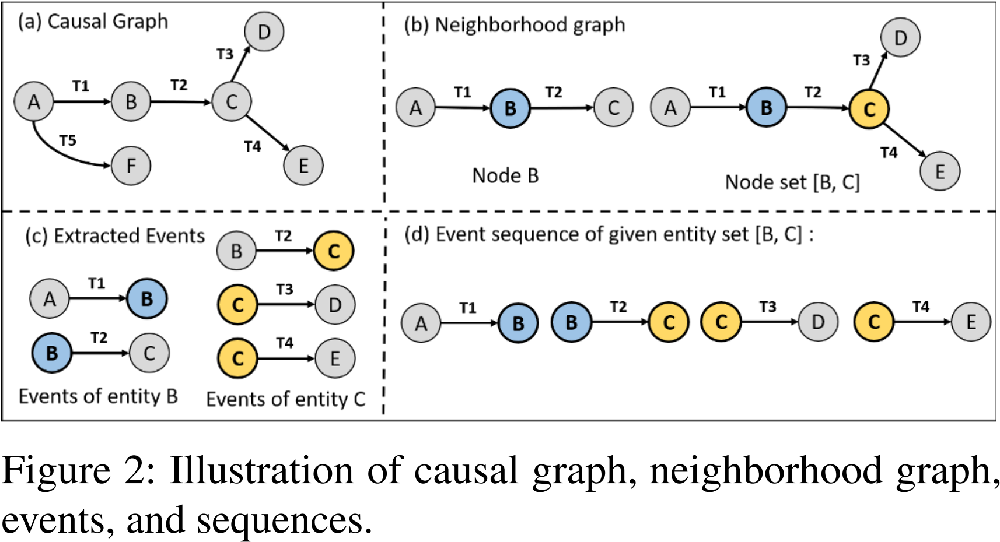

# Traditional Security with AI

[TOC]

## ATLAS: A Sequence-based Learning Approach for Attack Investigation

### Contribution

### Notes

1. APT 攻击

2. 文章目的

   

3. 图到序列的转换

   

4. 

### Links

- 论文链接：